# 第十九章 流程图汇总

> 本章汇总操盘列表各章节的核心流程图，便于快速查阅。每张图标注来源章节，采用 Mermaid 语法绘制。

---

## 19.1 操盘列表整体业务流程（来源：第1章）

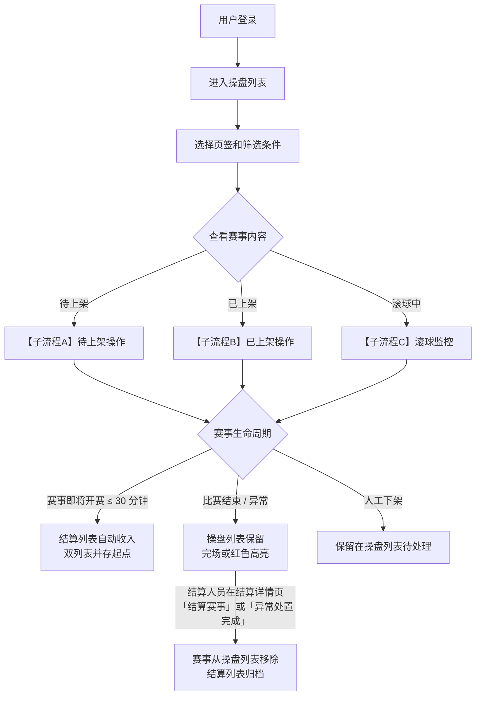

### 子流程A：待上架操作

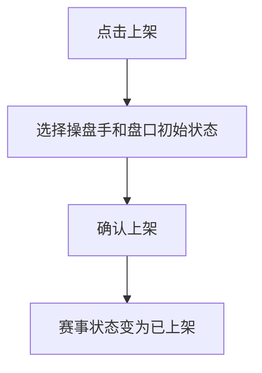

### 子流程B：已上架操作

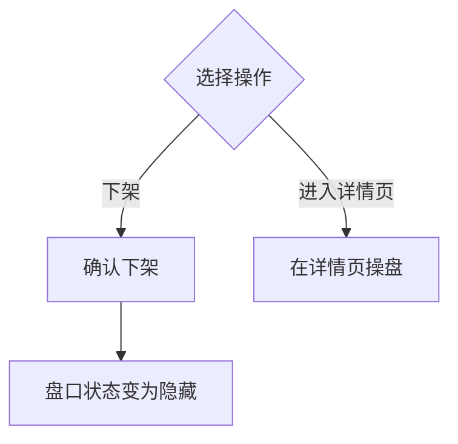

### 子流程C：滚球监控

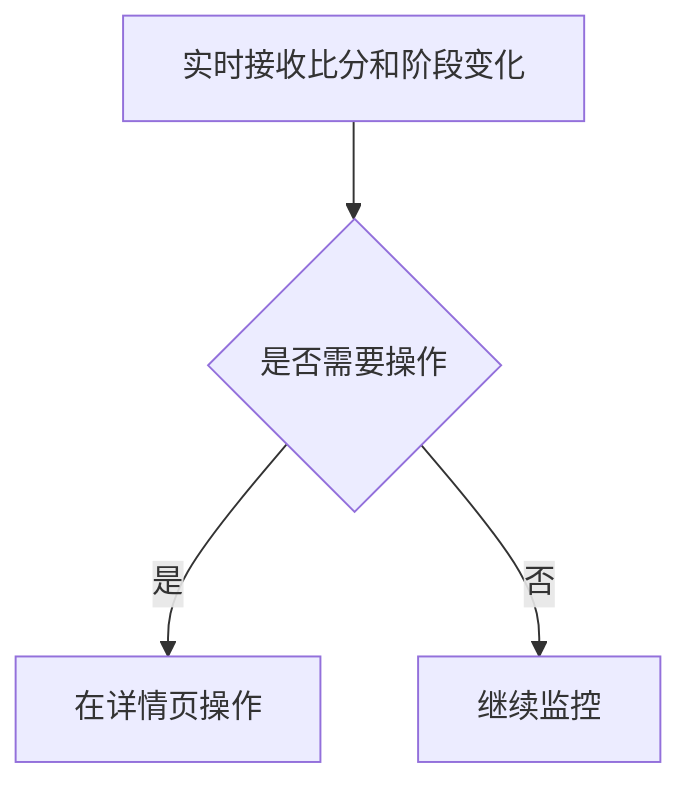

**说明**：
- 操盘列表是操盘手的主工作场景，负责赛事上架、监控、状态管理
- 双列表并存起点 = 即将开赛（距开赛 ≤ 30 分钟）；比赛结束或异常时赛事**保留在操盘列表**，由结算人员在结算详情页主动处置并点击「结算赛事」或完成异常处置后才从操盘列表移除
- 盘口详细操作（隐藏/锁盘等）在赛事详情页进行，不在列表页

---

## 19.2 批量操作流程（来源：第6章）

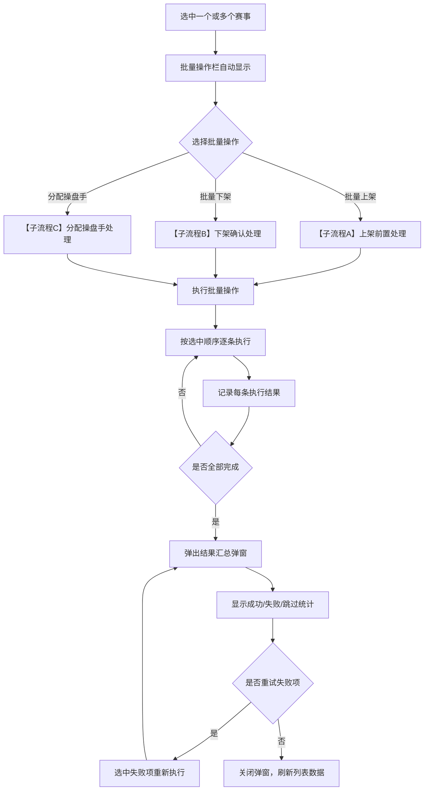

### 子流程A：上架前置处理

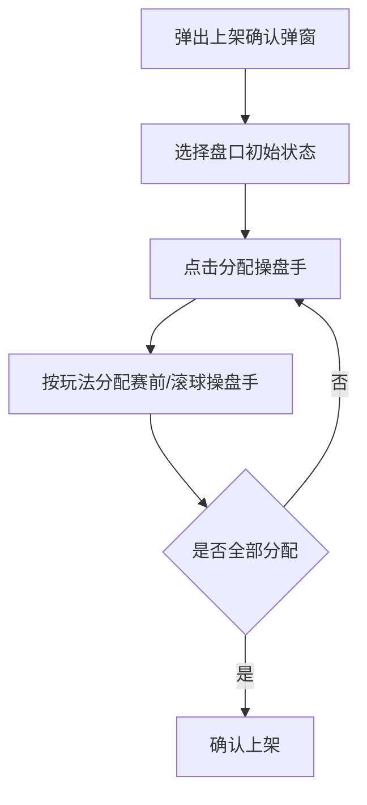

### 子流程B：下架确认处理

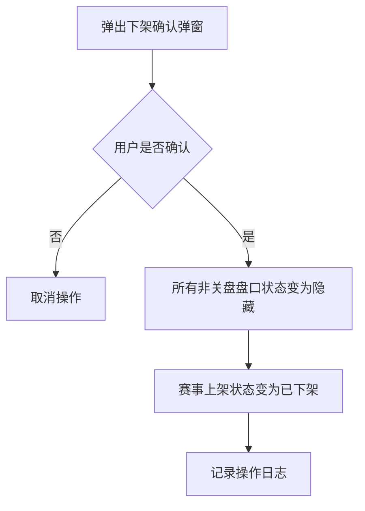

### 子流程C：分配操盘手处理

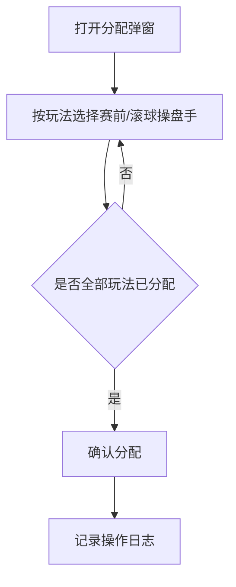

**说明**：
- 批量操作采用"尽量成功"策略，允许部分成功、部分失败、部分跳过
- 上架时必须完成操盘手分配（全部玩法的赛前和滚球均需分配）
- 失败原因分类包括状态已变更、权限不足、联赛暂停等，部分可重试
- 执行过程中显示进度反馈，完成后汇总展示详细结果

---

## 19.3 上架状态流转图（来源：第10章）

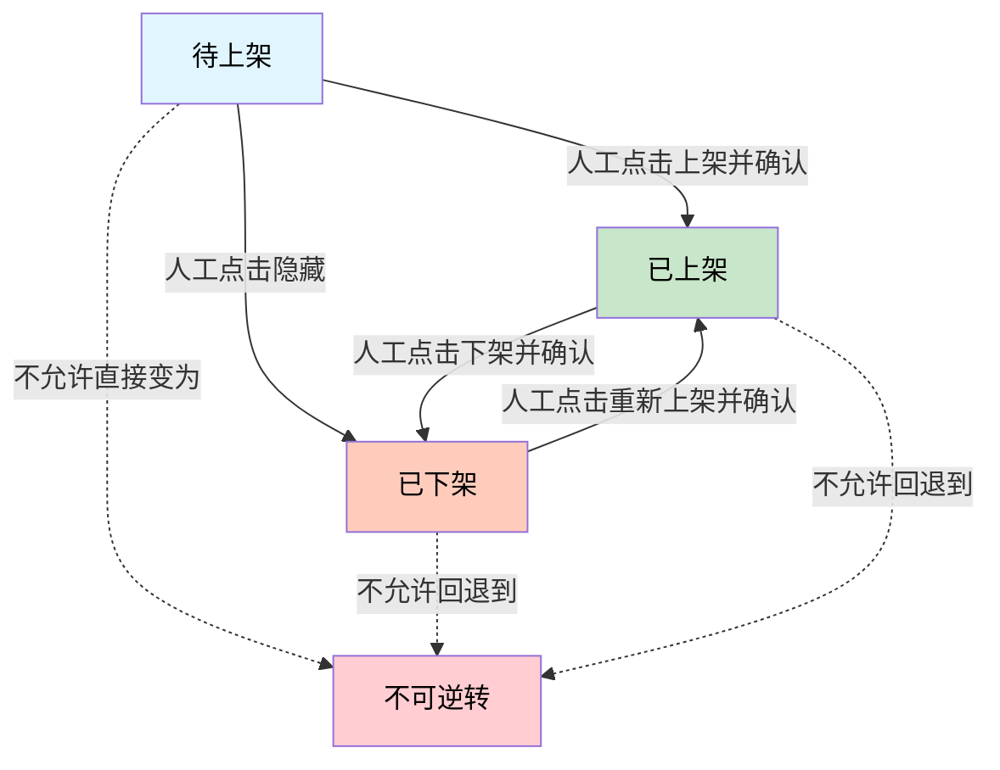

**说明**：
- 上架状态由本地操作驱动，表示赛事的展示状态
- 待上架→已上架：必须选择操盘手和盘口初始状态（跟随数据源、锁定或隐藏）
- 已上架→已下架：盘口状态自动变为隐藏（客户端不可见，需先上架才能恢复）
- 已下架→已上架：需重新选择盘口初始状态，不继承下架前状态
- 下架→待上架、已上架→待上架均不允许（不可逆）

---

## 19.4 单场操作流程（来源：第11章）

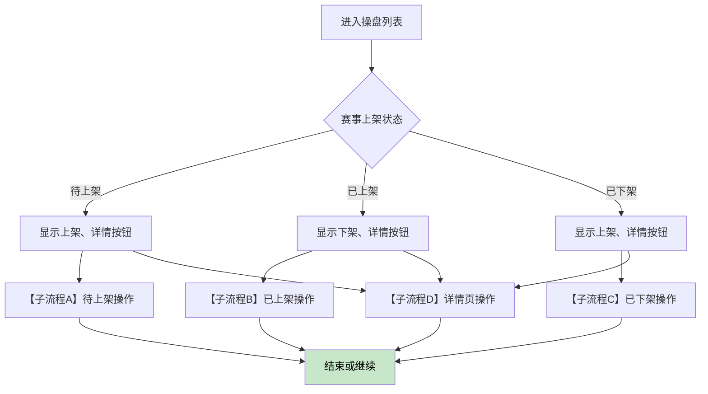

### 子流程A：待上架操作

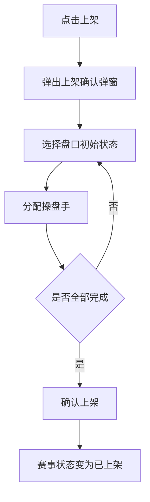

### 子流程B：已上架操作

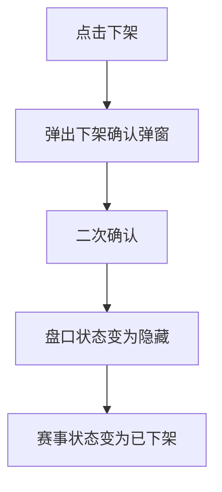

### 子流程C：已下架操作


### 子流程D：详情页操作

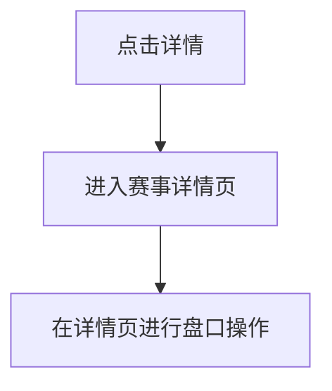

**说明**：
- 列表页仅提供上架/下架操作，盘口操作（隐藏/锁盘等）统一在详情页
- 上架时必须选择操盘手（普通手自动为自己，主管可分配任意人）
- 下架操作强制隐藏盘口（客户端不可见），需先上架才能恢复
- 延期赛事特殊处理：已上架允许下架，待上架禁止上架

---

## 19.5 WebSocket 重连与数据同步流程（来源：第13章）

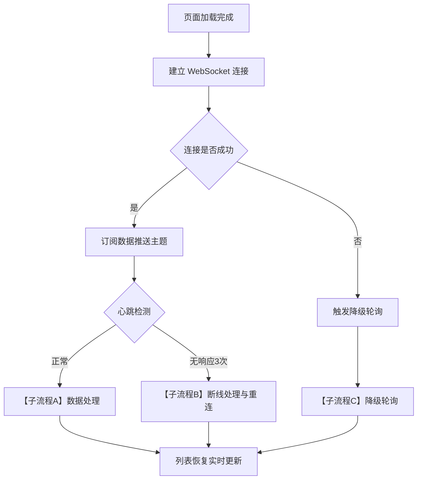

### 子流程A：数据处理

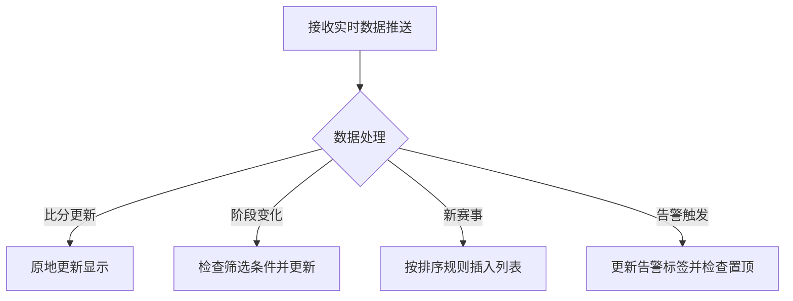

### 子流程B：断线处理与重连

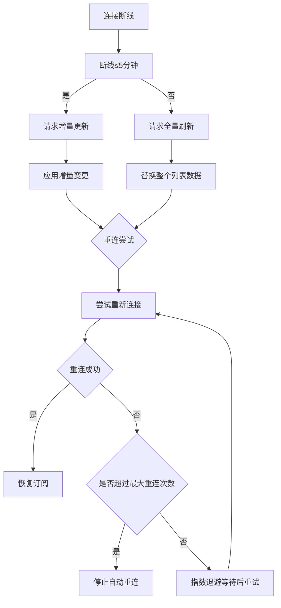

### 子流程C：降级轮询

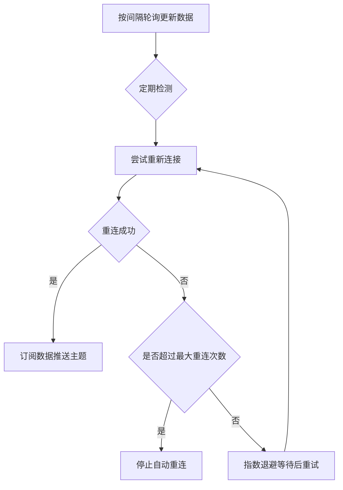

**说明**：
- 主要通信方式：WebSocket 长连接（30秒心跳）
- 备用方式：断线后自动降级为定时轮询（滚球3秒、即将10秒、赛前30秒）
- 重连策略：指数退避（1秒→2秒→4秒→8秒→16秒→30秒），最多5次
- 断线5分钟内用增量同步，超过5分钟用全量刷新
- 订阅策略：不同Tab订阅不同主题，减少不必要的数据传输

---

## 19.6 异常处理决策树（来源：第14章）

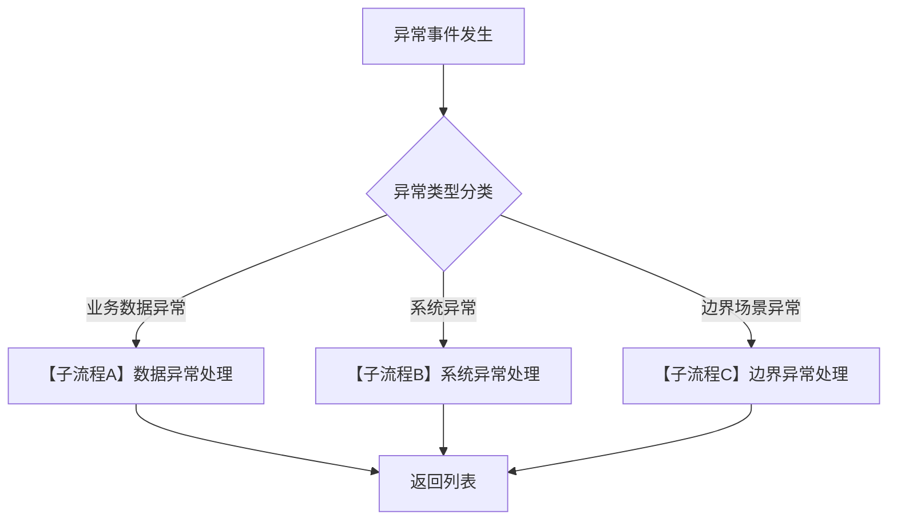

### 子流程A：数据异常处理

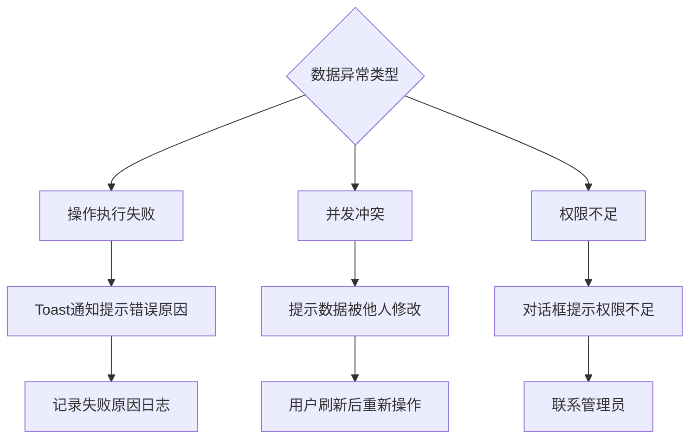

### 子流程B：系统异常处理

```mermaid
graph TD
    A{系统异常类型} --> B["数据加载失败"] --> B1[显示错误提示加重试按钮]
    A --> C["网络超时"] --> C1[显示网络异常横幅]
    A --> D["服务器错误"] --> D1[显示暂时不可用提示]
    B1 --> E[用户选择重试或放弃]
    C1 --> F[用户检查网络后重试]
    D1 --> G[稍后重试]
```

### 子流程C：边界异常处理

```mermaid
graph TD
    A{边界异常类型} --> B["上架时赛事进入滚球"] --> B1[二次确认是否继续]
    A --> C["解锁时数据源状态异常"] --> C1{数据源状态}
    B1 --> B2{用户确认}
    B2 -->|是| B3[继续执行操作]
    B2 -->|否| B4[取消操作]
    C1 -->|开盘| C2[正常恢复]
    C1 -->|暂停| C3[开盘状态，C端显示暂停投注]
    C1 -->|维护| C4[强制隐藏]
    C1 -->|关盘| C5[阻止操作]
```

**说明**：
- 错误处理遵循用户友好原则，提供具体错误提示和建议操作
- 并发冲突采用乐观锁机制，版本号校验失败后需刷新重试
- 上架/下架时序边界：状态变更会在操作过程中发生，需要边界处理
- 数据源异常：维护和关盘不受跟随配置影响，暂停时本地状态不变，仅C端展示

---

## 19.7 联赛状态变更联动流程（来源：第16章）

```mermaid
graph TD
    A[联赛状态发生变更] --> B{新状态是什么}
    B -->|关盘| C["【子流程A】联赛关盘处理"]
    B -->|暂停| D["【子流程B】联赛暂停处理"]
    B -->|恢复| E["【子流程C】联赛恢复处理"]
    C --> F[结束处理]
    D --> F
    E --> F
```

### 子流程A：联赛关盘处理

```mermaid
graph TD
    A[处理该联赛下的赛事] --> B{赛事上架状态}
    B -->|待上架| B1[禁止上架]
    B -->|赛前已上架| B2[自动下架]
    B -->|即将/滚球已上架| B3[弹出确认对话框]
    B -->|已下架| B4[无影响]
    B3 --> B3a{用户选择}
    B3a -->|下架| B3b[执行下架]
    B3a -->|保持| B3c[保持上架，隐藏盘口]
    B1 --> C[记录操作日志]
    B2 --> C
    B3b --> C
    B3c --> C
    B4 --> C
```

### 子流程B：联赛暂停处理

```mermaid
graph TD
    A[处理该联赛下的赛事] --> B{赛事上架状态和盘口状态}
    B -->|待上架| B1[禁止上架]
    B -->|已上架且开盘| B2[盘口隐藏]
    B -->|已上架且高优先级隐藏| B3[保持原隐藏来源]
    B -->|已上架且锁定| B4[保持锁定]
    B1 --> C[记录隐藏来源和日志]
    B2 --> C
    B3 --> C
    B4 --> C
```

### 子流程C：联赛恢复处理

```mermaid
graph TD
    A[恢复该联赛下的赛事] --> B{检查隐藏来源}
    B -->|league_pause或league_close| C[根据数据源决定恢复]
    B -->|其他来源| D[保持原隐藏来源]
    C --> E{数据源当前状态}
    E -->|开盘| E1[恢复为开盘]
    E -->|暂停| E2[恢复为开盘，C端因IM暂停显示暂停投注]
    E -->|维护| E3[保持隐藏]
    E -->|关盘| E4[盘口变为关盘]
    D --> F[发送通知]
    E1 --> F
    E2 --> F
    E3 --> F
    E4 --> F
```

**说明**：
- 联赛状态变更是联赛级的风控操作，影响该联赛下所有赛事
- 联赛关盘：赛前自动下架，即将/滚球需二次确认
- 联赛暂停：已开盘盘口隐藏，已有高优先级隐藏的保持原来源
- 联赛恢复：根据隐藏来源决定恢复方式
- 隐藏来源优先级：人工隐藏 > 风控隐藏 > 联赛暂停

---

## 19.8 排序优先级判定流程（来源：第17章）

```mermaid
graph TD
    A[获取当前排序方式] --> B{用户选择的排序方式}
    B -->|联赛分组| C["【子流程A】联赛分组排序"]
    B -->|开赛时间| D["【子流程B】开赛时间排序"]
    B -->|投注额| E["【子流程C】投注额排序"]
    B -->|风险程度| F["【子流程D】风险程度排序"]
    C --> G[排序后获得赛事列表]
    D --> G
    E --> G
    F --> G
    G --> H["【子流程E】置顶优先级判定"]
    H --> I[展示最终列表]
```

### 子流程A：联赛分组排序

```mermaid
graph TD
    A[第一层：按联赛等级排序] --> B[等级1 > 等级2 > ... > 等级10 > 默认]
    B --> C[同等级按联赛编号排序]
    C --> D[第二层：组内按开赛时间升序]
```

### 子流程B：开赛时间排序

```mermaid
graph TD
    A[按开赛时间升序排列]
```

### 子流程C：投注额排序

```mermaid
graph TD
    A[按投注额降序排列]
```

### 子流程D：风险程度排序

```mermaid
graph TD
    A[按单边比例降序排列]
```

### 子流程E：置顶优先级判定

```mermaid
graph TD
    A{检查置顶条件} --> B["待上架且滚球"] --> B1[置顶优先级1]
    A -->|待上架且10分钟内| B2[置顶优先级2]
    A -->|单边超限| B3[置顶优先级3]
    A -->|大额投注| B4[置顶优先级4]
    A -->|延期超时150%+| B5[置顶优先级5]
    A -->|不符合置顶条件| B6[保持普通排序]
    B1 --> C[将赛事移入置顶区]
    B2 --> C
    B3 --> C
    B4 --> C
    B5 --> C
    B6 --> D[保持普通排序位置]
    C --> E{置顶区内相同优先级}
    E -->|是| F[按开赛时间排序]
    F --> G[返回排序结果]
    D --> G
```

**说明**：
- 排序优先级按层级判定：先判断排序方式
- 联赛分组默认方式：S>A>B>C等级，同级按编号，组内按开赛时间
- 置顶规则与排序独立：置顶赛事显示在最上方
- 置顶解除：待上架到已上架、单边降到阈值以下时自动移出
- 已下架赛事不触发置顶

---

## 19.9 数据源暂停C端展示流程（来源：第16章 v1.8）

```mermaid
graph TD
    A[数据源推送暂停状态] --> B{联赛跟随配置}
    B -->|跟随=是| C["【子流程A】跟随=是暂停处理"]
    B -->|跟随=否| D["【子流程B】跟随=否暂停处理"]
    C --> E[等待数据源恢复推送]
    D --> E
    E --> F{数据源是否恢复}
    F -->|是| G["【子流程C】恢复后C端状态决定"]
    F -->|否| H[继续暂停状态]
```

### 子流程A：跟随=是暂停处理

```mermaid
graph TD
    A[本地状态保持不变] --> B[C端盘口灰显]
    B --> C[显示暂停投注]
    C --> D[不接受投注]
    D --> E[无额外告警提示]
```

### 子流程B：跟随=否暂停处理

```mermaid
graph TD
    A[本地状态保持不变] --> B[C端盘口灰显]
    B --> C[显示暂停投注]
    C --> D[不接受投注]
    D --> E[告警列显示数据源暂停]
```

### 子流程C：恢复后C端状态决定

```mermaid
graph TD
    A[本地状态保持不变] --> B{本地状态是什么}
    B -->|开盘| C[C端恢复可投注]
    B -->|锁定| D[C端保持暂停投注]
    B -->|隐藏| E[C端保持不可见]
    C --> F[恢复操作流程]
    D --> F
    E --> F
```

**说明**：
- **核心原则**：IM暂停不改变本地盘口状态，仅影响C端展示
- **跟随=是**：C端灰显暂停投注，自动恢复时C端自动恢复，无额外告警
- **跟随=否**：C端灰显暂停投注，告警列显示「数据源暂停」
- **本地状态不变**：开盘/隐藏/锁定状态在暂停期间保持原样
- **服务端校验**：投注时以服务端状态为准

---

## 19.10 状态覆盖优先级决策流程（来源：第16章）

```mermaid
graph TD
    A[盘口面临多个触发源] --> B{优先级判定}
    B -->|优先级1：数据源关盘| C1["【子流程A】关盘处理"]
    B -->|优先级2-5| C2["【子流程B】中高优先级处理"]
    B -->|优先级6-7| C3["【子流程C】低优先级处理"]
    C1 --> E[更新C端显示]
    C2 --> E
    C3 --> E
```

### 子流程A：关盘处理

```mermaid
graph TD
    A[数据源关盘] --> B[强制变为关盘]
    B --> C[最终状态=关盘]
    C --> D[不可逆]
```

### 子流程B：中高优先级处理

```mermaid
graph TD
    A{优先级判定} --> B["优先级2：人工锁定"]
    A --> C["优先级3：风控隐藏"]
    A --> D["优先级4：联赛暂停/关盘"]
    A --> E["优先级5：数据源维护"]

    B --> B1{是否有更高优先级}
    B1 -->|数据源关盘| B1a[按关盘处理]
    B1 -->|无| B1b[保持锁定]

    C --> C1{是否有更高优先级}
    C1 -->|人工锁定或数据源关盘| C1a[按更高优先级处理]
    C1 -->|无| C1b[需解除风控条件]

    D --> D1{是否有更高优先级}
    D1 -->|人工锁定或数据源关盘| D1a[按更高优先级处理]
    D1 -->|无| D1b[联赛恢复后自动取消隐藏]

    E --> E1[C端暂停投注，维护结束后自动恢复]
```

### 子流程C：低优先级处理

```mermaid
graph TD
    A{优先级判定} --> B["优先级6：数据源恢复"]
    A --> C["优先级7：人工隐藏/取消隐藏"]

    B --> B1[恢复为开盘或隐藏]

    C --> C1[隐藏/开盘]
    C1 --> C2[可被更高优先级覆盖]

    B1 --> D[最终状态确定]
    C2 --> D
```

**说明**：
- 优先级规则确保数据源关盘无法被本地操作覆盖
- 人工锁定必须人工解锁，数据源推送无法改变（除关盘外）
- 风控隐藏可在风控条件解除后自动恢复
- 联赛暂停/关盘是联赛级控制，低于人工锁定优先级
- 数据源恢复和人工操作优先级最低

---

## 修订记录

| 版本 | 日期       | 修订内容                                                                                |
| ---- | ---------- | --------------------------------------------------------------------------------------- |
| v1.0 | 2026-02-11 | 初稿。汇总操盘列表1-17章的10个核心流程（整体业务、批量操作、上架流转、单场操作、WebSocket重连、异常处理、联赛联动、排序置顶、数据源暂停C端展示、状态覆盖优先级） |
