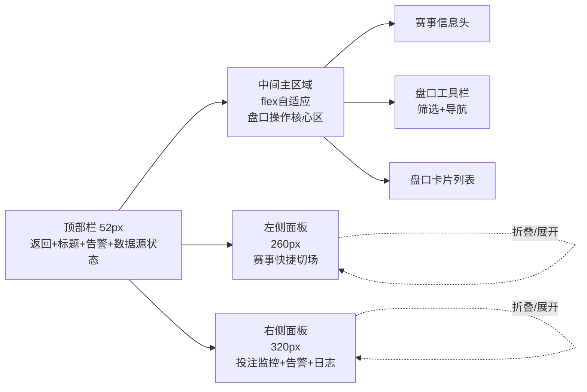
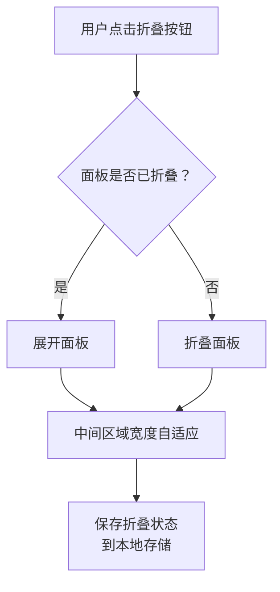

# 第二章 页面结构

## 2.1 布局设计的出发点

操盘详情页与操盘列表的工作模式完全不同。操盘列表是"扫一眼、批量处理"，操盘详情页是"深入单场、精细操作"。这决定了两个页面的布局思路截然不同：

| 页面       | 工作模式         | 布局思路               |
| ---------- | ---------------- | ---------------------- |
| 操盘列表   | 快速扫描多场赛事 | 表格为主，信息密度高   |
| 操盘详情页 | 深入单场精细操盘 | 三栏并行，功能分区明确 |

操盘详情页的操盘手有三个并行需求：

**需求一：快速切换赛事**

操盘手同时负责多场比赛，需要在不同赛事间快速切换。但切换是"辅助动作"，不是主要工作。所以赛事列表放在左侧作为快捷入口，宽度较窄。

**需求二：专注当前赛事的盘口操作**

这是核心工作——调赔、控制状态、监控投注分布。所有盘口信息和操作都在中间区域完成，占据页面最大空间。

**需求三：实时监控投注和告警**

操盘过程中需要随时关注：有没有大单进来？单边比例是否异常？数据源是否正常？这些信息放在右侧，持续可见但不干扰主操作。

基于这三点，我们采用**三栏布局**：

---

## 2.2 三栏布局结构图

```
┌─────────────────────────────────────────────────────────────────────────┐
│  顶部栏 (52px)：返回 + 页面标题 + 告警摘要 + 数据源状态 + 设置          │
├─────────────────────────────────────────────────────────────────────────┤
│                                                                          │
│  ┌──────────┬─────────────────────────────────────────┬──────────────┐  │
│  │          │                                         │              │  │
│  │  左侧    │            中间主区域                    │    右侧      │  │
│  │  面板    │                                         │    面板      │  │
│  │          │  ┌─────────────────────────────────┐   │              │  │
│  │  赛事    │  │  赛事信息头                      │   │  投注监控    │  │
│  │  快捷    │  ├─────────────────────────────────┤   │  Tab         │  │
│  │  切场    │  │  盘口工具栏（筛选+导航）          │   │              │  │
│  │  侧栏    │  ├─────────────────────────────────┤   │  告警Tab     │  │
│  │          │  │                                 │   │              │  │
│  │  260px   │  │  盘口卡片列表                    │   │  日志Tab     │  │
│  │          │  │  （可滚动）                      │   │              │  │
│  │  可折叠  │  │                                 │   │  320px       │  │
│  │          │  │                                 │   │  可折叠      │  │
│  │          │  └─────────────────────────────────┘   │              │  │
│  │          │                                         │              │  │
│  └──────────┴─────────────────────────────────────────┴──────────────┘  │
│                                                                          │
└─────────────────────────────────────────────────────────────────────────┘
```

#### 三栏布局Mermaid结构图



---

## 2.3 三栏职责定义

| 区域       | 宽度              | 功能定位        | 可折叠 | 核心内容                             |
| ---------- | ----------------- | --------------- | ------ | ------------------------------------ |
| 左侧面板   | 260px             | 赛事快捷切场    | ✓      | 赛事搜索、赛事卡片列表、玩法导航     |
| 中间主区域 | flex: 1（自适应） | 盘口操作核心区  | ✗      | 赛事信息头、盘口工具栏、盘口卡片列表 |
| 右侧面板   | 320px             | 投注监控 + 告警 | ✓      | 投注流Tab、告警Tab、日志Tab          |

**设计原则**：中间区域永远不可折叠，这是操盘手的主战场。左右两侧面板可折叠，折叠后中间区域自动扩展，获得更大操作空间。

---

## 2.4 顶部栏模块

顶部栏高度固定52px，包含以下元素：

| 元素         | 位置 | 功能说明                                     |
| ------------ | ---- | -------------------------------------------- |
| 返回按钮     | 左侧 | 返回操盘列表页，保留列表页筛选条件和滚动位置 |
| 页面标题     | 左侧 | 显示"操盘中心"标识                           |
| 当前赛事信息 | 左侧 | 显示当前操盘赛事：联赛名 + 主队 vs 客队      |
| 告警摘要     | 右侧 | 按级别分开显示告警数量（P0: 2, P1: 5）       |
| 数据源状态   | 右侧 | IM连接状态 + 延迟显示（如：🟢 IM 23ms）      |
| 刷新按钮     | 右侧 | 手动刷新全部数据                             |
| 设置按钮     | 右侧 | 打开设置弹窗                                 |

> **告警级别映射说明**（与操盘列表09章9.11节对齐）：
>
> - **P0级（严重/红色）**：最紧急(1)、紧急(2)、单边超限(3)、延期超时100%+(5)
> - **P1级（警告/橙色）**：大额投注(4)、比赛暂停(6)、数据源暂停(7)、延期超时80%
> - **P2级（提示/蓝紫）**：数据源维护(8)、数据延迟(9)、未分配(10)、中立场(11)
>
> 括号内数字为告警优先级，级别按业务语义分类（非严格按优先级数值）。

### 数据源状态指示

| 状态 | 图标 | 颜色 | 说明                  |
| ---- | ---- | ---- | --------------------- |
| 正常 | 🟢   | 绿色 | 连接正常，延迟小于1秒 |
| 延迟 | 🟡   | 黄色 | 连接正常，延迟1-3秒   |
| 异常 | 🔴   | 红色 | 连接断开或延迟超过3秒 |

---

## 2.5 左侧面板——赛事快捷切场侧栏

### 2.5.1 面板结构

```
┌────────────────────────┐
│  赛事列表    [折叠按钮] │  ← 面板头部
├────────────────────────┤
│  🔍 搜索赛事...         │  ← 搜索框
├────────────────────────┤
│  ▼ 滚球中 (5)           │  ← 分组标题
│  ┌──────────────────┐  │
│  │ 曼城 vs 利物浦    │  │  ← 赛事卡片（当前选中）
│  │ 45' | 1-0        │  │
│  │ 🔴P0 🟠P1×2      │  │
│  └──────────────────┘  │
│  ┌──────────────────┐  │
│  │ 皇马 vs 巴萨      │  │  ← 赛事卡片
│  │ 23' | 0-0        │  │
│  └──────────────────┘  │
├────────────────────────┤
│  ▶ 即将开赛 (3)         │  ← 分组折叠
├────────────────────────┤
│  ▶ 赛前 (8)             │  ← 分组折叠
└────────────────────────┘
```

### 2.5.2 赛事卡片信息

| 信息项   | 说明                                 |
| -------- | ------------------------------------ |
| 对阵双方 | 主队 vs 客队                         |
| 比赛进程 | 滚球显示时间和比分；赛前显示开赛时间 |
| 告警标识 | 有告警时显示告警级别徽章             |
| 选中状态 | 当前操盘的赛事高亮显示               |

### 2.5.3 赛事分组规则

| 分组     | 包含赛事               | 默认状态 |
| -------- | ---------------------- | -------- |
| 滚球中   | 比赛进行中的赛事       | 展开     |
| 即将开赛 | 开赛前30分钟内的赛事   | 展开     |
| 赛前     | 开赛前30分钟以上的赛事 | 折叠     |

> **「即将开赛」vs「紧急」区分**：
> - **即将开赛（比赛进程）**：≤ 30分钟，用于Tab筛选、分组显示
> - **紧急阈值（一键锁盘/置顶）**：≤ 10分钟，用于一键锁盘范围、置顶规则、紧急告警触发
> - 详见[操盘列表第9章9.11.7节](../trading-list/09-数据字段定义.md#_9-11-7-全局阈值速查表)

### 2.5.4 玩法导航区

**重要说明**：玩法导航区不在左侧面板内，而是位于**中间区域盘口工具栏的第二行**。

| 元素     | 说明                             |
| -------- | -------------------------------- |
| 玩法标签 | 显示玩法名称（如"让球"、"大小"） |
| 告警标识 | 有告警的玩法显示红点             |
| 点击行为 | 点击后中间区域滚动到对应盘口卡片 |

---

## 2.6 中间主区域——盘口操作核心区

中间区域是操盘详情页的核心，从上到下分为三个部分：

### 2.6.1 赛事信息头

| 信息项     | 说明                               |
| ---------- | ---------------------------------- |
| 联赛名称   | 如"英格兰超级联赛"                 |
| 对阵双方   | 主队名称 vs 客队名称               |
| 比分       | 滚球时显示实时比分                 |
| 比赛时间   | 滚球显示进行时间；赛前显示开赛时间 |
| 比赛状态   | 滚球/赛前/中场休息/已结束          |
| 赛事级操作 | 赛事级状态控制按钮（开/隐/锁/关）  |

### 2.6.2 盘口工具栏

| 元素              | 功能                                 |
| ----------------- | ------------------------------------ |
| 玩法筛选器        | 下拉选择显示特定玩法类型             |
| 状态筛选器        | 筛选特定状态的盘口（开盘/隐藏/锁定） |
| 搜索框            | 搜索玩法名称或盘口线                 |
| 展开全部/收起全部 | 批量控制所有盘口卡片的展开状态       |

### 2.6.3 盘口卡片列表

盘口以卡片形式垂直排列，每个玩法一张卡片。卡片按玩法优先级排序（让球、大小、独赢优先显示）。详细规范见第六章。

---

## 2.7 右侧面板——投注监控与告警

### 2.7.1 面板结构

右侧面板采用Tab切换方式，包含2个Tab：

| Tab    | 功能         | 核心内容                                 |
| ------ | ------------ | ---------------------------------------- |
| 投注流 | 实时投注监控 | 时间、用户、玩法、选项、赔率、金额、状态 |
|        |              |                                          |
|        |              |                                          |

### 2.7.2 投注流Tab

| 字段 | 说明                       |
| ---- | -------------------------- |
| 时间 | 投注时间（精确到秒）       |
| 用户 | 用户ID（脱敏显示）         |
| 玩法 | 投注的玩法名称             |
| 选项 | 投注的选项                 |
| 赔率 | 下注时的赔率（港赔HK格式） |
| 金额 | 投注金额                   |
| 状态 | 已接受/待确认/已拒绝       |

###

## 2.8 折叠机制

### 2.8.1 折叠状态定义

| 面板     | 展开宽度 | 折叠宽度 | 折叠后显示              |
| -------- | -------- | -------- | ----------------------- |
| 左侧面板 | 260px    | 48px     | 折叠按钮图标            |
| 右侧面板 | 320px    | 48px     | 告警数量徽章 + 折叠按钮 |

### 2.8.2 折叠状态切换流程



~~### 2.8.3 折叠状态保存~~

### 2.8.4 折叠后的交互

**左侧面板折叠后**：

| 交互         | 行为                      |
| ------------ | ------------------------- |
| 鼠标悬停     | 显示Tooltip"展开赛事列表" |
| 点击折叠按钮 | 展开面板                  |

**右侧面板折叠后**：

| 交互         | 行为                             |
| ------------ | -------------------------------- |
| 告警徽章     | 显示当前告警总数，有新告警时闪烁 |
| 鼠标悬停     | 显示Tooltip"展开监控面板"        |
| 点击折叠按钮 | 展开面板                         |

---

## 2.9 切场行为总则

"切场"指操盘手从当前赛事切换到另一场赛事。切场的触发方式和处理规则如下：

### 2.9.1 切场触发方式

| 触发方式       | 入口位置       | 说明               |
| -------------- | -------------- | ------------------ |
| 点击赛事卡片   | 左侧面板       | 最常用的切场方式   |
| 搜索后点击结果 | 左侧面板搜索框 | 快速定位特定赛事   |
| 告警点击跳转   | 右侧告警Tab    | 点击告警关联的赛事 |

### 2.9.2 切场前检查——未保存编辑处理

当操盘手切场时，若当前赛事存在未保存的编辑（如正在编辑赔率），系统弹出确认弹窗：

```
┌────────────────────────────────────┐
│  ⚠️ 未保存的更改                    │
├────────────────────────────────────┤
│                                    │
│  当前赛事有未保存的赔率编辑：        │
│  • 全场让球 主队赔率 0.88 → 0.93   │
│                                    │
│  是否保存后再切换？                 │
│                                    │
│  [放弃更改]  [保存并切换]  [取消]   │
│                                    │
└────────────────────────────────────┘
```

| 按钮       | 行为                                 |
| ---------- | ------------------------------------ |
| 放弃更改   | 丢弃未保存的编辑，直接切换到目标赛事 |
| 保存并切换 | 保存当前编辑，然后切换到目标赛事     |
| 取消       | 关闭弹窗，保持当前赛事               |

### 2.9.3 切场后的页面状态

切换到新赛事后，页面状态重置：

| 状态项           | 切场后行为                                             |
| ---------------- | ------------------------------------------------------ |
| 盘口卡片展开状态 | 保持用户上次在该赛事的展开状态（若首次进入则全部展开） |
| 玩法筛选器       | 保留当前选择（跨赛事保留）                             |
| 盘口滚动位置     | 滚动到顶部                                             |
| 右侧面板Tab      | 保持当前Tab不变                                        |

---

## 2.10 尺寸规范

### 2.10.1 固定尺寸

| 区域             | 尺寸       | 说明             |
| ---------------- | ---------- | ---------------- |
| 顶部栏           | 高度 52px  | 固定，不可调整   |
| 左侧面板展开     | 宽度 260px | 可折叠           |
| 左侧面板折叠     | 宽度 48px  | 仅显示图标       |
| 右侧面板展开     | 宽度 320px | 可折叠           |
| 右侧面板折叠     | 宽度 48px  | 仅显示徽章和图标 |
| 盘口卡片最小高度 | 120px      | 收起状态         |

### 2.10.2 弹性尺寸

| 区域             | 计算方式                                 |
| ---------------- | ---------------------------------------- |
| 中间区域宽度     | 视口宽度 减 左侧面板宽度 减 右侧面板宽度 |
| 中间区域高度     | 视口高度 减 顶部栏高度                   |
| 盘口卡片列表高度 | 中间区域高度 减 赛事信息头 减 盘口工具栏 |

### 2.10.3 最小支持

| 指标             | 数值      | 说明                     |
| ---------------- | --------- | ------------------------ |
| 最小视口宽度     | 1280px    | 低于此值显示水平滚动条   |
| 中间区域最小宽度 | 600px     | 保证盘口卡片核心信息可见 |
| 推荐分辨率       | 1920×1080 | 最佳体验                 |

---

## 2.11 响应式策略

当前版本针对桌面端设计，不支持移动端。

**小屏幕适配**（1280px - 1440px）：

| 适配项   | 处理方式     |
| -------- | ------------ |
| 左侧面板 | 默认折叠     |
| 右侧面板 | 默认折叠     |
| 盘口卡片 | 启用水平滚动 |

**大屏幕优化**（2560px及以上）：

| 适配项   | 处理方式             |
| -------- | -------------------- |
| 中间区域 | 宽度自适应扩展       |
| 盘口卡片 | 可显示更多列信息     |
| 右侧面板 | 投注流可显示更多条目 |

---

## 2.12 模块层级关系

| 模块        | 显示条件   | z-index层级 | 说明                         |
| ----------- | ---------- | ----------- | ---------------------------- |
| 顶部栏      | 始终显示   | 100         | 固定在顶部，不随内容滚动     |
| 左侧面板    | 始终显示   | 90          | 固定在左侧，内部可滚动       |
| 中间主区域  | 始终显示   | 1           | 主内容区，盘口卡片列表可滚动 |
| 右侧面板    | 始终显示   | 90          | 固定在右侧，内部可滚动       |
| 弹窗/模态框 | 触发时显示 | 1000        | 最高层级，覆盖其他内容       |
| Toast通知   | 触发时显示 | 1100        | 覆盖弹窗                     |

---

## 修订记录

| 版本 | 日期       | 修订内容 |
| ---- | ---------- | -------- |
| v1.0 | 2026-01-22 | 初稿     |
| v1.1 | 2026-01-28 | 跨文档一致性：2.5.3节补充「即将开赛」vs「紧急」阈值区分说明（规范引用9.11.7） |
