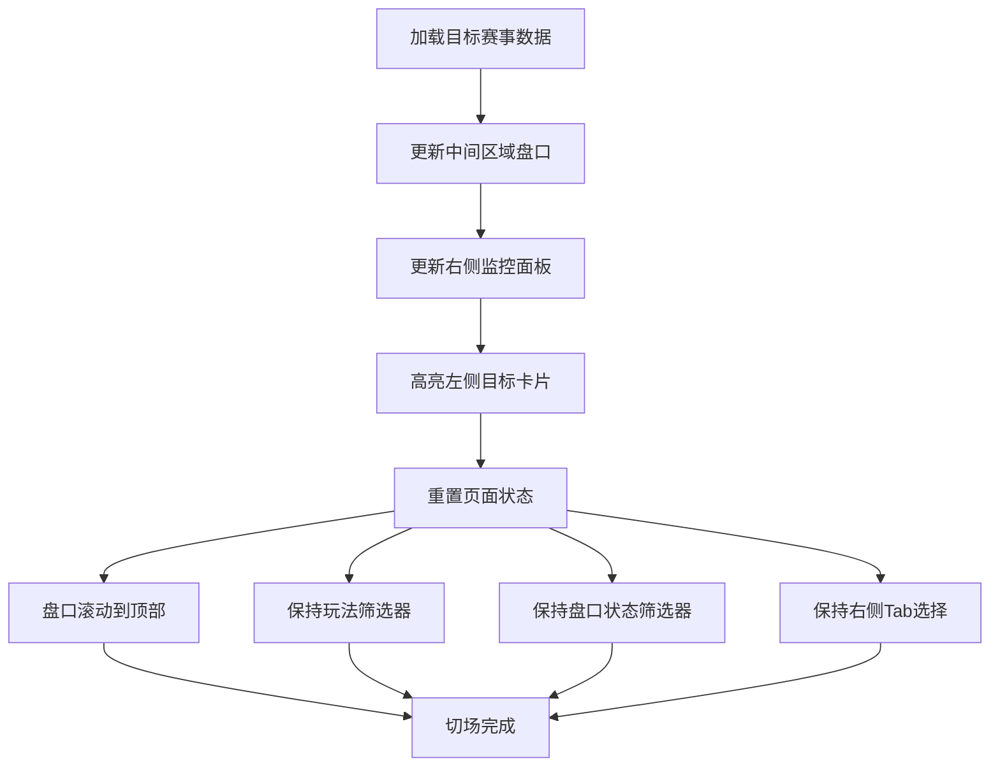

# 第三章 左侧赛事快捷切场面板

## 3.1 面板定位

左侧面板的核心功能是**赛事快捷切场**——让操盘手在不同赛事间快速跳转。与操盘列表的"全量赛事管理"不同，这里只显示操盘手当前关注的赛事子集，用于在单场深度操盘时快速切换上下文。

**设计边界**：左侧面板只提供"跳转"能力，不提供跨赛事批量操盘入口。跨赛事的批量操作（如批量上架、批量锁盘）在操盘列表完成。

---

## 3.2 面板结构

```
┌────────────────────────────┐
│  赛事列表        [◀ 折叠]  │  ← 面板头部
├────────────────────────────┤
│  🔍 搜索赛事...             │  ← 搜索框
├────────────────────────────┤
│  ● 滚球中 (5)          ▼   │  ← 分组标题（红点+展开）
│  ┌────────────────────────┐│
│  │ 下半场 67'    #48291001││  ← 阶段+赛事ID
│  │ 曼城 vs 利物浦          ││  ← 当前选中（高亮）
│  │ 2 - 1                   ││  ← 比分
│  │ 敞口 ¥350K  单边 82%    ││  ← 风险指标
│  └────────────────────────┘│
│  ┌────────────────────────┐│
│  │ 下半场 23'    #48291065││
│  │ 拜仁 vs 多特            ││  ← 普通卡片
│  │ 1 - 0                   ││
│  │ 敞口 ¥280K  单边 61%    ││
│  └────────────────────────┘│
├────────────────────────────┤
│  ● 即将开赛 (2)        ▼   │  ← 分组标题（蓝点+展开）
│  ┌────────────────────────┐│
│  │ 15分钟后     #48291088 ││
│  │ 巴黎 vs 里昂            ││
│  │ - : -                   ││
│  │ 敞口 ¥128K  单边 58%    ││
│  └────────────────────────┘│
├────────────────────────────┤
│  ● 赛前 (3)            ▶   │  ← 分组标题（灰点+折叠）
└────────────────────────────┘
```

---

## 3.3 面板头部

| 元素     | 功能说明                                     |
| -------- | -------------------------------------------- |
| 标题     | 显示"赛事列表"                               |
| 折叠按钮 | 点击折叠整个左侧面板，图标为 ◀，折叠后变为 ▶ |

---

## 3.4 搜索框

### 3.4.1 搜索范围

| 搜索字段 | 匹配方式 | 示例                                          |
| -------- | -------- | --------------------------------------------- |
| 赛事ID   | 前缀匹配 | 输入"48291" → 匹配赛事ID以48291开头的赛事     |
| 主队名称 | 包含匹配 | 输入"曼城" → 匹配主队名称包含"曼城"的赛事     |
| 客队名称 | 包含匹配 | 输入"利物浦" → 匹配客队名称包含"利物浦"的赛事 |

### 3.4.2 交互规则

| 交互项     | 规则                                     |
| ---------- | ---------------------------------------- |
| 触发方式   | 实时过滤，输入即筛选，无需回车           |
| 防抖时间   | 300毫秒                                  |
| 最小字符   | 至少输入2个字符才触发搜索                |
| 清除按钮   | 输入框右侧，点击后清空内容并恢复完整列表 |
| 无结果提示 | 显示"未找到匹配的赛事"                   |

---

## 3.5 赛事分组

### 3.5.1 分组规则

赛事按比赛进程分为三组，按以下顺序从上到下排列：

| 分组     | 包含赛事               | 默认状态 | 指示点颜色         | 排序规则                           |
| -------- | ---------------------- | -------- | ------------------ | ---------------------------------- |
| 滚球中   | 比赛正在进行的赛事     | 展开     | 红色（带脉冲动画） | 按比赛时间升序（进行时间长的在前） |
| 即将开赛 | 开赛前30分钟内的赛事   | 展开     | 蓝色               | 按开赛时间升序（先开赛的在前）     |
| 赛前     | 开赛前30分钟以上的赛事 | 折叠     | 灰色               | 按开赛时间升序                     |

> **「即将开赛」vs「紧急」区分**：
> - **即将开赛（比赛进程）**：≤ 30分钟，用于Tab筛选、分组显示（本表定义）
> - **紧急阈值（一键锁盘/置顶）**：≤ 10分钟，用于一键锁盘范围、置顶规则、紧急告警触发
> - 两者是不同维度的概念，详见[操盘列表第9章9.11.7节](../trading-list/09-数据字段定义.md#_9-11-7-全局阈值速查表)

### 3.5.2 分组标题结构

| 元素          | 位置 | 说明                         |
| ------------- | ---- | ---------------------------- |
| 状态指示点    | 左侧 | 圆形色点，滚球组带脉冲动画   |
| 分组名称      | 中部 | "滚球中"、"即将开赛"、"赛前" |
| 赛事数量      | 右侧 | 圆角徽章显示该分组的赛事数量 |
| 展开/折叠图标 | 最右 | ▼ 表示展开，▶ 表示折叠       |

### 3.5.3 分组折叠状态保存

分组的展开/折叠状态保存到浏览器本地存储，下次访问时自动恢复。

---

## 3.6 赛事卡片

### 3.6.1 卡片结构（基于原型）

```
┌────────────────────────────────────┐
│  下半场 67'              #48291001 │  ← 头部：阶段标识 + 赛事ID
├────────────────────────────────────┤
│  曼城 vs 利物浦                     │  ← 对阵双方
│  2 - 1                              │  ← 比分（滚球）或 - : -（赛前）
├────────────────────────────────────┤
│  敞口 ¥350K       单边 82%          │  ← 风险指标
└────────────────────────────────────┘
```

### 3.6.2 卡片信息项详解

| 信息项   | 位置     | 数据来源   | 格式说明                                                                                   |
| -------- | -------- | ---------- | ------------------------------------------------------------------------------------------ |
| 阶段标识 | 头部左侧 | 数据源推送 | 滚球显示"上半场 23'"、"下半场 67'"、"中场"等；即将开赛显示"15分钟后"；赛前显示"明天 15:00" |
| 赛事ID   | 头部右侧 | 系统生成   | 格式为"#"加数字，如"#48291001"                                                             |
| 对阵双方 | 主体区域 | 数据源推送 | 格式为"主队名称 vs 客队名称"                                                               |
| 比分     | 主体区域 | 数据源推送 | 滚球显示实时比分如"2 - 1"；赛前显示"- : -"                                                 |
| 敞口     | 底部左侧 | 本地计算   | 该赛事当前最大潜在赔付，格式"敞口 ¥350K"                                                   |
| 单边比例 | 底部右侧 | 本地计算   | 该赛事最高单边投注占比，格式"单边 82%"                                                     |

### 3.6.3 阶段标识样式

| 赛事阶段      | 标识样式                  | 背景颜色                 |
| ------------- | ------------------------- | ------------------------ |
| 滚球-上半场   | 红色文字 + 红色半透明背景 | rgba(224, 36, 94, 0.2)   |
| 滚球-下半场   | 红色文字 + 红色半透明背景 | rgba(224, 36, 94, 0.2)   |
| 滚球-中场休息 | 橙色文字 + 橙色半透明背景 | rgba(247, 147, 26, 0.2)  |
| 即将开赛      | 蓝色文字 + 蓝色半透明背景 | rgba(29, 161, 242, 0.2)  |
| 赛前          | 灰色文字 + 灰色半透明背景 | rgba(142, 153, 166, 0.2) |

### 3.6.4 卡片状态样式

| 状态         | 样式                      | 说明                                     |
| ------------ | ------------------------- | ---------------------------------------- |
| 当前选中     | 蓝色边框 + 蓝色半透明背景 | 当前正在操盘的赛事，CSS类为`active`      |
| 普通         | 灰色边框 + 深色背景       | 默认状态                                 |
| 悬停         | 蓝色边框                  | 鼠标悬停时边框变蓝                       |
| 高风险（P0） | 红色左边框（3px）         | 单边超过85%或有P0级告警，CSS类为`danger` |
| 中风险（P1） | 橙色左边框（3px）         | 单边超过70%或有P1级告警，CSS类为`warn`   |

> **告警级别映射说明**（与操盘列表09章9.11节对齐）：
>
> - **P0级告警（严重/红色）**：最紧急(1)、紧急(2)、单边超限(3)、延期超时100%+(5)
> - **P1级告警（警告/橙色）**：大额投注(4)、比赛暂停(6)、数据源暂停(7)、延期超时80%
> - **P2级及以下**：数据源维护(8)、数据延迟(9)、未分配(10)、中立场(11)，不触发卡片样式变化

### 3.6.5 单边比例告警阈值

| 单边比例                  | 文字颜色     | 卡片边框   |
| ------------------------- | ------------ | ---------- |
| 小于中风险阈值（默认70%） | 白色（正常） | 无特殊边框 |
| 中风险阈值至高风险阈值    | 橙色         | 橙色左边框 |
| 大于高风险阈值（默认85%） | 红色         | 红色左边框 |

> **阈值配置说明**：实际阈值由风控管理配置决定。详见[操盘列表PRD第16章16.5节「风控告警阈值定义」](../trading-list/16-数据联动规则.md#_16-5-配置项与阈值)。

---

## 3.7 切场规则

### 3.7.1 切场触发方式

| 触发方式       | 入口位置       | 说明               |
| -------------- | -------------- | ------------------ |
| 点击赛事卡片   | 左侧面板       | 最常用的切场方式   |
| 搜索后点击结果 | 左侧面板搜索框 | 快速定位特定赛事   |
| 告警点击跳转   | 右侧告警Tab    | 点击告警关联的赛事 |

### 3.7.2 切场流程图（含未保存编辑处理）

**主流程**

```mermaid
flowchart TD
    A["用户点击目标赛事"] --> B{"当前赛事有<br/>未保存编辑？"}
    B -->|是| C["弹出确认弹窗"]
    B -->|否| G["加载目标赛事数据"]
    C -->|放弃更改| D["丢弃编辑"]
    C -->|保存并切换| E["保存编辑"]
    C -->|取消| F["保持当前<br/>返回编辑"]
    D --> G
    E --> G
    G --> ["【子流程A】页面更新与状态重置"]
    F -.-> A
```

**子流程A - 页面更新与状态重置**



### 3.7.3 未保存编辑确认弹窗

当操盘手切场时，若当前赛事存在未保存的编辑（如正在编辑赔率、修改状态但未提交），系统弹出确认弹窗：

```
┌────────────────────────────────────┐
│  ⚠️ 未保存的更改                    │
├────────────────────────────────────┤
│                                    │
│  当前赛事有未保存的编辑：            │
│                                    │
│  • 全场让球 主队赔率 0.88 → 0.93   │
│  • 全场大小 2.5球 大赔率编辑中       │
│                                    │
│  是否保存后再切换？                 │
│                                    │
│  [放弃更改]  [保存并切换]  [取消]   │
│                                    │
└────────────────────────────────────┘
```

| 按钮       | 行为                                     |
| ---------- | ---------------------------------------- |
| 放弃更改   | 丢弃所有未保存的编辑，直接切换到目标赛事 |
| 保存并切换 | 保存当前所有编辑，然后切换到目标赛事     |
| 取消       | 关闭弹窗，保持当前赛事，继续编辑         |

### 3.7.4 切场后的页面状态重置

| 状态项           | 切场后行为                                           |
| ---------------- | ---------------------------------------------------- |
| 盘口卡片展开状态 | 保持用户上次在该赛事的展开状态（首次进入则全部展开） |
| 玩法筛选器       | 保持当前选择（跨赛事保留）                           |
| 盘口状态筛选器   | 保持当前选择（跨赛事保留）                           |
| 盘口滚动位置     | 滚动到顶部                                           |
| 右侧面板Tab      | 保持当前Tab不变                                      |
| 右侧面板数据     | 切换为目标赛事的投注流、告警、日志                   |

---

## 3.8 面板折叠

### 3.8.1 折叠状态对比

| 区域     | 展开时     | 折叠时           |
| -------- | ---------- | ---------------- |
| 面板宽度 | 260px      | 50px             |
| 标题     | "赛事列表" | 隐藏             |
| 搜索框   | 完整显示   | 隐藏             |
| 赛事卡片 | 完整显示   | 显示赛事图标列表 |

### 3.8.2 折叠态赛事图标列表

当左侧面板折叠后，赛事以迷你图标形式纵向排列显示，让操盘手在面板收起时仍能快速识别和切换赛事。

### 图标结构示意

```
┌─────────┐
│   MC    │ ← 主队缩写（3-4字母）
│   LIV   │ ← 客队缩写（3-4字母）
│       ● │ ← 右下角状态指示点
└─────────┘
```

### 图标元素说明

| 元素       | 说明                        | 示例                                    |
| ---------- | --------------------------- | --------------------------------------- |
| 主队缩写   | 上方显示，3-4个大写字母     | MC（曼城）、RMA（皇马）、BAY（拜仁）    |
| 客队缩写   | 下方显示，3-4个大写字母     | LIV（利物浦）、BAR（巴萨）、DOR（多特） |
| 状态指示点 | 右下角8px圆点，指示赛事进程 | 见下表                                  |

### 状态指示点颜色

| 状态       | 指示点颜色 | 动画效果       |
| ---------- | ---------- | -------------- |
| 滚球进行中 | 红色       | 带脉冲闪烁动画 |
| 即将开赛   | 橙色       | 无动画         |
| 赛前       | 灰色       | 无动画         |

### 图标边框样式（风险等级）

| 风险等级     | 边框样式                  | 触发条件                    |
| ------------ | ------------------------- | --------------------------- |
| 当前选中     | 蓝色完整边框（2px）       | 当前正在操盘的赛事          |
| 高风险（P0） | 红色半透明背景 + 红色边框 | 单边 ≥ 85% 或存在P0级告警   |
| 中风险（P1） | 橙色半透明背景 + 橙色边框 | 单边 70%-85% 或存在P1级告警 |
| 正常         | 深灰色边框                | 无风险告警                  |

### 交互规则

| 交互     | 行为                                             |
| -------- | ------------------------------------------------ |
| 鼠标悬停 | 显示Tooltip："曼城 vs 利物浦 (2-1) · 下半场 67'" |
| 单击图标 | 切换到对应赛事，触发切场流程（见3.7节）          |
| 当前选中 | 蓝色高亮边框，与其他图标形成视觉区分             |

### 图标排列顺序

图标按以下优先级从上到下排列：

1. **当前选中的赛事**（始终可见）
2. **滚球中的赛事**（按比赛进行时间降序）
3. **即将开赛的赛事**（按开赛时间升序）
4. **赛前赛事**（按开赛时间升序）

### 设计目的

折叠态图标列表的设计目的是在左侧面板收起后，仍然为操盘手提供赛事快速切换能力，同时将更多屏幕空间留给中间的盘口操作区域。通过颜色编码和状态指示点，操盘手可以一眼识别各赛事的风险状态和比赛进程。

### 3.8.3 折叠后的交互

| 交互         | 行为                                           |
| ------------ | ---------------------------------------------- |
| 鼠标悬停图标 | 显示Tooltip："曼城 vs 利物浦 (下半场 67' 2-1)" |
| 点击图标     | 切换到对应赛事                                 |
| 点击展开按钮 | 展开面板，按钮位于面板右侧中央                 |

---

## 3.9 赛事列表数据来源

### 3.9.1 数据范围

左侧面板显示的赛事来源于操盘手当前的工作范围：

| 场景            | 显示的赛事                           |
| --------------- | ------------------------------------ |
| 从操盘列表进入  | 显示操盘列表当前筛选条件下的所有赛事 |
| 直接通过URL进入 | 显示当前赛事所属联赛的所有赛事       |

### 3.9.2 数据刷新

| 刷新场景       | 刷新方式                       |
| -------------- | ------------------------------ |
| 赛事状态变化   | WebSocket实时推送更新          |
| 新赛事进入滚球 | 自动添加到"滚球中"分组         |
| 赛事结束       | 自动从列表移除（转入结算列表） |
| 风险指标变化   | 实时更新卡片敞口和单边比例     |

---

## 3.10 边界情况处理

### 3.10.1 赛事列表为空

| 场景           | 显示内容                                      |
| -------------- | --------------------------------------------- |
| 搜索无结果     | "未找到匹配的赛事"                            |
| 某分组无赛事   | 该分组标题显示数量为0，点击仍可展开但内容为空 |
| 全部分组无赛事 | 显示"暂无赛事"空状态提示                      |

### 3.10.2 赛事名称过长

| 处理方式 | 说明                          |
| -------- | ----------------------------- |
| 截断显示 | 超过卡片宽度时末尾显示省略号  |
| 悬停提示 | 鼠标悬停时Tooltip显示完整名称 |
| 最大宽度 | 卡片宽度 减 边距 约等于 220px |

### 3.10.3 赛事数量过多

| 场景           | 处理方式                                 |
| -------------- | ---------------------------------------- |
| 单分组超过20场 | 分组内容区域显示滚动条                   |
| 总赛事超过50场 | 整个面板内容区域（panel-body）显示滚动条 |

---

## 3.11 玩法导航说明

**重要说明**：玩法导航区不在左侧面板内，而是位于**中间区域盘口工具栏的第二行**。详见[第5章「盘口工具栏」](./05-盘口工具栏.md)的玩法标签部分。

左侧面板专注于**赛事级别的切换**，不涉及玩法筛选功能。

---

## 修订记录

| 版本 | 日期       | 修订内容 |
| ---- | ---------- | -------- |
| v1.0 | 2026-01-22 | 初稿     |
| v1.1 | 2026-01-28 | 跨文档一致性：3.5.1节补充「即将开赛」vs「紧急」阈值区分说明（规范引用9.11.7） |
