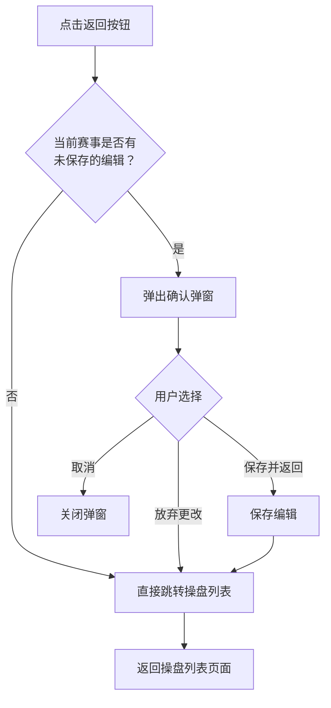
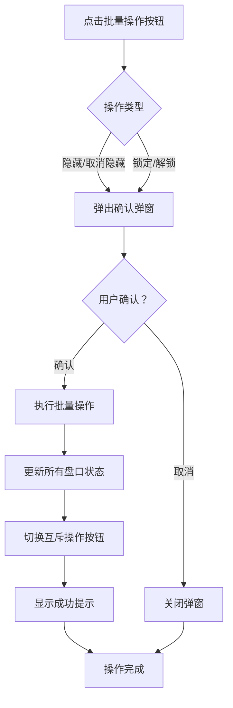

# 第四章 顶部栏与赛事信息头

## 4.1 模块定位

本章涵盖操盘页上方两个固定区域：

- **顶部栏（header）**：页面级导航、赛事级操作控制、告警摘要和全局状态展示，高度52px
- **赛事信息头（match-header）**：当前操盘赛事的核心信息展示，纯展示区域

两者共同为操盘手提供"我在哪、当前赛事什么状态、能做什么操作"的全局视图。

---

## 4.2 顶部栏结构

顶部栏采用三栏布局：左侧导航、中间操作控制、右侧状态监控。

```
┌─────────────────────────────────────────────────────────────────────────────────────────────────────────────────┐
│  ← 返回列表  📊操盘中心  │  [全部隐藏][取消隐藏][🔒全部锁定][解锁]  │  赛事操作 ●已上架 ⬇️下架  │  赛事级控制 数据源○  │  工具 📋📈  │  🔴P0:3 ⚠️单边:3  │  ●IM 23ms  🔄⚙️  │
│       header-left        │                                                    header-center                                                    │              header-right              │
└─────────────────────────────────────────────────────────────────────────────────────────────────────────────────┘
```

### 4.2.1 顶部栏样式规范

| 属性   | 值                           |
| ------ | ---------------------------- |
| 高度   | 52px                         |
| 背景色 | #15202b                      |
| 边框   | 底部1px #38444d              |
| 定位   | 固定在页面顶部，不随内容滚动 |
| 布局   | flex，三栏结构               |

---

## 4.3 顶部栏左侧（header-left）

### 4.3.1 返回按钮

| 属性     | 值                    |
| -------- | --------------------- |
| 图标     | ←                     |
| 文字     | "返回列表"            |
| 样式     | 圆角按钮，#253341背景 |
| 悬停效果 | 边框变蓝，文字高亮    |

**点击行为**：



### 4.3.2 页面标题

| 属性 | 值         |
| ---- | ---------- |
| 图标 | 📊         |
| 文字 | "操盘中心" |
| 字号 | 15px       |
| 字重 | 600        |
| 颜色 | #e7e9ea    |

---

## 4.4 顶部栏中间（header-center）

中间区域包含所有赛事级操作控制，采用卡片分组设计，居中排列。

### 4.4.1 卡片分组样式（header-card）

| 属性   | 值                |
| ------ | ----------------- |
| 背景色 | #1c2732           |
| 边框   | 1px solid #2d3a47 |
| 圆角   | 8px               |
| 内边距 | 6px 12px          |
| 间距   | 各卡片之间8px     |

### 4.4.2 盘口批量操作组

第一个卡片，包含赛事级状态控制按钮，采用**互斥显示**设计（详见[第8章8.4.3节](./08-控制层级体系.md#_8-4-3-操作按钮互斥显示规则核心)）：

| 按钮对         | 显示规则                                               | 功能说明                                   |
| -------------- | ------------------------------------------------------ | ------------------------------------------ |
| ⏸全部隐藏     | 当前赛事**未处于隐藏**状态时显示                       | 将当前赛事所有非关盘盘口状态设为"隐藏"     |
| ▶取消隐藏     | 当前赛事**处于隐藏**状态时显示，与⏸全部隐藏互斥       | 将当前赛事所有隐藏盘口恢复为"开盘"         |
| 🔒全部锁定     | 当前赛事**未处于锁定**状态时显示                       | 将当前赛事所有非关盘盘口状态设为"锁定"     |
| 🔓解锁         | 当前赛事**处于锁定**状态时显示，与🔒全部锁定互斥       | 将当前赛事所有锁定盘口恢复为锁定前状态     |

> **注意**：~~赛事级不提供关盘按钮。关盘按钮在盘口级提供（粒度跟随结算粒度），详见[第8章8.4节](./08-控制层级体系.md#_8-4-状态展示与操作设计)~~

**按钮互斥显示规则**：
- `⏸全部隐藏` 与 `▶取消隐藏` 同一时间只显示一个
- `🔒全部锁定` 与 `🔓解锁` 同一时间只显示一个
- 锁定状态下，`⏸全部隐藏` 按钮显示但**禁用**（灰色不可点击），悬浮提示「锁定中，请先解锁」

**按钮样式规范**：

| 类型     | 背景色              | 文字颜色 | 边框                          |
| -------- | ------------------- | -------- | ----------------------------- |
| 普通按钮 | #253341             | #e7e9ea  | 1px solid #38444d             |
| 危险按钮 | rgba(224,36,94,0.1) | #e0245e  | 1px solid rgba(224,36,94,0.5) |
| 禁用按钮 | #1c2732             | #6e767d  | 1px solid #2d3a47             |

**批量操作执行流程**：



### 4.4.3 赛事操作组

| 元素     | 说明                                      |
| -------- | ----------------------------------------- |
| 组标签   | "赛事操作"，10px灰色                      |
| 上架状态 | status-chip组件，绿色背景显示"●已上架"    |
| 操作按钮 | 已上架显示"⬇️ 下架"；已下架显示"⬆️ 上架"  |

**操作按钮点击行为**：

| 操作 | 弹出弹窗 | 说明 |
| ---- | -------- | ---- |
| ⬇️ 下架 | 下架确认弹窗（[13.4节](./13-弹窗与模态框.md#_13-4-下架赛事确认弹窗)） | 确认后所有盘口变为隐藏（C端不可见），赛事状态变为已下架 |
| ⬆️ 上架 | 上架确认弹窗（[13.4A节](./13-弹窗与模态框.md#_13-4a-上架赛事确认弹窗)） | 操盘手选择初始盘口状态：跟随数据源（默认）/ 锁定 / 隐藏 |

**上架状态芯片样式**：

| 状态   | 背景色                 | 文字颜色 | 圆点效果     |
| ------ | ---------------------- | -------- | ------------ |
| 已上架 | rgba(23,191,99,0.15)   | #17bf63  | 绿色带发光   |
| 已下架 | rgba(224,36,94,0.15)   | #e0245e  | 红色         |
| 待上架 | rgba(142,153,166,0.15) | #8899a6  | 灰色         |

### 4.4.4 赛事级控制组

| 元素       | 说明                                                   |
| ---------- | ------------------------------------------------------ |
| 组标签     | "赛事级控制"，10px灰色                                 |
| 数据源开关 | 控制该赛事所有可操盘口是否跟随数据源（赔率/状态/结算） |

**控制项结构**：

```
┌─────────────────────────────────────────┐
│  数据源  [====○]  跟随IM                │
└─────────────────────────────────────────┘
```

| 元素     | 样式              |
| -------- | ----------------- |
| 控制标签 | 11px白色粗体      |
| 开关     | toggle-switch组件 |
| 提示文字 | 9px灰色           |

**开关状态样式**：

| 状态 | 背景色  | 圆点位置 |
| ---- | ------- | -------- |
| 开启 | #1da1f2 | 右侧     |
| 关盘 | #38444d | 左侧     |

**Tooltip提示**：

- 数据源开关："赛事级数据源：开启后该赛事所有可操盘口跟随数据源（赔率同步、状态跟随、结算跟随）"

### 4.4.5 工具组

| 元素        | 说明                                     |
| ----------- | ---------------------------------------- |
| 组标签      | "工具"，10px灰色                         |
| 📋 操盘日志 | 打开操盘日志弹窗，查看该赛事所有操盘记录 |
| 📈 同步市场 | 将当前赛事所有本地赔率同步至外部市场     |

### 4.4.5.1 操盘日志 （操盘列表、操盘页 中弹窗组件一致）

| 属性     | 规格                                 | 说明                 |
| -------- | ------------------------------------ | -------------------- |
| 按钮图标 | 📋                                   | 位于盘口卡片头部     |
| 点击行为 | 打开操盘日志弹窗                     | 自动筛选当前赛事     |
| 弹窗规范 | 见[第13章弹窗定义](./13-弹窗与模态框.md)、[操盘列表第18章操盘日志规范](../trading-list/18-操盘日志页面规范.md) | 支持筛选、分页、导出 |

### 4.4.5.2 操盘日志弹窗筛选项

| 筛选项   | 类型     | 选项                                                                 | 默认值 |
| -------- | -------- | -------------------------------------------------------------------- | ------ |
| 时间范围 | 下拉选择 | 最近1小时/今天/最近3天/自定义                                        | 今天   |
| 操作类型 | 下拉选择 | 全部/状态变更/赔率调整/返奖率调整/数据源开关变更/副线显示设置/操盘手变更 | 全部   |
| 操作来源 | 下拉选择 | 全部/人工/批量/数据源自动/数据源/风控/系统/上级联动/数据源维护/赛事事件 | 全部   |
| 盘口ID   | 文本输入 | 模糊搜索                                                             | 空     |

> **规范说明**：操作来源枚举的规范定义为[操盘列表第18章18.3.2节](../trading-list/18-操盘日志页面规范.md#_18-3-2-操作来源枚举)，共9种（不含"全部"筛选项）。

### 4.4.5.3操盘日志列表字段

| 字段     | 说明                                    | 精度/格式                              | 示例                        |
| -------- | --------------------------------------- | -------------------------------------- | --------------------------- |
| 时间     | 操作时间                                | 精确到毫秒（展示截到秒，导出保留毫秒） | 18:45:32                    |
| 操作类型 | 状态变更/赔率调整/返奖率调整/数据源开关变更/副线显示设置/操盘手变更 | 彩色标签 | 赔率调整                    |
| 盘口     | 玩法名称                                | -                                      | 全场让球                    |
| 操作详情 | 具体变更内容                            | -                                      | 主队(-0.5) 赔率 0.90 → 0.92 |
| 操作人   | 执行人或系统                            | -                                      | 张三/数据源/系统            |
| 来源     | 人工/数据源同步/系统                    | -                                      | 人工                        |

---

## 4.5 顶部栏右侧（header-right）

### 4.5.1 告警摘要标签（header-alerts）

| 标签       | 样式   | 触发条件           | 点击行为                      |
| ---------- | ------ | ------------------ | ----------------------------- |
| 🔴 P0: N   | 红色系 | 存在P0级告警时显示 | 跳转右侧面板告警Tab并筛选P0   |
| ⚠️ 单边: N | 橙色系 | 存在单边预警时显示 | 跳转右侧面板告警Tab并筛选单边 |

**告警标签样式**：

| 类型 | 背景色                | 文字颜色 |
| ---- | --------------------- | -------- |
| P0   | rgba(224,36,94,0.15)  | #e0245e  |
| 单边 | rgba(247,147,26,0.15) | #f7931a  |

### 4.5.2 数据源状态指示器

| 元素       | 说明                                        |
| ---------- | ------------------------------------------- |
| 状态圆点   | 6px圆形，在线绿色带发光；延迟橙色；断连红色 |
| 数据源名称 | 显示"IM"，灰色文字                          |
| 延迟数值   | 绿色等宽字体显示延迟毫秒数，如"23ms"        |

**状态判定规则**：

| 正常 | 🟢 | 绿色 | 连接正常，延迟小于1秒 |
| 延迟 | 🟡 | 黄色 | 连接正常，延迟1-3秒 |
| 异常 | 🔴 | 红色 | 连接断开或延迟超过3秒 |

### 4.5.3 工具按钮

| 按钮 | 图标 | 功能                     | 快捷键 |
| ---- | ---- | ------------------------ | ------ |
| 刷新 | 🔄   | 手动刷新当前赛事所有数据 | F5     |
| 设置 | ⚙️   | 打开设置弹窗             | 无     |

---

## 4.6 赛事信息头结构（match-header）

赛事信息头采用单行三栏水平布局，纯展示区域：

```
┌──────────────────────────────────────────────────────────────────────────────────────┐
│  ┌─────────────────────────┬─────────────────────────┬─────────────────────────────┐ │
│  │     match-info-section  │   match-meta-section    │    match-stats-section      │ │
│  │                         │                         │                             │ │
│  │  主队      2-1     客队 │ 赛事ID: #48291037       │ 投注额    盈亏    风险敞口  │ │
│  │  曼城  滚球 67'  利物浦 │ 联赛: 英超 #180         │ ¥892K   +¥45K    ¥850K    │ │
│  │  ⚠️单边预警 风险敞口高 │ 赛前操盘: 李四 ✏️      │ 风险注单  返奖率            │ │
│  │                         │ 滚球操盘: 张三 ✏️      │  12单    97.5%              │ │
│  └─────────────────────────┴─────────────────────────┴─────────────────────────────┘ │
└──────────────────────────────────────────────────────────────────────────────────────┘
```

### 4.6.1 样式规范

| 属性   | 值              |
| ------ | --------------- |
| 内边距 | 10px 16px       |
| 背景色 | #16202a         |
| 边框   | 底部1px #38444d |

---

## 4.7 左侧：赛事基础信息区（match-info-section）

### 4.7.1 队伍与比分

| 元素     | 样式            |
| -------- | --------------- |
| 队伍标签 | 10px灰色        |
| 队伍名称 | 14px白色粗体    |
| 比分     | 24px蓝色粗体    |
| 阶段徽章 | phase-badge组件 |
| 阶段时间 | 11px灰色        |

### 4.7.2 告警徽章

| 徽章        | 触发条件                | 样式                          |
| ----------- | ----------------------- | ----------------------------- |
| ⚠️ 单边预警 | 任一盘口单边比例超过70% | 红色背景rgba(224,36,94,0.15)  |
| 风险敞口高  | 赛事总敞口超过阈值      | 橙色背景rgba(247,147,26,0.15) |

---

## 4.8 中间：赛事元信息区（match-meta-section）

| 字段       | 格式                 | 说明                                          |
| ---------- | -------------------- | --------------------------------------------- |
| 赛事ID     | "赛事ID: #48291037"  | 系统唯一标识                                  |
| 联赛       | "联赛: 英超 #180"    | 联赛名称+ID                                   |
| 赛前操盘手 | "赛前操盘: 李四 ✏️"  | 点击可更换                                    |
| 滚球操盘手 | "滚球操盘: 张三 ✏️"  | 点击可更换                                    |
| 模板       | "模板: 等级1模板"    | 显示当前联赛等级对应的模板，只读不可点击编辑 |

> **v1.6 变更说明**：模板显示改为只读，仅展示当前联赛等级（默认+等级1-10共11档）对应的模板名称，不支持在操盘页直接编辑模板。模板配置统一在联赛管理中进行。

---

## 4.9 右侧：统计数据区（match-stats-section）

| 指标     | 样式规则              |
| -------- | --------------------- |
| 投注额   | 白色                  |
| 盈亏     | 正数绿色，负数红色    |
| 风险敞口 | 超过阈值红色          |
| 风险注单 | 超5单橙色，超10单红色 |
| 返奖率   | 白色                  |

---

## 4.10 数据刷新机制

| 数据项     | 刷新频率 | 刷新方式      |
| ---------- | -------- | ------------- |
| 告警摘要   | 实时     | WebSocket推送 |
| 数据源延迟 | 每5秒    | 心跳检测      |
| 比分/阶段  | 实时     | WebSocket推送 |
| 统计指标   | 每5秒    | WebSocket推送 |

---

## 修订记录

| 版本 | 日期       | 修订内容                                                     |
| ---- | ---------- | ------------------------------------------------------------ |
| v1.0 | 2026-01-22 | 初稿                                                         |
| v1.1 | 2026-01-22 | 根据最新原型重构：顶部栏包含赛事级操作控制                   |
| v1.2 | 2026-01-28 | 将AO开关、飞单开关合并为数据源开关；更新操盘日志筛选项和字段 |
| v1.3 | 2026-01-29 | 操作按钮规范同步：4.4.2节批量操作按钮改为互斥显示设计（⏸全部暂停↔▶取消暂停、🔒全部锁定↔🔓解锁）；新增⊘关闭按钮；新增禁用按钮样式；流程图增加"切换互斥按钮"步骤 |
| v1.4 | 2026-01-29 | 日志一致性修复：4.4.5.2、4.4.5.3节操作类型与13章对齐：删除"盘口线调整"（功能已删除）；新增"数据源开关变更" |
| v1.5 | 2026-01-29 | 全局规则v1.6术语对齐：4.4.2节"暂停/取消暂停"→"隐藏/取消隐藏"；移除本地关闭按钮（关盘仅由IM数据源控制） |
| v1.6 | 2026-01-30 | 原型同步：4.8节模板字段改为"等级1模板"，设为只读不可点击编辑 |
| v1.7 | 2026-02-12 | 下架/上架状态联动重构：4.4.3节新增操作按钮点击行为表（下架→隐藏确认弹窗，上架→初始状态选择弹窗） |
