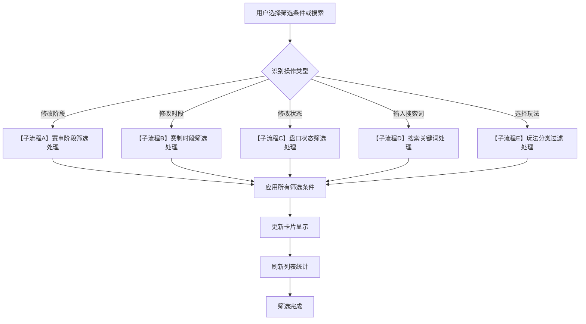
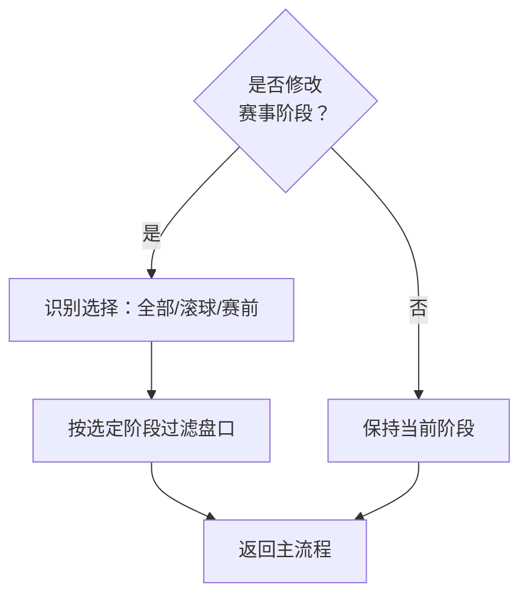
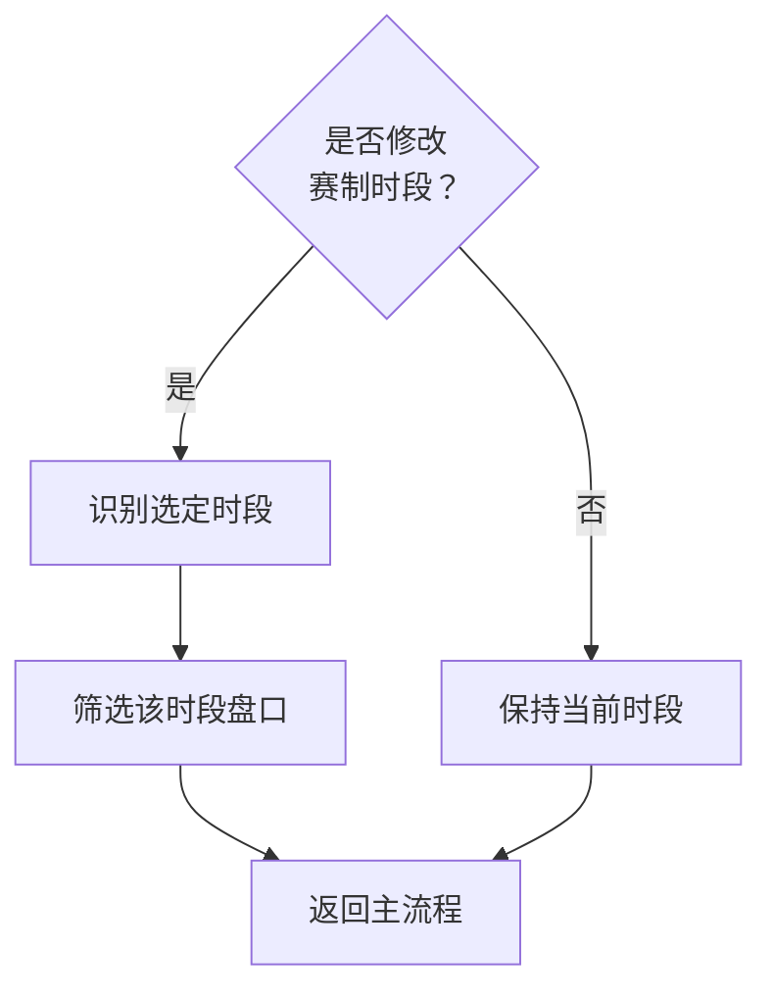
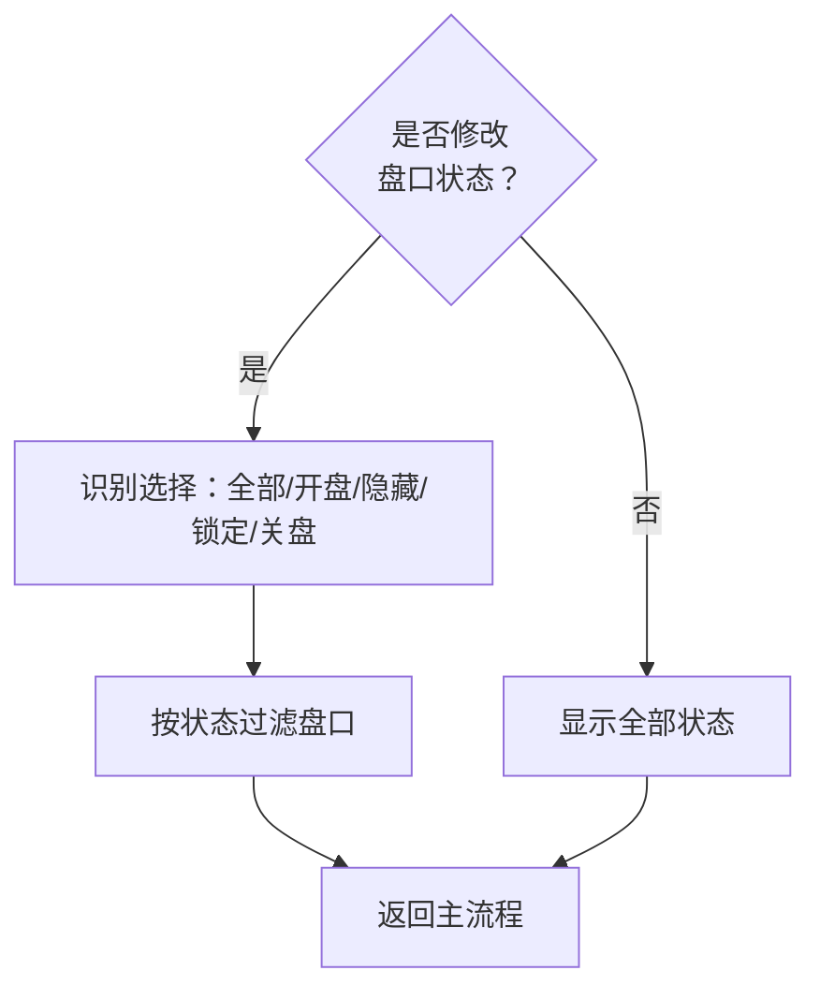
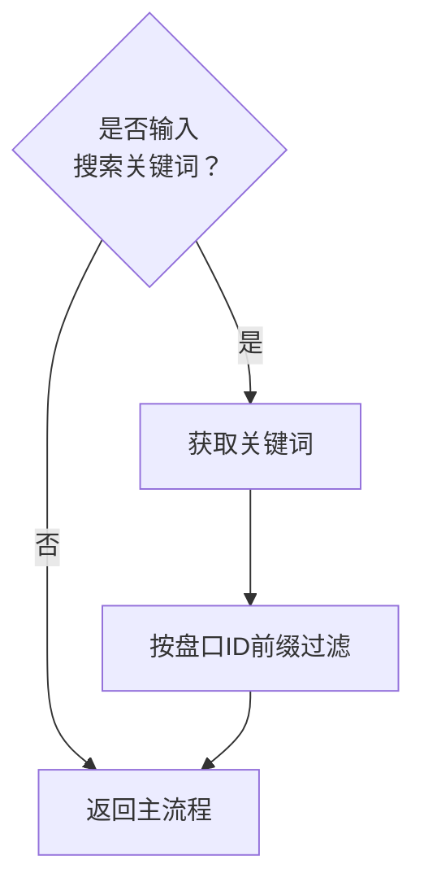
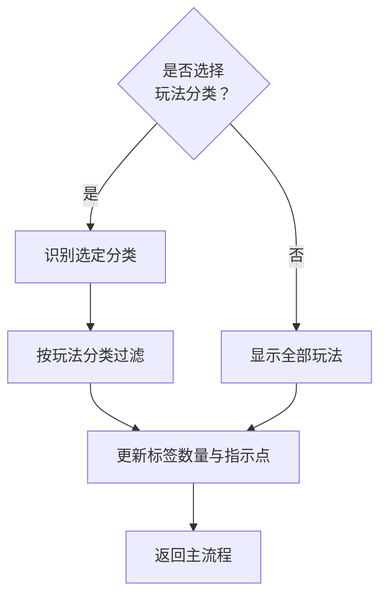

# 第五章 盘口工具栏

## 5.1 模块定位

盘口工具栏位于赛事信息头下方、盘口卡片列表上方，提供盘口筛选、搜索、玩法导航和赔率制式切换功能。工具栏分为两行：

- **第一行**：赛事阶段筛选 + 赛制时段筛选 + 赔率制式切换
- **第二行**：盘口状态筛选 + 搜索框 + 玩法标签导航

---

## 5.2 工具栏结构

```
┌──────────────────────────────────────────────────────────────────────────────────────┐
│  第一行：赛事阶段 + 赛制时段 + 赔率制式                                               │
│  赛事阶段: [全部] [滚球] [赛前]                                                       │
│  赛制时段:                                                                           │
│    足球:   [全场] [上半场] [下半场]                                                   │
│    篮球:   [全场] [Q1] [Q2] [Q3] [Q4] [上半场] [下半场] [加时]                        │
│    网球:   [全场] [第一盘] [第二盘] [第三盘] [第四盘] [第五盘]                        │
│    电竞:   [全场] [第一局] [第二局] ... [第七局]  （根据BO几动态显示）                │
│    斯诺克: [全场] [第一局] ... [第三十五局]  （根据赛制动态显示，支持横向滚动）        │
│                                                           赔率制式: [港赔 HK] [欧赔 Decimal] │
├──────────────────────────────────────────────────────────────────────────────────────┤
│  第二行：盘口状态 + 搜索 + 玩法标签                                                    │
│  盘口状态: [全部状态▼]  🔍搜索盘口ID...  [全部] [●主要 4] [●进球 8] [●角球 6] [更多▼] │
└──────────────────────────────────────────────────────────────────────────────────────┘
```

---

## 5.3 第一行：赛事阶段 + 赛制时段

### 5.3.1 赛事阶段筛选

| 选项 | 说明                      |
| ---- | ------------------------- |
| 全部 | 显示所有盘口（滚球+赛前） |
| 滚球 | 仅显示滚球盘口            |
| 赛前 | 仅显示赛前盘口            |

**默认值**：滚球（当前赛事为滚球时）；赛前（当前赛事为赛前时）。

> **顺序约定**：全部 / 滚球 / 赛前 —— 高频操作优先（滚球前置），与[结算详情页第 6.2 节 赛事阶段](/settlement-detail/06-盘口筛选与Tab#_6-2-盘口筛选工具栏) 保持一致。

### 5.3.2 赛制时段筛选

赛制时段根据运动类型动态显示，用于筛选盘口所属的比赛时段。以下时段定义来源于IM数据源附录「滚球时间段」。

**足球**（6 tab · 与 [结算详情页第 6.2 节 赛制时段筛选](/settlement-detail/06-盘口筛选与Tab#_6-2-盘口筛选工具栏) 保持完全一致）

| 时段代码 | Tab名称 | IM 字段对应 | 说明 / 盘口范围 |
| -------- | ------- | ----------- | -------------- |
| all | 全部 | — | 显示所有盘口，不做时段过滤 |
| 1H | 上半场 (1H) | First Half | BT1-1H / BT2-1H / BT6-1H / BT9 半全场（上半部分） |
| 2H | 下半场 (2H) | Second Half | BT1-2H / BT2-2H / BT6-2H / BT24-30 / BT57 等（下半场比分 = FT − 1H 自动推导） |
| SEG | 15 分钟段 | 15-min Segments | BT48 / BT179 / BT180 · 6 段独立判定 |
| FT | 全场 (FT) | Full Time | BT1 / BT2 / BT3 / BT5 / BT7 / BT8 / BT158 / BT160 / BT161 |
| EVENT | 事件触发 | Event-driven | BT37 第 X 粒进球队伍 / BT159 角球第 X 粒 / BT6 赛中判输 |

**默认值**：FT 全场（滚球中默认选全场；其他时段可按需切换）。

> 赛制：常规 90 分钟 + 加时 + 点球大战。**与结算详情页 6 tab 一一对齐**，避免操盘/结算两端术语分裂。

**篮球**

| 时段代码 | Tab名称 | 说明                |
| -------- | ------- | ------------------- |
| Q1       | 第一节  | Q1盘口              |
| Q2       | 第二节  | Q2盘口              |
| Q3       | 第三节  | Q3盘口              |
| Q4       | 第四节  | Q4盘口              |
| 1H       | 上半场  | 上半场盘口（Q1+Q2） |
| 2H       | 下半场  | 下半场盘口（Q3+Q4） |
| OT       | 加时    | 加时赛盘口          |

> 赛制：常规（4节+加时）

**网球 / 排球 / 电子网球**

| 时段代码 | Tab名称 | 说明       |
| -------- | ------- | ---------- |
| S1       | 第一盘  | 第一盘盘口 |
| S2       | 第二盘  | 第二盘盘口 |
| S3       | 第三盘  | 第三盘盘口 |
| S4       | 第四盘  | 第四盘盘口 |
| S5       | 第五盘  | 第五盘盘口 |

> 赛制：BO3（三盘两胜）或 BO5（五盘三胜，大满贯男单）

**羽毛球**

| 时段代码 | Tab名称 | 说明       |
| -------- | ------- | ---------- |
| G1       | 第一局  | 第一局盘口 |
| G2       | 第二局  | 第二局盘口 |
| G3       | 第三局  | 第三局盘口 |

> 赛制：BO3（三局两胜）

**乒乓球**

| 时段代码 | Tab名称 | 说明       |
| -------- | ------- | ---------- |
| G1       | 第一局  | 第一局盘口 |
| G2       | 第二局  | 第二局盘口 |
| G3       | 第三局  | 第三局盘口 |
| G4       | 第四局  | 第四局盘口 |
| G5       | 第五局  | 第五局盘口 |
| G6       | 第六局  | 第六局盘口 |
| G7       | 第七局  | 第七局盘口 |

> 赛制：BO5（五局三胜）或 BO7（七局四胜，单打决赛）

**棒球**

| 时段代码 | Tab名称 | 说明       |
| -------- | ------- | ---------- |
| 1INNS    | 第一局  | 第一局盘口 |
| 2INNS    | 第二局  | 第二局盘口 |
| 3INNS    | 第三局  | 第三局盘口 |
| 4INNS    | 第四局  | 第四局盘口 |
| 5INNS    | 第五局  | 第五局盘口 |
| 6INNS    | 第六局  | 第六局盘口 |
| 7INNS    | 第七局  | 第七局盘口 |
| 8INNS    | 第八局  | 第八局盘口 |
| 9INNS    | 第九局  | 第九局盘口 |
| EINNS    | 加时    | 延长赛盘口 |

> 赛制：常规（9局+延长）。Tab较多时支持横向滚动。

**冰上曲棍球（冰球）**

| 时段代码 | Tab名称  | 说明         |
| -------- | -------- | ------------ |
| P1       | 第一时段 | 第一节盘口   |
| P2       | 第二时段 | 第二节盘口   |
| P3       | 第三时段 | 第三节盘口   |
| OT       | 加时     | 加时赛盘口   |
| Pen      | 罚时     | 点球大战盘口 |

> 赛制：常规（3节+加时+点球）

**电竞（英雄联盟、刀塔2、反恐精英2、王者荣耀）**

| 时段代码 | Tab名称 | 说明       |
| -------- | ------- | ---------- |
| G1       | 第一局  | 第一局盘口 |
| G2       | 第二局  | 第二局盘口 |
| G3       | 第三局  | 第三局盘口 |
| G4       | 第四局  | 第四局盘口 |
| G5       | 第五局  | 第五局盘口 |
| G6       | 第六局  | 第六局盘口 |
| G7       | 第七局  | 第七局盘口 |

> 赛制：BO1 / BO3 / BO5 / BO7（根据赛事阶段，小组赛多为BO1/BO3，淘汰赛/决赛多为BO5/BO7）。根据实际赛制动态显示可用局数Tab。

**板球 / 专业板球**

| 时段代码 | Tab名称 | 说明           |
| -------- | ------- | -------------- |
| 1INNS    | 第一局  | 第一局盘口     |
| 2INNS    | 第二局  | 第二局盘口     |
| SO       | 加时    | Super Over盘口 |

> 赛制：常规（2局+Super Over）

**电子板球**

| 时段代码 | Tab名称 | 说明           |
| -------- | ------- | -------------- |
| 1INNS    | 第一局  | 第一局盘口     |
| 2INNS    | 第二局  | 第二局盘口     |
| SO       | 加时    | Super Over盘口 |

> 赛制：常规（2局+Super Over）

**斯诺克 / 台球**

| 时段代码 | Tab名称             | 说明     |
| -------- | ------------------- | -------- |
| F1\~ F35 | 第一局\~ 第三十五局 | 各局盘口 |

> 赛制：根据赛事规则，从BO5到BO35不等（如世锦赛决赛为BO35）。根据实际赛制动态显示可用局数Tab。

**通用时段说明**

| 时段代码 | 含义                       | 是否作为Tab                |
| -------- | -------------------------- | -------------------------- |
| !Live    | 没有滚球时间或赛事还没开始 | 否                         |
| HT       | 休息/中场                  | 否（比赛状态，非盘口时段） |
| FT       | 结束                       | 否（比赛状态，非盘口时段） |
| BRK      | 休息/暂停                  | 否（比赛状态，非盘口时段） |

> **说明**：HT、FT、BRK是比赛进行状态，不是盘口归属时段，因此不作为筛选Tab显示。

### 5.3.3 赛制时段Tab状态

| 状态   | 样式            | 说明                 |
| ------ | --------------- | -------------------- |
| 默认   | 普通底色        | 该时段有盘口         |
| 选中   | 高亮底色+下划线 | 当前查看的时段       |
| 进行中 | 红点闪烁        | 当前比赛正处于该时段 |
| 无盘口 | 灰色+禁用       | 该时段没有盘口       |
| 已结算 | 灰色            | 该时段盘口已全部结算 |

### 5.3.4 交互规则

| 操作         | 行为                                                |
| ------------ | --------------------------------------------------- |
| 切换赛事阶段 | 盘口列表按滚球/赛前筛选                             |
| 切换赛制时段 | 盘口列表刷新为该时段的盘口                          |
| 默认选中     | 赛制时段默认选中"全场"                              |
| 切场时       | 赛制时段Tab根据新赛事运动类型重新加载，重置为"全场" |

---

## 5.4 赔率制式切换

### 5.4.1 模块位置

赔率制式切换器位于第一行右侧，与赛制时段筛选同行显示。

```
┌──────────────────────────────────────────────────────────────────────────────────────┐
│  赛事阶段: [全部] [滚球] [赛前]    赛制时段: [全场] [上半场] [下半场]                 │
│                                                                   赔率制式: [港赔 HK] [欧赔 Decimal] │
└──────────────────────────────────────────────────────────────────────────────────────┘
```

### 5.4.2 制式定义

| 制式 | 英文 | 格式示例 | 转换公式 |
|------|------|----------|----------|
| 港赔 | HK（Hong Kong Odds） | 0.88、0.92、1.85 | 基准制式 |
| 欧赔 | Decimal（European Odds） | 1.88、1.92、2.85 | Decimal 等于 HK 加 1 |

**默认值**：港赔 HK。

### 5.4.3 切换影响范围

| 数据列 | 切换时是否转换 | 说明 |
|--------|----------------|------|
| 本地赔率 | ✅ 是 | 按公式转换显示值 |
| IM赔率 | ✅ 是 | 按公式转换显示值 |
| 偏离值 | ❌ 否 | 始终以HK口径显示（偏离值 等于 本地HK 减 IM的HK） |
| RTP | ❌ 否 | 始终以百分比显示 |

### 5.4.4 编辑输入规则

| 当前制式 | 赔率输入方式 | 系统处理 |
|----------|--------------|----------|
| 港赔 HK | 输入HK值（如0.85） | 直接按HK处理 |
| 欧赔 Decimal | 输入Decimal值（如1.85） | 系统自动转换为HK（减1）后进行计算 |

**偏离值编辑**：无论当前显示制式为何，偏离值输入始终以HK口径（如输入-0.05表示本地HK比IM低0.05）。

### 5.4.5 显示转换示例

**场景**：某选项本地HK为0.88，IM的HK为0.92，偏离值为-0.04。

| 制式 | 本地赔率显示 | IM赔率显示 | 偏离值显示 |
|------|--------------|------------|------------|
| 港赔 HK | 0.88 | 0.92 | -0.04 |
| 欧赔 Decimal | 1.88 | 1.92 | -0.04 |

> 偏离值不变，因为 (1.88 减 1.92) 等于 (0.88 减 0.92) 等于 -0.04。

### 5.4.6 编辑转换示例

**场景**：当前显示制式为欧赔Decimal，用户将本地赔率从1.88编辑为1.85。

```
1. 用户输入：1.85（Decimal）
2. 系统转换：1.85 减 1 等于 0.85（HK）
3. 按HK口径执行配对计算（维持目标RTP）
4. 计算结果转换为Decimal显示
```

### 5.4.7 状态保持

| 场景 | 行为 |
|------|------|
| 切场时 | 制式保持不变 |
| 页面刷新 | 从本地存储恢复（localStorage），若无则使用默认值（港赔HK） |
| 关盘浏览器 | 本地存储保留，下次打开恢复 |

### 5.4.8 与全局赔率口径的关系

全局规则规定"操盘页所有编辑输入与展示输出一律使用港赔HK"，本节的赔率制式切换功能是**UI显示层的便捷转换**，内部计算逻辑仍然严格遵循HK口径：

1. 所有配对计算、RTP计算、校验规则均以HK为基准
2. 落库数据始终为HK（3位小数）
3. Decimal模式下的编辑输入会自动转换为HK后再处理
4. 偏离值始终以HK口径定义和显示

---

## 5.5 第二行：盘口状态 + 搜索 + 玩法标签

### 5.5.1 盘口状态筛选

| 选项     | 说明                 |
| -------- | -------------------- |
| 全部状态 | 显示所有状态的盘口   |
| 开盘     | 仅显示开盘状态的盘口 |
| 已隐藏   | 仅显示隐藏状态的盘口 |
| 已锁定   | 仅显示锁定状态的盘口 |
| 已关盘   | 仅显示关盘状态的盘口 |

**默认值**：全部状态。

### 5.5.2 盘口搜索框

| 属性     | 说明                 |
| -------- | -------------------- |
| 占位符   | "搜索盘口ID..."      |
| 搜索范围 | 盘口ID               |
| 匹配方式 | 前缀匹配             |
| 触发方式 | 实时过滤，输入即筛选 |

### 5.5.3 玩法标签导航

玩法标签用于快速筛选特定类型的盘口。

**标签列表**

| 标签  | 包含玩法                                           |
| ----- | -------------------------------------------------- |
| 全部  | 显示所有玩法盘口                                   |
| 主要  | 让球、大小、独赢、单双、双重机会、和局退款         |
| 进球  | 总进球、准确入球数、双方皆进球、进球球队、零失球等 |
| 角球  | 角球让球、角球大小、角球独赢、角球单双等           |
| 罚牌  | 罚牌让分、罚牌大小、罚牌独赢、红牌大小等           |
| 特殊  | 波胆、半场/全场、净胜球数等                        |
| 更多▼ | 上半场类玩法（1H · BT1-1H / BT2-1H / BT6-1H / BT9）、时间类玩法、组合玩法、其他玩法 |

> **玩法分类来源**：玩法分类定义参考IM数据源附录「BetTypeGroup」枚举。具体玩法归类详见[第6章6.3.1节「渲染器映射表」](./06-盘口卡片模块.md#_6-3-1-渲染器映射表全局规则)。

**标签状态**

| 元素       | 说明                                 |
| ---------- | ------------------------------------ |
| 状态指示点 | 绿色=有开盘状态盘口，灰色=无开盘状态盘口 |
| 数量统计   | 显示该分类下的盘口数量               |

---

## 5.6 筛选条件组合逻辑

四个维度采用「且」（AND）逻辑组合：

```
最终结果 = 赛事阶段 AND 赛制时段 AND 盘口状态 AND 玩法分类 AND 搜索关键词
```

**示例**：选择"滚球" + "上半场" + "开盘" + "主要"，则只显示滚球的上半场时段中状态为开盘的主要玩法盘口。

---

## 5.7 筛选状态保持

| 场景     | 行为                                                                                                  |
| -------- | ----------------------------------------------------------------------------------------------------- |
| 切场时   | 赛制时段Tab根据新赛事运动类型重新加载并重置为"全场"；赛事阶段、盘口状态、玩法分类、赔率制式保持；搜索关键词清空 |
| 页面刷新 | 筛选条件重置为默认值；赔率制式从本地存储恢复                                                          |

---

## 5.8 空状态处理

| 场景             | 显示内容                           |
| ---------------- | ---------------------------------- |
| 筛选结果为空     | 盘口列表区域显示"无符合条件的盘口" |
| 某玩法分类无盘口 | 标签数量显示"0"，点击后显示空状态  |

---

## 5.9 筛选与导航交互流程

**主流程**



**子流程A - 赛事阶段筛选处理**



**子流程B - 赛制时段筛选处理**



**子流程C - 盘口状态筛选处理**



**子流程D - 搜索关键词处理**



**子流程E - 玩法分类过滤处理**



---

## 修订记录

| 版本 | 日期       | 修订内容 |
| ---- | ---------- | -------- |
| v1.0 | 2026-01-22 | 初稿     |
| v1.1 | 2026-01-28 | 5.6.2节玩法分类引用修正：「第12章12.x节」→「第6章6.3.1节渲染器映射表」 |
| v1.2 | 2026-01-29 | 新增5.4节「赔率制式切换」：定义港赔/欧赔显示切换功能、影响范围、编辑输入规则、状态保持规则；章节编号顺延（原5.4-5.8改为5.5-5.9） |
