# 第7章 赔率编辑与计算

## 7.1 三层赔率架构

本系统采用三层赔率架构，各层职责明确。

### 7.1.1 架构定义

|  层级  | 名称         | 用途                                             |
| :----: | ------------ | ------------------------------------------------ |
| 第一层 | IM赔率       | 数据源参考值，只读展示                           |
| 第二层 | 本地落库赔率 | 成交、风控、结算、操盘计算均使用此层（主定义） |
| 第三层 | 本地显示赔率 | 仅UI展示，从第二层舍入到2位小数                  |

### 7.1.2 关键规则

成交、风控校验、结算计算、手动编辑、自动跳水、数据源同步均作用于第二层（本地落库赔率）。第三层仅用于界面展示，与第二层存在最多0.01的舍入差异，属于正常现象。偏离列（本地赔率减IM赔率）使用第二层与第一层计算，显示时按2位小数展示。

### 7.1.3 赔率精度、步进与编辑基准对齐

| 场景                 | 精度/步进 | 规则                                       |
| -------------------- | :-------: | ------------------------------------------ |
| 人工编辑输入         |   0.01    | 输入框仅接受2位小数；必须为0.01的整数倍    |
| 键盘快捷调整         |   0.01    | 每次加减0.01                               |
| 自动计算过程         |  全精度   | 概率、RTP、配对/缩放中间值不舍入           |
| HK赔率落库（第二层） |   0.001   | 系统管理：HK落库精度为3位小数，四舍五入    |
| HK赔率显示（第三层） |   0.01    | 从落库值四舍五入到2位小数                  |
| 调幅校验基准         |   0.01    | 旧值与新值均以"显示值口径"参与单次调幅比较 |

**编辑基准对齐**：进入编辑模式时，输入框默认展示"第三层显示值"。单次调幅校验使用"显示旧值"与"显示新值"的差值。提交落库时把显示新值换算成3位落库值（四舍五入）；随后触发联动计算并按3位落库。

---

## 7.2 玩法分类与渲染器映射

### 7.2.1 按选项数量分类

| 分类     | 每线选项数 | 典型玩法             | 赔率调整算法 |
| -------- | :--------: | -------------------- | ------------ |
| 双向盘   |     2      | 让球、大小、单双     | 配对公式     |
| 三选项盘 |     3      | 独赢1X2、第X粒入球   | 缩放法       |
| 多选项盘 |     4+     | 总进球、波胆、半全场 | 缩放法       |

### 7.2.2 渲染器映射表

> **规范说明**：渲染器映射的规范定义为[第6章6.3.1节「渲染器映射表」](./06-盘口卡片模块.md#_6-3-1-渲染器映射表全局规则)。

| 渲染器          | 适用玩法（BetTypeId）                                             | 是否有盘口线 | 控制粒度                       |
| --------------- | ----------------------------------------------------------------- | :----------: | ------------------------------ |
| MultiLineTable  | BT1让球、BT2大小、BT160主队大小、BT161客队大小（含半场/角球同类） |      有      | 玩法级加线级（选项级只读继承） |
| SingleLineTable | BT3独赢、BT5单双、BT8双重机会、BT159第X粒入球球队                 |      无      | 玩法级加选项级                 |
| Matrix          | BT6波胆、BT158反波胆、BT9半全场                                   |      无      | 玩法级加单元格级               |
| LongList        | BT7总进球                                                         |      无      | 玩法级加选项级                 |

---

## 7.3 RTP计算集合定义

RTP 计算集合按渲染器写死：

| 渲染器 | RTP 计算集合 | 说明 |
|--------|------------|------|
| MultiLineTable | 盘口线级（该线下所有选项） | 每条盘口线独立计算 RTP，线间互不影响 |
| SingleLineTable | 玩法级（该玩法下所有选项） | 无盘口线概念，玩法即计算集合 |
| Matrix | 玩法级（该玩法下所有选项） | 无盘口线概念，玩法即计算集合 |
| LongList | 玩法级（该玩法下所有选项） | 无盘口线概念，玩法即计算集合 |

### 7.3.1 参与RTP计算的选项集合（可售集合）

RTP维持计算仅针对"可售集合"，而非全量选项。

| 选项状态 | 是否参与RTP计算 | 说明                                      |
| -------- | :-------------: | ----------------------------------------- |
| 开盘     |       ✅        | 可下注，纳入RTP计算                       |
| 隐藏     |       ❌        | 不可下注，不纳入RTP计算；保留赔率用于展示 |
| 锁定     |       ❌        | 不可下注，不纳入RTP计算；保留赔率用于展示 |
| 关盘     |       ❌        | 终态，移出可售集合；保留赔率用于审计      |

### 7.3.2 可卖集合不足时的处理

| 可售集合状态      | 处理方式                                   |
| ----------------- | ------------------------------------------ |
| 双向盘仅1个开盘   | 禁止自动重算；仅允许状态操作或等待恢复开盘 |
| 多选项盘仅1个开盘 | 禁止自动重算；仅允许状态操作或等待恢复开盘 |
| 全部非开盘        | 不触发任何赔率计算，保持原值               |

---

## 7.4 双向盘赔率配对计算

### 7.4.1 适用范围

适用于同一盘口线内恰好有2个开盘状态选项的玩法：让球（BT1）、大小（BT2）、单双（BT5）、主队大小（BT160）、客队大小（BT161）。

### 7.4.2 制式定义与转换

HK（港赔）用于界面显示与操盘输入。Decimal（欧赔）用于内部概率与RTP计算。

转换公式：Decimal 等于 HK 加 1；HK 等于 Decimal 减 1。

### 7.4.3 配对公式

当操盘手调整选项A的HK赔率后，选项B按配对公式计算，以维持目标RTP：

```
设：
  HK_A_new 等于 操盘手输入的选项A新HK赔率
  D_A_new 等于 HK_A_new 加 1
  RTP 等于 目标返奖率（取值规则见7.13.3）

则：
  S_target 等于 1 ÷ RTP
  P_A 等于 1 ÷ D_A_new
  P_B 等于 S_target 减 P_A
  D_B_new 等于 1 ÷ P_B
  HK_B_new 等于 D_B_new 减 1
```

### 7.4.4 可行性校验（必须执行）

| 校验项           | 校验条件                              | 失败处理                                       |
| ---------------- | ------------------------------------- | ---------------------------------------------- |
| 对手方概率为正   | P_B 大于 0                            | 拒绝提交，提示"该赔率将导致对手方无解，请调整" |
| 结果在赔率边界内 | 0.01 ≤ HK_B_new ≤ MaxHK | 触发边界修正（7.9节）                          |

#### 双向盘配对计算流程图

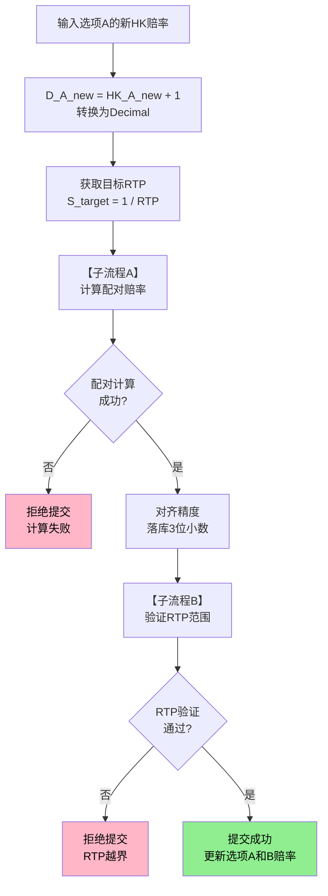

**主流程说明**：
1. 输入选项A新赔率 → 转换为Decimal
2. 获取目标RTP
3. 调用子流程A计算配对赔率（处理边界修正）
4. 精度对齐
5. 调用子流程B验证RTP范围
6. 通过后提交

#### 子流程A：双向盘配对赔率计算与边界修正

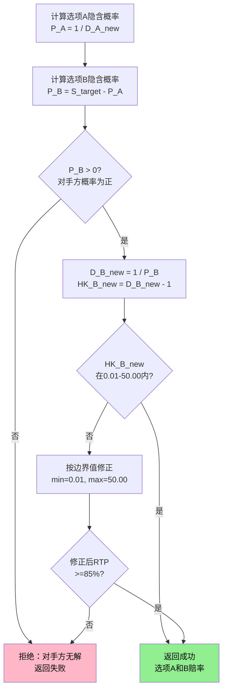

#### 子流程B：双向盘RTP范围验证

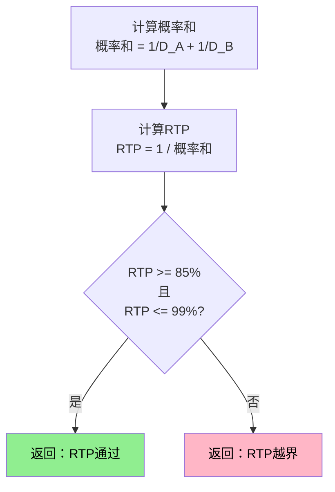

### 7.4.5 数值示例：让球盘（含显示舍入验算）

场景：目标RTP等于95.0%。操盘手将主队HK从0.88调整为0.85。

```
1) 计算（全精度）
D_主队 等于 1.85
S_target 等于 1 ÷ 0.95 等于 1.0526316
P_主队 等于 1 ÷ 1.85 等于 0.5405405
P_客队 等于 1.0526316 减 0.5405405 等于 0.5120911
D_客队 等于 1 ÷ 0.5120911 等于 1.9527407
HK_客队 等于 0.9527407

2) 落库与显示
落库（3位）：HK_客队 等于 0.953
显示（2位）：HK_客队 等于 0.95

3) 用"显示值"验算RTP（允许正负0.1%）
P_主队(显示) 等于 1 ÷ 1.85 等于 0.5405405
P_客队(显示) 等于 1 ÷ 1.95 等于 0.5128205
概率和 等于 1.0533610
RTP 约等于 1 ÷ 1.0533610 等于 0.9493 等于 94.93%
结论：显示舍入产生的偏差约等于0.07%，在容差内；落库值按3位维持更接近目标RTP。
```

---

## 7.5 多选项盘赔率缩放计算

### 7.5.1 适用范围

适用于同一盘口内有3个或更多开盘状态选项的玩法：独赢1X2（BT3）、总进球（BT7）、波胆（BT6）、反波胆（BT158）、半全场（BT9）、第X粒入球（BT159）、双重机会（BT8）。

### 7.5.2 缩放法公式（仅对开盘选项集合）

当操盘手调整某一开盘选项i的赔率后，其余开盘选项按比例缩放以维持目标RTP：

```
设：
  HK_i_new 等于 操盘手输入的新HK
  D_i_new 等于 HK_i_new 加 1
  RTP 等于 目标返奖率
  S_target 等于 1 ÷ RTP
  P_i_new 等于 1 ÷ D_i_new
  P_rest_old 等于 其余开盘选项原隐含概率之和

则：
  k 等于 (S_target 减 P_i_new) ÷ P_rest_old

对每个其余开盘选项j：
  P_j_new 等于 P_j_old × k
  D_j_new 等于 1 ÷ P_j_new
  HK_j_new 等于 D_j_new 减 1
```

#### 多选项缩放法流程图

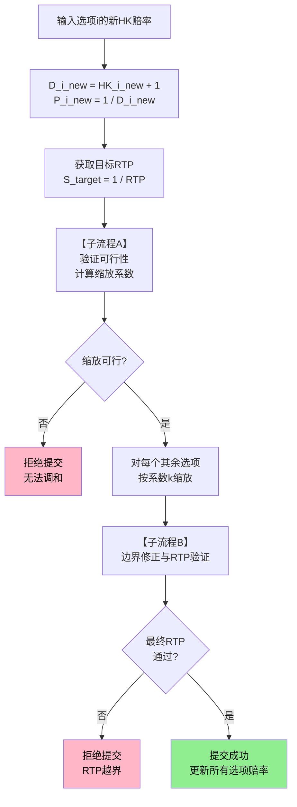

**主流程说明**：
1. 输入被调整选项赔率，获取目标RTP
2. 调用子流程A验证可行性并计算缩放系数k
3. 对每个其余选项按系数k缩放赔率
4. 调用子流程B处理边界修正与RTP最终验证
5. RTP通过后提交

#### 子流程A：多选项缩放可行性验证

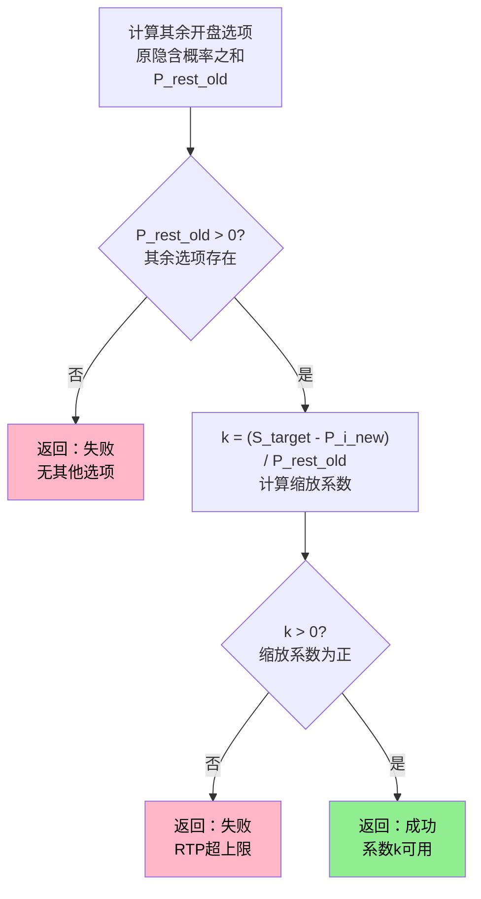

#### 子流程B：多选项缩放边界修正与RTP验证

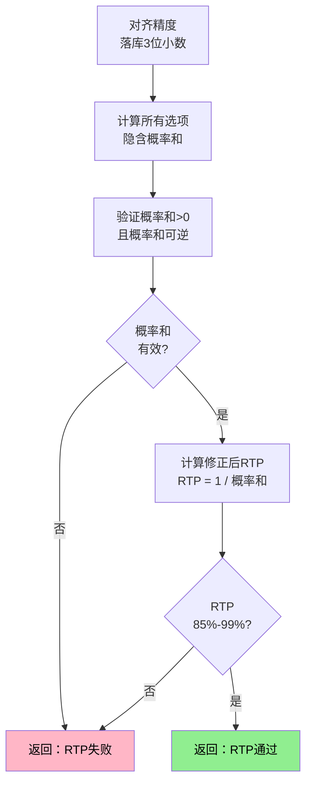

### 7.5.3 可行性校验（必须执行）

| 校验项           | 校验条件                                   | 失败处理                                         |
| ---------------- | ------------------------------------------ | ------------------------------------------------ |
| 其余开盘选项存在 | P_rest_old 大于 0                          | 拒绝提交，提示"无其他可用选项参与计算"           |
| 缩放系数为正     | k 大于 0（等价于 S_target 大于 P_i_new）   | 拒绝提交，提示"该赔率将导致返奖率超上限，请调整" |
| 缩放结果在边界内 | 所有 0.01 ≤ HK_j_new ≤ MaxHK | 触发边界修正（7.9节）                            |

### 7.5.4 数值示例：独赢1X2

场景：目标RTP等于94.1%。操盘手将主胜HK从0.85调为0.80。

```
初始：
  主胜D等于1.85 P等于0.5405
  和局D等于3.60 P等于0.2778
  客胜D等于4.10 P等于0.2439
  概率和等于1.0622 → RTP约等于94.1%

计算：
  S_target 等于 1 ÷ 0.941 等于 1.0627
  主胜新D等于1.80 → P_i_new等于0.5556
  P_rest_old等于0.2778加0.2439等于0.5217
  k等于(1.0627减0.5556)÷0.5217等于0.9720
  和局新P等于0.2700 → D等于3.704 → HK等于2.704（落库2.704，显示2.70）
  客胜新P等于0.2371 → D等于4.218 → HK等于3.218（落库3.218，显示3.22）

验证：概率和约等于1.0627 → RTP约等于94.1%
```

---

## 7.6 IM数据源推送处理

### 7.6.1 推送时序一致性规则

| 规则         | 说明                                                                 |
| ------------ | -------------------------------------------------------------------- |
| 新旧判定     | 以IM推送时间戳判定新旧；旧推送直接丢弃                               |
| 最小更新间隔 | 系统管理：数据源同步最小间隔等于500ms；500ms内多次推送合并为最后一帧 |
| 重复推送     | 新推送赔率与当前IM赔率完全一致，跳过处理                             |

### 7.6.2 数据源断连熔断规则

| 断连状态   | 处理方式                                                                   |
| ---------- | -------------------------------------------------------------------------- |
| 检测到断连 | 立即触发P0"数据源断连"告警；该数据源相关玩法进入隐藏态；禁止数据源同步更新 |
| 断连期间   | 本地落库赔率保持不变；IM列停止刷新                                         |
| 恢复连接   | 只处理恢复后的最新一帧；不回放断连期间历史推送                             |

### 7.6.3 IM赔率变更时的本地响应

| 数据源状态 | 本地行为                                             |
| ---------- | ---------------------------------------------------- |
| 开启       | 本地落库赔率直接同步为IM赔率（详见[第10章数据源开关](./10-数据源开关.md)） |
| 关盘       | 仅更新IM列与偏离展示；本地落库赔率不变               |

#### IM赔率推送处理流程图

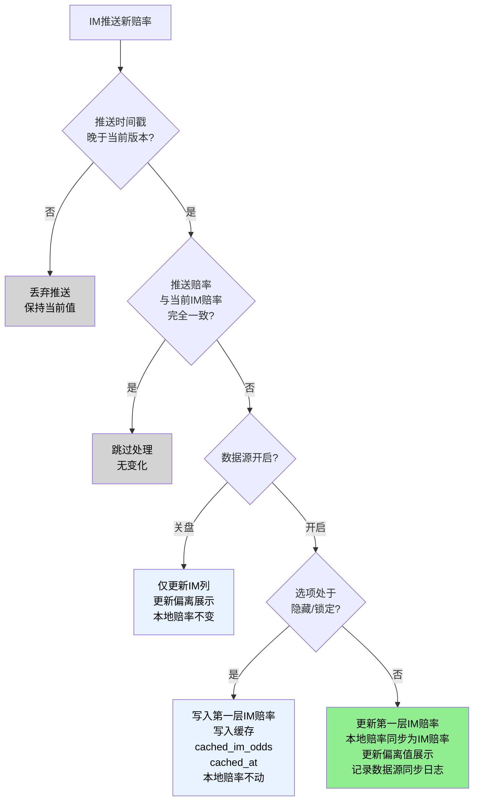

### 7.6.4 隐藏或锁定期间的缓存与恢复

当玩法/线/选项处于隐藏或锁定状态时：IM推送赔率仍写入第一层IM赔率；同时写入缓存字段cached_im_odds与cached_at；本地落库赔率不自动重算。

当状态恢复为开盘时：

- 若数据源开启：以cached_im_odds同步为本地落库赔率
- 若数据源关盘：仅更新IM列与偏离展示

---

## 7.7 手动赔率编辑

### 7.7.1 编辑交互

双击进入编辑。输入必须为0.01步进。Enter提交、ESC取消、Tab跳格（仅跳到可编辑单元格）。

### 7.7.2 手动编辑后的数据源处理

任一选项被手动编辑后该玩法数据源开关自动关闭。数据源关盘后IM推送不再改写本地落库赔率，仅更新IM列与偏离展示。需要恢复跟随需通过[第10章数据源开关确认流程](./10-数据源开关.md#_10-4-数据源开关状态变更)重新开启。

### 7.7.3 编辑后的联动计算

双向盘：编辑A后，B按配对公式重算（7.4）。多选项盘：编辑i后，其余开盘选项按缩放法重算（7.5）。全部计算必须通过：可行性校验、边界修正（若触边界）、RTP范围校验、单次调幅校验。

---

## 7.8 三种赔率调整方式

本系统提供三种赔率调整入口，操盘手可根据操盘意图选择最便捷的方式。三种方式本质上都是修改本地赔率，只是输入角度不同。

### 7.8.1 核心概念与关系

#### 概念定义

| 概念 | 定义 | 计算方式 | 性质 |
|------|------|----------|------|
| **IM赔率** | 数据源推送的赔率（第一层） | 由IM推送 | 只读 |
| **本地赔率** | 落库赔率（第二层），用于成交结算 | 操盘手调整或数据源同步 | 可编辑（数据源关盘时） |
| **偏离值** | 本地赔率与IM赔率的差值 | 偏离值 等于 本地赔率 减 IM赔率 | 可作为编辑入口（数据源关盘时） |
| **RTP** | 当前盘口的实际返奖率 | 根据所有开盘选项本地赔率计算 | 派生值，可作为编辑入口（见下方说明） |
| **目标RTP** | 联赛或玩法配置的目标返奖率 | 系统写死 | 配置项（默认值为95.0%） |

> **RTP编辑说明**：RTP是根据当前赔率计算的派生值。当操盘手「编辑RTP」时，实际上是告诉系统「我希望RTP变成这个值」，系统会按比例缩放所有选项赔率来达成这个目标。编辑完成后，新的RTP等于操盘手输入的值。

#### 数据关系图

```
┌─────────────────────────────────────────────────────────────┐
│                                                             │
│    IM赔率（只读）──────────────────┐                        │
│         │                          │                        │
│         │                          ▼                        │
│         │                   ┌────────────┐                  │
│         └──────────────────▶│  偏离值    │                  │
│                             │ (派生字段) │                  │
│                             └────────────┘                  │
│                                    ▲                        │
│                                    │                        │
│                             ┌──────┴──────┐                 │
│                             │             │                 │
│                    ┌────────────┐   ┌──────────┐            │
│                    │  本地赔率   │   │  RTP   │            │
│                    │ (主定义)  │◀──│ (派生值) │            │
│                    └────────────┘   └──────────┘            │
│                                                             │
│    关系：                                                    │
│    偏离值 = 本地赔率 - IM赔率                                │
│    RTP = f(所有选项本地赔率)                             │
│                                                             │
└─────────────────────────────────────────────────────────────┘
```

### 7.8.2 三种编辑入口总览

| 编辑入口 | 点击位置 | 输入内容 | 联动计算 | 适用场景 |
|----------|----------|----------|----------|----------|
| **本地赔率** | 本地赔率单元格 | 目标HK值 | 对手方配对，偏离值自动更新 | 需要设定精确赔率值 |
| **偏离值** | 偏离值单元格 | 目标偏离值 | 本地赔率=IM+偏离值，对手方配对 | 需要调整与IM的水差 |
| **RTP** | RTP显示区域 | 目标RTP | 所有选项按比例缩放，偏离值自动更新 | 需要调整利润空间 |

**统一交互模式**：所有编辑入口均采用「点击文字直接编辑」的交互方式，与赔率编辑保持一致。

#### 盘口卡片布局示意

```
┌─────────────────────────────────────────────────────────────────────────────┐
│  让球                                        RTP: 94.5% ← 可点击编辑    │
│  ┌─────────────────────────────────────────────────────────────────────────┐│
│  │ [全部展开] [显示副线] [数据源: 关盘 🔴▼]                                ││
│  └─────────────────────────────────────────────────────────────────────────┘│
│  ┌─────────┬─────────┬───────────┬──────────┬─────────┬─────────┬─────────┐│
│  │ 盘口线  │ IM赔率  │ 本地赔率  │ 偏离值   │ 货量    │ 分布    │ 状态    ││
│  │         │ (只读)  │ (可编辑)  │ (可编辑) │         │         │         ││
│  ├─────────┼─────────┼───────────┼──────────┼─────────┼─────────┼─────────┤│
│  │ -0.5 主 │  0.92   │   0.87    │  -0.05   │ ¥52K    │ ████░░  │ 开盘    ││
│  │ +0.5 客 │  0.86   │   0.91    │  +0.05   │ ¥48K    │ ░░████  │ 开盘    ││
│  └─────────┴─────────┴───────────┴──────────┴─────────┴─────────┴─────────┘│
└─────────────────────────────────────────────────────────────────────────────┘
```

### 7.8.3 编辑本地赔率（直接编辑）

#### 交互流程

| 步骤 | 操作 | 系统响应 |
|------|------|----------|
| 1 | 点击本地赔率单元格 | 进入编辑模式，显示输入框 |
| 2 | 输入目标HK值 | 实时校验格式（0.01步进） |
| 3 | 按Enter或点击外部 | 触发联动计算 |
| 4 | 计算完成 | 更新本地赔率、对手方赔率、偏离值 |

#### 联动计算规则

```
输入：目标本地赔率 HK_new

计算步骤：
1. 对手方赔率按配对公式（双向盘）或缩放法（多选项盘）计算，维持当前RTP
2. 偏离值 = HK_new - IM赔率（自动更新展示）
3. RTP保持不变（由配对/缩放保证）
```

#### 数值示例（双向盘）

```
修改前状态（让球盘）：
  主队：IM=0.92，本地=0.87，偏离=-0.05
  客队：IM=0.86，本地=0.91，偏离=+0.05
  （验证：P_主=0.5348，P_客=0.5236，概率和=1.0584，RTP=94.5%）

操作：点击主队本地赔率，输入 0.85

配对计算（维持RTP=94.5%）：
  S_target = 1.0584
  P_主_new = 1 ÷ 1.85 = 0.5405
  P_客_new = 1.0584 - 0.5405 = 0.5179
  D_客_new = 1 ÷ 0.5179 = 1.931
  HK_客_new = 0.931（落库0.931，显示0.93）

修改后状态：
  主队：本地=0.85，偏离=0.85-0.92=-0.07
  客队：本地=0.93，偏离=0.93-0.86=+0.07（自动配对）
  RTP仍=94.5%（不变）
```

### 7.8.4 编辑偏离值

#### 交互流程

| 步骤 | 操作 | 系统响应 |
|------|------|----------|
| 1 | 点击偏离值单元格 | 进入编辑模式，显示输入框 |
| 2 | 输入目标偏离值（支持正负） | 实时预览本地赔率变化 |
| 3 | 按Enter或点击外部 | 触发联动计算 |
| 4 | 计算完成 | 更新本地赔率、对手方赔率 |

#### 联动计算规则

```
输入：目标偏离值 Offset_new

计算步骤：
1. 本地赔率 = IM赔率 + Offset_new
2. 对手方赔率按配对公式（双向盘）或缩放法（多选项盘）计算，维持当前RTP
3. RTP保持不变
```

#### 偏离值输入规则

| 规则项 | 规则 | 说明 |
|--------|------|------|
| 格式 | 支持正负小数，0.01步进 | 如+0.05、-0.03、0.00 |
| 范围 | -1.00 至 +1.00 | 默认值为正负1.00（系统写死） |
| 显示精度 | 2位小数 | 如+0.05、-0.03 |
| 落库精度 | 3位小数 | 与本地赔率落库精度一致 |
| 正负号显示 | 正数显示+号，负数显示-号，零显示0.00 | 如+0.05、-0.03、0.00 |

#### 数值示例（双向盘）

```
修改前状态（让球盘）：
  主队：IM=0.92，本地=0.87，偏离=-0.05
  客队：IM=0.86，本地=0.91，偏离=+0.05
  （验证：P_主=0.5348，P_客=0.5236，概率和=1.0584，RTP=94.5%）

操作：点击主队偏离值，输入 -0.07

联动计算：
  主队新本地赔率 = 0.92 + (-0.07) = 0.85

配对计算（维持RTP=94.5%）：
  S_target = 1.0584
  P_主_new = 1 ÷ 1.85 = 0.5405
  P_客_new = 1.0584 - 0.5405 = 0.5179
  D_客_new = 1.931，HK_客_new = 0.931（显示0.93）

修改后状态：
  主队：本地=0.85，偏离=-0.07（用户输入）
  客队：本地=0.93，偏离=0.93-0.86=+0.07（自动配对）
  RTP仍=94.5%（不变）
```

#### 编辑态UI示意

```
点击前：
┌─────────┬─────────┬───────────┬──────────┐
│ -0.5 主 │  0.92   │   0.87    │  -0.05   │  ← 点击 -0.05
└─────────┴─────────┴───────────┴──────────┘

点击后（编辑态，实时预览）：
┌─────────┬─────────┬───────────┬──────────┐
│ -0.5 主 │  0.92   │   0.85    │ [-0.07]  │  ← 输入框
│         │         │   ↑预览    │          │
└─────────┴─────────┴───────────┴──────────┘

Enter确认后：
┌─────────┬─────────┬───────────┬──────────┐
│ -0.5 主 │  0.92   │   0.85    │  -0.07   │
│ +0.5 客 │  0.86   │   0.93    │  +0.07   │  ← 对手方自动配对
└─────────┴─────────┴───────────┴──────────┘
```

#### 多选项盘的偏离值编辑

对于独赢1X2、总进球等多选项盘，编辑一个选项的偏离值后，其他选项按缩放法联动调整：

```
场景：独赢1X2，RTP=94.1%

修改前：
  主胜：IM=0.85，本地=0.85，偏离=0.00
  和局：IM=2.60，本地=2.60，偏离=0.00
  客胜：IM=3.10，本地=3.10，偏离=0.00
  （验证：P_主=0.5405，P_和=0.2778，P_客=0.2439，概率和=1.0622，RTP=94.1%）

操作：编辑主胜偏离值为 -0.05

计算过程：
  1. 主胜新本地赔率 = 0.85 + (-0.05) = 0.80
  2. 主胜新概率 P_主_new = 1 ÷ 1.80 = 0.5556
  3. 目标概率和 S_target = 1.0622（维持RTP=94.1%不变）
  4. 剩余概率空间 = 1.0622 - 0.5556 = 0.5066
  5. 原其余概率和 P_rest_old = 0.2778 + 0.2439 = 0.5217
  6. 缩放系数 k = 0.5066 ÷ 0.5217 = 0.9711
  7. 和局新概率 = 0.2778 × 0.9711 = 0.2698，D=3.706，HK=2.706（显示2.71）
  8. 客胜新概率 = 0.2439 × 0.9711 = 0.2369，D=4.221，HK=3.221（显示3.22）

修改后：
  主胜：本地=0.80，偏离=-0.05（用户输入）
  和局：本地=2.71，偏离=+0.11（按缩放法自动调整）
  客胜：本地=3.22，偏离=+0.12（按缩放法自动调整）
  RTP仍=94.1%（不变）
```

### 7.8.5 编辑RTP

#### 交互流程

| 步骤 | 操作 | 系统响应 |
|------|------|----------|
| 1 | 点击RTP显示区域 | 进入编辑模式，显示输入框 |
| 2 | 输入目标RTP（百分比） | 实时预览所有选项赔率变化 |
| 3 | 按Enter或点击外部 | 触发缩放计算 |
| 4 | 计算完成 | 更新所有选项本地赔率和偏离值 |

#### 联动计算规则

```
输入：目标RTP（如93.0%）

计算步骤：
1. 计算当前概率和 S_old = 所有开盘选项 (1 ÷ D_i) 之和
2. 计算目标概率和 S_new = 1 ÷ RTP_new
3. 计算缩放系数 k = S_new ÷ S_old
4. 对每个开盘选项：
   P_i_new = P_i_old × k
   D_i_new = 1 ÷ P_i_new
   HK_i_new = D_i_new 减 1
5. 更新所有选项的偏离值 = HK_i_new 减 IM_i
```

#### RTP输入规则

| 规则项 | 规则 | 说明 |
|--------|------|------|
| 格式 | 百分比，0.1%步进 | 如93.0%、95.5% |
| 范围 | 85.0% 至 99.0% | 默认值为85.0%至99.0%（系统写死） |
| 显示 | 保留1位小数 | 如94.5% |

#### 数值示例（与7.8.2卡片布局一致）

```
修改前状态（让球盘）：
  主队：IM=0.92，本地=0.87，偏离=-0.05
  客队：IM=0.86，本地=0.91，偏离=+0.05
  （验证：P_主=0.5348，P_客=0.5236，概率和=1.0584，RTP=94.5%）

操作：点击RTP，输入 93.0%

计算过程：
  S_old = 1÷1.87 + 1÷1.91 = 0.5348 + 0.5236 = 1.0584（对应RTP=94.5%）
  S_new = 1÷0.93 = 1.0753
  k = 1.0753 ÷ 1.0584 = 1.0160

  主队：P_new = 0.5348 × 1.0160 = 0.5434
        D_new = 1 ÷ 0.5434 = 1.840，HK_new = 0.84
  客队：P_new = 0.5236 × 1.0160 = 0.5320
        D_new = 1 ÷ 0.5320 = 1.880，HK_new = 0.88

  验证：概率和 = 0.5434 + 0.5320 = 1.0754，RTP = 1 ÷ 1.0754 = 93.0% ✓

修改后状态：
  主队：本地=0.84，偏离=0.84-0.92=-0.08
  客队：本地=0.88，偏离=0.88-0.86=+0.02
  RTP = 93.0%（用户输入）
```

#### 编辑态UI示意

```
点击前（与7.8.2卡片布局一致）：
┌─────────────────────────────────────────────┐
│  让球                          RTP: 94.5%   │  ← 点击 94.5%
└─────────────────────────────────────────────┘
┌─────────┬─────────┬───────────┬──────────┐
│ -0.5 主 │  0.92   │   0.87    │  -0.05   │
│ +0.5 客 │  0.86   │   0.91    │  +0.05   │
└─────────┴─────────┴───────────┴──────────┘
（验证：P_主=0.5348，P_客=0.5236，概率和=1.0584，RTP=94.5%）

点击后（编辑态，输入93.0%，实时预览）：
┌─────────────────────────────────────────────┐
│  让球                          RTP: [93.0%] │
└─────────────────────────────────────────────┘
┌─────────┬─────────┬───────────┬──────────┐
│ -0.5 主 │  0.92   │   0.84    │  -0.08   │  ← 预览
│ +0.5 客 │  0.86   │   0.88    │  +0.02   │  ← 预览
└─────────┴─────────┴───────────┴──────────┘
（计算：k=1.0160，主队D=1.84/HK=0.84，客队D=1.88/HK=0.88）

Enter确认后：
┌─────────────────────────────────────────────┐
│  让球                          RTP: 93.0%   │
└─────────────────────────────────────────────┘
┌─────────┬─────────┬───────────┬──────────┐
│ -0.5 主 │  0.92   │   0.84    │  -0.08   │
│ +0.5 客 │  0.86   │   0.88    │  +0.02   │
└─────────┴─────────┴───────────┴──────────┘
（验证：P_主=0.5435，P_客=0.5319，概率和=1.0754，RTP=93.0% ✓）
```

### 7.8.6 联动计算规则详解

#### 三种编辑方式的区别

| 编辑入口 | 用户意图 | 联动计算 | RTP处理 | 偏离值处理 |
|----------|----------|----------|---------|------------|
| 编辑本地赔率 | 我要把这个选项的赔率设为X | 对手方配对/缩放 | 维持当前RTP不变 | 自动更新 |
| 编辑偏离值 | 我要让这个选项比IM高/低Y | 本地赔率=IM+偏离，对手方配对/缩放 | 维持当前RTP不变 | 用户输入 |
| 编辑RTP | 我要把整个盘口的利润空间调整为Z | 所有选项按比例缩放 | 变更为用户输入值 | 自动更新 |

#### 「维持RTP」vs「调整RTP」的区别

```
场景A：编辑本地赔率或偏离值（维持RTP）
┌────────────────────────────────────────────────────────────┐
│  操作前：主队0.87，客队0.91，RTP=94.5%                      │
│  （验证：P_主=0.5348，P_客=0.5236，概率和=1.0584）          │
│                                                            │
│  操作：把主队改为0.85                                       │
│                                                            │
│  计算：维持RTP=94.5%，S_target=1.0584                      │
│        P_主_new=0.5405，P_客_new=0.5179，D_客=1.931        │
│                                                            │
│  结果：客队自动变为0.93（按配对公式），RTP仍=94.5%         │
│  说明：对手方自动调整来「补偿」你的调整，保持RTP不变        │
└────────────────────────────────────────────────────────────┘

场景B：编辑RTP（调整RTP）
┌────────────────────────────────────────────────────────────┐
│  操作前：主队0.87，客队0.91，RTP=94.5%                      │
│                                                            │
│  操作：把RTP改为93%                                         │
│                                                            │
│  计算：S_old=1.0584，S_new=1.0753，k=1.0160                │
│        主队P_new=0.5433，D=1.84，HK=0.84                   │
│        客队P_new=0.5320，D=1.88，HK=0.88                   │
│                                                            │
│  结果：主队变为0.84，客队变为0.88（按比例同时调整）         │
│  说明：所有选项同向调整，整体压缩利润空间                   │
└────────────────────────────────────────────────────────────┘
```

#### 核心原则

1. **主定义**：三种方式最终都是修改「本地赔率」，偏离值和RTP都是派生展示值
2. **不可同时编辑**：一次只能通过一个入口调整，不支持同时修改偏离值和RTP
3. **配对必须满足**：无论哪种方式，双向盘的对手方必须按配对公式联动，多选项盘必须按缩放法联动

### 7.8.7 数据源状态对编辑权限的影响

| 数据源状态 | IM赔率 | 本地赔率 | 偏离值 | RTP | 说明 |
|------------|--------|----------|--------|---------|------|
| **开启** | 只读 | 只读 | 只读 | 只读 | 本地赔率跟随IM，不可手动调整 |
| **关盘** | 只读 | ✅ 可编辑 | ✅ 可编辑 | ✅ 可编辑 | 本地赔率独立，可手动调整 |

#### 数据源开启时的界面状态

```
┌─────────────────────────────────────────────────────────────────────────────┐
│  让球                                        RTP: 95.0% (只读)          │
│  ┌─────────────────────────────────────────────────────────────────────────┐│
│  │ [全部展开] [显示副线] [数据源: 开启 🟢▼]                                ││
│  └─────────────────────────────────────────────────────────────────────────┘│
│  ┌─────────┬─────────┬───────────┬──────────┬─────────┬─────────┬─────────┐│
│  │ 盘口线  │ IM赔率  │ 本地赔率  │ 偏离值   │ 货量    │ 分布    │ 状态    ││
│  │         │         │ (只读)    │ (只读)   │         │         │         ││
│  ├─────────┼─────────┼───────────┼──────────┼─────────┼─────────┼─────────┤│
│  │ -0.5 主 │  0.92   │   0.92    │   0.00   │ ¥52K    │ ████░░  │ 开盘    ││
│  │ +0.5 客 │  0.86   │   0.86    │   0.00   │ ¥48K    │ ░░████  │ 开盘    ││
│  └─────────┴─────────┴───────────┴──────────┴─────────┴─────────┴─────────┘│
└─────────────────────────────────────────────────────────────────────────────┘
```

#### 点击只读字段时的提示

当数据源开启时，点击本地赔率、偏离值或RTP，显示提示：

```
┌────────────────────────────────────────┐
│ ⚠️ 数据源开启时无法编辑                │
│    需先关盘数据源后才能调整赔率        │
│                                        │
│              [关盘数据源]              │
└────────────────────────────────────────┘
```

### 7.8.8 异常场景与错误提示

#### 前端实时校验

| 校验场景 | 校验规则 | 错误提示 |
|----------|----------|----------|
| 本地赔率格式 | 必须为数字，0.01步进 | 请输入有效的赔率格式（如0.85） |
| 本地赔率范围 | 0.01 至 50.00 | 赔率必须在0.01至50.00之间 |
| 偏离值格式 | 必须为数字，支持正负，0.01步进 | 请输入有效的偏离值（如-0.05或+0.03） |
| 偏离值范围 | -1.00 至 +1.00 | 偏离值必须在-1.00至+1.00之间 |
| RTP格式 | 必须为百分比，0.1%步进 | 请输入有效的RTP（如93.0%） |
| RTP范围 | 85.0% 至 99.0% | RTP必须在85.0%至99.0%之间 |

#### 计算后校验

| 校验场景 | 校验规则 | 错误提示 | 处理方式 |
|----------|----------|----------|----------|
| 对手方概率为负 | P_B 大于 0 | 该调整将导致对手方赔率无解，请调整 | 拒绝提交，保持编辑态 |
| 缩放系数为负 | k 大于 0 | 该RTP将导致赔率无解，请调整 | 拒绝提交，保持编辑态 |
| 计算结果越界 | 所有HK在0.01至50.00内 | 计算结果超出赔率边界，已自动调整 | 触发边界修正 |
| 偏离值计算结果越界 | 本地赔率在0.01至50.00内 | 该偏离值将导致赔率超出边界 | 拒绝提交，提示调整 |
| 单次调幅过大 | 调整幅度≤0.20 | 单次调整幅度过大，请分步调整 | 拒绝提交，保持编辑态 |

#### 特殊场景处理

| 场景 | 系统行为 | 提示信息 |
|------|----------|----------|
| IM赔率为空 | 偏离值列显示"--"，不可编辑 | 数据源未推送赔率，无法计算偏离值 |
| 可售集合不足 | 所有编辑入口置灰 | 可售选项不足，无法进行赔率调整 |
| 数据源断连 | 所有编辑入口置灰 | 数据源已断连，请等待恢复 |
| 玩法处于隐藏/锁定 | 赔率可编辑，但提交时提示 | 当前玩法处于隐藏/锁定状态，调整仅影响赔率不改变状态 |

#### 并发冲突处理

当编辑过程中其他操盘手或系统修改了同一盘口：

```
┌────────────────────────────────────────────────────────────┐
│  ⚠️ 赔率已被其他操作修改                                   │
├────────────────────────────────────────────────────────────┤
│                                                            │
│  您编辑时的赔率：0.89                                      │
│  当前最新赔率：0.87（由 张三 于 14:32:15 修改）            │
│                                                            │
│  您的调整：将赔率改为 0.85                                 │
│                                                            │
├────────────────────────────────────────────────────────────┤
│      [放弃我的修改]              [覆盖并提交]              │
└────────────────────────────────────────────────────────────┘
```

#### 赔率编辑主流程图

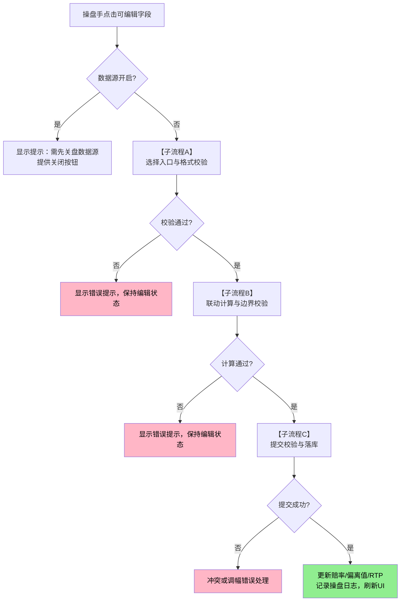

##### 子流程A：选择入口与格式校验

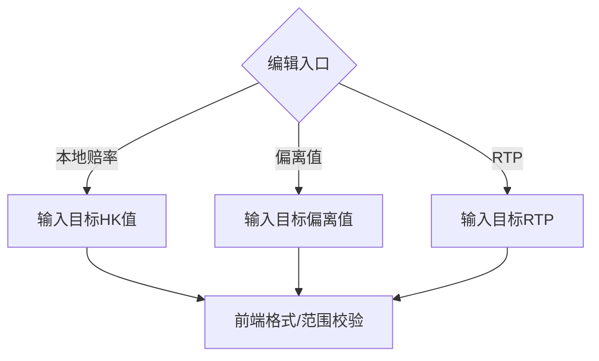

##### 子流程B：联动计算与边界校验

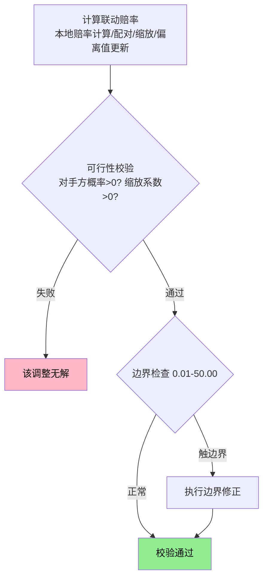

##### 子流程C：提交校验与落库

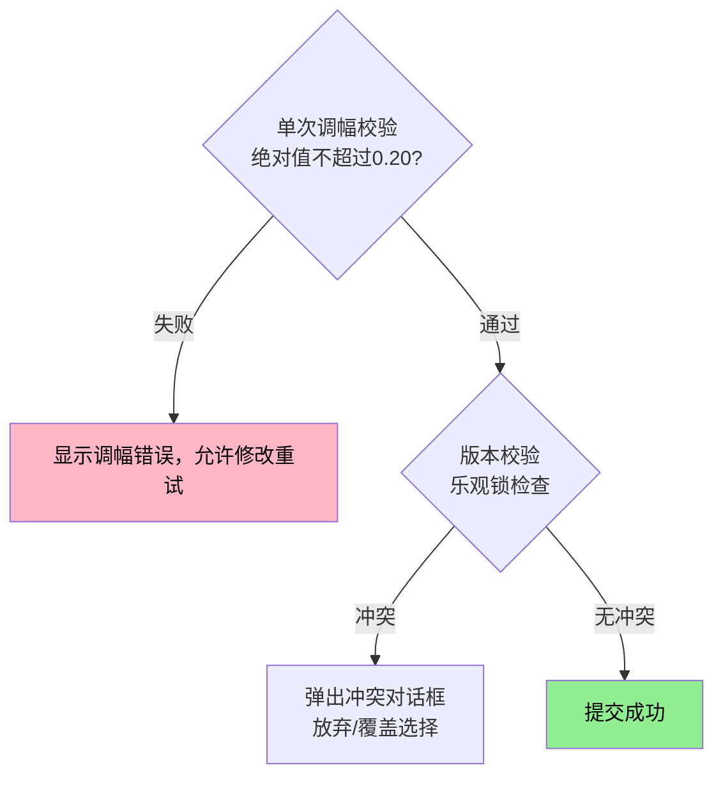

### 7.8.10 日志记录

三种调整方式的日志记录统一使用赔率变更日志（7.14节），新增以下字段用于区分调整方式：

| 字段 | 类型 | 说明 |
|------|------|------|
| edit_entry | enum | 编辑入口：local_odds/deviation/rtp |
| input_value | string | 用户输入值（如"0.85"、"-0.07"、"93.0%"） |
| old_deviation | decimal(4,3) | 调整前偏离值 |
| new_deviation | decimal(4,3) | 调整后偏离值 |
| old_rtp | decimal(4,3) | 调整前RTP |
| new_rtp | decimal(4,3) | 调整后RTP |

#### 编辑入口枚举

| 入口标识 | 说明 |
|----------|------|
| local_odds | 通过编辑本地赔率触发 |
| deviation | 通过编辑偏离值触发 |
| rtp | 通过编辑RTP触发 |

---

## 7.9 赔率边界修正策略

### 什么是边界修正？

当操盘手调整赔率后，系统需要计算对手方赔率来维持RTP。计算结果超出允许范围时（如低于0.01或高于50.00），系统会自动修正：

```
场景举例：
操盘手把主队赔率调到很低（如0.05），导致配对计算出的客队赔率超过50.00

如果直接截断到50.00 → RTP会严重偏离目标值
边界修正策略 → 反向调整主队赔率，使双方都在合法范围内，同时尽量接近目标RTP
```

**通俗理解**：边界修正就是「双方都要在合法范围内，同时保证RTP不偏离太多」的自动调整机制。

> **引用说明**：本节边界修正策略同时适用于7.8节三种调整方式触发的边界处理。

### 7.9.1 全局赔率边界

| 参数       |    默认值    | 归属     |
| ---------- | :----------: | -------- |
| 最小HK赔率 |     0.01     | 系统写死 |
| 最大HK赔率 |    50.00     | 系统写死 |
| RTP区间    | 85.0%至99.0% | 系统写死 |

### 7.9.2 双向盘边界修正（含反推公式）

当对手方计算结果超出边界时，系统自动反向调整：

| 触达情况            | 处理方式                                                  |
| ------------------- | --------------------------------------------------------- |
| HK_B_new 小于 0.01  | 固定HK_B等于0.01，反推HK_A以维持目标RTP                   |
| HK_B_new 大于 50.00 | 固定HK_B等于50.00，反推HK_A以维持目标RTP                  |
| 反推后HK_A仍越界    | 拒绝提交，提示"当前RTP下无法找到有效赔率组合，请人工处理" |

**反推公式**（以触底为例，HK_B固定为0.01）：

```
设：
  HK_B_fixed 等于 0.01
  D_B_fixed 等于 1.01
  RTP 等于 目标返奖率
  S_target 等于 1 ÷ RTP

则：
  P_B_fixed 等于 1 ÷ D_B_fixed 等于 0.9901
  P_A_new 等于 S_target 减 P_B_fixed
  D_A_new 等于 1 ÷ P_A_new
  HK_A_new 等于 D_A_new 减 1

校验：若HK_A_new 大于 50.00 或 小于 0.01，则无解，拒绝提交
```

#### 数值示例：双向盘边界修正

```
场景：目标RTP=95%，操盘手把主队HK调为0.03（极低）

第一步：按配对公式计算客队赔率
  S_target = 1 ÷ 0.95 = 1.0526
  P_主队 = 1 ÷ 1.03 = 0.9709
  P_客队 = 1.0526 - 0.9709 = 0.0817
  D_客队 = 1 ÷ 0.0817 = 12.24
  HK_客队 = 11.24 ✓（在0.01-50.00范围内，无需修正）

场景：目标RTP=95%，操盘手把主队HK调为0.02（极端低）

第一步：按配对公式计算客队赔率
  P_主队 = 1 ÷ 1.02 = 0.9804
  P_客队 = 1.0526 - 0.9804 = 0.0722
  D_客队 = 1 ÷ 0.0722 = 13.85
  HK_客队 = 12.85 ✓（仍在范围内）

场景：目标RTP=95%，操盘手把主队HK调为0.01（触底）

第一步：按配对公式计算客队赔率
  P_主队 = 1 ÷ 1.01 = 0.9901
  P_客队 = 1.0526 - 0.9901 = 0.0625
  D_客队 = 1 ÷ 0.0625 = 16.00
  HK_客队 = 15.00 ✓（仍在范围内）

结论：只有当计算结果超出0.01-50.00范围时才触发边界修正
```

### 7.9.3 多选项盘边界修正

**通俗解释**：当独赢1X2等多选项盘中，某些选项计算结果超出边界时，系统会：
1. 把超出边界的选项固定在边界值（如50.00或0.01）
2. 重新分配剩余空间给其他选项
3. 确保整体RTP仍在目标范围内

**处理步骤**：

1. 先按缩放法计算一次所有选项赔率
2. 找出超出边界的选项，固定到边界值（如HK超过50.00则固定为50.00）
3. 把固定后剩余的RTP空间，按比例分配给未超限选项
4. 重复检查，直到没有新的超限
5. 若最终仍无法满足RTP约束：拒绝提交并提示人工处理

#### 数值示例：独赢1X2边界修正

```
场景：独赢1X2，目标RTP=94.1%，操盘手将主胜HK从0.85调为0.55（极低）

初始状态：
  主胜：HK=0.85，D=1.85，P=0.5405
  和局：HK=2.60，D=3.60，P=0.2778
  客胜：HK=3.10，D=4.10，P=0.2439
  概率和=1.0622，RTP=94.1%

第一步：按缩放法计算
  S_target = 1 ÷ 0.941 = 1.0627
  主胜新D = 1.55，P_主_new = 1 ÷ 1.55 = 0.6452
  P_rest_old = 0.2778 + 0.2439 = 0.5217
  k = (1.0627 - 0.6452) ÷ 0.5217 = 0.8003

  和局新P = 0.2778 × 0.8003 = 0.2223
  和局新D = 1 ÷ 0.2223 = 4.499，HK = 3.499（在范围内 ✓）

  客胜新P = 0.2439 × 0.8003 = 0.1952
  客胜新D = 1 ÷ 0.1952 = 5.123，HK = 4.123（在范围内 ✓）

第二步：边界检查
  主胜 HK=0.55 ✓（大于0.01，小于50.00）
  和局 HK=3.50 ✓（在范围内）
  客胜 HK=4.12 ✓（在范围内）

结果：无需边界修正，直接落库
  主胜：0.55（落库0.550，显示0.55）
  和局：3.50（落库3.499，显示3.50）
  客胜：4.12（落库4.123，显示4.12）

验证：概率和 = 0.6452 + 0.2223 + 0.1952 = 1.0627，RTP = 94.1% ✓
```

#### 触发边界修正的极端场景

```
场景：独赢1X2，目标RTP=94.1%，操盘手将主胜HK调为0.02（极端低）

第一步：按缩放法计算
  S_target = 1.0627
  主胜新D = 1.02，P_主_new = 0.9804
  P_rest_old = 0.5217
  k = (1.0627 - 0.9804) ÷ 0.5217 = 0.1578

  和局新P = 0.2778 × 0.1578 = 0.0438
  和局新D = 22.83，HK = 21.83 ✓（在范围内）

  客胜新P = 0.2439 × 0.1578 = 0.0385
  客胜新D = 25.97，HK = 24.97 ✓（在范围内）

结果：虽然极端，但仍在0.01-50.00范围内，无需修正

验证：概率和 = 0.9804 + 0.0438 + 0.0385 = 1.0627，RTP = 94.1% ✓
```

#### 真正触发边界修正的场景

```
场景：独赢1X2，目标RTP=94.1%，操盘手将主胜HK调为0.008（低于最小值0.01）

系统行为：
1. 前端校验拦截：HK必须≥0.01
2. 拒绝提交，提示"赔率必须在0.01至50.00之间"

结论：边界修正主要处理「计算结果越界」而非「输入越界」
      输入越界由前端校验直接拦截
```

### 7.9.4 可售集合不足处理

当某集合内"可售选项数"小于该玩法最小成集合要求时（2选项玩法需≥2；3选项玩法需≥3），触发以下处理：

| 处理项 | 规则 |
|--------|------|
| 系统行为 | 该集合强制进入「隐藏」状态，隐藏来源标识等于data_source（表示上游数据不完整导致不可售） |
| 数据源行为 | 数据源开关在该集合上自动停用（不做自动重算、不跟随推送改价），直到集合恢复为可售 |
| 人工编辑 | 禁止对该集合进行赔率编辑与批量改价（编辑控件置灰），避免单边风险 |

**恢复规则**：当集合恢复可售后：
- 若数据源开启：按数据源状态恢复（仍需遵守上级状态上限与覆盖规则）
- 若数据源关盘：保持隐藏，需人工取消隐藏

---

## 7.10 货量变化与赔率调整

### 7.10.1 业务背景

#### 为什么货量变化需要调整赔率？

当玩家在某个选项上大量投注时，平台在该选项上的风险敞口增加。通过降低热门方赔率（跳水），可以：
1. 降低潜在赔付，控制风险敞口
2. 引导后续投注流向冷门方，平衡两边货量
3. 使赔率更真实反映市场预期

```
示例：让球盘 主队-0.5，目标RTP=95%
┌────────────────────────────────────────────────────────────────────┐
│  初始状态：主队0.85 vs 客队0.93，货量均衡                          │
│                                                                    │
│  玩家大量投注主队 → 主队货量占比升至70%                            │
│                                                                    │
│  风险：若主队赢，平台需赔付大量资金                                │
│                                                                    │
│  跳水调整：主队0.85→0.83，客队按配对公式0.93→0.98（维持RTP=95%）  │
│                                                                    │
│  效果：降低主队赔付倍数，吸引后续玩家投注客队                      │
└────────────────────────────────────────────────────────────────────┘
```

#### 两种赔率调整路径

货量变化导致的赔率调整有两种路径，由数据源开关状态决定：

| 数据源状态 | 赔率调整路径 | 说明 |
|------------|--------------|------|
| **开启** | IM推送 → 本地自动同步 | IM根据全市场货量调整赔率并推送，本地自动跟随 |
| **关盘** | 本地自动跳水 或 操盘手手动调整 | 本地根据本地货量独立调整，不受IM影响 |

#### 路径A：数据源开启时的赔率调整

```
┌──────────────────────────────────────────────────────────────────────────────┐
│  数据源开启：IM跟随模式                                                       │
└──────────────────────────────────────────────────────────────────────────────┘

    玩家下注
        │
        ▼
    ┌─────────────────┐
    │  投注成交       │
    │  （飞单到IM）   │
    └────────┬────────┘
             │
             ▼
    ┌─────────────────┐                    ┌─────────────────┐
    │  IM根据全市场   │                    │  本地系统       │
    │  货量调整赔率   │ ──IM推送新赔率──▶ │  自动同步       │
    │  （IM内部逻辑） │                    │  本地赔率=IM赔率│
    └─────────────────┘                    └─────────────────┘

    特点：
    · 本地赔率完全跟随IM，操盘手无需手动调整
    · 本地货量监控仅用于告警，不触发本地跳水
    · 风险由IM承担（飞单模式）
```

#### 路径B：数据源关盘时的赔率调整

```
┌──────────────────────────────────────────────────────────────────────────────┐
│  数据源关盘：本地独立模式                                                     │
└──────────────────────────────────────────────────────────────────────────────┘

    玩家下注
        │
        ▼
    ┌─────────────────┐
    │  投注成交       │
    │  （本地承接）   │
    └────────┬────────┘
             │
             ▼
    ┌─────────────────┐
    │  更新本地货量   │
    │  ·累计投注额    │
    │  ·单边比例      │
    │  ·风险敞口      │
    └────────┬────────┘
             │
        ┌────┴────┐
        ▼         ▼
    [达到阈值]  [未达阈值]
        │         │
        ▼         ▼
    ┌─────────┐  ┌─────────────────┐
    │ 自动跳水│  │ 等待             │
    │ （7.10.3）│ │ ·操盘手手动调整 │
    └─────────┘  │ ·或继续累积     │
                 └─────────────────┘

    特点：
    · 本地赔率独立于IM，IM推送不影响本地
    · 本地货量触发自动跳水机制
    · 风险由本地承担，操盘手需关注货量变化
```

#### 操盘手的决策场景

| 场景 | 数据源状态 | 操盘手行为 |
|------|------------|------------|
| 信任IM定价，愿意飞单 | 开启 | 无需操作，赔率自动跟随IM |
| 发现IM赔率不合理 | 开启→关盘 | 关盘数据源，手动调整本地赔率 |
| 本地货量严重失衡 | 关盘 | 手动调整赔率，或等待自动跳水 |
| 本地货量正常但想主动调价 | 关盘 | 通过编辑本地赔率/偏离值/RTP调整 |
| 紧急风险事件 | 任意 | 锁定盘口停止接单，评估后再处理 |

> **数据源开关详细说明**：数据源开启/关盘的完整规则和切换流程详见[第10章「数据源开关」](./10-数据源开关.md)。

---

### 7.10.2 自动跳水触发条件

| 触发条件           | 默认阈值  | 归属     | 动作           |
| ------------------ | :-------: | -------- | -------------- |
| 累计投注额达到阈值 |  500,000  | 风控管理 | 告警加跳水     |
| 单笔大额投注       |  50,000   | 风控管理 | 告警加跳水     |
| 单边比例超限       |    70%    | 风控管理 | 告警加跳水     |
| 单边比例严重超限   |    85%    | 风控管理 | 告警加自动锁盘 |
| 净风险敞口超限     | 1,000,000 | 风控管理 | 告警加跳水     |

> **告警阈值说明**：单笔大额告警阈值=5万（与跳水阈值50,000一致），累计告警阈值=20万（跳水阈值50万时早已超过告警阈值）。

> **触发范围**：自动跳水仅在数据源关盘时触发。数据源开启时，本地货量监控仅用于告警，赔率由IM推送同步。

> **后续扩展（待开发）**：当前自动跳水仅支持货量驱动。后续版本计划支持以下触发类型：
> - **时间驱动**：临近开赛、滚球时间进程（半场末、补时）自动收紧赔率
> - **比赛事件驱动**：进球、红牌、点球、VAR等事件触发赔率调整（需对接比赛事件数据源）
> - **风控模型驱动**：异常投注模式、关联账户、套利检测触发主动调整

### 7.10.3 风险口径定义

最大潜在赔付（Payout）：Payout_i 等于 Stake_i × Decimal_i

净风险敞口（Liability，用于触发阈值）：Liability_i 等于 Payout_i 减 TotalStake_market。其中TotalStake_market 等于该玩法或该盘口口径下的总投注额。

> **风险敞口详细口径**：参见操盘页PRD输出核心摘要文档。

### 7.10.4 跳水幅度公式

```
跳水幅度 等于 基础跳幅 × (触发投注额 ÷ 累计投注额阈值)

约束：
  跳水幅度 ≤ 单次跳幅上限
  累计跳幅 ≤ 累计跳幅上限
  热门方跳水后HK ≥ 0.01
```

默认值：基础跳幅等于0.02；单次跳幅上限等于0.05；累计跳幅上限等于0.30。

### 7.10.5 执行算法

双向盘：热门方降赔；对手方用配对公式重算以维持目标RTP。多选项盘：热门方降赔；其余开盘选项用缩放法重算以维持目标RTP。全部跳水必须通过：可行性校验、边界修正（若触边界）、RTP区间校验（85%至99%）。

> **「目标RTP」vs「当前RTP」说明**：
>
> - **手动编辑**（7.8节）：按**当前RTP**配对。操盘手有意把RTP设为94.5%获取更高利润时，系统尊重其策略。
> - **自动跳水**（本节）：按**目标RTP**配对。系统风控应执行标准化的目标RTP（系统写死，默认95%）。
>
> 因此会出现：盘口初始RTP=94.5%，自动跳水后RTP变为95%的情况，这是预期行为。

### 7.10.6 数值示例（让球盘大额触发）

场景：目标RTP等于95%。主队HK等于0.90，一笔80,000投注投向主队，触发大额跳水。跳水：热门方降0.02 → 主队HK等于0.88（D等于1.88）

```
S 等于 1 ÷ 0.95 等于 1.0526316
P主 等于 1 ÷ 1.88 等于 0.5319149
P客 等于 0.5207167 大于 0
D客 等于 1 ÷ 0.5207167 等于 1.9204
HK客 等于 0.9204（落库0.920，显示0.92）
```

### 7.10.7 完整业务场景示例

以下示例展示货量变化导致赔率调整的完整业务流程：

```
场景：英超比赛 曼联 vs 利物浦，让球盘 曼联-0.5
数据源状态：关盘（本地独立承接）
目标RTP：95%

═══════════════════════════════════════════════════════════════════════════════

【第一阶段：初始状态】

  赔率：曼联 0.85 vs 利物浦 0.93
  （验证：P_曼联=0.5405，P_利物浦=0.5181，概率和=1.0586，RTP=94.5%）
  （说明：初始RTP接近但略低于目标95%，跳水时按目标RTP=95%配对）

  货量：曼联 ¥0 vs 利物浦 ¥0
  单边比例：0%
  累计投注：¥0

═══════════════════════════════════════════════════════════════════════════════

【第二阶段：投注陆续进入】

  玩家A：投注曼联 ¥50,000
  玩家B：投注曼联 ¥30,000
  玩家C：投注利物浦 ¥20,000
  玩家D：投注曼联 ¥40,000

  货量：曼联 ¥120,000 vs 利物浦 ¥20,000
  单边比例：曼联 120,000 ÷ 140,000 = 85.7%（超过70%阈值，触发告警）
  累计投注：¥140,000（未达500,000阈值）

  系统行为：
  · 触发P1告警「单边比例超限70%」
  · 触发P0告警「单边比例严重超限85%」
  · 自动锁盘（因超过85%阈值）
  · 操盘手需评估后手动解锁或调整赔率

═══════════════════════════════════════════════════════════════════════════════

【第三阶段：操盘手解锁后，大额投注触发跳水】

  操盘手评估后解锁盘口，继续接单

  玩家E：投注曼联 ¥80,000（单笔大额，超过50,000阈值）

  触发条件：单笔大额投注 ≥ 50,000 ✓

  跳水幅度计算：
  · 公式：跳水幅度 = 基础跳幅 × (触发投注额 ÷ 累计投注额阈值)
  · 计算：0.02 × (80,000 ÷ 500,000) = 0.0032
  · 最小跳水单位为0.01，0.0032不足一个单位
  · 按规则：不足最小单位时按最小单位0.01执行（或配置为不执行）
  · 本例按0.02执行（基础跳幅，保守策略）

  赔率调整（配对计算，目标RTP=95%）：
  · 曼联（热门方）：0.85 → 0.83（降赔0.02）
  · 利物浦（冷门方）：按配对公式计算
    S_target = 1 ÷ 0.95 = 1.0526
    P_曼联 = 1 ÷ 1.83 = 0.5464
    P_利物浦 = 1.0526 - 0.5464 = 0.5062
    D_利物浦 = 1 ÷ 0.5062 = 1.9755，HK = 0.98
  · 利物浦：0.93 → 0.98（升赔0.05）
  · 验证：概率和=0.5464+0.5062=1.0526，RTP=95.0% ✓

  调整后状态：
  · 赔率：曼联 0.83 vs 利物浦 0.98
  · 累计跳幅：0.02（曼联方向）

═══════════════════════════════════════════════════════════════════════════════

【第四阶段：继续投注，再次触发】

  后续投注使累计投注额达到 ¥520,000

  触发条件：累计投注额 ≥ 500,000 ✓

  跳水幅度计算：
  · 计算：0.02 × (520,000 ÷ 500,000) = 0.0208
  · 四舍五入到0.01步进 = 0.02
  · 未超过单次跳幅上限0.05 ✓

  赔率调整（配对计算，目标RTP=95%）：
  · 曼联：0.83 → 0.81（降赔0.02）
  · 利物浦：按配对公式计算
    P_曼联 = 1 ÷ 1.81 = 0.5525
    P_利物浦 = 1.0526 - 0.5525 = 0.5001
    D_利物浦 = 1 ÷ 0.5001 = 1.9996，HK = 1.00
  · 利物浦：0.98 → 1.00（升赔0.02）
  · 验证：概率和=0.5525+0.5000=1.0525，RTP=95.0% ✓

  调整后状态：
  · 赔率：曼联 0.81 vs 利物浦 1.00
  · 累计跳幅：0.04（曼联方向）

═══════════════════════════════════════════════════════════════════════════════

【第五阶段：操盘手主动介入】

  操盘手观察到：
  · 曼联赔率已从0.85降至0.81
  · 单边比例仍然偏高（75%）
  · IM赔率显示曼联 0.78，利物浦 1.02（偏离本地）

  操盘手决策：主动将曼联赔率调整为0.78（与IM对齐）

  操作：编辑本地赔率，输入0.78

  系统计算（配对公式，目标RTP=95%）：
  · 曼联：0.81 → 0.78（降赔0.03）
  · 利物浦：按配对公式计算
    P_曼联 = 1 ÷ 1.78 = 0.5618
    P_利物浦 = 1.0526 - 0.5618 = 0.4908
    D_利物浦 = 1 ÷ 0.4908 = 2.0375，HK = 1.04
  · 利物浦：1.00 → 1.04（升赔0.04）
  · 验证：概率和=0.5618+0.4908=1.0526，RTP=95.0% ✓

  最终状态：
  · 赔率：曼联 0.78 vs 利物浦 1.04
  · 偏离值：曼联=0.78-0.78=0.00，利物浦=1.04-1.02=+0.02
  · 手动调整记录写入操盘日志

═══════════════════════════════════════════════════════════════════════════════
```

#### 风险控制要点

| 风险信号 | 告警级别 | 系统自动行为 | 操盘手可选操作 |
|----------|----------|--------------|----------------|
| 单边比例超70% | P1告警 | 告警 + 自动跳水 | 手动调整/观望 |
| 单边比例超85% | P0告警 | 告警 + **自动锁盘** | 评估后手动解锁 |
| 单笔大额超50,000 | P1告警 | 告警 + 自动跳水 | 审核/手动调整 |
| 累计投注超500,000 | P1告警 | 告警 + 自动跳水 | 审核/手动调整 |
| 累计跳幅接近0.30 | 提示 | 禁止继续自动跳水 | 必须手动处理/锁盘 |
| 风险敞口超1,000,000 | P0告警 | 告警 + 自动跳水 | 锁盘/调整赔率 |

> **关键区分**：单边比例超85%会**自动锁盘**，其他触发条件仅跳水不锁盘。
>
> **告警阈值说明**：单笔大额告警阈值=5万（=50,000），累计告警阈值=20万（超500,000时早已触发）。

---

## 7.11 赔率编辑完整流程（摘要）

提交校验顺序：

1. 前端：格式（数字、0.01步进）、范围（0.01至50.00）
2. 计算：配对或缩放
3. 可行性校验（7.4.4或7.5.3）
4. 边界修正（7.9）
5. 后端：RTP区间（85%至99%）
6. 后端：单次调幅（≤0.20，系统写死）
7. 并发版本校验（7.12）
8. 成功：落库加记录日志加关盘该玩法数据源开关

---

## 7.12 并发冲突处理

### 7.12.1 版本号机制

| 字段         | 类型      | 说明                            |
| ------------ | --------- | ------------------------------- |
| odds_version | bigint    | 赔率版本号，每次变更加1         |
| updated_at   | timestamp | 最后更新时间                    |
| updated_by   | string    | 最后更新来源（user_id或system） |

### 7.12.2 冲突判定与处理

进入编辑时记录版本号V_read。提交时携带V_read。服务端若当前版本号不等于V_read：返回冲突并携带最新赔率快照。前端弹窗："放弃我的修改"（刷新最新值）或"覆盖并提交"（强制提交，生成新版本号）。

---

## 7.13 赔率校验规则

### 7.13.1 前端实时校验

| 校验项 | 规则                            | 错误提示                  |
| ------ | ------------------------------- | ------------------------- |
| 格式   | 数字且为0.01整数倍              | 请输入有效的赔率格式      |
| 范围   | 0.01 ≤ HK ≤ 50.00 | 赔率必须在0.01至50.00之间 |

### 7.13.2 后端提交校验

| 校验项     | 规则                           | 归属     | 失败处理               |
| ---------- | ------------------------------ | -------- | ---------------------- |
| 可行性     | 对手方概率大于0或缩放系数大于0 | -        | 拒绝：该赔率将导致无解 |
| RTP区间    | 85%至99%                       | 系统写死 | 拒绝：返奖率越界       |
| 单次调幅   | ≤0.20                   | 系统写死 | 拒绝：单次调整幅度过大 |
| 偏离IM告警 | 本地减IM的绝对值大于0.10       | 风控管理 | 允许提交，记录P1告警   |

### 7.13.3 目标RTP取值规则

优先取玩法的openingRTP。openingRTP缺失时取默认目标RTP等于95.0%（系统写死）。

目标RTP按计算集合独立生效：MultiLineTable 玩法按盘口线取 openingRTP；其余玩法按玩法取 openingRTP。

---

## 7.14 赔率变更日志

### 7.14.1 日志字段

| 字段             | 类型         | 说明                 |
| ---------------- | ------------ | -------------------- |
| log_id           | bigint       | 日志ID               |
| event_id         | bigint       | 赛事ID               |
| market_id        | bigint       | 盘口ID               |
| line_id          | bigint       | 盘口线ID（无则为空） |
| selection_id     | bigint       | 选项ID               |
| old_local_odds   | decimal(5,3) | 变更前本地落库HK     |
| new_local_odds   | decimal(5,3) | 变更后本地落库HK     |
| im_odds_snapshot | decimal(5,3) | 变更时IM赔率HK       |
| change_source    | enum         | 变更来源             |
| operator_id      | string       | 人工操作人ID         |
| reason           | string       | 原因                 |
| created_at       | timestamp    | 时间                 |

### 7.14.2 来源枚举

> **说明**：此枚举为**赔率变更日志专用的change_source**，用于记录赔率变更的技术来源，与操盘日志的「操作来源」（operation_source，定义于[操盘列表第18章18.3.2节](../trading-list/18-操盘日志页面规范.md#_18-3-2-操作来源枚举)）是不同的枚举维度。

| 来源标识         | 说明                               |
| ---------------- | ---------------------------------- |
| manual           | 人工编辑                           |
| data_source_sync | 数据源同步（数据源开启时跟随IM）   |
| auto_jump        | 自动跳水                           |
| data_source      | 数据源写入（仅IM列变化，不动本地） |
| squeeze          | 边界修正                           |
| system_init      | 上架初始化                         |

---

## 7.15 赔率编辑流程图（开发参考）

#### 手动编辑赔率完整流程图

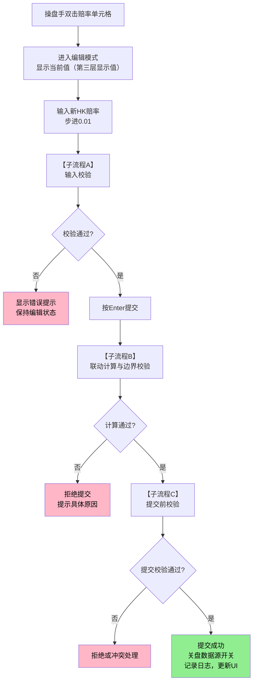

##### 子流程A：输入校验

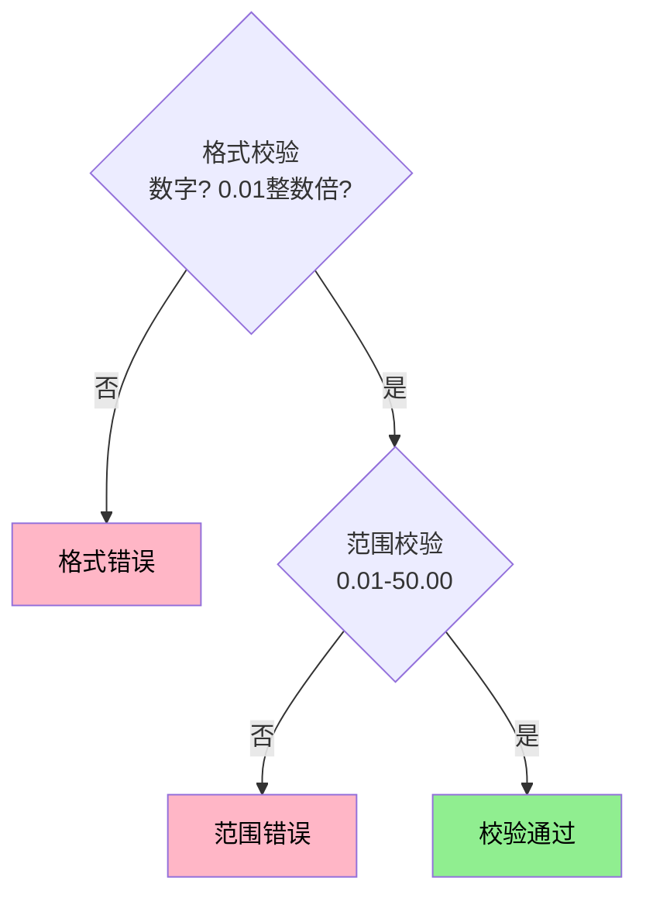

##### 子流程B：联动计算与边界校验

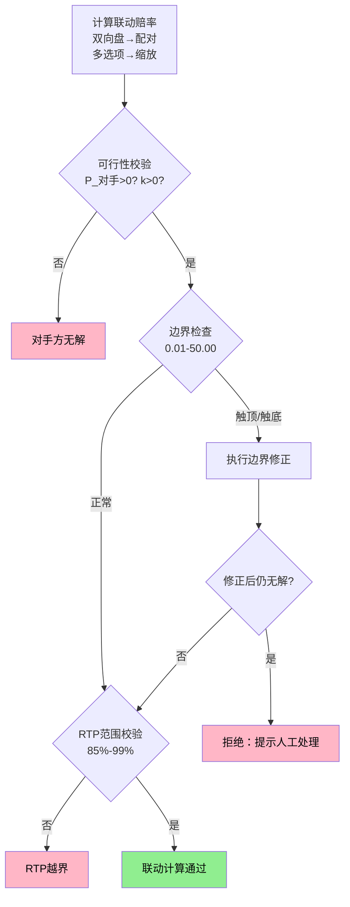

##### 子流程C：提交前校验

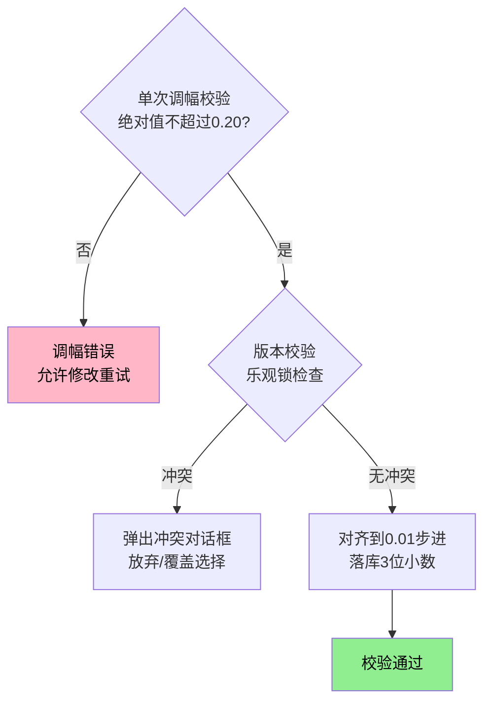

**多选项联动说明**：多选项联动变化的处理规则详见[第10章「数据源开关」](./10-数据源开关.md)。手动编辑触发联动计算时同样按该规则执行与记录日志。

#### 自动跳水完整流程图

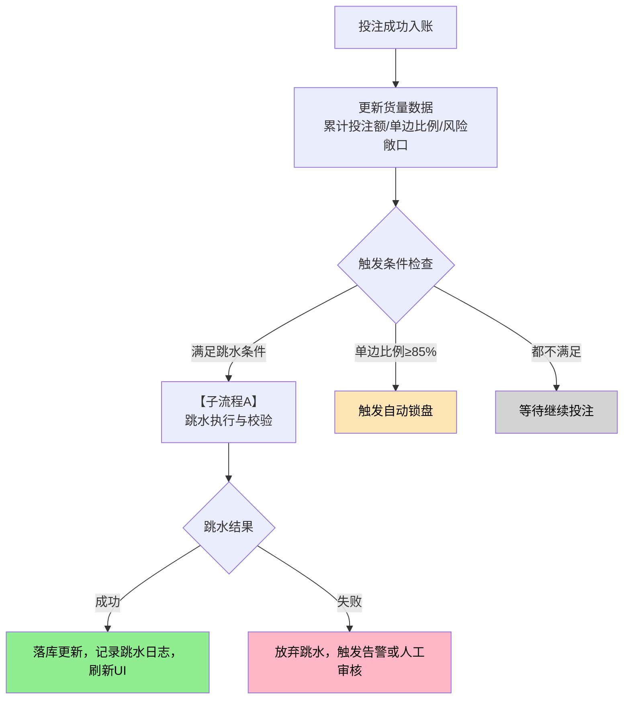

##### 子流程A：跳水执行与校验

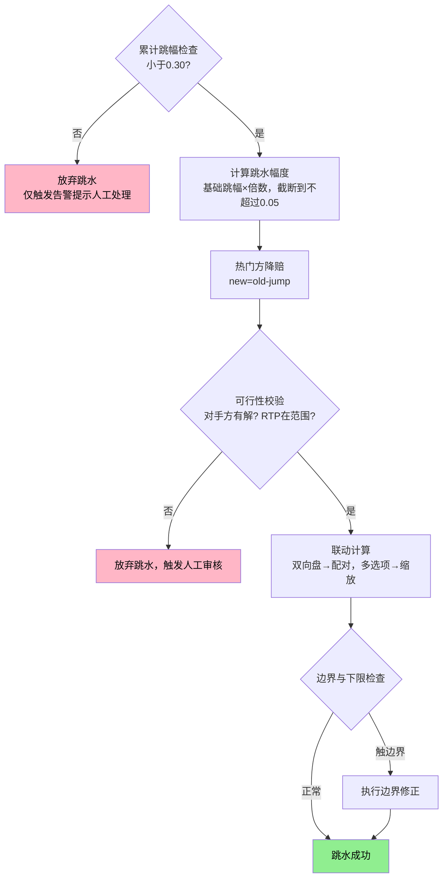

---

## 7.16 精度规则汇总

| 场景                 | 精度     | 舍入方式 | 说明                     |
| -------------------- | -------- | -------- | ------------------------ |
| HK赔率落库（第二层） | 3位小数  | 四舍五入 | 系统管理                 |
| HK赔率显示（第三层） | 2位小数  | 四舍五入 | UI展示                   |
| Decimal内部计算      | 全精度   | 不舍入   | 概率/RTP/联动计算        |
| RTP显示              | 0.1%     | 四舍五入 | 如95.0%                  |
| RTP容差              | 正负0.1% | -        | 用于显示舍入带来的微偏差 |

---

## 7.17 配置项汇总表

### 配置归属原则说明

| 归属模块 | 配置原则                                         | 本章涉及配置项                                                     |
| -------- | ------------------------------------------------ | ------------------------------------------------------------------ |
| 系统写死 | 赔率边界、RTP范围、目标RTP、调幅限制 | 最大HK赔率、最小HK赔率、RTP区间、默认目标RTP、单次调幅上限 |
| 联赛管理 | 联赛级运营配置                                   | 是否跟随数据源盘口状态、默认操盘手、玩法启用列表                   |
| 系统管理 | 精度规则、同步间隔、超时时间                     | HK落库精度、数据源同步间隔                                         |

### 7.17.1 系统写死常量配置项

| 配置项                           |    默认值    |
| -------------------------------- | :----------: |
| 最大HK赔率                       |    50.00     |
| 最小HK赔率                       |     0.01     |
| RTP区间                          | 85.0%至99.0% |
| 默认目标RTP                      |    95.0%     |
| 单次调幅上限                     |     0.20     |

### 7.17.2 系统管理配置项（精度与同步）

| 配置项                           |    默认值    |
| -------------------------------- | :----------: |
| 偏离告警阈值（本地减IM的绝对值） |     0.10     |
| 单边比例超限                     |     70%      |
| 单边比例严重超限                 |     85%      |
| 大额单笔阈值                     |    50,000    |
| 累计投注额阈值                   |   500,000    |
| 净风险敞口阈值                   |  1,000,000   |
| 基础跳幅                         |     0.02     |
| 单次跳幅上限                     |     0.05     |
| 累计跳幅上限                     |     0.30     |
| 偏离值范围                       | -1.00至+1.00 |

### 7.17.3 系统管理配置项

| 配置项           |  默认值  |
| ---------------- | :------: |
| HK落库精度       | 3位小数  |
| 数据源同步最小间隔 |  500ms   |

---

## 7.18 适用边界说明

### 7.18.1 RTP计算简化假设

本章RTP计算基于无退回模型：P 等于 1 ÷ Decimal。不纳入走盘（如让球0、大小2.25/2.75）退回影响；走盘盈亏由结算模块口径处理。

### 7.18.2 赔率生效与注单一致性边界

赔率更新与下单撮合的原子一致性由下单模块负责。本章不定义报价窗口、re-offer机制、延迟确认等下单层处理。

## 修订记录

| 版本 | 日期       | 修订内容                                                                                                                                |
| ---- | ---------- | --------------------------------------------------------------------------------------------------------------------------------------- |
| 第1次修订  | 2026-01-22 | 定稿                                                                                                                                    |
| 第2次修订  | 2026-01-22 | 配置归属修正；精度与编辑基准对齐；风险敞口口径补齐；暂停/锁定缓存补齐                                                                   |
| 第3次修订  | 2026-01-22 | 流程图版：偏移计算消歧义；补充边界修正反推公式；恢复开盘时的基准明确；新增流程图（手动编辑、自动跳水）；补充配置归属原则说明                |
| 第4次修订  | 2026-01-28 | 移除AO跟随机制整节（已移至第10章数据源开关）；更新章节编号；将所有AO引用改为数据源开关；删除AO跟随流程图                                |
| 第5次修订  | 2026-01-28 | 7.2.2节渲染器映射表按第6章6.3.1节全局规则修正；7.13.2节新增来源枚举说明（区分赔率变更日志与操作日志）；新增规范说明 |
| 第6次修订  | 2026-01-28 | 新增7.8节「三种赔率调整方式」：支持编辑本地赔率、偏离值、RTP三种入口统一交互模式；包含核心概念定义、联动计算规则、数据源状态权限控制、异常场景处理、完整流程图；后续章节编号顺延（7.9-7.18）；配置表新增偏离值范围配置项 |
| 第7次修订  | 2026-01-28 | 1)「夹逼策略」改为「边界修正策略」并增加通俗解释和数值示例；2) 明确RTP编辑说明（派生值作为编辑入口的逻辑）；3) 补充偏离值键盘快捷键（上下键微调）；4) 补充偏离值落库精度规则；5) 补充多选项盘偏离值编辑示例；6) 增加「维持RTP」vs「调整RTP」的对比说明 |
| 第8次修订  | 2026-01-28 | 1) 全面验证所有计算示例并修正错误数据（7.8.3/7.8.4/7.8.5/7.8.6场景对比）；2) 统一7.8节所有示例使用7.8.2卡片布局数据；3) 修正累计投注额阈值内部不一致（200,000→500,000）；4) 7.10节重构为「货量变化与赔率调整」，新增7.10.1业务背景（含两种调整路径、操盘手决策场景）；5) 新增7.10.7完整业务场景示例（五阶段货量变化全流程） |
| 第9次修订  | 2026-01-28 | 7.10.5新增「目标RTP vs 当前RTP」说明：明确手动编辑维持当前RTP、自动跳水维持目标RTP的业务差异及原因 |
| 第10次修订 | 2026-01-28 | 7.10.2新增「后续扩展（待开发）」备注：标注时间驱动、比赛事件驱动、风控模型驱动等自动跳水扩展方向 |
| 第11次修订 | 2026-01-28 | 1) 7.10.2表格：单笔大额、累计投注触发条件的动作从"跳水"修正为"告警加跳水"；2) 7.10.7风险控制要点表格：单笔大额、累计投注告警级别从"无告警"修正为"P1告警"；3) 补充告警阈值说明（单笔5万=50,000，累计20万<50万） |
| 第12次修订 | 2026-01-29 | 1) 7.10.7节第三阶段验证概率和笔误修正（0.5063→0.5062）；2) 7.10.3节移除遗留编辑备注，改为规范引用；3) 7.8.2节布局示意图状态术语修正（开盘→开盘）；4) 7.9.3节新增多选项盘边界修正数值示例（含三个场景验算）；5) 7.9.4节格式化可售集合不足处理规则 |
