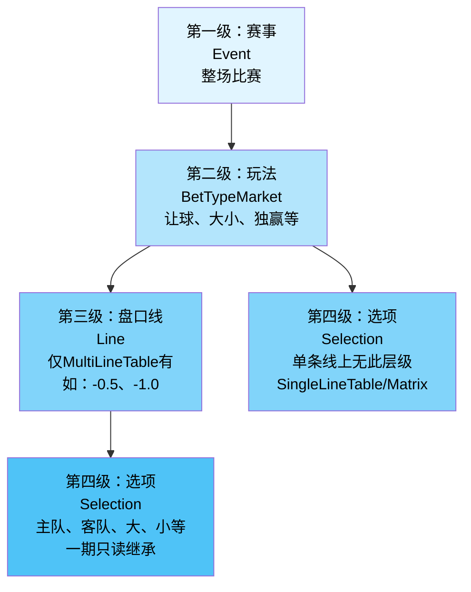
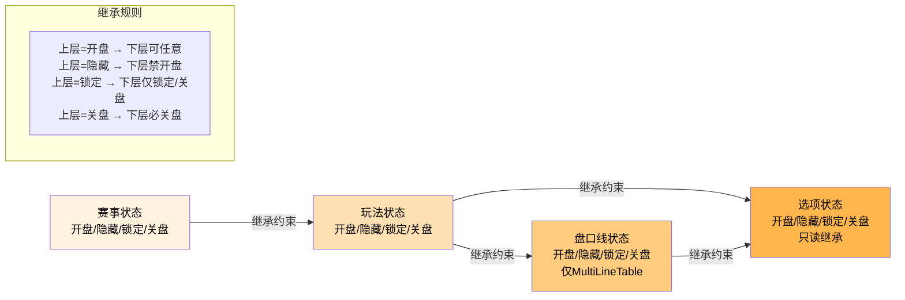
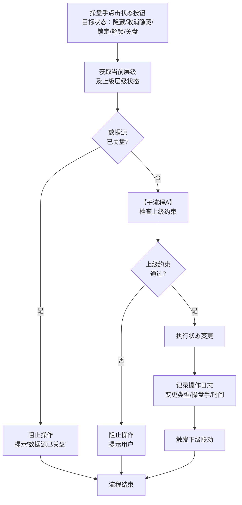
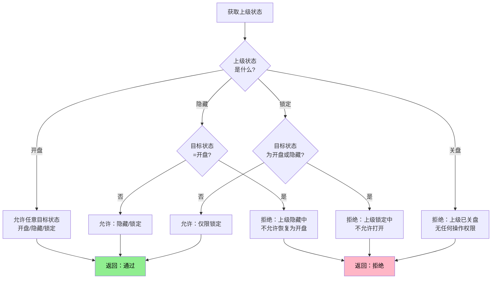
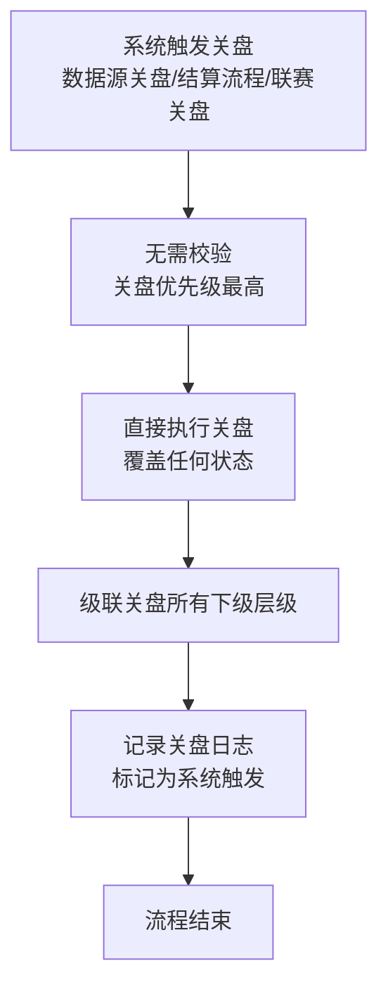
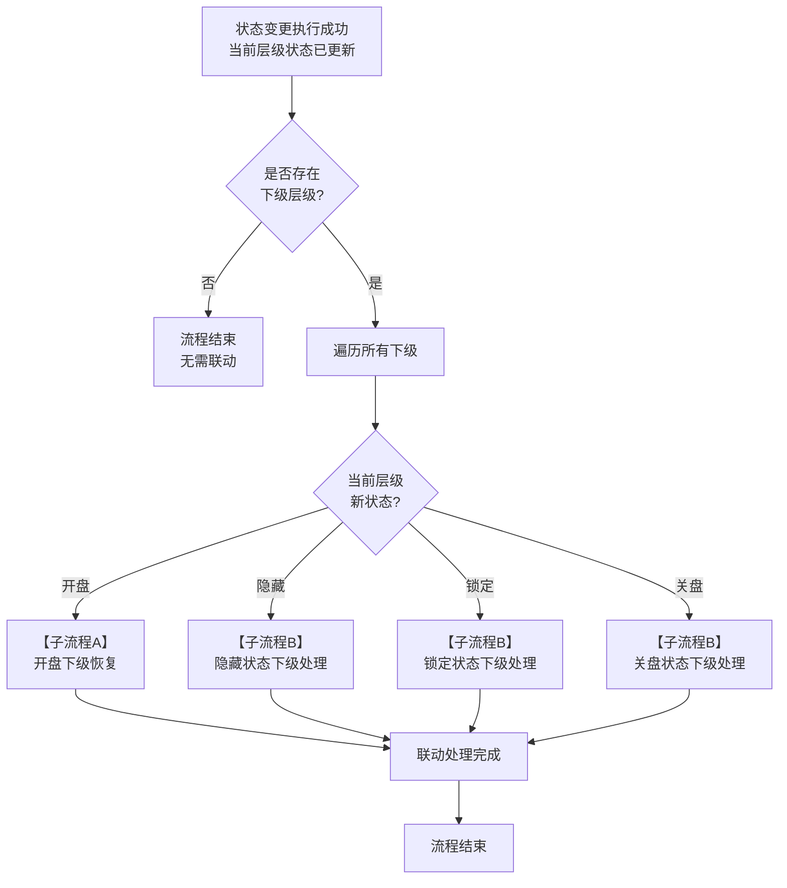
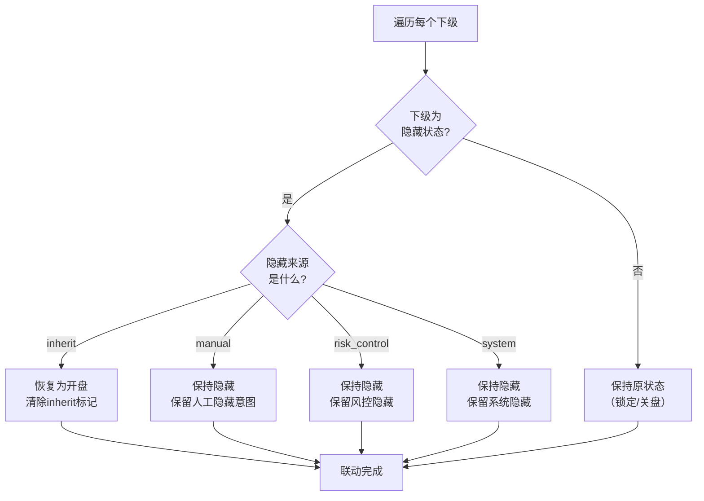
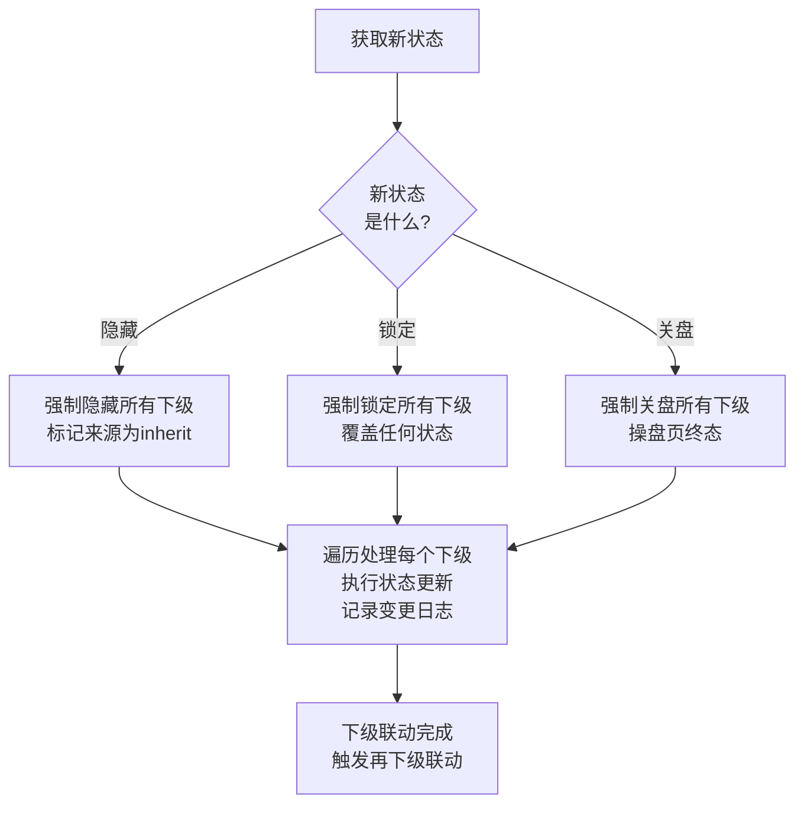

# 第8章 控制层级体系

> **关盘口径（2026-04-21 生效）**：关盘来源统一为数据源推送（唯一来源）；关盘 = 绝对终态，操盘页与结算详情页均不提供人工开盘入口。如数据源误推送关盘，依赖数据源再次推送开盘信号自动响应。

## 8.0 术语对照

本章涉及的核心术语与IM数据源术语存在命名差异，为避免歧义，统一定义如下：

| 本章术语 | 英文标识      | 含义                                                                      | 与IM术语关系               |
| -------- | ------------- | ------------------------------------------------------------------------- | -------------------------- |
| 玩法     | BetTypeMarket | 指同一BetTypeId（可含PeriodId、Specifiers）的玩法维度，如让球、大小、独赢 | 不等同于IM的Market         |
| 盘口市场 | IMMarket      | 指IM数据源的Early/Today/Live三类盘口市场，用于拉取和缓存分池              | IM文档中的Market字段       |
| 盘口线   | Line          | 指同一玩法下的不同盘口值，如让球负0.5、负1.0                              | 对应IM的Hdp/Line字段       |
| 选项     | Selection     | 指单个可投注的选项，如主队、客队、大、小                                  | 对应IM的BetTypeSelectionId |

**重要说明**：本章及后续文档中提到的"玩法"均指BetTypeMarket，与IM数据源中的Market（Early/Today/Live）是完全不同的概念。

---

## 8.1 层级结构定义

### 8.1.1 四级控制层级

本系统采用四级控制层级，从上到下依次为：



**层级说明**：赛事为最上层，下辖多个玩法。MultiLineTable类玩法（如让球BT1、大小BT2）包含盘口线层级，其他玩法无此层级，直接在玩法级管理选项。

|  层级  | 英文          | 说明                           | 控制粒度                                   |
| :----: | ------------- | ------------------------------ | ------------------------------------------ |
| 第一级 | Event         | 整场赛事                       | 赛事级状态、赛事级数据源开关               |
| 第二级 | BetTypeMarket | 单个玩法（如让球、大小、独赢） | 玩法级状态、玩法级数据源开关               |
| 第三级 | Line          | 单条盘口线（如负0.5、负1.0）   | 线级状态（仅MultiLineTable）               |
| 第四级 | Selection     | 单个投注选项（如主队、客队）   | 选项级状态（只读继承，一期不支持独立控制） |

### 8.1.2 层级与渲染器的对应关系

不同渲染器支持的层级深度不同：

| 渲染器          | 适用玩法                                       | 支持层级                         | 是否有盘口线 |
| --------------- | ---------------------------------------------- | -------------------------------- | :----------: |
| MultiLineTable  | BT1让球、BT2大小、BT160主队大小、BT161客队大小 | 玩法级加线级加选项级             |      有      |
| SingleLineTable | BT3独赢、BT5单双、BT8双重机会、BT159第X粒入球  | 玩法级加选项级                   |      无      |
| Matrix          | BT6波胆、BT158反波胆、BT9半全场                | 玩法级加选项级（单元格等于选项） |      无      |
| LongList        | BT7总进球                                      | 玩法级加选项级                   |      无      |

> **完整映射清单**：以上为简化示例，完整的 BetTypeId 与渲染器映射见[第6章6.3.1节](./06-盘口卡片模块.md#_6-3-1-渲染器映射表全局规则)（规范）。

**重要说明**：Matrix单元格等于选项（Selection）的一种展示形态，不新增第五层级。

### 8.1.3 一期控制能力边界

| 层级   | 一期支持的控制操作       | 说明                                                         |
| ------ | ------------------------ | ------------------------------------------------------------ |
| 赛事级 | 状态控制、数据源开关     | 作用于该赛事下所有玩法                                       |
| 玩法级 | 状态控制、数据源开关     | 作用于该玩法下所有盘口线和选项                               |
| 线级   | 状态控制（含隐藏/锁定/关盘） | 仅MultiLineTable渲染器支持，作用于该线下所有选项；关盘来源：IM 推送关盘（唯一来源） |
| 选项级 | 只读继承                 | 一期不支持选项级独立状态控制                                 |

---

## 8.2 状态类型定义

### 8.2.1 四种状态

所有层级统一使用以下四种状态：

| 状态 | 英文   | 状态性质 | 含义                               | 接受投注 | C端可见 | 操盘端可见 |
| ---- | ------ | -------- | ---------------------------------- | :------: | :-----: | :--------: |
| 开盘 | Open   | 初始状态 | 正常运营，可接受投注               |    ✅    |   ✅    |     ✅     |
| 隐藏 | Hidden | 叠加状态 | 从客户端隐藏（不可见），可取消     |    ❌    |   ❌    |     ✅     |
| 锁定 | Locked | 叠加状态 | 人工锁定，必须人工解锁             |    ❌    |   ✅    |     ✅     |
| 关盘 | Closed | 终态     | 不可恢复                           |    ❌    |   ❌    |     ✅     |

**状态模型说明**：

1. **开盘**：初始状态，隐藏OFF且锁定OFF时的默认状态，不需要人工"开"操作
2. **隐藏**：叠加在开盘之上的临时状态，通过"隐藏"操作触发，通过"取消隐藏"恢复。**客户端不可见**——盘口从玩家视角完全消失
3. **锁定**：叠加在开盘/隐藏之上的强制状态，通过"锁定"操作触发，通过"解锁"恢复。**客户端可见但灰显**——玩家能看到盘口但显示为「暂停投注」
4. **关盘**：绝对终态，由数据源推送触发。操盘页与结算详情页均不提供人工开盘入口；依赖数据源再次推送开盘信号自动响应（详见[结算详情页第 18 章](/settlement-detail/18-状态流转规则)）

**操盘端状态计算规则**（决定本地状态）：
```
本地状态 =
  if (IM关盘标记=true) → 关盘（终态，覆盖一切）
  else if (锁定标记=ON) → 锁定
  else if (隐藏标记=ON) → 隐藏（本地控制）
  else → 开盘
```

**C端展示状态计算规则**（决定玩家看到什么，详见8.2.3节）：
```
C端展示 =
  if (IM 关盘) → 已关盘
  else if (本地隐藏) → 不可见
  else if (本地锁定) → 暂停投注
  else if (IM暂停或IM维护，且跟随=是) → 暂停投注
  else → 可投注
```

**说明**：C端指玩家端（客户端），操盘端指操盘系统后台。IM暂停不改变本地状态，仅通过C端展示状态影响玩家视角。关盘和隐藏状态在C端不可见，但在操盘端仍需显示用于审计和复盘。

### 8.2.2 隐藏与锁定的核心区别

| 维度         | 隐藏                           | 锁定                                       |
| ------------ | ------------------------------ | ------------------------------------------ |
| 触发方式     | 人工、风控、系统流程（含下架联动隐藏） | 仅人工意图触发                             |
| 恢复方式     | 可人工恢复                             | 必须人工解锁                               |
| 典型场景     | 风控告警、人工干预、下架操作           | 风险控制、人工干预                         |
| 数据源恢复时 | 不受数据源影响，需人工取消隐藏         | 保持锁定，需人工解锁                       |
| 设计意图     | 临时隐藏，人工控制恢复                 | 主动干预，需人工确认后恢复                 |

**日志语义**：若"下架"导致盘口进入隐藏态，该隐藏的隐藏来源记为 system，操作详情标记为「delist_link」（用于区分人工隐藏 vs 下架联动隐藏）。下架联动隐藏时，取消隐藏按钮禁用，提示"赛事已下架，请先上架"。

### 8.2.3 客户端展示状态映射（C端四态）

本地控制状态（开盘/隐藏/锁定/关盘）与IM数据源状态共同决定客户端的最终展示状态。客户端共有四种展示状态：

| C端展示状态 | 英文      | 含义                               | 产生条件                                   |
| ----------- | --------- | ---------------------------------- | ------------------------------------------ |
| 可投注      | Active    | 盘口正常展示，玩家可下注           | 本地=开盘 且 IM=开盘                       |
| 暂停投注    | Suspended | 盘口可见但灰显，暂时不接受投注     | IM暂停或IM维护（跟随=是时） 或 本地锁定    |
| 不可见      | Hidden    | 盘口从客户端完全移除，玩家不可见   | 本地隐藏                                   |
| 已关盘      | Closed    | 盘口终态                           | IM关盘 或 结算完成                         |

**C端展示状态计算规则**：
```
C端展示 =
  if (IM关盘 或 IM 关盘) → 已关盘
  else if (本地隐藏) → 不可见
  else if (本地锁定) → 暂停投注
  else if (IM暂停 或 IM维护，且跟随=是) → 暂停投注
  else → 可投注
```

**关键设计说明**：

1. **暂停投注 vs 不可见**：暂停投注时盘口在客户端仍然可见（灰显状态），玩家知道该盘口存在但暂时无法投注（典型场景：进球后数据源暂停）；不可见时盘口从客户端完全消失，用于操盘手主动隐藏或风控干预场景
2. **IM暂停不改变本地状态**：IM推送暂停时，本地盘口状态保持不变（仍为开盘），仅通过IM状态标记影响C端展示。IM恢复后C端自动回到可投注，无需本地状态流转
3. **IM暂停 vs 本地锁定**：C端展示相同（均为「暂停投注」），但恢复机制不同——IM暂停在数据源恢复后自动恢复为可投注，本地锁定必须人工解锁
4. **本地隐藏优先级高于IM暂停**：若操盘手已隐藏盘口，即使IM推送暂停，客户端仍不可见（操盘手主动隐藏的意图不被IM暂停覆盖）

### 8.2.4 隐藏来源标记

盘口进入隐藏状态时，系统记录隐藏来源，用于决定恢复条件：

> **规范说明**：隐藏来源枚举的规范定义为[操盘列表第16章16.1.4节](../trading-list/16-数据联动规则.md#_16-1-4-隐藏来源枚举)。完整状态覆盖优先级规则详见[操盘列表第16章16.3.11节](../trading-list/16-数据联动规则.md#_16-3-11-状态覆盖优先级)。

| 隐藏来源     | 标识           | 触发方式                               | 恢复条件                                                                               |
| ------------ | -------------- | -------------------------------------- | -------------------------------------------------------------------------------------- |
| 人工隐藏     | manual         | 操盘手手动点击隐藏按钮                 | 必须人工点击取消隐藏                                                                   |
| 风控隐藏     | risk_control   | 单边超限、大额投注等规则触发           | 风控条件解除后自动恢复，或人工恢复                                                     |
| 系统隐藏     | system         | 系统流程触发（含下架联动，详情=delist_link） | 人工恢复（下架联动时需先重新上架）                                                     |
| 上级继承隐藏 | inherit        | 上级层级处于隐藏或锁定导致下级被动隐藏 | 上级恢复为开盘后自动恢复（除非下级同时存在manual或risk_control导致的隐藏或锁定）       |

**IM数据源状态（独立于本地隐藏，不改变本地状态）**：

IM数据源状态不属于本地隐藏来源，不改变本地盘口状态，仅影响C端展示（详见8.2.3节客户端展示状态映射）。

| IM状态       | 标识           | C端展示影响                                          | 说明                           |
| ------------ | -------------- | ---------------------------------------------------- | ------------------------------ |
| 数据源暂停   | data_source    | C端显示「暂停投注」（跟随=是时）                     | IM恢复后C端自动回到可投注      |
| 数据源维护   | maintenance    | C端显示「暂停投注」（不受跟随配置影响）              | 维护结束后C端自动回到可投注    |
| 赛事事件暂停 | event_incident | C端显示「暂停投注」（跟随=是时）                     | 进球、红牌、VAR等事件触发      |

### 8.2.5 IM暂停时的操盘端展示规范

IM暂停不改变本地状态，因此操盘端的状态标签不变。操盘手通过以下辅助信息感知IM暂停：

| 展示位置 | 展示内容 | 样式 | 说明 |
| -------- | -------- | ---- | ---- |
| 盘口卡片状态标签 | 保持原标签不变（如●开盘） | 不变 | 本地状态未改变，标签不变 |
| 盘口卡片IM状态标记 | 显示「IM暂停」角标 | 橙色小标签，位于状态标签右侧 | 仅在IM暂停期间显示，IM恢复后自动消失 |
| 右侧告警列 | "数据源暂停"告警条目 | 橙色标签 | 跟随=是和跟随=否时均显示 |
| 顶部数据源指示器 | IM连接状态+延迟 | 绿/黄/红圆点 | 反映连接级别状态，非盘口级别 |

**操盘端叠加场景展示**：

| 本地状态 | IM状态 | 操盘端状态标签 | 操盘端IM角标 | C端展示（跟随=是） |
| -------- | ------ | -------------- | ------------ | :-----------------: |
| 开盘     | 开盘   | ●开盘（绿色）  | 无           | 可投注              |
| 开盘     | 暂停   | ●开盘（绿色）  | IM暂停（橙色） | 暂停投注          |
| 隐藏     | 暂停   | ●隐藏中（橙色）| IM暂停（橙色） | 不可见            |
| 锁定     | 暂停   | 🔒锁定中（红色）| IM暂停（橙色） | 暂停投注          |
| 关盘     | 任意   | ●已关盘（灰色）| 无           | 已关盘              |

### 8.2.6 C端「暂停投注」的两种来源对比

C端展示状态「暂停投注(Suspended)」可由两种不同原因产生，C端玩家无法区分，但操盘端和恢复机制不同：

| 维度 | IM暂停导致的暂停投注 | 本地锁定导致的暂停投注 |
| ---- | -------------------- | ---------------------- |
| 触发方 | IM数据源推送 | 操盘手人工操作 |
| 本地状态是否变 | **不变**（本地仍为开盘） | **变**（本地变为锁定） |
| 操盘端标签 | ●开盘 + IM暂停角标 | 🔒锁定中 |
| 恢复方式 | IM恢复后**自动回到可投注** | 必须操盘手**手动解锁** |
| 典型场景 | 进球、红牌、VAR等赛事事件 | 操盘手主动干预、风险控制 |
| C端展示 | 暂停投注（可见灰显） | 暂停投注（可见灰显） |
| 玩家能否区分 | 不能 | 不能 |

**设计意图**：IM暂停是数据源层面的临时暂停（如进球后重新计算赔率），通常持续数秒至数十秒，不需要操盘手介入；本地锁定是操盘手的主动意图表达，必须人工确认后才能恢复。两者在C端表现一致，但操盘端通过不同标签和角标让操盘手明确区分。

---

## 8.3 继承规则（核心）

### 8.3.1 继承原则

**上层状态是下层状态的上限**：若上层为隐藏、锁定或关盘，则其下所有子级不得为开盘；子级允许更严格（例如玩法开盘，但某线锁定）。

| 上层状态 | 下层允许的状态范围             |
| -------- | ------------------------------ |
| 开盘     | 开盘、隐藏、锁定、关盘         |
| 隐藏     | 隐藏、锁定、关盘（不允许开盘） |
| 锁定     | 锁定、关盘（不允许开盘、隐藏） |
| 关盘     | 关盘（终态，不允许其他状态）   |

### 8.3.2 继承规则详解

**规则一：赛事级继承到玩法级**

| 赛事状态 | 玩法允许状态           | 说明                   |
| -------- | ---------------------- | ---------------------- |
| 开盘     | 开盘、隐藏、锁定、关盘 | 玩法可自主控制         |
| 隐藏     | 隐藏、锁定、关盘       | 玩法不可开盘           |
| 锁定     | 锁定、关盘             | 玩法不可开盘、不可隐藏 |
| 关盘     | 关盘                   | 所有玩法强制关盘       |

**规则二：玩法级继承到线级（仅MultiLineTable）**

| 玩法状态 | 线允许状态             | 说明                 |
| -------- | ---------------------- | -------------------- |
| 开盘     | 开盘、隐藏、锁定、关盘 | 线可自主控制         |
| 隐藏     | 隐藏、锁定、关盘       | 线不可开盘           |
| 锁定     | 锁定、关盘             | 线不可开盘、不可隐藏 |
| 关盘     | 关盘                   | 所有线强制关盘       |

**规则三：线级或玩法级继承到选项级**

选项状态完全继承自其直接上级（有线则继承线，无线则继承玩法），一期不支持选项级独立状态控制。

### 8.3.3 继承示例

**示例一：赛事隐藏时的状态继承**

```

赛事：曼城 vs 利物浦（状态：隐藏）
├── 让球（继承：隐藏，隐藏来源=继承）
│ ├── 負0.5线（继承：隐藏，隐藏来源=继承）
│ │ ├── 主队（继承：隐藏）
│ │ └── 客队（继承：隐藏）
│ └── 负1.0线（继承：隐藏，隐藏来源=继承）
│ ├── 主队（继承：隐藏）
│ └── 客队（继承：隐藏）
├── 大小球（继承：隐藏，隐藏来源=继承）
└──独赢1X2（继承：隐藏，隐藏来源=继承）

```

**示例二：玩法开盘但线锁定（子级更严格）**

```

赛事：曼城 vs 利物浦（状态：开盘）
└── 让球（状态：开盘）
├── 负0.5线（状态：开盘）
│ ├── 主队（继承：开盘）
│ └── 客队（继承：开盘）
└── 负1.0线（状态：锁定）← 操盘手主动锁定
├── 主队（继承：锁定）
└── 客队（继承：锁定）

```

---

## 8.4 状态展示与操作设计

### 8.4.1 设计原则：操作驱动式

本系统采用**操作驱动式**设计，而非状态选择式设计：

| 设计理念 | 说明 |
| -------- | ---- |
| 状态只读展示 | 当前状态以标签形式展示，不是可点击的按钮 |
| 操作按钮互斥显示 | 同类操作的正/逆向按钮互斥，同一时间只显示一个（隐藏↔取消隐藏，锁定↔解锁） |
| 语义明确 | "隐藏"是动作，"取消隐藏"是恢复动作，避免"开"的歧义 |
| 无"开盘"操作 | 开盘是初始状态，进入操盘页的盘口都已是开盘状态，无需人工触发 |

**重要说明**：
- **开盘不是操作，是状态展示**：所有通过上架流程进入操盘页的盘口，初始状态即为开盘
- **无本地创建盘口需求**：系统不支持本地新建盘口，盘口全部来自IM数据源
- **因此不存在"开盘"按钮**：操作包括隐藏、取消隐藏、锁定、解锁~~、关盘~~四种（~~关盘来源：IM推送 / 操盘手手动~~关盘仅由数据源推送触发，不提供人工按钮）

**与状态选择式的区别**：
```
状态选择式（旧）：[开] [停] [🔒]  ← 点击任意按钮切换到该状态
操作驱动式（新）：[●开盘] [⏸隐藏] [🔒锁定] [⚠️拟删除[]]  ← 状态标签 + 操作按钮
```

### 8.4.2 操作按钮图标与文字规范

所有操作按钮采用**图标+文字**的形式，确保语义清晰：

| 操作 | 图标 | 按钮文字 | 样式 |
| ---- | ---- | -------- | ---- |
| 隐藏 | 👁 | 隐藏 | 橙色 |
| 取消隐藏 | 👁 | 取消隐藏 | 绿色 |
| 锁定 | 🔒 | 锁定 | 红色 |
| 解锁 | 🔓 | 解锁 | 绿色 |
| ~~关盘~~ | ~~⏹~~ | ~~关盘~~ | ~~灰色~~ |

**说明**：关盘由数据源推送触发，操盘页不提供人工关盘按钮。关盘 = 绝对终态，不可逆转；无人工开盘入口，依赖数据源再次推送开盘信号自动响应（详见[结算详情页第 18 章](/settlement-detail/18-状态流转规则)）。

### 8.4.3 操作按钮互斥显示规则（核心）

**按钮互斥原则**：同类操作的正/逆向按钮同一时间只显示一个。

| 当前状态 | 状态标签 | 显示的操作按钮 | 隐藏的按钮 | 禁用的按钮 |
| -------- | -------- | -------------- | ---------- | ---------- |
| 开盘 | ●开盘（绿色） | 👁隐藏、🔒锁定~~、~~ | 👁取消隐藏、🔓解锁 | 无 |
| 隐藏 | ●隐藏中（橙色） | 👁取消隐藏、🔒锁定~~、~~ | 👁隐藏、🔓解锁 | 无 |
| 锁定 | 🔒锁定中（红色） | 🔓解锁、👁隐藏（禁用态）~~、~~ | 🔒锁定、👁取消隐藏 | 👁隐藏 |
| 关盘 | ●已关盘（灰色） | （无操作按钮） | 全部隐藏 | 全部 |

~~**说明**：关盘按钮在开盘/隐藏/锁定状态下均可见，点击后弹出确认弹窗。关盘在操盘页为终态，不可逆转。~~

**锁定状态特殊处理**：
- 锁定状态下，隐藏按钮**显示但禁用**（灰色不可点击），而非隐藏
- 原因：让操盘手知道隐藏功能存在，但需先解锁才能操作
- 悬浮提示：「锁定中，请先解锁」

**按钮切换示意**：
```
开盘状态：[👁隐藏] [🔒锁定]
           ↓ 点击隐藏
隐藏状态：[👁取消隐藏] [🔒锁定]
           ↓ 点击锁定
锁定状态：[🔓解锁] [👁隐藏(禁用)]
           ↓ 点击解锁
隐藏状态：[👁取消隐藏] [🔒锁定]  ← 恢复到锁定前状态
```

### 8.4.4 赛事级操作区（批量操作）

赛事级操作位于赛事信息头区域，作用于该赛事下所有盘口：

**布局结构**：
```
┌─────────────────────────────────────────────────────────────────┐
│  状态: [●开盘]     [👁隐藏] [🔒锁定]                            │
│         ↑ 标签      ↑ 互斥操作按钮（根据当前状态动态显示）       │
└─────────────────────────────────────────────────────────────────┘
```

| 操作 | 按钮显示 | 点击后切换为 | 作用范围 | 二次确认 |
| ---- | -------- | ------------ | -------- | :------: |
| 隐藏 | 👁隐藏 | 👁取消隐藏 | 该赛事下所有盘口隐藏 | 否 |
| 取消隐藏 | 👁取消隐藏 | 👁隐藏 | 该赛事下继承隐藏的盘口恢复 | 否 |
| 锁定 | 🔒锁定 | 🔓解锁 | 该赛事下所有盘口锁定 | 否 |
| 解锁 | 🔓解锁 | 🔒锁定 | 该赛事下恢复到锁定前状态 | 否 |

~~**说明**：赛事级不提供关盘按钮。关盘按钮仅在盘口级提供（粒度跟随结算粒度），见下方 8.4.5 / 8.4.6 节。~~ ⚠️ 拟改写为："操盘页（赛事/盘口级）均不提供人工关盘按钮；关盘由数据源推送触发"

**批量操作影响提示**：
- 赛事级隐藏/锁定操作时，弹出确认提示：「此操作将影响 X 个盘口，是否继续？」
- X 为该赛事下当前开盘状态的盘口数量

### 8.4.5 玩法级操作区（盘口卡片）

玩法级操作位于盘口卡片头部工具栏：

**布局结构**：
```
┌─────────────────────────────────────────────────────────────────┐
│  让球 (BT1)   [●开盘]   [👁隐藏] [🔒锁定] [⚠️拟删除[]]   [数据源开关]  │
│               ↑ 标签     ↑ 操作按钮                               │
└─────────────────────────────────────────────────────────────────┘
```

| 操作 | 按钮显示 | 点击后切换为 | 作用范围 | 二次确认 |
| ---- | -------- | ------------ | -------- | :------: |
| 隐藏 | 👁隐藏 | 👁取消隐藏 | 该玩法下所有盘口线和选项隐藏 | 否 |
| 取消隐藏 | 👁取消隐藏 | 👁隐藏 | 该玩法下继承隐藏的盘口线和选项恢复 | 否 |
| 锁定 | 🔒锁定 | 🔓解锁 | 该玩法下所有盘口线和选项锁定 | 否 |
| 解锁 | 🔓解锁 | 🔒锁定 | 该玩法下恢复到锁定前状态 | 否 |
| ~~关盘~~ | ~~~~ | ~~—~~ | ~~该玩法下所有盘口线关盘（操盘页终态）~~ | ~~是~~ |

**说明**：关盘由数据源推送触发，SingleLineTable/Matrix/LongList 渲染器的关盘粒度为玩法级（整个玩法关盘），MultiLineTable 为盘口线级（见 8.4.6 节）。关盘 = 绝对终态，无人工开盘入口。

**批量操作影响提示**：
- 玩法级操作时，对于MultiLineTable渲染器，弹出确认提示：「此操作将影响 X 条盘口线，是否继续？」

### 8.4.6 盘口线级操作区（仅MultiLineTable）

盘口线级操作采用**图标按钮+悬浮提示**的紧凑设计：

**布局结构**：
```
┌────────────────────────────────────────────────────────────────────────────┐
│  -0.5  [●开]  [👁] [🔒] [⚠️拟删除⏹]   │ 主队 0.88 │ 客队 0.92 │ 投注分布条        │
│        ↑状态标签 ↑图标按钮       └───────────────────────────────────────────┘
│                   悬浮显示文字
└────────────────────────────────────────────────────────────────────────────┘
```

| 操作 | 图标按钮 | 悬浮提示 | 点击后切换为 | 作用范围 | 二次确认 |
| ---- | :------: | -------- | :----------: | -------- | :------: |
| 隐藏 | 👁 | 隐藏此盘口线 | 👁 | 该线下所有选项隐藏 | 否 |
| 取消隐藏 | 👁 | 取消隐藏 | 👁 | 该线下所有选项恢复开盘 | 否 |
| 锁定 | 🔒 | 锁定此盘口线 | 🔓 | 该线下所有选项锁定 | 否 |
| 解锁 | 🔓 | 解锁此盘口线 | 🔒 | 该线下恢复到锁定前状态 | 否 |
| ~~关盘~~ | ~~⏹~~ | ~~关盘此盘口线~~ | ~~—~~ | ~~该线关盘（操盘页终态）~~ | ~~是~~ |

**说明**：
- MultiLineTable 渲染器的关盘粒度为盘口线级（每条线独立关盘），由数据源推送触发。关盘 = 绝对终态，无人工开盘入口（详见[结算详情页第 18 章](/settlement-detail/18-状态流转规则)）
- 图标按钮尺寸较小（20x20px），通过悬浮提示补充操作说明
- 锁定状态下，隐藏图标显示但禁用（灰色），悬浮提示：「锁定中，请先解锁」
- 线级状态标签采用紧凑形式：`[●开]` / `[👁隐]` / `[🔒锁]` / `[⊘关]`

### 8.4.7 选项级状态展示（只读）

选项级状态完全继承自上级（盘口线或玩法），以图标形式展示，不可直接操作：

| 状态图标 | 含义 | 样式 | 说明 |
| :------: | ---- | ---- | ---- |
| ● | 开盘 | 绿色小圆点 | 正常接受投注 |
| 👁 | 隐藏 | 橙色眼睛图标 | 隐藏不接受投注 |
| 🔒 | 锁定 | 红色锁图标 | 锁定不接受投注 |
| ○ | 关盘 | 灰色空心圆 | 操盘页终态，不可操作 |

**展示位置**：状态图标显示在选项单元格的右上角。

### 8.4.8 关盘操作说明

> ⚠️ **本节拟改写**：删除"人工关盘"触发来源行；"赛事级不提供关盘按钮" 应改为 "操盘页均不提供人工关盘按钮"；"关盘粒度" 应理解为"数据源推送时的粒度"

关盘是**绝对终态操作**（不可逆转，无人工开盘入口），由以下情况触发：

| 触发来源 | 说明 |
|---------|------|
| IM数据源推送关盘 | IM下发关盘指令，系统自动关盘 |
| ~~~~ | ~~操盘页盘口级「」按钮，需二次确认~~ |
| 系统流程 | 玩法结算完成后系统自动关盘 |
| 联赛关盘 | 联赛关盘导致的级联关盘 |

**关盘粒度**（跟随结算粒度）：MultiLineTable = 盘口线级（每条线独立关盘），其余渲染器 = 玩法级。~~赛事级不提供关盘按钮。~~

**关盘执行流程**：
1. 设置该层级及所有下级为关盘状态
2. 禁用所有操作按钮
3. 记录关盘日志（触发源=数据源/人工/系统）

**关盘状态展示**：
- 状态标签显示为「●已关盘（灰色）」
- 所有操作按钮隐藏
- 盘口卡片显示关盘遮罩

**关盘来源说明**：关盘仅由数据源推送自动触发，操盘页不提供手动关盘按钮，亦无关盘确认弹窗。关盘 = 绝对终态，无人工开盘入口；如数据源误推送关盘，依赖数据源再次推送开盘信号自动响应。

### 8.4.9 操作按钮禁用规则

当操作违反继承规则或数据源状态约束时，按钮显示为**禁用态**（灰色不可点击）：

| 场景 | 禁用按钮 | 悬浮提示 |
| ---- | -------- | -------- |
| 当前为锁定状态 | 👁隐藏 | 锁定中，请先解锁 |
| 赛事隐藏时 | 玩法👁取消隐藏 | 赛事隐藏中，请先恢复赛事 |
| 赛事锁定时 | 玩法👁取消隐藏、🔓解锁 | 赛事锁定中，请先解锁赛事 |
| 玩法隐藏时 | 盘口线👁取消隐藏 | 玩法隐藏中，请先恢复玩法 |
| 玩法锁定时 | 盘口线👁取消隐藏、🔓解锁 | 玩法锁定中，请先解锁玩法 |
| 数据源已关盘 | 所有操作按钮 | 数据源已关盘，无法操作 |
| 已关盘终态 | 所有操作按钮 | 已关盘，终态不可操作 |

### 8.4.10 锁定与隐藏的交互逻辑

**锁定不清除隐藏标记**：锁定是覆盖层，不会清除底层的隐藏状态。

| 锁定前状态 | 锁定操作 | 解锁后恢复状态 | 说明 |
| ---------- | -------- | -------------- | ---- |
| 开盘 | 执行锁定 | 开盘 | 正常恢复 |
| 隐藏 | 执行锁定 | 隐藏 | 保留隐藏标记，恢复到隐藏状态 |

**示例流程**：
```
开盘 → 隐藏 → 锁定 → 解锁 → 隐藏（非开盘）→ 取消隐藏 → 开盘
```

**系统实现要点**：
- 系统需记录 `pre_lock_status` 字段，保存锁定前的状态
- 解锁时读取 `pre_lock_status` 恢复到锁定前状态
- 若锁定前为隐藏，解锁后仍为隐藏，需再次点击「取消隐藏」才能恢复开盘

---

## 8.5 状态覆盖优先级

### 8.5.1 多触发源时的优先级

当多个触发源同时作用时，按以下优先级决定最终状态：

|  优先级   | 状态或触发源       | 说明                                         |
| :-------: | ------------------ | -------------------------------------------- |
| 1（最高） | 关盘（含联赛关盘） | 数据源关盘、玩法结算、联赛关盘后，不可逆     |
|     2     | 人工锁定           | 人工锁定后，数据源暂停、恢复、维护均无法改变 |
|     3     | 联赛暂停           | 联赛级管控，限制下属盘口的操作               |
|     4     | 风控隐藏           | 风控规则触发，需解除条件或人工干预           |
|     5     | 数据源维护         | 不受跟随配置影响，强制隐藏                   |
|     6     | 人工隐藏           | 可被联赛恢复覆盖                             |
| 7（最低） | 数据源暂停或恢复   | 受跟随配置控制                               |

**说明**：联赛关盘并入优先级1（等同Closed），联赛暂停保留在优先级3。

### 8.5.2 本地状态与数据源状态叠加规则

本地状态和IM数据源状态共同决定操盘端显示和C端展示。IM暂停不改变本地状态，仅影响C端展示。

| 本地控制状态 | 数据源状态     | 本地状态（不变） | C端展示状态  | 接受投注 |
| ------------ | -------------- | ---------------- | ------------ | :------: |
| 锁定         | 任意（非关盘） | 锁定             | 暂停投注     |    ❌    |
| 锁定         | 关盘           | 关盘             | 已关盘       |    ❌    |
| 隐藏         | 任意（非关盘） | 隐藏             | 不可见       |    ❌    |
| 隐藏         | 关盘           | 关盘             | 已关盘       |    ❌    |
| 开盘         | 维护           | 开盘             | 暂停投注     |    ❌    |
| 开盘         | 暂停           | 开盘             | 暂停投注     |    ❌    |
| 开盘         | 关盘           | 关盘             | 已关盘       |    ❌    |
| 开盘         | 开盘           | 开盘             | 可投注       |    ✅    |

**关键变更说明**：IM暂停和IM维护不再将本地状态变为隐藏。本地状态保持不变，仅C端展示受影响。本地隐藏的盘口即使IM暂停，C端仍为不可见（操盘手隐藏意图优先）。

### 8.5.3 人工锁定状态下的数据源推送处理

当盘口处于人工锁定状态时，数据源推送的处理规则：

| 数据源推送 | 处理方式       | 说明                         |
| ---------- | -------------- | ---------------------------- |
| 暂停       | 忽略，保持锁定 | 人工锁定优先级高于数据源暂停 |
| 恢复       | 忽略，保持锁定 | 必须人工解锁                 |
| 维护       | 忽略，保持锁定 | 人工锁定优先级高于维护       |
| 关盘       | 执行，变为关盘 | 关盘优先级最高，覆盖人工锁定 |

---

## 8.6 状态变更操作

### 8.6.1 操作类型定义

| 操作 | 操作码 | 说明 | 逆操作 |
| ---- | ------ | ---- | ------ |
| 隐藏 | hide | 将开盘状态变为隐藏 | 取消隐藏 |
| 取消隐藏 | unhide | 将隐藏状态恢复为开盘 | 隐藏 |
| 锁定 | lock | 将任意状态变为锁定 | 解锁 |
| 解锁 | unlock | 将锁定状态恢复为锁定前状态 | 锁定 |
| 关盘 | close | 将盘口关盘（绝对终态） | —（不可逆，无人工开盘入口） |

**说明**：关盘来源：IM 推送关盘（唯一来源）。~~关盘按钮在盘口级提供（粒度跟随结算粒度）。赛事级不提供关盘按钮。~~ ⚠️ 拟改写为："操盘页不提供人工关盘按钮；关盘由数据源推送自动触发。"

### 8.6.2 赛事级操作

| 操作 | 触发方式 | 作用范围 | 联动行为 |
| ---- | -------- | -------- | -------- |
| 隐藏 | 点击"隐藏"按钮 | 该赛事所有玩法 | 所有玩法隐藏标记=ON（隐藏来源=inherit） |
| 取消隐藏 | 点击"取消隐藏"按钮 | 该赛事所有玩法 | 赛事隐藏标记=OFF，下级按8.6.5规则恢复 |
| 锁定 | 点击"锁定"按钮 | 该赛事所有玩法 | 所有玩法锁定标记=ON |
| 解锁 | 点击"解锁"按钮 | 该赛事所有玩法 | 赛事锁定标记=OFF，下级按8.6.5规则恢复 |

~~**说明**：赛事级不提供关盘按钮。关盘按钮仅在盘口级提供（玩法级或盘口线级，跟随结算粒度）。~~ ⚠️ 拟改写为："操盘页（赛事/玩法/盘口线级）均不提供人工关盘按钮。关盘由数据源推送触发。"

### 8.6.3 玩法级操作

| 操作 | 触发方式 | 作用范围 | 联动行为 |
| ---- | -------- | -------- | -------- |
| 隐藏 | 点击"隐藏"按钮 | 该玩法所有线和选项 | 隐藏标记=ON（隐藏来源=manual） |
| 取消隐藏 | 点击"取消隐藏"按钮 | 该玩法所有线和选项 | 隐藏标记=OFF，下级按8.6.5规则恢复 |
| 锁定 | 点击"🔒"按钮 | 该玩法所有线和选项 | 锁定标记=ON |
| 解锁 | 点击"🔓"按钮 | 该玩法所有线和选项 | 锁定标记=OFF，下级按8.6.5规则恢复 |
| ~~关盘~~ | ~~点击""按钮~~ | ~~该玩法整体关盘~~ | ~~玩法状态=关盘（操盘页终态）~~ |

~~**说明**：玩法级关盘按钮适用于 SingleLineTable/Matrix/LongList 渲染器。MultiLineTable 的关盘在盘口线级操作，见 8.6.4 节。关盘需二次确认。~~ ⚠️ 拟改写为："玩法级关盘由数据源推送触发；适用粒度 SingleLineTable/Matrix/LongList = 玩法级，MultiLineTable = 盘口线级（见 8.6.4 节）。"

### 8.6.4 线级操作（仅MultiLineTable）

| 操作 | 触发方式 | 作用范围 | 联动行为 | 二次确认 |
| ---- | -------- | -------- | -------- | :------: |
| 隐藏 | 点击"👁"按钮 | 该线所有选项 | 隐藏标记=ON（隐藏来源=manual） | 否 |
| 取消隐藏 | 点击"👁"按钮 | 该线所有选项 | 隐藏标记=OFF | 否 |
| 锁定 | 点击"🔒"按钮 | 该线所有选项 | 锁定标记=ON | 否 |
| 解锁 | 点击"🔓"按钮 | 该线所有选项 | 锁定标记=OFF，恢复到锁定前状态 | 否 |
| ~~关盘~~ | ~~点击"⏹"按钮~~ | ~~该线关盘~~ | ~~线状态=关盘（操盘页终态）~~ | ~~是~~ |

**说明**：MultiLineTable 渲染器下关盘粒度为盘口线级（每条线独立关盘），由数据源推送触发。关盘 = 绝对终态，无人工开盘入口。

### 8.6.5 上级恢复时下级状态处理

当上级执行"取消隐藏"或"解锁"时，下级状态处理规则：

| 下级状态/来源 | 上级恢复后下级状态 | 说明 |
| ------------- | ------------------ | ---- |
| 隐藏（inherit） | 恢复为开盘 | 继承隐藏的下级自动恢复 |
| 隐藏（manual） | 保持隐藏 | 保留人工隐藏意图 |
| 隐藏（risk_control） | 保持隐藏 | 需风控条件解除或人工干预 |
| 锁定 | 保持锁定 | 锁定需本级人工解锁 |
| 关盘 | 保持关盘 | 关盘 = 绝对终态，不可恢复（无人工开盘入口） |

### 8.6.6 解锁时的状态恢复

解锁操作恢复到锁定前的状态：

| 锁定前状态 | 解锁后状态 | 说明 |
| ---------- | ---------- | ---- |
| 开盘 | 开盘 | 正常恢复 |
| 隐藏 | 隐藏 | 恢复到隐藏状态（保留隐藏来源） |

> **实现说明**：系统需记录锁定前的状态（pre_lock_status字段），解锁时恢复到该状态。

---

## 8.7 数据源开关的层级控制

### 8.7.1 数据源开关控制层级

| 层级   | 数据源开关 | 作用范围             | 联动规则                                                     |
| ------ | :--------: | -------------------- | ------------------------------------------------------------ |
| 赛事级 |     ✅     | 该赛事所有可操盘玩法 | 关盘则所有玩法数据源关盘；开启则所有玩法数据源开启           |
| 玩法级 |     ✅     | 单个玩法             | 可独立控制；若与赛事级不一致，赛事级显示"部分开启"           |
| 线级   |     ❌     | 一期不支持           | -                                                            |
| 选项级 |     ❌     | 一期不支持           | -                                                            |

**说明**：数据源开关控制赔率同步、盘口状态跟随和结算跟随。详见[第10章「数据源开关」](./10-数据源开关.md)。

### 8.7.2 赛事级开关与玩法级开关的联动

| 赛事级操作           | 玩法级联动                   |
| -------------------- | ---------------------------- |
| 赛事级数据源关盘     | 所有玩法数据源同步关盘       |
| 赛事级数据源开启     | 所有玩法数据源同步开启       |
| 单个玩法数据源被调整 | 赛事级数据源显示为"部分开启" |

### 8.7.3 数据源开关在非Open状态下的行为

当最终生效状态不等于Open（隐藏、锁定、关盘）时：

| 项目           | 行为                 | 说明                         |
| -------------- | -------------------- | ---------------------------- |
| 数据源开关按钮 | 禁用（灰色不可点击） | 非开盘状态下数据源开关无意义 |
| 数据源配置值   | 保留不清空           | 状态恢复为Open时按配置值恢复 |

---

## 8.8 与数据源状态的交互

### 8.8.1 跟随数据源配置

"是否跟随数据源盘口状态"是联赛级别的配置项，控制上架后盘口是否自动跟随IM开盘或暂停状态。默认值为"是"。

| 数据源状态 |   跟随=是                              |                 跟随=否                  | 备注                         |
| ---------- | :------------------------------------- | :--------------------------------------: | ---------------------------- |
| 开盘       | C端可投注                              | C端可投注                                | 两种配置均可开盘             |
| 暂停       | C端显示「暂停投注」（本地状态不变）    | 本地状态不变，告警列显示"数据源暂停"     | 本地状态不变，仅C端展示受影响 |
| 恢复       | C端自动恢复为可投注（本地状态不变）    | 本地状态不变，移除告警                   | 本地状态不变，C端自动恢复     |
| 维护       | C端显示「暂停投注」（本地状态不变）    | C端显示「暂停投注」（本地状态不变）      | 不受跟随配置影响             |
| 关盘       | 本地强制关盘                           | 本地强制关盘                             | 不受配置影响，优先级最高     |

**关键变更**：IM暂停和IM维护不再改变本地盘口状态（不再执行"本地自动隐藏"）。本地状态保持不变，仅C端展示状态受影响。IM恢复后C端自动回到本地状态对应的展示，无需本地状态流转。

### 8.8.2 解锁后的状态恢复

人工解锁时，本地状态恢复为锁定前状态（pre_lock_status），然后根据IM当前状态决定C端展示：

| 锁定前状态 | 数据源当前状态 | 解锁后本地状态 | C端展示状态                              |
| ---------- | -------------- | -------------- | ---------------------------------------- |
| 开盘       | 开盘           | 开盘           | 可投注                                   |
| 开盘       | 暂停（跟随=是）| 开盘           | 暂停投注（IM暂停自动影响C端）            |
| 开盘       | 暂停（跟随=否）| 开盘           | 可投注（告警列显示"数据源暂停"）         |
| 开盘       | 维护           | 开盘           | 暂停投注（IM维护不受跟随配置影响）       |
| 隐藏       | 任意（非关盘） | 隐藏           | 不可见（保留锁定前的隐藏状态）           |
| 任意       | 关盘           | -              | 阻止解锁，提示"数据源已关盘，无法解锁"   |

**关键变更**：解锁后不再因IM暂停而将本地状态设为隐藏。解锁恢复本地状态，C端展示由本地状态加IM状态共同计算。

---

## 8.9 状态继承与覆盖判定流程图

### 8.9.0 状态继承关系图

以下是赛事、玩法、盘口线、选项四级间的状态继承关系：



**继承原则**：上层状态是下层状态的上限。下层不能违反上层的状态约束，但可以选择更严格的状态。

### 8.9.1 操盘手状态变更判定流程

**说明**：本流程覆盖操盘手通过UI按钮触发的状态变更（Open/Hidden/Locked/Closed）。走同一流程（上级约束检查 + 二次确认弹窗）。



**主流程说明**：
1. 操盘手点击状态按钮，获取当前和上级状态
2. 检查数据源是否已关盘（硬约束）
3. 调用子流程A检查上级约束
4. 若约束通过，执行状态变更并记录日志
5. 触发下级联动处理

#### 子流程A：操盘手状态变更上级约束检查



### 8.9.2 系统触发关盘流程



### 8.9.3 状态变更执行后的下级联动流程



**主流程说明**：
1. 状态变更后检查是否存在下级层级
2. 若有下级，按当前层级新状态分支处理
3. 对不同新状态调用对应子流程处理下级
4. 完成联动

#### 子流程A：开盘状态下级恢复处理



#### 子流程B：隐藏/锁定/关盘状态下级强制处理



---

## 8.10 状态汇总显示规则

### 8.10.1 玩法级状态汇总

当玩法下多条线状态不一致时，玩法卡片头部按以下规则显示汇总状态：

| 判断顺序 | 条件                         | 显示状态 |              角标              |
| :------: | ---------------------------- | -------- | :----------------------------: |
|    1     | 存在任一线为锁定             | 锁定     |    若非全部锁定则追加"部分"    |
|    2     | 不存在锁定，存在任一线为隐藏 | 隐藏     |    若非全部隐藏则追加"部分"    |
|    3     | 全部线为关盘                 | 关盘     |               无               |
|    4     | 其他情况                     | 开盘     | 若存在任一线为关盘则追加"部分" |

**示例**：

| 线状态组合      | 汇总显示     |
| --------------- | ------------ |
| 开盘×3          | 开盘         |
| 开盘×2 + 隐藏×1 | 隐藏（部分） |
| 开盘×2 + 锁定×1 | 锁定（部分） |
| 开盘×1 + 关盘×2 | 开盘（部分） |
| 隐藏×2 + 关盘×1 | 隐藏（部分） |
| 关盘×3          | 关盘         |

### 8.10.2 赛事级状态汇总

当赛事下多个玩法状态不一致时，赛事信息头按以下规则显示汇总状态：

| 判断顺序 | 条件                           | 显示状态 |               角标               |
| :------: | ------------------------------ | -------- | :------------------------------: |
|    1     | 存在任一玩法为锁定             | 锁定     |     若非全部锁定则追加"部分"     |
|    2     | 不存在锁定，存在任一玩法为隐藏 | 隐藏     |     若非全部隐藏则追加"部分"     |
|    3     | 全部玩法为关盘                 | 关盘     |                无                |
|    4     | 其他情况                       | 开盘     | 若存在任一玩法为关盘则追加"部分" |

---

## 8.11 配置项归属汇总

| 配置项                 | 默认值 | 归属模块 | 说明                               |
| ---------------------- | :----: | -------- | ---------------------------------- |
| 是否跟随数据源盘口状态 |   是   | 联赛管理 | 控制数据源暂停或恢复时本地是否跟随 |

---

## 修订记录

| 版本 | 日期       | 修订内容                                                                                                                                                                                                                                                                                                                                                                                                                                                                   |
| ---- | ---------- | -------------------------------------------------------------------------------------------------------------------------------------------------------------------------------------------------------------------------------------------------------------------------------------------------------------------------------------------------------------------------------------------------------------------------------------------------------------------------- |
| v1.0 | 2026-01-22 | 初稿                                                                                                                                                                                                                                                                                                                                                                                                                                                                       |
| v1.1 | 2026-01-22 | 审计修正：1）新增8.0术语对照（BetTypeMarket与IMMarket区分）；2）8.2.1拆分C端/操盘端可见两列；3）8.2.3 event_incident改为固定10秒+兜底、新增inherit暂停来源；4）8.4.4标题改为"操盘端只读"；5）8.4.5数据源关盘时禁用所有状态按钮；6）8.5.1联赛关盘并入优先级1；7）8.6.4按suspension_source判定恢复逻辑；8）8.7.3新增数据源开关非Open状态行为规则；9）8.8.1表头改为"跟随=是/否"；10）8.9流程图拆分为操盘手流程和系统触发关盘流程；11）8.10汇总规则覆盖混合状态并追加"部分"角标 |
| v1.2 | 2026-01-28 | 将AO与飞单层级控制改为数据源开关层级控制；移除飞单相关内容；更新控制粒度描述                                                                                                                                                                                                                                                                                                                                                                                               |
| v1.3 | 2026-01-28 | 跨文档一致性修复：8.2.3节暂停来源标记补齐为9种（按规范操盘列表16章16.1.4节）；新增规范说明                                                                                                                                                                                                                                                                                                                                                                                |
| v1.4 | 2026-01-29 | 操作驱动式设计重构：8.4节重写：1）8.4.2新增操作按钮图标与文字规范；2）8.4.3新增操作按钮互斥显示规则（暂停↔取消暂停、锁定↔解锁同一时间只显示一个）；3）锁定状态下暂停按钮禁用而非隐藏；4）8.4.4-8.4.6各层级操作区增加布局示意和批量影响提示；5）8.4.6盘口线级改为图标按钮+悬浮提示设计；6）8.4.8新增关闭确认弹窗设计（必填原因）；7）8.4.10新增锁定与暂停交互逻辑（锁定不清除暂停标记） |
| v1.5 | 2026-01-29 | 线级关盘能力增强：8.1.3更新线级控制能力边界（增加关盘）；8.4.6新增线级⊘关闭按钮及状态标签规范；8.4.8拆分为8.4.8.1赛事/玩法级弹窗和8.4.8.2线级关闭弹窗；8.6.4新增线级关盘操作定义 |
| v1.6 | 2026-01-29 | 状态控制模型重构：1）状态类型：暂停(Suspended)改为隐藏(Hidden)；2）本地控制：移除关闭按钮，关盘仅由IM数据源控制；3）操作按钮：⏸暂停/▶取消暂停 改为 👁隐藏/👁取消隐藏；4）新增状态显示优先级规则：IM关盘 > 本地锁定 > IM暂停 > 本地隐藏 > 正常开盘；5）8.2节状态定义及来源标记更新；6）8.4节所有层级操作区按钮规范更新；7）8.4.8节关闭弹窗改为仅说明IM数据源控制；8）8.6节操作类型及各层级操作定义更新 |
| v1.7 | 2026-01-29 | 术语全面对齐：8.3节继承规则表、8.5节优先级/叠加规则、8.8节跟随配置、8.9节流程图、8.10节状态汇总规则：所有本地状态"暂停"→"隐藏"；保留IM数据源术语"暂停"不变 |
| v1.8 | 2026-02-11 | 数据源暂停架构重构：1）8.2.1：隐藏C端可见改为❌（客户端不可见）；2）新增8.2.3「客户端展示状态映射」：定义C端四态（可投注/暂停投注/不可见/已关盘），IM暂停→C端暂停投注（可见灰显），本地隐藏→C端不可见（盘口消失）；3）8.2.4：IM数据源状态不再属于隐藏来源，独立为C端展示影响层；4）8.5.2：叠加规则表重写，增加C端展示状态列；5）8.8.1：跟随配置表重写，IM暂停不再执行"本地自动隐藏"，改为"C端显示暂停投注，本地状态不变"；6）8.8.2：解锁后恢复表重写，解锁恢复本地状态，C端由本地加IM共同计算 |
| v1.9 | 2026-02-12 | 下架/上架+IM暂停展示：1）8.2.2：下架联动从锁定改为隐藏（隐藏来源=system，详情=delist_link）；2）8.2.4：系统隐藏来源描述更新（含下架联动）；3）新增8.2.5「IM暂停时的操盘端展示规范」：定义盘口卡片IM状态角标、告警列、叠加场景展示表；4）新增8.2.6「C端暂停投注的两种来源对比」：IM暂停 vs 本地锁定的操盘端区分和恢复机制对比 |

---

_文档结束_
