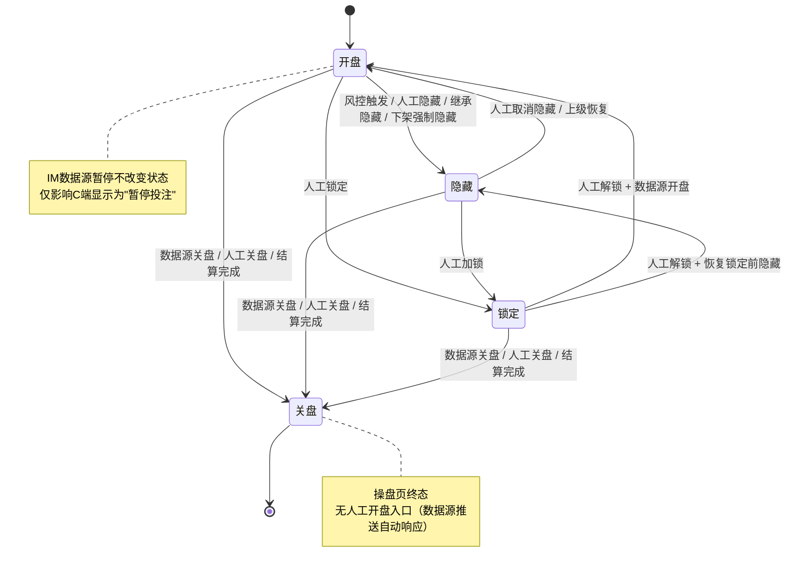
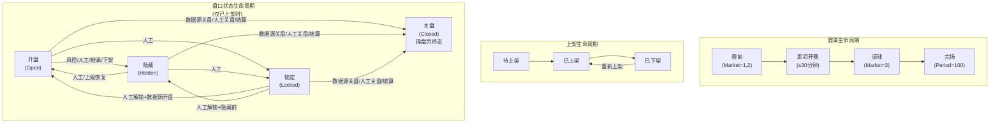
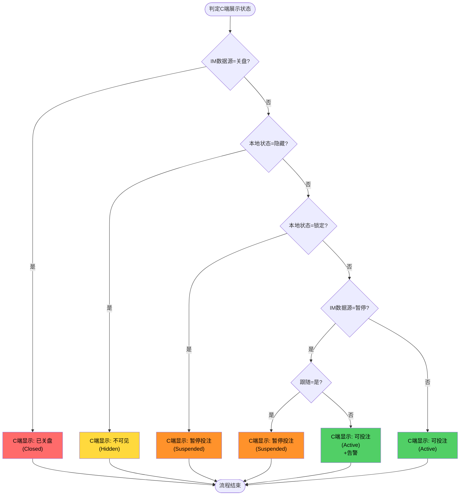

# 第9章 状态流转规则

> **关盘口径（2026-04-21 生效）**：关盘来源统一为数据源推送（唯一来源）；关盘 = 绝对终态，操盘页与结算详情页均不提供人工开盘入口。如数据源误推送关盘，依赖数据源再次推送开盘信号自动响应。

## 9.0 与[第8章](./08-控制层级体系.md)的关系说明

本章是[第8章「控制层级体系」](./08-控制层级体系.md)的延续，聚焦于状态如何在不同触发条件下流转。[第8章](./08-控制层级体系.md)定义了"有哪些状态、如何继承"，本章定义了"状态之间如何转换、谁能触发转换"。

| 维度       | [第8章](./08-控制层级体系.md)   | 第9章                  |
| ---------- | ------------------------------- | ---------------------- |
| 核心问题   | 状态是什么、层级如何继承        | 状态如何流转、谁能触发 |
| 状态定义   | 四种状态（开盘/隐藏/锁定/关盘） | 引用[第8章](./08-控制层级体系.md)定义 |
| 隐藏来源   | 本地控制来源标记（规范：[操盘列表16章16.1.4节](../trading-list/16-数据联动规则.md#_16-1-4-隐藏来源枚举)） | 详细流转规则           |
| 覆盖优先级 | 状态覆盖优先级定义（规范：[操盘列表16章16.3.11节](../trading-list/16-数据联动规则.md#_16-3-11-状态覆盖优先级)） | 流转矩阵实现           |

**术语约定**：本章沿用[第8章8.0节](./08-控制层级体系.md#_8-0-术语定义与概念澄清)的术语对照，玩法指BetTypeMarket，盘口市场指IMMarket（Early/Today/Live）。

---

## 9.1 状态流转概述

### 9.1.1 流转触发源

状态流转由以下五类触发源驱动：

| 触发源     | 说明                           | 典型场景                     |
| ---------- | ------------------------------ | ---------------------------- |
| 数据源推送 | IM Delta推送的状态变更         | 进球暂停（IM状态）、比赛结束关盘 |
| 人工操作   | 操盘手通过UI触发的状态变更     | 手动隐藏、手动锁定、手动恢复（不含关盘，关盘仅由数据源推送）|
| 风控规则   | 风控引擎自动触发的状态变更     | 单边超限隐藏、大额投注隐藏   |
| 系统流程   | 系统业务流程触发的状态变更     | 下架时隐藏、结算后关盘       |
| 上级联动   | 上级层级状态变更导致的下级联动 | 赛事隐藏导致玩法隐藏         |

### 9.1.2 流转方向约束

| 流转方向    | 是否允许 | 说明                 |
| ----------- | :------: | -------------------- |
| 开盘→ 隐藏 |    ✅    | 本地临时隐藏         |
| 开盘→ 锁定 |    ✅    | 人工干预             |
| 开盘→ 关盘 |    ✅    | 数据源 IM 推送关盘（唯一来源） |
| 隐藏 → 开盘|    ✅    | 恢复投注             |
| 隐藏 → 锁定 |    ✅    | 升级为人工控制       |
| 隐藏 → 关盘 |    ✅    | 数据源 IM 推送关盘（唯一来源） |
| 锁定 → 开盘|    ✅    | 人工解锁且数据源开盘 |
| 锁定 → 隐藏 |    ✅    | 人工解锁恢复到锁定前状态 |
| 锁定 → 关盘 |    ✅    | 数据源 IM 推送关盘（唯一来源） |
| 关盘→ 任意 |    ❌    | 关盘 = 绝对终态，不可逆。无人工开盘入口；依赖数据源再次推送开盘信号自动响应（详见[结算详情页第 18 章](/settlement-detail/18-状态流转规则)） |

---

## 9.2 状态流转矩阵

### 9.2.1 完整流转矩阵

以下矩阵定义了所有合法的状态流转路径：

| 当前状态 | 目标状态 | 允许的触发源 | 前置条件                 | 说明                  |
| -------- | -------- | ------------ | ------------------------ | --------------------- |
| 开盘    | 隐藏     | 风控         | 触发风控规则             | 单边超限、大额投注等  |
| 开盘    | 隐藏     | 人工         | 无                       | 操盘手手动隐藏        |
| 开盘    | 隐藏     | 继承         | 上级隐藏或锁定           | 上级联动              |
| 开盘    | 隐藏     | 系统         | 下架操作                 | 下架时强制隐藏（隐藏来源=system，详情=delist_link） |
| 开盘    | 锁定     | 人工         | 无                       | 操盘手手动锁定        |
| 开盘    | 关盘    | 数据源       | 数据源关盘               | IM推送EventStatusId=2 |
| ~~开盘~~    | ~~关盘~~    | ~~人工~~         | ~~操盘手点击关盘按钮~~       | ~~盘口级按钮，粒度跟随结算粒度~~ |
| 开盘    | 关盘    | 系统         | 结算完成                 | 玩法结算后关盘        |
| 隐藏     | 开盘    | 人工         | 隐藏来源≠风控            | 操盘手手动取消隐藏    |
| 隐藏     | 开盘    | 继承         | 上级恢复且隐藏来源=继承  | 上级联动恢复          |
| 隐藏     | 锁定     | 人工         | 无                       | 隐藏期间人工加锁      |
| 隐藏     | 关盘    | 数据源       | 数据源关盘               | 关盘优先级最高        |
| ~~隐藏~~     | ~~关盘~~    | ~~人工~~         | ~~操盘手点击关盘按钮~~       | ~~关盘覆盖隐藏~~          |
| 隐藏     | 关盘    | 系统         | 结算完成                 | 玩法结算后关盘        |
| 锁定     | 开盘    | 人工         | 数据源=开盘              | 人工解锁且数据源开盘  |
| 锁定     | 隐藏     | 人工         | 锁定前状态=隐藏          | 人工解锁恢复到隐藏    |
| 锁定     | 关盘    | 数据源       | 数据源关盘               | 关盘覆盖锁定          |
| ~~锁定~~     | ~~关盘~~    | ~~人工~~         | ~~操盘手点击关盘按钮~~       | ~~关盘覆盖锁定~~          |
| 锁定     | 关盘    | 系统         | 结算完成                 | 玩法结算后关盘        |
| 关盘    | 任意     | -            | -                        | 禁止，关盘是终态      |

**说明**：数据源可推送暂停状态（data_source 暂停），此时显示优先级高于本地隐藏。本地控制提供隐藏/取消隐藏、锁定/解锁。关盘来源为数据源推送，关盘 = 绝对终态，无人工开盘入口；依赖数据源再次推送开盘信号自动响应（详见[结算详情页第 18 章](/settlement-detail/18-状态流转规则)）。

### 9.2.2 流转矩阵图



> ⚠️ **拟删除**：上图状态机中 `开盘/隐藏/锁定 --> 关盘` 三条边的标签里 `/ 人工关盘 /` 部分（关盘仅由数据源推送触发，不存在人工关盘路径）

---

## 9.3 各触发源的流转规则

### 9.3.1 数据源触发的流转

数据源推送状态变更时，系统根据跟随配置和当前状态决定是否执行流转：

| 数据源推送 | 跟随=是                                | 跟随=否                      | 当前锁定时     |
| ---------- | -------------------------------------- | ---------------------------- | -------------- |
| 暂停       | C端显示暂停投注（本地状态不变）        | 告警列显示"数据源暂停"       | 忽略，保持锁定（C端已为暂停投注） |
| 恢复       | C端恢复可投注（本地状态不变）          | 移除告警                     | 忽略，保持锁定 |
| 维护       | C端显示暂停投注（本地状态不变）        | C端显示暂停投注（本地状态不变）| 忽略，保持锁定（C端已为暂停投注） |
| 关盘       | 强制流转→关盘                          | 强制流转→关盘                | 强制流转→关盘  |

**关键规则**：

- 数据源关盘优先级最高，覆盖任何状态（含锁定），是唯一改变本地状态的数据源推送
- 数据源暂停和维护不改变本地状态，仅影响C端展示状态（暂停投注）
- 数据源暂停和恢复的C端展示受跟随配置控制，维护不受跟随配置影响
- 本地锁定时，C端已经是暂停投注状态，IM暂停不产生额外C端变化

### 9.3.2 人工操作触发的流转

操盘手通过UI触发状态变更时的规则：

| 人工操作 | 按钮样式 | 前置校验 | 流转结果 | 隐藏来源标记 |
| -------- | -------- | -------- | --------- | ------------ |
| 点击隐藏 | 👁隐藏 | 当前=开盘 | 开盘→隐藏 | 人工 |
| 点击取消隐藏 | 👁取消隐藏 | 当前=隐藏且隐藏来源≠风控 | 隐藏→开盘 | 清除 |
| 点击锁定 | 🔒锁定 | 当前=开盘或隐藏 | →锁定 | - |
| 点击解锁 | 🔓解锁 | 当前=锁定且数据源≠关盘 | 见9.3.3 | - |
| ~~点击关盘~~ | ~~⏹关盘~~ | ~~当前≠关盘（二次确认）~~ | ~~→关盘（操盘页终态）~~ | ~~-~~ |

**说明**：关盘由数据源推送触发，操盘页不提供人工关盘按钮，赛事级亦不提供关盘按钮。关盘 = 绝对终态，无人工开盘入口；依赖数据源再次推送开盘信号自动响应。

**按钮互斥显示规则**（详见[第8章8.4.3节](./08-控制层级体系.md#_8-4-3-操作按钮互斥显示规则核心)）：
- 👁隐藏 与 👁取消隐藏 互斥显示，同一时间只显示一个
- 🔒锁定 与 🔓解锁 互斥显示，同一时间只显示一个
- ~~⏹关盘按钮始终显示（开盘/隐藏/锁定状态下均可见），关盘后消失~~
- 锁定状态下，👁隐藏按钮显示但禁用（灰色不可点击）

**关键规则**：

- 人工隐藏后，需人工取消隐藏才能恢复
- 风控隐藏（隐藏来源=风控）时，👁取消隐藏按钮禁用
- 人工锁定后，本地隐藏状态被锁定覆盖，需先解锁

### 9.3.3 人工解锁的流转规则

**锁定不清除隐藏标记**：锁定是覆盖层状态，不会清除底层的隐藏标记。解锁时需考虑锁定前的状态。

**解锁后状态的决定因素**：
1. 锁定前的状态（pre_lock_status字段）
2. 数据源当前状态

| 锁定前状态 | 数据源当前状态     | 解锁后本地状态 | C端展示状态                        | 说明                         |
| ---------- | ------------------ | -------------- | ---------------------------------- | ---------------------------- |
| 开盘       | 开盘               | 开盘           | 可投注                             | 正常恢复                     |
| 开盘       | 暂停（跟随=是）    | 开盘           | 暂停投注                           | 本地开盘，C端受IM暂停影响   |
| 开盘       | 暂停（跟随=否）    | 开盘           | 可投注（告警列显示"数据源暂停"）   | 本地开盘，不跟随IM暂停      |
| 开盘       | 维护               | 开盘           | 暂停投注                           | 本地开盘，C端受IM维护影响   |
| 隐藏       | 任意（非关盘）     | 隐藏           | 不可见                             | 保留锁定前的隐藏状态        |
| 任意       | 关盘               | -              | -                                  | 阻止解锁，提示"数据源已关盘，无法解锁" |

**示例流程**：
```
开盘 → 隐藏 → 锁定 → 解锁 → 隐藏（恢复到锁定前状态）→ 取消隐藏 → 开盘
```

### 9.3.4 风控规则触发的流转

风控引擎检测到异常时自动触发隐藏：

| 风控规则 | 触发条件            | 流转结果  | 恢复条件                            |
| -------- | ------------------- | --------- | ----------------------------------- |
| 单边超限 | 单边投注比例超过70% | 开盘→隐藏 | 比例回落至70%以下，或人工确认后恢复 |
| 大额投注 | 单笔投注超过阈值    | 开盘→隐藏 | 人工确认后恢复                      |
| 累计投注 | 累计投注超过阈值    | 开盘→隐藏 | 人工确认后恢复                      |

**关键规则**：

- 风控隐藏的隐藏来源=风控
- 风控隐藏时，取消隐藏按钮禁用，提示"请先解除风控告警"
- 风控条件解除后，系统自动恢复（默认行为），人工隐藏优先级高于风控隐藏时需人工确认

### 9.3.5 系统流程触发的流转

系统业务流程自动触发的状态变更：

| 系统流程 | 触发时机             | 流转结果 | 说明                       |
| -------- | -------------------- | -------- | -------------------------- |
| 下架操作 | 操盘手点击下架并确认 | →隐藏    | 下架强制隐藏（隐藏来源=system，详情=delist_link），C端不可见 |
| 上架操作 | 操盘手点击上架并选择初始状态 | 见下表 | 操盘手可选择上架后盘口的初始状态 |
| 结算完成 | 玩法结算流程结束     | →关盘    | 关盘 = 绝对终态，无人工开盘入口 |
| 联赛关盘 | 联赛状态变为关盘     | →关盘    | 联赛关盘等同Closed         |

**上架初始状态选择**：

操盘手在上架确认弹窗中选择盘口初始状态，默认为"跟随数据源"：

| 选择 | 上架后盘口本地状态 | 隐藏来源 | C端展示 | 典型场景 |
| ---- | ------------------ | -------- | ------- | -------- |
| 跟随数据源（默认） | 开盘 | - | 由IM状态决定（IM开盘→可投注，IM暂停→暂停投注） | 正常上架，盘口立即接受投注 |
| 锁定 | 锁定 | - | 暂停投注（可见灰显） | 预热场景：玩家可见盘口但暂不接受投注，操盘手确认赔率后手动解锁 |
| 隐藏 | 隐藏 | manual | 不可见 | 准备中：操盘手需先调整赔率或等待数据源就绪，完成后手动取消隐藏 |

**重新上架**：已下架赛事重新上架时，同样弹出上架确认弹窗并选择初始状态。已下架期间盘口的隐藏标记（隐藏来源=system，详情=delist_link）在上架时按选择覆盖。

### 9.3.6 上级联动触发的流转

上级层级状态变更时的下级联动规则：

| 上级操作 | 下级联动     | 隐藏来源 | 说明               |
| -------- | ------------ | -------- | ------------------ |
| 上级隐藏 | 下级全部隐藏 | 继承     | 被动继承           |
| 上级锁定 | 下级全部锁定 | -        | 被动继承           |
| 上级恢复 | 见下表       | -        | 根据下级原状态决定 |
| 上级关盘 | 下级全部关盘 | -        | 操盘页终态（IM推送 ~~/ 操盘手手动~~ / 结算流程） |

**上级恢复时下级状态处理**：

| 下级隐藏来源 | 上级恢复后下级状态 | 说明                 |
| ------------ | ------------------ | -------------------- |
| 继承         | 恢复为开盘         | 非主动隐藏，自动恢复 |
| 人工         | 保持隐藏           | 保留人工隐藏意图     |
| 风控         | 保持隐藏           | 需风控条件解除       |
| 锁定状态     | 保持锁定           | 需人工解锁           |
| 关盘状态     | 保持关盘           | 终态不变             |

---

## 9.4 隐藏来源的优先级处理

### 9.4.1 多隐藏来源并存时的处理

当盘口同时存在多个隐藏来源时，按以下优先级处理恢复：

| 场景          | 处理规则                         | 说明             |
| ------------- | -------------------------------- | ---------------- |
| 人工 + 风控   | 需同时满足人工恢复和风控解除     | 双重约束         |
| 继承 + 任意   | 上级恢复后仍受其他来源约束       | 继承是附加约束   |

**说明**：IM数据源状态（暂停/关盘）独立于本地隐藏，按状态显示优先级规则处理。

### 9.4.2 隐藏来源的存储字段

| 字段       | 类型   | 说明                                 |
| ---------- | ------ | ------------------------------------ |
| 隐藏来源   | 枚举   | 人工/风控/继承                       |
| 隐藏时间   | 时间戳 | 进入隐藏状态的时间戳                 |
| 隐藏操作人 | 字符串 | 人工隐藏时记录操作人ID，其他来源为空 |
| 隐藏原因   | 字符串 | 隐藏原因描述，风控隐藏时记录触发规则 |

### 9.4.3 隐藏来源的UI展示

| 展示位置        | 内容                                        | 交互     |
| --------------- | ------------------------------------------- | -------- |
| 状态标签Tooltip | 隐藏来源、隐藏时间、操作人（如有）          | 悬停显示 |
| 操盘日志        | 完整隐藏来源变更链                          | 可查询   |
| 告警列          | 若IM数据源暂停，显示"数据源暂停"告警        | 橙色标签 |

---

## 9.5 生命周期状态图

### 9.5.1 盘口完整生命周期



> ⚠️ **拟删除**：上图生命周期图中 `开盘/隐藏/锁定 -->|数据源关盘/人工关盘/结算| 关盘` 三条边标签中的 `/人工关盘` 部分（关盘仅由数据源推送触发）

### 9.5.2 状态组合约束

以下状态组合是系统禁止的：

| 禁止组合                  | 原因               | 系统行为 |
| ------------------------- | ------------------ | -------- |
| 待上架 + 盘口开盘         | 未上架不能接受投注 | 阻止操作 |
| 已下架 + 盘口开盘         | 已下架不能接受投注 | 阻止操作 |
| 上级隐藏 + 下级开盘       | 违反继承规则       | 阻止操作 |
| 上级锁定 + 下级开盘或隐藏 | 违反继承规则       | 阻止操作 |
| 上级关盘 + 下级非关盘     | 违反继承规则       | 强制关盘 |
| 数据源关盘 + 盘口非关盘   | 关盘优先级最高     | 强制关盘 |

---

## 9.6 延期赛事的状态处理

### 9.6.1 延期触发时的状态流转

收到结算接口或内部系统推送赛事延期状态时：

| 当前上架状态 | 盘口状态处理                  | 说明                   |
| ------------ | ----------------------------- | ---------------------- |
| 待上架       | 无盘口状态                    | 禁止上架，上架按钮禁用 |
| 已上架       | 全部隐藏（隐藏来源=赛事延期） | 客户端显示延期标签     |
| 已下架       | 保持下架                      | 无需处理盘口状态       |

### 9.6.2 延期期间的操作限制

| 操作 | 是否允许 | 说明                 |
| ---- | :------: | -------------------- |
| 上架 |    ❌    | 延期赛事无法上架     |
| 下架 |    ✅    | 可将延期赛事下架     |
| 隐藏 |    ❌    | 延期期间盘口已隐藏   |
| 取消隐藏 |    ❌    | 延期期间盘口无法取消隐藏 |
| 锁定 |    ✅    | 可对延期赛事加锁     |
| 解锁 |    ❌    | 延期期间无法解锁     |

### 9.6.3 延期恢复时的状态处理

收到数据源恢复推送时，根据延期前盘口状态和跟随配置决定恢复后状态：

**延期前盘口为锁定状态**：

| 延期前状态 | 恢复后状态 | 说明                 |
| ---------- | ---------- | -------------------- |
| 锁定       | 锁定       | 保持锁定，需人工解锁 |

**延期前盘口为非锁定状态**：

| 跟随配置 | 数据源状态 | 恢复后本地状态             | C端展示状态              |
| :------: | ---------- | -------------------------- | ------------------------ |
|    是    | 开盘       | 开盘                       | 可投注                   |
|    是    | 暂停       | 开盘                       | 暂停投注                 |
|    否    | 开盘       | 隐藏（需人工取消隐藏）     | 不可见                   |
|    否    | 暂停       | 隐藏（需人工取消隐藏）     | 不可见                   |

**延期期间已下架的赛事**：

| 场景           | 恢复后状态 | 说明                             |
| -------------- | ---------- | -------------------------------- |
| 延期期间被下架 | 保持已下架 | 人工下架意图保留，需人工重新上架 |

---

## 9.7 状态流转日志

### 9.7.1 日志记录字段

所有状态流转都记录日志，包含以下字段：

| 字段       | 类型   | 说明                         |
| ---------- | ------ | ---------------------------- |
| 日志ID     | 字符串 | 日志唯一标识                 |
| 赛事编号   | 字符串 | 赛事编号                     |
| 玩法编号   | 字符串 | 玩法编号（若为玩法级流转）   |
| 盘口线编号 | 字符串 | 盘口线编号（若为线级流转）   |
| 流转类型   | 枚举   | 赛事状态/玩法状态/盘口线状态 |
| 流转前状态 | 枚举   | 流转前状态                   |
| 流转后状态 | 枚举   | 流转后状态                   |
| 触发源     | 枚举   | 数据源/人工/风控/系统/继承   |
| 操作人ID   | 字符串 | 操作人ID（人工操作时）       |
| 隐藏来源   | 枚举   | 隐藏来源（隐藏时）           |
| 流转原因   | 字符串 | 流转原因描述                 |
| 流转时间   | 时间戳 | 流转时间（精确到毫秒）       |

### 9.7.2 日志保留策略

| 配置项       | 默认值 | 说明                    |
| ------------ | :----: | ----------------------- |
| 日志保留时间 | 180天  | 超过180天的日志自动归档 |
| 归档保留时间 | 365天  | 归档数据保留1年         |

> **规范说明**：日志保留时间统一为180天，与[操盘列表第12章12.6.1节](../trading-list/12-权限控制.md#_12-6-1-审计日志保留与查询)一致。

---

## 9.7.5 C端展示状态判定流程

根据本地状态与IM数据源状态的组合，系统计算C端用户看到的最终展示状态。优先级规则详见[第16章16.7.2节](./16-系统联赛风控配置与附录.md#_16-7-2-状态覆盖优先级)。



**说明**：
- 上表反映的是《核心摘要》中定义的C端展示优先级：IM关盘 > 本地隐藏 > 本地锁定 > IM暂停（跟随=是时） > 可投注
- IM暂停不改变本地状态，仅影响C端展示（不改变本地状态字段）
- 当跟随=否且IM暂停时，C端显示可投注但告警列显示"数据源暂停"

---

## 9.8 状态流转完整流程图

**状态覆盖优先级**：见[第16章16.7.2节](./16-系统联赛风控配置与附录.md#_16-7-2-状态覆盖优先级)。

### 9.8.1 开盘→隐藏流程

```
┌──────────────────────────────────────────────────────────────────────────────┐
│                        开盘→隐藏 完整流程                                     │
└──────────────────────────────────────────────────────────────────────────────┘

    触发隐藏请求
    （触发源、目标层级）
              │
              ▼
    ┌─────────────────┐
    │  识别触发源类型  │
    └────────┬────────┘
             │
    ┌────────┼────────┬────────┬────────┐
    │        │        │        │        │
    ▼        ▼        ▼        ▼        ▼
  数据源   风控规则   人工操作   系统流程   上级联动
    │        │        │        │        │
    ▼        ▼        ▼        ▼        ▼
┌───────┐ ┌───────┐ ┌───────┐ ┌───────┐ ┌───────┐
│检查跟随│ │记录触发│ │校验权限│ │执行业务│ │标记为 │
│配置   │ │规则   │ │      │ │流程   │ │继承   │
└───┬───┘ └───┬───┘ └───┬───┘ └───┬───┘ └───┬───┘
    │         │         │         │         │
    ▼         │         │         │         │
┌───────┐     │         │         │         │
│跟随=是?│     │         │         │         │
└───┬───┘     │         │         │         │
    │         │         │         │         │
┌───┴───┐     │         │         │         │
│是     │否   │         │         │         │
▼       ▼     │         │         │         │
执行   显示告警│         │         │         │
隐藏   但不隐藏│         │         │         │
│       │     │         │         │         │
└───────┴─────┴─────────┴─────────┴─────────┘
                        │
                        ▼
              ┌─────────────────┐
              │  记录隐藏来源   │
              └────────┬────────┘
                       │
                       ▼
              ┌─────────────────┐
              │  执行状态变更   │
              │  开盘→ 隐藏    │
              └────────┬────────┘
                       │
                       ▼
              ┌─────────────────┐
              │  触发下级联动   │
              │ （若有下级层级） │
              └────────┬────────┘
                       │
                       ▼
              ┌─────────────────┐
              │  记录流转日志   │
              └─────────────────┘
```

### 9.8.2 隐藏→开盘流程

```
┌──────────────────────────────────────────────────────────────────────────────┐
│                        隐藏→开盘 完整流程                                     │
└──────────────────────────────────────────────────────────────────────────────┘

    触发取消隐藏请求
    （触发源、目标层级）
              │
              ▼
    ┌─────────────────┐
    │ 检查当前隐藏来源 │
    └────────┬────────┘
             │
             ▼
    ┌─────────────────┐     是     ┌─────────────────┐
    │  隐藏来源       ├──────────▶│  阻止取消隐藏   │
    │  = 风控?        │            │  提示"请先解除  │
    └────────┬────────┘            │  风控告警"      │
             │ 否                   └─────────────────┘
             ▼
    ┌─────────────────┐     是     ┌─────────────────┐
    │  隐藏来源=人工  ├──────────▶│  必须人工取消隐藏│
    │  且触发源=数据源?│            │  数据源恢复推送 │
    └────────┬────────┘            │  被忽略        │
             │ 否                   └─────────────────┘
             ▼
    ┌─────────────────┐
    │  检查上级状态   │
    └────────┬────────┘
             │
             ▼
    ┌─────────────────┐     是     ┌─────────────────┐
    │  上级=隐藏或锁定?├──────────▶│  阻止取消隐藏   │
    │                 │            │  提示"上级隐藏/ │
    └────────┬────────┘            │  锁定中"        │
             │ 否                   └─────────────────┘
             ▼
    ┌─────────────────┐
    │  检查数据源状态  │
    └────────┬────────┘
             │
             ▼
    ┌─────────────────┐     是     ┌─────────────────┐
    │  数据源=关盘?   ├──────────▶│  阻止取消隐藏   │
    │                 │            │  提示"数据源    │
    └────────┬────────┘            │  已关盘"        │
             │ 否                   └─────────────────┘
             ▼
    ┌─────────────────┐
    │  执行状态变更   │
    │  隐藏 → 开盘   │
    └────────┬────────┘
             │
             ▼
    ┌─────────────────┐
    │  清除隐藏来源   │
    │  触发下级联动   │
    └────────┬────────┘
             │
             ▼
    ┌─────────────────┐
    │  记录流转日志   │
    └─────────────────┘
```

---

## 9.9 配置项归属汇总

| 配置项                 | 默认值 | 归属模块 | 说明                                 |
| ---------------------- | :----: | -------- | ------------------------------------ |
| 是否跟随数据源盘口状态 |   是   | 联赛管理 | 控制数据源状态变更时本地显示是否跟随 |
| 单边超限阈值           |  70%   | 风控管理 | 触发风控隐藏的单边比例               |
| 日志保留时间           | 180天  | 系统管理 | 流转日志保留天数                     |

---

## 修订记录

| 版本 | 日期       | 修订内容                                                                                                         |
| ---- | ---------- | ---------------------------------------------------------------------------------------------------------------- |
| v1.0 | 2026-01-22 | 初稿：流转触发源定义；完整流转矩阵；各触发源流转规则；暂停来源优先级；生命周期状态图；延期处理规则；流转日志规范 |
| v1.1 | 2026-01-28 | 9.0节暂停来源数量修正为9种（按规范操盘列表16章16.1.4节） |
| v1.2 | 2026-01-28 | 9.8节格式修复：状态覆盖优先级引用改为规范格式（引用16.7.2节） |
| v1.3 | 2026-01-29 | 9.3.2节更新按钮样式（图标+文字）、增加按钮互斥显示规则引用、增加关盘二次确认说明；9.3.3节重写解锁逻辑（锁定不清除暂停标记，解锁恢复到锁定前状态） |
| v1.4 | 2026-01-29 | 1）状态类型：暂停(Suspended)改为隐藏(Hidden)；2）本地控制：移除关闭按钮，关盘仅由IM数据源控制；3）9.1-9.4节全面更新：流转方向、流转矩阵、人工操作、风控规则、上级联动等均改用"隐藏"术语；4）区分IM数据源状态（暂停/关盘）与本地控制（隐藏）；5）9.4节改为"隐藏来源的优先级处理" |
| v1.5 | 2026-01-29 | 9.5节生命周期图状态名更新(Suspended→Hidden)；9.5.2节禁止组合表更新；9.6节延期处理术语更新（暂停→隐藏，恢复→取消隐藏）；9.7节日志字段暂停来源→隐藏来源；9.8节流程图标题及内容全面更新 |
| v1.6 | 2026-02-11 | 9.3.1：IM暂停不再执行"流转→隐藏"，改为"C端显示暂停投注，本地状态不变"；9.3.3：解锁后状态表重写，增加C端展示状态列；9.6.3：延期恢复表增加C端展示状态列 |
| v1.7 | 2026-02-12 | 1）下架联动从"→锁定"改为"→隐藏"（隐藏来源=system，详情=delist_link），C端不可见；2）9.1.1、9.2.1流转矩阵、9.2.2状态图、9.3.5系统流程表、9.5.1生命周期图同步更新；3）新增上架初始状态选择（跟随数据源/锁定/隐藏），9.3.5节增加上架操作行及初始状态选择表 |

---

_文档结束_
