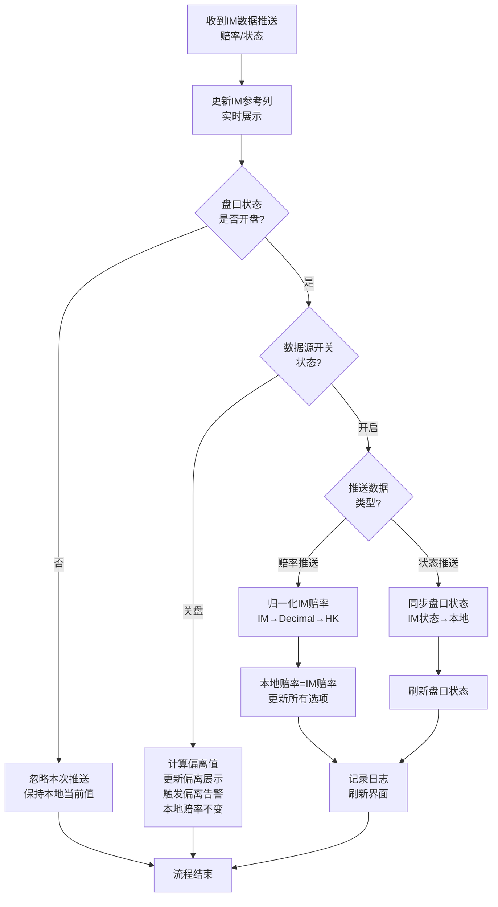
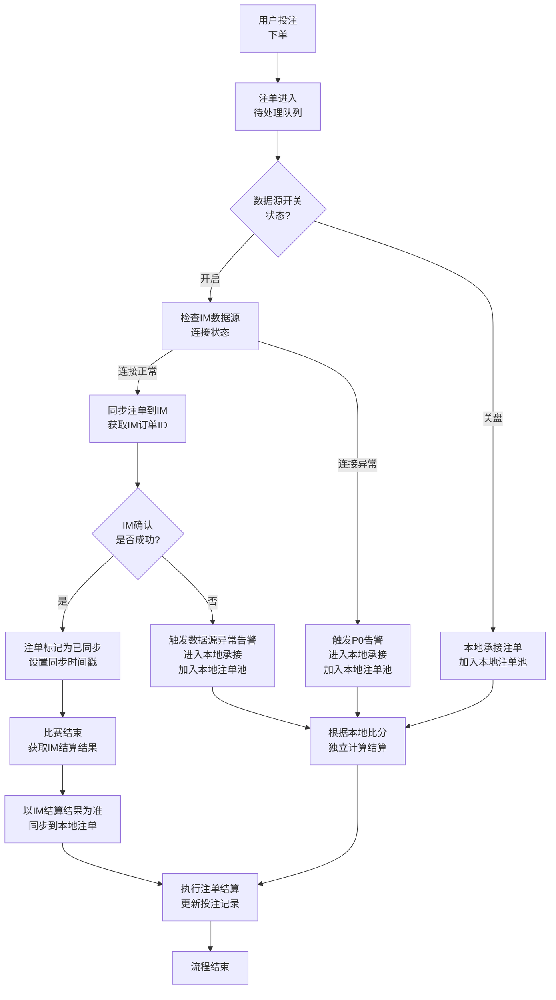
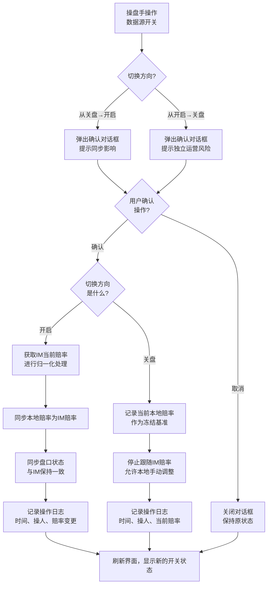

# 第10章 数据源开关

## 10.0 与其他章节的关系说明

本章定义数据源开关的业务逻辑与运作规则。第8章定义了数据源开关的层级控制能力（赛事级、玩法级），本章聚焦于具体的跟随规则、状态同步、结算边界等核心业务逻辑。

| 维度     | 第8章                                  | 第10章                         |
| -------- | -------------------------------------- | ------------------------------ |
| 核心问题 | 数据源开关在哪些层级可控制             | 数据源开关如何运作             |
| 层级控制 | 赛事级、玩法级支持；线级、选项级不支持 | 引用第8章定义                  |
| 状态约束 | 非Open状态下按钮禁用但配置保留         | 详细说明状态与数据源开关的交互 |
| 业务逻辑 | -                                      | 赔率跟随、状态同步、结算规则   |

**术语约定**：本章沿用第8章8.0节的术语对照，玩法指BetTypeMarket，盘口市场指IMMarket（Early/Today/Live）。

---

## 10.1 数据源开关概述

### 10.1.1 数据源开关的定义

数据源开关控制本地系统是否跟随IM数据源的赔率、盘口状态和结算结果。

| 开关状态 | 含义         | 行为                                         |
| :------: | ------------ | -------------------------------------------- |
|   开启   | 跟随数据源   | 赔率、盘口状态、注单结算均跟随IM数据源       |
|   关盘   | 本地独立运营 | 赔率本地维护、盘口状态本地控制、本地独立结算 |

### 10.1.2 数据源开关与"跟随数据源盘口状态"的区别

系统中存在两个相关概念，需严格区分：

| 配置项                 | 控制范围           | 配置归属                | 作用                                   |
| ---------------------- | ------------------ | ----------------------- | -------------------------------------- |
| 数据源开关             | 赔率 + 状态 + 结算 | 操盘页（赛事级/玩法级） | 控制是否全面跟随IM（赔率、状态、结算） |
| 是否跟随数据源盘口状态 | 仅盘口状态         | 联赛管理                | 控制本地盘口状态是否跟随IM暂停/恢复    |

**关键区别**：

- **数据源开关**是操盘页的实时控制，影响赔率、状态、结算三个维度
- **跟随数据源盘口状态**是联赛管理的配置项，仅影响盘口状态同步

**优先级规则**：数据源开关关盘时，即使联赛配置"跟随数据源盘口状态=是"，本地盘口状态也不跟随IM（数据源开关优先级更高）。

### 10.1.3 数据源开关控制层级

| 层级   | 数据源开关 | 作用范围       | 联动规则                                           |
| ------ | :--------: | -------------- | -------------------------------------------------- |
| 赛事级 |     ✅     | 该赛事所有玩法 | 关盘则所有玩法关盘；开启则所有玩法开启             |
| 玩法级 |     ✅     | 单个玩法       | 可独立控制；若与赛事级不一致，赛事级显示"部分开启" |
| 线级   |     ❌     | 一期不支持     | 同一玩法下多条线需保持一致的跟随状态               |
| 选项级 |     ❌     | 一期不支持     | 同一线下选项赔率需配对，不可独立控制               |

**不支持线级/选项级的原因**：

- **线级**：同一玩法下多条线的赔率有水位差关系，独立控制会导致水位差异常
- **选项级**：同一条线的选项赔率需配对以维持RTP，独立控制会破坏配对关系

---

## 10.2 数据源开启时的行为

数据源开关开启时，本地系统全面跟随IM数据源。

### 10.2.1 赔率跟随

| 场景           | 行为                                         | 说明             |
| -------------- | -------------------------------------------- | ---------------- |
| IM赔率推送     | 本地赔率自动同步为IM赔率                     | 实时跟随         |
| 本地手动调整   | 阻止操作，提示"数据源开启时不可手动调整赔率" | 防止与数据源冲突 |
| IM推送异常赔率 | 忽略本次推送，保持本地当前赔率               | 触发数据异常告警 |

**赔率同步规则**：

1. 收到IM赔率推送后，按第7章7.2.0节进行赔率归一化（IM原始赔率 → Decimal → HK）
2. 本地HK赔率直接设为归一化后的IM HK赔率
3. 同一玩法下所有选项同时更新
4. 更新后按第7章精度规则处理（HK落库3位小数，显示2位小数）

### 10.2.2 盘口状态跟随

| IM状态 | 本地盘口状态 | 说明                     |
| ------ | ------------ | ------------------------ |
| 开盘   | 开盘         | 跟随IM开盘，可接受投注   |
| 暂停   | 开盘（C端暂停投注） | 跟随IM暂停状态，C端显示暂停投注，本地状态不变 |
| 维护   | 隐藏         | IM维护期间本地隐藏       |
| 关盘   | 关盘         | 跟随IM关盘，不可逆终态   |

**状态同步时机**：收到IM状态推送后立即同步，无延迟。

### 10.2.3 结算跟随

数据源开启时，IM结算结果是规范定义，本地注单同步IM结算结果。

| 结算场景 | 结算方式                     | 说明               |
| -------- | ---------------------------- | ------------------ |
| 正常完场 | 以IM结算结果为准             | 本地同步IM结算结果 |
| 取消     | 以IM结算结果为准（全额退款） | 同步IM             |
| 腰斩     | 以IM结算结果为准             | 同步IM规则         |
| 中断     | 等待IM决策后同步             | 人工确认           |
| 走盘     | 以IM结算结果为准（退还本金） | 同步IM             |

**重要说明**：本地注单不按比分独立计算，而是完全同步IM结算结果（含走盘、取消、特殊结算等情况），确保结算口径与IM一致。

### 10.2.4 IM参考列展示

数据源开启时，操盘页显示的内容：

| 显示项   | 内容         | 说明               |
| -------- | ------------ | ------------------ |
| 本地赔率 | = IM赔率     | 跟随状态下两者相同 |
| IM参考列 | IM当前赔率   | 实时更新           |
| 偏离值   | 0            | 跟随状态下无偏离   |
| 开关状态 | 开启（绿色） | 表示正在跟随数据源 |

---

## 10.3 数据源关盘时的行为

数据源开关关盘时，本地系统独立运营，不跟随IM。

### 10.3.1 赔率独立

| 场景         | 行为                                | 说明                  |
| ------------ | ----------------------------------- | --------------------- |
| IM赔率推送   | 本地赔率不变，仅更新IM参考列        | 展示偏离供参考        |
| 本地手动调整 | 允许操作，按第7章规则校验           | 需满足调幅、RTP等限制 |
| RTP维持      | 手动调整时按第7章配对/缩放法维持RTP | 本地独立计算          |

**偏离值计算**：

```
偏离值 = 本地HK赔率 − IM HK赔率
```

### 10.3.2 偏离告警

数据源关盘期间，系统持续计算并展示本地赔率与IM赔率的偏离：

| 偏离绝对值 | 显示样式 | 告警级别 | 说明               |
| ---------- | -------- | -------- | ------------------ |
| 小于0.05   | 灰色     | 无       | 正常偏离           |
| 0.05至0.10 | 橙色     | 警告     | 轻度偏离           |
| 大于0.10   | 红色     | 严重     | 严重偏离，触发告警 |

**偏离告警阈值**：默认值为0.10（风控管理配置）。

### 10.3.3 盘口状态独立

| 场景       | 行为                       | 说明                     |
| ---------- | -------------------------- | ------------------------ |
| IM状态变化 | 本地盘口状态不变           | 告警列显示"数据源暂停"等 |
| 本地操作   | 允许人工控制开盘/隐藏/锁定 | 按第9章状态流转规则      |
| IM关盘     | **本地强制关盘**           | 关盘是终态，不受开关影响 |

**例外规则**：IM关盘时，无论数据源开关状态如何，本地强制关盘。这是因为IM关盘意味着玩法结算或赛事结束，本地无法继续独立运营该盘口。

### 10.3.4 结算独立

数据源关盘时，本地根据比分结果独立计算结算。

| 结算场景 | 结算方式             | 说明           |
| -------- | -------------------- | -------------- |
| 正常完场 | 本地根据比分计算结算 | 人工审核后执行 |
| 取消     | 人工标记后全额退款   | 本地决策       |
| 腰斩     | 人工标记后按规则结算 | 本地决策       |
| 中断     | 人工评估后决策       | 本地决策       |

**风险提示**：数据源关盘时本地独立结算，平台需承担全部盈亏风险。

### 10.3.5 IM参考列展示

数据源关盘时，操盘页显示的内容：

| 显示项   | 内容           | 说明                 |
| -------- | -------------- | -------------------- |
| 本地赔率 | 本地维护的赔率 | 可手动调整           |
| IM参考列 | IM当前赔率     | 实时更新，供参考     |
| 偏离值   | 本地 − IM      | 按10.3.2规则显示颜色 |
| 开关状态 | 关盘（灰色）   | 表示本地独立运营     |

---

## 10.4 数据源开关状态变更

### 10.4.1 从关盘切换为开启

操盘手将数据源开关从关盘切换为开启时：

| 步骤 | 操作           | 说明                                           |
| :--: | -------------- | ---------------------------------------------- |
|  1   | 确认对话框     | 提示"开启后本地赔率将同步为IM赔率，是否确认？" |
|  2   | 获取IM当前赔率 | 从数据源获取最新赔率并归一化为HK               |
|  3   | 同步本地赔率   | 本地赔率立即更新为IM赔率                       |
|  4   | 同步盘口状态   | 本地盘口状态与IM当前状态同步                   |
|  5   | 记录日志       | 记录开启时间、操作人、原赔率、新赔率           |

**确认对话框内容**：

```
┌─────────────────────────────────────────────────┐
│  确认开启数据源                                  │
├─────────────────────────────────────────────────┤
│                                                 │
│  开启后：                                       │
│  • 本地赔率将立即同步为IM赔率                   │
│  • 盘口状态将跟随IM状态                         │
│  • 注单结算将以IM结果为准                       │
│                                                 │
│  当前本地赔率: 主队 0.85 / 客队 0.95            │
│  当前IM赔率:   主队 0.88 / 客队 0.92            │
│                                                 │
│              [取消]  [确认开启]                 │
└─────────────────────────────────────────────────┘
```

### 10.4.2 从开启切换为关盘

操盘手将数据源开关从开启切换为关盘时：

| 步骤 | 操作       | 说明                                   |
| :--: | ---------- | -------------------------------------- |
|  1   | 确认对话框 | 提示"关盘后需本地独立维护，是否确认？" |
|  2   | 停止跟随   | 本地赔率和状态不再随IM变化             |
|  3   | 冻结当前值 | 保持当前赔率和状态                     |
|  4   | 记录日志   | 记录关盘时间、操作人、当前赔率         |

**确认对话框内容**：

```
┌─────────────────────────────────────────────────┐
│  确认关盘数据源                                  │
├─────────────────────────────────────────────────┤
│                                                 │
│  关盘后：                                       │
│  • 本地赔率需手动维护                           │
│  • 盘口状态需手动控制                           │
│  • 注单需本地独立结算（平台承担盈亏风险）       │
│                                                 │
│  当前赔率将被冻结: 主队 0.88 / 客队 0.92        │
│                                                 │
│              [取消]  [确认关盘]                 │
└─────────────────────────────────────────────────┘
```

### 10.4.3 批量切换

支持赛事级批量切换数据源开关：

| 操作           | 行为                                 |
| -------------- | ------------------------------------ |
| 赛事级开关开启 | 该赛事下所有玩法的数据源开关同步开启 |
| 赛事级开关关盘 | 该赛事下所有玩法的数据源开关同步关盘 |
| 玩法级单独调整 | 赛事级显示"部分开启"                 |

---

## 10.5 盘口状态对数据源开关的影响

### 10.5.1 状态约束

| 盘口状态 | 数据源开关 | 说明                     |
| -------- | :--------: | ------------------------ |
| 开盘     |   可操作   | 正常运营，可切换开关状态 |
| 隐藏     |    禁用    | 不接受投注，开关按钮禁用 |
| 锁定     |    禁用    | 不接受投注，开关按钮禁用 |
| 关盘     |    禁用    | 终态，开关按钮禁用       |

**重要说明**：非开盘状态下，数据源开关按钮禁用（灰色不可点击），但配置值保留不清空。当状态恢复为开盘时，按保留的配置值恢复数据源开关状态。

### 10.5.2 状态恢复时的处理

当盘口从非开盘状态恢复为开盘状态时：

| 数据源开关（保留值） | 恢复后行为                     |
| -------------------- | ------------------------------ |
| 开启                 | 立即同步IM当前赔率和状态       |
| 关盘                 | 保持恢复前的本地赔率，不同步IM |

---

## 10.6 数据源异常处理

### 10.6.1 数据源连接异常

| 异常场景           | 数据源开关=开启时的处理              | 数据源开关=关盘时的处理  |
| ------------------ | ------------------------------------ | ------------------------ |
| IM连接断开         | 触发P0告警；盘口自动隐藏；等待恢复   | 触发告警；可继续本地运营 |
| IM推送超时（>5秒） | 触发P1告警；保持最后值；显示延迟标记 | 仅更新告警；不影响本地   |
| IM推送异常数据     | 忽略本次推送；触发告警；保持当前值   | 忽略；不影响本地         |

### 10.6.2 连接恢复后的处理

IM连接恢复后，系统根据数据源开关状态决定处理方式：

| 数据源开关 | 恢复后行为                         |
| ---------- | ---------------------------------- |
| 开启       | 获取IM最新赔率和状态，立即同步本地 |
| 关盘       | 仅更新IM参考列，本地赔率和状态不变 |

---

## 10.7 玩法分类与数据源控制

### 10.7.1 可操盘玩法

以下玩法支持数据源开关控制（规范：《核心摘要》第四节渲染器映射表，共17种）：

| 玩法代码 | 玩法名称         | 渲染器          | 数据源开关 | 本地赔率编辑（关盘时） | 备注 |
| -------- | ---------------- | --------------- | :--------: | :--------------------: | ---- |
| BT1      | 让球             | MultiLineTable  |     ✅     |           ✅           |      |
| BT2      | 大小             | MultiLineTable  |     ✅     |           ✅           |      |
| BT3      | 独赢1X2          | SingleLineTable |     ✅     |           ✅           |      |
| BT5      | 单双             | SingleLineTable |     ✅     |           ✅           |      |
| BT6      | 波胆             | Matrix          |     ✅     |           ✅           |      |
| BT7      | 总进球           | LongList        |     ✅     |           ✅           |      |
| BT8      | 双重机会         | SingleLineTable |     ✅     |           ✅           |      |
| BT9      | 半全场           | Matrix          |     ✅     |           ✅           |      |
| BT32     | 客队大小         | MultiLineTable  |     ✅     |           ✅           |      |
| BT37     | 下一球队         | SingleLineTable |     ✅     |           ✅           |      |
| BT48     | 15分钟1X2        | SingleLineTable |     ✅     |           ✅           |      |
| BT158    | 反波胆           | Matrix          |     ✅     |           ✅           |      |
| BT159    | 第X粒入球球队    | SingleLineTable |     ✅     |           ✅           |      |
| BT160    | 主队大小         | MultiLineTable  |     ✅     |           ✅           |      |
| BT161    | 客队大小         | MultiLineTable  |     ✅     |           ✅           |      |
| BT179    | 15分钟让球       | MultiLineTable  |     ✅     |           ✅           |      |
| BT180    | 15分钟大小       | MultiLineTable  |     ✅     |           ✅           |      |

### 10.7.2 透传玩法

非可操盘玩法清单的所有BetType为透传玩法：

| 特性       | 规则                 |
| ---------- | -------------------- |
| 数据源开关 | 强制开启，不可关盘   |
| 本地赔率   | = IM赔率，不可编辑   |
| 盘口状态   | 完全跟随IM           |
| 结算       | 完全以IM结算结果为准 |

**透传玩法说明**：透传玩法完全依赖IM数据源，本地不承担操盘和风险，仅做透明转发。

---

## 10.8 数据源开关判定流程图



### 10.8.2 飞单同步流程



### 10.8.3 数据源开关切换流程



---

## 10.9 配置项归属汇总

| 配置项             | 默认值 | 配置归属 | 说明                           |
| ------------------ | :----: | -------- | ------------------------------ |
| 数据源开关初始状态 |  开启  | 联赛管理 | 新上架赛事的数据源开关默认状态 |
| 赔率偏离告警阈值   |  0.10  | 风控管理 | 关盘时本地与IM偏差超过此值告警 |
| 轻度偏离阈值       |  0.05  | 风控管理 | 偏离超过此值显示橙色           |
| 数据源超时阈值     |  5秒   | 系统管理 | 推送间隔超过此值触发延迟告警   |

**初始状态来源规则**：新上架赛事的数据源开关初始状态取联赛管理默认值，并在创建上架记录时固化到赛事配置快照。后续联赛默认值变更不追溯已上架赛事。

---

## 10.10 与其他章节的引用关系

| 引用章节 | 引用内容             | 说明                                         |
| -------- | -------------------- | -------------------------------------------- |
| 第7章    | 赔率归一化、精度规则 | 数据源开启时赔率同步需按第7章规则处理        |
| 第7章    | 配对公式、缩放法     | 数据源关盘时手动调整赔率需按第7章RTP维持规则 |
| 第8章    | 层级控制定义         | 数据源开关的层级控制能力在第8章定义          |
| 第9章    | 状态流转规则         | 盘口状态变更需遵循第9章状态流转规则          |
| 第16章   | 数据联动规则         | 数据源状态变更联动规则在第16章定义           |

---

## 修订记录

| 版本 | 日期       | 修订内容                                                                 |
| ---- | ---------- | ------------------------------------------------------------------------ |
| 第1次修订 | 2026-01-22 | 初稿（AO与飞单机制）                                                     |
| 第2次修订 | 2026-01-28 | 重构：AO与飞单机制简化为数据源开关；删除AO偏移计算、飞单双注单、对冲机制 |
| 第3次修订 | 2026-01-28 | 10.7.1节可操盘玩法清单补齐BT6/BT9/BT158（共12种），添加渲染器列与规范说明 |
| 第4次修订 | 2026-01-29 | 全局规则v1.6术语对齐：10.2.2节本地盘口状态"暂停"→"隐藏"；IM状态术语保持不变 |
| 第5次修订 | 2026-02-11 | ~~10.7.1节可操盘玩法从12种扩展为19种：新增BT18/BT22/BT23/BT48/BT179/BT180/BT273；BT273为透传模式（数据源开关不适用）~~（**已撤回**，第7次修订回滚为12种） |
| 第6次修订 | 2026-02-11 | A1架构修正：IM暂停不再改变本地状态，仅影响C端展示：1）10.2.2节盘口状态跟随表：暂停改为"开盘（C端暂停投注）"，说明本地状态不变、C端显示暂停 |
| 第7次修订 | 2026-03-03 | 10.7.1节可操盘玩法从19种回滚为12种：移除BT18/BT22/BT23/BT48/BT179/BT180/BT273（回归透传）；第5次修订标注为已撤回 |
| 第8次修订 | 2026-04-02 | 10.7.1节可操盘玩法从12种扩展为17种：新增BT32客队大小、BT37下一球队、BT48 15分钟1X2、BT179 15分钟让球、BT180 15分钟大小；数据来源：sport_play_type表 is_manual_trade=2 确认（共82行/17种BT） |
