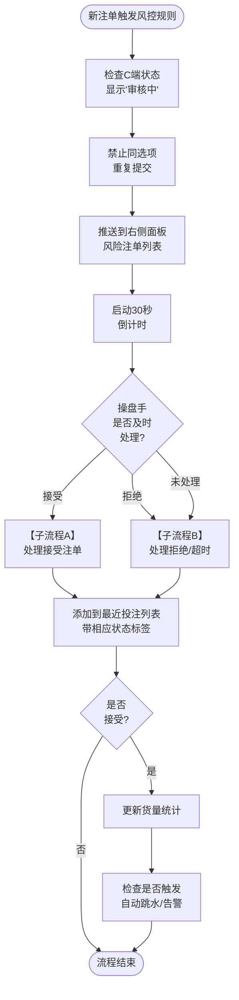
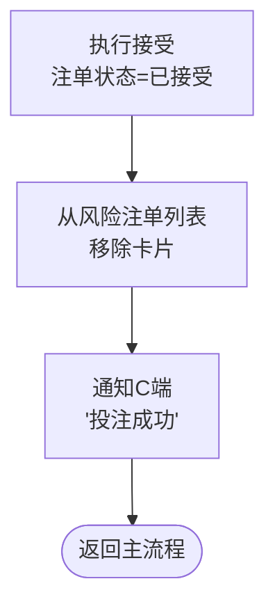
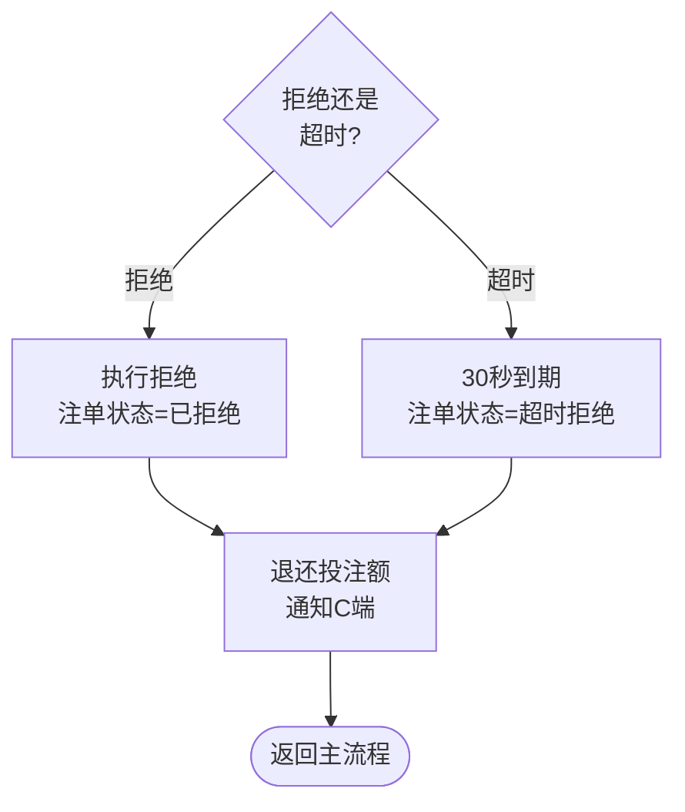

# 第11章 右侧监控面板

## 11.0 与其他章节的关系说明

本章定义操盘页右侧监控面板的结构、功能和交互规则。右侧监控面板是操盘手实时监控投注活动和处理风险注单的核心区域。

| 维度         | 相关章节                       | 本章职责                           |
| ------------ | ------------------------------ | ---------------------------------- |
| 页面布局     | 第2章页面结构                  | 本章定义右栏的具体内容和交互       |
| 注单数据     | 第12章数据字段定义             | 本章定义展示逻辑，字段定义见第12章 |
| 风险注单处理 | 第14章操作流程与权限           | 本章定义界面交互，权限规则见第14章 |
| 告警类型     | **[操盘列表第9章9.11节](../trading-list/09-数据字段定义.md#_9-11-告警类型枚举)**（规范） | 本章复用告警类型定义，共11种       |
| 操盘日志     | 第18章操盘日志页面规范         | 本章定义快捷入口，完整规范见第18章 |

---

## 11.1 面板概述

### 11.1.1 面板定位

右侧监控面板用于实时监控当前赛事的投注活动，帮助操盘手及时发现和处理风险。

| 功能模块 | 核心作用                                      |
| -------- | --------------------------------------------- |
| 风险注单 | 展示需人工审核的高风险投注，支持接受/拒绝操作 |
| 最近投注 | 展示实时投注流水，便于监控投注趋势            |

**说明**：一期右侧面板聚焦于投注监控的核心功能，告警信息和操盘日志通过顶部栏和弹窗入口访问。

### 11.1.2 面板位置与尺寸

| 属性     | 规格                   | 说明           |
| -------- | ---------------------- | -------------- |
| 位置     | 页面右侧               | 三栏布局的右栏 |
| 展开宽度 | 280px                  | 固定宽度       |
| 折叠宽度 | 48px                   | 仅显示图标     |
| 高度     | 100%视口高度减去顶部栏 | 垂直填满       |

---

## 11.2 面板结构

### 11.2.1 面板布局

```
┌─────────────────────────────────┐
│  ◀ 折叠按钮                     │
├─────────────────────────────────┤
│  ⚠️ 风险注单              [15]  │  ← 可折叠区块
│  ├─ 注单卡片1                   │
│  ├─ 注单卡片2                   │
│  └─ 批量操作按钮                │
├─────────────────────────────────┤
│  💰 最近投注                    │  ← 可折叠区块
│  ├─ 投注记录1                   │
│  ├─ 投注记录2                   │
│  └─ ...                         │
└─────────────────────────────────┘
```

### 11.2.2 区块展开/折叠规则

| 区块     | 默认状态 | 折叠交互            | 说明                   |
| -------- | -------- | ------------------- | ---------------------- |
| 风险注单 | 展开     | 点击标题行折叠/展开 | 有待处理注单时保持展开 |
| 最近投注 | 展开     | 点击标题行折叠/展开 | -                      |

---

## 11.3 风险注单模块

### 11.3.1 风险注单定义

风险注单是指触发风控规则需要人工审核的投注。

| 触发条件   | 风控规则                                         | 说明                 |
| ---------- | ------------------------------------------------ | -------------------- |
| 单笔大额   | 投注金额超过大额阈值（默认5万）                  | 阈值在风控管理配置   |
| 累计超限   | 单盘口累计投注超过阈值（默认20万）               | 阈值在风控管理配置   |
| 单边超限   | 单边投注比例超过阈值（默认70%）                  | 阈值在风控管理配置   |
| 用户标记   | 用户被标记为高风险                               | 职业玩家、套利玩家等 |
| 赔率变化   | 投注时本地赔率与下注赔率偏差超过阈值（默认0.10） | 复用偏离告警阈值口径 |
| 盘口非开盘 | 盘口处于隐藏或锁定状态时收到的投注               | 边界投注，需人工确认 |

**C端用户态规则**：

- 待审核期间：C端显示"审核中"，用户不可对同一选项重复提交投注
- 接受/拒绝后：实时通知用户结果（接受显示"投注成功"，拒绝显示"投注未通过"并退还投注额）

### 11.3.2 风险注单卡片结构

每张风险注单卡片包含以下信息：

| 区域     | 内容                         | 样式                      |
| -------- | ---------------------------- | ------------------------- |
| 头部左侧 | 投注金额                     | 红色加粗，如"¥15,000"     |
| 头部右侧 | 投注时间                     | 灰色，如"18:45:32"        |
| 详情行   | 玩法 + 选项 + 赔率           | 如"让球 主队(-0.5) @0.92" |
| 风险标签 | 触发的风控规则               | 红色/橙色标签             |
| 倒计时   | 剩余审核时间（最后10秒显示） | 红色闪烁                  |
| 操作按钮 | 接受 / 拒绝                  | 绿色/红色按钮             |

### 11.3.3 风险注单列表规则

| 规则项       | 规格              | 说明                   |
| ------------ | ----------------- | ---------------------- |
| 排序方式     | 按投注时间倒序    | 最新的在最上面         |
| 最大显示数量 | 20条              | 超出显示"查看更多"链接 |
| 自动刷新     | WebSocket实时推送 | 新注单立即推送         |
| 超时处理     | 30秒自动拒绝      | 超时时间在系统管理配置 |

### 11.3.4 风险注单操作

| 操作     | 按钮样式       | 点击效果                     | 说明                       |
| -------- | -------------- | ---------------------------- | -------------------------- |
| 接受     | 绿色"✓ 接受"   | 注单状态变为已接受，卡片淡出 | 确认接受该投注             |
| 拒绝     | 红色"✗ 拒绝"   | 注单状态变为已拒绝，卡片淡出 | 拒绝该投注，退还用户投注额 |
| 全部接受 | 绿色"全部接受" | 批量接受所有待审核注单       | 底部批量按钮               |
| 全部拒绝 | 红色"全部拒绝" | 批量拒绝所有待审核注单       | 底部批量按钮               |

### 11.3.5 风险注单超时规则

| 规则项     | 规格         | 说明                                     |
| ---------- | ------------ | ---------------------------------------- |
| 超时时间   | 30秒         | 配置归属系统管理                         |
| 超时行为   | 自动拒绝     | 超时未处理的注单自动拒绝，退还用户投注额 |
| 倒计时显示 | 最后10秒显示 | 卡片上显示红色闪烁倒计时                 |
| 超时提示   | Toast通知    | "注单#xxx已超时自动拒绝"                 |

**设计原因**：风险注单本质是高风险投注，超时自动拒绝可控制风险敞口，避免因操盘手未及时处理导致风险失控。

### 11.3.6 风险注单标签

| 标签       | 样式 | 触发条件                              |
| ---------- | ---- | ------------------------------------- |
| 大额       | 红色 | 单笔金额超过大额阈值（默认5万）       |
| 单边       | 橙色 | 该选项投注比例超过单边阈值（默认70%） |
| 高风险用户 | 红色 | 用户被标记为高风险                    |
| 赔率变化   | 橙色 | 投注时赔率偏差超过阈值（默认0.10）    |
| 累计超限   | 橙色 | 单盘口累计投注超过阈值（默认20万）    |
| 盘口非开盘 | 红色 | 盘口处于隐藏或锁定状态                |

---

## 11.4 最近投注模块

### 11.4.1 最近投注定义

最近投注展示当前赛事的实时投注流水，用于监控投注趋势和验证风险注单处理结果。

### 11.4.2 投注记录结构

每条投注记录包含以下信息：

| 区域     | 内容                          | 样式                |
| -------- | ----------------------------- | ------------------- |
| 头部左侧 | 投注金额                      | 白色，如"¥8,000"    |
| 头部右侧 | 投注时间                      | 灰色，如"18:44:55"  |
| 详情行   | 玩法 + 选项 + 赔率 + 状态标签 | 如"独赢 主胜 @1.85" |
| 状态标签 | 已接受/已拒绝/待审核          | 绿色/红色/橙色      |

### 11.4.3 投注记录列表规则

| 规则项       | 规格              | 说明                           |
| ------------ | ----------------- | ------------------------------ |
| 排序方式     | 按投注时间倒序    | 最新的在最上面                 |
| 最大显示数量 | 50条              | 超出显示"查看更多"链接         |
| 自动刷新     | WebSocket实时推送 | 新注单立即推送                 |
| 默认筛选     | 已接受 + 待审核   | 已拒绝注单默认不显示           |
| 已拒绝显示   | 折叠在末尾        | 点击"显示已拒绝"展开，灰色样式 |

**设计原因**：默认隐藏已拒绝注单，避免拒单刷屏影响操盘手监控有效投注。

### 11.4.4 投注状态标签

| 状态     | 标签样式       | 说明                           |
| -------- | -------------- | ------------------------------ |
| 已接受   | 绿色"已接受"   | 正常接受的投注                 |
| 已拒绝   | 红色"已拒绝"   | 被拒绝的投注（默认隐藏）       |
| 待审核   | 橙色"待审核"   | 等待人工审核的风险注单         |
| 超时拒绝 | 红色"超时拒绝" | 超时自动拒绝的注单（默认隐藏） |

---

## 11.5 面板折叠态

### 11.5.1 折叠触发方式

| 触发方式     | 操作                  | 说明         |
| ------------ | --------------------- | ------------ |
| 点击折叠按钮 | 点击面板顶部的"◀"按钮 | 主要折叠方式 |
| 快捷键       | 暂不支持              | 一期不支持   |

### 11.5.2 折叠态布局

面板折叠后，宽度收缩为48px，仅显示与展开态模块一一对应的功能图标：

```
┌────┐
│ ▶  │  ← 展开按钮（箭头方向变为▶）
├────┤
│ ⚠️ │  ← 风险注单图标（显示数量角标）
│[15]│
├────┤
│ 💰 │  ← 最近投注图标（显示数量角标）
│[28]│
└────┘
```

### 11.5.3 折叠态图标交互

| 图标               | 点击行为                     | 说明           |
| ------------------ | ---------------------------- | -------------- |
| 展开按钮（▶）      | 展开面板                     | 恢复到展开状态 |
| 风险注单图标（⚠️） | 展开面板并滚动到风险注单区块 | 快速定位       |
| 最近投注图标（💰） | 展开面板并滚动到最近投注区块 | 快速定位       |

### 11.5.4 折叠态数量角标

| 图标     | 角标内容          | 显示规则                      |
| -------- | ----------------- | ----------------------------- |
| 风险注单 | 待审核注单数量    | 数量大于0时显示，红色圆形角标 |
| 最近投注 | 最近5分钟投注数量 | 数量大于0时显示，蓝色圆形角标 |

---

## 11.7 实时数据更新

### 11.7.1 数据推送机制

| 数据类型 | 推送方式          | 推送频率       |
| -------- | ----------------- | -------------- |
| 风险注单 | WebSocket实时推送 | 新注单立即推送 |
| 投注流   | WebSocket实时推送 | 新注单立即推送 |

### 11.7.2 数据更新动画

| 场景         | 动画效果             | 说明           |
| ------------ | -------------------- | -------------- |
| 新风险注单   | 从顶部滑入，背景闪烁 | 吸引操盘手注意 |
| 新投注记录   | 从顶部滑入           | 无闪烁         |
| 注单处理完成 | 淡出并从列表移除     | 平滑过渡       |

### 11.7.3 断连处理与兑底拉取

| 场景          | 处理方式                 | 说明           |
| ------------- | ------------------------ | -------------- |
| WebSocket断连 | 显示"连接中..."提示      | 面板顶部显示   |
| 重连成功      | 调用兜底接口补拉数据     | 见下方兜底策略 |
| 重连失败      | 显示"连接失败，点击重试" | 支持手动重试   |

**兜底拉取策略**：

| 规则项   | 规格                                               | 说明                                 |
| -------- | -------------------------------------------------- | ------------------------------------ |
| 拉取接口 | GET /events/{eventId}/bets?since={last_message_ts} | since=断连前最后一条推送的server_ts  |
| 去重主键 | bet_id                                             | 避免重复插入                         |
| 单次上限 | 200条                                              | 超出提示"数据存在不完整风险，请刷新页面" |
| 拉取时机 | WebSocket重连成功后立即执行                        | 自动触发                             |

---

## 11.8 待审核注单处理流程图

### 主流程



### 子流程A：处理接受注单



### 子流程B：处理拒绝/超时



---

## 11.9 配置项归属汇总

| 配置项               | 默认值     | 配置归属 | 说明                       |
| -------------------- | ---------- | -------- | -------------------------- |
| 风险注单超时时间     | 30秒       | 系统管理 | 超时自动拒绝               |
| 大额投注阈值（单笔） | 5万        | 风控管理 | 触发风险注单审核           |
| 大额投注阈值（累计） | 20万       | 风控管理 | 单盘口累计超过此值触发审核 |
| 单边比例告警阈值     | 70%        | 风控管理 | 触发风险注单审核           |
| 赔率变化阈值         | 0.10（HK） | 风控管理 | 与第7章偏离IM阈值口径一致（默认值为0.10，风控管理配置） |
| 最近投注显示数量     | 50条       | 系统管理 | 一期写死，默认值为50条               |
| 风险注单显示数量     | 20条       | 系统管理 | 一期写死，默认值为20条               |
| 断连补拉上限         | 200条      | 系统管理 | 一期写死，默认值为200条              |
