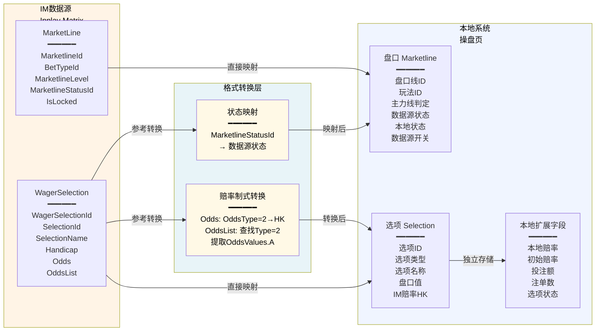

# 第12章 数据字段定义

## 12.0 与其他章节的关系说明

本章定义操盘页涉及的所有数据字段，包括字段来源、数据类型、精度、业务含义。

<pre class="font-ui border-border-100/50 overflow-x-scroll w-full rounded border-[0.5px] shadow-[0_2px_12px_hsl(var(--always-black)/5%)]"><table class="bg-bg-100 min-w-full border-separate border-spacing-0 text-sm leading-[1.88888] whitespace-normal"><thead class="text-left"><tr><th class="text-text-000 [&:not(:first-child)]:-x-[hsla(var(--border-100)/0.5)] px-2 [&:not(:first-child)]:border-l-[0.5px]">维度</th><th class="text-text-000 [&:not(:first-child)]:-x-[hsla(var(--border-100)/0.5)] px-2 [&:not(:first-child)]:border-l-[0.5px]">相关章节</th><th class="text-text-000 [&:not(:first-child)]:-x-[hsla(var(--border-100)/0.5)] px-2 [&:not(:first-child)]:border-l-[0.5px]">本章职责</th></tr></thead><tbody><tr><td class="border-t-border-100/50 [&:not(:first-child)]:-x-[hsla(var(--border-100)/0.5)] border-t-[0.5px] px-2 [&:not(:first-child)]:border-l-[0.5px]">盘口表格</td><td class="border-t-border-100/50 [&:not(:first-child)]:-x-[hsla(var(--border-100)/0.5)] border-t-[0.5px] px-2 [&:not(:first-child)]:border-l-[0.5px]">第6章盘口卡片模块</td><td class="border-t-border-100/50 [&:not(:first-child)]:-x-[hsla(var(--border-100)/0.5)] border-t-[0.5px] px-2 [&:not(:first-child)]:border-l-[0.5px]">本章定义表格中各列的字段规格</td></tr><tr><td class="border-t-border-100/50 [&:not(:first-child)]:-x-[hsla(var(--border-100)/0.5)] border-t-[0.5px] px-2 [&:not(:first-child)]:border-l-[0.5px]">赔率计算</td><td class="border-t-border-100/50 [&:not(:first-child)]:-x-[hsla(var(--border-100)/0.5)] border-t-[0.5px] px-2 [&:not(:first-child)]:border-l-[0.5px]">第7章赔率编辑与计算</td><td class="border-t-border-100/50 [&:not(:first-child)]:-x-[hsla(var(--border-100)/0.5)] border-t-[0.5px] px-2 [&:not(:first-child)]:border-l-[0.5px]">本章定义赔率字段精度，计算规则见第7章</td></tr><tr><td class="border-t-border-100/50 [&:not(:first-child)]:-x-[hsla(var(--border-100)/0.5)] border-t-[0.5px] px-2 [&:not(:first-child)]:border-l-[0.5px]">状态字段</td><td class="border-t-border-100/50 [&:not(:first-child)]:-x-[hsla(var(--border-100)/0.5)] border-t-[0.5px] px-2 [&:not(:first-child)]:border-l-[0.5px]">第8章控制层级、第9章状态流转</td><td class="border-t-border-100/50 [&:not(:first-child)]:-x-[hsla(var(--border-100)/0.5)] border-t-[0.5px] px-2 [&:not(:first-child)]:border-l-[0.5px]">本章定义状态字段取值，流转规则见第8/9章</td></tr><tr><td class="border-t-border-100/50 [&:not(:first-child)]:-x-[hsla(var(--border-100)/0.5)] border-t-[0.5px] px-2 [&:not(:first-child)]:border-l-[0.5px]">风险敞口</td><td class="border-t-border-100/50 [&:not(:first-child)]:-x-[hsla(var(--border-100)/0.5)] border-t-[0.5px] px-2 [&:not(:first-child)]:border-l-[0.5px]">核心摘要5.8节</td><td class="border-t-border-100/50 [&:not(:first-child)]:-x-[hsla(var(--border-100)/0.5)] border-t-[0.5px] px-2 [&:not(:first-child)]:border-l-[0.5px]">本章引用5.8的Exposure口径定义</td></tr><tr><td class="border-t-border-100/50 [&:not(:first-child)]:-x-[hsla(var(--border-100)/0.5)] border-t-[0.5px] px-2 [&:not(:first-child)]:border-l-[0.5px]">IM数据源</td><td class="border-t-border-100/50 [&:not(:first-child)]:-x-[hsla(var(--border-100)/0.5)] border-t-[0.5px] px-2 [&:not(:first-child)]:border-l-[0.5px]">IM体育数据接口v5.2.6/v6</td><td class="border-t-border-100/50 [&:not(:first-child)]:-x-[hsla(var(--border-100)/0.5)] border-t-[0.5px] px-2 [&:not(:first-child)]:border-l-[0.5px]">本章引用IM原始字段定义</td></tr><tr><td class="border-t-border-100/50 [&:not(:first-child)]:-x-[hsla(var(--border-100)/0.5)] border-t-[0.5px] px-2 [&:not(:first-child)]:border-l-[0.5px]">操盘列表</td><td class="border-t-border-100/50 [&:not(:first-child)]:-x-[hsla(var(--border-100)/0.5)] border-t-[0.5px] px-2 [&:not(:first-child)]:border-l-[0.5px]">操盘列表页第9章数据字段定义</td><td class="border-t-border-100/50 [&:not(:first-child)]:-x-[hsla(var(--border-100)/0.5)] border-t-[0.5px] px-2 [&:not(:first-child)]:border-l-[0.5px]">本章复用赛事级字段定义，聚焦盘口级字段</td></tr></tbody></table></pre>

---

## 12.1 字段分类原则

操盘页的数据字段分为三类，命名和取值必须严格区分，禁止混用。

### 12.1.1 字段分类

<pre class="font-ui border-border-100/50 overflow-x-scroll w-full rounded border-[0.5px] shadow-[0_2px_12px_hsl(var(--always-black)/5%)]"><table class="bg-bg-100 min-w-full border-separate border-spacing-0 text-sm leading-[1.88888] whitespace-normal"><thead class="text-left"><tr><th class="text-text-000 [&:not(:first-child)]:-x-[hsla(var(--border-100)/0.5)] px-2 [&:not(:first-child)]:border-l-[0.5px]">分类</th><th class="text-text-000 [&:not(:first-child)]:-x-[hsla(var(--border-100)/0.5)] px-2 [&:not(:first-child)]:border-l-[0.5px]">定义</th><th class="text-text-000 [&:not(:first-child)]:-x-[hsla(var(--border-100)/0.5)] px-2 [&:not(:first-child)]:border-l-[0.5px]">命名规范</th><th class="text-text-000 [&:not(:first-child)]:-x-[hsla(var(--border-100)/0.5)] px-2 [&:not(:first-child)]:border-l-[0.5px]">存储位置</th></tr></thead><tbody><tr><td class="border-t-border-100/50 [&:not(:first-child)]:-x-[hsla(var(--border-100)/0.5)] border-t-[0.5px] px-2 [&:not(:first-child)]:border-l-[0.5px]">IM原始字段</td><td class="border-t-border-100/50 [&:not(:first-child)]:-x-[hsla(var(--border-100)/0.5)] border-t-[0.5px] px-2 [&:not(:first-child)]:border-l-[0.5px]">由IM数据源API直接推送的字段</td><td class="border-t-border-100/50 [&:not(:first-child)]:-x-[hsla(var(--border-100)/0.5)] border-t-[0.5px] px-2 [&:not(:first-child)]:border-l-[0.5px]">保持IM原始字段名（英文）</td><td class="border-t-border-100/50 [&:not(:first-child)]:-x-[hsla(var(--border-100)/0.5)] border-t-[0.5px] px-2 [&:not(:first-child)]:border-l-[0.5px]">仅缓存，不落库</td></tr><tr><td class="border-t-border-100/50 [&:not(:first-child)]:-x-[hsla(var(--border-100)/0.5)] border-t-[0.5px] px-2 [&:not(:first-child)]:border-l-[0.5px]">本地落库字段</td><td class="border-t-border-100/50 [&:not(:first-child)]:-x-[hsla(var(--border-100)/0.5)] border-t-[0.5px] px-2 [&:not(:first-child)]:border-l-[0.5px]">由本地系统存储和管理的字段</td><td class="border-t-border-100/50 [&:not(:first-child)]:-x-[hsla(var(--border-100)/0.5)] border-t-[0.5px] px-2 [&:not(:first-child)]:border-l-[0.5px]">使用业务语义命名（中文/英文）</td><td class="border-t-border-100/50 [&:not(:first-child)]:-x-[hsla(var(--border-100)/0.5)] border-t-[0.5px] px-2 [&:not(:first-child)]:border-l-[0.5px]">落库</td></tr><tr><td class="border-t-border-100/50 [&:not(:first-child)]:-x-[hsla(var(--border-100)/0.5)] border-t-[0.5px] px-2 [&:not(:first-child)]:border-l-[0.5px]">本地派生字段</td><td class="border-t-border-100/50 [&:not(:first-child)]:-x-[hsla(var(--border-100)/0.5)] border-t-[0.5px] px-2 [&:not(:first-child)]:border-l-[0.5px]">由本地系统根据业务规则实时计算的字段</td><td class="border-t-border-100/50 [&:not(:first-child)]:-x-[hsla(var(--border-100)/0.5)] border-t-[0.5px] px-2 [&:not(:first-child)]:border-l-[0.5px]">使用业务语义命名</td><td class="border-t-border-100/50 [&:not(:first-child)]:-x-[hsla(var(--border-100)/0.5)] border-t-[0.5px] px-2 [&:not(:first-child)]:border-l-[0.5px]">不落库，实时计算</td></tr></tbody></table></pre>

### 12.1.2 三层赔率架构对应

<pre class="font-ui border-border-100/50 overflow-x-scroll w-full rounded border-[0.5px] shadow-[0_2px_12px_hsl(var(--always-black)/5%)]"><table class="bg-bg-100 min-w-full border-separate border-spacing-0 text-sm leading-[1.88888] whitespace-normal"><thead class="text-left"><tr><th class="text-text-000 [&:not(:first-child)]:-x-[hsla(var(--border-100)/0.5)] px-2 [&:not(:first-child)]:border-l-[0.5px]">层级</th><th class="text-text-000 [&:not(:first-child)]:-x-[hsla(var(--border-100)/0.5)] px-2 [&:not(:first-child)]:border-l-[0.5px]">字段类型</th><th class="text-text-000 [&:not(:first-child)]:-x-[hsla(var(--border-100)/0.5)] px-2 [&:not(:first-child)]:border-l-[0.5px]">来源</th><th class="text-text-000 [&:not(:first-child)]:-x-[hsla(var(--border-100)/0.5)] px-2 [&:not(:first-child)]:border-l-[0.5px]">用途</th></tr></thead><tbody><tr><td class="border-t-border-100/50 [&:not(:first-child)]:-x-[hsla(var(--border-100)/0.5)] border-t-[0.5px] px-2 [&:not(:first-child)]:border-l-[0.5px]">第一层</td><td class="border-t-border-100/50 [&:not(:first-child)]:-x-[hsla(var(--border-100)/0.5)] border-t-[0.5px] px-2 [&:not(:first-child)]:border-l-[0.5px]">IM赔率（IM原始字段）</td><td class="border-t-border-100/50 [&:not(:first-child)]:-x-[hsla(var(--border-100)/0.5)] border-t-[0.5px] px-2 [&:not(:first-child)]:border-l-[0.5px]">IM数据源推送</td><td class="border-t-border-100/50 [&:not(:first-child)]:-x-[hsla(var(--border-100)/0.5)] border-t-[0.5px] px-2 [&:not(:first-child)]:border-l-[0.5px]">只读参考，数据源同步基准</td></tr><tr><td class="border-t-border-100/50 [&:not(:first-child)]:-x-[hsla(var(--border-100)/0.5)] border-t-[0.5px] px-2 [&:not(:first-child)]:border-l-[0.5px]">第二层</td><td class="border-t-border-100/50 [&:not(:first-child)]:-x-[hsla(var(--border-100)/0.5)] border-t-[0.5px] px-2 [&:not(:first-child)]:border-l-[0.5px]">本地赔率（本地落库字段）</td><td class="border-t-border-100/50 [&:not(:first-child)]:-x-[hsla(var(--border-100)/0.5)] border-t-[0.5px] px-2 [&:not(:first-child)]:border-l-[0.5px]">数据源同步/手动编辑</td><td class="border-t-border-100/50 [&:not(:first-child)]:-x-[hsla(var(--border-100)/0.5)] border-t-[0.5px] px-2 [&:not(:first-child)]:border-l-[0.5px]">交易/风控/结算，实际生效</td></tr><tr><td class="border-t-border-100/50 [&:not(:first-child)]:-x-[hsla(var(--border-100)/0.5)] border-t-[0.5px] px-2 [&:not(:first-child)]:border-l-[0.5px]">第三层</td><td class="border-t-border-100/50 [&:not(:first-child)]:-x-[hsla(var(--border-100)/0.5)] border-t-[0.5px] px-2 [&:not(:first-child)]:border-l-[0.5px]">显示赔率（本地派生字段）</td><td class="border-t-border-100/50 [&:not(:first-child)]:-x-[hsla(var(--border-100)/0.5)] border-t-[0.5px] px-2 [&:not(:first-child)]:border-l-[0.5px]">本地赔率四舍五入</td><td class="border-t-border-100/50 [&:not(:first-child)]:-x-[hsla(var(--border-100)/0.5)] border-t-[0.5px] px-2 [&:not(:first-child)]:border-l-[0.5px]">界面展示</td></tr></tbody></table></pre>

### 12.1.3 IM字段命名规范

**⚠️ 声明**：IM字段名大小写敏感，本PRD中所有IM字段名与接口定义保持严格一致。如出现拼写差异或大小写不一致，以IM数据字典为主定义并进行全局替换。

---

## 12.2 盘口表格字段定义

操盘页盘口表格共10列，以下定义各列字段规格。

### 12.2.1 盘口表格列结构

<pre class="font-ui border-border-100/50 overflow-x-scroll w-full rounded border-[0.5px] shadow-[0_2px_12px_hsl(var(--always-black)/5%)]"><table class="bg-bg-100 min-w-full border-separate border-spacing-0 text-sm leading-[1.88888] whitespace-normal"><thead class="text-left"><tr><th class="text-text-000 [&:not(:first-child)]:-x-[hsla(var(--border-100)/0.5)] px-2 [&:not(:first-child)]:border-l-[0.5px]">列序</th><th class="text-text-000 [&:not(:first-child)]:-x-[hsla(var(--border-100)/0.5)] px-2 [&:not(:first-child)]:border-l-[0.5px]">列名</th><th class="text-text-000 [&:not(:first-child)]:-x-[hsla(var(--border-100)/0.5)] px-2 [&:not(:first-child)]:border-l-[0.5px]">字段分类</th><th class="text-text-000 [&:not(:first-child)]:-x-[hsla(var(--border-100)/0.5)] px-2 [&:not(:first-child)]:border-l-[0.5px]">适用渲染器</th><th class="text-text-000 [&:not(:first-child)]:-x-[hsla(var(--border-100)/0.5)] px-2 [&:not(:first-child)]:border-l-[0.5px]">说明</th></tr></thead><tbody><tr><td class="border-t-border-100/50 [&:not(:first-child)]:-x-[hsla(var(--border-100)/0.5)] border-t-[0.5px] px-2 [&:not(:first-child)]:border-l-[0.5px]">1</td><td class="border-t-border-100/50 [&:not(:first-child)]:-x-[hsla(var(--border-100)/0.5)] border-t-[0.5px] px-2 [&:not(:first-child)]:border-l-[0.5px]">盘口线</td><td class="border-t-border-100/50 [&:not(:first-child)]:-x-[hsla(var(--border-100)/0.5)] border-t-[0.5px] px-2 [&:not(:first-child)]:border-l-[0.5px]">本地落库</td><td class="border-t-border-100/50 [&:not(:first-child)]:-x-[hsla(var(--border-100)/0.5)] border-t-[0.5px] px-2 [&:not(:first-child)]:border-l-[0.5px]">MultiLineTable</td><td class="border-t-border-100/50 [&:not(:first-child)]:-x-[hsla(var(--border-100)/0.5)] border-t-[0.5px] px-2 [&:not(:first-child)]:border-l-[0.5px]">仅多线玩法显示</td></tr><tr><td class="border-t-border-100/50 [&:not(:first-child)]:-x-[hsla(var(--border-100)/0.5)] border-t-[0.5px] px-2 [&:not(:first-child)]:border-l-[0.5px]">2</td><td class="border-t-border-100/50 [&:not(:first-child)]:-x-[hsla(var(--border-100)/0.5)] border-t-[0.5px] px-2 [&:not(:first-child)]:border-l-[0.5px]">选项</td><td class="border-t-border-100/50 [&:not(:first-child)]:-x-[hsla(var(--border-100)/0.5)] border-t-[0.5px] px-2 [&:not(:first-child)]:border-l-[0.5px]">IM原始+本地</td><td class="border-t-border-100/50 [&:not(:first-child)]:-x-[hsla(var(--border-100)/0.5)] border-t-[0.5px] px-2 [&:not(:first-child)]:border-l-[0.5px]">全部</td><td class="border-t-border-100/50 [&:not(:first-child)]:-x-[hsla(var(--border-100)/0.5)] border-t-[0.5px] px-2 [&:not(:first-child)]:border-l-[0.5px]">选项名称和状态</td></tr><tr><td class="border-t-border-100/50 [&:not(:first-child)]:-x-[hsla(var(--border-100)/0.5)] border-t-[0.5px] px-2 [&:not(:first-child)]:border-l-[0.5px]">3</td><td class="border-t-border-100/50 [&:not(:first-child)]:-x-[hsla(var(--border-100)/0.5)] border-t-[0.5px] px-2 [&:not(:first-child)]:border-l-[0.5px]">初始赔率</td><td class="border-t-border-100/50 [&:not(:first-child)]:-x-[hsla(var(--border-100)/0.5)] border-t-[0.5px] px-2 [&:not(:first-child)]:border-l-[0.5px]">本地落库</td><td class="border-t-border-100/50 [&:not(:first-child)]:-x-[hsla(var(--border-100)/0.5)] border-t-[0.5px] px-2 [&:not(:first-child)]:border-l-[0.5px]">全部</td><td class="border-t-border-100/50 [&:not(:first-child)]:-x-[hsla(var(--border-100)/0.5)] border-t-[0.5px] px-2 [&:not(:first-child)]:border-l-[0.5px]">上架时锁定的赔率</td></tr><tr><td class="border-t-border-100/50 [&:not(:first-child)]:-x-[hsla(var(--border-100)/0.5)] border-t-[0.5px] px-2 [&:not(:first-child)]:border-l-[0.5px]">4</td><td class="border-t-border-100/50 [&:not(:first-child)]:-x-[hsla(var(--border-100)/0.5)] border-t-[0.5px] px-2 [&:not(:first-child)]:border-l-[0.5px]">本地赔率</td><td class="border-t-border-100/50 [&:not(:first-child)]:-x-[hsla(var(--border-100)/0.5)] border-t-[0.5px] px-2 [&:not(:first-child)]:border-l-[0.5px]">本地落库</td><td class="border-t-border-100/50 [&:not(:first-child)]:-x-[hsla(var(--border-100)/0.5)] border-t-[0.5px] px-2 [&:not(:first-child)]:border-l-[0.5px]">全部</td><td class="border-t-border-100/50 [&:not(:first-child)]:-x-[hsla(var(--border-100)/0.5)] border-t-[0.5px] px-2 [&:not(:first-child)]:border-l-[0.5px]">当前生效赔率，可编辑</td></tr><tr><td class="border-t-border-100/50 [&:not(:first-child)]:-x-[hsla(var(--border-100)/0.5)] border-t-[0.5px] px-2 [&:not(:first-child)]:border-l-[0.5px]">5</td><td class="border-t-border-100/50 [&:not(:first-child)]:-x-[hsla(var(--border-100)/0.5)] border-t-[0.5px] px-2 [&:not(:first-child)]:border-l-[0.5px]">IM赔率</td><td class="border-t-border-100/50 [&:not(:first-child)]:-x-[hsla(var(--border-100)/0.5)] border-t-[0.5px] px-2 [&:not(:first-child)]:border-l-[0.5px]">IM原始</td><td class="border-t-border-100/50 [&:not(:first-child)]:-x-[hsla(var(--border-100)/0.5)] border-t-[0.5px] px-2 [&:not(:first-child)]:border-l-[0.5px]">全部</td><td class="border-t-border-100/50 [&:not(:first-child)]:-x-[hsla(var(--border-100)/0.5)] border-t-[0.5px] px-2 [&:not(:first-child)]:border-l-[0.5px]">数据源实时推送赔率</td></tr><tr><td class="border-t-border-100/50 [&:not(:first-child)]:-x-[hsla(var(--border-100)/0.5)] border-t-[0.5px] px-2 [&:not(:first-child)]:border-l-[0.5px]">6</td><td class="border-t-border-100/50 [&:not(:first-child)]:-x-[hsla(var(--border-100)/0.5)] border-t-[0.5px] px-2 [&:not(:first-child)]:border-l-[0.5px]">偏离</td><td class="border-t-border-100/50 [&:not(:first-child)]:-x-[hsla(var(--border-100)/0.5)] border-t-[0.5px] px-2 [&:not(:first-child)]:border-l-[0.5px]">本地派生</td><td class="border-t-border-100/50 [&:not(:first-child)]:-x-[hsla(var(--border-100)/0.5)] border-t-[0.5px] px-2 [&:not(:first-child)]:border-l-[0.5px]">全部</td><td class="border-t-border-100/50 [&:not(:first-child)]:-x-[hsla(var(--border-100)/0.5)] border-t-[0.5px] px-2 [&:not(:first-child)]:border-l-[0.5px]">本地赔率与IM赔率差值（同制式）</td></tr><tr><td class="border-t-border-100/50 [&:not(:first-child)]:-x-[hsla(var(--border-100)/0.5)] border-t-[0.5px] px-2 [&:not(:first-child)]:border-l-[0.5px]">7</td><td class="border-t-border-100/50 [&:not(:first-child)]:-x-[hsla(var(--border-100)/0.5)] border-t-[0.5px] px-2 [&:not(:first-child)]:border-l-[0.5px]">投注额</td><td class="border-t-border-100/50 [&:not(:first-child)]:-x-[hsla(var(--border-100)/0.5)] border-t-[0.5px] px-2 [&:not(:first-child)]:border-l-[0.5px]">本地落库</td><td class="border-t-border-100/50 [&:not(:first-child)]:-x-[hsla(var(--border-100)/0.5)] border-t-[0.5px] px-2 [&:not(:first-child)]:border-l-[0.5px]">全部</td><td class="border-t-border-100/50 [&:not(:first-child)]:-x-[hsla(var(--border-100)/0.5)] border-t-[0.5px] px-2 [&:not(:first-child)]:border-l-[0.5px]">该选项累计投注金额</td></tr><tr><td class="border-t-border-100/50 [&:not(:first-child)]:-x-[hsla(var(--border-100)/0.5)] border-t-[0.5px] px-2 [&:not(:first-child)]:border-l-[0.5px]">8</td><td class="border-t-border-100/50 [&:not(:first-child)]:-x-[hsla(var(--border-100)/0.5)] border-t-[0.5px] px-2 [&:not(:first-child)]:border-l-[0.5px]">占比</td><td class="border-t-border-100/50 [&:not(:first-child)]:-x-[hsla(var(--border-100)/0.5)] border-t-[0.5px] px-2 [&:not(:first-child)]:border-l-[0.5px]">本地派生</td><td class="border-t-border-100/50 [&:not(:first-child)]:-x-[hsla(var(--border-100)/0.5)] border-t-[0.5px] px-2 [&:not(:first-child)]:border-l-[0.5px]">全部</td><td class="border-t-border-100/50 [&:not(:first-child)]:-x-[hsla(var(--border-100)/0.5)] border-t-[0.5px] px-2 [&:not(:first-child)]:border-l-[0.5px]">该选项投注占玩法总投注比例</td></tr><tr><td class="border-t-border-100/50 [&:not(:first-child)]:-x-[hsla(var(--border-100)/0.5)] border-t-[0.5px] px-2 [&:not(:first-child)]:border-l-[0.5px]">9</td><td class="border-t-border-100/50 [&:not(:first-child)]:-x-[hsla(var(--border-100)/0.5)] border-t-[0.5px] px-2 [&:not(:first-child)]:border-l-[0.5px]">注单</td><td class="border-t-border-100/50 [&:not(:first-child)]:-x-[hsla(var(--border-100)/0.5)] border-t-[0.5px] px-2 [&:not(:first-child)]:border-l-[0.5px]">本地落库</td><td class="border-t-border-100/50 [&:not(:first-child)]:-x-[hsla(var(--border-100)/0.5)] border-t-[0.5px] px-2 [&:not(:first-child)]:border-l-[0.5px]">全部</td><td class="border-t-border-100/50 [&:not(:first-child)]:-x-[hsla(var(--border-100)/0.5)] border-t-[0.5px] px-2 [&:not(:first-child)]:border-l-[0.5px]">该选项累计注单数</td></tr><tr><td class="border-t-border-100/50 [&:not(:first-child)]:-x-[hsla(var(--border-100)/0.5)] border-t-[0.5px] px-2 [&:not(:first-child)]:border-l-[0.5px]">10</td><td class="border-t-border-100/50 [&:not(:first-child)]:-x-[hsla(var(--border-100)/0.5)] border-t-[0.5px] px-2 [&:not(:first-child)]:border-l-[0.5px]">风险</td><td class="border-t-border-100/50 [&:not(:first-child)]:-x-[hsla(var(--border-100)/0.5)] border-t-[0.5px] px-2 [&:not(:first-child)]:border-l-[0.5px]">本地派生</td><td class="border-t-border-100/50 [&:not(:first-child)]:-x-[hsla(var(--border-100)/0.5)] border-t-[0.5px] px-2 [&:not(:first-child)]:border-l-[0.5px]">全部</td><td class="border-t-border-100/50 [&:not(:first-child)]:-x-[hsla(var(--border-100)/0.5)] border-t-[0.5px] px-2 [&:not(:first-child)]:border-l-[0.5px]">平台净亏（风险敞口）和预估盈亏</td></tr></tbody></table></pre>

---

## 12.3 盘口线字段（第1列）

盘口线列仅在MultiLineTable渲染器中显示，用于区分同一玩法下的不同盘口线。

### 12.3.1 盘口线相关字段

<pre class="font-ui border-border-100/50 overflow-x-scroll w-full rounded border-[0.5px] shadow-[0_2px_12px_hsl(var(--always-black)/5%)]"><table class="bg-bg-100 min-w-full border-separate border-spacing-0 text-sm leading-[1.88888] whitespace-normal"><thead class="text-left"><tr><th class="text-text-000 [&:not(:first-child)]:-x-[hsla(var(--border-100)/0.5)] px-2 [&:not(:first-child)]:border-l-[0.5px]">字段名</th><th class="text-text-000 [&:not(:first-child)]:-x-[hsla(var(--border-100)/0.5)] px-2 [&:not(:first-child)]:border-l-[0.5px]">数据类型</th><th class="text-text-000 [&:not(:first-child)]:-x-[hsla(var(--border-100)/0.5)] px-2 [&:not(:first-child)]:border-l-[0.5px]">来源</th><th class="text-text-000 [&:not(:first-child)]:-x-[hsla(var(--border-100)/0.5)] px-2 [&:not(:first-child)]:border-l-[0.5px]">IM对应字段</th><th class="text-text-000 [&:not(:first-child)]:-x-[hsla(var(--border-100)/0.5)] px-2 [&:not(:first-child)]:border-l-[0.5px]">精度</th><th class="text-text-000 [&:not(:first-child)]:-x-[hsla(var(--border-100)/0.5)] px-2 [&:not(:first-child)]:border-l-[0.5px]">说明</th></tr></thead><tbody><tr><td class="border-t-border-100/50 [&:not(:first-child)]:-x-[hsla(var(--border-100)/0.5)] border-t-[0.5px] px-2 [&:not(:first-child)]:border-l-[0.5px]">盘口线ID</td><td class="border-t-border-100/50 [&:not(:first-child)]:-x-[hsla(var(--border-100)/0.5)] border-t-[0.5px] px-2 [&:not(:first-child)]:border-l-[0.5px]">长整型</td><td class="border-t-border-100/50 [&:not(:first-child)]:-x-[hsla(var(--border-100)/0.5)] border-t-[0.5px] px-2 [&:not(:first-child)]:border-l-[0.5px]">IM原始</td><td class="border-t-border-100/50 [&:not(:first-child)]:-x-[hsla(var(--border-100)/0.5)] border-t-[0.5px] px-2 [&:not(:first-child)]:border-l-[0.5px]">MarketlineId</td><td class="border-t-border-100/50 [&:not(:first-child)]:-x-[hsla(var(--border-100)/0.5)] border-t-[0.5px] px-2 [&:not(:first-child)]:border-l-[0.5px]">-</td><td class="border-t-border-100/50 [&:not(:first-child)]:-x-[hsla(var(--border-100)/0.5)] border-t-[0.5px] px-2 [&:not(:first-child)]:border-l-[0.5px]">盘口唯一标识</td></tr><tr><td class="border-t-border-100/50 [&:not(:first-child)]:-x-[hsla(var(--border-100)/0.5)] border-t-[0.5px] px-2 [&:not(:first-child)]:border-l-[0.5px]">盘口线值</td><td class="border-t-border-100/50 [&:not(:first-child)]:-x-[hsla(var(--border-100)/0.5)] border-t-[0.5px] px-2 [&:not(:first-child)]:border-l-[0.5px]">浮点数</td><td class="border-t-border-100/50 [&:not(:first-child)]:-x-[hsla(var(--border-100)/0.5)] border-t-[0.5px] px-2 [&:not(:first-child)]:border-l-[0.5px]">IM原始</td><td class="border-t-border-100/50 [&:not(:first-child)]:-x-[hsla(var(--border-100)/0.5)] border-t-[0.5px] px-2 [&:not(:first-child)]:border-l-[0.5px]">Handicap</td><td class="border-t-border-100/50 [&:not(:first-child)]:-x-[hsla(var(--border-100)/0.5)] border-t-[0.5px] px-2 [&:not(:first-child)]:border-l-[0.5px]">2位小数</td><td class="border-t-border-100/50 [&:not(:first-child)]:-x-[hsla(var(--border-100)/0.5)] border-t-[0.5px] px-2 [&:not(:first-child)]:border-l-[0.5px]">让球数或大小球线，如-0.5、2.5</td></tr><tr><td class="border-t-border-100/50 [&:not(:first-child)]:-x-[hsla(var(--border-100)/0.5)] border-t-[0.5px] px-2 [&:not(:first-child)]:border-l-[0.5px]">盘口线级别</td><td class="border-t-border-100/50 [&:not(:first-child)]:-x-[hsla(var(--border-100)/0.5)] border-t-[0.5px] px-2 [&:not(:first-child)]:border-l-[0.5px]">整型</td><td class="border-t-border-100/50 [&:not(:first-child)]:-x-[hsla(var(--border-100)/0.5)] border-t-[0.5px] px-2 [&:not(:first-child)]:border-l-[0.5px]">IM原始</td><td class="border-t-border-100/50 [&:not(:first-child)]:-x-[hsla(var(--border-100)/0.5)] border-t-[0.5px] px-2 [&:not(:first-child)]:border-l-[0.5px]">MarketlineLevel</td><td class="border-t-border-100/50 [&:not(:first-child)]:-x-[hsla(var(--border-100)/0.5)] border-t-[0.5px] px-2 [&:not(:first-child)]:border-l-[0.5px]">-</td><td class="border-t-border-100/50 [&:not(:first-child)]:-x-[hsla(var(--border-100)/0.5)] border-t-[0.5px] px-2 [&:not(:first-child)]:border-l-[0.5px]">用于判断主力线，1为主力线</td></tr><tr><td class="border-t-border-100/50 [&:not(:first-child)]:-x-[hsla(var(--border-100)/0.5)] border-t-[0.5px] px-2 [&:not(:first-child)]:border-l-[0.5px]">盘口线状态</td><td class="border-t-border-100/50 [&:not(:first-child)]:-x-[hsla(var(--border-100)/0.5)] border-t-[0.5px] px-2 [&:not(:first-child)]:border-l-[0.5px]">枚举</td><td class="border-t-border-100/50 [&:not(:first-child)]:-x-[hsla(var(--border-100)/0.5)] border-t-[0.5px] px-2 [&:not(:first-child)]:border-l-[0.5px]">本地落库</td><td class="border-t-border-100/50 [&:not(:first-child)]:-x-[hsla(var(--border-100)/0.5)] border-t-[0.5px] px-2 [&:not(:first-child)]:border-l-[0.5px]">-</td><td class="border-t-border-100/50 [&:not(:first-child)]:-x-[hsla(var(--border-100)/0.5)] border-t-[0.5px] px-2 [&:not(:first-child)]:border-l-[0.5px]">-</td><td class="border-t-border-100/50 [&:not(:first-child)]:-x-[hsla(var(--border-100)/0.5)] border-t-[0.5px] px-2 [&:not(:first-child)]:border-l-[0.5px]">开盘/隐藏/锁定/关盘</td></tr><tr><td class="border-t-border-100/50 [&:not(:first-child)]:-x-[hsla(var(--border-100)/0.5)] border-t-[0.5px] px-2 [&:not(:first-child)]:border-l-[0.5px]">盘口线投注额</td><td class="border-t-border-100/50 [&:not(:first-child)]:-x-[hsla(var(--border-100)/0.5)] border-t-[0.5px] px-2 [&:not(:first-child)]:border-l-[0.5px]">金额</td><td class="border-t-border-100/50 [&:not(:first-child)]:-x-[hsla(var(--border-100)/0.5)] border-t-[0.5px] px-2 [&:not(:first-child)]:border-l-[0.5px]">本地落库</td><td class="border-t-border-100/50 [&:not(:first-child)]:-x-[hsla(var(--border-100)/0.5)] border-t-[0.5px] px-2 [&:not(:first-child)]:border-l-[0.5px]">-</td><td class="border-t-border-100/50 [&:not(:first-child)]:-x-[hsla(var(--border-100)/0.5)] border-t-[0.5px] px-2 [&:not(:first-child)]:border-l-[0.5px]">2位小数</td><td class="border-t-border-100/50 [&:not(:first-child)]:-x-[hsla(var(--border-100)/0.5)] border-t-[0.5px] px-2 [&:not(:first-child)]:border-l-[0.5px]">该线所有选项投注额合计</td></tr><tr><td class="border-t-border-100/50 [&:not(:first-child)]:-x-[hsla(var(--border-100)/0.5)] border-t-[0.5px] px-2 [&:not(:first-child)]:border-l-[0.5px]">盘口线风险敞口</td><td class="border-t-border-100/50 [&:not(:first-child)]:-x-[hsla(var(--border-100)/0.5)] border-t-[0.5px] px-2 [&:not(:first-child)]:border-l-[0.5px]">金额</td><td class="border-t-border-100/50 [&:not(:first-child)]:-x-[hsla(var(--border-100)/0.5)] border-t-[0.5px] px-2 [&:not(:first-child)]:border-l-[0.5px]">本地派生</td><td class="border-t-border-100/50 [&:not(:first-child)]:-x-[hsla(var(--border-100)/0.5)] border-t-[0.5px] px-2 [&:not(:first-child)]:border-l-[0.5px]">-</td><td class="border-t-border-100/50 [&:not(:first-child)]:-x-[hsla(var(--border-100)/0.5)] border-t-[0.5px] px-2 [&:not(:first-child)]:border-l-[0.5px]">2位小数</td><td class="border-t-border-100/50 [&:not(:first-child)]:-x-[hsla(var(--border-100)/0.5)] border-t-[0.5px] px-2 [&:not(:first-child)]:border-l-[0.5px]">该线平台净亏（Exposure）</td></tr></tbody></table></pre>

### 12.3.2 主力线判定规则

<pre class="font-ui border-border-100/50 overflow-x-scroll w-full rounded border-[0.5px] shadow-[0_2px_12px_hsl(var(--always-black)/5%)]"><table class="bg-bg-100 min-w-full border-separate border-spacing-0 text-sm leading-[1.88888] whitespace-normal"><thead class="text-left"><tr><th class="text-text-000 [&:not(:first-child)]:-x-[hsla(var(--border-100)/0.5)] px-2 [&:not(:first-child)]:border-l-[0.5px]">优先级</th><th class="text-text-000 [&:not(:first-child)]:-x-[hsla(var(--border-100)/0.5)] px-2 [&:not(:first-child)]:border-l-[0.5px]">判定条件</th><th class="text-text-000 [&:not(:first-child)]:-x-[hsla(var(--border-100)/0.5)] px-2 [&:not(:first-child)]:border-l-[0.5px]">说明</th></tr></thead><tbody><tr><td class="border-t-border-100/50 [&:not(:first-child)]:-x-[hsla(var(--border-100)/0.5)] border-t-[0.5px] px-2 [&:not(:first-child)]:border-l-[0.5px]">1</td><td class="border-t-border-100/50 [&:not(:first-child)]:-x-[hsla(var(--border-100)/0.5)] border-t-[0.5px] px-2 [&:not(:first-child)]:border-l-[0.5px]">MarketlineLevel 等于 1</td><td class="border-t-border-100/50 [&:not(:first-child)]:-x-[hsla(var(--border-100)/0.5)] border-t-[0.5px] px-2 [&:not(:first-child)]:border-l-[0.5px]">以IM返回的主力线标记为准</td></tr><tr><td class="border-t-border-100/50 [&:not(:first-child)]:-x-[hsla(var(--border-100)/0.5)] border-t-[0.5px] px-2 [&:not(:first-child)]:border-l-[0.5px]">2</td><td class="border-t-border-100/50 [&:not(:first-child)]:-x-[hsla(var(--border-100)/0.5)] border-t-[0.5px] px-2 [&:not(:first-child)]:border-l-[0.5px]">该玩法下投注额最高的盘口线</td><td class="border-t-border-100/50 [&:not(:first-child)]:-x-[hsla(var(--border-100)/0.5)] border-t-[0.5px] px-2 [&:not(:first-child)]:border-l-[0.5px]">若IM未提供MarketlineLevel字段时使用</td></tr></tbody></table></pre>

**主力线显示规则**：

- 主力线在盘口线值左侧显示「主」标签，样式为蓝色背景
- 主力线不可隐藏
- 副线可隐藏，隐藏仅影响操盘视图，不改变市场结构

### 12.3.3 盘口线值显示格式

<pre class="font-ui border-border-100/50 overflow-x-scroll w-full rounded border-[0.5px] shadow-[0_2px_12px_hsl(var(--always-black)/5%)]"><table class="bg-bg-100 min-w-full border-separate border-spacing-0 text-sm leading-[1.88888] whitespace-normal"><thead class="text-left"><tr><th class="text-text-000 [&:not(:first-child)]:-x-[hsla(var(--border-100)/0.5)] px-2 [&:not(:first-child)]:border-l-[0.5px]">玩法类型</th><th class="text-text-000 [&:not(:first-child)]:-x-[hsla(var(--border-100)/0.5)] px-2 [&:not(:first-child)]:border-l-[0.5px]">盘口线值格式</th><th class="text-text-000 [&:not(:first-child)]:-x-[hsla(var(--border-100)/0.5)] px-2 [&:not(:first-child)]:border-l-[0.5px]">示例</th></tr></thead><tbody><tr><td class="border-t-border-100/50 [&:not(:first-child)]:-x-[hsla(var(--border-100)/0.5)] border-t-[0.5px] px-2 [&:not(:first-child)]:border-l-[0.5px]">让球</td><td class="border-t-border-100/50 [&:not(:first-child)]:-x-[hsla(var(--border-100)/0.5)] border-t-[0.5px] px-2 [&:not(:first-child)]:border-l-[0.5px]">带正负号，主队视角</td><td class="border-t-border-100/50 [&:not(:first-child)]:-x-[hsla(var(--border-100)/0.5)] border-t-[0.5px] px-2 [&:not(:first-child)]:border-l-[0.5px]">-0.5、+0.5、-1、+1</td></tr><tr><td class="border-t-border-100/50 [&:not(:first-child)]:-x-[hsla(var(--border-100)/0.5)] border-t-[0.5px] px-2 [&:not(:first-child)]:border-l-[0.5px]">大小球</td><td class="border-t-border-100/50 [&:not(:first-child)]:-x-[hsla(var(--border-100)/0.5)] border-t-[0.5px] px-2 [&:not(:first-child)]:border-l-[0.5px]">无正负号</td><td class="border-t-border-100/50 [&:not(:first-child)]:-x-[hsla(var(--border-100)/0.5)] border-t-[0.5px] px-2 [&:not(:first-child)]:border-l-[0.5px]">2.5、3、3.5</td></tr></tbody></table></pre>

---

## 12.4 选项字段（第2列）

选项列展示投注选项的名称和状态。

### 12.4.1 选项相关字段

<pre class="font-ui border-border-100/50 overflow-x-scroll w-full rounded border-[0.5px] shadow-[0_2px_12px_hsl(var(--always-black)/5%)]"><table class="bg-bg-100 min-w-full border-separate border-spacing-0 text-sm leading-[1.88888] whitespace-normal"><thead class="text-left"><tr><th class="text-text-000 [&:not(:first-child)]:-x-[hsla(var(--border-100)/0.5)] px-2 [&:not(:first-child)]:border-l-[0.5px]">字段名</th><th class="text-text-000 [&:not(:first-child)]:-x-[hsla(var(--border-100)/0.5)] px-2 [&:not(:first-child)]:border-l-[0.5px]">数据类型</th><th class="text-text-000 [&:not(:first-child)]:-x-[hsla(var(--border-100)/0.5)] px-2 [&:not(:first-child)]:border-l-[0.5px]">来源</th><th class="text-text-000 [&:not(:first-child)]:-x-[hsla(var(--border-100)/0.5)] px-2 [&:not(:first-child)]:border-l-[0.5px]">IM对应字段</th><th class="text-text-000 [&:not(:first-child)]:-x-[hsla(var(--border-100)/0.5)] px-2 [&:not(:first-child)]:border-l-[0.5px]">说明</th></tr></thead><tbody><tr><td class="border-t-border-100/50 [&:not(:first-child)]:-x-[hsla(var(--border-100)/0.5)] border-t-[0.5px] px-2 [&:not(:first-child)]:border-l-[0.5px]">选项投注ID</td><td class="border-t-border-100/50 [&:not(:first-child)]:-x-[hsla(var(--border-100)/0.5)] border-t-[0.5px] px-2 [&:not(:first-child)]:border-l-[0.5px]">长整型</td><td class="border-t-border-100/50 [&:not(:first-child)]:-x-[hsla(var(--border-100)/0.5)] border-t-[0.5px] px-2 [&:not(:first-child)]:border-l-[0.5px]">IM原始</td><td class="border-t-border-100/50 [&:not(:first-child)]:-x-[hsla(var(--border-100)/0.5)] border-t-[0.5px] px-2 [&:not(:first-child)]:border-l-[0.5px]">WagerSelectionId</td><td class="border-t-border-100/50 [&:not(:first-child)]:-x-[hsla(var(--border-100)/0.5)] border-t-[0.5px] px-2 [&:not(:first-child)]:border-l-[0.5px]">选项唯一标识</td></tr><tr><td class="border-t-border-100/50 [&:not(:first-child)]:-x-[hsla(var(--border-100)/0.5)] border-t-[0.5px] px-2 [&:not(:first-child)]:border-l-[0.5px]">选项类型ID</td><td class="border-t-border-100/50 [&:not(:first-child)]:-x-[hsla(var(--border-100)/0.5)] border-t-[0.5px] px-2 [&:not(:first-child)]:border-l-[0.5px]">整型</td><td class="border-t-border-100/50 [&:not(:first-child)]:-x-[hsla(var(--border-100)/0.5)] border-t-[0.5px] px-2 [&:not(:first-child)]:border-l-[0.5px]">IM原始</td><td class="border-t-border-100/50 [&:not(:first-child)]:-x-[hsla(var(--border-100)/0.5)] border-t-[0.5px] px-2 [&:not(:first-child)]:border-l-[0.5px]">SelectionId</td><td class="border-t-border-100/50 [&:not(:first-child)]:-x-[hsla(var(--border-100)/0.5)] border-t-[0.5px] px-2 [&:not(:first-child)]:border-l-[0.5px]">选项类型，如1=主队、2=客队、3=大、4=小</td></tr><tr><td class="border-t-border-100/50 [&:not(:first-child)]:-x-[hsla(var(--border-100)/0.5)] border-t-[0.5px] px-2 [&:not(:first-child)]:border-l-[0.5px]">选项名称</td><td class="border-t-border-100/50 [&:not(:first-child)]:-x-[hsla(var(--border-100)/0.5)] border-t-[0.5px] px-2 [&:not(:first-child)]:border-l-[0.5px]">字符串</td><td class="border-t-border-100/50 [&:not(:first-child)]:-x-[hsla(var(--border-100)/0.5)] border-t-[0.5px] px-2 [&:not(:first-child)]:border-l-[0.5px]">IM原始</td><td class="border-t-border-100/50 [&:not(:first-child)]:-x-[hsla(var(--border-100)/0.5)] border-t-[0.5px] px-2 [&:not(:first-child)]:border-l-[0.5px]">SelectionName</td><td class="border-t-border-100/50 [&:not(:first-child)]:-x-[hsla(var(--border-100)/0.5)] border-t-[0.5px] px-2 [&:not(:first-child)]:border-l-[0.5px]">选项显示名称</td></tr><tr><td class="border-t-border-100/50 [&:not(:first-child)]:-x-[hsla(var(--border-100)/0.5)] border-t-[0.5px] px-2 [&:not(:first-child)]:border-l-[0.5px]">选项盘口值</td><td class="border-t-border-100/50 [&:not(:first-child)]:-x-[hsla(var(--border-100)/0.5)] border-t-[0.5px] px-2 [&:not(:first-child)]:border-l-[0.5px]">浮点数</td><td class="border-t-border-100/50 [&:not(:first-child)]:-x-[hsla(var(--border-100)/0.5)] border-t-[0.5px] px-2 [&:not(:first-child)]:border-l-[0.5px]">IM原始</td><td class="border-t-border-100/50 [&:not(:first-child)]:-x-[hsla(var(--border-100)/0.5)] border-t-[0.5px] px-2 [&:not(:first-child)]:border-l-[0.5px]">Handicap</td><td class="border-t-border-100/50 [&:not(:first-child)]:-x-[hsla(var(--border-100)/0.5)] border-t-[0.5px] px-2 [&:not(:first-child)]:border-l-[0.5px]">选项关联的盘口值</td></tr><tr><td class="border-t-border-100/50 [&:not(:first-child)]:-x-[hsla(var(--border-100)/0.5)] border-t-[0.5px] px-2 [&:not(:first-child)]:border-l-[0.5px]">选项状态</td><td class="border-t-border-100/50 [&:not(:first-child)]:-x-[hsla(var(--border-100)/0.5)] border-t-[0.5px] px-2 [&:not(:first-child)]:border-l-[0.5px]">枚举</td><td class="border-t-border-100/50 [&:not(:first-child)]:-x-[hsla(var(--border-100)/0.5)] border-t-[0.5px] px-2 [&:not(:first-child)]:border-l-[0.5px]">本地落库</td><td class="border-t-border-100/50 [&:not(:first-child)]:-x-[hsla(var(--border-100)/0.5)] border-t-[0.5px] px-2 [&:not(:first-child)]:border-l-[0.5px]">-</td><td class="border-t-border-100/50 [&:not(:first-child)]:-x-[hsla(var(--border-100)/0.5)] border-t-[0.5px] px-2 [&:not(:first-child)]:border-l-[0.5px]">开盘/隐藏/锁定/关盘</td></tr><tr><td class="border-t-border-100/50 [&:not(:first-child)]:-x-[hsla(var(--border-100)/0.5)] border-t-[0.5px] px-2 [&:not(:first-child)]:border-l-[0.5px]">选项状态来源</td><td class="border-t-border-100/50 [&:not(:first-child)]:-x-[hsla(var(--border-100)/0.5)] border-t-[0.5px] px-2 [&:not(:first-child)]:border-l-[0.5px]">枚举</td><td class="border-t-border-100/50 [&:not(:first-child)]:-x-[hsla(var(--border-100)/0.5)] border-t-[0.5px] px-2 [&:not(:first-child)]:border-l-[0.5px]">本地落库</td><td class="border-t-border-100/50 [&:not(:first-child)]:-x-[hsla(var(--border-100)/0.5)] border-t-[0.5px] px-2 [&:not(:first-child)]:border-l-[0.5px]">-</td><td class="border-t-border-100/50 [&:not(:first-child)]:-x-[hsla(var(--border-100)/0.5)] border-t-[0.5px] px-2 [&:not(:first-child)]:border-l-[0.5px]">manual/data_source/league_pause/league_close/risk_control/system/inherit/maintenance/event_incident（详见<a href="./08-控制层级体系.html#_8-4-隐藏来源">第8章隐藏来源</a>）</td></tr></tbody></table></pre>

### 12.4.2 选项状态图标

<pre class="font-ui border-border-100/50 overflow-x-scroll w-full rounded border-[0.5px] shadow-[0_2px_12px_hsl(var(--always-black)/5%)]"><table class="bg-bg-100 min-w-full border-separate border-spacing-0 text-sm leading-[1.88888] whitespace-normal"><thead class="text-left"><tr><th class="text-text-000 [&:not(:first-child)]:-x-[hsla(var(--border-100)/0.5)] px-2 [&:not(:first-child)]:border-l-[0.5px]">选项状态</th><th class="text-text-000 [&:not(:first-child)]:-x-[hsla(var(--border-100)/0.5)] px-2 [&:not(:first-child)]:border-l-[0.5px]">图标</th><th class="text-text-000 [&:not(:first-child)]:-x-[hsla(var(--border-100)/0.5)] px-2 [&:not(:first-child)]:border-l-[0.5px]">颜色</th><th class="text-text-000 [&:not(:first-child)]:-x-[hsla(var(--border-100)/0.5)] px-2 [&:not(:first-child)]:border-l-[0.5px]">说明</th></tr></thead><tbody><tr><td class="border-t-border-100/50 [&:not(:first-child)]:-x-[hsla(var(--border-100)/0.5)] border-t-[0.5px] px-2 [&:not(:first-child)]:border-l-[0.5px]">开盘</td><td class="border-t-border-100/50 [&:not(:first-child)]:-x-[hsla(var(--border-100)/0.5)] border-t-[0.5px] px-2 [&:not(:first-child)]:border-l-[0.5px]">开</td><td class="border-t-border-100/50 [&:not(:first-child)]:-x-[hsla(var(--border-100)/0.5)] border-t-[0.5px] px-2 [&:not(:first-child)]:border-l-[0.5px]">绿色</td><td class="border-t-border-100/50 [&:not(:first-child)]:-x-[hsla(var(--border-100)/0.5)] border-t-[0.5px] px-2 [&:not(:first-child)]:border-l-[0.5px]">可接受投注</td></tr><tr><td class="border-t-border-100/50 [&:not(:first-child)]:-x-[hsla(var(--border-100)/0.5)] border-t-[0.5px] px-2 [&:not(:first-child)]:border-l-[0.5px]">隐藏</td><td class="border-t-border-100/50 [&:not(:first-child)]:-x-[hsla(var(--border-100)/0.5)] border-t-[0.5px] px-2 [&:not(:first-child)]:border-l-[0.5px]">隐</td><td class="border-t-border-100/50 [&:not(:first-child)]:-x-[hsla(var(--border-100)/0.5)] border-t-[0.5px] px-2 [&:not(:first-child)]:border-l-[0.5px]">橙色</td><td class="border-t-border-100/50 [&:not(:first-child)]:-x-[hsla(var(--border-100)/0.5)] border-t-[0.5px] px-2 [&:not(:first-child)]:border-l-[0.5px]">临时隐藏</td></tr><tr><td class="border-t-border-100/50 [&:not(:first-child)]:-x-[hsla(var(--border-100)/0.5)] border-t-[0.5px] px-2 [&:not(:first-child)]:border-l-[0.5px]">锁定</td><td class="border-t-border-100/50 [&:not(:first-child)]:-x-[hsla(var(--border-100)/0.5)] border-t-[0.5px] px-2 [&:not(:first-child)]:border-l-[0.5px]">🔒</td><td class="border-t-border-100/50 [&:not(:first-child)]:-x-[hsla(var(--border-100)/0.5)] border-t-[0.5px] px-2 [&:not(:first-child)]:border-l-[0.5px]">红色</td><td class="border-t-border-100/50 [&:not(:first-child)]:-x-[hsla(var(--border-100)/0.5)] border-t-[0.5px] px-2 [&:not(:first-child)]:border-l-[0.5px]">人工锁定</td></tr><tr><td class="border-t-border-100/50 [&:not(:first-child)]:-x-[hsla(var(--border-100)/0.5)] border-t-[0.5px] px-2 [&:not(:first-child)]:border-l-[0.5px]">关盘</td><td class="border-t-border-100/50 [&:not(:first-child)]:-x-[hsla(var(--border-100)/0.5)] border-t-[0.5px] px-2 [&:not(:first-child)]:border-l-[0.5px]">关</td><td class="border-t-border-100/50 [&:not(:first-child)]:-x-[hsla(var(--border-100)/0.5)] border-t-[0.5px] px-2 [&:not(:first-child)]:border-l-[0.5px]">灰色</td><td class="border-t-border-100/50 [&:not(:first-child)]:-x-[hsla(var(--border-100)/0.5)] border-t-[0.5px] px-2 [&:not(:first-child)]:border-l-[0.5px]">已关盘</td></tr></tbody></table></pre>

### 12.4.3 选项名称显示规则

<pre class="font-ui border-border-100/50 overflow-x-scroll w-full rounded border-[0.5px] shadow-[0_2px_12px_hsl(var(--always-black)/5%)]"><table class="bg-bg-100 min-w-full border-separate border-spacing-0 text-sm leading-[1.88888] whitespace-normal"><thead class="text-left"><tr><th class="text-text-000 [&:not(:first-child)]:-x-[hsla(var(--border-100)/0.5)] px-2 [&:not(:first-child)]:border-l-[0.5px]">玩法类型</th><th class="text-text-000 [&:not(:first-child)]:-x-[hsla(var(--border-100)/0.5)] px-2 [&:not(:first-child)]:border-l-[0.5px]">显示格式</th><th class="text-text-000 [&:not(:first-child)]:-x-[hsla(var(--border-100)/0.5)] px-2 [&:not(:first-child)]:border-l-[0.5px]">示例</th></tr></thead><tbody><tr><td class="border-t-border-100/50 [&:not(:first-child)]:-x-[hsla(var(--border-100)/0.5)] border-t-[0.5px] px-2 [&:not(:first-child)]:border-l-[0.5px]">让球</td><td class="border-t-border-100/50 [&:not(:first-child)]:-x-[hsla(var(--border-100)/0.5)] border-t-[0.5px] px-2 [&:not(:first-child)]:border-l-[0.5px]">队名 + 盘口值</td><td class="border-t-border-100/50 [&:not(:first-child)]:-x-[hsla(var(--border-100)/0.5)] border-t-[0.5px] px-2 [&:not(:first-child)]:border-l-[0.5px]">主队 (-0.5)、客队 (+0.5)</td></tr><tr><td class="border-t-border-100/50 [&:not(:first-child)]:-x-[hsla(var(--border-100)/0.5)] border-t-[0.5px] px-2 [&:not(:first-child)]:border-l-[0.5px]">大小球</td><td class="border-t-border-100/50 [&:not(:first-child)]:-x-[hsla(var(--border-100)/0.5)] border-t-[0.5px] px-2 [&:not(:first-child)]:border-l-[0.5px]">大/小 + 盘口值</td><td class="border-t-border-100/50 [&:not(:first-child)]:-x-[hsla(var(--border-100)/0.5)] border-t-[0.5px] px-2 [&:not(:first-child)]:border-l-[0.5px]">大 2.5、小 2.5</td></tr><tr><td class="border-t-border-100/50 [&:not(:first-child)]:-x-[hsla(var(--border-100)/0.5)] border-t-[0.5px] px-2 [&:not(:first-child)]:border-l-[0.5px]">独赢</td><td class="border-t-border-100/50 [&:not(:first-child)]:-x-[hsla(var(--border-100)/0.5)] border-t-[0.5px] px-2 [&:not(:first-child)]:border-l-[0.5px]">队名/和</td><td class="border-t-border-100/50 [&:not(:first-child)]:-x-[hsla(var(--border-100)/0.5)] border-t-[0.5px] px-2 [&:not(:first-child)]:border-l-[0.5px]">主胜、和局、客胜</td></tr><tr><td class="border-t-border-100/50 [&:not(:first-child)]:-x-[hsla(var(--border-100)/0.5)] border-t-[0.5px] px-2 [&:not(:first-child)]:border-l-[0.5px]">单双</td><td class="border-t-border-100/50 [&:not(:first-child)]:-x-[hsla(var(--border-100)/0.5)] border-t-[0.5px] px-2 [&:not(:first-child)]:border-l-[0.5px]">单/双</td><td class="border-t-border-100/50 [&:not(:first-child)]:-x-[hsla(var(--border-100)/0.5)] border-t-[0.5px] px-2 [&:not(:first-child)]:border-l-[0.5px]">单、双</td></tr><tr><td class="border-t-border-100/50 [&:not(:first-child)]:-x-[hsla(var(--border-100)/0.5)] border-t-[0.5px] px-2 [&:not(:first-child)]:border-l-[0.5px]">波胆</td><td class="border-t-border-100/50 [&:not(:first-child)]:-x-[hsla(var(--border-100)/0.5)] border-t-[0.5px] px-2 [&:not(:first-child)]:border-l-[0.5px]">比分</td><td class="border-t-border-100/50 [&:not(:first-child)]:-x-[hsla(var(--border-100)/0.5)] border-t-[0.5px] px-2 [&:not(:first-child)]:border-l-[0.5px]">1:0、2:1、其他</td></tr></tbody></table></pre>

---

## 12.5 赔率字段（第3-6列）

### 12.5.1 初始赔率字段（第3列）

<pre class="font-ui border-border-100/50 overflow-x-scroll w-full rounded border-[0.5px] shadow-[0_2px_12px_hsl(var(--always-black)/5%)]"><table class="bg-bg-100 min-w-full border-separate border-spacing-0 text-sm leading-[1.88888] whitespace-normal"><thead class="text-left"><tr><th class="text-text-000 [&:not(:first-child)]:-x-[hsla(var(--border-100)/0.5)] px-2 [&:not(:first-child)]:border-l-[0.5px]">字段名</th><th class="text-text-000 [&:not(:first-child)]:-x-[hsla(var(--border-100)/0.5)] px-2 [&:not(:first-child)]:border-l-[0.5px]">数据类型</th><th class="text-text-000 [&:not(:first-child)]:-x-[hsla(var(--border-100)/0.5)] px-2 [&:not(:first-child)]:border-l-[0.5px]">来源</th><th class="text-text-000 [&:not(:first-child)]:-x-[hsla(var(--border-100)/0.5)] px-2 [&:not(:first-child)]:border-l-[0.5px]">精度</th><th class="text-text-000 [&:not(:first-child)]:-x-[hsla(var(--border-100)/0.5)] px-2 [&:not(:first-child)]:border-l-[0.5px]">说明</th></tr></thead><tbody><tr><td class="border-t-border-100/50 [&:not(:first-child)]:-x-[hsla(var(--border-100)/0.5)] border-t-[0.5px] px-2 [&:not(:first-child)]:border-l-[0.5px]">初始赔率</td><td class="border-t-border-100/50 [&:not(:first-child)]:-x-[hsla(var(--border-100)/0.5)] border-t-[0.5px] px-2 [&:not(:first-child)]:border-l-[0.5px]">浮点数</td><td class="border-t-border-100/50 [&:not(:first-child)]:-x-[hsla(var(--border-100)/0.5)] border-t-[0.5px] px-2 [&:not(:first-child)]:border-l-[0.5px]">本地落库</td><td class="border-t-border-100/50 [&:not(:first-child)]:-x-[hsla(var(--border-100)/0.5)] border-t-[0.5px] px-2 [&:not(:first-child)]:border-l-[0.5px]">落库3位/显示2位</td><td class="border-t-border-100/50 [&:not(:first-child)]:-x-[hsla(var(--border-100)/0.5)] border-t-[0.5px] px-2 [&:not(:first-child)]:border-l-[0.5px]">上架时锁定的本地赔率快照（HK）</td></tr></tbody></table></pre>

**业务规则**：

- 赛事上架时，将当时的本地赔率作为初始赔率锁定
- 初始赔率在赛事生命周期内不变
- 用于计算赔率变动幅度，辅助操盘手判断

**显示样式**：灰色，不可编辑

### 12.5.2 本地赔率字段（第4列）

<pre class="font-ui border-border-100/50 overflow-x-scroll w-full rounded border-[0.5px] shadow-[0_2px_12px_hsl(var(--always-black)/5%)]"><table class="bg-bg-100 min-w-full border-separate border-spacing-0 text-sm leading-[1.88888] whitespace-normal"><thead class="text-left"><tr><th class="text-text-000 [&:not(:first-child)]:-x-[hsla(var(--border-100)/0.5)] px-2 [&:not(:first-child)]:border-l-[0.5px]">字段名</th><th class="text-text-000 [&:not(:first-child)]:-x-[hsla(var(--border-100)/0.5)] px-2 [&:not(:first-child)]:border-l-[0.5px]">数据类型</th><th class="text-text-000 [&:not(:first-child)]:-x-[hsla(var(--border-100)/0.5)] px-2 [&:not(:first-child)]:border-l-[0.5px]">来源</th><th class="text-text-000 [&:not(:first-child)]:-x-[hsla(var(--border-100)/0.5)] px-2 [&:not(:first-child)]:border-l-[0.5px]">精度</th><th class="text-text-000 [&:not(:first-child)]:-x-[hsla(var(--border-100)/0.5)] px-2 [&:not(:first-child)]:border-l-[0.5px]">说明</th></tr></thead><tbody><tr><td class="border-t-border-100/50 [&:not(:first-child)]:-x-[hsla(var(--border-100)/0.5)] border-t-[0.5px] px-2 [&:not(:first-child)]:border-l-[0.5px]">本地赔率</td><td class="border-t-border-100/50 [&:not(:first-child)]:-x-[hsla(var(--border-100)/0.5)] border-t-[0.5px] px-2 [&:not(:first-child)]:border-l-[0.5px]">浮点数</td><td class="border-t-border-100/50 [&:not(:first-child)]:-x-[hsla(var(--border-100)/0.5)] border-t-[0.5px] px-2 [&:not(:first-child)]:border-l-[0.5px]">本地落库</td><td class="border-t-border-100/50 [&:not(:first-child)]:-x-[hsla(var(--border-100)/0.5)] border-t-[0.5px] px-2 [&:not(:first-child)]:border-l-[0.5px]">落库3位/显示2位</td><td class="border-t-border-100/50 [&:not(:first-child)]:-x-[hsla(var(--border-100)/0.5)] border-t-[0.5px] px-2 [&:not(:first-child)]:border-l-[0.5px]">当前生效的港赔HK</td></tr><tr><td class="border-t-border-100/50 [&:not(:first-child)]:-x-[hsla(var(--border-100)/0.5)] border-t-[0.5px] px-2 [&:not(:first-child)]:border-l-[0.5px]">本地赔率趋势</td><td class="border-t-border-100/50 [&:not(:first-child)]:-x-[hsla(var(--border-100)/0.5)] border-t-[0.5px] px-2 [&:not(:first-child)]:border-l-[0.5px]">枚举</td><td class="border-t-border-100/50 [&:not(:first-child)]:-x-[hsla(var(--border-100)/0.5)] border-t-[0.5px] px-2 [&:not(:first-child)]:border-l-[0.5px]">本地派生</td><td class="border-t-border-100/50 [&:not(:first-child)]:-x-[hsla(var(--border-100)/0.5)] border-t-[0.5px] px-2 [&:not(:first-child)]:border-l-[0.5px]">-</td><td class="border-t-border-100/50 [&:not(:first-child)]:-x-[hsla(var(--border-100)/0.5)] border-t-[0.5px] px-2 [&:not(:first-child)]:border-l-[0.5px]">up/down/unchanged</td></tr><tr><td class="border-t-border-100/50 [&:not(:first-child)]:-x-[hsla(var(--border-100)/0.5)] border-t-[0.5px] px-2 [&:not(:first-child)]:border-l-[0.5px]">本地赔率更新时间</td><td class="border-t-border-100/50 [&:not(:first-child)]:-x-[hsla(var(--border-100)/0.5)] border-t-[0.5px] px-2 [&:not(:first-child)]:border-l-[0.5px]">时间戳</td><td class="border-t-border-100/50 [&:not(:first-child)]:-x-[hsla(var(--border-100)/0.5)] border-t-[0.5px] px-2 [&:not(:first-child)]:border-l-[0.5px]">本地落库</td><td class="border-t-border-100/50 [&:not(:first-child)]:-x-[hsla(var(--border-100)/0.5)] border-t-[0.5px] px-2 [&:not(:first-child)]:border-l-[0.5px]">毫秒</td><td class="border-t-border-100/50 [&:not(:first-child)]:-x-[hsla(var(--border-100)/0.5)] border-t-[0.5px] px-2 [&:not(:first-child)]:border-l-[0.5px]">最后一次修改时间</td></tr><tr><td class="border-t-border-100/50 [&:not(:first-child)]:-x-[hsla(var(--border-100)/0.5)] border-t-[0.5px] px-2 [&:not(:first-child)]:border-l-[0.5px]">本地赔率更新来源</td><td class="border-t-border-100/50 [&:not(:first-child)]:-x-[hsla(var(--border-100)/0.5)] border-t-[0.5px] px-2 [&:not(:first-child)]:border-l-[0.5px]">枚举</td><td class="border-t-border-100/50 [&:not(:first-child)]:-x-[hsla(var(--border-100)/0.5)] border-t-[0.5px] px-2 [&:not(:first-child)]:border-l-[0.5px]">本地落库</td><td class="border-t-border-100/50 [&:not(:first-child)]:-x-[hsla(var(--border-100)/0.5)] border-t-[0.5px] px-2 [&:not(:first-child)]:border-l-[0.5px]">-</td><td class="border-t-border-100/50 [&:not(:first-child)]:-x-[hsla(var(--border-100)/0.5)] border-t-[0.5px] px-2 [&:not(:first-child)]:border-l-[0.5px]">ao_follow/manual/auto_jump</td></tr></tbody></table></pre>

**业务规则**：

- 本地赔率是交易/风控/结算的唯一依据
- 双击可编辑，编辑时显示输入框
- 编辑后需通过校验才能保存（见第7章）

**显示样式**：

- 默认白色
- 较初始赔率上涨显示↑绿色箭头
- 较初始赔率下跌显示↓红色箭头

### 12.5.3 IM赔率字段（第5列）

<pre class="font-ui border-border-100/50 overflow-x-scroll w-full rounded border-[0.5px] shadow-[0_2px_12px_hsl(var(--always-black)/5%)]"><table class="bg-bg-100 min-w-full border-separate border-spacing-0 text-sm leading-[1.88888] whitespace-normal"><thead class="text-left"><tr><th class="text-text-000 [&:not(:first-child)]:-x-[hsla(var(--border-100)/0.5)] px-2 [&:not(:first-child)]:border-l-[0.5px]">字段名</th><th class="text-text-000 [&:not(:first-child)]:-x-[hsla(var(--border-100)/0.5)] px-2 [&:not(:first-child)]:border-l-[0.5px]">数据类型</th><th class="text-text-000 [&:not(:first-child)]:-x-[hsla(var(--border-100)/0.5)] px-2 [&:not(:first-child)]:border-l-[0.5px]">来源</th><th class="text-text-000 [&:not(:first-child)]:-x-[hsla(var(--border-100)/0.5)] px-2 [&:not(:first-child)]:border-l-[0.5px]">IM对应字段</th><th class="text-text-000 [&:not(:first-child)]:-x-[hsla(var(--border-100)/0.5)] px-2 [&:not(:first-child)]:border-l-[0.5px]">精度</th><th class="text-text-000 [&:not(:first-child)]:-x-[hsla(var(--border-100)/0.5)] px-2 [&:not(:first-child)]:border-l-[0.5px]">说明</th></tr></thead><tbody><tr><td class="border-t-border-100/50 [&:not(:first-child)]:-x-[hsla(var(--border-100)/0.5)] border-t-[0.5px] px-2 [&:not(:first-child)]:border-l-[0.5px]">IM赔率(HK)</td><td class="border-t-border-100/50 [&:not(:first-child)]:-x-[hsla(var(--border-100)/0.5)] border-t-[0.5px] px-2 [&:not(:first-child)]:border-l-[0.5px]">浮点数</td><td class="border-t-border-100/50 [&:not(:first-child)]:-x-[hsla(var(--border-100)/0.5)] border-t-[0.5px] px-2 [&:not(:first-child)]:border-l-[0.5px]">IM原始</td><td class="border-t-border-100/50 [&:not(:first-child)]:-x-[hsla(var(--border-100)/0.5)] border-t-[0.5px] px-2 [&:not(:first-child)]:border-l-[0.5px]">见取值规则</td><td class="border-t-border-100/50 [&:not(:first-child)]:-x-[hsla(var(--border-100)/0.5)] border-t-[0.5px] px-2 [&:not(:first-child)]:border-l-[0.5px]">4位小数</td><td class="border-t-border-100/50 [&:not(:first-child)]:-x-[hsla(var(--border-100)/0.5)] border-t-[0.5px] px-2 [&:not(:first-child)]:border-l-[0.5px]">数据源推送的港赔</td></tr><tr><td class="border-t-border-100/50 [&:not(:first-child)]:-x-[hsla(var(--border-100)/0.5)] border-t-[0.5px] px-2 [&:not(:first-child)]:border-l-[0.5px]">IM赔率类型</td><td class="border-t-border-100/50 [&:not(:first-child)]:-x-[hsla(var(--border-100)/0.5)] border-t-[0.5px] px-2 [&:not(:first-child)]:border-l-[0.5px]">整型</td><td class="border-t-border-100/50 [&:not(:first-child)]:-x-[hsla(var(--border-100)/0.5)] border-t-[0.5px] px-2 [&:not(:first-child)]:border-l-[0.5px]">IM原始</td><td class="border-t-border-100/50 [&:not(:first-child)]:-x-[hsla(var(--border-100)/0.5)] border-t-[0.5px] px-2 [&:not(:first-child)]:border-l-[0.5px]">OddsType</td><td class="border-t-border-100/50 [&:not(:first-child)]:-x-[hsla(var(--border-100)/0.5)] border-t-[0.5px] px-2 [&:not(:first-child)]:border-l-[0.5px]">-</td><td class="border-t-border-100/50 [&:not(:first-child)]:-x-[hsla(var(--border-100)/0.5)] border-t-[0.5px] px-2 [&:not(:first-child)]:border-l-[0.5px]">赔率格式</td></tr><tr><td class="border-t-border-100/50 [&:not(:first-child)]:-x-[hsla(var(--border-100)/0.5)] border-t-[0.5px] px-2 [&:not(:first-child)]:border-l-[0.5px]">IM赔率更新时间</td><td class="border-t-border-100/50 [&:not(:first-child)]:-x-[hsla(var(--border-100)/0.5)] border-t-[0.5px] px-2 [&:not(:first-child)]:border-l-[0.5px]">时间戳</td><td class="border-t-border-100/50 [&:not(:first-child)]:-x-[hsla(var(--border-100)/0.5)] border-t-[0.5px] px-2 [&:not(:first-child)]:border-l-[0.5px]">IM原始</td><td class="border-t-border-100/50 [&:not(:first-child)]:-x-[hsla(var(--border-100)/0.5)] border-t-[0.5px] px-2 [&:not(:first-child)]:border-l-[0.5px]">-</td><td class="border-t-border-100/50 [&:not(:first-child)]:-x-[hsla(var(--border-100)/0.5)] border-t-[0.5px] px-2 [&:not(:first-child)]:border-l-[0.5px]">毫秒</td><td class="border-t-border-100/50 [&:not(:first-child)]:-x-[hsla(var(--border-100)/0.5)] border-t-[0.5px] px-2 [&:not(:first-child)]:border-l-[0.5px]">Delta推送时间</td></tr></tbody></table></pre>

**IM赔率类型枚举**（来源：IM Appendix V1.4.1）：

<pre class="font-ui border-border-100/50 overflow-x-scroll w-full rounded border-[0.5px] shadow-[0_2px_12px_hsl(var(--always-black)/5%)]"><table class="bg-bg-100 min-w-full border-separate border-spacing-0 text-sm leading-[1.88888] whitespace-normal"><thead class="text-left"><tr><th class="text-text-000 [&:not(:first-child)]:-x-[hsla(var(--border-100)/0.5)] px-2 [&:not(:first-child)]:border-l-[0.5px]">OddsType</th><th class="text-text-000 [&:not(:first-child)]:-x-[hsla(var(--border-100)/0.5)] px-2 [&:not(:first-child)]:border-l-[0.5px]">赔率格式</th><th class="text-text-000 [&:not(:first-child)]:-x-[hsla(var(--border-100)/0.5)] px-2 [&:not(:first-child)]:border-l-[0.5px]">说明</th></tr></thead><tbody><tr><td class="border-t-border-100/50 [&:not(:first-child)]:-x-[hsla(var(--border-100)/0.5)] border-t-[0.5px] px-2 [&:not(:first-child)]:border-l-[0.5px]">1</td><td class="border-t-border-100/50 [&:not(:first-child)]:-x-[hsla(var(--border-100)/0.5)] border-t-[0.5px] px-2 [&:not(:first-child)]:border-l-[0.5px]">MY马来盘</td><td class="border-t-border-100/50 [&:not(:first-child)]:-x-[hsla(var(--border-100)/0.5)] border-t-[0.5px] px-2 [&:not(:first-child)]:border-l-[0.5px]">马来西亚常用</td></tr><tr><td class="border-t-border-100/50 [&:not(:first-child)]:-x-[hsla(var(--border-100)/0.5)] border-t-[0.5px] px-2 [&:not(:first-child)]:border-l-[0.5px]"><strong>2</strong></td><td class="border-t-border-100/50 [&:not(:first-child)]:-x-[hsla(var(--border-100)/0.5)] border-t-[0.5px] px-2 [&:not(:first-child)]:border-l-[0.5px]"><strong>HK港赔</strong></td><td class="border-t-border-100/50 [&:not(:first-child)]:-x-[hsla(var(--border-100)/0.5)] border-t-[0.5px] px-2 [&:not(:first-child)]:border-l-[0.5px]"><strong>本地统一使用</strong></td></tr><tr><td class="border-t-border-100/50 [&:not(:first-child)]:-x-[hsla(var(--border-100)/0.5)] border-t-[0.5px] px-2 [&:not(:first-child)]:border-l-[0.5px]">3</td><td class="border-t-border-100/50 [&:not(:first-child)]:-x-[hsla(var(--border-100)/0.5)] border-t-[0.5px] px-2 [&:not(:first-child)]:border-l-[0.5px]">EU European Odds</td><td class="border-t-border-100/50 [&:not(:first-child)]:-x-[hsla(var(--border-100)/0.5)] border-t-[0.5px] px-2 [&:not(:first-child)]:border-l-[0.5px]">欧洲常用</td></tr><tr><td class="border-t-border-100/50 [&:not(:first-child)]:-x-[hsla(var(--border-100)/0.5)] border-t-[0.5px] px-2 [&:not(:first-child)]:border-l-[0.5px]">4</td><td class="border-t-border-100/50 [&:not(:first-child)]:-x-[hsla(var(--border-100)/0.5)] border-t-[0.5px] px-2 [&:not(:first-child)]:border-l-[0.5px]">ID印尼盘</td><td class="border-t-border-100/50 [&:not(:first-child)]:-x-[hsla(var(--border-100)/0.5)] border-t-[0.5px] px-2 [&:not(:first-child)]:border-l-[0.5px]">印尼常用</td></tr><tr><td class="border-t-border-100/50 [&:not(:first-child)]:-x-[hsla(var(--border-100)/0.5)] border-t-[0.5px] px-2 [&:not(:first-child)]:border-l-[0.5px]">6</td><td class="border-t-border-100/50 [&:not(:first-child)]:-x-[hsla(var(--border-100)/0.5)] border-t-[0.5px] px-2 [&:not(:first-child)]:border-l-[0.5px]">US美式盘</td><td class="border-t-border-100/50 [&:not(:first-child)]:-x-[hsla(var(--border-100)/0.5)] border-t-[0.5px] px-2 [&:not(:first-child)]:border-l-[0.5px]">美国常用</td></tr></tbody></table></pre>

**IM赔率(HK)取值规则**：

<pre class="font-ui border-border-100/50 overflow-x-scroll w-full rounded border-[0.5px] shadow-[0_2px_12px_hsl(var(--always-black)/5%)]"><table class="bg-bg-100 min-w-full border-separate border-spacing-0 text-sm leading-[1.88888] whitespace-normal"><thead class="text-left"><tr><th class="text-text-000 [&:not(:first-child)]:-x-[hsla(var(--border-100)/0.5)] px-2 [&:not(:first-child)]:border-l-[0.5px]">优先级</th><th class="text-text-000 [&:not(:first-child)]:-x-[hsla(var(--border-100)/0.5)] px-2 [&:not(:first-child)]:border-l-[0.5px]">取值条件</th><th class="text-text-000 [&:not(:first-child)]:-x-[hsla(var(--border-100)/0.5)] px-2 [&:not(:first-child)]:border-l-[0.5px]">取值方式</th></tr></thead><tbody><tr><td class="border-t-border-100/50 [&:not(:first-child)]:-x-[hsla(var(--border-100)/0.5)] border-t-[0.5px] px-2 [&:not(:first-child)]:border-l-[0.5px]">1</td><td class="border-t-border-100/50 [&:not(:first-child)]:-x-[hsla(var(--border-100)/0.5)] border-t-[0.5px] px-2 [&:not(:first-child)]:border-l-[0.5px]">响应中 OddsType=2 且 Odds 非空</td><td class="border-t-border-100/50 [&:not(:first-child)]:-x-[hsla(var(--border-100)/0.5)] border-t-[0.5px] px-2 [&:not(:first-child)]:border-l-[0.5px]">IM_HK_Odds = Odds</td></tr><tr><td class="border-t-border-100/50 [&:not(:first-child)]:-x-[hsla(var(--border-100)/0.5)] border-t-[0.5px] px-2 [&:not(:first-child)]:border-l-[0.5px]">2</td><td class="border-t-border-100/50 [&:not(:first-child)]:-x-[hsla(var(--border-100)/0.5)] border-t-[0.5px] px-2 [&:not(:first-child)]:border-l-[0.5px]">从 OddsList 中找到 OddsType=2 的项</td><td class="border-t-border-100/50 [&:not(:first-child)]:-x-[hsla(var(--border-100)/0.5)] border-t-[0.5px] px-2 [&:not(:first-child)]:border-l-[0.5px]">IM_HK_Odds = OddsValues.A</td></tr><tr><td class="border-t-border-100/50 [&:not(:first-child)]:-x-[hsla(var(--border-100)/0.5)] border-t-[0.5px] px-2 [&:not(:first-child)]:border-l-[0.5px]">3</td><td class="border-t-border-100/50 [&:not(:first-child)]:-x-[hsla(var(--border-100)/0.5)] border-t-[0.5px] px-2 [&:not(:first-child)]:border-l-[0.5px]">无法取到 HK（OddsType=2）或值为0/异常</td><td class="border-t-border-100/50 [&:not(:first-child)]:-x-[hsla(var(--border-100)/0.5)] border-t-[0.5px] px-2 [&:not(:first-child)]:border-l-[0.5px]">本次推送视为异常</td></tr></tbody></table></pre>

**异常处理**：

- 若无法取到有效的HK赔率，只更新"IM原始字段缓存"
- 不触发数据源同步与偏离计算
- 触发数据异常告警

**显示样式**：灰色，只读

### 12.5.4 偏离字段（第6列）

<pre class="font-ui border-border-100/50 overflow-x-scroll w-full rounded border-[0.5px] shadow-[0_2px_12px_hsl(var(--always-black)/5%)]"><table class="bg-bg-100 min-w-full border-separate border-spacing-0 text-sm leading-[1.88888] whitespace-normal"><thead class="text-left"><tr><th class="text-text-000 [&:not(:first-child)]:-x-[hsla(var(--border-100)/0.5)] px-2 [&:not(:first-child)]:border-l-[0.5px]">字段名</th><th class="text-text-000 [&:not(:first-child)]:-x-[hsla(var(--border-100)/0.5)] px-2 [&:not(:first-child)]:border-l-[0.5px]">数据类型</th><th class="text-text-000 [&:not(:first-child)]:-x-[hsla(var(--border-100)/0.5)] px-2 [&:not(:first-child)]:border-l-[0.5px]">来源</th><th class="text-text-000 [&:not(:first-child)]:-x-[hsla(var(--border-100)/0.5)] px-2 [&:not(:first-child)]:border-l-[0.5px]">精度</th><th class="text-text-000 [&:not(:first-child)]:-x-[hsla(var(--border-100)/0.5)] px-2 [&:not(:first-child)]:border-l-[0.5px]">计算公式</th></tr></thead><tbody><tr><td class="border-t-border-100/50 [&:not(:first-child)]:-x-[hsla(var(--border-100)/0.5)] border-t-[0.5px] px-2 [&:not(:first-child)]:border-l-[0.5px]">偏离值</td><td class="border-t-border-100/50 [&:not(:first-child)]:-x-[hsla(var(--border-100)/0.5)] border-t-[0.5px] px-2 [&:not(:first-child)]:border-l-[0.5px]">浮点数</td><td class="border-t-border-100/50 [&:not(:first-child)]:-x-[hsla(var(--border-100)/0.5)] border-t-[0.5px] px-2 [&:not(:first-child)]:border-l-[0.5px]">本地派生</td><td class="border-t-border-100/50 [&:not(:first-child)]:-x-[hsla(var(--border-100)/0.5)] border-t-[0.5px] px-2 [&:not(:first-child)]:border-l-[0.5px]">2位小数</td><td class="border-t-border-100/50 [&:not(:first-child)]:-x-[hsla(var(--border-100)/0.5)] border-t-[0.5px] px-2 [&:not(:first-child)]:border-l-[0.5px]">本地赔率(HK) 减去 IM赔率(HK)</td></tr></tbody></table></pre>

**口径说明**：偏离值必须是同制式比较，即本地HK减去IM的HK，IM_HK按12.5.3取值规则获取。

**显示规则**：

<pre class="font-ui border-border-100/50 overflow-x-scroll w-full rounded border-[0.5px] shadow-[0_2px_12px_hsl(var(--always-black)/5%)]"><table class="bg-bg-100 min-w-full border-separate border-spacing-0 text-sm leading-[1.88888] whitespace-normal"><thead class="text-left"><tr><th class="text-text-000 [&:not(:first-child)]:-x-[hsla(var(--border-100)/0.5)] px-2 [&:not(:first-child)]:border-l-[0.5px]">偏离值</th><th class="text-text-000 [&:not(:first-child)]:-x-[hsla(var(--border-100)/0.5)] px-2 [&:not(:first-child)]:border-l-[0.5px]">显示格式</th><th class="text-text-000 [&:not(:first-child)]:-x-[hsla(var(--border-100)/0.5)] px-2 [&:not(:first-child)]:border-l-[0.5px]">颜色</th><th class="text-text-000 [&:not(:first-child)]:-x-[hsla(var(--border-100)/0.5)] px-2 [&:not(:first-child)]:border-l-[0.5px]">说明</th></tr></thead><tbody><tr><td class="border-t-border-100/50 [&:not(:first-child)]:-x-[hsla(var(--border-100)/0.5)] border-t-[0.5px] px-2 [&:not(:first-child)]:border-l-[0.5px]">大于0</td><td class="border-t-border-100/50 [&:not(:first-child)]:-x-[hsla(var(--border-100)/0.5)] border-t-[0.5px] px-2 [&:not(:first-child)]:border-l-[0.5px]">+X.XX</td><td class="border-t-border-100/50 [&:not(:first-child)]:-x-[hsla(var(--border-100)/0.5)] border-t-[0.5px] px-2 [&:not(:first-child)]:border-l-[0.5px]">绿色</td><td class="border-t-border-100/50 [&:not(:first-child)]:-x-[hsla(var(--border-100)/0.5)] border-t-[0.5px] px-2 [&:not(:first-child)]:border-l-[0.5px]">本地高于IM</td></tr><tr><td class="border-t-border-100/50 [&:not(:first-child)]:-x-[hsla(var(--border-100)/0.5)] border-t-[0.5px] px-2 [&:not(:first-child)]:border-l-[0.5px]">等于0</td><td class="border-t-border-100/50 [&:not(:first-child)]:-x-[hsla(var(--border-100)/0.5)] border-t-[0.5px] px-2 [&:not(:first-child)]:border-l-[0.5px]">0.00</td><td class="border-t-border-100/50 [&:not(:first-child)]:-x-[hsla(var(--border-100)/0.5)] border-t-[0.5px] px-2 [&:not(:first-child)]:border-l-[0.5px]">灰色</td><td class="border-t-border-100/50 [&:not(:first-child)]:-x-[hsla(var(--border-100)/0.5)] border-t-[0.5px] px-2 [&:not(:first-child)]:border-l-[0.5px]">本地等于IM</td></tr><tr><td class="border-t-border-100/50 [&:not(:first-child)]:-x-[hsla(var(--border-100)/0.5)] border-t-[0.5px] px-2 [&:not(:first-child)]:border-l-[0.5px]">小于0</td><td class="border-t-border-100/50 [&:not(:first-child)]:-x-[hsla(var(--border-100)/0.5)] border-t-[0.5px] px-2 [&:not(:first-child)]:border-l-[0.5px]">-X.XX</td><td class="border-t-border-100/50 [&:not(:first-child)]:-x-[hsla(var(--border-100)/0.5)] border-t-[0.5px] px-2 [&:not(:first-child)]:border-l-[0.5px]">红色</td><td class="border-t-border-100/50 [&:not(:first-child)]:-x-[hsla(var(--border-100)/0.5)] border-t-[0.5px] px-2 [&:not(:first-child)]:border-l-[0.5px]">本地低于IM</td></tr><tr><td class="border-t-border-100/50 [&:not(:first-child)]:-x-[hsla(var(--border-100)/0.5)] border-t-[0.5px] px-2 [&:not(:first-child)]:border-l-[0.5px]">绝对值超过0.10</td><td class="border-t-border-100/50 [&:not(:first-child)]:-x-[hsla(var(--border-100)/0.5)] border-t-[0.5px] px-2 [&:not(:first-child)]:border-l-[0.5px]">加粗</td><td class="border-t-border-100/50 [&:not(:first-child)]:-x-[hsla(var(--border-100)/0.5)] border-t-[0.5px] px-2 [&:not(:first-child)]:border-l-[0.5px]">对应颜色加深</td><td class="border-t-border-100/50 [&:not(:first-child)]:-x-[hsla(var(--border-100)/0.5)] border-t-[0.5px] px-2 [&:not(:first-child)]:border-l-[0.5px]">触发偏离告警阈值（默认0.10，风控管理配置）</td></tr></tbody></table></pre>

---

## 12.6 投注统计字段（第7-9列）

### 12.6.1 投注额字段（第7列）

<pre class="font-ui border-border-100/50 overflow-x-scroll w-full rounded border-[0.5px] shadow-[0_2px_12px_hsl(var(--always-black)/5%)]"><table class="bg-bg-100 min-w-full border-separate border-spacing-0 text-sm leading-[1.88888] whitespace-normal"><thead class="text-left"><tr><th class="text-text-000 [&:not(:first-child)]:-x-[hsla(var(--border-100)/0.5)] px-2 [&:not(:first-child)]:border-l-[0.5px]">字段名</th><th class="text-text-000 [&:not(:first-child)]:-x-[hsla(var(--border-100)/0.5)] px-2 [&:not(:first-child)]:border-l-[0.5px]">数据类型</th><th class="text-text-000 [&:not(:first-child)]:-x-[hsla(var(--border-100)/0.5)] px-2 [&:not(:first-child)]:border-l-[0.5px]">来源</th><th class="text-text-000 [&:not(:first-child)]:-x-[hsla(var(--border-100)/0.5)] px-2 [&:not(:first-child)]:border-l-[0.5px]">精度</th><th class="text-text-000 [&:not(:first-child)]:-x-[hsla(var(--border-100)/0.5)] px-2 [&:not(:first-child)]:border-l-[0.5px]">说明</th></tr></thead><tbody><tr><td class="border-t-border-100/50 [&:not(:first-child)]:-x-[hsla(var(--border-100)/0.5)] border-t-[0.5px] px-2 [&:not(:first-child)]:border-l-[0.5px]">选项投注额</td><td class="border-t-border-100/50 [&:not(:first-child)]:-x-[hsla(var(--border-100)/0.5)] border-t-[0.5px] px-2 [&:not(:first-child)]:border-l-[0.5px]">金额</td><td class="border-t-border-100/50 [&:not(:first-child)]:-x-[hsla(var(--border-100)/0.5)] border-t-[0.5px] px-2 [&:not(:first-child)]:border-l-[0.5px]">本地落库</td><td class="border-t-border-100/50 [&:not(:first-child)]:-x-[hsla(var(--border-100)/0.5)] border-t-[0.5px] px-2 [&:not(:first-child)]:border-l-[0.5px]">2位小数</td><td class="border-t-border-100/50 [&:not(:first-child)]:-x-[hsla(var(--border-100)/0.5)] border-t-[0.5px] px-2 [&:not(:first-child)]:border-l-[0.5px]">该选项累计投注金额（仅统计已接受未结算）</td></tr></tbody></table></pre>

**显示规则**：

<pre class="font-ui border-border-100/50 overflow-x-scroll w-full rounded border-[0.5px] shadow-[0_2px_12px_hsl(var(--always-black)/5%)]"><table class="bg-bg-100 min-w-full border-separate border-spacing-0 text-sm leading-[1.88888] whitespace-normal"><thead class="text-left"><tr><th class="text-text-000 [&:not(:first-child)]:-x-[hsla(var(--border-100)/0.5)] px-2 [&:not(:first-child)]:border-l-[0.5px]">金额范围</th><th class="text-text-000 [&:not(:first-child)]:-x-[hsla(var(--border-100)/0.5)] px-2 [&:not(:first-child)]:border-l-[0.5px]">显示格式</th><th class="text-text-000 [&:not(:first-child)]:-x-[hsla(var(--border-100)/0.5)] px-2 [&:not(:first-child)]:border-l-[0.5px]">示例</th></tr></thead><tbody><tr><td class="border-t-border-100/50 [&:not(:first-child)]:-x-[hsla(var(--border-100)/0.5)] border-t-[0.5px] px-2 [&:not(:first-child)]:border-l-[0.5px]">小于1万</td><td class="border-t-border-100/50 [&:not(:first-child)]:-x-[hsla(var(--border-100)/0.5)] border-t-[0.5px] px-2 [&:not(:first-child)]:border-l-[0.5px]">原值</td><td class="border-t-border-100/50 [&:not(:first-child)]:-x-[hsla(var(--border-100)/0.5)] border-t-[0.5px] px-2 [&:not(:first-child)]:border-l-[0.5px]">¥8,500</td></tr><tr><td class="border-t-border-100/50 [&:not(:first-child)]:-x-[hsla(var(--border-100)/0.5)] border-t-[0.5px] px-2 [&:not(:first-child)]:border-l-[0.5px]">大于等于1万且小于1亿</td><td class="border-t-border-100/50 [&:not(:first-child)]:-x-[hsla(var(--border-100)/0.5)] border-t-[0.5px] px-2 [&:not(:first-child)]:border-l-[0.5px]">万为单位</td><td class="border-t-border-100/50 [&:not(:first-child)]:-x-[hsla(var(--border-100)/0.5)] border-t-[0.5px] px-2 [&:not(:first-child)]:border-l-[0.5px]">¥18.6万</td></tr><tr><td class="border-t-border-100/50 [&:not(:first-child)]:-x-[hsla(var(--border-100)/0.5)] border-t-[0.5px] px-2 [&:not(:first-child)]:border-l-[0.5px]">大于等于1亿</td><td class="border-t-border-100/50 [&:not(:first-child)]:-x-[hsla(var(--border-100)/0.5)] border-t-[0.5px] px-2 [&:not(:first-child)]:border-l-[0.5px]">亿为单位</td><td class="border-t-border-100/50 [&:not(:first-child)]:-x-[hsla(var(--border-100)/0.5)] border-t-[0.5px] px-2 [&:not(:first-child)]:border-l-[0.5px]">¥1.2亿</td></tr></tbody></table></pre>

**更新频率**：每笔注单确认后实时更新

### 12.6.2 占比字段（第8列）

<pre class="font-ui border-border-100/50 overflow-x-scroll w-full rounded border-[0.5px] shadow-[0_2px_12px_hsl(var(--always-black)/5%)]"><table class="bg-bg-100 min-w-full border-separate border-spacing-0 text-sm leading-[1.88888] whitespace-normal"><thead class="text-left"><tr><th class="text-text-000 [&:not(:first-child)]:-x-[hsla(var(--border-100)/0.5)] px-2 [&:not(:first-child)]:border-l-[0.5px]">字段名</th><th class="text-text-000 [&:not(:first-child)]:-x-[hsla(var(--border-100)/0.5)] px-2 [&:not(:first-child)]:border-l-[0.5px]">数据类型</th><th class="text-text-000 [&:not(:first-child)]:-x-[hsla(var(--border-100)/0.5)] px-2 [&:not(:first-child)]:border-l-[0.5px]">来源</th><th class="text-text-000 [&:not(:first-child)]:-x-[hsla(var(--border-100)/0.5)] px-2 [&:not(:first-child)]:border-l-[0.5px]">精度</th><th class="text-text-000 [&:not(:first-child)]:-x-[hsla(var(--border-100)/0.5)] px-2 [&:not(:first-child)]:border-l-[0.5px]">计算公式</th></tr></thead><tbody><tr><td class="border-t-border-100/50 [&:not(:first-child)]:-x-[hsla(var(--border-100)/0.5)] border-t-[0.5px] px-2 [&:not(:first-child)]:border-l-[0.5px]">投注占比</td><td class="border-t-border-100/50 [&:not(:first-child)]:-x-[hsla(var(--border-100)/0.5)] border-t-[0.5px] px-2 [&:not(:first-child)]:border-l-[0.5px]">百分比</td><td class="border-t-border-100/50 [&:not(:first-child)]:-x-[hsla(var(--border-100)/0.5)] border-t-[0.5px] px-2 [&:not(:first-child)]:border-l-[0.5px]">本地派生</td><td class="border-t-border-100/50 [&:not(:first-child)]:-x-[hsla(var(--border-100)/0.5)] border-t-[0.5px] px-2 [&:not(:first-child)]:border-l-[0.5px]">整数%</td><td class="border-t-border-100/50 [&:not(:first-child)]:-x-[hsla(var(--border-100)/0.5)] border-t-[0.5px] px-2 [&:not(:first-child)]:border-l-[0.5px]">选项投注额 ÷ 集合总投注额 × 100%</td></tr></tbody></table></pre>

**显示规则**：

<pre class="font-ui border-border-100/50 overflow-x-scroll w-full rounded border-[0.5px] shadow-[0_2px_12px_hsl(var(--always-black)/5%)]"><table class="bg-bg-100 min-w-full border-separate border-spacing-0 text-sm leading-[1.88888] whitespace-normal"><thead class="text-left"><tr><th class="text-text-000 [&:not(:first-child)]:-x-[hsla(var(--border-100)/0.5)] px-2 [&:not(:first-child)]:border-l-[0.5px]">占比范围</th><th class="text-text-000 [&:not(:first-child)]:-x-[hsla(var(--border-100)/0.5)] px-2 [&:not(:first-child)]:border-l-[0.5px]">颜色</th><th class="text-text-000 [&:not(:first-child)]:-x-[hsla(var(--border-100)/0.5)] px-2 [&:not(:first-child)]:border-l-[0.5px]">说明</th></tr></thead><tbody><tr><td class="border-t-border-100/50 [&:not(:first-child)]:-x-[hsla(var(--border-100)/0.5)] border-t-[0.5px] px-2 [&:not(:first-child)]:border-l-[0.5px]">小于70%</td><td class="border-t-border-100/50 [&:not(:first-child)]:-x-[hsla(var(--border-100)/0.5)] border-t-[0.5px] px-2 [&:not(:first-child)]:border-l-[0.5px]">白色</td><td class="border-t-border-100/50 [&:not(:first-child)]:-x-[hsla(var(--border-100)/0.5)] border-t-[0.5px] px-2 [&:not(:first-child)]:border-l-[0.5px]">正常</td></tr><tr><td class="border-t-border-100/50 [&:not(:first-child)]:-x-[hsla(var(--border-100)/0.5)] border-t-[0.5px] px-2 [&:not(:first-child)]:border-l-[0.5px]">70%至85%</td><td class="border-t-border-100/50 [&:not(:first-child)]:-x-[hsla(var(--border-100)/0.5)] border-t-[0.5px] px-2 [&:not(:first-child)]:border-l-[0.5px]">橙色</td><td class="border-t-border-100/50 [&:not(:first-child)]:-x-[hsla(var(--border-100)/0.5)] border-t-[0.5px] px-2 [&:not(:first-child)]:border-l-[0.5px]">单边警告（默认70%，风控管理配置）</td></tr><tr><td class="border-t-border-100/50 [&:not(:first-child)]:-x-[hsla(var(--border-100)/0.5)] border-t-[0.5px] px-2 [&:not(:first-child)]:border-l-[0.5px]">大于85%</td><td class="border-t-border-100/50 [&:not(:first-child)]:-x-[hsla(var(--border-100)/0.5)] border-t-[0.5px] px-2 [&:not(:first-child)]:border-l-[0.5px]">红色加粗</td><td class="border-t-border-100/50 [&:not(:first-child)]:-x-[hsla(var(--border-100)/0.5)] border-t-[0.5px] px-2 [&:not(:first-child)]:border-l-[0.5px]">严重单边（默认85%，风控管理配置）</td></tr></tbody></table></pre>

**更新频率**：每笔注单确认后实时更新

### 12.6.3 注单数字段（第9列）

<pre class="font-ui border-border-100/50 overflow-x-scroll w-full rounded border-[0.5px] shadow-[0_2px_12px_hsl(var(--always-black)/5%)]"><table class="bg-bg-100 min-w-full border-separate border-spacing-0 text-sm leading-[1.88888] whitespace-normal"><thead class="text-left"><tr><th class="text-text-000 [&:not(:first-child)]:-x-[hsla(var(--border-100)/0.5)] px-2 [&:not(:first-child)]:border-l-[0.5px]">字段名</th><th class="text-text-000 [&:not(:first-child)]:-x-[hsla(var(--border-100)/0.5)] px-2 [&:not(:first-child)]:border-l-[0.5px]">数据类型</th><th class="text-text-000 [&:not(:first-child)]:-x-[hsla(var(--border-100)/0.5)] px-2 [&:not(:first-child)]:border-l-[0.5px]">来源</th><th class="text-text-000 [&:not(:first-child)]:-x-[hsla(var(--border-100)/0.5)] px-2 [&:not(:first-child)]:border-l-[0.5px]">精度</th><th class="text-text-000 [&:not(:first-child)]:-x-[hsla(var(--border-100)/0.5)] px-2 [&:not(:first-child)]:border-l-[0.5px]">说明</th></tr></thead><tbody><tr><td class="border-t-border-100/50 [&:not(:first-child)]:-x-[hsla(var(--border-100)/0.5)] border-t-[0.5px] px-2 [&:not(:first-child)]:border-l-[0.5px]">注单数</td><td class="border-t-border-100/50 [&:not(:first-child)]:-x-[hsla(var(--border-100)/0.5)] border-t-[0.5px] px-2 [&:not(:first-child)]:border-l-[0.5px]">整数</td><td class="border-t-border-100/50 [&:not(:first-child)]:-x-[hsla(var(--border-100)/0.5)] border-t-[0.5px] px-2 [&:not(:first-child)]:border-l-[0.5px]">本地落库</td><td class="border-t-border-100/50 [&:not(:first-child)]:-x-[hsla(var(--border-100)/0.5)] border-t-[0.5px] px-2 [&:not(:first-child)]:border-l-[0.5px]">整数</td><td class="border-t-border-100/50 [&:not(:first-child)]:-x-[hsla(var(--border-100)/0.5)] border-t-[0.5px] px-2 [&:not(:first-child)]:border-l-[0.5px]">该选项累计注单数量（仅统计已接受未结算）</td></tr></tbody></table></pre>

**显示规则**：直接显示数字

**更新频率**：每笔注单确认后实时更新

---

## 12.7 风险字段（第10列）

### 12.7.1 风险敞口计算

**集合定义**：

<pre class="font-ui border-border-100/50 overflow-x-scroll w-full rounded border-[0.5px] shadow-[0_2px_12px_hsl(var(--always-black)/5%)]"><table class="bg-bg-100 min-w-full border-separate border-spacing-0 text-sm leading-[1.88888] whitespace-normal"><thead class="text-left"><tr><th class="text-text-000 [&:not(:first-child)]:-x-[hsla(var(--border-100)/0.5)] px-2 [&:not(:first-child)]:border-l-[0.5px]">渲染器类型</th><th class="text-text-000 [&:not(:first-child)]:-x-[hsla(var(--border-100)/0.5)] px-2 [&:not(:first-child)]:border-l-[0.5px]">集合粒度</th><th class="text-text-000 [&:not(:first-child)]:-x-[hsla(var(--border-100)/0.5)] px-2 [&:not(:first-child)]:border-l-[0.5px]">说明</th></tr></thead><tbody><tr><td class="border-t-border-100/50 [&:not(:first-child)]:-x-[hsla(var(--border-100)/0.5)] border-t-[0.5px] px-2 [&:not(:first-child)]:border-l-[0.5px]">MultiLineTable</td><td class="border-t-border-100/50 [&:not(:first-child)]:-x-[hsla(var(--border-100)/0.5)] border-t-[0.5px] px-2 [&:not(:first-child)]:border-l-[0.5px]">按"盘口线"作为集合</td><td class="border-t-border-100/50 [&:not(:first-child)]:-x-[hsla(var(--border-100)/0.5)] border-t-[0.5px] px-2 [&:not(:first-child)]:border-l-[0.5px]">让球、大小球等多线玩法</td></tr><tr><td class="border-t-border-100/50 [&:not(:first-child)]:-x-[hsla(var(--border-100)/0.5)] border-t-[0.5px] px-2 [&:not(:first-child)]:border-l-[0.5px]">其他渲染器</td><td class="border-t-border-100/50 [&:not(:first-child)]:-x-[hsla(var(--border-100)/0.5)] border-t-[0.5px] px-2 [&:not(:first-child)]:border-l-[0.5px]">按"玩法盘口"作为集合</td><td class="border-t-border-100/50 [&:not(:first-child)]:-x-[hsla(var(--border-100)/0.5)] border-t-[0.5px] px-2 [&:not(:first-child)]:border-l-[0.5px]">独赢、单双、波胆等</td></tr></tbody></table></pre>

**统计范围**：仅统计已接受未结算注单

**标准盘口选项风险敞口（平台净亏）**：

```
选项风险敞口 = 选项投注额 × Decimal(本地赔率) 减去 集合总投注额

其中：Decimal(本地赔率) = 本地HK赔率 加 1
```

**口径说明**：

- 正值 = 平台净亏（风险敞口），表示该选项赢时平台亏损金额
- 负值 = 平台净赢，表示该选项赢时平台盈利金额

**预估盈亏（该选项赢时，平台口径）**：

```
预估盈亏(选项赢) = 集合总投注额 减去 选项投注额 × Decimal(本地赔率)
                 = 负的选项风险敞口
```

### 12.7.2 BT8双重机会风险敞口

BT8双重机会（主胜或平/主胜或客胜/平或客胜）需按结果场景计算：

<pre class="font-ui border-border-100/50 overflow-x-scroll w-full rounded border-[0.5px] shadow-[0_2px_12px_hsl(var(--always-black)/5%)]"><table class="bg-bg-100 min-w-full border-separate border-spacing-0 text-sm leading-[1.88888] whitespace-normal"><thead class="text-left"><tr><th class="text-text-000 [&:not(:first-child)]:-x-[hsla(var(--border-100)/0.5)] px-2 [&:not(:first-child)]:border-l-[0.5px]">比赛结果</th><th class="text-text-000 [&:not(:first-child)]:-x-[hsla(var(--border-100)/0.5)] px-2 [&:not(:first-child)]:border-l-[0.5px]">赢的选项</th><th class="text-text-000 [&:not(:first-child)]:-x-[hsla(var(--border-100)/0.5)] px-2 [&:not(:first-child)]:border-l-[0.5px]">场景敞口计算</th></tr></thead><tbody><tr><td class="border-t-border-100/50 [&:not(:first-child)]:-x-[hsla(var(--border-100)/0.5)] border-t-[0.5px] px-2 [&:not(:first-child)]:border-l-[0.5px]">主胜</td><td class="border-t-border-100/50 [&:not(:first-child)]:-x-[hsla(var(--border-100)/0.5)] border-t-[0.5px] px-2 [&:not(:first-child)]:border-l-[0.5px]">主胜或平、主胜或客胜</td><td class="border-t-border-100/50 [&:not(:first-child)]:-x-[hsla(var(--border-100)/0.5)] border-t-[0.5px] px-2 [&:not(:first-child)]:border-l-[0.5px]">两个选项赔付之和 减去 集合总投注额</td></tr><tr><td class="border-t-border-100/50 [&:not(:first-child)]:-x-[hsla(var(--border-100)/0.5)] border-t-[0.5px] px-2 [&:not(:first-child)]:border-l-[0.5px]">平局</td><td class="border-t-border-100/50 [&:not(:first-child)]:-x-[hsla(var(--border-100)/0.5)] border-t-[0.5px] px-2 [&:not(:first-child)]:border-l-[0.5px]">主胜或平、平或客胜</td><td class="border-t-border-100/50 [&:not(:first-child)]:-x-[hsla(var(--border-100)/0.5)] border-t-[0.5px] px-2 [&:not(:first-child)]:border-l-[0.5px]">两个选项赔付之和 减去 集合总投注额</td></tr><tr><td class="border-t-border-100/50 [&:not(:first-child)]:-x-[hsla(var(--border-100)/0.5)] border-t-[0.5px] px-2 [&:not(:first-child)]:border-l-[0.5px]">客胜</td><td class="border-t-border-100/50 [&:not(:first-child)]:-x-[hsla(var(--border-100)/0.5)] border-t-[0.5px] px-2 [&:not(:first-child)]:border-l-[0.5px]">主胜或客胜、平或客胜</td><td class="border-t-border-100/50 [&:not(:first-child)]:-x-[hsla(var(--border-100)/0.5)] border-t-[0.5px] px-2 [&:not(:first-child)]:border-l-[0.5px]">两个选项赔付之和 减去 集合总投注额</td></tr></tbody></table></pre>

**BT8风险敞口取值**：

- 集合风险敞口 = MAX(主胜场景敞口, 平局场景敞口, 客胜场景敞口)
- 风险列默认展示"最大场景敞口"
- Tooltip展示三场景拆解（主胜/平/客胜）

### 12.7.3 风险显示规则

<pre class="font-ui border-border-100/50 overflow-x-scroll w-full rounded border-[0.5px] shadow-[0_2px_12px_hsl(var(--always-black)/5%)]"><table class="bg-bg-100 min-w-full border-separate border-spacing-0 text-sm leading-[1.88888] whitespace-normal"><thead class="text-left"><tr><th class="text-text-000 [&:not(:first-child)]:-x-[hsla(var(--border-100)/0.5)] px-2 [&:not(:first-child)]:border-l-[0.5px]">显示元素</th><th class="text-text-000 [&:not(:first-child)]:-x-[hsla(var(--border-100)/0.5)] px-2 [&:not(:first-child)]:border-l-[0.5px]">格式</th><th class="text-text-000 [&:not(:first-child)]:-x-[hsla(var(--border-100)/0.5)] px-2 [&:not(:first-child)]:border-l-[0.5px]">颜色规则</th></tr></thead><tbody><tr><td class="border-t-border-100/50 [&:not(:first-child)]:-x-[hsla(var(--border-100)/0.5)] border-t-[0.5px] px-2 [&:not(:first-child)]:border-l-[0.5px]">风险敞口</td><td class="border-t-border-100/50 [&:not(:first-child)]:-x-[hsla(var(--border-100)/0.5)] border-t-[0.5px] px-2 [&:not(:first-child)]:border-l-[0.5px]">¥XXX.XK</td><td class="border-t-border-100/50 [&:not(:first-child)]:-x-[hsla(var(--border-100)/0.5)] border-t-[0.5px] px-2 [&:not(:first-child)]:border-l-[0.5px]">大于20万红色，否则白色（阈值由风控管理配置）</td></tr><tr><td class="border-t-border-100/50 [&:not(:first-child)]:-x-[hsla(var(--border-100)/0.5)] border-t-[0.5px] px-2 [&:not(:first-child)]:border-l-[0.5px]">预估盈亏</td><td class="border-t-border-100/50 [&:not(:first-child)]:-x-[hsla(var(--border-100)/0.5)] border-t-[0.5px] px-2 [&:not(:first-child)]:border-l-[0.5px]">P&L +¥XXX 或 P&L -¥XXX</td><td class="border-t-border-100/50 [&:not(:first-child)]:-x-[hsla(var(--border-100)/0.5)] border-t-[0.5px] px-2 [&:not(:first-child)]:border-l-[0.5px]">正值绿色（平台盈利），负值红色（平台亏损）</td></tr></tbody></table></pre>

### 12.7.4 风险敞口计算示例

**示例：让球盘 主队(-0.5)**

<pre class="font-ui border-border-100/50 overflow-x-scroll w-full rounded border-[0.5px] shadow-[0_2px_12px_hsl(var(--always-black)/5%)]"><table class="bg-bg-100 min-w-full border-separate border-spacing-0 text-sm leading-[1.88888] whitespace-normal"><thead class="text-left"><tr><th class="text-text-000 [&:not(:first-child)]:-x-[hsla(var(--border-100)/0.5)] px-2 [&:not(:first-child)]:border-l-[0.5px]">数据项</th><th class="text-text-000 [&:not(:first-child)]:-x-[hsla(var(--border-100)/0.5)] px-2 [&:not(:first-child)]:border-l-[0.5px]">值</th></tr></thead><tbody><tr><td class="border-t-border-100/50 [&:not(:first-child)]:-x-[hsla(var(--border-100)/0.5)] border-t-[0.5px] px-2 [&:not(:first-child)]:border-l-[0.5px]">主队(-0.5)投注额</td><td class="border-t-border-100/50 [&:not(:first-child)]:-x-[hsla(var(--border-100)/0.5)] border-t-[0.5px] px-2 [&:not(:first-child)]:border-l-[0.5px]">¥186,200</td></tr><tr><td class="border-t-border-100/50 [&:not(:first-child)]:-x-[hsla(var(--border-100)/0.5)] border-t-[0.5px] px-2 [&:not(:first-child)]:border-l-[0.5px]">客队(+0.5)投注额</td><td class="border-t-border-100/50 [&:not(:first-child)]:-x-[hsla(var(--border-100)/0.5)] border-t-[0.5px] px-2 [&:not(:first-child)]:border-l-[0.5px]">¥40,960</td></tr><tr><td class="border-t-border-100/50 [&:not(:first-child)]:-x-[hsla(var(--border-100)/0.5)] border-t-[0.5px] px-2 [&:not(:first-child)]:border-l-[0.5px]">盘口线总投注额</td><td class="border-t-border-100/50 [&:not(:first-child)]:-x-[hsla(var(--border-100)/0.5)] border-t-[0.5px] px-2 [&:not(:first-child)]:border-l-[0.5px]">¥227,160</td></tr><tr><td class="border-t-border-100/50 [&:not(:first-child)]:-x-[hsla(var(--border-100)/0.5)] border-t-[0.5px] px-2 [&:not(:first-child)]:border-l-[0.5px]">主队本地赔率(HK)</td><td class="border-t-border-100/50 [&:not(:first-child)]:-x-[hsla(var(--border-100)/0.5)] border-t-[0.5px] px-2 [&:not(:first-child)]:border-l-[0.5px]">0.92</td></tr><tr><td class="border-t-border-100/50 [&:not(:first-child)]:-x-[hsla(var(--border-100)/0.5)] border-t-[0.5px] px-2 [&:not(:first-child)]:border-l-[0.5px]">客队本地赔率(HK)</td><td class="border-t-border-100/50 [&:not(:first-child)]:-x-[hsla(var(--border-100)/0.5)] border-t-[0.5px] px-2 [&:not(:first-child)]:border-l-[0.5px]">0.94</td></tr></tbody></table></pre>

**计算主队(-0.5)风险敞口**：

```
Decimal(主队赔率) = 0.92 加 1 = 1.92
主队风险敞口 = 186,200 × 1.92 减去 227,160
            = 357,504 减去 227,160
            = 130,344（平台净亏¥130,344）
```

**计算客队(+0.5)风险敞口**：

```
Decimal(客队赔率) = 0.94 加 1 = 1.94
客队风险敞口 = 40,960 × 1.94 减去 227,160
            = 79,462.4 减去 227,160
            = -147,697.6（平台净赢¥147,697.6）
```

**该盘口线风险敞口** = MAX(130,344, -147,697.6) = ¥130,344

---

## 12.8 玩法级汇总字段

盘口卡片底部显示玩法级汇总数据。

### 12.8.1 玩法汇总字段

<pre class="font-ui border-border-100/50 overflow-x-scroll w-full rounded border-[0.5px] shadow-[0_2px_12px_hsl(var(--always-black)/5%)]"><table class="bg-bg-100 min-w-full border-separate border-spacing-0 text-sm leading-[1.88888] whitespace-normal"><thead class="text-left"><tr><th class="text-text-000 [&:not(:first-child)]:-x-[hsla(var(--border-100)/0.5)] px-2 [&:not(:first-child)]:border-l-[0.5px]">字段名</th><th class="text-text-000 [&:not(:first-child)]:-x-[hsla(var(--border-100)/0.5)] px-2 [&:not(:first-child)]:border-l-[0.5px]">数据类型</th><th class="text-text-000 [&:not(:first-child)]:-x-[hsla(var(--border-100)/0.5)] px-2 [&:not(:first-child)]:border-l-[0.5px]">来源</th><th class="text-text-000 [&:not(:first-child)]:-x-[hsla(var(--border-100)/0.5)] px-2 [&:not(:first-child)]:border-l-[0.5px]">计算公式</th><th class="text-text-000 [&:not(:first-child)]:-x-[hsla(var(--border-100)/0.5)] px-2 [&:not(:first-child)]:border-l-[0.5px]">说明</th></tr></thead><tbody><tr><td class="border-t-border-100/50 [&:not(:first-child)]:-x-[hsla(var(--border-100)/0.5)] border-t-[0.5px] px-2 [&:not(:first-child)]:border-l-[0.5px]">玩法总线数</td><td class="border-t-border-100/50 [&:not(:first-child)]:-x-[hsla(var(--border-100)/0.5)] border-t-[0.5px] px-2 [&:not(:first-child)]:border-l-[0.5px]">整数</td><td class="border-t-border-100/50 [&:not(:first-child)]:-x-[hsla(var(--border-100)/0.5)] border-t-[0.5px] px-2 [&:not(:first-child)]:border-l-[0.5px]">本地派生</td><td class="border-t-border-100/50 [&:not(:first-child)]:-x-[hsla(var(--border-100)/0.5)] border-t-[0.5px] px-2 [&:not(:first-child)]:border-l-[0.5px]">COUNT(盘口线)</td><td class="border-t-border-100/50 [&:not(:first-child)]:-x-[hsla(var(--border-100)/0.5)] border-t-[0.5px] px-2 [&:not(:first-child)]:border-l-[0.5px]">该玩法下的盘口线数量</td></tr><tr><td class="border-t-border-100/50 [&:not(:first-child)]:-x-[hsla(var(--border-100)/0.5)] border-t-[0.5px] px-2 [&:not(:first-child)]:border-l-[0.5px]">玩法总选项数</td><td class="border-t-border-100/50 [&:not(:first-child)]:-x-[hsla(var(--border-100)/0.5)] border-t-[0.5px] px-2 [&:not(:first-child)]:border-l-[0.5px]">整数</td><td class="border-t-border-100/50 [&:not(:first-child)]:-x-[hsla(var(--border-100)/0.5)] border-t-[0.5px] px-2 [&:not(:first-child)]:border-l-[0.5px]">本地派生</td><td class="border-t-border-100/50 [&:not(:first-child)]:-x-[hsla(var(--border-100)/0.5)] border-t-[0.5px] px-2 [&:not(:first-child)]:border-l-[0.5px]">COUNT(选项)</td><td class="border-t-border-100/50 [&:not(:first-child)]:-x-[hsla(var(--border-100)/0.5)] border-t-[0.5px] px-2 [&:not(:first-child)]:border-l-[0.5px]">该玩法下的选项数量</td></tr><tr><td class="border-t-border-100/50 [&:not(:first-child)]:-x-[hsla(var(--border-100)/0.5)] border-t-[0.5px] px-2 [&:not(:first-child)]:border-l-[0.5px]">玩法总投注额</td><td class="border-t-border-100/50 [&:not(:first-child)]:-x-[hsla(var(--border-100)/0.5)] border-t-[0.5px] px-2 [&:not(:first-child)]:border-l-[0.5px]">金额</td><td class="border-t-border-100/50 [&:not(:first-child)]:-x-[hsla(var(--border-100)/0.5)] border-t-[0.5px] px-2 [&:not(:first-child)]:border-l-[0.5px]">本地落库</td><td class="border-t-border-100/50 [&:not(:first-child)]:-x-[hsla(var(--border-100)/0.5)] border-t-[0.5px] px-2 [&:not(:first-child)]:border-l-[0.5px]">SUM(选项投注额)</td><td class="border-t-border-100/50 [&:not(:first-child)]:-x-[hsla(var(--border-100)/0.5)] border-t-[0.5px] px-2 [&:not(:first-child)]:border-l-[0.5px]">该玩法所有选项投注额合计</td></tr><tr><td class="border-t-border-100/50 [&:not(:first-child)]:-x-[hsla(var(--border-100)/0.5)] border-t-[0.5px] px-2 [&:not(:first-child)]:border-l-[0.5px]">玩法总注单数</td><td class="border-t-border-100/50 [&:not(:first-child)]:-x-[hsla(var(--border-100)/0.5)] border-t-[0.5px] px-2 [&:not(:first-child)]:border-l-[0.5px]">整数</td><td class="border-t-border-100/50 [&:not(:first-child)]:-x-[hsla(var(--border-100)/0.5)] border-t-[0.5px] px-2 [&:not(:first-child)]:border-l-[0.5px]">本地落库</td><td class="border-t-border-100/50 [&:not(:first-child)]:-x-[hsla(var(--border-100)/0.5)] border-t-[0.5px] px-2 [&:not(:first-child)]:border-l-[0.5px]">SUM(注单数)</td><td class="border-t-border-100/50 [&:not(:first-child)]:-x-[hsla(var(--border-100)/0.5)] border-t-[0.5px] px-2 [&:not(:first-child)]:border-l-[0.5px]">该玩法所有选项注单数合计</td></tr><tr><td class="border-t-border-100/50 [&:not(:first-child)]:-x-[hsla(var(--border-100)/0.5)] border-t-[0.5px] px-2 [&:not(:first-child)]:border-l-[0.5px]">玩法/集合风险敞口</td><td class="border-t-border-100/50 [&:not(:first-child)]:-x-[hsla(var(--border-100)/0.5)] border-t-[0.5px] px-2 [&:not(:first-child)]:border-l-[0.5px]">金额</td><td class="border-t-border-100/50 [&:not(:first-child)]:-x-[hsla(var(--border-100)/0.5)] border-t-[0.5px] px-2 [&:not(:first-child)]:border-l-[0.5px]">本地派生</td><td class="border-t-border-100/50 [&:not(:first-child)]:-x-[hsla(var(--border-100)/0.5)] border-t-[0.5px] px-2 [&:not(:first-child)]:border-l-[0.5px]">见下方规则</td><td class="border-t-border-100/50 [&:not(:first-child)]:-x-[hsla(var(--border-100)/0.5)] border-t-[0.5px] px-2 [&:not(:first-child)]:border-l-[0.5px]">该玩法/盘口集合的平台净亏</td></tr><tr><td class="border-t-border-100/50 [&:not(:first-child)]:-x-[hsla(var(--border-100)/0.5)] border-t-[0.5px] px-2 [&:not(:first-child)]:border-l-[0.5px]">初始返奖率</td><td class="border-t-border-100/50 [&:not(:first-child)]:-x-[hsla(var(--border-100)/0.5)] border-t-[0.5px] px-2 [&:not(:first-child)]:border-l-[0.5px]">百分比</td><td class="border-t-border-100/50 [&:not(:first-child)]:-x-[hsla(var(--border-100)/0.5)] border-t-[0.5px] px-2 [&:not(:first-child)]:border-l-[0.5px]">本地落库</td><td class="border-t-border-100/50 [&:not(:first-child)]:-x-[hsla(var(--border-100)/0.5)] border-t-[0.5px] px-2 [&:not(:first-child)]:border-l-[0.5px]">见第7章公式</td><td class="border-t-border-100/50 [&:not(:first-child)]:-x-[hsla(var(--border-100)/0.5)] border-t-[0.5px] px-2 [&:not(:first-child)]:border-l-[0.5px]">上架时锁定的RTP</td></tr><tr><td class="border-t-border-100/50 [&:not(:first-child)]:-x-[hsla(var(--border-100)/0.5)] border-t-[0.5px] px-2 [&:not(:first-child)]:border-l-[0.5px]">当前返奖率</td><td class="border-t-border-100/50 [&:not(:first-child)]:-x-[hsla(var(--border-100)/0.5)] border-t-[0.5px] px-2 [&:not(:first-child)]:border-l-[0.5px]">百分比</td><td class="border-t-border-100/50 [&:not(:first-child)]:-x-[hsla(var(--border-100)/0.5)] border-t-[0.5px] px-2 [&:not(:first-child)]:border-l-[0.5px]">本地派生</td><td class="border-t-border-100/50 [&:not(:first-child)]:-x-[hsla(var(--border-100)/0.5)] border-t-[0.5px] px-2 [&:not(:first-child)]:border-l-[0.5px]">见第7章公式</td><td class="border-t-border-100/50 [&:not(:first-child)]:-x-[hsla(var(--border-100)/0.5)] border-t-[0.5px] px-2 [&:not(:first-child)]:border-l-[0.5px]">当前本地赔率计算的RTP</td></tr></tbody></table></pre>

**玩法/集合风险敞口计算规则**：

<pre class="font-ui border-border-100/50 overflow-x-scroll w-full rounded border-[0.5px] shadow-[0_2px_12px_hsl(var(--always-black)/5%)]"><table class="bg-bg-100 min-w-full border-separate border-spacing-0 text-sm leading-[1.88888] whitespace-normal"><thead class="text-left"><tr><th class="text-text-000 [&:not(:first-child)]:-x-[hsla(var(--border-100)/0.5)] px-2 [&:not(:first-child)]:border-l-[0.5px]">盘口类型</th><th class="text-text-000 [&:not(:first-child)]:-x-[hsla(var(--border-100)/0.5)] px-2 [&:not(:first-child)]:border-l-[0.5px]">计算方式</th></tr></thead><tbody><tr><td class="border-t-border-100/50 [&:not(:first-child)]:-x-[hsla(var(--border-100)/0.5)] border-t-[0.5px] px-2 [&:not(:first-child)]:border-l-[0.5px]">标准盘口</td><td class="border-t-border-100/50 [&:not(:first-child)]:-x-[hsla(var(--border-100)/0.5)] border-t-[0.5px] px-2 [&:not(:first-child)]:border-l-[0.5px]">MAX(集合内各选项风险敞口)</td></tr><tr><td class="border-t-border-100/50 [&:not(:first-child)]:-x-[hsla(var(--border-100)/0.5)] border-t-[0.5px] px-2 [&:not(:first-child)]:border-l-[0.5px]">BT8双重机会</td><td class="border-t-border-100/50 [&:not(:first-child)]:-x-[hsla(var(--border-100)/0.5)] border-t-[0.5px] px-2 [&:not(:first-child)]:border-l-[0.5px]">MAX(三种结果场景敞口)</td></tr></tbody></table></pre>

### 12.8.2 玩法汇总显示位置

```
合计 (2线4选项)                  当前返奖率: 97.2%    ¥304,160   100%   318   ¥130.3K
```

---

## 12.9 IM数据源字段速查表

以下列出操盘页使用的IM关键字段，完整字段定义参见《IM体育数据接口v5.2.6》。

### 12.9.1 盘口级字段（MarketLine）

<pre class="font-ui border-border-100/50 overflow-x-scroll w-full rounded border-[0.5px] shadow-[0_2px_12px_hsl(var(--always-black)/5%)]"><table class="bg-bg-100 min-w-full border-separate border-spacing-0 text-sm leading-[1.88888] whitespace-normal"><thead class="text-left"><tr><th class="text-text-000 [&:not(:first-child)]:-x-[hsla(var(--border-100)/0.5)] px-2 [&:not(:first-child)]:border-l-[0.5px]">IM字段名</th><th class="text-text-000 [&:not(:first-child)]:-x-[hsla(var(--border-100)/0.5)] px-2 [&:not(:first-child)]:border-l-[0.5px]">数据类型</th><th class="text-text-000 [&:not(:first-child)]:-x-[hsla(var(--border-100)/0.5)] px-2 [&:not(:first-child)]:border-l-[0.5px]">取值范围</th><th class="text-text-000 [&:not(:first-child)]:-x-[hsla(var(--border-100)/0.5)] px-2 [&:not(:first-child)]:border-l-[0.5px]">业务含义</th><th class="text-text-000 [&:not(:first-child)]:-x-[hsla(var(--border-100)/0.5)] px-2 [&:not(:first-child)]:border-l-[0.5px]">推送方式</th></tr></thead><tbody><tr><td class="border-t-border-100/50 [&:not(:first-child)]:-x-[hsla(var(--border-100)/0.5)] border-t-[0.5px] px-2 [&:not(:first-child)]:border-l-[0.5px]">MarketlineId</td><td class="border-t-border-100/50 [&:not(:first-child)]:-x-[hsla(var(--border-100)/0.5)] border-t-[0.5px] px-2 [&:not(:first-child)]:border-l-[0.5px]">Long</td><td class="border-t-border-100/50 [&:not(:first-child)]:-x-[hsla(var(--border-100)/0.5)] border-t-[0.5px] px-2 [&:not(:first-child)]:border-l-[0.5px]">-</td><td class="border-t-border-100/50 [&:not(:first-child)]:-x-[hsla(var(--border-100)/0.5)] border-t-[0.5px] px-2 [&:not(:first-child)]:border-l-[0.5px]">盘口唯一ID</td><td class="border-t-border-100/50 [&:not(:first-child)]:-x-[hsla(var(--border-100)/0.5)] border-t-[0.5px] px-2 [&:not(:first-child)]:border-l-[0.5px]">Full Pull/Delta</td></tr><tr><td class="border-t-border-100/50 [&:not(:first-child)]:-x-[hsla(var(--border-100)/0.5)] border-t-[0.5px] px-2 [&:not(:first-child)]:border-l-[0.5px]">BetTypeId</td><td class="border-t-border-100/50 [&:not(:first-child)]:-x-[hsla(var(--border-100)/0.5)] border-t-[0.5px] px-2 [&:not(:first-child)]:border-l-[0.5px]">Int</td><td class="border-t-border-100/50 [&:not(:first-child)]:-x-[hsla(var(--border-100)/0.5)] border-t-[0.5px] px-2 [&:not(:first-child)]:border-l-[0.5px]">1-200+</td><td class="border-t-border-100/50 [&:not(:first-child)]:-x-[hsla(var(--border-100)/0.5)] border-t-[0.5px] px-2 [&:not(:first-child)]:border-l-[0.5px]">玩法ID</td><td class="border-t-border-100/50 [&:not(:first-child)]:-x-[hsla(var(--border-100)/0.5)] border-t-[0.5px] px-2 [&:not(:first-child)]:border-l-[0.5px]">Full Pull</td></tr><tr><td class="border-t-border-100/50 [&:not(:first-child)]:-x-[hsla(var(--border-100)/0.5)] border-t-[0.5px] px-2 [&:not(:first-child)]:border-l-[0.5px]">BetTypeName</td><td class="border-t-border-100/50 [&:not(:first-child)]:-x-[hsla(var(--border-100)/0.5)] border-t-[0.5px] px-2 [&:not(:first-child)]:border-l-[0.5px]">String</td><td class="border-t-border-100/50 [&:not(:first-child)]:-x-[hsla(var(--border-100)/0.5)] border-t-[0.5px] px-2 [&:not(:first-child)]:border-l-[0.5px]">-</td><td class="border-t-border-100/50 [&:not(:first-child)]:-x-[hsla(var(--border-100)/0.5)] border-t-[0.5px] px-2 [&:not(:first-child)]:border-l-[0.5px]">玩法名称</td><td class="border-t-border-100/50 [&:not(:first-child)]:-x-[hsla(var(--border-100)/0.5)] border-t-[0.5px] px-2 [&:not(:first-child)]:border-l-[0.5px]">Full Pull</td></tr><tr><td class="border-t-border-100/50 [&:not(:first-child)]:-x-[hsla(var(--border-100)/0.5)] border-t-[0.5px] px-2 [&:not(:first-child)]:border-l-[0.5px]">PeriodId</td><td class="border-t-border-100/50 [&:not(:first-child)]:-x-[hsla(var(--border-100)/0.5)] border-t-[0.5px] px-2 [&:not(:first-child)]:border-l-[0.5px]">Int</td><td class="border-t-border-100/50 [&:not(:first-child)]:-x-[hsla(var(--border-100)/0.5)] border-t-[0.5px] px-2 [&:not(:first-child)]:border-l-[0.5px]">1=全场,2=上半场,3=下半场</td><td class="border-t-border-100/50 [&:not(:first-child)]:-x-[hsla(var(--border-100)/0.5)] border-t-[0.5px] px-2 [&:not(:first-child)]:border-l-[0.5px]">时段ID</td><td class="border-t-border-100/50 [&:not(:first-child)]:-x-[hsla(var(--border-100)/0.5)] border-t-[0.5px] px-2 [&:not(:first-child)]:border-l-[0.5px]">Full Pull</td></tr><tr><td class="border-t-border-100/50 [&:not(:first-child)]:-x-[hsla(var(--border-100)/0.5)] border-t-[0.5px] px-2 [&:not(:first-child)]:border-l-[0.5px]">MarketlineLevel</td><td class="border-t-border-100/50 [&:not(:first-child)]:-x-[hsla(var(--border-100)/0.5)] border-t-[0.5px] px-2 [&:not(:first-child)]:border-l-[0.5px]">Int</td><td class="border-t-border-100/50 [&:not(:first-child)]:-x-[hsla(var(--border-100)/0.5)] border-t-[0.5px] px-2 [&:not(:first-child)]:border-l-[0.5px]">1=主力线,2+=副线</td><td class="border-t-border-100/50 [&:not(:first-child)]:-x-[hsla(var(--border-100)/0.5)] border-t-[0.5px] px-2 [&:not(:first-child)]:border-l-[0.5px]">盘口级别</td><td class="border-t-border-100/50 [&:not(:first-child)]:-x-[hsla(var(--border-100)/0.5)] border-t-[0.5px] px-2 [&:not(:first-child)]:border-l-[0.5px]">Full Pull/Delta</td></tr><tr><td class="border-t-border-100/50 [&:not(:first-child)]:-x-[hsla(var(--border-100)/0.5)] border-t-[0.5px] px-2 [&:not(:first-child)]:border-l-[0.5px]">MarketlineStatusId</td><td class="border-t-border-100/50 [&:not(:first-child)]:-x-[hsla(var(--border-100)/0.5)] border-t-[0.5px] px-2 [&:not(:first-child)]:border-l-[0.5px]">Int</td><td class="border-t-border-100/50 [&:not(:first-child)]:-x-[hsla(var(--border-100)/0.5)] border-t-[0.5px] px-2 [&:not(:first-child)]:border-l-[0.5px]">1=开盘,2=关盘</td><td class="border-t-border-100/50 [&:not(:first-child)]:-x-[hsla(var(--border-100)/0.5)] border-t-[0.5px] px-2 [&:not(:first-child)]:border-l-[0.5px]">盘口状态</td><td class="border-t-border-100/50 [&:not(:first-child)]:-x-[hsla(var(--border-100)/0.5)] border-t-[0.5px] px-2 [&:not(:first-child)]:border-l-[0.5px]">Delta</td></tr><tr><td class="border-t-border-100/50 [&:not(:first-child)]:-x-[hsla(var(--border-100)/0.5)] border-t-[0.5px] px-2 [&:not(:first-child)]:border-l-[0.5px]">IsLocked</td><td class="border-t-border-100/50 [&:not(:first-child)]:-x-[hsla(var(--border-100)/0.5)] border-t-[0.5px] px-2 [&:not(:first-child)]:border-l-[0.5px]">Bool</td><td class="border-t-border-100/50 [&:not(:first-child)]:-x-[hsla(var(--border-100)/0.5)] border-t-[0.5px] px-2 [&:not(:first-child)]:border-l-[0.5px]">true/false</td><td class="border-t-border-100/50 [&:not(:first-child)]:-x-[hsla(var(--border-100)/0.5)] border-t-[0.5px] px-2 [&:not(:first-child)]:border-l-[0.5px]">是否锁定</td><td class="border-t-border-100/50 [&:not(:first-child)]:-x-[hsla(var(--border-100)/0.5)] border-t-[0.5px] px-2 [&:not(:first-child)]:border-l-[0.5px]">Delta</td></tr></tbody></table></pre>

### 12.9.2 选项级字段（WagerSelection）

<pre class="font-ui border-border-100/50 overflow-x-scroll w-full rounded border-[0.5px] shadow-[0_2px_12px_hsl(var(--always-black)/5%)]"><table class="bg-bg-100 min-w-full border-separate border-spacing-0 text-sm leading-[1.88888] whitespace-normal"><thead class="text-left"><tr><th class="text-text-000 [&:not(:first-child)]:-x-[hsla(var(--border-100)/0.5)] px-2 [&:not(:first-child)]:border-l-[0.5px]">IM字段名</th><th class="text-text-000 [&:not(:first-child)]:-x-[hsla(var(--border-100)/0.5)] px-2 [&:not(:first-child)]:border-l-[0.5px]">数据类型</th><th class="text-text-000 [&:not(:first-child)]:-x-[hsla(var(--border-100)/0.5)] px-2 [&:not(:first-child)]:border-l-[0.5px]">取值范围</th><th class="text-text-000 [&:not(:first-child)]:-x-[hsla(var(--border-100)/0.5)] px-2 [&:not(:first-child)]:border-l-[0.5px]">业务含义</th><th class="text-text-000 [&:not(:first-child)]:-x-[hsla(var(--border-100)/0.5)] px-2 [&:not(:first-child)]:border-l-[0.5px]">推送方式</th></tr></thead><tbody><tr><td class="border-t-border-100/50 [&:not(:first-child)]:-x-[hsla(var(--border-100)/0.5)] border-t-[0.5px] px-2 [&:not(:first-child)]:border-l-[0.5px]">WagerSelectionId</td><td class="border-t-border-100/50 [&:not(:first-child)]:-x-[hsla(var(--border-100)/0.5)] border-t-[0.5px] px-2 [&:not(:first-child)]:border-l-[0.5px]">Long</td><td class="border-t-border-100/50 [&:not(:first-child)]:-x-[hsla(var(--border-100)/0.5)] border-t-[0.5px] px-2 [&:not(:first-child)]:border-l-[0.5px]">-</td><td class="border-t-border-100/50 [&:not(:first-child)]:-x-[hsla(var(--border-100)/0.5)] border-t-[0.5px] px-2 [&:not(:first-child)]:border-l-[0.5px]">选项唯一ID</td><td class="border-t-border-100/50 [&:not(:first-child)]:-x-[hsla(var(--border-100)/0.5)] border-t-[0.5px] px-2 [&:not(:first-child)]:border-l-[0.5px]">Full Pull/Delta</td></tr><tr><td class="border-t-border-100/50 [&:not(:first-child)]:-x-[hsla(var(--border-100)/0.5)] border-t-[0.5px] px-2 [&:not(:first-child)]:border-l-[0.5px]">SelectionId</td><td class="border-t-border-100/50 [&:not(:first-child)]:-x-[hsla(var(--border-100)/0.5)] border-t-[0.5px] px-2 [&:not(:first-child)]:border-l-[0.5px]">Int</td><td class="border-t-border-100/50 [&:not(:first-child)]:-x-[hsla(var(--border-100)/0.5)] border-t-[0.5px] px-2 [&:not(:first-child)]:border-l-[0.5px]">1=Home,2=Away,3=Over,4=Under...</td><td class="border-t-border-100/50 [&:not(:first-child)]:-x-[hsla(var(--border-100)/0.5)] border-t-[0.5px] px-2 [&:not(:first-child)]:border-l-[0.5px]">选项类型</td><td class="border-t-border-100/50 [&:not(:first-child)]:-x-[hsla(var(--border-100)/0.5)] border-t-[0.5px] px-2 [&:not(:first-child)]:border-l-[0.5px]">Full Pull</td></tr><tr><td class="border-t-border-100/50 [&:not(:first-child)]:-x-[hsla(var(--border-100)/0.5)] border-t-[0.5px] px-2 [&:not(:first-child)]:border-l-[0.5px]">SelectionName</td><td class="border-t-border-100/50 [&:not(:first-child)]:-x-[hsla(var(--border-100)/0.5)] border-t-[0.5px] px-2 [&:not(:first-child)]:border-l-[0.5px]">String</td><td class="border-t-border-100/50 [&:not(:first-child)]:-x-[hsla(var(--border-100)/0.5)] border-t-[0.5px] px-2 [&:not(:first-child)]:border-l-[0.5px]">-</td><td class="border-t-border-100/50 [&:not(:first-child)]:-x-[hsla(var(--border-100)/0.5)] border-t-[0.5px] px-2 [&:not(:first-child)]:border-l-[0.5px]">选项名称</td><td class="border-t-border-100/50 [&:not(:first-child)]:-x-[hsla(var(--border-100)/0.5)] border-t-[0.5px] px-2 [&:not(:first-child)]:border-l-[0.5px]">Full Pull</td></tr><tr><td class="border-t-border-100/50 [&:not(:first-child)]:-x-[hsla(var(--border-100)/0.5)] border-t-[0.5px] px-2 [&:not(:first-child)]:border-l-[0.5px]">Handicap</td><td class="border-t-border-100/50 [&:not(:first-child)]:-x-[hsla(var(--border-100)/0.5)] border-t-[0.5px] px-2 [&:not(:first-child)]:border-l-[0.5px]">Float</td><td class="border-t-border-100/50 [&:not(:first-child)]:-x-[hsla(var(--border-100)/0.5)] border-t-[0.5px] px-2 [&:not(:first-child)]:border-l-[0.5px]">如-0.5,2.5</td><td class="border-t-border-100/50 [&:not(:first-child)]:-x-[hsla(var(--border-100)/0.5)] border-t-[0.5px] px-2 [&:not(:first-child)]:border-l-[0.5px]">盘口值</td><td class="border-t-border-100/50 [&:not(:first-child)]:-x-[hsla(var(--border-100)/0.5)] border-t-[0.5px] px-2 [&:not(:first-child)]:border-l-[0.5px]">Full Pull/Delta</td></tr><tr><td class="border-t-border-100/50 [&:not(:first-child)]:-x-[hsla(var(--border-100)/0.5)] border-t-[0.5px] px-2 [&:not(:first-child)]:border-l-[0.5px]">Specifiers</td><td class="border-t-border-100/50 [&:not(:first-child)]:-x-[hsla(var(--border-100)/0.5)] border-t-[0.5px] px-2 [&:not(:first-child)]:border-l-[0.5px]">String</td><td class="border-t-border-100/50 [&:not(:first-child)]:-x-[hsla(var(--border-100)/0.5)] border-t-[0.5px] px-2 [&:not(:first-child)]:border-l-[0.5px]">如"total=2.5"</td><td class="border-t-border-100/50 [&:not(:first-child)]:-x-[hsla(var(--border-100)/0.5)] border-t-[0.5px] px-2 [&:not(:first-child)]:border-l-[0.5px]">特殊参数</td><td class="border-t-border-100/50 [&:not(:first-child)]:-x-[hsla(var(--border-100)/0.5)] border-t-[0.5px] px-2 [&:not(:first-child)]:border-l-[0.5px]">Full Pull</td></tr><tr><td class="border-t-border-100/50 [&:not(:first-child)]:-x-[hsla(var(--border-100)/0.5)] border-t-[0.5px] px-2 [&:not(:first-child)]:border-l-[0.5px]">OddsType</td><td class="border-t-border-100/50 [&:not(:first-child)]:-x-[hsla(var(--border-100)/0.5)] border-t-[0.5px] px-2 [&:not(:first-child)]:border-l-[0.5px]">Int</td><td class="border-t-border-100/50 [&:not(:first-child)]:-x-[hsla(var(--border-100)/0.5)] border-t-[0.5px] px-2 [&:not(:first-child)]:border-l-[0.5px]">1=MY,<strong>2=HK</strong>,3=EU,4=ID,6=US</td><td class="border-t-border-100/50 [&:not(:first-child)]:-x-[hsla(var(--border-100)/0.5)] border-t-[0.5px] px-2 [&:not(:first-child)]:border-l-[0.5px]">赔率类型</td><td class="border-t-border-100/50 [&:not(:first-child)]:-x-[hsla(var(--border-100)/0.5)] border-t-[0.5px] px-2 [&:not(:first-child)]:border-l-[0.5px]">Full Pull</td></tr><tr><td class="border-t-border-100/50 [&:not(:first-child)]:-x-[hsla(var(--border-100)/0.5)] border-t-[0.5px] px-2 [&:not(:first-child)]:border-l-[0.5px]">Odds</td><td class="border-t-border-100/50 [&:not(:first-child)]:-x-[hsla(var(--border-100)/0.5)] border-t-[0.5px] px-2 [&:not(:first-child)]:border-l-[0.5px]">Float</td><td class="border-t-border-100/50 [&:not(:first-child)]:-x-[hsla(var(--border-100)/0.5)] border-t-[0.5px] px-2 [&:not(:first-child)]:border-l-[0.5px]">如0.92,1.85</td><td class="border-t-border-100/50 [&:not(:first-child)]:-x-[hsla(var(--border-100)/0.5)] border-t-[0.5px] px-2 [&:not(:first-child)]:border-l-[0.5px]">赔率值</td><td class="border-t-border-100/50 [&:not(:first-child)]:-x-[hsla(var(--border-100)/0.5)] border-t-[0.5px] px-2 [&:not(:first-child)]:border-l-[0.5px]">Delta</td></tr><tr><td class="border-t-border-100/50 [&:not(:first-child)]:-x-[hsla(var(--border-100)/0.5)] border-t-[0.5px] px-2 [&:not(:first-child)]:border-l-[0.5px]">OddsList</td><td class="border-t-border-100/50 [&:not(:first-child)]:-x-[hsla(var(--border-100)/0.5)] border-t-[0.5px] px-2 [&:not(:first-child)]:border-l-[0.5px]">Array</td><td class="border-t-border-100/50 [&:not(:first-child)]:-x-[hsla(var(--border-100)/0.5)] border-t-[0.5px] px-2 [&:not(:first-child)]:border-l-[0.5px]">多格式赔率</td><td class="border-t-border-100/50 [&:not(:first-child)]:-x-[hsla(var(--border-100)/0.5)] border-t-[0.5px] px-2 [&:not(:first-child)]:border-l-[0.5px]">各格式赔率列表</td><td class="border-t-border-100/50 [&:not(:first-child)]:-x-[hsla(var(--border-100)/0.5)] border-t-[0.5px] px-2 [&:not(:first-child)]:border-l-[0.5px]">Full Pull/Delta</td></tr></tbody></table></pre>

### 12.9.3 赛事级字段（Event）

赛事级字段定义参见操盘列表页《第9章数据字段定义》，本章不重复定义。

---

## 12.10 本地扩展字段

以下是本地系统在IM字段基础上扩展的字段。

### 12.10.1 盘口级扩展字段

<pre class="font-ui border-border-100/50 overflow-x-scroll w-full rounded border-[0.5px] shadow-[0_2px_12px_hsl(var(--always-black)/5%)]"><table class="bg-bg-100 min-w-full border-separate border-spacing-0 text-sm leading-[1.88888] whitespace-normal"><thead class="text-left"><tr><th class="text-text-000 [&:not(:first-child)]:-x-[hsla(var(--border-100)/0.5)] px-2 [&:not(:first-child)]:border-l-[0.5px]">字段名</th><th class="text-text-000 [&:not(:first-child)]:-x-[hsla(var(--border-100)/0.5)] px-2 [&:not(:first-child)]:border-l-[0.5px]">数据类型</th><th class="text-text-000 [&:not(:first-child)]:-x-[hsla(var(--border-100)/0.5)] px-2 [&:not(:first-child)]:border-l-[0.5px]">默认值</th><th class="text-text-000 [&:not(:first-child)]:-x-[hsla(var(--border-100)/0.5)] px-2 [&:not(:first-child)]:border-l-[0.5px]">说明</th></tr></thead><tbody><tr><td class="border-t-border-100/50 [&:not(:first-child)]:-x-[hsla(var(--border-100)/0.5)] border-t-[0.5px] px-2 [&:not(:first-child)]:border-l-[0.5px]">本地盘口状态</td><td class="border-t-border-100/50 [&:not(:first-child)]:-x-[hsla(var(--border-100)/0.5)] border-t-[0.5px] px-2 [&:not(:first-child)]:border-l-[0.5px]">枚举</td><td class="border-t-border-100/50 [&:not(:first-child)]:-x-[hsla(var(--border-100)/0.5)] border-t-[0.5px] px-2 [&:not(:first-child)]:border-l-[0.5px]">跟随数据源</td><td class="border-t-border-100/50 [&:not(:first-child)]:-x-[hsla(var(--border-100)/0.5)] border-t-[0.5px] px-2 [&:not(:first-child)]:border-l-[0.5px]">开盘/隐藏/锁定/关盘</td></tr><tr><td class="border-t-border-100/50 [&:not(:first-child)]:-x-[hsla(var(--border-100)/0.5)] border-t-[0.5px] px-2 [&:not(:first-child)]:border-l-[0.5px]">隐藏来源</td><td class="border-t-border-100/50 [&:not(:first-child)]:-x-[hsla(var(--border-100)/0.5)] border-t-[0.5px] px-2 [&:not(:first-child)]:border-l-[0.5px]">枚举</td><td class="border-t-border-100/50 [&:not(:first-child)]:-x-[hsla(var(--border-100)/0.5)] border-t-[0.5px] px-2 [&:not(:first-child)]:border-l-[0.5px]">null</td><td class="border-t-border-100/50 [&:not(:first-child)]:-x-[hsla(var(--border-100)/0.5)] border-t-[0.5px] px-2 [&:not(:first-child)]:border-l-[0.5px]">manual/data_source/league_pause/league_close/risk_control/system/inherit/maintenance/event_incident（详见<a href="./08-控制层级体系.html#_8-4-隐藏来源">第8章隐藏来源</a>）</td></tr><tr><td class="border-t-border-100/50 [&:not(:first-child)]:-x-[hsla(var(--border-100)/0.5)] border-t-[0.5px] px-2 [&:not(:first-child)]:border-l-[0.5px]">数据源开关</td><td class="border-t-border-100/50 [&:not(:first-child)]:-x-[hsla(var(--border-100)/0.5)] border-t-[0.5px] px-2 [&:not(:first-child)]:border-l-[0.5px]">布尔值</td><td class="border-t-border-100/50 [&:not(:first-child)]:-x-[hsla(var(--border-100)/0.5)] border-t-[0.5px] px-2 [&:not(:first-child)]:border-l-[0.5px]">true（开）</td><td class="border-t-border-100/50 [&:not(:first-child)]:-x-[hsla(var(--border-100)/0.5)] border-t-[0.5px] px-2 [&:not(:first-child)]:border-l-[0.5px]">是否跟随数据源（赔率、盘口状态、结算）</td></tr><tr><td class="border-t-border-100/50 [&:not(:first-child)]:-x-[hsla(var(--border-100)/0.5)] border-t-[0.5px] px-2 [&:not(:first-child)]:border-l-[0.5px]">初始RTP</td><td class="border-t-border-100/50 [&:not(:first-child)]:-x-[hsla(var(--border-100)/0.5)] border-t-[0.5px] px-2 [&:not(:first-child)]:border-l-[0.5px]">百分比</td><td class="border-t-border-100/50 [&:not(:first-child)]:-x-[hsla(var(--border-100)/0.5)] border-t-[0.5px] px-2 [&:not(:first-child)]:border-l-[0.5px]">-</td><td class="border-t-border-100/50 [&:not(:first-child)]:-x-[hsla(var(--border-100)/0.5)] border-t-[0.5px] px-2 [&:not(:first-child)]:border-l-[0.5px]">上架时锁定</td></tr><tr><td class="border-t-border-100/50 [&:not(:first-child)]:-x-[hsla(var(--border-100)/0.5)] border-t-[0.5px] px-2 [&:not(:first-child)]:border-l-[0.5px]">当前RTP</td><td class="border-t-border-100/50 [&:not(:first-child)]:-x-[hsla(var(--border-100)/0.5)] border-t-[0.5px] px-2 [&:not(:first-child)]:border-l-[0.5px]">百分比</td><td class="border-t-border-100/50 [&:not(:first-child)]:-x-[hsla(var(--border-100)/0.5)] border-t-[0.5px] px-2 [&:not(:first-child)]:border-l-[0.5px]">-</td><td class="border-t-border-100/50 [&:not(:first-child)]:-x-[hsla(var(--border-100)/0.5)] border-t-[0.5px] px-2 [&:not(:first-child)]:border-l-[0.5px]">实时计算</td></tr><tr><td class="border-t-border-100/50 [&:not(:first-child)]:-x-[hsla(var(--border-100)/0.5)] border-t-[0.5px] px-2 [&:not(:first-child)]:border-l-[0.5px]">可见性</td><td class="border-t-border-100/50 [&:not(:first-child)]:-x-[hsla(var(--border-100)/0.5)] border-t-[0.5px] px-2 [&:not(:first-child)]:border-l-[0.5px]">布尔值</td><td class="border-t-border-100/50 [&:not(:first-child)]:-x-[hsla(var(--border-100)/0.5)] border-t-[0.5px] px-2 [&:not(:first-child)]:border-l-[0.5px]">true</td><td class="border-t-border-100/50 [&:not(:first-child)]:-x-[hsla(var(--border-100)/0.5)] border-t-[0.5px] px-2 [&:not(:first-child)]:border-l-[0.5px]">是否在操盘视图显示</td></tr></tbody></table></pre>

### 12.10.2 选项级扩展字段

<pre class="font-ui border-border-100/50 overflow-x-scroll w-full rounded border-[0.5px] shadow-[0_2px_12px_hsl(var(--always-black)/5%)]"><table class="bg-bg-100 min-w-full border-separate border-spacing-0 text-sm leading-[1.88888] whitespace-normal"><thead class="text-left"><tr><th class="text-text-000 [&:not(:first-child)]:-x-[hsla(var(--border-100)/0.5)] px-2 [&:not(:first-child)]:border-l-[0.5px]">字段名</th><th class="text-text-000 [&:not(:first-child)]:-x-[hsla(var(--border-100)/0.5)] px-2 [&:not(:first-child)]:border-l-[0.5px]">数据类型</th><th class="text-text-000 [&:not(:first-child)]:-x-[hsla(var(--border-100)/0.5)] px-2 [&:not(:first-child)]:border-l-[0.5px]">默认值</th><th class="text-text-000 [&:not(:first-child)]:-x-[hsla(var(--border-100)/0.5)] px-2 [&:not(:first-child)]:border-l-[0.5px]">说明</th></tr></thead><tbody><tr><td class="border-t-border-100/50 [&:not(:first-child)]:-x-[hsla(var(--border-100)/0.5)] border-t-[0.5px] px-2 [&:not(:first-child)]:border-l-[0.5px]">本地赔率</td><td class="border-t-border-100/50 [&:not(:first-child)]:-x-[hsla(var(--border-100)/0.5)] border-t-[0.5px] px-2 [&:not(:first-child)]:border-l-[0.5px]">浮点数</td><td class="border-t-border-100/50 [&:not(:first-child)]:-x-[hsla(var(--border-100)/0.5)] border-t-[0.5px] px-2 [&:not(:first-child)]:border-l-[0.5px]">等于IM赔率(HK)</td><td class="border-t-border-100/50 [&:not(:first-child)]:-x-[hsla(var(--border-100)/0.5)] border-t-[0.5px] px-2 [&:not(:first-child)]:border-l-[0.5px]">当前生效赔率（HK）</td></tr><tr><td class="border-t-border-100/50 [&:not(:first-child)]:-x-[hsla(var(--border-100)/0.5)] border-t-[0.5px] px-2 [&:not(:first-child)]:border-l-[0.5px]">初始赔率</td><td class="border-t-border-100/50 [&:not(:first-child)]:-x-[hsla(var(--border-100)/0.5)] border-t-[0.5px] px-2 [&:not(:first-child)]:border-l-[0.5px]">浮点数</td><td class="border-t-border-100/50 [&:not(:first-child)]:-x-[hsla(var(--border-100)/0.5)] border-t-[0.5px] px-2 [&:not(:first-child)]:border-l-[0.5px]">上架时锁定</td><td class="border-t-border-100/50 [&:not(:first-child)]:-x-[hsla(var(--border-100)/0.5)] border-t-[0.5px] px-2 [&:not(:first-child)]:border-l-[0.5px]">初始赔率快照（HK）</td></tr><tr><td class="border-t-border-100/50 [&:not(:first-child)]:-x-[hsla(var(--border-100)/0.5)] border-t-[0.5px] px-2 [&:not(:first-child)]:border-l-[0.5px]">本地选项状态</td><td class="border-t-border-100/50 [&:not(:first-child)]:-x-[hsla(var(--border-100)/0.5)] border-t-[0.5px] px-2 [&:not(:first-child)]:border-l-[0.5px]">枚举</td><td class="border-t-border-100/50 [&:not(:first-child)]:-x-[hsla(var(--border-100)/0.5)] border-t-[0.5px] px-2 [&:not(:first-child)]:border-l-[0.5px]">跟随上级</td><td class="border-t-border-100/50 [&:not(:first-child)]:-x-[hsla(var(--border-100)/0.5)] border-t-[0.5px] px-2 [&:not(:first-child)]:border-l-[0.5px]">开盘/隐藏/锁定/关盘</td></tr><tr><td class="border-t-border-100/50 [&:not(:first-child)]:-x-[hsla(var(--border-100)/0.5)] border-t-[0.5px] px-2 [&:not(:first-child)]:border-l-[0.5px]">投注额</td><td class="border-t-border-100/50 [&:not(:first-child)]:-x-[hsla(var(--border-100)/0.5)] border-t-[0.5px] px-2 [&:not(:first-child)]:border-l-[0.5px]">金额</td><td class="border-t-border-100/50 [&:not(:first-child)]:-x-[hsla(var(--border-100)/0.5)] border-t-[0.5px] px-2 [&:not(:first-child)]:border-l-[0.5px]">0</td><td class="border-t-border-100/50 [&:not(:first-child)]:-x-[hsla(var(--border-100)/0.5)] border-t-[0.5px] px-2 [&:not(:first-child)]:border-l-[0.5px]">累计投注金额（已接受未结算）</td></tr><tr><td class="border-t-border-100/50 [&:not(:first-child)]:-x-[hsla(var(--border-100)/0.5)] border-t-[0.5px] px-2 [&:not(:first-child)]:border-l-[0.5px]">注单数</td><td class="border-t-border-100/50 [&:not(:first-child)]:-x-[hsla(var(--border-100)/0.5)] border-t-[0.5px] px-2 [&:not(:first-child)]:border-l-[0.5px]">整数</td><td class="border-t-border-100/50 [&:not(:first-child)]:-x-[hsla(var(--border-100)/0.5)] border-t-[0.5px] px-2 [&:not(:first-child)]:border-l-[0.5px]">0</td><td class="border-t-border-100/50 [&:not(:first-child)]:-x-[hsla(var(--border-100)/0.5)] border-t-[0.5px] px-2 [&:not(:first-child)]:border-l-[0.5px]">累计注单数量（已接受未结算）</td></tr></tbody></table></pre>

---

## 12.11 字段精度汇总

### 12.11.1 赔率精度规范

<pre class="font-ui border-border-100/50 overflow-x-scroll w-full rounded border-[0.5px] shadow-[0_2px_12px_hsl(var(--always-black)/5%)]"><table class="bg-bg-100 min-w-full border-separate border-spacing-0 text-sm leading-[1.88888] whitespace-normal"><thead class="text-left"><tr><th class="text-text-000 [&:not(:first-child)]:-x-[hsla(var(--border-100)/0.5)] px-2 [&:not(:first-child)]:border-l-[0.5px]">精度类型</th><th class="text-text-000 [&:not(:first-child)]:-x-[hsla(var(--border-100)/0.5)] px-2 [&:not(:first-child)]:border-l-[0.5px]">精度</th><th class="text-text-000 [&:not(:first-child)]:-x-[hsla(var(--border-100)/0.5)] px-2 [&:not(:first-child)]:border-l-[0.5px]">适用场景</th></tr></thead><tbody><tr><td class="border-t-border-100/50 [&:not(:first-child)]:-x-[hsla(var(--border-100)/0.5)] border-t-[0.5px] px-2 [&:not(:first-child)]:border-l-[0.5px]">IM原始精度</td><td class="border-t-border-100/50 [&:not(:first-child)]:-x-[hsla(var(--border-100)/0.5)] border-t-[0.5px] px-2 [&:not(:first-child)]:border-l-[0.5px]">4位小数</td><td class="border-t-border-100/50 [&:not(:first-child)]:-x-[hsla(var(--border-100)/0.5)] border-t-[0.5px] px-2 [&:not(:first-child)]:border-l-[0.5px]">IM推送的赔率</td></tr><tr><td class="border-t-border-100/50 [&:not(:first-child)]:-x-[hsla(var(--border-100)/0.5)] border-t-[0.5px] px-2 [&:not(:first-child)]:border-l-[0.5px]">本地落库精度</td><td class="border-t-border-100/50 [&:not(:first-child)]:-x-[hsla(var(--border-100)/0.5)] border-t-[0.5px] px-2 [&:not(:first-child)]:border-l-[0.5px]">3位小数</td><td class="border-t-border-100/50 [&:not(:first-child)]:-x-[hsla(var(--border-100)/0.5)] border-t-[0.5px] px-2 [&:not(:first-child)]:border-l-[0.5px]">本地赔率存储</td></tr><tr><td class="border-t-border-100/50 [&:not(:first-child)]:-x-[hsla(var(--border-100)/0.5)] border-t-[0.5px] px-2 [&:not(:first-child)]:border-l-[0.5px]">界面显示精度</td><td class="border-t-border-100/50 [&:not(:first-child)]:-x-[hsla(var(--border-100)/0.5)] border-t-[0.5px] px-2 [&:not(:first-child)]:border-l-[0.5px]">2位小数</td><td class="border-t-border-100/50 [&:not(:first-child)]:-x-[hsla(var(--border-100)/0.5)] border-t-[0.5px] px-2 [&:not(:first-child)]:border-l-[0.5px]">用户可见的赔率</td></tr><tr><td class="border-t-border-100/50 [&:not(:first-child)]:-x-[hsla(var(--border-100)/0.5)] border-t-[0.5px] px-2 [&:not(:first-child)]:border-l-[0.5px]">内部计算精度</td><td class="border-t-border-100/50 [&:not(:first-child)]:-x-[hsla(var(--border-100)/0.5)] border-t-[0.5px] px-2 [&:not(:first-child)]:border-l-[0.5px]">全精度（不截断）</td><td class="border-t-border-100/50 [&:not(:first-child)]:-x-[hsla(var(--border-100)/0.5)] border-t-[0.5px] px-2 [&:not(:first-child)]:border-l-[0.5px]">RTP计算、风险敞口计算等</td></tr></tbody></table></pre>

### 12.11.2 金额精度规范

<pre class="font-ui border-border-100/50 overflow-x-scroll w-full rounded border-[0.5px] shadow-[0_2px_12px_hsl(var(--always-black)/5%)]"><table class="bg-bg-100 min-w-full border-separate border-spacing-0 text-sm leading-[1.88888] whitespace-normal"><thead class="text-left"><tr><th class="text-text-000 [&:not(:first-child)]:-x-[hsla(var(--border-100)/0.5)] px-2 [&:not(:first-child)]:border-l-[0.5px]">精度类型</th><th class="text-text-000 [&:not(:first-child)]:-x-[hsla(var(--border-100)/0.5)] px-2 [&:not(:first-child)]:border-l-[0.5px]">精度</th><th class="text-text-000 [&:not(:first-child)]:-x-[hsla(var(--border-100)/0.5)] px-2 [&:not(:first-child)]:border-l-[0.5px]">适用场景</th></tr></thead><tbody><tr><td class="border-t-border-100/50 [&:not(:first-child)]:-x-[hsla(var(--border-100)/0.5)] border-t-[0.5px] px-2 [&:not(:first-child)]:border-l-[0.5px]">落库精度</td><td class="border-t-border-100/50 [&:not(:first-child)]:-x-[hsla(var(--border-100)/0.5)] border-t-[0.5px] px-2 [&:not(:first-child)]:border-l-[0.5px]">2位小数</td><td class="border-t-border-100/50 [&:not(:first-child)]:-x-[hsla(var(--border-100)/0.5)] border-t-[0.5px] px-2 [&:not(:first-child)]:border-l-[0.5px]">投注额、风险敞口存储</td></tr><tr><td class="border-t-border-100/50 [&:not(:first-child)]:-x-[hsla(var(--border-100)/0.5)] border-t-[0.5px] px-2 [&:not(:first-child)]:border-l-[0.5px]">显示精度</td><td class="border-t-border-100/50 [&:not(:first-child)]:-x-[hsla(var(--border-100)/0.5)] border-t-[0.5px] px-2 [&:not(:first-child)]:border-l-[0.5px]">智能缩写</td><td class="border-t-border-100/50 [&:not(:first-child)]:-x-[hsla(var(--border-100)/0.5)] border-t-[0.5px] px-2 [&:not(:first-child)]:border-l-[0.5px]">万/亿单位显示</td></tr></tbody></table></pre>

### 12.11.3 时间精度规范

<pre class="font-ui border-border-100/50 overflow-x-scroll w-full rounded border-[0.5px] shadow-[0_2px_12px_hsl(var(--always-black)/5%)]"><table class="bg-bg-100 min-w-full border-separate border-spacing-0 text-sm leading-[1.88888] whitespace-normal"><thead class="text-left"><tr><th class="text-text-000 [&:not(:first-child)]:-x-[hsla(var(--border-100)/0.5)] px-2 [&:not(:first-child)]:border-l-[0.5px]">精度类型</th><th class="text-text-000 [&:not(:first-child)]:-x-[hsla(var(--border-100)/0.5)] px-2 [&:not(:first-child)]:border-l-[0.5px]">精度</th><th class="text-text-000 [&:not(:first-child)]:-x-[hsla(var(--border-100)/0.5)] px-2 [&:not(:first-child)]:border-l-[0.5px]">适用场景</th></tr></thead><tbody><tr><td class="border-t-border-100/50 [&:not(:first-child)]:-x-[hsla(var(--border-100)/0.5)] border-t-[0.5px] px-2 [&:not(:first-child)]:border-l-[0.5px]">落库精度</td><td class="border-t-border-100/50 [&:not(:first-child)]:-x-[hsla(var(--border-100)/0.5)] border-t-[0.5px] px-2 [&:not(:first-child)]:border-l-[0.5px]">毫秒</td><td class="border-t-border-100/50 [&:not(:first-child)]:-x-[hsla(var(--border-100)/0.5)] border-t-[0.5px] px-2 [&:not(:first-child)]:border-l-[0.5px]">所有时间戳存储</td></tr><tr><td class="border-t-border-100/50 [&:not(:first-child)]:-x-[hsla(var(--border-100)/0.5)] border-t-[0.5px] px-2 [&:not(:first-child)]:border-l-[0.5px]">显示精度</td><td class="border-t-border-100/50 [&:not(:first-child)]:-x-[hsla(var(--border-100)/0.5)] border-t-[0.5px] px-2 [&:not(:first-child)]:border-l-[0.5px]">秒</td><td class="border-t-border-100/50 [&:not(:first-child)]:-x-[hsla(var(--border-100)/0.5)] border-t-[0.5px] px-2 [&:not(:first-child)]:border-l-[0.5px]">界面展示</td></tr><tr><td class="border-t-border-100/50 [&:not(:first-child)]:-x-[hsla(var(--border-100)/0.5)] border-t-[0.5px] px-2 [&:not(:first-child)]:border-l-[0.5px]">日志/导出精度</td><td class="border-t-border-100/50 [&:not(:first-child)]:-x-[hsla(var(--border-100)/0.5)] border-t-[0.5px] px-2 [&:not(:first-child)]:border-l-[0.5px]">毫秒</td><td class="border-t-border-100/50 [&:not(:first-child)]:-x-[hsla(var(--border-100)/0.5)] border-t-[0.5px] px-2 [&:not(:first-child)]:border-l-[0.5px]">操盘日志、数据导出</td></tr></tbody></table></pre>

---

## 12.12 字段映射关系图



---

## 12.13 配置项归属汇总

<pre class="font-ui border-border-100/50 overflow-x-scroll w-full rounded border-[0.5px] shadow-[0_2px_12px_hsl(var(--always-black)/5%)]"><table class="bg-bg-100 min-w-full border-separate border-spacing-0 text-sm leading-[1.88888] whitespace-normal"><thead class="text-left"><tr><th class="text-text-000 [&:not(:first-child)]:-x-[hsla(var(--border-100)/0.5)] px-2 [&:not(:first-child)]:border-l-[0.5px]">配置项</th><th class="text-text-000 [&:not(:first-child)]:-x-[hsla(var(--border-100)/0.5)] px-2 [&:not(:first-child)]:border-l-[0.5px]">默认值</th><th class="text-text-000 [&:not(:first-child)]:-x-[hsla(var(--border-100)/0.5)] px-2 [&:not(:first-child)]:border-l-[0.5px]">配置归属</th><th class="text-text-000 [&:not(:first-child)]:-x-[hsla(var(--border-100)/0.5)] px-2 [&:not(:first-child)]:border-l-[0.5px]">说明</th></tr></thead><tbody><tr><td class="border-t-border-100/50 [&:not(:first-child)]:-x-[hsla(var(--border-100)/0.5)] border-t-[0.5px] px-2 [&:not(:first-child)]:border-l-[0.5px]">偏离告警阈值</td><td class="border-t-border-100/50 [&:not(:first-child)]:-x-[hsla(var(--border-100)/0.5)] border-t-[0.5px] px-2 [&:not(:first-child)]:border-l-[0.5px]">0.10（HK）</td><td class="border-t-border-100/50 [&:not(:first-child)]:-x-[hsla(var(--border-100)/0.5)] border-t-[0.5px] px-2 [&:not(:first-child)]:border-l-[0.5px]">风控管理</td><td class="border-t-border-100/50 [&:not(:first-child)]:-x-[hsla(var(--border-100)/0.5)] border-t-[0.5px] px-2 [&:not(:first-child)]:border-l-[0.5px]">本地与IM偏离超过此值告警</td></tr><tr><td class="border-t-border-100/50 [&:not(:first-child)]:-x-[hsla(var(--border-100)/0.5)] border-t-[0.5px] px-2 [&:not(:first-child)]:border-l-[0.5px]">单边比例告警阈值</td><td class="border-t-border-100/50 [&:not(:first-child)]:-x-[hsla(var(--border-100)/0.5)] border-t-[0.5px] px-2 [&:not(:first-child)]:border-l-[0.5px]">70%</td><td class="border-t-border-100/50 [&:not(:first-child)]:-x-[hsla(var(--border-100)/0.5)] border-t-[0.5px] px-2 [&:not(:first-child)]:border-l-[0.5px]">风控管理</td><td class="border-t-border-100/50 [&:not(:first-child)]:-x-[hsla(var(--border-100)/0.5)] border-t-[0.5px] px-2 [&:not(:first-child)]:border-l-[0.5px]">投注占比超过此值告警</td></tr><tr><td class="border-t-border-100/50 [&:not(:first-child)]:-x-[hsla(var(--border-100)/0.5)] border-t-[0.5px] px-2 [&:not(:first-child)]:border-l-[0.5px]">大额投注阈值</td><td class="border-t-border-100/50 [&:not(:first-child)]:-x-[hsla(var(--border-100)/0.5)] border-t-[0.5px] px-2 [&:not(:first-child)]:border-l-[0.5px]">5万</td><td class="border-t-border-100/50 [&:not(:first-child)]:-x-[hsla(var(--border-100)/0.5)] border-t-[0.5px] px-2 [&:not(:first-child)]:border-l-[0.5px]">风控管理</td><td class="border-t-border-100/50 [&:not(:first-child)]:-x-[hsla(var(--border-100)/0.5)] border-t-[0.5px] px-2 [&:not(:first-child)]:border-l-[0.5px]">单笔投注超过此值告警</td></tr><tr><td class="border-t-border-100/50 [&:not(:first-child)]:-x-[hsla(var(--border-100)/0.5)] border-t-[0.5px] px-2 [&:not(:first-child)]:border-l-[0.5px]">风险敞口高危阈值</td><td class="border-t-border-100/50 [&:not(:first-child)]:-x-[hsla(var(--border-100)/0.5)] border-t-[0.5px] px-2 [&:not(:first-child)]:border-l-[0.5px]">20万</td><td class="border-t-border-100/50 [&:not(:first-child)]:-x-[hsla(var(--border-100)/0.5)] border-t-[0.5px] px-2 [&:not(:first-child)]:border-l-[0.5px]">风控管理</td><td class="border-t-border-100/50 [&:not(:first-child)]:-x-[hsla(var(--border-100)/0.5)] border-t-[0.5px] px-2 [&:not(:first-child)]:border-l-[0.5px]">敞口超过此值显示红色（不触发风控动作）</td></tr><tr><td class="border-t-border-100/50 [&:not(:first-child)]:-x-[hsla(var(--border-100)/0.5)] border-t-[0.5px] px-2 [&:not(:first-child)]:border-l-[0.5px]">赔率落库精度</td><td class="border-t-border-100/50 [&:not(:first-child)]:-x-[hsla(var(--border-100)/0.5)] border-t-[0.5px] px-2 [&:not(:first-child)]:border-l-[0.5px]">3位小数</td><td class="border-t-border-100/50 [&:not(:first-child)]:-x-[hsla(var(--border-100)/0.5)] border-t-[0.5px] px-2 [&:not(:first-child)]:border-l-[0.5px]">系统管理</td><td class="border-t-border-100/50 [&:not(:first-child)]:-x-[hsla(var(--border-100)/0.5)] border-t-[0.5px] px-2 [&:not(:first-child)]:border-l-[0.5px]">本地赔率存储精度</td></tr><tr><td class="border-t-border-100/50 [&:not(:first-child)]:-x-[hsla(var(--border-100)/0.5)] border-t-[0.5px] px-2 [&:not(:first-child)]:border-l-[0.5px]">赔率显示精度</td><td class="border-t-border-100/50 [&:not(:first-child)]:-x-[hsla(var(--border-100)/0.5)] border-t-[0.5px] px-2 [&:not(:first-child)]:border-l-[0.5px]">2位小数</td><td class="border-t-border-100/50 [&:not(:first-child)]:-x-[hsla(var(--border-100)/0.5)] border-t-[0.5px] px-2 [&:not(:first-child)]:border-l-[0.5px]">系统管理</td><td class="border-t-border-100/50 [&:not(:first-child)]:-x-[hsla(var(--border-100)/0.5)] border-t-[0.5px] px-2 [&:not(:first-child)]:border-l-[0.5px]">界面显示精度</td></tr><tr><td class="border-t-border-100/50 [&:not(:first-child)]:-x-[hsla(var(--border-100)/0.5)] border-t-[0.5px] px-2 [&:not(:first-child)]:border-l-[0.5px]">金额万元显示阈值</td><td class="border-t-border-100/50 [&:not(:first-child)]:-x-[hsla(var(--border-100)/0.5)] border-t-[0.5px] px-2 [&:not(:first-child)]:border-l-[0.5px]">1万</td><td class="border-t-border-100/50 [&:not(:first-child)]:-x-[hsla(var(--border-100)/0.5)] border-t-[0.5px] px-2 [&:not(:first-child)]:border-l-[0.5px]">系统管理</td><td class="border-t-border-100/50 [&:not(:first-child)]:-x-[hsla(var(--border-100)/0.5)] border-t-[0.5px] px-2 [&:not(:first-child)]:border-l-[0.5px]">大于等于此值显示为万元</td></tr><tr><td class="border-t-border-100/50 [&:not(:first-child)]:-x-[hsla(var(--border-100)/0.5)] border-t-[0.5px] px-2 [&:not(:first-child)]:border-l-[0.5px]">时间戳落库精度</td><td class="border-t-border-100/50 [&:not(:first-child)]:-x-[hsla(var(--border-100)/0.5)] border-t-[0.5px] px-2 [&:not(:first-child)]:border-l-[0.5px]">毫秒</td><td class="border-t-border-100/50 [&:not(:first-child)]:-x-[hsla(var(--border-100)/0.5)] border-t-[0.5px] px-2 [&:not(:first-child)]:border-l-[0.5px]">系统管理</td><td class="border-t-border-100/50 [&:not(:first-child)]:-x-[hsla(var(--border-100)/0.5)] border-t-[0.5px] px-2 [&:not(:first-child)]:border-l-[0.5px]">所有时间戳精度</td></tr></tbody></table></pre>

---

## 修订记录

<pre class="font-ui border-border-100/50 overflow-x-scroll w-full rounded border-[0.5px] shadow-[0_2px_12px_hsl(var(--always-black)/5%)]"><table class="bg-bg-100 min-w-full border-separate border-spacing-0 text-sm leading-[1.88888] whitespace-normal"><thead class="text-left"><tr><th class="text-text-000 [&:not(:first-child)]:-x-[hsla(var(--border-100)/0.5)] px-2 [&:not(:first-child)]:border-l-[0.5px]">版本</th><th class="text-text-000 [&:not(:first-child)]:-x-[hsla(var(--border-100)/0.5)] px-2 [&:not(:first-child)]:border-l-[0.5px]">日期</th><th class="text-text-000 [&:not(:first-child)]:-x-[hsla(var(--border-100)/0.5)] px-2 [&:not(:first-child)]:border-l-[0.5px]">修订内容</th></tr></thead><tbody><tr><td class="border-t-border-100/50 [&:not(:first-child)]:-x-[hsla(var(--border-100)/0.5)] border-t-[0.5px] px-2 [&:not(:first-child)]:border-l-[0.5px]">v1.0</td><td class="border-t-border-100/50 [&:not(:first-child)]:-x-[hsla(var(--border-100)/0.5)] border-t-[0.5px] px-2 [&:not(:first-child)]:border-l-[0.5px]">2026-01-22</td><td class="border-t-border-100/50 [&:not(:first-child)]:-x-[hsla(var(--border-100)/0.5)] border-t-[0.5px] px-2 [&:not(:first-child)]:border-l-[0.5px]">初稿</td></tr><tr><td class="border-t-border-100/50 [&:not(:first-child)]:-x-[hsla(var(--border-100)/0.5)] border-t-[0.5px] px-2 [&:not(:first-child)]:border-l-[0.5px]">v1.1</td><td class="border-t-border-100/50 [&:not(:first-child)]:-x-[hsla(var(--border-100)/0.5)] border-t-[0.5px] px-2 [&:not(:first-child)]:border-l-[0.5px]">2026-01-22</td><td class="border-t-border-100/50 [&:not(:first-child)]:-x-[hsla(var(--border-100)/0.5)] border-t-[0.5px] px-2 [&:not(:first-child)]:border-l-[0.5px]"><strong>审计修正</strong>：1）OddsType枚举修正为2=HK（原错误写成3=HK）；2）新增IM赔率(HK)取值规则（优先级+异常处理）；3）偏离字段明确"同制式比较"口径；4）风险敞口公式改为"平台净亏Exposure"口径，与核心摘要5.8对齐；5）新增BT8双重机会三场景敞口计算规则；6）新增风险敞口计算示例；7）统计范围明确为"已接受未结算"</td></tr></tbody></table></pre>
