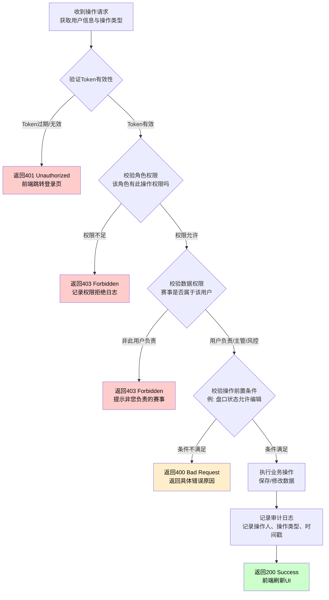
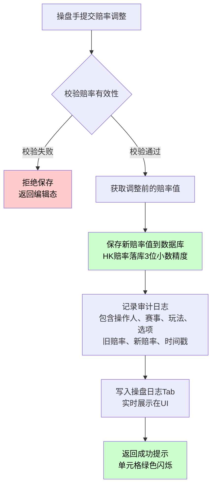

# 第十四章 操作流程与权限

## 14.0 与其他章节的关系说明

<pre class="font-ui border-border-100/50 overflow-x-scroll w-full rounded border-[0.5px] shadow-[0_2px_12px_hsl(var(--always-black)/5%)]"><table class="bg-bg-100 min-w-full border-separate border-spacing-0 text-sm leading-[1.88888] whitespace-normal"><thead class="text-left"><tr><th class="text-text-000 [&:not(:first-child)]:-x-[hsla(var(--border-100)/0.5)] px-2 [&:not(:first-child)]:border-l-[0.5px]">维度</th><th class="text-text-000 [&:not(:first-child)]:-x-[hsla(var(--border-100)/0.5)] px-2 [&:not(:first-child)]:border-l-[0.5px]">相关章节</th><th class="text-text-000 [&:not(:first-child)]:-x-[hsla(var(--border-100)/0.5)] px-2 [&:not(:first-child)]:border-l-[0.5px]">本章职责</th></tr></thead><tbody><tr><td class="border-t-border-100/50 [&:not(:first-child)]:-x-[hsla(var(--border-100)/0.5)] border-t-[0.5px] px-2 [&:not(:first-child)]:border-l-[0.5px]">角色与权限定义</td><td class="border-t-border-100/50 [&:not(:first-child)]:-x-[hsla(var(--border-100)/0.5)] border-t-[0.5px] px-2 [&:not(:first-child)]:border-l-[0.5px]"><strong>操盘列表第12章</strong>（规范定义）</td><td class="border-t-border-100/50 [&:not(:first-child)]:-x-[hsla(var(--border-100)/0.5)] border-t-[0.5px] px-2 [&:not(:first-child)]:border-l-[0.5px]">本章引用权限定义，不重复定义</td></tr><tr><td class="border-t-border-100/50 [&:not(:first-child)]:-x-[hsla(var(--border-100)/0.5)] border-t-[0.5px] px-2 [&:not(:first-child)]:border-l-[0.5px]">赔率编辑交互</td><td class="border-t-border-100/50 [&:not(:first-child)]:-x-[hsla(var(--border-100)/0.5)] border-t-[0.5px] px-2 [&:not(:first-child)]:border-l-[0.5px]">第7章赔率编辑与计算</td><td class="border-t-border-100/50 [&:not(:first-child)]:-x-[hsla(var(--border-100)/0.5)] border-t-[0.5px] px-2 [&:not(:first-child)]:border-l-[0.5px]">本章定义操作流程的入口、步骤、权限校验</td></tr><tr><td class="border-t-border-100/50 [&:not(:first-child)]:-x-[hsla(var(--border-100)/0.5)] border-t-[0.5px] px-2 [&:not(:first-child)]:border-l-[0.5px]">状态控制</td><td class="border-t-border-100/50 [&:not(:first-child)]:-x-[hsla(var(--border-100)/0.5)] border-t-[0.5px] px-2 [&:not(:first-child)]:border-l-[0.5px]">第8章控制层级体系</td><td class="border-t-border-100/50 [&:not(:first-child)]:-x-[hsla(var(--border-100)/0.5)] border-t-[0.5px] px-2 [&:not(:first-child)]:border-l-[0.5px]">本章定义状态操作的完整流程</td></tr><tr><td class="border-t-border-100/50 [&:not(:first-child)]:-x-[hsla(var(--border-100)/0.5)] border-t-[0.5px] px-2 [&:not(:first-child)]:border-l-[0.5px]">弹窗交互</td><td class="border-t-border-100/50 [&:not(:first-child)]:-x-[hsla(var(--border-100)/0.5)] border-t-[0.5px] px-2 [&:not(:first-child)]:border-l-[0.5px]">第13章弹窗与模态框</td><td class="border-t-border-100/50 [&:not(:first-child)]:-x-[hsla(var(--border-100)/0.5)] border-t-[0.5px] px-2 [&:not(:first-child)]:border-l-[0.5px]">本章定义弹窗触发的流程上下文</td></tr><tr><td class="border-t-border-100/50 [&:not(:first-child)]:-x-[hsla(var(--border-100)/0.5)] border-t-[0.5px] px-2 [&:not(:first-child)]:border-l-[0.5px]">审计日志</td><td class="border-t-border-100/50 [&:not(:first-child)]:-x-[hsla(var(--border-100)/0.5)] border-t-[0.5px] px-2 [&:not(:first-child)]:border-l-[0.5px]"><strong>操盘列表第12章12.6节</strong>（规范定义）</td><td class="border-t-border-100/50 [&:not(:first-child)]:-x-[hsla(var(--border-100)/0.5)] border-t-[0.5px] px-2 [&:not(:first-child)]:border-l-[0.5px]">本章定义操盘页特有的日志记录规则</td></tr></tbody></table></pre>

> **本章定位**：定义操盘详情页内所有操作的完整流程（从触发到落库），权限规则引用操盘列表第12章。

---

## 14.1 权限规则引用

### 14.1.1 角色定义（引用操盘列表第12章12.1节）

操盘页使用与操盘列表相同的三种角色，定义详见操盘列表第12章12.1节。

<pre class="font-ui border-border-100/50 overflow-x-scroll w-full rounded border-[0.5px] shadow-[0_2px_12px_hsl(var(--always-black)/5%)]"><table class="bg-bg-100 min-w-full border-separate border-spacing-0 text-sm leading-[1.88888] whitespace-normal"><thead class="text-left"><tr><th class="text-text-000 [&:not(:first-child)]:-x-[hsla(var(--border-100)/0.5)] px-2 [&:not(:first-child)]:border-l-[0.5px]">角色</th><th class="text-text-000 [&:not(:first-child)]:-x-[hsla(var(--border-100)/0.5)] px-2 [&:not(:first-child)]:border-l-[0.5px]">角色代码</th><th class="text-text-000 [&:not(:first-child)]:-x-[hsla(var(--border-100)/0.5)] px-2 [&:not(:first-child)]:border-l-[0.5px]">操盘页职责概述</th></tr></thead><tbody><tr><td class="border-t-border-100/50 [&:not(:first-child)]:-x-[hsla(var(--border-100)/0.5)] border-t-[0.5px] px-2 [&:not(:first-child)]:border-l-[0.5px]">普通操盘手</td><td class="border-t-border-100/50 [&:not(:first-child)]:-x-[hsla(var(--border-100)/0.5)] border-t-[0.5px] px-2 [&:not(:first-child)]:border-l-[0.5px]">TRADER</td><td class="border-t-border-100/50 [&:not(:first-child)]:-x-[hsla(var(--border-100)/0.5)] border-t-[0.5px] px-2 [&:not(:first-child)]:border-l-[0.5px]">负责自己赛事的赔率调整、盘口隐藏/取消隐藏</td></tr><tr><td class="border-t-border-100/50 [&:not(:first-child)]:-x-[hsla(var(--border-100)/0.5)] border-t-[0.5px] px-2 [&:not(:first-child)]:border-l-[0.5px]">主管</td><td class="border-t-border-100/50 [&:not(:first-child)]:-x-[hsla(var(--border-100)/0.5)] border-t-[0.5px] px-2 [&:not(:first-child)]:border-l-[0.5px]">SUPERVISOR</td><td class="border-t-border-100/50 [&:not(:first-child)]:-x-[hsla(var(--border-100)/0.5)] border-t-[0.5px] px-2 [&:not(:first-child)]:border-l-[0.5px]">可操作所有赛事，可执行锁盘/解锁</td></tr><tr><td class="border-t-border-100/50 [&:not(:first-child)]:-x-[hsla(var(--border-100)/0.5)] border-t-[0.5px] px-2 [&:not(:first-child)]:border-l-[0.5px]">风控</td><td class="border-t-border-100/50 [&:not(:first-child)]:-x-[hsla(var(--border-100)/0.5)] border-t-[0.5px] px-2 [&:not(:first-child)]:border-l-[0.5px]">RISK_CONTROL</td><td class="border-t-border-100/50 [&:not(:first-child)]:-x-[hsla(var(--border-100)/0.5)] border-t-[0.5px] px-2 [&:not(:first-child)]:border-l-[0.5px]">最高权限，可执行一键锁盘</td></tr></tbody></table></pre>

### 14.1.2 操盘页功能权限矩阵

> **与操盘列表第12章12.2.3节保持一致**：盘口操作（隐藏/取消隐藏/锁盘/解锁）统一在操盘详情页进行。

**赔率编辑权限**：

<pre class="font-ui border-border-100/50 overflow-x-scroll w-full rounded border-[0.5px] shadow-[0_2px_12px_hsl(var(--always-black)/5%)]"><table class="bg-bg-100 min-w-full border-separate border-spacing-0 text-sm leading-[1.88888] whitespace-normal"><thead class="text-left"><tr><th class="text-text-000 [&:not(:first-child)]:-x-[hsla(var(--border-100)/0.5)] px-2 [&:not(:first-child)]:border-l-[0.5px]">功能</th><th class="text-text-000 [&:not(:first-child)]:-x-[hsla(var(--border-100)/0.5)] px-2 [&:not(:first-child)]:border-l-[0.5px]">普通操盘手</th><th class="text-text-000 [&:not(:first-child)]:-x-[hsla(var(--border-100)/0.5)] px-2 [&:not(:first-child)]:border-l-[0.5px]">主管</th><th class="text-text-000 [&:not(:first-child)]:-x-[hsla(var(--border-100)/0.5)] px-2 [&:not(:first-child)]:border-l-[0.5px]">风控</th><th class="text-text-000 [&:not(:first-child)]:-x-[hsla(var(--border-100)/0.5)] px-2 [&:not(:first-child)]:border-l-[0.5px]">说明</th></tr></thead><tbody><tr><td class="border-t-border-100/50 [&:not(:first-child)]:-x-[hsla(var(--border-100)/0.5)] border-t-[0.5px] px-2 [&:not(:first-child)]:border-l-[0.5px]">编辑自己负责赛事的赔率</td><td class="border-t-border-100/50 [&:not(:first-child)]:-x-[hsla(var(--border-100)/0.5)] border-t-[0.5px] px-2 [&:not(:first-child)]:border-l-[0.5px]">✅</td><td class="border-t-border-100/50 [&:not(:first-child)]:-x-[hsla(var(--border-100)/0.5)] border-t-[0.5px] px-2 [&:not(:first-child)]:border-l-[0.5px]">✅</td><td class="border-t-border-100/50 [&:not(:first-child)]:-x-[hsla(var(--border-100)/0.5)] border-t-[0.5px] px-2 [&:not(:first-child)]:border-l-[0.5px]">✅</td><td class="border-t-border-100/50 [&:not(:first-child)]:-x-[hsla(var(--border-100)/0.5)] border-t-[0.5px] px-2 [&:not(:first-child)]:border-l-[0.5px]">双击单元格进入编辑</td></tr><tr><td class="border-t-border-100/50 [&:not(:first-child)]:-x-[hsla(var(--border-100)/0.5)] border-t-[0.5px] px-2 [&:not(:first-child)]:border-l-[0.5px]">编辑他人负责赛事的赔率</td><td class="border-t-border-100/50 [&:not(:first-child)]:-x-[hsla(var(--border-100)/0.5)] border-t-[0.5px] px-2 [&:not(:first-child)]:border-l-[0.5px]">❌</td><td class="border-t-border-100/50 [&:not(:first-child)]:-x-[hsla(var(--border-100)/0.5)] border-t-[0.5px] px-2 [&:not(:first-child)]:border-l-[0.5px]">✅</td><td class="border-t-border-100/50 [&:not(:first-child)]:-x-[hsla(var(--border-100)/0.5)] border-t-[0.5px] px-2 [&:not(:first-child)]:border-l-[0.5px]">✅</td><td class="border-t-border-100/50 [&:not(:first-child)]:-x-[hsla(var(--border-100)/0.5)] border-t-[0.5px] px-2 [&:not(:first-child)]:border-l-[0.5px]">仅主管和风控可操作</td></tr><tr><td class="border-t-border-100/50 [&:not(:first-child)]:-x-[hsla(var(--border-100)/0.5)] border-t-[0.5px] px-2 [&:not(:first-child)]:border-l-[0.5px]">批量调整赔率（同玩法内）</td><td class="border-t-border-100/50 [&:not(:first-child)]:-x-[hsla(var(--border-100)/0.5)] border-t-[0.5px] px-2 [&:not(:first-child)]:border-l-[0.5px]">✅</td><td class="border-t-border-100/50 [&:not(:first-child)]:-x-[hsla(var(--border-100)/0.5)] border-t-[0.5px] px-2 [&:not(:first-child)]:border-l-[0.5px]">✅</td><td class="border-t-border-100/50 [&:not(:first-child)]:-x-[hsla(var(--border-100)/0.5)] border-t-[0.5px] px-2 [&:not(:first-child)]:border-l-[0.5px]">✅</td><td class="border-t-border-100/50 [&:not(:first-child)]:-x-[hsla(var(--border-100)/0.5)] border-t-[0.5px] px-2 [&:not(:first-child)]:border-l-[0.5px]">仅限自己负责的赛事</td></tr><tr><td class="border-t-border-100/50 [&:not(:first-child)]:-x-[hsla(var(--border-100)/0.5)] border-t-[0.5px] px-2 [&:not(:first-child)]:border-l-[0.5px]">调整偏离IM超过告警阈值</td><td class="border-t-border-100/50 [&:not(:first-child)]:-x-[hsla(var(--border-100)/0.5)] border-t-[0.5px] px-2 [&:not(:first-child)]:border-l-[0.5px]">⚠️ 需确认</td><td class="border-t-border-100/50 [&:not(:first-child)]:-x-[hsla(var(--border-100)/0.5)] border-t-[0.5px] px-2 [&:not(:first-child)]:border-l-[0.5px]">⚠️ 需确认</td><td class="border-t-border-100/50 [&:not(:first-child)]:-x-[hsla(var(--border-100)/0.5)] border-t-[0.5px] px-2 [&:not(:first-child)]:border-l-[0.5px]">✅</td><td class="border-t-border-100/50 [&:not(:first-child)]:-x-[hsla(var(--border-100)/0.5)] border-t-[0.5px] px-2 [&:not(:first-child)]:border-l-[0.5px]">触发偏离确认弹窗</td></tr></tbody></table></pre>

**盘口状态操作权限**（与操盘列表第12章12.2.3节一致）：

<pre class="font-ui border-border-100/50 overflow-x-scroll w-full rounded border-[0.5px] shadow-[0_2px_12px_hsl(var(--always-black)/5%)]"><table class="bg-bg-100 min-w-full border-separate border-spacing-0 text-sm leading-[1.88888] whitespace-normal"><thead class="text-left"><tr><th class="text-text-000 [&:not(:first-child)]:-x-[hsla(var(--border-100)/0.5)] px-2 [&:not(:first-child)]:border-l-[0.5px]">功能</th><th class="text-text-000 [&:not(:first-child)]:-x-[hsla(var(--border-100)/0.5)] px-2 [&:not(:first-child)]:border-l-[0.5px]">普通操盘手</th><th class="text-text-000 [&:not(:first-child)]:-x-[hsla(var(--border-100)/0.5)] px-2 [&:not(:first-child)]:border-l-[0.5px]">主管</th><th class="text-text-000 [&:not(:first-child)]:-x-[hsla(var(--border-100)/0.5)] px-2 [&:not(:first-child)]:border-l-[0.5px]">风控</th><th class="text-text-000 [&:not(:first-child)]:-x-[hsla(var(--border-100)/0.5)] px-2 [&:not(:first-child)]:border-l-[0.5px]">操作层级</th></tr></thead><tbody><tr><td class="border-t-border-100/50 [&:not(:first-child)]:-x-[hsla(var(--border-100)/0.5)] border-t-[0.5px] px-2 [&:not(:first-child)]:border-l-[0.5px]">隐藏盘口（自己的）</td><td class="border-t-border-100/50 [&:not(:first-child)]:-x-[hsla(var(--border-100)/0.5)] border-t-[0.5px] px-2 [&:not(:first-child)]:border-l-[0.5px]">✅</td><td class="border-t-border-100/50 [&:not(:first-child)]:-x-[hsla(var(--border-100)/0.5)] border-t-[0.5px] px-2 [&:not(:first-child)]:border-l-[0.5px]">✅</td><td class="border-t-border-100/50 [&:not(:first-child)]:-x-[hsla(var(--border-100)/0.5)] border-t-[0.5px] px-2 [&:not(:first-child)]:border-l-[0.5px]">✅</td><td class="border-t-border-100/50 [&:not(:first-child)]:-x-[hsla(var(--border-100)/0.5)] border-t-[0.5px] px-2 [&:not(:first-child)]:border-l-[0.5px]">玩法级/盘口线级/选项级</td></tr><tr><td class="border-t-border-100/50 [&:not(:first-child)]:-x-[hsla(var(--border-100)/0.5)] border-t-[0.5px] px-2 [&:not(:first-child)]:border-l-[0.5px]">隐藏盘口（他人的）</td><td class="border-t-border-100/50 [&:not(:first-child)]:-x-[hsla(var(--border-100)/0.5)] border-t-[0.5px] px-2 [&:not(:first-child)]:border-l-[0.5px]">❌</td><td class="border-t-border-100/50 [&:not(:first-child)]:-x-[hsla(var(--border-100)/0.5)] border-t-[0.5px] px-2 [&:not(:first-child)]:border-l-[0.5px]">✅</td><td class="border-t-border-100/50 [&:not(:first-child)]:-x-[hsla(var(--border-100)/0.5)] border-t-[0.5px] px-2 [&:not(:first-child)]:border-l-[0.5px]">✅</td><td class="border-t-border-100/50 [&:not(:first-child)]:-x-[hsla(var(--border-100)/0.5)] border-t-[0.5px] px-2 [&:not(:first-child)]:border-l-[0.5px]">玩法级/盘口线级/选项级</td></tr><tr><td class="border-t-border-100/50 [&:not(:first-child)]:-x-[hsla(var(--border-100)/0.5)] border-t-[0.5px] px-2 [&:not(:first-child)]:border-l-[0.5px]">取消隐藏盘口（自己的）</td><td class="border-t-border-100/50 [&:not(:first-child)]:-x-[hsla(var(--border-100)/0.5)] border-t-[0.5px] px-2 [&:not(:first-child)]:border-l-[0.5px]">✅</td><td class="border-t-border-100/50 [&:not(:first-child)]:-x-[hsla(var(--border-100)/0.5)] border-t-[0.5px] px-2 [&:not(:first-child)]:border-l-[0.5px]">✅</td><td class="border-t-border-100/50 [&:not(:first-child)]:-x-[hsla(var(--border-100)/0.5)] border-t-[0.5px] px-2 [&:not(:first-child)]:border-l-[0.5px]">✅</td><td class="border-t-border-100/50 [&:not(:first-child)]:-x-[hsla(var(--border-100)/0.5)] border-t-[0.5px] px-2 [&:not(:first-child)]:border-l-[0.5px]">玩法级/盘口线级/选项级</td></tr><tr><td class="border-t-border-100/50 [&:not(:first-child)]:-x-[hsla(var(--border-100)/0.5)] border-t-[0.5px] px-2 [&:not(:first-child)]:border-l-[0.5px]">取消隐藏盘口（他人的）</td><td class="border-t-border-100/50 [&:not(:first-child)]:-x-[hsla(var(--border-100)/0.5)] border-t-[0.5px] px-2 [&:not(:first-child)]:border-l-[0.5px]">❌</td><td class="border-t-border-100/50 [&:not(:first-child)]:-x-[hsla(var(--border-100)/0.5)] border-t-[0.5px] px-2 [&:not(:first-child)]:border-l-[0.5px]">✅</td><td class="border-t-border-100/50 [&:not(:first-child)]:-x-[hsla(var(--border-100)/0.5)] border-t-[0.5px] px-2 [&:not(:first-child)]:border-l-[0.5px]">✅</td><td class="border-t-border-100/50 [&:not(:first-child)]:-x-[hsla(var(--border-100)/0.5)] border-t-[0.5px] px-2 [&:not(:first-child)]:border-l-[0.5px]">玩法级/盘口线级/选项级</td></tr><tr><td class="border-t-border-100/50 [&:not(:first-child)]:-x-[hsla(var(--border-100)/0.5)] border-t-[0.5px] px-2 [&:not(:first-child)]:border-l-[0.5px]">锁定盘口</td><td class="border-t-border-100/50 [&:not(:first-child)]:-x-[hsla(var(--border-100)/0.5)] border-t-[0.5px] px-2 [&:not(:first-child)]:border-l-[0.5px]">❌</td><td class="border-t-border-100/50 [&:not(:first-child)]:-x-[hsla(var(--border-100)/0.5)] border-t-[0.5px] px-2 [&:not(:first-child)]:border-l-[0.5px]">✅</td><td class="border-t-border-100/50 [&:not(:first-child)]:-x-[hsla(var(--border-100)/0.5)] border-t-[0.5px] px-2 [&:not(:first-child)]:border-l-[0.5px]">✅</td><td class="border-t-border-100/50 [&:not(:first-child)]:-x-[hsla(var(--border-100)/0.5)] border-t-[0.5px] px-2 [&:not(:first-child)]:border-l-[0.5px]">玩法级/盘口线级/选项级</td></tr><tr><td class="border-t-border-100/50 [&:not(:first-child)]:-x-[hsla(var(--border-100)/0.5)] border-t-[0.5px] px-2 [&:not(:first-child)]:border-l-[0.5px]">解锁盘口</td><td class="border-t-border-100/50 [&:not(:first-child)]:-x-[hsla(var(--border-100)/0.5)] border-t-[0.5px] px-2 [&:not(:first-child)]:border-l-[0.5px]">❌</td><td class="border-t-border-100/50 [&:not(:first-child)]:-x-[hsla(var(--border-100)/0.5)] border-t-[0.5px] px-2 [&:not(:first-child)]:border-l-[0.5px]">✅</td><td class="border-t-border-100/50 [&:not(:first-child)]:-x-[hsla(var(--border-100)/0.5)] border-t-[0.5px] px-2 [&:not(:first-child)]:border-l-[0.5px]">✅</td><td class="border-t-border-100/50 [&:not(:first-child)]:-x-[hsla(var(--border-100)/0.5)] border-t-[0.5px] px-2 [&:not(:first-child)]:border-l-[0.5px]">玩法级/盘口线级/选项级</td></tr><tr><td class="border-t-border-100/50 [&:not(:first-child)]:-x-[hsla(var(--border-100)/0.5)] border-t-[0.5px] px-2 [&:not(:first-child)]:border-l-[0.5px]">一键锁盘</td><td class="border-t-border-100/50 [&:not(:first-child)]:-x-[hsla(var(--border-100)/0.5)] border-t-[0.5px] px-2 [&:not(:first-child)]:border-l-[0.5px]">❌</td><td class="border-t-border-100/50 [&:not(:first-child)]:-x-[hsla(var(--border-100)/0.5)] border-t-[0.5px] px-2 [&:not(:first-child)]:border-l-[0.5px]">✅</td><td class="border-t-border-100/50 [&:not(:first-child)]:-x-[hsla(var(--border-100)/0.5)] border-t-[0.5px] px-2 [&:not(:first-child)]:border-l-[0.5px]">✅</td><td class="border-t-border-100/50 [&:not(:first-child)]:-x-[hsla(var(--border-100)/0.5)] border-t-[0.5px] px-2 [&:not(:first-child)]:border-l-[0.5px]">赛事级</td></tr></tbody></table></pre>

**数据源开关控制权限**：

<pre class="font-ui border-border-100/50 overflow-x-scroll w-full rounded border-[0.5px] shadow-[0_2px_12px_hsl(var(--always-black)/5%)]"><table class="bg-bg-100 min-w-full border-separate border-spacing-0 text-sm leading-[1.88888] whitespace-normal"><thead class="text-left"><tr><th class="text-text-000 [&:not(:first-child)]:-x-[hsla(var(--border-100)/0.5)] px-2 [&:not(:first-child)]:border-l-[0.5px]">功能</th><th class="text-text-000 [&:not(:first-child)]:-x-[hsla(var(--border-100)/0.5)] px-2 [&:not(:first-child)]:border-l-[0.5px]">普通操盘手</th><th class="text-text-000 [&:not(:first-child)]:-x-[hsla(var(--border-100)/0.5)] px-2 [&:not(:first-child)]:border-l-[0.5px]">主管</th><th class="text-text-000 [&:not(:first-child)]:-x-[hsla(var(--border-100)/0.5)] px-2 [&:not(:first-child)]:border-l-[0.5px]">风控</th><th class="text-text-000 [&:not(:first-child)]:-x-[hsla(var(--border-100)/0.5)] px-2 [&:not(:first-child)]:border-l-[0.5px]">说明</th></tr></thead><tbody><tr><td class="border-t-border-100/50 [&:not(:first-child)]:-x-[hsla(var(--border-100)/0.5)] border-t-[0.5px] px-2 [&:not(:first-child)]:border-l-[0.5px]">开启/关盘数据源开关（自己的）</td><td class="border-t-border-100/50 [&:not(:first-child)]:-x-[hsla(var(--border-100)/0.5)] border-t-[0.5px] px-2 [&:not(:first-child)]:border-l-[0.5px]">✅</td><td class="border-t-border-100/50 [&:not(:first-child)]:-x-[hsla(var(--border-100)/0.5)] border-t-[0.5px] px-2 [&:not(:first-child)]:border-l-[0.5px]">✅</td><td class="border-t-border-100/50 [&:not(:first-child)]:-x-[hsla(var(--border-100)/0.5)] border-t-[0.5px] px-2 [&:not(:first-child)]:border-l-[0.5px]">✅</td><td class="border-t-border-100/50 [&:not(:first-child)]:-x-[hsla(var(--border-100)/0.5)] border-t-[0.5px] px-2 [&:not(:first-child)]:border-l-[0.5px]">赛事级/玩法级</td></tr><tr><td class="border-t-border-100/50 [&:not(:first-child)]:-x-[hsla(var(--border-100)/0.5)] border-t-[0.5px] px-2 [&:not(:first-child)]:border-l-[0.5px]">开启/关盘数据源开关（他人的）</td><td class="border-t-border-100/50 [&:not(:first-child)]:-x-[hsla(var(--border-100)/0.5)] border-t-[0.5px] px-2 [&:not(:first-child)]:border-l-[0.5px]">❌</td><td class="border-t-border-100/50 [&:not(:first-child)]:-x-[hsla(var(--border-100)/0.5)] border-t-[0.5px] px-2 [&:not(:first-child)]:border-l-[0.5px]">✅</td><td class="border-t-border-100/50 [&:not(:first-child)]:-x-[hsla(var(--border-100)/0.5)] border-t-[0.5px] px-2 [&:not(:first-child)]:border-l-[0.5px]">✅</td><td class="border-t-border-100/50 [&:not(:first-child)]:-x-[hsla(var(--border-100)/0.5)] border-t-[0.5px] px-2 [&:not(:first-child)]:border-l-[0.5px]">仅主管和风控</td></tr></tbody></table></pre>

**其他操作权限**：

<pre class="font-ui border-border-100/50 overflow-x-scroll w-full rounded border-[0.5px] shadow-[0_2px_12px_hsl(var(--always-black)/5%)]"><table class="bg-bg-100 min-w-full border-separate border-spacing-0 text-sm leading-[1.88888] whitespace-normal"><thead class="text-left"><tr><th class="text-text-000 [&:not(:first-child)]:-x-[hsla(var(--border-100)/0.5)] px-2 [&:not(:first-child)]:border-l-[0.5px]">功能</th><th class="text-text-000 [&:not(:first-child)]:-x-[hsla(var(--border-100)/0.5)] px-2 [&:not(:first-child)]:border-l-[0.5px]">普通操盘手</th><th class="text-text-000 [&:not(:first-child)]:-x-[hsla(var(--border-100)/0.5)] px-2 [&:not(:first-child)]:border-l-[0.5px]">主管</th><th class="text-text-000 [&:not(:first-child)]:-x-[hsla(var(--border-100)/0.5)] px-2 [&:not(:first-child)]:border-l-[0.5px]">风控</th><th class="text-text-000 [&:not(:first-child)]:-x-[hsla(var(--border-100)/0.5)] px-2 [&:not(:first-child)]:border-l-[0.5px]">说明</th></tr></thead><tbody><tr><td class="border-t-border-100/50 [&:not(:first-child)]:-x-[hsla(var(--border-100)/0.5)] border-t-[0.5px] px-2 [&:not(:first-child)]:border-l-[0.5px]">盘口线显示/隐藏</td><td class="border-t-border-100/50 [&:not(:first-child)]:-x-[hsla(var(--border-100)/0.5)] border-t-[0.5px] px-2 [&:not(:first-child)]:border-l-[0.5px]">✅</td><td class="border-t-border-100/50 [&:not(:first-child)]:-x-[hsla(var(--border-100)/0.5)] border-t-[0.5px] px-2 [&:not(:first-child)]:border-l-[0.5px]">✅</td><td class="border-t-border-100/50 [&:not(:first-child)]:-x-[hsla(var(--border-100)/0.5)] border-t-[0.5px] px-2 [&:not(:first-child)]:border-l-[0.5px]">✅</td><td class="border-t-border-100/50 [&:not(:first-child)]:-x-[hsla(var(--border-100)/0.5)] border-t-[0.5px] px-2 [&:not(:first-child)]:border-l-[0.5px]">仅限自己负责的赛事</td></tr><tr><td class="border-t-border-100/50 [&:not(:first-child)]:-x-[hsla(var(--border-100)/0.5)] border-t-[0.5px] px-2 [&:not(:first-child)]:border-l-[0.5px]">查看操盘日志</td><td class="border-t-border-100/50 [&:not(:first-child)]:-x-[hsla(var(--border-100)/0.5)] border-t-[0.5px] px-2 [&:not(:first-child)]:border-l-[0.5px]">✅</td><td class="border-t-border-100/50 [&:not(:first-child)]:-x-[hsla(var(--border-100)/0.5)] border-t-[0.5px] px-2 [&:not(:first-child)]:border-l-[0.5px]">✅</td><td class="border-t-border-100/50 [&:not(:first-child)]:-x-[hsla(var(--border-100)/0.5)] border-t-[0.5px] px-2 [&:not(:first-child)]:border-l-[0.5px]">✅</td><td class="border-t-border-100/50 [&:not(:first-child)]:-x-[hsla(var(--border-100)/0.5)] border-t-[0.5px] px-2 [&:not(:first-child)]:border-l-[0.5px]">全部角色可查看</td></tr><tr><td class="border-t-border-100/50 [&:not(:first-child)]:-x-[hsla(var(--border-100)/0.5)] border-t-[0.5px] px-2 [&:not(:first-child)]:border-l-[0.5px]">导出操盘日志</td><td class="border-t-border-100/50 [&:not(:first-child)]:-x-[hsla(var(--border-100)/0.5)] border-t-[0.5px] px-2 [&:not(:first-child)]:border-l-[0.5px]">❌</td><td class="border-t-border-100/50 [&:not(:first-child)]:-x-[hsla(var(--border-100)/0.5)] border-t-[0.5px] px-2 [&:not(:first-child)]:border-l-[0.5px]">✅</td><td class="border-t-border-100/50 [&:not(:first-child)]:-x-[hsla(var(--border-100)/0.5)] border-t-[0.5px] px-2 [&:not(:first-child)]:border-l-[0.5px]">✅</td><td class="border-t-border-100/50 [&:not(:first-child)]:-x-[hsla(var(--border-100)/0.5)] border-t-[0.5px] px-2 [&:not(:first-child)]:border-l-[0.5px]">与操盘列表第12章12.6.1节一致</td></tr></tbody></table></pre>

### 14.1.2.1 权限变更生效时机（写死）

**实时生效规则**（默认值为实时生效，系统级写死，修改需发版）：

| 规则项 | 规则内容 | 生效时机 | 验证方式 |
|--------|---------|---------|--------|
| 权限变更 | 权限变更后实时生效 | 立即 | 权限变更操作提交后，系统立即更新内存中的权限状态 |
| 已打开页面 | 已打开的操盘页无需刷新页面 | 下次操作时校验 | 用户在当前页面执行任何操作（如双击编辑赔率）时，系统重新校验当前权限，若权限已变更则拒绝操作或显示提示 |
| 权限校验位置 | 权限校验发生在操作执行时 | 实时 | 编辑赔率、锁盘/解锁等操作触发时，系统调用权限检查接口验证当前用户权限 |
| 降级保护 | 若用户权限被降级，已进行但未提交的编辑操作需要重新校验 | 提交时 | 用户编辑赔率后，若权限已变更，提交时校验失败，提示「权限已变更，请刷新页面重新操作」 |

**示例流程**：

```
时刻T1：操盘手张三有「赔率编辑」权限
   └─> 打开操盘页面，中间栏显示所有赔率编辑入口可用

时刻T2：管理员修改张三权限为「仅查看」
   └─> 系统立即更新权限，但不主动通知张三

时刻T3：张三继续在已打开的页面上操作（未刷新）
   └─> 张三双击赔率单元格准备编辑
   └─> 系统在提交编辑（按Enter）时校验权限
   └─> 权限校验失败（当前权限=仅查看）
   └─> 拒绝保存，提示「您的权限已被变更，无法编辑赔率，请刷新页面」

时刻T4：张三刷新页面
   └─> 页面重新加载，赔率编辑入口全部禁用
   └─> 张三现在只能查看，无法操作
```

### 14.1.3 详情页访问权限（与操盘列表第12章12.2.5节一致）

<pre class="font-ui border-border-100/50 overflow-x-scroll w-full rounded border-[0.5px] shadow-[0_2px_12px_hsl(var(--always-black)/5%)]"><table class="bg-bg-100 min-w-full border-separate border-spacing-0 text-sm leading-[1.88888] whitespace-normal"><thead class="text-left"><tr><th class="text-text-000 [&:not(:first-child)]:-x-[hsla(var(--border-100)/0.5)] px-2 [&:not(:first-child)]:border-l-[0.5px]">场景</th><th class="text-text-000 [&:not(:first-child)]:-x-[hsla(var(--border-100)/0.5)] px-2 [&:not(:first-child)]:border-l-[0.5px]">普通操盘手</th><th class="text-text-000 [&:not(:first-child)]:-x-[hsla(var(--border-100)/0.5)] px-2 [&:not(:first-child)]:border-l-[0.5px]">主管</th><th class="text-text-000 [&:not(:first-child)]:-x-[hsla(var(--border-100)/0.5)] px-2 [&:not(:first-child)]:border-l-[0.5px]">风控</th><th class="text-text-000 [&:not(:first-child)]:-x-[hsla(var(--border-100)/0.5)] px-2 [&:not(:first-child)]:border-l-[0.5px]">页面状态</th></tr></thead><tbody><tr><td class="border-t-border-100/50 [&:not(:first-child)]:-x-[hsla(var(--border-100)/0.5)] border-t-[0.5px] px-2 [&:not(:first-child)]:border-l-[0.5px]">进入自己负责的赛事</td><td class="border-t-border-100/50 [&:not(:first-child)]:-x-[hsla(var(--border-100)/0.5)] border-t-[0.5px] px-2 [&:not(:first-child)]:border-l-[0.5px]">✅</td><td class="border-t-border-100/50 [&:not(:first-child)]:-x-[hsla(var(--border-100)/0.5)] border-t-[0.5px] px-2 [&:not(:first-child)]:border-l-[0.5px]">✅</td><td class="border-t-border-100/50 [&:not(:first-child)]:-x-[hsla(var(--border-100)/0.5)] border-t-[0.5px] px-2 [&:not(:first-child)]:border-l-[0.5px]">✅</td><td class="border-t-border-100/50 [&:not(:first-child)]:-x-[hsla(var(--border-100)/0.5)] border-t-[0.5px] px-2 [&:not(:first-child)]:border-l-[0.5px]">可操作</td></tr><tr><td class="border-t-border-100/50 [&:not(:first-child)]:-x-[hsla(var(--border-100)/0.5)] border-t-[0.5px] px-2 [&:not(:first-child)]:border-l-[0.5px]">进入未分配的赛事</td><td class="border-t-border-100/50 [&:not(:first-child)]:-x-[hsla(var(--border-100)/0.5)] border-t-[0.5px] px-2 [&:not(:first-child)]:border-l-[0.5px]">✅</td><td class="border-t-border-100/50 [&:not(:first-child)]:-x-[hsla(var(--border-100)/0.5)] border-t-[0.5px] px-2 [&:not(:first-child)]:border-l-[0.5px]">✅</td><td class="border-t-border-100/50 [&:not(:first-child)]:-x-[hsla(var(--border-100)/0.5)] border-t-[0.5px] px-2 [&:not(:first-child)]:border-l-[0.5px]">✅</td><td class="border-t-border-100/50 [&:not(:first-child)]:-x-[hsla(var(--border-100)/0.5)] border-t-[0.5px] px-2 [&:not(:first-child)]:border-l-[0.5px]"><strong>只读模式</strong></td></tr><tr><td class="border-t-border-100/50 [&:not(:first-child)]:-x-[hsla(var(--border-100)/0.5)] border-t-[0.5px] px-2 [&:not(:first-child)]:border-l-[0.5px]">进入他人负责的赛事</td><td class="border-t-border-100/50 [&:not(:first-child)]:-x-[hsla(var(--border-100)/0.5)] border-t-[0.5px] px-2 [&:not(:first-child)]:border-l-[0.5px]">❌</td><td class="border-t-border-100/50 [&:not(:first-child)]:-x-[hsla(var(--border-100)/0.5)] border-t-[0.5px] px-2 [&:not(:first-child)]:border-l-[0.5px]">✅</td><td class="border-t-border-100/50 [&:not(:first-child)]:-x-[hsla(var(--border-100)/0.5)] border-t-[0.5px] px-2 [&:not(:first-child)]:border-l-[0.5px]">✅</td><td class="border-t-border-100/50 [&:not(:first-child)]:-x-[hsla(var(--border-100)/0.5)] border-t-[0.5px] px-2 [&:not(:first-child)]:border-l-[0.5px]">主管/风控可操作</td></tr></tbody></table></pre>

> **只读模式说明**：普通操盘手访问未分配赛事时，页面可见但所有操作按钮禁用，顶部显示「只读模式」标签。

> **「自己负责赛事」判定条件**：
>
> 系统通过以下条件判定赛事是否为当前用户负责：
>
> | 判定条件 | 技术实现 | 说明 |
> |----------|----------|------|
> | 当前登录用户ID = 赛事操盘手ID | `CurrentUserId == Event.TraderId` | 赛事的 `TraderId` 字段记录负责操盘手 |
>
> 该判定适用于本章所有「自己负责」「他人负责」的权限区分场景。

---

## 14.2 赔率调整操作

### 14.2.1 操作入口

<pre class="font-ui border-border-100/50 overflow-x-scroll w-full rounded border-[0.5px] shadow-[0_2px_12px_hsl(var(--always-black)/5%)]"><table class="bg-bg-100 min-w-full border-separate border-spacing-0 text-sm leading-[1.88888] whitespace-normal"><thead class="text-left"><tr><th class="text-text-000 [&:not(:first-child)]:-x-[hsla(var(--border-100)/0.5)] px-2 [&:not(:first-child)]:border-l-[0.5px]">入口位置</th><th class="text-text-000 [&:not(:first-child)]:-x-[hsla(var(--border-100)/0.5)] px-2 [&:not(:first-child)]:border-l-[0.5px]">操作方式</th><th class="text-text-000 [&:not(:first-child)]:-x-[hsla(var(--border-100)/0.5)] px-2 [&:not(:first-child)]:border-l-[0.5px]">适用场景</th></tr></thead><tbody><tr><td class="border-t-border-100/50 [&:not(:first-child)]:-x-[hsla(var(--border-100)/0.5)] border-t-[0.5px] px-2 [&:not(:first-child)]:border-l-[0.5px]">盘口卡片赔率单元格</td><td class="border-t-border-100/50 [&:not(:first-child)]:-x-[hsla(var(--border-100)/0.5)] border-t-[0.5px] px-2 [&:not(:first-child)]:border-l-[0.5px]">双击进入编辑态</td><td class="border-t-border-100/50 [&:not(:first-child)]:-x-[hsla(var(--border-100)/0.5)] border-t-[0.5px] px-2 [&:not(:first-child)]:border-l-[0.5px]">单选项赔率调整</td></tr><tr><td class="border-t-border-100/50 [&:not(:first-child)]:-x-[hsla(var(--border-100)/0.5)] border-t-[0.5px] px-2 [&:not(:first-child)]:border-l-[0.5px]">盘口卡片工具栏</td><td class="border-t-border-100/50 [&:not(:first-child)]:-x-[hsla(var(--border-100)/0.5)] border-t-[0.5px] px-2 [&:not(:first-child)]:border-l-[0.5px]">点击「批量调整」按钮</td><td class="border-t-border-100/50 [&:not(:first-child)]:-x-[hsla(var(--border-100)/0.5)] border-t-[0.5px] px-2 [&:not(:first-child)]:border-l-[0.5px]">同玩法内批量调整</td></tr><tr><td class="border-t-border-100/50 [&:not(:first-child)]:-x-[hsla(var(--border-100)/0.5)] border-t-[0.5px] px-2 [&:not(:first-child)]:border-l-[0.5px]">快捷键</td><td class="border-t-border-100/50 [&:not(:first-child)]:-x-[hsla(var(--border-100)/0.5)] border-t-[0.5px] px-2 [&:not(:first-child)]:border-l-[0.5px]">F2（选中单元格时）</td><td class="border-t-border-100/50 [&:not(:first-child)]:-x-[hsla(var(--border-100)/0.5)] border-t-[0.5px] px-2 [&:not(:first-child)]:border-l-[0.5px]">快速进入编辑态</td></tr></tbody></table></pre>

### 14.2.1A 状态前置条件校验（写死）

赔率编辑操作执行前，必须先校验当前层级的状态。若任何层级不满足条件，则禁用编辑入口并显示对应提示。规则如下：

| 检查层级 | 状态 | 允许编辑赔率 | 用户提示文案 |
|---------|------|------------|------------|
| 赛事 | 开盘 | 是 | 无 |
| 赛事 | 隐藏 | 否 | 「赛事已隐藏，无法编辑赔率」 |
| 赛事 | 锁定 | 否 | 「赛事已锁定，无法编辑赔率」 |
| 赛事 | 关盘 | 否 | 「赛事已关盘，无法编辑赔率」 |
| 玩法 | 开盘 | 是 | 无 |
| 玩法 | 隐藏 | 否 | 「该玩法已隐藏，无法编辑赔率」 |
| 玩法 | 锁定 | 否 | 「该玩法已锁定，无法编辑赔率」 |
| 盘口线（仅MultiLineTable） | 开盘 | 是 | 无 |
| 盘口线（仅MultiLineTable） | 隐藏 | 否 | 「该盘口线已隐藏，无法编辑赔率」 |
| 盘口线（仅MultiLineTable） | 锁定 | 否 | 「该盘口线已锁定，无法编辑赔率」 |
| 选项 | 开盘 | 是 | 无 |
| 选项 | 隐藏 | 否 | 「该选项已隐藏，无法编辑赔率」 |
| 选项 | 锁定 | 否 | 「该选项已锁定，无法编辑赔率」 |

**继承规则**（写死）：上层状态是下层上限。若赛事或玩法为隐藏/锁定/关盘，则其下所有子级赔率编辑入口自动禁用，无需逐级判断。

**校验顺序**：赛事 → 玩法 → 盘口线（若有） → 选项，任一层级不满足则拒绝，不继续向下检查。

**实现表现**：

| 状态不满足 | 界面表现 | 交互反馈 |
|----------|--------|--------|
| 赛事或玩法层级 | 该玩法下所有赔率单元格禁用（灰显），不可双击 | 鼠标悬停显示Tooltip「该玩法已隐藏，无法编辑赔率」 |
| 盘口线或选项层级 | 该行/单元格禁用（灰显），不可双击 | 鼠标悬停显示Tooltip「该盘口线已隐藏，无法编辑赔率」 |
| 赔率单元格禁用时 | F2快捷键无效，点击不进入编辑态 | 显示提示Tooltip |

**与第13章的衔接**：本节状态前置校验在编辑入口处执行，防止用户进入编辑态。第13章的赔率调整校验弹窗（13.8）仅处理编辑完成后的赔率值域问题（RTP、HK范围、配对边界），不重复检查状态。

### 14.2.2 单选项赔率调整流程

<pre class="font-ui border-border-100/50 overflow-x-scroll w-full rounded border-[0.5px] shadow-[0_2px_12px_hsl(var(--always-black)/5%)]"><table class="bg-bg-100 min-w-full border-separate border-spacing-0 text-sm leading-[1.88888] whitespace-normal"><thead class="text-left"><tr><th class="text-text-000 [&:not(:first-child)]:-x-[hsla(var(--border-100)/0.5)] px-2 [&:not(:first-child)]:border-l-[0.5px]">步骤</th><th class="text-text-000 [&:not(:first-child)]:-x-[hsla(var(--border-100)/0.5)] px-2 [&:not(:first-child)]:border-l-[0.5px]">用户操作</th><th class="text-text-000 [&:not(:first-child)]:-x-[hsla(var(--border-100)/0.5)] px-2 [&:not(:first-child)]:border-l-[0.5px]">系统响应</th></tr></thead><tbody><tr><td class="border-t-border-100/50 [&:not(:first-child)]:-x-[hsla(var(--border-100)/0.5)] border-t-[0.5px] px-2 [&:not(:first-child)]:border-l-[0.5px]">1</td><td class="border-t-border-100/50 [&:not(:first-child)]:-x-[hsla(var(--border-100)/0.5)] border-t-[0.5px] px-2 [&:not(:first-child)]:border-l-[0.5px]">双击赔率单元格</td><td class="border-t-border-100/50 [&:not(:first-child)]:-x-[hsla(var(--border-100)/0.5)] border-t-[0.5px] px-2 [&:not(:first-child)]:border-l-[0.5px]">单元格进入编辑态，显示输入框，原值选中</td></tr><tr><td class="border-t-border-100/50 [&:not(:first-child)]:-x-[hsla(var(--border-100)/0.5)] border-t-[0.5px] px-2 [&:not(:first-child)]:border-l-[0.5px]">2</td><td class="border-t-border-100/50 [&:not(:first-child)]:-x-[hsla(var(--border-100)/0.5)] border-t-[0.5px] px-2 [&:not(:first-child)]:border-l-[0.5px]">输入新HK赔率值</td><td class="border-t-border-100/50 [&:not(:first-child)]:-x-[hsla(var(--border-100)/0.5)] border-t-[0.5px] px-2 [&:not(:first-child)]:border-l-[0.5px]">实时显示配对计算结果（若为配对玩法）</td></tr><tr><td class="border-t-border-100/50 [&:not(:first-child)]:-x-[hsla(var(--border-100)/0.5)] border-t-[0.5px] px-2 [&:not(:first-child)]:border-l-[0.5px]">3</td><td class="border-t-border-100/50 [&:not(:first-child)]:-x-[hsla(var(--border-100)/0.5)] border-t-[0.5px] px-2 [&:not(:first-child)]:border-l-[0.5px]">按Enter或点击外部</td><td class="border-t-border-100/50 [&:not(:first-child)]:-x-[hsla(var(--border-100)/0.5)] border-t-[0.5px] px-2 [&:not(:first-child)]:border-l-[0.5px]">触发校验流程</td></tr><tr><td class="border-t-border-100/50 [&:not(:first-child)]:-x-[hsla(var(--border-100)/0.5)] border-t-[0.5px] px-2 [&:not(:first-child)]:border-l-[0.5px]">4</td><td class="border-t-border-100/50 [&:not(:first-child)]:-x-[hsla(var(--border-100)/0.5)] border-t-[0.5px] px-2 [&:not(:first-child)]:border-l-[0.5px]">校验通过</td><td class="border-t-border-100/50 [&:not(:first-child)]:-x-[hsla(var(--border-100)/0.5)] border-t-[0.5px] px-2 [&:not(:first-child)]:border-l-[0.5px]">保存成功，单元格绿色闪烁0.5秒</td></tr><tr><td class="border-t-border-100/50 [&:not(:first-child)]:-x-[hsla(var(--border-100)/0.5)] border-t-[0.5px] px-2 [&:not(:first-child)]:border-l-[0.5px]">4'</td><td class="border-t-border-100/50 [&:not(:first-child)]:-x-[hsla(var(--border-100)/0.5)] border-t-[0.5px] px-2 [&:not(:first-child)]:border-l-[0.5px]">校验失败</td><td class="border-t-border-100/50 [&:not(:first-child)]:-x-[hsla(var(--border-100)/0.5)] border-t-[0.5px] px-2 [&:not(:first-child)]:border-l-[0.5px]">显示错误提示，保持编辑态</td></tr></tbody></table></pre>

**流程图**：

```
┌─────────────────┐
│ 双击赔率单元格   │
└────────┬────────┘
         │
         ▼
┌─────────────────┐     否
│ 盘口状态=开盘？  │────────→ 提示「盘口已隐藏/锁定，无法编辑」
└────────┬────────┘
         │ 是
         ▼
┌─────────────────┐     否
│ 有编辑权限？     │────────→ 提示「无权限编辑此赛事」
└────────┬────────┘
         │ 是
         ▼
┌─────────────────┐
│ 进入编辑态       │
│ 输入新赔率值     │
└────────┬────────┘
         │
         ▼
┌─────────────────┐
│ 按Enter确认      │
└────────┬────────┘
         │
         ▼
┌─────────────────────────────────┐
│ 【子流程A】赔率校验流程          │
└────────┬────────────────────────┘
         │
    ┌────┴────┐
    │ 校验结果 │
    └────┬────┘
    ┌────┴────┐
   通过      失败
    │         │
    ▼         ▼
┌─────────┐ ┌─────────────────┐
│ 保存成功 │ │ 显示错误，保持编辑态 │
│ 绿色闪烁 │ └─────────────────┘
└─────────┘
```

### 14.2.2A IM推送与本地编辑冲突仲裁规则（写死）

**定义**：操盘手正在编辑某选项赔率时，IM推送了同一选项的新赔率，系统需要仲裁哪个值应该生效。

**仲裁规则**（三种场景，优先级递减）：

| 场景 | 触发条件 | 系统行为 | 用户表现 |
|------|---------|---------|--------|
| 场景1：编辑框聚焦中 | 用户已双击进入编辑态，输入框获得焦点 | IM推送不覆盖编辑框内容；系统在编辑框下方实时显示「IM最新值：X.XX」供参考 | 用户可继续编辑，不被打断；灰显的参考值帮助用户决策 |
| 场景2：编辑框已提交 | 用户按Enter或点击外部，编辑已提交 | 以操盘手提交值为准落库，不被IM后续推送覆盖 | 单元格绿色闪烁后返回展示态，显示用户提交值 |
| 场景3：编辑框失焦且未修改 | 用户双击进入编辑态后，鼠标点击编辑框外，且输入值=原值 | IM推送正常覆盖当前显示值 | 编辑框失焦，显示更新后的最新值 |

**超时规则**（写死）：

| 规则项 | 规则内容 | 默认值 | 归属 |
|--------|---------|--------|------|
| 编辑框超时 | 编辑框聚焦超过N秒未提交，系统弹出提示 | 60秒（默认值为60秒） | 系统级写死，修改需发版 |
| 超时弹窗 | 弹窗文案："赔率已更新，是否继续编辑？"，提示用户当前值与IM最新值的对比，用户可选择「放弃编辑」或「继续编辑」 | 60秒时触发 | 系统级写死，修改需发版 |

**冲突仲裁流程图**：

```
┌─────────────────┐
│ 用户双击编辑赔率  │
└────────┬────────┘
         │
         ▼
┌──────────────────────────┐
│ 编辑框获焦，进入编辑态    │
└────────┬─────────────────┘
         │
    ┌────┴──────────┐
    │               │
    ▼               ▼
┌─────────────┐ ┌────────────────┐
│ IM推送新值？ │ │ 用户继续输入?  │
└─┬────────┬─┘ └────────┬───────┘
  │ 是  否 │              │
  ▼      │              ▼
┌──────┐ │ ┌────────────────────────┐
│显示参│ │ │ 超过60秒未提交?         │
│考值  │ │ └────────┬────────┬──────┘
└──────┘ │         │ 是  否 │
  │      │         ▼        │
  │      ▼ ┌──────────────┐ │
  │    ┌──┴──────────────┐ │
  │    │ 继续编辑/提交?  │ │
  │    └──┬───────────┬──┘ │
  │      │ 是     否  │    │
  │      ▼           ▼    │
  │    ┌───────┐ ┌──────┐ │
  │    │保存成 │ │放弃修│ │
  │    │功    │ │改    │ │
  │    └───────┘ └──────┘ │
  │                       │
  └───────────┬───────────┘
              ▼
        ┌──────────────┐
        │ 显示最终结果  │
        └──────────────┘

超时弹窗：【赔率已更新】
标题：赔率已更新，是否继续编辑？
消息：当前编辑框中的值与IM最新值不一致
展示对比：您编辑的值：X.XX | IM最新值：Y.YY
按钮：【放弃编辑】【继续编辑】
```

### 14.2.3 赔率校验流程（子流程A）

校验按顺序执行，任一步骤失败则中断后续校验。

<pre class="font-ui border-border-100/50 overflow-x-scroll w-full rounded border-[0.5px] shadow-[0_2px_12px_hsl(var(--always-black)/5%)]"><table class="bg-bg-100 min-w-full border-separate border-spacing-0 text-sm leading-[1.88888] whitespace-normal"><thead class="text-left"><tr><th class="text-text-000 [&:not(:first-child)]:-x-[hsla(var(--border-100)/0.5)] px-2 [&:not(:first-child)]:border-l-[0.5px]">顺序</th><th class="text-text-000 [&:not(:first-child)]:-x-[hsla(var(--border-100)/0.5)] px-2 [&:not(:first-child)]:border-l-[0.5px]">校验项</th><th class="text-text-000 [&:not(:first-child)]:-x-[hsla(var(--border-100)/0.5)] px-2 [&:not(:first-child)]:border-l-[0.5px]">规则</th><th class="text-text-000 [&:not(:first-child)]:-x-[hsla(var(--border-100)/0.5)] px-2 [&:not(:first-child)]:border-l-[0.5px]">校验类型</th><th class="text-text-000 [&:not(:first-child)]:-x-[hsla(var(--border-100)/0.5)] px-2 [&:not(:first-child)]:border-l-[0.5px]">失败提示</th></tr></thead><tbody><tr><td class="border-t-border-100/50 [&:not(:first-child)]:-x-[hsla(var(--border-100)/0.5)] border-t-[0.5px] px-2 [&:not(:first-child)]:border-l-[0.5px]">1</td><td class="border-t-border-100/50 [&:not(:first-child)]:-x-[hsla(var(--border-100)/0.5)] border-t-[0.5px] px-2 [&:not(:first-child)]:border-l-[0.5px]">数值格式</td><td class="border-t-border-100/50 [&:not(:first-child)]:-x-[hsla(var(--border-100)/0.5)] border-t-[0.5px] px-2 [&:not(:first-child)]:border-l-[0.5px]">必须为正数，最多2位小数</td><td class="border-t-border-100/50 [&:not(:first-child)]:-x-[hsla(var(--border-100)/0.5)] border-t-[0.5px] px-2 [&:not(:first-child)]:border-l-[0.5px]">硬拦截</td><td class="border-t-border-100/50 [&:not(:first-child)]:-x-[hsla(var(--border-100)/0.5)] border-t-[0.5px] px-2 [&:not(:first-child)]:border-l-[0.5px]">请输入有效的赔率值</td></tr><tr><td class="border-t-border-100/50 [&:not(:first-child)]:-x-[hsla(var(--border-100)/0.5)] border-t-[0.5px] px-2 [&:not(:first-child)]:border-l-[0.5px]">2</td><td class="border-t-border-100/50 [&:not(:first-child)]:-x-[hsla(var(--border-100)/0.5)] border-t-[0.5px] px-2 [&:not(:first-child)]:border-l-[0.5px]">最小赔率</td><td class="border-t-border-100/50 [&:not(:first-child)]:-x-[hsla(var(--border-100)/0.5)] border-t-[0.5px] px-2 [&:not(:first-child)]:border-l-[0.5px]">大于等于 0.01（默认值为 0.01，系统写死）</td><td class="border-t-border-100/50 [&:not(:first-child)]:-x-[hsla(var(--border-100)/0.5)] border-t-[0.5px] px-2 [&:not(:first-child)]:border-l-[0.5px]">硬拦截</td><td class="border-t-border-100/50 [&:not(:first-child)]:-x-[hsla(var(--border-100)/0.5)] border-t-[0.5px] px-2 [&:not(:first-child)]:border-l-[0.5px]">赔率不能低于0.01</td></tr><tr><td class="border-t-border-100/50 [&:not(:first-child)]:-x-[hsla(var(--border-100)/0.5)] border-t-[0.5px] px-2 [&:not(:first-child)]:border-l-[0.5px]">3</td><td class="border-t-border-100/50 [&:not(:first-child)]:-x-[hsla(var(--border-100)/0.5)] border-t-[0.5px] px-2 [&:not(:first-child)]:border-l-[0.5px]">最大赔率</td><td class="border-t-border-100/50 [&:not(:first-child)]:-x-[hsla(var(--border-100)/0.5)] border-t-[0.5px] px-2 [&:not(:first-child)]:border-l-[0.5px]">小于等于 50.00（默认值为 50.00，系统写死）</td><td class="border-t-border-100/50 [&:not(:first-child)]:-x-[hsla(var(--border-100)/0.5)] border-t-[0.5px] px-2 [&:not(:first-child)]:border-l-[0.5px]">硬拦截</td><td class="border-t-border-100/50 [&:not(:first-child)]:-x-[hsla(var(--border-100)/0.5)] border-t-[0.5px] px-2 [&:not(:first-child)]:border-l-[0.5px]">赔率不能超过50.00</td></tr><tr><td class="border-t-border-100/50 [&:not(:first-child)]:-x-[hsla(var(--border-100)/0.5)] border-t-[0.5px] px-2 [&:not(:first-child)]:border-l-[0.5px]">4</td><td class="border-t-border-100/50 [&:not(:first-child)]:-x-[hsla(var(--border-100)/0.5)] border-t-[0.5px] px-2 [&:not(:first-child)]:border-l-[0.5px]">单次调幅</td><td class="border-t-border-100/50 [&:not(:first-child)]:-x-[hsla(var(--border-100)/0.5)] border-t-[0.5px] px-2 [&:not(:first-child)]:border-l-[0.5px]">绝对值不超过 0.20（默认值为 0.20，系统写死）</td><td class="border-t-border-100/50 [&:not(:first-child)]:-x-[hsla(var(--border-100)/0.5)] border-t-[0.5px] px-2 [&:not(:first-child)]:border-l-[0.5px]">硬拦截</td><td class="border-t-border-100/50 [&:not(:first-child)]:-x-[hsla(var(--border-100)/0.5)] border-t-[0.5px] px-2 [&:not(:first-child)]:border-l-[0.5px]">单次调幅超出限制0.20</td></tr><tr><td class="border-t-border-100/50 [&:not(:first-child)]:-x-[hsla(var(--border-100)/0.5)] border-t-[0.5px] px-2 [&:not(:first-child)]:border-l-[0.5px]">5</td><td class="border-t-border-100/50 [&:not(:first-child)]:-x-[hsla(var(--border-100)/0.5)] border-t-[0.5px] px-2 [&:not(:first-child)]:border-l-[0.5px]">RTP下限</td><td class="border-t-border-100/50 [&:not(:first-child)]:-x-[hsla(var(--border-100)/0.5)] border-t-[0.5px] px-2 [&:not(:first-child)]:border-l-[0.5px]">大于等于 85%（默认值为 85%，系统写死）</td><td class="border-t-border-100/50 [&:not(:first-child)]:-x-[hsla(var(--border-100)/0.5)] border-t-[0.5px] px-2 [&:not(:first-child)]:border-l-[0.5px]">硬拦截</td><td class="border-t-border-100/50 [&:not(:first-child)]:-x-[hsla(var(--border-100)/0.5)] border-t-[0.5px] px-2 [&:not(:first-child)]:border-l-[0.5px]">RTP低于下限85%</td></tr><tr><td class="border-t-border-100/50 [&:not(:first-child)]:-x-[hsla(var(--border-100)/0.5)] border-t-[0.5px] px-2 [&:not(:first-child)]:border-l-[0.5px]">6</td><td class="border-t-border-100/50 [&:not(:first-child)]:-x-[hsla(var(--border-100)/0.5)] border-t-[0.5px] px-2 [&:not(:first-child)]:border-l-[0.5px]">RTP上限</td><td class="border-t-border-100/50 [&:not(:first-child)]:-x-[hsla(var(--border-100)/0.5)] border-t-[0.5px] px-2 [&:not(:first-child)]:border-l-[0.5px]">小于等于 99%（默认值为 99%，系统写死）</td><td class="border-t-border-100/50 [&:not(:first-child)]:-x-[hsla(var(--border-100)/0.5)] border-t-[0.5px] px-2 [&:not(:first-child)]:border-l-[0.5px]">硬拦截</td><td class="border-t-border-100/50 [&:not(:first-child)]:-x-[hsla(var(--border-100)/0.5)] border-t-[0.5px] px-2 [&:not(:first-child)]:border-l-[0.5px]">RTP超过上限99%</td></tr><tr><td class="border-t-border-100/50 [&:not(:first-child)]:-x-[hsla(var(--border-100)/0.5)] border-t-[0.5px] px-2 [&:not(:first-child)]:border-l-[0.5px]">7</td><td class="border-t-border-100/50 [&:not(:first-child)]:-x-[hsla(var(--border-100)/0.5)] border-t-[0.5px] px-2 [&:not(:first-child)]:border-l-[0.5px]">偏离IM</td><td class="border-t-border-100/50 [&:not(:first-child)]:-x-[hsla(var(--border-100)/0.5)] border-t-[0.5px] px-2 [&:not(:first-child)]:border-l-[0.5px]">绝对值超过 0.10（默认值为 0.10，系统写死）</td><td class="border-t-border-100/50 [&:not(:first-child)]:-x-[hsla(var(--border-100)/0.5)] border-t-[0.5px] px-2 [&:not(:first-child)]:border-l-[0.5px]">软确认</td><td class="border-t-border-100/50 [&:not(:first-child)]:-x-[hsla(var(--border-100)/0.5)] border-t-[0.5px] px-2 [&:not(:first-child)]:border-l-[0.5px]">弹出偏离确认弹窗</td></tr></tbody></table></pre>

**硬拦截 vs 软确认**：

<pre class="font-ui border-border-100/50 overflow-x-scroll w-full rounded border-[0.5px] shadow-[0_2px_12px_hsl(var(--always-black)/5%)]"><table class="bg-bg-100 min-w-full border-separate border-spacing-0 text-sm leading-[1.88888] whitespace-normal"><thead class="text-left"><tr><th class="text-text-000 [&:not(:first-child)]:-x-[hsla(var(--border-100)/0.5)] px-2 [&:not(:first-child)]:border-l-[0.5px]">校验类型</th><th class="text-text-000 [&:not(:first-child)]:-x-[hsla(var(--border-100)/0.5)] px-2 [&:not(:first-child)]:border-l-[0.5px]">含义</th><th class="text-text-000 [&:not(:first-child)]:-x-[hsla(var(--border-100)/0.5)] px-2 [&:not(:first-child)]:border-l-[0.5px]">用户体验</th></tr></thead><tbody><tr><td class="border-t-border-100/50 [&:not(:first-child)]:-x-[hsla(var(--border-100)/0.5)] border-t-[0.5px] px-2 [&:not(:first-child)]:border-l-[0.5px]">硬拦截</td><td class="border-t-border-100/50 [&:not(:first-child)]:-x-[hsla(var(--border-100)/0.5)] border-t-[0.5px] px-2 [&:not(:first-child)]:border-l-[0.5px]">不允许保存，必须修改</td><td class="border-t-border-100/50 [&:not(:first-child)]:-x-[hsla(var(--border-100)/0.5)] border-t-[0.5px] px-2 [&:not(:first-child)]:border-l-[0.5px]">显示红色错误提示，保持编辑态</td></tr><tr><td class="border-t-border-100/50 [&:not(:first-child)]:-x-[hsla(var(--border-100)/0.5)] border-t-[0.5px] px-2 [&:not(:first-child)]:border-l-[0.5px]">软确认</td><td class="border-t-border-100/50 [&:not(:first-child)]:-x-[hsla(var(--border-100)/0.5)] border-t-[0.5px] px-2 [&:not(:first-child)]:border-l-[0.5px]">允许保存但需确认</td><td class="border-t-border-100/50 [&:not(:first-child)]:-x-[hsla(var(--border-100)/0.5)] border-t-[0.5px] px-2 [&:not(:first-child)]:border-l-[0.5px]">弹出确认弹窗，确认后保存</td></tr></tbody></table></pre>

### 14.2.4 偏离确认弹窗

弹窗标题：⚠️ 赔率偏离确认

```
┌────────────────────────────────────────┐
│  ⚠️ 赔率偏离确认                    ✕  │
├────────────────────────────────────────┤
│                                        │
│  当前调整的赔率与IM数据源偏离较大：    │
│                                        │
│  ┌──────────────────────────────────┐  │
│  │ 选项：主胜                        │  │
│  │ IM赔率：0.85                      │  │
│  │ 目标赔率：0.72                    │  │
│  │ 偏离值：-0.13（超出阈值0.10）     │  │
│  └──────────────────────────────────┘  │
│                                        │
│  确认要保存此赔率吗？                  │
│                                        │
├────────────────────────────────────────┤
│         [ 取消 ]    [ 确认保存 ]       │
└────────────────────────────────────────┘
```

<pre class="font-ui border-border-100/50 overflow-x-scroll w-full rounded border-[0.5px] shadow-[0_2px_12px_hsl(var(--always-black)/5%)]"><table class="bg-bg-100 min-w-full border-separate border-spacing-0 text-sm leading-[1.88888] whitespace-normal"><thead class="text-left"><tr><th class="text-text-000 [&:not(:first-child)]:-x-[hsla(var(--border-100)/0.5)] px-2 [&:not(:first-child)]:border-l-[0.5px]">字段</th><th class="text-text-000 [&:not(:first-child)]:-x-[hsla(var(--border-100)/0.5)] px-2 [&:not(:first-child)]:border-l-[0.5px]">类型</th><th class="text-text-000 [&:not(:first-child)]:-x-[hsla(var(--border-100)/0.5)] px-2 [&:not(:first-child)]:border-l-[0.5px]">说明</th></tr></thead><tbody><tr><td class="border-t-border-100/50 [&:not(:first-child)]:-x-[hsla(var(--border-100)/0.5)] border-t-[0.5px] px-2 [&:not(:first-child)]:border-l-[0.5px]">选项</td><td class="border-t-border-100/50 [&:not(:first-child)]:-x-[hsla(var(--border-100)/0.5)] border-t-[0.5px] px-2 [&:not(:first-child)]:border-l-[0.5px]">展示</td><td class="border-t-border-100/50 [&:not(:first-child)]:-x-[hsla(var(--border-100)/0.5)] border-t-[0.5px] px-2 [&:not(:first-child)]:border-l-[0.5px]">被编辑的投注项名称</td></tr><tr><td class="border-t-border-100/50 [&:not(:first-child)]:-x-[hsla(var(--border-100)/0.5)] border-t-[0.5px] px-2 [&:not(:first-child)]:border-l-[0.5px]">IM赔率</td><td class="border-t-border-100/50 [&:not(:first-child)]:-x-[hsla(var(--border-100)/0.5)] border-t-[0.5px] px-2 [&:not(:first-child)]:border-l-[0.5px]">展示</td><td class="border-t-border-100/50 [&:not(:first-child)]:-x-[hsla(var(--border-100)/0.5)] border-t-[0.5px] px-2 [&:not(:first-child)]:border-l-[0.5px]">当前IM数据源的HK赔率</td></tr><tr><td class="border-t-border-100/50 [&:not(:first-child)]:-x-[hsla(var(--border-100)/0.5)] border-t-[0.5px] px-2 [&:not(:first-child)]:border-l-[0.5px]">目标赔率</td><td class="border-t-border-100/50 [&:not(:first-child)]:-x-[hsla(var(--border-100)/0.5)] border-t-[0.5px] px-2 [&:not(:first-child)]:border-l-[0.5px]">展示</td><td class="border-t-border-100/50 [&:not(:first-child)]:-x-[hsla(var(--border-100)/0.5)] border-t-[0.5px] px-2 [&:not(:first-child)]:border-l-[0.5px]">用户输入的目标HK赔率</td></tr><tr><td class="border-t-border-100/50 [&:not(:first-child)]:-x-[hsla(var(--border-100)/0.5)] border-t-[0.5px] px-2 [&:not(:first-child)]:border-l-[0.5px]">偏离值</td><td class="border-t-border-100/50 [&:not(:first-child)]:-x-[hsla(var(--border-100)/0.5)] border-t-[0.5px] px-2 [&:not(:first-child)]:border-l-[0.5px]">展示</td><td class="border-t-border-100/50 [&:not(:first-child)]:-x-[hsla(var(--border-100)/0.5)] border-t-[0.5px] px-2 [&:not(:first-child)]:border-l-[0.5px]">目标赔率减IM赔率，红色显示</td></tr></tbody></table></pre>

### 14.2.5 赔率调整失败处理

<pre class="font-ui border-border-100/50 overflow-x-scroll w-full rounded border-[0.5px] shadow-[0_2px_12px_hsl(var(--always-black)/5%)]"><table class="bg-bg-100 min-w-full border-separate border-spacing-0 text-sm leading-[1.88888] whitespace-normal"><thead class="text-left"><tr><th class="text-text-000 [&:not(:first-child)]:-x-[hsla(var(--border-100)/0.5)] px-2 [&:not(:first-child)]:border-l-[0.5px]">失败原因</th><th class="text-text-000 [&:not(:first-child)]:-x-[hsla(var(--border-100)/0.5)] px-2 [&:not(:first-child)]:border-l-[0.5px]">系统提示</th><th class="text-text-000 [&:not(:first-child)]:-x-[hsla(var(--border-100)/0.5)] px-2 [&:not(:first-child)]:border-l-[0.5px]">处理方式</th></tr></thead><tbody><tr><td class="border-t-border-100/50 [&:not(:first-child)]:-x-[hsla(var(--border-100)/0.5)] border-t-[0.5px] px-2 [&:not(:first-child)]:border-l-[0.5px]">数值格式错误</td><td class="border-t-border-100/50 [&:not(:first-child)]:-x-[hsla(var(--border-100)/0.5)] border-t-[0.5px] px-2 [&:not(:first-child)]:border-l-[0.5px]">请输入有效的赔率值</td><td class="border-t-border-100/50 [&:not(:first-child)]:-x-[hsla(var(--border-100)/0.5)] border-t-[0.5px] px-2 [&:not(:first-child)]:border-l-[0.5px]">保持编辑态</td></tr><tr><td class="border-t-border-100/50 [&:not(:first-child)]:-x-[hsla(var(--border-100)/0.5)] border-t-[0.5px] px-2 [&:not(:first-child)]:border-l-[0.5px]">超出赔率范围</td><td class="border-t-border-100/50 [&:not(:first-child)]:-x-[hsla(var(--border-100)/0.5)] border-t-[0.5px] px-2 [&:not(:first-child)]:border-l-[0.5px]">赔率不能低于0.01/超过50.00</td><td class="border-t-border-100/50 [&:not(:first-child)]:-x-[hsla(var(--border-100)/0.5)] border-t-[0.5px] px-2 [&:not(:first-child)]:border-l-[0.5px]">保持编辑态</td></tr><tr><td class="border-t-border-100/50 [&:not(:first-child)]:-x-[hsla(var(--border-100)/0.5)] border-t-[0.5px] px-2 [&:not(:first-child)]:border-l-[0.5px]">超出单次调幅</td><td class="border-t-border-100/50 [&:not(:first-child)]:-x-[hsla(var(--border-100)/0.5)] border-t-[0.5px] px-2 [&:not(:first-child)]:border-l-[0.5px]">单次调幅超出限制0.20</td><td class="border-t-border-100/50 [&:not(:first-child)]:-x-[hsla(var(--border-100)/0.5)] border-t-[0.5px] px-2 [&:not(:first-child)]:border-l-[0.5px]">保持编辑态</td></tr><tr><td class="border-t-border-100/50 [&:not(:first-child)]:-x-[hsla(var(--border-100)/0.5)] border-t-[0.5px] px-2 [&:not(:first-child)]:border-l-[0.5px]">RTP越界</td><td class="border-t-border-100/50 [&:not(:first-child)]:-x-[hsla(var(--border-100)/0.5)] border-t-[0.5px] px-2 [&:not(:first-child)]:border-l-[0.5px]">RTP低于下限85%/超过上限99%</td><td class="border-t-border-100/50 [&:not(:first-child)]:-x-[hsla(var(--border-100)/0.5)] border-t-[0.5px] px-2 [&:not(:first-child)]:border-l-[0.5px]">保持编辑态</td></tr><tr><td class="border-t-border-100/50 [&:not(:first-child)]:-x-[hsla(var(--border-100)/0.5)] border-t-[0.5px] px-2 [&:not(:first-child)]:border-l-[0.5px]">盘口状态变更</td><td class="border-t-border-100/50 [&:not(:first-child)]:-x-[hsla(var(--border-100)/0.5)] border-t-[0.5px] px-2 [&:not(:first-child)]:border-l-[0.5px]">盘口已隐藏/锁定，无法保存</td><td class="border-t-border-100/50 [&:not(:first-child)]:-x-[hsla(var(--border-100)/0.5)] border-t-[0.5px] px-2 [&:not(:first-child)]:border-l-[0.5px]">退出编辑态，刷新数据</td></tr><tr><td class="border-t-border-100/50 [&:not(:first-child)]:-x-[hsla(var(--border-100)/0.5)] border-t-[0.5px] px-2 [&:not(:first-child)]:border-l-[0.5px]">并发冲突</td><td class="border-t-border-100/50 [&:not(:first-child)]:-x-[hsla(var(--border-100)/0.5)] border-t-[0.5px] px-2 [&:not(:first-child)]:border-l-[0.5px]">赔率已被其他用户修改</td><td class="border-t-border-100/50 [&:not(:first-child)]:-x-[hsla(var(--border-100)/0.5)] border-t-[0.5px] px-2 [&:not(:first-child)]:border-l-[0.5px]">弹出冲突处理弹窗</td></tr><tr><td class="border-t-border-100/50 [&:not(:first-child)]:-x-[hsla(var(--border-100)/0.5)] border-t-[0.5px] px-2 [&:not(:first-child)]:border-l-[0.5px]">网络异常</td><td class="border-t-border-100/50 [&:not(:first-child)]:-x-[hsla(var(--border-100)/0.5)] border-t-[0.5px] px-2 [&:not(:first-child)]:border-l-[0.5px]">网络异常，请重试</td><td class="border-t-border-100/50 [&:not(:first-child)]:-x-[hsla(var(--border-100)/0.5)] border-t-[0.5px] px-2 [&:not(:first-child)]:border-l-[0.5px]">保持编辑态，允许重试</td></tr></tbody></table></pre>

### 14.2.6 配对玩法赔率调整

配对玩法（让球盘、大小球）调整一方赔率时，系统自动计算配对方赔率以维持RTP。

**自动配对计算规则**（引用第7章7.3节）：

<pre class="font-ui border-border-100/50 overflow-x-scroll w-full rounded border-[0.5px] shadow-[0_2px_12px_hsl(var(--always-black)/5%)]"><table class="bg-bg-100 min-w-full border-separate border-spacing-0 text-sm leading-[1.88888] whitespace-normal"><thead class="text-left"><tr><th class="text-text-000 [&:not(:first-child)]:-x-[hsla(var(--border-100)/0.5)] px-2 [&:not(:first-child)]:border-l-[0.5px]">步骤</th><th class="text-text-000 [&:not(:first-child)]:-x-[hsla(var(--border-100)/0.5)] px-2 [&:not(:first-child)]:border-l-[0.5px]">计算内容</th></tr></thead><tbody><tr><td class="border-t-border-100/50 [&:not(:first-child)]:-x-[hsla(var(--border-100)/0.5)] border-t-[0.5px] px-2 [&:not(:first-child)]:border-l-[0.5px]">1</td><td class="border-t-border-100/50 [&:not(:first-child)]:-x-[hsla(var(--border-100)/0.5)] border-t-[0.5px] px-2 [&:not(:first-child)]:border-l-[0.5px]">确定目标RTP：使用当前盘口的RTP作为目标RTP</td></tr><tr><td class="border-t-border-100/50 [&:not(:first-child)]:-x-[hsla(var(--border-100)/0.5)] border-t-[0.5px] px-2 [&:not(:first-child)]:border-l-[0.5px]">2</td><td class="border-t-border-100/50 [&:not(:first-child)]:-x-[hsla(var(--border-100)/0.5)] border-t-[0.5px] px-2 [&:not(:first-child)]:border-l-[0.5px]">计算调整后的隐含概率：P_edited 等于 1 ÷ D_edited</td></tr><tr><td class="border-t-border-100/50 [&:not(:first-child)]:-x-[hsla(var(--border-100)/0.5)] border-t-[0.5px] px-2 [&:not(:first-child)]:border-l-[0.5px]">3</td><td class="border-t-border-100/50 [&:not(:first-child)]:-x-[hsla(var(--border-100)/0.5)] border-t-[0.5px] px-2 [&:not(:first-child)]:border-l-[0.5px]">计算配对方新隐含概率：P_pair_new 等于 S_target 减 P_edited</td></tr><tr><td class="border-t-border-100/50 [&:not(:first-child)]:-x-[hsla(var(--border-100)/0.5)] border-t-[0.5px] px-2 [&:not(:first-child)]:border-l-[0.5px]">4</td><td class="border-t-border-100/50 [&:not(:first-child)]:-x-[hsla(var(--border-100)/0.5)] border-t-[0.5px] px-2 [&:not(:first-child)]:border-l-[0.5px]">计算配对方新赔率：D_pair_new 等于 1 ÷ P_pair_new</td></tr></tbody></table></pre>

**交互反馈**：

<pre class="font-ui border-border-100/50 overflow-x-scroll w-full rounded border-[0.5px] shadow-[0_2px_12px_hsl(var(--always-black)/5%)]"><table class="bg-bg-100 min-w-full border-separate border-spacing-0 text-sm leading-[1.88888] whitespace-normal"><thead class="text-left"><tr><th class="text-text-000 [&:not(:first-child)]:-x-[hsla(var(--border-100)/0.5)] px-2 [&:not(:first-child)]:border-l-[0.5px]">状态</th><th class="text-text-000 [&:not(:first-child)]:-x-[hsla(var(--border-100)/0.5)] px-2 [&:not(:first-child)]:border-l-[0.5px]">显示内容</th></tr></thead><tbody><tr><td class="border-t-border-100/50 [&:not(:first-child)]:-x-[hsla(var(--border-100)/0.5)] border-t-[0.5px] px-2 [&:not(:first-child)]:border-l-[0.5px]">编辑中</td><td class="border-t-border-100/50 [&:not(:first-child)]:-x-[hsla(var(--border-100)/0.5)] border-t-[0.5px] px-2 [&:not(:first-child)]:border-l-[0.5px]">配对方单元格显示灰色预览值，带虚线边框</td></tr><tr><td class="border-t-border-100/50 [&:not(:first-child)]:-x-[hsla(var(--border-100)/0.5)] border-t-[0.5px] px-2 [&:not(:first-child)]:border-l-[0.5px]">保存成功</td><td class="border-t-border-100/50 [&:not(:first-child)]:-x-[hsla(var(--border-100)/0.5)] border-t-[0.5px] px-2 [&:not(:first-child)]:border-l-[0.5px]">两个单元格同时绿色闪烁0.5秒</td></tr><tr><td class="border-t-border-100/50 [&:not(:first-child)]:-x-[hsla(var(--border-100)/0.5)] border-t-[0.5px] px-2 [&:not(:first-child)]:border-l-[0.5px]">保存失败</td><td class="border-t-border-100/50 [&:not(:first-child)]:-x-[hsla(var(--border-100)/0.5)] border-t-[0.5px] px-2 [&:not(:first-child)]:border-l-[0.5px]">仅编辑方显示错误，配对方恢复原值</td></tr></tbody></table></pre>

### 14.2.7 批量编辑限制（写死）

| 限制项 | 默认值 | 归属模块 | 说明 |
|--------|--------|----------|------|
| 单次批量编辑最大选项数 | 同一玩法内所有选项（系统级写死，修改需发版） | 系统级 | 无上限，允许在同玩法内同时编辑所有选项的赔率 |
| 单次批量状态变更最大范围 | 同一玩法内所有盘口线/选项（系统级写死，修改需发版） | 系统级 | 无上限，允许在同玩法内同时变更所有盘口线或选项的状态 |
| 跨玩法批量 | 禁止（操盘页仅支持本场内同玩法批量） | 全局规则第9.1节 | 操盘页不支持跨玩法选择，仅在同玩法内批量；跨玩法批量仅在操盘列表页支持 |
| 跨赛事批量 | 禁止（操盘页不支持） | 全局规则第9.1节 | 操盘页聚焦单场操盘，不支持跨赛事操作；跨赛事批量仅在操盘列表页支持 |

**批量操作作用范围**：

| 操作类型 | 作用范围 | 示例 |
|---------|--------|------|
| 批量赔率调整 | 同玩法内多个选项/盘口线 | 在「全场让球」玩法内同时调整 -0.5、-0.75、-1.0 三条线的所有选项赔率 |
| 批量状态变更 | 同玩法内多个选项/盘口线 | 在「全场让球」玩法内同时隐藏所有副线；或同时锁定所有选项 |
| 权限约束 | 仅限自己负责的赛事 | 普通操盘手仅能对自己负责的赛事进行批量操作；主管和风控可操作所有赛事 |

---

## 14.3 盘口状态操作

### 14.3.1 操作入口

<pre class="font-ui border-border-100/50 overflow-x-scroll w-full rounded border-[0.5px] shadow-[0_2px_12px_hsl(var(--always-black)/5%)]"><table class="bg-bg-100 min-w-full border-separate border-spacing-0 text-sm leading-[1.88888] whitespace-normal"><thead class="text-left"><tr><th class="text-text-000 [&:not(:first-child)]:-x-[hsla(var(--border-100)/0.5)] px-2 [&:not(:first-child)]:border-l-[0.5px]">操作层级</th><th class="text-text-000 [&:not(:first-child)]:-x-[hsla(var(--border-100)/0.5)] px-2 [&:not(:first-child)]:border-l-[0.5px]">入口位置</th><th class="text-text-000 [&:not(:first-child)]:-x-[hsla(var(--border-100)/0.5)] px-2 [&:not(:first-child)]:border-l-[0.5px]">操作方式</th></tr></thead><tbody><tr><td class="border-t-border-100/50 [&:not(:first-child)]:-x-[hsla(var(--border-100)/0.5)] border-t-[0.5px] px-2 [&:not(:first-child)]:border-l-[0.5px]">玩法级</td><td class="border-t-border-100/50 [&:not(:first-child)]:-x-[hsla(var(--border-100)/0.5)] border-t-[0.5px] px-2 [&:not(:first-child)]:border-l-[0.5px]">盘口卡片顶部状态按钮组</td><td class="border-t-border-100/50 [&:not(:first-child)]:-x-[hsla(var(--border-100)/0.5)] border-t-[0.5px] px-2 [&:not(:first-child)]:border-l-[0.5px]">点击「隐藏」「取消隐藏」「锁定」「解锁」按钮</td></tr><tr><td class="border-t-border-100/50 [&:not(:first-child)]:-x-[hsla(var(--border-100)/0.5)] border-t-[0.5px] px-2 [&:not(:first-child)]:border-l-[0.5px]">盘口线级</td><td class="border-t-border-100/50 [&:not(:first-child)]:-x-[hsla(var(--border-100)/0.5)] border-t-[0.5px] px-2 [&:not(:first-child)]:border-l-[0.5px]">盘口线行首的状态图标</td><td class="border-t-border-100/50 [&:not(:first-child)]:-x-[hsla(var(--border-100)/0.5)] border-t-[0.5px] px-2 [&:not(:first-child)]:border-l-[0.5px]">点击图标切换状态</td></tr><tr><td class="border-t-border-100/50 [&:not(:first-child)]:-x-[hsla(var(--border-100)/0.5)] border-t-[0.5px] px-2 [&:not(:first-child)]:border-l-[0.5px]">选项级</td><td class="border-t-border-100/50 [&:not(:first-child)]:-x-[hsla(var(--border-100)/0.5)] border-t-[0.5px] px-2 [&:not(:first-child)]:border-l-[0.5px]">选项单元格内的状态图标</td><td class="border-t-border-100/50 [&:not(:first-child)]:-x-[hsla(var(--border-100)/0.5)] border-t-[0.5px] px-2 [&:not(:first-child)]:border-l-[0.5px]">点击图标切换状态</td></tr></tbody></table></pre>

### 14.3.2 隐藏操作流程

<pre class="font-ui border-border-100/50 overflow-x-scroll w-full rounded border-[0.5px] shadow-[0_2px_12px_hsl(var(--always-black)/5%)]"><table class="bg-bg-100 min-w-full border-separate border-spacing-0 text-sm leading-[1.88888] whitespace-normal"><thead class="text-left"><tr><th class="text-text-000 [&:not(:first-child)]:-x-[hsla(var(--border-100)/0.5)] px-2 [&:not(:first-child)]:border-l-[0.5px]">步骤</th><th class="text-text-000 [&:not(:first-child)]:-x-[hsla(var(--border-100)/0.5)] px-2 [&:not(:first-child)]:border-l-[0.5px]">用户操作</th><th class="text-text-000 [&:not(:first-child)]:-x-[hsla(var(--border-100)/0.5)] px-2 [&:not(:first-child)]:border-l-[0.5px]">系统响应</th></tr></thead><tbody><tr><td class="border-t-border-100/50 [&:not(:first-child)]:-x-[hsla(var(--border-100)/0.5)] border-t-[0.5px] px-2 [&:not(:first-child)]:border-l-[0.5px]">1</td><td class="border-t-border-100/50 [&:not(:first-child)]:-x-[hsla(var(--border-100)/0.5)] border-t-[0.5px] px-2 [&:not(:first-child)]:border-l-[0.5px]">点击「隐藏」按钮</td><td class="border-t-border-100/50 [&:not(:first-child)]:-x-[hsla(var(--border-100)/0.5)] border-t-[0.5px] px-2 [&:not(:first-child)]:border-l-[0.5px]">弹出隐藏确认弹窗</td></tr><tr><td class="border-t-border-100/50 [&:not(:first-child)]:-x-[hsla(var(--border-100)/0.5)] border-t-[0.5px] px-2 [&:not(:first-child)]:border-l-[0.5px]">2</td><td class="border-t-border-100/50 [&:not(:first-child)]:-x-[hsla(var(--border-100)/0.5)] border-t-[0.5px] px-2 [&:not(:first-child)]:border-l-[0.5px]">选择隐藏范围（若玩法级）</td><td class="border-t-border-100/50 [&:not(:first-child)]:-x-[hsla(var(--border-100)/0.5)] border-t-[0.5px] px-2 [&:not(:first-child)]:border-l-[0.5px]">显示影响的盘口线/选项数量</td></tr><tr><td class="border-t-border-100/50 [&:not(:first-child)]:-x-[hsla(var(--border-100)/0.5)] border-t-[0.5px] px-2 [&:not(:first-child)]:border-l-[0.5px]">3</td><td class="border-t-border-100/50 [&:not(:first-child)]:-x-[hsla(var(--border-100)/0.5)] border-t-[0.5px] px-2 [&:not(:first-child)]:border-l-[0.5px]">点击「确认隐藏」</td><td class="border-t-border-100/50 [&:not(:first-child)]:-x-[hsla(var(--border-100)/0.5)] border-t-[0.5px] px-2 [&:not(:first-child)]:border-l-[0.5px]">执行隐藏，关闭弹窗</td></tr><tr><td class="border-t-border-100/50 [&:not(:first-child)]:-x-[hsla(var(--border-100)/0.5)] border-t-[0.5px] px-2 [&:not(:first-child)]:border-l-[0.5px]">4</td><td class="border-t-border-100/50 [&:not(:first-child)]:-x-[hsla(var(--border-100)/0.5)] border-t-[0.5px] px-2 [&:not(:first-child)]:border-l-[0.5px]">-</td><td class="border-t-border-100/50 [&:not(:first-child)]:-x-[hsla(var(--border-100)/0.5)] border-t-[0.5px] px-2 [&:not(:first-child)]:border-l-[0.5px]">状态按钮变为「取消隐藏」，受影响区域变为橙色背景</td></tr></tbody></table></pre>

**隐藏确认弹窗**（玩法级）：

```
┌────────────────────────────────────────┐
│  ⏸️ 确认隐藏盘口                    ✕  │
├────────────────────────────────────────┤
│  玩法：让球盘                          │
│  影响范围：                            │
│    • 盘口线：5 条                      │
│    • 投注项：10 个                     │
│                                        │
│  隐藏后该玩法下所有盘口将停止接受投注  │
├────────────────────────────────────────┤
│         [ 取消 ]    [ 确认隐藏 ]       │
└────────────────────────────────────────┘
```

### 14.3.3 取消隐藏操作流程

<pre class="font-ui border-border-100/50 overflow-x-scroll w-full rounded border-[0.5px] shadow-[0_2px_12px_hsl(var(--always-black)/5%)]"><table class="bg-bg-100 min-w-full border-separate border-spacing-0 text-sm leading-[1.88888] whitespace-normal"><thead class="text-left"><tr><th class="text-text-000 [&:not(:first-child)]:-x-[hsla(var(--border-100)/0.5)] px-2 [&:not(:first-child)]:border-l-[0.5px]">步骤</th><th class="text-text-000 [&:not(:first-child)]:-x-[hsla(var(--border-100)/0.5)] px-2 [&:not(:first-child)]:border-l-[0.5px]">用户操作</th><th class="text-text-000 [&:not(:first-child)]:-x-[hsla(var(--border-100)/0.5)] px-2 [&:not(:first-child)]:border-l-[0.5px]">系统响应</th></tr></thead><tbody><tr><td class="border-t-border-100/50 [&:not(:first-child)]:-x-[hsla(var(--border-100)/0.5)] border-t-[0.5px] px-2 [&:not(:first-child)]:border-l-[0.5px]">1</td><td class="border-t-border-100/50 [&:not(:first-child)]:-x-[hsla(var(--border-100)/0.5)] border-t-[0.5px] px-2 [&:not(:first-child)]:border-l-[0.5px]">点击「取消隐藏」按钮</td><td class="border-t-border-100/50 [&:not(:first-child)]:-x-[hsla(var(--border-100)/0.5)] border-t-[0.5px] px-2 [&:not(:first-child)]:border-l-[0.5px]">检查上级状态和数据源状态</td></tr><tr><td class="border-t-border-100/50 [&:not(:first-child)]:-x-[hsla(var(--border-100)/0.5)] border-t-[0.5px] px-2 [&:not(:first-child)]:border-l-[0.5px]">2</td><td class="border-t-border-100/50 [&:not(:first-child)]:-x-[hsla(var(--border-100)/0.5)] border-t-[0.5px] px-2 [&:not(:first-child)]:border-l-[0.5px]">条件满足</td><td class="border-t-border-100/50 [&:not(:first-child)]:-x-[hsla(var(--border-100)/0.5)] border-t-[0.5px] px-2 [&:not(:first-child)]:border-l-[0.5px]">直接取消隐藏，无需弹窗确认</td></tr><tr><td class="border-t-border-100/50 [&:not(:first-child)]:-x-[hsla(var(--border-100)/0.5)] border-t-[0.5px] px-2 [&:not(:first-child)]:border-l-[0.5px]">2'</td><td class="border-t-border-100/50 [&:not(:first-child)]:-x-[hsla(var(--border-100)/0.5)] border-t-[0.5px] px-2 [&:not(:first-child)]:border-l-[0.5px]">条件不满足</td><td class="border-t-border-100/50 [&:not(:first-child)]:-x-[hsla(var(--border-100)/0.5)] border-t-[0.5px] px-2 [&:not(:first-child)]:border-l-[0.5px]">显示阻止提示</td></tr></tbody></table></pre>

**取消隐藏操作的前置条件**：

<pre class="font-ui border-border-100/50 overflow-x-scroll w-full rounded border-[0.5px] shadow-[0_2px_12px_hsl(var(--always-black)/5%)]"><table class="bg-bg-100 min-w-full border-separate border-spacing-0 text-sm leading-[1.88888] whitespace-normal"><thead class="text-left"><tr><th class="text-text-000 [&:not(:first-child)]:-x-[hsla(var(--border-100)/0.5)] px-2 [&:not(:first-child)]:border-l-[0.5px]">条件</th><th class="text-text-000 [&:not(:first-child)]:-x-[hsla(var(--border-100)/0.5)] px-2 [&:not(:first-child)]:border-l-[0.5px]">不满足时的提示</th></tr></thead><tbody><tr><td class="border-t-border-100/50 [&:not(:first-child)]:-x-[hsla(var(--border-100)/0.5)] border-t-[0.5px] px-2 [&:not(:first-child)]:border-l-[0.5px]">上级未隐藏/锁定</td><td class="border-t-border-100/50 [&:not(:first-child)]:-x-[hsla(var(--border-100)/0.5)] border-t-[0.5px] px-2 [&:not(:first-child)]:border-l-[0.5px]">「上级玩法/盘口线已隐藏，请先取消隐藏上级」</td></tr><tr><td class="border-t-border-100/50 [&:not(:first-child)]:-x-[hsla(var(--border-100)/0.5)] border-t-[0.5px] px-2 [&:not(:first-child)]:border-l-[0.5px]">数据源未关盘</td><td class="border-t-border-100/50 [&:not(:first-child)]:-x-[hsla(var(--border-100)/0.5)] border-t-[0.5px] px-2 [&:not(:first-child)]:border-l-[0.5px]">「数据源已关盘，无法取消隐藏」</td></tr><tr><td class="border-t-border-100/50 [&:not(:first-child)]:-x-[hsla(var(--border-100)/0.5)] border-t-[0.5px] px-2 [&:not(:first-child)]:border-l-[0.5px]">赛事未延期</td><td class="border-t-border-100/50 [&:not(:first-child)]:-x-[hsla(var(--border-100)/0.5)] border-t-[0.5px] px-2 [&:not(:first-child)]:border-l-[0.5px]">「赛事延期中，盘口无法取消隐藏」</td></tr></tbody></table></pre>

### 14.3.4 锁定操作流程

> **权限要求**：仅主管和风控可执行（与操盘列表第12章12.2.3节一致）

<pre class="font-ui border-border-100/50 overflow-x-scroll w-full rounded border-[0.5px] shadow-[0_2px_12px_hsl(var(--always-black)/5%)]"><table class="bg-bg-100 min-w-full border-separate border-spacing-0 text-sm leading-[1.88888] whitespace-normal"><thead class="text-left"><tr><th class="text-text-000 [&:not(:first-child)]:-x-[hsla(var(--border-100)/0.5)] px-2 [&:not(:first-child)]:border-l-[0.5px]">步骤</th><th class="text-text-000 [&:not(:first-child)]:-x-[hsla(var(--border-100)/0.5)] px-2 [&:not(:first-child)]:border-l-[0.5px]">用户操作</th><th class="text-text-000 [&:not(:first-child)]:-x-[hsla(var(--border-100)/0.5)] px-2 [&:not(:first-child)]:border-l-[0.5px]">系统响应</th></tr></thead><tbody><tr><td class="border-t-border-100/50 [&:not(:first-child)]:-x-[hsla(var(--border-100)/0.5)] border-t-[0.5px] px-2 [&:not(:first-child)]:border-l-[0.5px]">1</td><td class="border-t-border-100/50 [&:not(:first-child)]:-x-[hsla(var(--border-100)/0.5)] border-t-[0.5px] px-2 [&:not(:first-child)]:border-l-[0.5px]">点击「锁定」按钮</td><td class="border-t-border-100/50 [&:not(:first-child)]:-x-[hsla(var(--border-100)/0.5)] border-t-[0.5px] px-2 [&:not(:first-child)]:border-l-[0.5px]">弹出锁定确认弹窗（高危操作）</td></tr><tr><td class="border-t-border-100/50 [&:not(:first-child)]:-x-[hsla(var(--border-100)/0.5)] border-t-[0.5px] px-2 [&:not(:first-child)]:border-l-[0.5px]">2</td><td class="border-t-border-100/50 [&:not(:first-child)]:-x-[hsla(var(--border-100)/0.5)] border-t-[0.5px] px-2 [&:not(:first-child)]:border-l-[0.5px]">点击「确认锁定」</td><td class="border-t-border-100/50 [&:not(:first-child)]:-x-[hsla(var(--border-100)/0.5)] border-t-[0.5px] px-2 [&:not(:first-child)]:border-l-[0.5px]">执行锁定，关闭弹窗</td></tr><tr><td class="border-t-border-100/50 [&:not(:first-child)]:-x-[hsla(var(--border-100)/0.5)] border-t-[0.5px] px-2 [&:not(:first-child)]:border-l-[0.5px]">3</td><td class="border-t-border-100/50 [&:not(:first-child)]:-x-[hsla(var(--border-100)/0.5)] border-t-[0.5px] px-2 [&:not(:first-child)]:border-l-[0.5px]">-</td><td class="border-t-border-100/50 [&:not(:first-child)]:-x-[hsla(var(--border-100)/0.5)] border-t-[0.5px] px-2 [&:not(:first-child)]:border-l-[0.5px]">状态按钮变为「解锁」，受影响区域变为红色背景</td></tr></tbody></table></pre>

**锁定确认弹窗**：与操盘页锁定弹窗一致，保持状态同步

```
┌────────────────────────────────────────┐
│  🔒 确认锁定盘口                    ✕  │
├────────────────────────────────────────┤
│  ⚠️ 锁定是高危操作，锁定后：           │
│    • 该盘口将停止接受投注              │
│    • 数据源状态变更不会自动解锁        │
│    • 必须由主管或风控手动解锁          │
├────────────────────────────────────────┤
│         [ 取消 ]    [ 确认锁定 ]       │
└────────────────────────────────────────┘
```

### 14.3.5 解锁操作流程

> **权限要求**：仅主管和风控可执行（与操盘列表第12章12.2.3节一致）

<pre class="font-ui border-border-100/50 overflow-x-scroll w-full rounded border-[0.5px] shadow-[0_2px_12px_hsl(var(--always-black)/5%)]"><table class="bg-bg-100 min-w-full border-separate border-spacing-0 text-sm leading-[1.88888] whitespace-normal"><thead class="text-left"><tr><th class="text-text-000 [&:not(:first-child)]:-x-[hsla(var(--border-100)/0.5)] px-2 [&:not(:first-child)]:border-l-[0.5px]">步骤</th><th class="text-text-000 [&:not(:first-child)]:-x-[hsla(var(--border-100)/0.5)] px-2 [&:not(:first-child)]:border-l-[0.5px]">用户操作</th><th class="text-text-000 [&:not(:first-child)]:-x-[hsla(var(--border-100)/0.5)] px-2 [&:not(:first-child)]:border-l-[0.5px]">系统响应</th></tr></thead><tbody><tr><td class="border-t-border-100/50 [&:not(:first-child)]:-x-[hsla(var(--border-100)/0.5)] border-t-[0.5px] px-2 [&:not(:first-child)]:border-l-[0.5px]">1</td><td class="border-t-border-100/50 [&:not(:first-child)]:-x-[hsla(var(--border-100)/0.5)] border-t-[0.5px] px-2 [&:not(:first-child)]:border-l-[0.5px]">点击「解锁」按钮</td><td class="border-t-border-100/50 [&:not(:first-child)]:-x-[hsla(var(--border-100)/0.5)] border-t-[0.5px] px-2 [&:not(:first-child)]:border-l-[0.5px]">检查数据源状态和跟随配置</td></tr><tr><td class="border-t-border-100/50 [&:not(:first-child)]:-x-[hsla(var(--border-100)/0.5)] border-t-[0.5px] px-2 [&:not(:first-child)]:border-l-[0.5px]">2</td><td class="border-t-border-100/50 [&:not(:first-child)]:-x-[hsla(var(--border-100)/0.5)] border-t-[0.5px] px-2 [&:not(:first-child)]:border-l-[0.5px]">根据条件显示不同结果</td><td class="border-t-border-100/50 [&:not(:first-child)]:-x-[hsla(var(--border-100)/0.5)] border-t-[0.5px] px-2 [&:not(:first-child)]:border-l-[0.5px]">见下表</td></tr></tbody></table></pre>

**解锁后盘口状态规则**（与操盘列表第11章11.3.1节一致）：

<pre class="font-ui border-border-100/50 overflow-x-scroll w-full rounded border-[0.5px] shadow-[0_2px_12px_hsl(var(--always-black)/5%)]"><table class="bg-bg-100 min-w-full border-separate border-spacing-0 text-sm leading-[1.88888] whitespace-normal"><thead class="text-left"><tr><th class="text-text-000 [&:not(:first-child)]:-x-[hsla(var(--border-100)/0.5)] px-2 [&:not(:first-child)]:border-l-[0.5px]">数据源状态</th><th class="text-text-000 [&:not(:first-child)]:-x-[hsla(var(--border-100)/0.5)] px-2 [&:not(:first-child)]:border-l-[0.5px]">联赛跟随配置</th><th class="text-text-000 [&:not(:first-child)]:-x-[hsla(var(--border-100)/0.5)] px-2 [&:not(:first-child)]:border-l-[0.5px]">解锁后盘口状态</th><th class="text-text-000 [&:not(:first-child)]:-x-[hsla(var(--border-100)/0.5)] px-2 [&:not(:first-child)]:border-l-[0.5px]">说明</th></tr></thead><tbody><tr><td class="border-t-border-100/50 [&:not(:first-child)]:-x-[hsla(var(--border-100)/0.5)] border-t-[0.5px] px-2 [&:not(:first-child)]:border-l-[0.5px]">开盘</td><td class="border-t-border-100/50 [&:not(:first-child)]:-x-[hsla(var(--border-100)/0.5)] border-t-[0.5px] px-2 [&:not(:first-child)]:border-l-[0.5px]">是/否</td><td class="border-t-border-100/50 [&:not(:first-child)]:-x-[hsla(var(--border-100)/0.5)] border-t-[0.5px] px-2 [&:not(:first-child)]:border-l-[0.5px]">开盘</td><td class="border-t-border-100/50 [&:not(:first-child)]:-x-[hsla(var(--border-100)/0.5)] border-t-[0.5px] px-2 [&:not(:first-child)]:border-l-[0.5px]">正常恢复</td></tr><tr><td class="border-t-border-100/50 [&:not(:first-child)]:-x-[hsla(var(--border-100)/0.5)] border-t-[0.5px] px-2 [&:not(:first-child)]:border-l-[0.5px]">暂停</td><td class="border-t-border-100/50 [&:not(:first-child)]:-x-[hsla(var(--border-100)/0.5)] border-t-[0.5px] px-2 [&:not(:first-child)]:border-l-[0.5px]">是</td><td class="border-t-border-100/50 [&:not(:first-child)]:-x-[hsla(var(--border-100)/0.5)] border-t-[0.5px] px-2 [&:not(:first-child)]:border-l-[0.5px]">隐藏</td><td class="border-t-border-100/50 [&:not(:first-child)]:-x-[hsla(var(--border-100)/0.5)] border-t-[0.5px] px-2 [&:not(:first-child)]:border-l-[0.5px]">Toast「解锁成功，数据源暂停中」</td></tr><tr><td class="border-t-border-100/50 [&:not(:first-child)]:-x-[hsla(var(--border-100)/0.5)] border-t-[0.5px] px-2 [&:not(:first-child)]:border-l-[0.5px]">暂停</td><td class="border-t-border-100/50 [&:not(:first-child)]:-x-[hsla(var(--border-100)/0.5)] border-t-[0.5px] px-2 [&:not(:first-child)]:border-l-[0.5px]">否</td><td class="border-t-border-100/50 [&:not(:first-child)]:-x-[hsla(var(--border-100)/0.5)] border-t-[0.5px] px-2 [&:not(:first-child)]:border-l-[0.5px]">弹出选择对话框</td><td class="border-t-border-100/50 [&:not(:first-child)]:-x-[hsla(var(--border-100)/0.5)] border-t-[0.5px] px-2 [&:not(:first-child)]:border-l-[0.5px]">操盘手选择「开盘」或「隐藏」</td></tr><tr><td class="border-t-border-100/50 [&:not(:first-child)]:-x-[hsla(var(--border-100)/0.5)] border-t-[0.5px] px-2 [&:not(:first-child)]:border-l-[0.5px]">维护</td><td class="border-t-border-100/50 [&:not(:first-child)]:-x-[hsla(var(--border-100)/0.5)] border-t-[0.5px] px-2 [&:not(:first-child)]:border-l-[0.5px]">是/否</td><td class="border-t-border-100/50 [&:not(:first-child)]:-x-[hsla(var(--border-100)/0.5)] border-t-[0.5px] px-2 [&:not(:first-child)]:border-l-[0.5px]">隐藏</td><td class="border-t-border-100/50 [&:not(:first-child)]:-x-[hsla(var(--border-100)/0.5)] border-t-[0.5px] px-2 [&:not(:first-child)]:border-l-[0.5px]">维护状态强制隐藏</td></tr><tr><td class="border-t-border-100/50 [&:not(:first-child)]:-x-[hsla(var(--border-100)/0.5)] border-t-[0.5px] px-2 [&:not(:first-child)]:border-l-[0.5px]">关盘</td><td class="border-t-border-100/50 [&:not(:first-child)]:-x-[hsla(var(--border-100)/0.5)] border-t-[0.5px] px-2 [&:not(:first-child)]:border-l-[0.5px]">是/否</td><td class="border-t-border-100/50 [&:not(:first-child)]:-x-[hsla(var(--border-100)/0.5)] border-t-[0.5px] px-2 [&:not(:first-child)]:border-l-[0.5px]">阻止解锁</td><td class="border-t-border-100/50 [&:not(:first-child)]:-x-[hsla(var(--border-100)/0.5)] border-t-[0.5px] px-2 [&:not(:first-child)]:border-l-[0.5px]">Toast「数据源已关盘，无法解锁」</td></tr></tbody></table></pre>

**不跟随配置下的解锁选择对话框**（与操盘列表第11章11.3.1节一致）：

```
┌────────────────────────────────────────┐
│  🔓 解锁后盘口状态选择              ✕  │
├────────────────────────────────────────┤
│  当前数据源状态：暂停                  │
│  联赛跟随配置：否                      │
│                                        │
│  请选择解锁后的盘口状态：              │
│  ○ 开盘（接受投注，告警列显示          │
│         「数据源暂停」）               │
│  ○ 隐藏（等待数据源恢复后再开盘）      │
│                                        │
├────────────────────────────────────────┤
│         [ 取消 ]    [ 确认解锁 ]       │
└────────────────────────────────────────┘
```

### 14.3.6 一键锁盘操作（赛事级）

> **权限要求**：仅风控可执行（与权限矩阵 14.1.2 节一致）
>
> **一期定位**：一键锁盘作为一期功能，仅支持【单赛事内】的快速锁定操作，不支持跨赛事批量锁盘。

**操作特性说明**：

| 维度         | 详情                                                           |
| ------------ | -------------------------------------------------------------- |
| **作用对象** | 仅当前操盘中的【单赛事】，不支持跨赛事选择                     |
| **生效范围** | 该赛事下所有玩法/盘口线/选项进入不可投注状态（受上级上限约束） |
| **解锁策略** | 不提供自动解锁；必须人工解锁（由主管或风控执行）               |
| **审计字段** | 操作者、触发入口（一键锁盘）、影响范围统计                     |

**一键锁盘流程**：

<pre class="font-ui border-border-100/50 overflow-x-scroll w-full rounded border-[0.5px] shadow-[0_2px_12px_hsl(var(--always-black)/5%)]"><table class="bg-bg-100 min-w-full border-separate border-spacing-0 text-sm leading-[1.88888] whitespace-normal"><thead class="text-left"><tr><th class="text-text-000 [&:not(:first-child)]:-x-[hsla(var(--border-100)/0.5)] px-2 [&:not(:first-child)]:border-l-[0.5px]">步骤</th><th class="text-text-000 [&:not(:first-child)]:-x-[hsla(var(--border-100)/0.5)] px-2 [&:not(:first-child)]:border-l-[0.5px]">用户操作</th><th class="text-text-000 [&:not(:first-child)]:-x-[hsla(var(--border-100)/0.5)] px-2 [&:not(:first-child)]:border-l-[0.5px]">系统响应</th></tr></thead><tbody><tr><td class="border-t-border-100/50 [&:not(:first-child)]:-x-[hsla(var(--border-100)/0.5)] border-t-[0.5px] px-2 [&:not(:first-child)]:border-l-[0.5px]">1</td><td class="border-t-border-100/50 [&:not(:first-child)]:-x-[hsla(var(--border-100)/0.5)] border-t-[0.5px] px-2 [&:not(:first-child)]:border-l-[0.5px]">点击顶部栏「一键锁盘」按钮</td><td class="border-t-border-100/50 [&:not(:first-child)]:-x-[hsla(var(--border-100)/0.5)] border-t-[0.5px] px-2 [&:not(:first-child)]:border-l-[0.5px]">弹出确认弹窗（包含影响范围提示）</td></tr><tr><td class="border-t-border-100/50 [&:not(:first-child)]:-x-[hsla(var(--border-100)/0.5)] border-t-[0.5px] px-2 [&:not(:first-child)]:border-l-[0.5px]">2</td><td class="border-t-border-100/50 [&:not(:first-child)]:-x-[hsla(var(--border-100)/0.5)] border-t-[0.5px] px-2 [&:not(:first-child)]:border-l-[0.5px]">点击「确认一键锁盘」</td><td class="border-t-border-100/50 [&:not(:first-child)]:-x-[hsla(var(--border-100)/0.5)] border-t-[0.5px] px-2 [&:not(:first-child)]:border-l-[0.5px]">执行赛事级锁定</td></tr><tr><td class="border-t-border-100/50 [&:not(:first-child)]:-x-[hsla(var(--border-100)/0.5)] border-t-[0.5px] px-2 [&:not(:first-child)]:border-l-[0.5px]">3</td><td class="border-t-border-100/50 [&:not(:first-child)]:-x-[hsla(var(--border-100)/0.5)] border-t-[0.5px] px-2 [&:not(:first-child)]:border-l-[0.5px]">-</td><td class="border-t-border-100/50 [&:not(:first-child)]:-x-[hsla(var(--border-100)/0.5)] border-t-[0.5px] px-2 [&:not(:first-child)]:border-l-[0.5px]">所有玩法变为红色锁定态，显示Toast「赛事已锁定」</td></tr></tbody></table></pre>

### 14.3.7 盘口状态操作失败处理

<pre class="font-ui border-border-100/50 overflow-x-scroll w-full rounded border-[0.5px] shadow-[0_2px_12px_hsl(var(--always-black)/5%)]"><table class="bg-bg-100 min-w-full border-separate border-spacing-0 text-sm leading-[1.88888] whitespace-normal"><thead class="text-left"><tr><th class="text-text-000 [&:not(:first-child)]:-x-[hsla(var(--border-100)/0.5)] px-2 [&:not(:first-child)]:border-l-[0.5px]">失败原因</th><th class="text-text-000 [&:not(:first-child)]:-x-[hsla(var(--border-100)/0.5)] px-2 [&:not(:first-child)]:border-l-[0.5px]">系统提示</th><th class="text-text-000 [&:not(:first-child)]:-x-[hsla(var(--border-100)/0.5)] px-2 [&:not(:first-child)]:border-l-[0.5px]">处理方式</th></tr></thead><tbody><tr><td class="border-t-border-100/50 [&:not(:first-child)]:-x-[hsla(var(--border-100)/0.5)] border-t-[0.5px] px-2 [&:not(:first-child)]:border-l-[0.5px]">权限不足</td><td class="border-t-border-100/50 [&:not(:first-child)]:-x-[hsla(var(--border-100)/0.5)] border-t-[0.5px] px-2 [&:not(:first-child)]:border-l-[0.5px]">锁盘/解锁操作仅限主管和风控执行</td><td class="border-t-border-100/50 [&:not(:first-child)]:-x-[hsla(var(--border-100)/0.5)] border-t-[0.5px] px-2 [&:not(:first-child)]:border-l-[0.5px]">阻止操作</td></tr><tr><td class="border-t-border-100/50 [&:not(:first-child)]:-x-[hsla(var(--border-100)/0.5)] border-t-[0.5px] px-2 [&:not(:first-child)]:border-l-[0.5px]">非负责赛事</td><td class="border-t-border-100/50 [&:not(:first-child)]:-x-[hsla(var(--border-100)/0.5)] border-t-[0.5px] px-2 [&:not(:first-child)]:border-l-[0.5px]">该赛事由{操盘手姓名}负责，您无权操作</td><td class="border-t-border-100/50 [&:not(:first-child)]:-x-[hsla(var(--border-100)/0.5)] border-t-[0.5px] px-2 [&:not(:first-child)]:border-l-[0.5px]">阻止操作</td></tr><tr><td class="border-t-border-100/50 [&:not(:first-child)]:-x-[hsla(var(--border-100)/0.5)] border-t-[0.5px] px-2 [&:not(:first-child)]:border-l-[0.5px]">上级已隐藏/锁定</td><td class="border-t-border-100/50 [&:not(:first-child)]:-x-[hsla(var(--border-100)/0.5)] border-t-[0.5px] px-2 [&:not(:first-child)]:border-l-[0.5px]">上级玩法/盘口线已隐藏，请先取消隐藏上级</td><td class="border-t-border-100/50 [&:not(:first-child)]:-x-[hsla(var(--border-100)/0.5)] border-t-[0.5px] px-2 [&:not(:first-child)]:border-l-[0.5px]">阻止恢复操作</td></tr><tr><td class="border-t-border-100/50 [&:not(:first-child)]:-x-[hsla(var(--border-100)/0.5)] border-t-[0.5px] px-2 [&:not(:first-child)]:border-l-[0.5px]">数据源已关盘</td><td class="border-t-border-100/50 [&:not(:first-child)]:-x-[hsla(var(--border-100)/0.5)] border-t-[0.5px] px-2 [&:not(:first-child)]:border-l-[0.5px]">数据源已关盘，无法取消隐藏/解锁</td><td class="border-t-border-100/50 [&:not(:first-child)]:-x-[hsla(var(--border-100)/0.5)] border-t-[0.5px] px-2 [&:not(:first-child)]:border-l-[0.5px]">阻止操作</td></tr><tr><td class="border-t-border-100/50 [&:not(:first-child)]:-x-[hsla(var(--border-100)/0.5)] border-t-[0.5px] px-2 [&:not(:first-child)]:border-l-[0.5px]">赛事延期中</td><td class="border-t-border-100/50 [&:not(:first-child)]:-x-[hsla(var(--border-100)/0.5)] border-t-[0.5px] px-2 [&:not(:first-child)]:border-l-[0.5px]">赛事延期中，盘口无法取消隐藏</td><td class="border-t-border-100/50 [&:not(:first-child)]:-x-[hsla(var(--border-100)/0.5)] border-t-[0.5px] px-2 [&:not(:first-child)]:border-l-[0.5px]">阻止恢复操作</td></tr><tr><td class="border-t-border-100/50 [&:not(:first-child)]:-x-[hsla(var(--border-100)/0.5)] border-t-[0.5px] px-2 [&:not(:first-child)]:border-l-[0.5px]">并发冲突</td><td class="border-t-border-100/50 [&:not(:first-child)]:-x-[hsla(var(--border-100)/0.5)] border-t-[0.5px] px-2 [&:not(:first-child)]:border-l-[0.5px]">该盘口状态已被其他用户修改</td><td class="border-t-border-100/50 [&:not(:first-child)]:-x-[hsla(var(--border-100)/0.5)] border-t-[0.5px] px-2 [&:not(:first-child)]:border-l-[0.5px]">刷新页面</td></tr></tbody></table></pre>

---

## 14.4 本场内批量操作

### 14.4.1 批量操作范围边界

<pre class="font-ui border-border-100/50 overflow-x-scroll w-full rounded border-[0.5px] shadow-[0_2px_12px_hsl(var(--always-black)/5%)]"><table class="bg-bg-100 min-w-full border-separate border-spacing-0 text-sm leading-[1.88888] whitespace-normal"><thead class="text-left"><tr><th class="text-text-000 [&:not(:first-child)]:-x-[hsla(var(--border-100)/0.5)] px-2 [&:not(:first-child)]:border-l-[0.5px]">场景</th><th class="text-text-000 [&:not(:first-child)]:-x-[hsla(var(--border-100)/0.5)] px-2 [&:not(:first-child)]:border-l-[0.5px]">是否允许</th><th class="text-text-000 [&:not(:first-child)]:-x-[hsla(var(--border-100)/0.5)] px-2 [&:not(:first-child)]:border-l-[0.5px]">说明</th></tr></thead><tbody><tr><td class="border-t-border-100/50 [&:not(:first-child)]:-x-[hsla(var(--border-100)/0.5)] border-t-[0.5px] px-2 [&:not(:first-child)]:border-l-[0.5px]">同玩法内批量调整赔率</td><td class="border-t-border-100/50 [&:not(:first-child)]:-x-[hsla(var(--border-100)/0.5)] border-t-[0.5px] px-2 [&:not(:first-child)]:border-l-[0.5px]">✅</td><td class="border-t-border-100/50 [&:not(:first-child)]:-x-[hsla(var(--border-100)/0.5)] border-t-[0.5px] px-2 [&:not(:first-child)]:border-l-[0.5px]">选中多个选项后统一调整</td></tr><tr><td class="border-t-border-100/50 [&:not(:first-child)]:-x-[hsla(var(--border-100)/0.5)] border-t-[0.5px] px-2 [&:not(:first-child)]:border-l-[0.5px]">同盘口线内批量隐藏</td><td class="border-t-border-100/50 [&:not(:first-child)]:-x-[hsla(var(--border-100)/0.5)] border-t-[0.5px] px-2 [&:not(:first-child)]:border-l-[0.5px]">✅</td><td class="border-t-border-100/50 [&:not(:first-child)]:-x-[hsla(var(--border-100)/0.5)] border-t-[0.5px] px-2 [&:not(:first-child)]:border-l-[0.5px]">隐藏整条盘口线</td></tr><tr><td class="border-t-border-100/50 [&:not(:first-child)]:-x-[hsla(var(--border-100)/0.5)] border-t-[0.5px] px-2 [&:not(:first-child)]:border-l-[0.5px]">同玩法内批量锁定</td><td class="border-t-border-100/50 [&:not(:first-child)]:-x-[hsla(var(--border-100)/0.5)] border-t-[0.5px] px-2 [&:not(:first-child)]:border-l-[0.5px]">✅</td><td class="border-t-border-100/50 [&:not(:first-child)]:-x-[hsla(var(--border-100)/0.5)] border-t-[0.5px] px-2 [&:not(:first-child)]:border-l-[0.5px]">锁定整个玩法</td></tr><tr><td class="border-t-border-100/50 [&:not(:first-child)]:-x-[hsla(var(--border-100)/0.5)] border-t-[0.5px] px-2 [&:not(:first-child)]:border-l-[0.5px]">跨玩法批量操作</td><td class="border-t-border-100/50 [&:not(:first-child)]:-x-[hsla(var(--border-100)/0.5)] border-t-[0.5px] px-2 [&:not(:first-child)]:border-l-[0.5px]">❌</td><td class="border-t-border-100/50 [&:not(:first-child)]:-x-[hsla(var(--border-100)/0.5)] border-t-[0.5px] px-2 [&:not(:first-child)]:border-l-[0.5px]">不支持</td></tr><tr><td class="border-t-border-100/50 [&:not(:first-child)]:-x-[hsla(var(--border-100)/0.5)] border-t-[0.5px] px-2 [&:not(:first-child)]:border-l-[0.5px]">跨赛事批量操作</td><td class="border-t-border-100/50 [&:not(:first-child)]:-x-[hsla(var(--border-100)/0.5)] border-t-[0.5px] px-2 [&:not(:first-child)]:border-l-[0.5px]">❌</td><td class="border-t-border-100/50 [&:not(:first-child)]:-x-[hsla(var(--border-100)/0.5)] border-t-[0.5px] px-2 [&:not(:first-child)]:border-l-[0.5px]">操盘页不支持，需在操盘列表执行</td></tr></tbody></table></pre>

### 14.4.2 批量赔率调整操作入口

<pre class="font-ui border-border-100/50 overflow-x-scroll w-full rounded border-[0.5px] shadow-[0_2px_12px_hsl(var(--always-black)/5%)]"><table class="bg-bg-100 min-w-full border-separate border-spacing-0 text-sm leading-[1.88888] whitespace-normal"><thead class="text-left"><tr><th class="text-text-000 [&:not(:first-child)]:-x-[hsla(var(--border-100)/0.5)] px-2 [&:not(:first-child)]:border-l-[0.5px]">入口位置</th><th class="text-text-000 [&:not(:first-child)]:-x-[hsla(var(--border-100)/0.5)] px-2 [&:not(:first-child)]:border-l-[0.5px]">操作方式</th><th class="text-text-000 [&:not(:first-child)]:-x-[hsla(var(--border-100)/0.5)] px-2 [&:not(:first-child)]:border-l-[0.5px]">适用场景</th></tr></thead><tbody><tr><td class="border-t-border-100/50 [&:not(:first-child)]:-x-[hsla(var(--border-100)/0.5)] border-t-[0.5px] px-2 [&:not(:first-child)]:border-l-[0.5px]">盘口卡片工具栏</td><td class="border-t-border-100/50 [&:not(:first-child)]:-x-[hsla(var(--border-100)/0.5)] border-t-[0.5px] px-2 [&:not(:first-child)]:border-l-[0.5px]">点击「批量调整」按钮</td><td class="border-t-border-100/50 [&:not(:first-child)]:-x-[hsla(var(--border-100)/0.5)] border-t-[0.5px] px-2 [&:not(:first-child)]:border-l-[0.5px]">同玩法内批量调整</td></tr><tr><td class="border-t-border-100/50 [&:not(:first-child)]:-x-[hsla(var(--border-100)/0.5)] border-t-[0.5px] px-2 [&:not(:first-child)]:border-l-[0.5px]">快捷键</td><td class="border-t-border-100/50 [&:not(:first-child)]:-x-[hsla(var(--border-100)/0.5)] border-t-[0.5px] px-2 [&:not(:first-child)]:border-l-[0.5px]">Ctrl+Shift+E</td><td class="border-t-border-100/50 [&:not(:first-child)]:-x-[hsla(var(--border-100)/0.5)] border-t-[0.5px] px-2 [&:not(:first-child)]:border-l-[0.5px]">快速进入批量模式</td></tr></tbody></table></pre>

### 14.4.3 批量赔率调整流程

<pre class="font-ui border-border-100/50 overflow-x-scroll w-full rounded border-[0.5px] shadow-[0_2px_12px_hsl(var(--always-black)/5%)]"><table class="bg-bg-100 min-w-full border-separate border-spacing-0 text-sm leading-[1.88888] whitespace-normal"><thead class="text-left"><tr><th class="text-text-000 [&:not(:first-child)]:-x-[hsla(var(--border-100)/0.5)] px-2 [&:not(:first-child)]:border-l-[0.5px]">步骤</th><th class="text-text-000 [&:not(:first-child)]:-x-[hsla(var(--border-100)/0.5)] px-2 [&:not(:first-child)]:border-l-[0.5px]">用户操作</th><th class="text-text-000 [&:not(:first-child)]:-x-[hsla(var(--border-100)/0.5)] px-2 [&:not(:first-child)]:border-l-[0.5px]">系统响应</th></tr></thead><tbody><tr><td class="border-t-border-100/50 [&:not(:first-child)]:-x-[hsla(var(--border-100)/0.5)] border-t-[0.5px] px-2 [&:not(:first-child)]:border-l-[0.5px]">1</td><td class="border-t-border-100/50 [&:not(:first-child)]:-x-[hsla(var(--border-100)/0.5)] border-t-[0.5px] px-2 [&:not(:first-child)]:border-l-[0.5px]">点击「批量调整」按钮</td><td class="border-t-border-100/50 [&:not(:first-child)]:-x-[hsla(var(--border-100)/0.5)] border-t-[0.5px] px-2 [&:not(:first-child)]:border-l-[0.5px]">进入批量选择模式，显示复选框</td></tr><tr><td class="border-t-border-100/50 [&:not(:first-child)]:-x-[hsla(var(--border-100)/0.5)] border-t-[0.5px] px-2 [&:not(:first-child)]:border-l-[0.5px]">2</td><td class="border-t-border-100/50 [&:not(:first-child)]:-x-[hsla(var(--border-100)/0.5)] border-t-[0.5px] px-2 [&:not(:first-child)]:border-l-[0.5px]">勾选目标选项</td><td class="border-t-border-100/50 [&:not(:first-child)]:-x-[hsla(var(--border-100)/0.5)] border-t-[0.5px] px-2 [&:not(:first-child)]:border-l-[0.5px]">选中项高亮，底部显示已选数量</td></tr><tr><td class="border-t-border-100/50 [&:not(:first-child)]:-x-[hsla(var(--border-100)/0.5)] border-t-[0.5px] px-2 [&:not(:first-child)]:border-l-[0.5px]">3</td><td class="border-t-border-100/50 [&:not(:first-child)]:-x-[hsla(var(--border-100)/0.5)] border-t-[0.5px] px-2 [&:not(:first-child)]:border-l-[0.5px]">选择调整模式并输入值</td><td class="border-t-border-100/50 [&:not(:first-child)]:-x-[hsla(var(--border-100)/0.5)] border-t-[0.5px] px-2 [&:not(:first-child)]:border-l-[0.5px]">实时预览各选项调整后赔率</td></tr><tr><td class="border-t-border-100/50 [&:not(:first-child)]:-x-[hsla(var(--border-100)/0.5)] border-t-[0.5px] px-2 [&:not(:first-child)]:border-l-[0.5px]">4</td><td class="border-t-border-100/50 [&:not(:first-child)]:-x-[hsla(var(--border-100)/0.5)] border-t-[0.5px] px-2 [&:not(:first-child)]:border-l-[0.5px]">点击「应用」</td><td class="border-t-border-100/50 [&:not(:first-child)]:-x-[hsla(var(--border-100)/0.5)] border-t-[0.5px] px-2 [&:not(:first-child)]:border-l-[0.5px]">对所有选中项执行校验</td></tr><tr><td class="border-t-border-100/50 [&:not(:first-child)]:-x-[hsla(var(--border-100)/0.5)] border-t-[0.5px] px-2 [&:not(:first-child)]:border-l-[0.5px]">5</td><td class="border-t-border-100/50 [&:not(:first-child)]:-x-[hsla(var(--border-100)/0.5)] border-t-[0.5px] px-2 [&:not(:first-child)]:border-l-[0.5px]">全部通过</td><td class="border-t-border-100/50 [&:not(:first-child)]:-x-[hsla(var(--border-100)/0.5)] border-t-[0.5px] px-2 [&:not(:first-child)]:border-l-[0.5px]">批量保存成功，显示成功数量</td></tr><tr><td class="border-t-border-100/50 [&:not(:first-child)]:-x-[hsla(var(--border-100)/0.5)] border-t-[0.5px] px-2 [&:not(:first-child)]:border-l-[0.5px]">5'</td><td class="border-t-border-100/50 [&:not(:first-child)]:-x-[hsla(var(--border-100)/0.5)] border-t-[0.5px] px-2 [&:not(:first-child)]:border-l-[0.5px]">部分失败</td><td class="border-t-border-100/50 [&:not(:first-child)]:-x-[hsla(var(--border-100)/0.5)] border-t-[0.5px] px-2 [&:not(:first-child)]:border-l-[0.5px]">显示失败项及原因，成功项已保存</td></tr></tbody></table></pre>

**批量调整模式**：

<pre class="font-ui border-border-100/50 overflow-x-scroll w-full rounded border-[0.5px] shadow-[0_2px_12px_hsl(var(--always-black)/5%)]"><table class="bg-bg-100 min-w-full border-separate border-spacing-0 text-sm leading-[1.88888] whitespace-normal"><thead class="text-left"><tr><th class="text-text-000 [&:not(:first-child)]:-x-[hsla(var(--border-100)/0.5)] px-2 [&:not(:first-child)]:border-l-[0.5px]">模式</th><th class="text-text-000 [&:not(:first-child)]:-x-[hsla(var(--border-100)/0.5)] px-2 [&:not(:first-child)]:border-l-[0.5px]">说明</th><th class="text-text-000 [&:not(:first-child)]:-x-[hsla(var(--border-100)/0.5)] px-2 [&:not(:first-child)]:border-l-[0.5px]">示例</th></tr></thead><tbody><tr><td class="border-t-border-100/50 [&:not(:first-child)]:-x-[hsla(var(--border-100)/0.5)] border-t-[0.5px] px-2 [&:not(:first-child)]:border-l-[0.5px]">偏移量</td><td class="border-t-border-100/50 [&:not(:first-child)]:-x-[hsla(var(--border-100)/0.5)] border-t-[0.5px] px-2 [&:not(:first-child)]:border-l-[0.5px]">所有选中项统一加减</td><td class="border-t-border-100/50 [&:not(:first-child)]:-x-[hsla(var(--border-100)/0.5)] border-t-[0.5px] px-2 [&:not(:first-child)]:border-l-[0.5px]">输入+0.05，所有选中项赔率加0.05</td></tr><tr><td class="border-t-border-100/50 [&:not(:first-child)]:-x-[hsla(var(--border-100)/0.5)] border-t-[0.5px] px-2 [&:not(:first-child)]:border-l-[0.5px]">目标值</td><td class="border-t-border-100/50 [&:not(:first-child)]:-x-[hsla(var(--border-100)/0.5)] border-t-[0.5px] px-2 [&:not(:first-child)]:border-l-[0.5px]">所有选中项统一设为目标值</td><td class="border-t-border-100/50 [&:not(:first-child)]:-x-[hsla(var(--border-100)/0.5)] border-t-[0.5px] px-2 [&:not(:first-child)]:border-l-[0.5px]">输入0.90，所有选中项赔率设为0.90</td></tr></tbody></table></pre>

### 14.4.4 批量操作失败详情

当批量操作存在部分失败时，弹出失败详情弹窗（与操盘列表第14章14.9节结构一致）。

**弹窗结构**：

<pre class="font-ui border-border-100/50 overflow-x-scroll w-full rounded border-[0.5px] shadow-[0_2px_12px_hsl(var(--always-black)/5%)]"><table class="bg-bg-100 min-w-full border-separate border-spacing-0 text-sm leading-[1.88888] whitespace-normal"><thead class="text-left"><tr><th class="text-text-000 [&:not(:first-child)]:-x-[hsla(var(--border-100)/0.5)] px-2 [&:not(:first-child)]:border-l-[0.5px]">元素</th><th class="text-text-000 [&:not(:first-child)]:-x-[hsla(var(--border-100)/0.5)] px-2 [&:not(:first-child)]:border-l-[0.5px]">内容</th></tr></thead><tbody><tr><td class="border-t-border-100/50 [&:not(:first-child)]:-x-[hsla(var(--border-100)/0.5)] border-t-[0.5px] px-2 [&:not(:first-child)]:border-l-[0.5px]">标题</td><td class="border-t-border-100/50 [&:not(:first-child)]:-x-[hsla(var(--border-100)/0.5)] border-t-[0.5px] px-2 [&:not(:first-child)]:border-l-[0.5px]">批量操作结果</td></tr><tr><td class="border-t-border-100/50 [&:not(:first-child)]:-x-[hsla(var(--border-100)/0.5)] border-t-[0.5px] px-2 [&:not(:first-child)]:border-l-[0.5px]">汇总信息</td><td class="border-t-border-100/50 [&:not(:first-child)]:-x-[hsla(var(--border-100)/0.5)] border-t-[0.5px] px-2 [&:not(:first-child)]:border-l-[0.5px]">成功 X 项，失败 Y 项</td></tr><tr><td class="border-t-border-100/50 [&:not(:first-child)]:-x-[hsla(var(--border-100)/0.5)] border-t-[0.5px] px-2 [&:not(:first-child)]:border-l-[0.5px]">失败列表</td><td class="border-t-border-100/50 [&:not(:first-child)]:-x-[hsla(var(--border-100)/0.5)] border-t-[0.5px] px-2 [&:not(:first-child)]:border-l-[0.5px]">表格形式展示（选项名称、原赔率、目标赔率、失败原因）</td></tr><tr><td class="border-t-border-100/50 [&:not(:first-child)]:-x-[hsla(var(--border-100)/0.5)] border-t-[0.5px] px-2 [&:not(:first-child)]:border-l-[0.5px]">按钮</td><td class="border-t-border-100/50 [&:not(:first-child)]:-x-[hsla(var(--border-100)/0.5)] border-t-[0.5px] px-2 [&:not(:first-child)]:border-l-[0.5px]">「关盘」</td></tr></tbody></table></pre>

**失败原因与建议操作映射**：

<pre class="font-ui border-border-100/50 overflow-x-scroll w-full rounded border-[0.5px] shadow-[0_2px_12px_hsl(var(--always-black)/5%)]"><table class="bg-bg-100 min-w-full border-separate border-spacing-0 text-sm leading-[1.88888] whitespace-normal"><thead class="text-left"><tr><th class="text-text-000 [&:not(:first-child)]:-x-[hsla(var(--border-100)/0.5)] px-2 [&:not(:first-child)]:border-l-[0.5px]">失败原因</th><th class="text-text-000 [&:not(:first-child)]:-x-[hsla(var(--border-100)/0.5)] px-2 [&:not(:first-child)]:border-l-[0.5px]">建议操作</th></tr></thead><tbody><tr><td class="border-t-border-100/50 [&:not(:first-child)]:-x-[hsla(var(--border-100)/0.5)] border-t-[0.5px] px-2 [&:not(:first-child)]:border-l-[0.5px]">超出赔率范围</td><td class="border-t-border-100/50 [&:not(:first-child)]:-x-[hsla(var(--border-100)/0.5)] border-t-[0.5px] px-2 [&:not(:first-child)]:border-l-[0.5px]">调整目标值在0.01-50.00范围内</td></tr><tr><td class="border-t-border-100/50 [&:not(:first-child)]:-x-[hsla(var(--border-100)/0.5)] border-t-[0.5px] px-2 [&:not(:first-child)]:border-l-[0.5px]">超出单次调幅</td><td class="border-t-border-100/50 [&:not(:first-child)]:-x-[hsla(var(--border-100)/0.5)] border-t-[0.5px] px-2 [&:not(:first-child)]:border-l-[0.5px]">分次调整，每次不超过0.20</td></tr><tr><td class="border-t-border-100/50 [&:not(:first-child)]:-x-[hsla(var(--border-100)/0.5)] border-t-[0.5px] px-2 [&:not(:first-child)]:border-l-[0.5px]">RTP越界</td><td class="border-t-border-100/50 [&:not(:first-child)]:-x-[hsla(var(--border-100)/0.5)] border-t-[0.5px] px-2 [&:not(:first-child)]:border-l-[0.5px]">调整目标值使RTP在85%-99%范围内</td></tr><tr><td class="border-t-border-100/50 [&:not(:first-child)]:-x-[hsla(var(--border-100)/0.5)] border-t-[0.5px] px-2 [&:not(:first-child)]:border-l-[0.5px]">盘口已隐藏/锁定</td><td class="border-t-border-100/50 [&:not(:first-child)]:-x-[hsla(var(--border-100)/0.5)] border-t-[0.5px] px-2 [&:not(:first-child)]:border-l-[0.5px]">先取消隐藏/解锁盘口</td></tr><tr><td class="border-t-border-100/50 [&:not(:first-child)]:-x-[hsla(var(--border-100)/0.5)] border-t-[0.5px] px-2 [&:not(:first-child)]:border-l-[0.5px]">并发冲突</td><td class="border-t-border-100/50 [&:not(:first-child)]:-x-[hsla(var(--border-100)/0.5)] border-t-[0.5px] px-2 [&:not(:first-child)]:border-l-[0.5px]">刷新后重试</td></tr></tbody></table></pre>

---

## 14.5 权限校验流程

### 14.5.1 前端权限校验

进入操盘页时，前端根据当前用户角色和赛事归属决定UI元素的可用性。

**UI元素权限控制**（与操盘列表第12章12.4.1节一致）：

<pre class="font-ui border-border-100/50 overflow-x-scroll w-full rounded border-[0.5px] shadow-[0_2px_12px_hsl(var(--always-black)/5%)]"><table class="bg-bg-100 min-w-full border-separate border-spacing-0 text-sm leading-[1.88888] whitespace-normal"><thead class="text-left"><tr><th class="text-text-000 [&:not(:first-child)]:-x-[hsla(var(--border-100)/0.5)] px-2 [&:not(:first-child)]:border-l-[0.5px]">场景</th><th class="text-text-000 [&:not(:first-child)]:-x-[hsla(var(--border-100)/0.5)] px-2 [&:not(:first-child)]:border-l-[0.5px]">处理方式</th><th class="text-text-000 [&:not(:first-child)]:-x-[hsla(var(--border-100)/0.5)] px-2 [&:not(:first-child)]:border-l-[0.5px]">视觉表现</th></tr></thead><tbody><tr><td class="border-t-border-100/50 [&:not(:first-child)]:-x-[hsla(var(--border-100)/0.5)] border-t-[0.5px] px-2 [&:not(:first-child)]:border-l-[0.5px]">无编辑权限</td><td class="border-t-border-100/50 [&:not(:first-child)]:-x-[hsla(var(--border-100)/0.5)] border-t-[0.5px] px-2 [&:not(:first-child)]:border-l-[0.5px]">赔率单元格不可点击</td><td class="border-t-border-100/50 [&:not(:first-child)]:-x-[hsla(var(--border-100)/0.5)] border-t-[0.5px] px-2 [&:not(:first-child)]:border-l-[0.5px]">无hover样式，cursor: default</td></tr><tr><td class="border-t-border-100/50 [&:not(:first-child)]:-x-[hsla(var(--border-100)/0.5)] border-t-[0.5px] px-2 [&:not(:first-child)]:border-l-[0.5px]">无状态操作权限</td><td class="border-t-border-100/50 [&:not(:first-child)]:-x-[hsla(var(--border-100)/0.5)] border-t-[0.5px] px-2 [&:not(:first-child)]:border-l-[0.5px]">状态按钮禁用</td><td class="border-t-border-100/50 [&:not(:first-child)]:-x-[hsla(var(--border-100)/0.5)] border-t-[0.5px] px-2 [&:not(:first-child)]:border-l-[0.5px]">灰色50%透明度，cursor: not-allowed</td></tr><tr><td class="border-t-border-100/50 [&:not(:first-child)]:-x-[hsla(var(--border-100)/0.5)] border-t-[0.5px] px-2 [&:not(:first-child)]:border-l-[0.5px]">无锁盘权限</td><td class="border-t-border-100/50 [&:not(:first-child)]:-x-[hsla(var(--border-100)/0.5)] border-t-[0.5px] px-2 [&:not(:first-child)]:border-l-[0.5px]">锁定/解锁按钮隐藏</td><td class="border-t-border-100/50 [&:not(:first-child)]:-x-[hsla(var(--border-100)/0.5)] border-t-[0.5px] px-2 [&:not(:first-child)]:border-l-[0.5px]">按钮不显示</td></tr><tr><td class="border-t-border-100/50 [&:not(:first-child)]:-x-[hsla(var(--border-100)/0.5)] border-t-[0.5px] px-2 [&:not(:first-child)]:border-l-[0.5px]">Hover禁用按钮</td><td class="border-t-border-100/50 [&:not(:first-child)]:-x-[hsla(var(--border-100)/0.5)] border-t-[0.5px] px-2 [&:not(:first-child)]:border-l-[0.5px]">显示Tooltip提示原因</td><td class="border-t-border-100/50 [&:not(:first-child)]:-x-[hsla(var(--border-100)/0.5)] border-t-[0.5px] px-2 [&:not(:first-child)]:border-l-[0.5px]">「您无权限执行此操作」</td></tr><tr><td class="border-t-border-100/50 [&:not(:first-child)]:-x-[hsla(var(--border-100)/0.5)] border-t-[0.5px] px-2 [&:not(:first-child)]:border-l-[0.5px]">只读模式</td><td class="border-t-border-100/50 [&:not(:first-child)]:-x-[hsla(var(--border-100)/0.5)] border-t-[0.5px] px-2 [&:not(:first-child)]:border-l-[0.5px]">所有操作按钮禁用</td><td class="border-t-border-100/50 [&:not(:first-child)]:-x-[hsla(var(--border-100)/0.5)] border-t-[0.5px] px-2 [&:not(:first-child)]:border-l-[0.5px]">顶部显示「只读模式」标签</td></tr></tbody></table></pre>

### 14.5.2 后端权限校验

所有操作请求在后端再次校验权限（与操盘列表第12章12.4.2节一致）。

**后端校验规则**：

<pre class="font-ui border-border-100/50 overflow-x-scroll w-full rounded border-[0.5px] shadow-[0_2px_12px_hsl(var(--always-black)/5%)]"><table class="bg-bg-100 min-w-full border-separate border-spacing-0 text-sm leading-[1.88888] whitespace-normal"><thead class="text-left"><tr><th class="text-text-000 [&:not(:first-child)]:-x-[hsla(var(--border-100)/0.5)] px-2 [&:not(:first-child)]:border-l-[0.5px]">校验项</th><th class="text-text-000 [&:not(:first-child)]:-x-[hsla(var(--border-100)/0.5)] px-2 [&:not(:first-child)]:border-l-[0.5px]">校验逻辑</th><th class="text-text-000 [&:not(:first-child)]:-x-[hsla(var(--border-100)/0.5)] px-2 [&:not(:first-child)]:border-l-[0.5px]">失败响应</th></tr></thead><tbody><tr><td class="border-t-border-100/50 [&:not(:first-child)]:-x-[hsla(var(--border-100)/0.5)] border-t-[0.5px] px-2 [&:not(:first-child)]:border-l-[0.5px]">Token有效性</td><td class="border-t-border-100/50 [&:not(:first-child)]:-x-[hsla(var(--border-100)/0.5)] border-t-[0.5px] px-2 [&:not(:first-child)]:border-l-[0.5px]">JWT Token未过期</td><td class="border-t-border-100/50 [&:not(:first-child)]:-x-[hsla(var(--border-100)/0.5)] border-t-[0.5px] px-2 [&:not(:first-child)]:border-l-[0.5px]">401 Unauthorized，跳转登录</td></tr><tr><td class="border-t-border-100/50 [&:not(:first-child)]:-x-[hsla(var(--border-100)/0.5)] border-t-[0.5px] px-2 [&:not(:first-child)]:border-l-[0.5px]">角色权限</td><td class="border-t-border-100/50 [&:not(:first-child)]:-x-[hsla(var(--border-100)/0.5)] border-t-[0.5px] px-2 [&:not(:first-child)]:border-l-[0.5px]">角色有对应操作权限</td><td class="border-t-border-100/50 [&:not(:first-child)]:-x-[hsla(var(--border-100)/0.5)] border-t-[0.5px] px-2 [&:not(:first-child)]:border-l-[0.5px]">403 Forbidden</td></tr><tr><td class="border-t-border-100/50 [&:not(:first-child)]:-x-[hsla(var(--border-100)/0.5)] border-t-[0.5px] px-2 [&:not(:first-child)]:border-l-[0.5px]">数据权限</td><td class="border-t-border-100/50 [&:not(:first-child)]:-x-[hsla(var(--border-100)/0.5)] border-t-[0.5px] px-2 [&:not(:first-child)]:border-l-[0.5px]">赛事归属当前用户或为主管/风控</td><td class="border-t-border-100/50 [&:not(:first-child)]:-x-[hsla(var(--border-100)/0.5)] border-t-[0.5px] px-2 [&:not(:first-child)]:border-l-[0.5px]">403 Forbidden</td></tr><tr><td class="border-t-border-100/50 [&:not(:first-child)]:-x-[hsla(var(--border-100)/0.5)] border-t-[0.5px] px-2 [&:not(:first-child)]:border-l-[0.5px]">操作前置条件</td><td class="border-t-border-100/50 [&:not(:first-child)]:-x-[hsla(var(--border-100)/0.5)] border-t-[0.5px] px-2 [&:not(:first-child)]:border-l-[0.5px]">盘口状态允许当前操作</td><td class="border-t-border-100/50 [&:not(:first-child)]:-x-[hsla(var(--border-100)/0.5)] border-t-[0.5px] px-2 [&:not(:first-child)]:border-l-[0.5px]">400 Bad Request</td></tr></tbody></table></pre>

**权限校验流程**：



### 14.5.3 权限提示文案（与操盘列表第12章12.4.3节一致）

<pre class="font-ui border-border-100/50 overflow-x-scroll w-full rounded border-[0.5px] shadow-[0_2px_12px_hsl(var(--always-black)/5%)]"><table class="bg-bg-100 min-w-full border-separate border-spacing-0 text-sm leading-[1.88888] whitespace-normal"><thead class="text-left"><tr><th class="text-text-000 [&:not(:first-child)]:-x-[hsla(var(--border-100)/0.5)] px-2 [&:not(:first-child)]:border-l-[0.5px]">场景</th><th class="text-text-000 [&:not(:first-child)]:-x-[hsla(var(--border-100)/0.5)] px-2 [&:not(:first-child)]:border-l-[0.5px]">提示文案</th></tr></thead><tbody><tr><td class="border-t-border-100/50 [&:not(:first-child)]:-x-[hsla(var(--border-100)/0.5)] border-t-[0.5px] px-2 [&:not(:first-child)]:border-l-[0.5px]">编辑他人赛事赔率</td><td class="border-t-border-100/50 [&:not(:first-child)]:-x-[hsla(var(--border-100)/0.5)] border-t-[0.5px] px-2 [&:not(:first-child)]:border-l-[0.5px]">该赛事由{操盘手姓名}负责，您无权操作</td></tr><tr><td class="border-t-border-100/50 [&:not(:first-child)]:-x-[hsla(var(--border-100)/0.5)] border-t-[0.5px] px-2 [&:not(:first-child)]:border-l-[0.5px]">执行锁盘/解锁</td><td class="border-t-border-100/50 [&:not(:first-child)]:-x-[hsla(var(--border-100)/0.5)] border-t-[0.5px] px-2 [&:not(:first-child)]:border-l-[0.5px]">锁盘/解锁操作仅限主管和风控执行</td></tr><tr><td class="border-t-border-100/50 [&:not(:first-child)]:-x-[hsla(var(--border-100)/0.5)] border-t-[0.5px] px-2 [&:not(:first-child)]:border-l-[0.5px]">操作未分配赛事</td><td class="border-t-border-100/50 [&:not(:first-child)]:-x-[hsla(var(--border-100)/0.5)] border-t-[0.5px] px-2 [&:not(:first-child)]:border-l-[0.5px]">该赛事尚未分配操盘手，当前为只读模式</td></tr><tr><td class="border-t-border-100/50 [&:not(:first-child)]:-x-[hsla(var(--border-100)/0.5)] border-t-[0.5px] px-2 [&:not(:first-child)]:border-l-[0.5px]">操作隐藏/锁定状态的盘口</td><td class="border-t-border-100/50 [&:not(:first-child)]:-x-[hsla(var(--border-100)/0.5)] border-t-[0.5px] px-2 [&:not(:first-child)]:border-l-[0.5px]">盘口已隐藏/锁定，无法编辑赔率</td></tr></tbody></table></pre>

---

## 14.6 审计日志记录规则

### 14.6.1 需记录日志的操作类型

> **日志字段定义引用操盘列表第12章12.6.2节**，本节仅定义操盘页特有的操作类型。

### 14.6.1.1 赔率调整审计流程

赔率调整从提交到落库的完整审计链路如下：



**审计字段记录（赔率调整）**：

| 字段 | 来源 | 说明 |
|------|------|------|
| 操作人ID | 当前登录用户 | 谁执行的调整 |
| 操作人姓名 | 用户信息 | 便于审阅 |
| 赛事ID | 当前赛事 | 哪场赛事 |
| 赛事名称 | 赛事信息 | 便于审阅 |
| 玩法ID | 盘口信息 | 哪个玩法 |
| 玩法名称 | 盘口信息 | 便于审阅 |
| 选项ID | 盘口信息 | 哪个选项 |
| 选项名称 | 盘口信息 | 便于审阅 |
| 调整前HK赔率 | 内存/数据库 | 原值（3位小数落库值） |
| 调整后HK赔率 | 用户输入 | 新值（3位小数落库值） |
| 调整时间戳 | 系统时间 | 精确到秒 |
| 是否超偏离告警 | 校验结果 | 是否触发偏离确认 |

<pre class="font-ui border-border-100/50 overflow-x-scroll w-full rounded border-[0.5px] shadow-[0_2px_12px_hsl(var(--always-black)/5%)]"><table class="bg-bg-100 min-w-full border-separate border-spacing-0 text-sm leading-[1.88888] whitespace-normal"><thead class="text-left"><tr><th class="text-text-000 [&:not(:first-child)]:-x-[hsla(var(--border-100)/0.5)] px-2 [&:not(:first-child)]:border-l-[0.5px]">操作类型</th><th class="text-text-000 [&:not(:first-child)]:-x-[hsla(var(--border-100)/0.5)] px-2 [&:not(:first-child)]:border-l-[0.5px]">日志类型代码</th><th class="text-text-000 [&:not(:first-child)]:-x-[hsla(var(--border-100)/0.5)] px-2 [&:not(:first-child)]:border-l-[0.5px]">风险等级</th><th class="text-text-000 [&:not(:first-child)]:-x-[hsla(var(--border-100)/0.5)] px-2 [&:not(:first-child)]:border-l-[0.5px]">说明</th></tr></thead><tbody><tr><td class="border-t-border-100/50 [&:not(:first-child)]:-x-[hsla(var(--border-100)/0.5)] border-t-[0.5px] px-2 [&:not(:first-child)]:border-l-[0.5px]">赔率调整</td><td class="border-t-border-100/50 [&:not(:first-child)]:-x-[hsla(var(--border-100)/0.5)] border-t-[0.5px] px-2 [&:not(:first-child)]:border-l-[0.5px]">odds_adjust</td><td class="border-t-border-100/50 [&:not(:first-child)]:-x-[hsla(var(--border-100)/0.5)] border-t-[0.5px] px-2 [&:not(:first-child)]:border-l-[0.5px]">中</td><td class="border-t-border-100/50 [&:not(:first-child)]:-x-[hsla(var(--border-100)/0.5)] border-t-[0.5px] px-2 [&:not(:first-child)]:border-l-[0.5px]">手动或批量调整赔率</td></tr><tr><td class="border-t-border-100/50 [&:not(:first-child)]:-x-[hsla(var(--border-100)/0.5)] border-t-[0.5px] px-2 [&:not(:first-child)]:border-l-[0.5px]">玩法级状态变更</td><td class="border-t-border-100/50 [&:not(:first-child)]:-x-[hsla(var(--border-100)/0.5)] border-t-[0.5px] px-2 [&:not(:first-child)]:border-l-[0.5px]">market_status_change</td><td class="border-t-border-100/50 [&:not(:first-child)]:-x-[hsla(var(--border-100)/0.5)] border-t-[0.5px] px-2 [&:not(:first-child)]:border-l-[0.5px]">中</td><td class="border-t-border-100/50 [&:not(:first-child)]:-x-[hsla(var(--border-100)/0.5)] border-t-[0.5px] px-2 [&:not(:first-child)]:border-l-[0.5px]">隐藏/取消隐藏/锁定/解锁整个玩法</td></tr><tr><td class="border-t-border-100/50 [&:not(:first-child)]:-x-[hsla(var(--border-100)/0.5)] border-t-[0.5px] px-2 [&:not(:first-child)]:border-l-[0.5px]">盘口线级状态变更</td><td class="border-t-border-100/50 [&:not(:first-child)]:-x-[hsla(var(--border-100)/0.5)] border-t-[0.5px] px-2 [&:not(:first-child)]:border-l-[0.5px]">line_status_change</td><td class="border-t-border-100/50 [&:not(:first-child)]:-x-[hsla(var(--border-100)/0.5)] border-t-[0.5px] px-2 [&:not(:first-child)]:border-l-[0.5px]">低</td><td class="border-t-border-100/50 [&:not(:first-child)]:-x-[hsla(var(--border-100)/0.5)] border-t-[0.5px] px-2 [&:not(:first-child)]:border-l-[0.5px]">隐藏/取消隐藏/锁定/解锁单条盘口线</td></tr><tr><td class="border-t-border-100/50 [&:not(:first-child)]:-x-[hsla(var(--border-100)/0.5)] border-t-[0.5px] px-2 [&:not(:first-child)]:border-l-[0.5px]">选项级状态变更</td><td class="border-t-border-100/50 [&:not(:first-child)]:-x-[hsla(var(--border-100)/0.5)] border-t-[0.5px] px-2 [&:not(:first-child)]:border-l-[0.5px]">option_status_change</td><td class="border-t-border-100/50 [&:not(:first-child)]:-x-[hsla(var(--border-100)/0.5)] border-t-[0.5px] px-2 [&:not(:first-child)]:border-l-[0.5px]">低</td><td class="border-t-border-100/50 [&:not(:first-child)]:-x-[hsla(var(--border-100)/0.5)] border-t-[0.5px] px-2 [&:not(:first-child)]:border-l-[0.5px]">隐藏/取消隐藏/锁定/解锁单个选项</td></tr><tr><td class="border-t-border-100/50 [&:not(:first-child)]:-x-[hsla(var(--border-100)/0.5)] border-t-[0.5px] px-2 [&:not(:first-child)]:border-l-[0.5px]">数据源开关变更</td><td class="border-t-border-100/50 [&:not(:first-child)]:-x-[hsla(var(--border-100)/0.5)] border-t-[0.5px] px-2 [&:not(:first-child)]:border-l-[0.5px]">data_source_toggle</td><td class="border-t-border-100/50 [&:not(:first-child)]:-x-[hsla(var(--border-100)/0.5)] border-t-[0.5px] px-2 [&:not(:first-child)]:border-l-[0.5px]">低</td><td class="border-t-border-100/50 [&:not(:first-child)]:-x-[hsla(var(--border-100)/0.5)] border-t-[0.5px] px-2 [&:not(:first-child)]:border-l-[0.5px]">数据源开关开启/关盘</td></tr><tr><td class="border-t-border-100/50 [&:not(:first-child)]:-x-[hsla(var(--border-100)/0.5)] border-t-[0.5px] px-2 [&:not(:first-child)]:border-l-[0.5px]">盘口线显示设置</td><td class="border-t-border-100/50 [&:not(:first-child)]:-x-[hsla(var(--border-100)/0.5)] border-t-[0.5px] px-2 [&:not(:first-child)]:border-l-[0.5px]">line_visibility</td><td class="border-t-border-100/50 [&:not(:first-child)]:-x-[hsla(var(--border-100)/0.5)] border-t-[0.5px] px-2 [&:not(:first-child)]:border-l-[0.5px]">低</td><td class="border-t-border-100/50 [&:not(:first-child)]:-x-[hsla(var(--border-100)/0.5)] border-t-[0.5px] px-2 [&:not(:first-child)]:border-l-[0.5px]">显示/隐藏盘口线</td></tr></tbody></table></pre>

### 14.6.2 赔率调整日志字段

<pre class="font-ui border-border-100/50 overflow-x-scroll w-full rounded border-[0.5px] shadow-[0_2px_12px_hsl(var(--always-black)/5%)]"><table class="bg-bg-100 min-w-full border-separate border-spacing-0 text-sm leading-[1.88888] whitespace-normal"><thead class="text-left"><tr><th class="text-text-000 [&:not(:first-child)]:-x-[hsla(var(--border-100)/0.5)] px-2 [&:not(:first-child)]:border-l-[0.5px]">字段</th><th class="text-text-000 [&:not(:first-child)]:-x-[hsla(var(--border-100)/0.5)] px-2 [&:not(:first-child)]:border-l-[0.5px]">数据类型</th><th class="text-text-000 [&:not(:first-child)]:-x-[hsla(var(--border-100)/0.5)] px-2 [&:not(:first-child)]:border-l-[0.5px]">说明</th><th class="text-text-000 [&:not(:first-child)]:-x-[hsla(var(--border-100)/0.5)] px-2 [&:not(:first-child)]:border-l-[0.5px]">示例</th></tr></thead><tbody><tr><td class="border-t-border-100/50 [&:not(:first-child)]:-x-[hsla(var(--border-100)/0.5)] border-t-[0.5px] px-2 [&:not(:first-child)]:border-l-[0.5px]">日志编号</td><td class="border-t-border-100/50 [&:not(:first-child)]:-x-[hsla(var(--border-100)/0.5)] border-t-[0.5px] px-2 [&:not(:first-child)]:border-l-[0.5px]">字符串</td><td class="border-t-border-100/50 [&:not(:first-child)]:-x-[hsla(var(--border-100)/0.5)] border-t-[0.5px] px-2 [&:not(:first-child)]:border-l-[0.5px]">唯一标识</td><td class="border-t-border-100/50 [&:not(:first-child)]:-x-[hsla(var(--border-100)/0.5)] border-t-[0.5px] px-2 [&:not(:first-child)]:border-l-[0.5px]">LOG-20260122-001</td></tr><tr><td class="border-t-border-100/50 [&:not(:first-child)]:-x-[hsla(var(--border-100)/0.5)] border-t-[0.5px] px-2 [&:not(:first-child)]:border-l-[0.5px]">操作时间</td><td class="border-t-border-100/50 [&:not(:first-child)]:-x-[hsla(var(--border-100)/0.5)] border-t-[0.5px] px-2 [&:not(:first-child)]:border-l-[0.5px]">时间戳</td><td class="border-t-border-100/50 [&:not(:first-child)]:-x-[hsla(var(--border-100)/0.5)] border-t-[0.5px] px-2 [&:not(:first-child)]:border-l-[0.5px]">精确到毫秒</td><td class="border-t-border-100/50 [&:not(:first-child)]:-x-[hsla(var(--border-100)/0.5)] border-t-[0.5px] px-2 [&:not(:first-child)]:border-l-[0.5px]">2026-01-22 14:30:25.123</td></tr><tr><td class="border-t-border-100/50 [&:not(:first-child)]:-x-[hsla(var(--border-100)/0.5)] border-t-[0.5px] px-2 [&:not(:first-child)]:border-l-[0.5px]">操作人编号</td><td class="border-t-border-100/50 [&:not(:first-child)]:-x-[hsla(var(--border-100)/0.5)] border-t-[0.5px] px-2 [&:not(:first-child)]:border-l-[0.5px]">字符串</td><td class="border-t-border-100/50 [&:not(:first-child)]:-x-[hsla(var(--border-100)/0.5)] border-t-[0.5px] px-2 [&:not(:first-child)]:border-l-[0.5px]">操作人用户编号</td><td class="border-t-border-100/50 [&:not(:first-child)]:-x-[hsla(var(--border-100)/0.5)] border-t-[0.5px] px-2 [&:not(:first-child)]:border-l-[0.5px]">USR-001</td></tr><tr><td class="border-t-border-100/50 [&:not(:first-child)]:-x-[hsla(var(--border-100)/0.5)] border-t-[0.5px] px-2 [&:not(:first-child)]:border-l-[0.5px]">操作人姓名</td><td class="border-t-border-100/50 [&:not(:first-child)]:-x-[hsla(var(--border-100)/0.5)] border-t-[0.5px] px-2 [&:not(:first-child)]:border-l-[0.5px]">字符串</td><td class="border-t-border-100/50 [&:not(:first-child)]:-x-[hsla(var(--border-100)/0.5)] border-t-[0.5px] px-2 [&:not(:first-child)]:border-l-[0.5px]">操作人姓名</td><td class="border-t-border-100/50 [&:not(:first-child)]:-x-[hsla(var(--border-100)/0.5)] border-t-[0.5px] px-2 [&:not(:first-child)]:border-l-[0.5px]">张三</td></tr><tr><td class="border-t-border-100/50 [&:not(:first-child)]:-x-[hsla(var(--border-100)/0.5)] border-t-[0.5px] px-2 [&:not(:first-child)]:border-l-[0.5px]">操作人角色</td><td class="border-t-border-100/50 [&:not(:first-child)]:-x-[hsla(var(--border-100)/0.5)] border-t-[0.5px] px-2 [&:not(:first-child)]:border-l-[0.5px]">枚举</td><td class="border-t-border-100/50 [&:not(:first-child)]:-x-[hsla(var(--border-100)/0.5)] border-t-[0.5px] px-2 [&:not(:first-child)]:border-l-[0.5px]">TRADER/SUPERVISOR/RISK_CONTROL</td><td class="border-t-border-100/50 [&:not(:first-child)]:-x-[hsla(var(--border-100)/0.5)] border-t-[0.5px] px-2 [&:not(:first-child)]:border-l-[0.5px]">TRADER</td></tr><tr><td class="border-t-border-100/50 [&:not(:first-child)]:-x-[hsla(var(--border-100)/0.5)] border-t-[0.5px] px-2 [&:not(:first-child)]:border-l-[0.5px]">操作类型</td><td class="border-t-border-100/50 [&:not(:first-child)]:-x-[hsla(var(--border-100)/0.5)] border-t-[0.5px] px-2 [&:not(:first-child)]:border-l-[0.5px]">枚举</td><td class="border-t-border-100/50 [&:not(:first-child)]:-x-[hsla(var(--border-100)/0.5)] border-t-[0.5px] px-2 [&:not(:first-child)]:border-l-[0.5px]">odds_adjust</td><td class="border-t-border-100/50 [&:not(:first-child)]:-x-[hsla(var(--border-100)/0.5)] border-t-[0.5px] px-2 [&:not(:first-child)]:border-l-[0.5px]">odds_adjust</td></tr><tr><td class="border-t-border-100/50 [&:not(:first-child)]:-x-[hsla(var(--border-100)/0.5)] border-t-[0.5px] px-2 [&:not(:first-child)]:border-l-[0.5px]">赛事ID</td><td class="border-t-border-100/50 [&:not(:first-child)]:-x-[hsla(var(--border-100)/0.5)] border-t-[0.5px] px-2 [&:not(:first-child)]:border-l-[0.5px]">字符串</td><td class="border-t-border-100/50 [&:not(:first-child)]:-x-[hsla(var(--border-100)/0.5)] border-t-[0.5px] px-2 [&:not(:first-child)]:border-l-[0.5px]">关联赛事</td><td class="border-t-border-100/50 [&:not(:first-child)]:-x-[hsla(var(--border-100)/0.5)] border-t-[0.5px] px-2 [&:not(:first-child)]:border-l-[0.5px]">48291037</td></tr><tr><td class="border-t-border-100/50 [&:not(:first-child)]:-x-[hsla(var(--border-100)/0.5)] border-t-[0.5px] px-2 [&:not(:first-child)]:border-l-[0.5px]">盘口ID</td><td class="border-t-border-100/50 [&:not(:first-child)]:-x-[hsla(var(--border-100)/0.5)] border-t-[0.5px] px-2 [&:not(:first-child)]:border-l-[0.5px]">字符串</td><td class="border-t-border-100/50 [&:not(:first-child)]:-x-[hsla(var(--border-100)/0.5)] border-t-[0.5px] px-2 [&:not(:first-child)]:border-l-[0.5px]">BetTypeMarketId</td><td class="border-t-border-100/50 [&:not(:first-child)]:-x-[hsla(var(--border-100)/0.5)] border-t-[0.5px] px-2 [&:not(:first-child)]:border-l-[0.5px]">MKT-4829-1-001</td></tr><tr><td class="border-t-border-100/50 [&:not(:first-child)]:-x-[hsla(var(--border-100)/0.5)] border-t-[0.5px] px-2 [&:not(:first-child)]:border-l-[0.5px]">选项ID</td><td class="border-t-border-100/50 [&:not(:first-child)]:-x-[hsla(var(--border-100)/0.5)] border-t-[0.5px] px-2 [&:not(:first-child)]:border-l-[0.5px]">字符串</td><td class="border-t-border-100/50 [&:not(:first-child)]:-x-[hsla(var(--border-100)/0.5)] border-t-[0.5px] px-2 [&:not(:first-child)]:border-l-[0.5px]">SelectionId</td><td class="border-t-border-100/50 [&:not(:first-child)]:-x-[hsla(var(--border-100)/0.5)] border-t-[0.5px] px-2 [&:not(:first-child)]:border-l-[0.5px]">OPT-1-001-H</td></tr><tr><td class="border-t-border-100/50 [&:not(:first-child)]:-x-[hsla(var(--border-100)/0.5)] border-t-[0.5px] px-2 [&:not(:first-child)]:border-l-[0.5px]">原赔率</td><td class="border-t-border-100/50 [&:not(:first-child)]:-x-[hsla(var(--border-100)/0.5)] border-t-[0.5px] px-2 [&:not(:first-child)]:border-l-[0.5px]">数值</td><td class="border-t-border-100/50 [&:not(:first-child)]:-x-[hsla(var(--border-100)/0.5)] border-t-[0.5px] px-2 [&:not(:first-child)]:border-l-[0.5px]">调整前HK赔率（3位小数）</td><td class="border-t-border-100/50 [&:not(:first-child)]:-x-[hsla(var(--border-100)/0.5)] border-t-[0.5px] px-2 [&:not(:first-child)]:border-l-[0.5px]">0.900</td></tr><tr><td class="border-t-border-100/50 [&:not(:first-child)]:-x-[hsla(var(--border-100)/0.5)] border-t-[0.5px] px-2 [&:not(:first-child)]:border-l-[0.5px]">新赔率</td><td class="border-t-border-100/50 [&:not(:first-child)]:-x-[hsla(var(--border-100)/0.5)] border-t-[0.5px] px-2 [&:not(:first-child)]:border-l-[0.5px]">数值</td><td class="border-t-border-100/50 [&:not(:first-child)]:-x-[hsla(var(--border-100)/0.5)] border-t-[0.5px] px-2 [&:not(:first-child)]:border-l-[0.5px]">调整后HK赔率（3位小数）</td><td class="border-t-border-100/50 [&:not(:first-child)]:-x-[hsla(var(--border-100)/0.5)] border-t-[0.5px] px-2 [&:not(:first-child)]:border-l-[0.5px]">0.920</td></tr><tr><td class="border-t-border-100/50 [&:not(:first-child)]:-x-[hsla(var(--border-100)/0.5)] border-t-[0.5px] px-2 [&:not(:first-child)]:border-l-[0.5px]">调整幅度</td><td class="border-t-border-100/50 [&:not(:first-child)]:-x-[hsla(var(--border-100)/0.5)] border-t-[0.5px] px-2 [&:not(:first-child)]:border-l-[0.5px]">数值</td><td class="border-t-border-100/50 [&:not(:first-child)]:-x-[hsla(var(--border-100)/0.5)] border-t-[0.5px] px-2 [&:not(:first-child)]:border-l-[0.5px]">差值</td><td class="border-t-border-100/50 [&:not(:first-child)]:-x-[hsla(var(--border-100)/0.5)] border-t-[0.5px] px-2 [&:not(:first-child)]:border-l-[0.5px]">+0.020</td></tr><tr><td class="border-t-border-100/50 [&:not(:first-child)]:-x-[hsla(var(--border-100)/0.5)] border-t-[0.5px] px-2 [&:not(:first-child)]:border-l-[0.5px]">偏离确认</td><td class="border-t-border-100/50 [&:not(:first-child)]:-x-[hsla(var(--border-100)/0.5)] border-t-[0.5px] px-2 [&:not(:first-child)]:border-l-[0.5px]">布尔</td><td class="border-t-border-100/50 [&:not(:first-child)]:-x-[hsla(var(--border-100)/0.5)] border-t-[0.5px] px-2 [&:not(:first-child)]:border-l-[0.5px]">是否触发偏离确认</td><td class="border-t-border-100/50 [&:not(:first-child)]:-x-[hsla(var(--border-100)/0.5)] border-t-[0.5px] px-2 [&:not(:first-child)]:border-l-[0.5px]">true</td></tr><tr><td class="border-t-border-100/50 [&:not(:first-child)]:-x-[hsla(var(--border-100)/0.5)] border-t-[0.5px] px-2 [&:not(:first-child)]:border-l-[0.5px]">操作来源</td><td class="border-t-border-100/50 [&:not(:first-child)]:-x-[hsla(var(--border-100)/0.5)] border-t-[0.5px] px-2 [&:not(:first-child)]:border-l-[0.5px]">枚举</td><td class="border-t-border-100/50 [&:not(:first-child)]:-x-[hsla(var(--border-100)/0.5)] border-t-[0.5px] px-2 [&:not(:first-child)]:border-l-[0.5px]">manual/batch/ao</td><td class="border-t-border-100/50 [&:not(:first-child)]:-x-[hsla(var(--border-100)/0.5)] border-t-[0.5px] px-2 [&:not(:first-child)]:border-l-[0.5px]">manual</td></tr><tr><td class="border-t-border-100/50 [&:not(:first-child)]:-x-[hsla(var(--border-100)/0.5)] border-t-[0.5px] px-2 [&:not(:first-child)]:border-l-[0.5px]">操作结果</td><td class="border-t-border-100/50 [&:not(:first-child)]:-x-[hsla(var(--border-100)/0.5)] border-t-[0.5px] px-2 [&:not(:first-child)]:border-l-[0.5px]">枚举</td><td class="border-t-border-100/50 [&:not(:first-child)]:-x-[hsla(var(--border-100)/0.5)] border-t-[0.5px] px-2 [&:not(:first-child)]:border-l-[0.5px]">SUCCESS/FAILED</td><td class="border-t-border-100/50 [&:not(:first-child)]:-x-[hsla(var(--border-100)/0.5)] border-t-[0.5px] px-2 [&:not(:first-child)]:border-l-[0.5px]">SUCCESS</td></tr><tr><td class="border-t-border-100/50 [&:not(:first-child)]:-x-[hsla(var(--border-100)/0.5)] border-t-[0.5px] px-2 [&:not(:first-child)]:border-l-[0.5px]">IP地址</td><td class="border-t-border-100/50 [&:not(:first-child)]:-x-[hsla(var(--border-100)/0.5)] border-t-[0.5px] px-2 [&:not(:first-child)]:border-l-[0.5px]">字符串</td><td class="border-t-border-100/50 [&:not(:first-child)]:-x-[hsla(var(--border-100)/0.5)] border-t-[0.5px] px-2 [&:not(:first-child)]:border-l-[0.5px]">操作来源IP</td><td class="border-t-border-100/50 [&:not(:first-child)]:-x-[hsla(var(--border-100)/0.5)] border-t-[0.5px] px-2 [&:not(:first-child)]:border-l-[0.5px]">192.168.1.100</td></tr></tbody></table></pre>

### 14.6.2.1 安全审计字段补充（写死）

赔率调整日志的安全审计字段必须记录以下内容：

| 字段 | 数据类型 | 说明 | 示例 |
|------|---------|------|------|
| User-Agent | 字符串 | 浏览器及设备信息 | Mozilla/5.0 (Windows NT 10.0; Win64; x64) AppleWebKit/537.36...Chrome/120.0 |
| 会话ID | 字符串 | Session ID，用于追踪同一用户会话 | sess_USR001_20260122_143025_abc123 |
| 操作来源平台 | 枚举 | 操作发起于Web界面或第三方API | Web / API |

这三个字段与IP地址字段一起构成完整的安全审计链，用于事后溯源和审计。

### 14.6.3 状态变更日志字段

<pre class="font-ui border-border-100/50 overflow-x-scroll w-full rounded border-[0.5px] shadow-[0_2px_12px_hsl(var(--always-black)/5%)]"><table class="bg-bg-100 min-w-full border-separate border-spacing-0 text-sm leading-[1.88888] whitespace-normal"><thead class="text-left"><tr><th class="text-text-000 [&:not(:first-child)]:-x-[hsla(var(--border-100)/0.5)] px-2 [&:not(:first-child)]:border-l-[0.5px]">字段</th><th class="text-text-000 [&:not(:first-child)]:-x-[hsla(var(--border-100)/0.5)] px-2 [&:not(:first-child)]:border-l-[0.5px]">数据类型</th><th class="text-text-000 [&:not(:first-child)]:-x-[hsla(var(--border-100)/0.5)] px-2 [&:not(:first-child)]:border-l-[0.5px]">说明</th><th class="text-text-000 [&:not(:first-child)]:-x-[hsla(var(--border-100)/0.5)] px-2 [&:not(:first-child)]:border-l-[0.5px]">示例</th></tr></thead><tbody><tr><td class="border-t-border-100/50 [&:not(:first-child)]:-x-[hsla(var(--border-100)/0.5)] border-t-[0.5px] px-2 [&:not(:first-child)]:border-l-[0.5px]">日志编号</td><td class="border-t-border-100/50 [&:not(:first-child)]:-x-[hsla(var(--border-100)/0.5)] border-t-[0.5px] px-2 [&:not(:first-child)]:border-l-[0.5px]">字符串</td><td class="border-t-border-100/50 [&:not(:first-child)]:-x-[hsla(var(--border-100)/0.5)] border-t-[0.5px] px-2 [&:not(:first-child)]:border-l-[0.5px]">唯一标识</td><td class="border-t-border-100/50 [&:not(:first-child)]:-x-[hsla(var(--border-100)/0.5)] border-t-[0.5px] px-2 [&:not(:first-child)]:border-l-[0.5px]">LOG-20260122-002</td></tr><tr><td class="border-t-border-100/50 [&:not(:first-child)]:-x-[hsla(var(--border-100)/0.5)] border-t-[0.5px] px-2 [&:not(:first-child)]:border-l-[0.5px]">操作时间</td><td class="border-t-border-100/50 [&:not(:first-child)]:-x-[hsla(var(--border-100)/0.5)] border-t-[0.5px] px-2 [&:not(:first-child)]:border-l-[0.5px]">时间戳</td><td class="border-t-border-100/50 [&:not(:first-child)]:-x-[hsla(var(--border-100)/0.5)] border-t-[0.5px] px-2 [&:not(:first-child)]:border-l-[0.5px]">精确到毫秒</td><td class="border-t-border-100/50 [&:not(:first-child)]:-x-[hsla(var(--border-100)/0.5)] border-t-[0.5px] px-2 [&:not(:first-child)]:border-l-[0.5px]">2026-01-22 14:30:25.456</td></tr><tr><td class="border-t-border-100/50 [&:not(:first-child)]:-x-[hsla(var(--border-100)/0.5)] border-t-[0.5px] px-2 [&:not(:first-child)]:border-l-[0.5px]">操作人编号</td><td class="border-t-border-100/50 [&:not(:first-child)]:-x-[hsla(var(--border-100)/0.5)] border-t-[0.5px] px-2 [&:not(:first-child)]:border-l-[0.5px]">字符串</td><td class="border-t-border-100/50 [&:not(:first-child)]:-x-[hsla(var(--border-100)/0.5)] border-t-[0.5px] px-2 [&:not(:first-child)]:border-l-[0.5px]">操作人用户编号</td><td class="border-t-border-100/50 [&:not(:first-child)]:-x-[hsla(var(--border-100)/0.5)] border-t-[0.5px] px-2 [&:not(:first-child)]:border-l-[0.5px]">USR-001</td></tr><tr><td class="border-t-border-100/50 [&:not(:first-child)]:-x-[hsla(var(--border-100)/0.5)] border-t-[0.5px] px-2 [&:not(:first-child)]:border-l-[0.5px]">操作人姓名</td><td class="border-t-border-100/50 [&:not(:first-child)]:-x-[hsla(var(--border-100)/0.5)] border-t-[0.5px] px-2 [&:not(:first-child)]:border-l-[0.5px]">字符串</td><td class="border-t-border-100/50 [&:not(:first-child)]:-x-[hsla(var(--border-100)/0.5)] border-t-[0.5px] px-2 [&:not(:first-child)]:border-l-[0.5px]">操作人姓名</td><td class="border-t-border-100/50 [&:not(:first-child)]:-x-[hsla(var(--border-100)/0.5)] border-t-[0.5px] px-2 [&:not(:first-child)]:border-l-[0.5px]">张三</td></tr><tr><td class="border-t-border-100/50 [&:not(:first-child)]:-x-[hsla(var(--border-100)/0.5)] border-t-[0.5px] px-2 [&:not(:first-child)]:border-l-[0.5px]">操作人角色</td><td class="border-t-border-100/50 [&:not(:first-child)]:-x-[hsla(var(--border-100)/0.5)] border-t-[0.5px] px-2 [&:not(:first-child)]:border-l-[0.5px]">枚举</td><td class="border-t-border-100/50 [&:not(:first-child)]:-x-[hsla(var(--border-100)/0.5)] border-t-[0.5px] px-2 [&:not(:first-child)]:border-l-[0.5px]">TRADER/SUPERVISOR/RISK_CONTROL</td><td class="border-t-border-100/50 [&:not(:first-child)]:-x-[hsla(var(--border-100)/0.5)] border-t-[0.5px] px-2 [&:not(:first-child)]:border-l-[0.5px]">TRADER</td></tr><tr><td class="border-t-border-100/50 [&:not(:first-child)]:-x-[hsla(var(--border-100)/0.5)] border-t-[0.5px] px-2 [&:not(:first-child)]:border-l-[0.5px]">操作类型</td><td class="border-t-border-100/50 [&:not(:first-child)]:-x-[hsla(var(--border-100)/0.5)] border-t-[0.5px] px-2 [&:not(:first-child)]:border-l-[0.5px]">枚举</td><td class="border-t-border-100/50 [&:not(:first-child)]:-x-[hsla(var(--border-100)/0.5)] border-t-[0.5px] px-2 [&:not(:first-child)]:border-l-[0.5px]">market_pause/market_open/market_lock/market_unlock</td><td class="border-t-border-100/50 [&:not(:first-child)]:-x-[hsla(var(--border-100)/0.5)] border-t-[0.5px] px-2 [&:not(:first-child)]:border-l-[0.5px]">market_pause</td></tr><tr><td class="border-t-border-100/50 [&:not(:first-child)]:-x-[hsla(var(--border-100)/0.5)] border-t-[0.5px] px-2 [&:not(:first-child)]:border-l-[0.5px]">赛事ID</td><td class="border-t-border-100/50 [&:not(:first-child)]:-x-[hsla(var(--border-100)/0.5)] border-t-[0.5px] px-2 [&:not(:first-child)]:border-l-[0.5px]">字符串</td><td class="border-t-border-100/50 [&:not(:first-child)]:-x-[hsla(var(--border-100)/0.5)] border-t-[0.5px] px-2 [&:not(:first-child)]:border-l-[0.5px]">关联赛事</td><td class="border-t-border-100/50 [&:not(:first-child)]:-x-[hsla(var(--border-100)/0.5)] border-t-[0.5px] px-2 [&:not(:first-child)]:border-l-[0.5px]">48291037</td></tr><tr><td class="border-t-border-100/50 [&:not(:first-child)]:-x-[hsla(var(--border-100)/0.5)] border-t-[0.5px] px-2 [&:not(:first-child)]:border-l-[0.5px]">操作层级</td><td class="border-t-border-100/50 [&:not(:first-child)]:-x-[hsla(var(--border-100)/0.5)] border-t-[0.5px] px-2 [&:not(:first-child)]:border-l-[0.5px]">枚举</td><td class="border-t-border-100/50 [&:not(:first-child)]:-x-[hsla(var(--border-100)/0.5)] border-t-[0.5px] px-2 [&:not(:first-child)]:border-l-[0.5px]">market/line/option</td><td class="border-t-border-100/50 [&:not(:first-child)]:-x-[hsla(var(--border-100)/0.5)] border-t-[0.5px] px-2 [&:not(:first-child)]:border-l-[0.5px]">market</td></tr><tr><td class="border-t-border-100/50 [&:not(:first-child)]:-x-[hsla(var(--border-100)/0.5)] border-t-[0.5px] px-2 [&:not(:first-child)]:border-l-[0.5px]">对象ID</td><td class="border-t-border-100/50 [&:not(:first-child)]:-x-[hsla(var(--border-100)/0.5)] border-t-[0.5px] px-2 [&:not(:first-child)]:border-l-[0.5px]">字符串</td><td class="border-t-border-100/50 [&:not(:first-child)]:-x-[hsla(var(--border-100)/0.5)] border-t-[0.5px] px-2 [&:not(:first-child)]:border-l-[0.5px]">被操作对象的ID</td><td class="border-t-border-100/50 [&:not(:first-child)]:-x-[hsla(var(--border-100)/0.5)] border-t-[0.5px] px-2 [&:not(:first-child)]:border-l-[0.5px]">MKT-4829-1-001</td></tr><tr><td class="border-t-border-100/50 [&:not(:first-child)]:-x-[hsla(var(--border-100)/0.5)] border-t-[0.5px] px-2 [&:not(:first-child)]:border-l-[0.5px]">原状态</td><td class="border-t-border-100/50 [&:not(:first-child)]:-x-[hsla(var(--border-100)/0.5)] border-t-[0.5px] px-2 [&:not(:first-child)]:border-l-[0.5px]">枚举</td><td class="border-t-border-100/50 [&:not(:first-child)]:-x-[hsla(var(--border-100)/0.5)] border-t-[0.5px] px-2 [&:not(:first-child)]:border-l-[0.5px]">操作前状态（开盘/隐藏/锁定/关盘）</td><td class="border-t-border-100/50 [&:not(:first-child)]:-x-[hsla(var(--border-100)/0.5)] border-t-[0.5px] px-2 [&:not(:first-child)]:border-l-[0.5px]">开盘</td></tr><tr><td class="border-t-border-100/50 [&:not(:first-child)]:-x-[hsla(var(--border-100)/0.5)] border-t-[0.5px] px-2 [&:not(:first-child)]:border-l-[0.5px]">新状态</td><td class="border-t-border-100/50 [&:not(:first-child)]:-x-[hsla(var(--border-100)/0.5)] border-t-[0.5px] px-2 [&:not(:first-child)]:border-l-[0.5px]">枚举</td><td class="border-t-border-100/50 [&:not(:first-child)]:-x-[hsla(var(--border-100)/0.5)] border-t-[0.5px] px-2 [&:not(:first-child)]:border-l-[0.5px]">操作后状态（开盘/隐藏/锁定/关盘）</td><td class="border-t-border-100/50 [&:not(:first-child)]:-x-[hsla(var(--border-100)/0.5)] border-t-[0.5px] px-2 [&:not(:first-child)]:border-l-[0.5px]">隐藏</td></tr><tr><td class="border-t-border-100/50 [&:not(:first-child)]:-x-[hsla(var(--border-100)/0.5)] border-t-[0.5px] px-2 [&:not(:first-child)]:border-l-[0.5px]">操作原因</td><td class="border-t-border-100/50 [&:not(:first-child)]:-x-[hsla(var(--border-100)/0.5)] border-t-[0.5px] px-2 [&:not(:first-child)]:border-l-[0.5px]">字符串</td><td class="border-t-border-100/50 [&:not(:first-child)]:-x-[hsla(var(--border-100)/0.5)] border-t-[0.5px] px-2 [&:not(:first-child)]:border-l-[0.5px]">锁定时必填</td><td class="border-t-border-100/50 [&:not(:first-child)]:-x-[hsla(var(--border-100)/0.5)] border-t-[0.5px] px-2 [&:not(:first-child)]:border-l-[0.5px]">单边比例超80%</td></tr><tr><td class="border-t-border-100/50 [&:not(:first-child)]:-x-[hsla(var(--border-100)/0.5)] border-t-[0.5px] px-2 [&:not(:first-child)]:border-l-[0.5px]">操作来源</td><td class="border-t-border-100/50 [&:not(:first-child)]:-x-[hsla(var(--border-100)/0.5)] border-t-[0.5px] px-2 [&:not(:first-child)]:border-l-[0.5px]">枚举</td><td class="border-t-border-100/50 [&:not(:first-child)]:-x-[hsla(var(--border-100)/0.5)] border-t-[0.5px] px-2 [&:not(:first-child)]:border-l-[0.5px]">manual/ao/risk_control/data_source/system/inherit</td><td class="border-t-border-100/50 [&:not(:first-child)]:-x-[hsla(var(--border-100)/0.5)] border-t-[0.5px] px-2 [&:not(:first-child)]:border-l-[0.5px]">manual</td></tr><tr><td class="border-t-border-100/50 [&:not(:first-child)]:-x-[hsla(var(--border-100)/0.5)] border-t-[0.5px] px-2 [&:not(:first-child)]:border-l-[0.5px]">操作结果</td><td class="border-t-border-100/50 [&:not(:first-child)]:-x-[hsla(var(--border-100)/0.5)] border-t-[0.5px] px-2 [&:not(:first-child)]:border-l-[0.5px]">枚举</td><td class="border-t-border-100/50 [&:not(:first-child)]:-x-[hsla(var(--border-100)/0.5)] border-t-[0.5px] px-2 [&:not(:first-child)]:border-l-[0.5px]">SUCCESS/FAILED/REJECTED</td><td class="border-t-border-100/50 [&:not(:first-child)]:-x-[hsla(var(--border-100)/0.5)] border-t-[0.5px] px-2 [&:not(:first-child)]:border-l-[0.5px]">SUCCESS</td></tr><tr><td class="border-t-border-100/50 [&:not(:first-child)]:-x-[hsla(var(--border-100)/0.5)] border-t-[0.5px] px-2 [&:not(:first-child)]:border-l-[0.5px]">IP地址</td><td class="border-t-border-100/50 [&:not(:first-child)]:-x-[hsla(var(--border-100)/0.5)] border-t-[0.5px] px-2 [&:not(:first-child)]:border-l-[0.5px]">字符串</td><td class="border-t-border-100/50 [&:not(:first-child)]:-x-[hsla(var(--border-100)/0.5)] border-t-[0.5px] px-2 [&:not(:first-child)]:border-l-[0.5px]">操作来源IP</td><td class="border-t-border-100/50 [&:not(:first-child)]:-x-[hsla(var(--border-100)/0.5)] border-t-[0.5px] px-2 [&:not(:first-child)]:border-l-[0.5px]">192.168.1.100</td></tr></tbody></table></pre>

### 14.6.3.1 状态变更日志安全审计字段补充（写死）

状态变更日志同样必须记录以下安全审计字段（与赔率调整日志字段保持一致）：

| 字段 | 数据类型 | 说明 | 示例 |
|------|---------|------|------|
| User-Agent | 字符串 | 浏览器及设备信息 | Mozilla/5.0 (Windows NT 10.0; Win64; x64) AppleWebKit/537.36...Chrome/120.0 |
| 会话ID | 字符串 | Session ID，用于追踪同一用户会话 | sess_USR001_20260122_143025_abc123 |
| 操作来源平台 | 枚举 | 操作发起于Web界面或第三方API | Web / API |

### 14.6.4 批量操作日志规则

批量操作记录一条汇总日志和N条明细日志。

**汇总日志字段**：

<pre class="font-ui border-border-100/50 overflow-x-scroll w-full rounded border-[0.5px] shadow-[0_2px_12px_hsl(var(--always-black)/5%)]"><table class="bg-bg-100 min-w-full border-separate border-spacing-0 text-sm leading-[1.88888] whitespace-normal"><thead class="text-left"><tr><th class="text-text-000 [&:not(:first-child)]:-x-[hsla(var(--border-100)/0.5)] px-2 [&:not(:first-child)]:border-l-[0.5px]">字段</th><th class="text-text-000 [&:not(:first-child)]:-x-[hsla(var(--border-100)/0.5)] px-2 [&:not(:first-child)]:border-l-[0.5px]">说明</th><th class="text-text-000 [&:not(:first-child)]:-x-[hsla(var(--border-100)/0.5)] px-2 [&:not(:first-child)]:border-l-[0.5px]">示例</th></tr></thead><tbody><tr><td class="border-t-border-100/50 [&:not(:first-child)]:-x-[hsla(var(--border-100)/0.5)] border-t-[0.5px] px-2 [&:not(:first-child)]:border-l-[0.5px]">batch_id</td><td class="border-t-border-100/50 [&:not(:first-child)]:-x-[hsla(var(--border-100)/0.5)] border-t-[0.5px] px-2 [&:not(:first-child)]:border-l-[0.5px]">批量操作唯一标识</td><td class="border-t-border-100/50 [&:not(:first-child)]:-x-[hsla(var(--border-100)/0.5)] border-t-[0.5px] px-2 [&:not(:first-child)]:border-l-[0.5px]">batch_20260122143025_001</td></tr><tr><td class="border-t-border-100/50 [&:not(:first-child)]:-x-[hsla(var(--border-100)/0.5)] border-t-[0.5px] px-2 [&:not(:first-child)]:border-l-[0.5px]">操作类型</td><td class="border-t-border-100/50 [&:not(:first-child)]:-x-[hsla(var(--border-100)/0.5)] border-t-[0.5px] px-2 [&:not(:first-child)]:border-l-[0.5px]">batch_odds_adjust / batch_hide 等</td><td class="border-t-border-100/50 [&:not(:first-child)]:-x-[hsla(var(--border-100)/0.5)] border-t-[0.5px] px-2 [&:not(:first-child)]:border-l-[0.5px]">batch_odds_adjust</td></tr><tr><td class="border-t-border-100/50 [&:not(:first-child)]:-x-[hsla(var(--border-100)/0.5)] border-t-[0.5px] px-2 [&:not(:first-child)]:border-l-[0.5px]">选中数量</td><td class="border-t-border-100/50 [&:not(:first-child)]:-x-[hsla(var(--border-100)/0.5)] border-t-[0.5px] px-2 [&:not(:first-child)]:border-l-[0.5px]">本次选中的选项数量</td><td class="border-t-border-100/50 [&:not(:first-child)]:-x-[hsla(var(--border-100)/0.5)] border-t-[0.5px] px-2 [&:not(:first-child)]:border-l-[0.5px]">10</td></tr><tr><td class="border-t-border-100/50 [&:not(:first-child)]:-x-[hsla(var(--border-100)/0.5)] border-t-[0.5px] px-2 [&:not(:first-child)]:border-l-[0.5px]">成功数量</td><td class="border-t-border-100/50 [&:not(:first-child)]:-x-[hsla(var(--border-100)/0.5)] border-t-[0.5px] px-2 [&:not(:first-child)]:border-l-[0.5px]">执行成功的数量</td><td class="border-t-border-100/50 [&:not(:first-child)]:-x-[hsla(var(--border-100)/0.5)] border-t-[0.5px] px-2 [&:not(:first-child)]:border-l-[0.5px]">8</td></tr><tr><td class="border-t-border-100/50 [&:not(:first-child)]:-x-[hsla(var(--border-100)/0.5)] border-t-[0.5px] px-2 [&:not(:first-child)]:border-l-[0.5px]">失败数量</td><td class="border-t-border-100/50 [&:not(:first-child)]:-x-[hsla(var(--border-100)/0.5)] border-t-[0.5px] px-2 [&:not(:first-child)]:border-l-[0.5px]">执行失败的数量</td><td class="border-t-border-100/50 [&:not(:first-child)]:-x-[hsla(var(--border-100)/0.5)] border-t-[0.5px] px-2 [&:not(:first-child)]:border-l-[0.5px]">2</td></tr></tbody></table></pre>

**明细日志**：每个被操作的选项单独记录一条日志，关联汇总日志的batch_id。

### 14.6.5 日志保留与查询（与操盘列表第12章12.6.1节一致）

<pre class="font-ui border-border-100/50 overflow-x-scroll w-full rounded border-[0.5px] shadow-[0_2px_12px_hsl(var(--always-black)/5%)]"><table class="bg-bg-100 min-w-full border-separate border-spacing-0 text-sm leading-[1.88888] whitespace-normal"><thead class="text-left"><tr><th class="text-text-000 [&:not(:first-child)]:-x-[hsla(var(--border-100)/0.5)] px-2 [&:not(:first-child)]:border-l-[0.5px]">配置项</th><th class="text-text-000 [&:not(:first-child)]:-x-[hsla(var(--border-100)/0.5)] px-2 [&:not(:first-child)]:border-l-[0.5px]">值</th><th class="text-text-000 [&:not(:first-child)]:-x-[hsla(var(--border-100)/0.5)] px-2 [&:not(:first-child)]:border-l-[0.5px]">说明</th></tr></thead><tbody><tr><td class="border-t-border-100/50 [&:not(:first-child)]:-x-[hsla(var(--border-100)/0.5)] border-t-[0.5px] px-2 [&:not(:first-child)]:border-l-[0.5px]">保留时间</td><td class="border-t-border-100/50 [&:not(:first-child)]:-x-[hsla(var(--border-100)/0.5)] border-t-[0.5px] px-2 [&:not(:first-child)]:border-l-[0.5px]">180天</td><td class="border-t-border-100/50 [&:not(:first-child)]:-x-[hsla(var(--border-100)/0.5)] border-t-[0.5px] px-2 [&:not(:first-child)]:border-l-[0.5px]">超过180天自动归档</td></tr><tr><td class="border-t-border-100/50 [&:not(:first-child)]:-x-[hsla(var(--border-100)/0.5)] border-t-[0.5px] px-2 [&:not(:first-child)]:border-l-[0.5px]">查询入口</td><td class="border-t-border-100/50 [&:not(:first-child)]:-x-[hsla(var(--border-100)/0.5)] border-t-[0.5px] px-2 [&:not(:first-child)]:border-l-[0.5px]">操盘页顶部栏「操盘日志」按钮、盘口卡片📋图标</td><td class="border-t-border-100/50 [&:not(:first-child)]:-x-[hsla(var(--border-100)/0.5)] border-t-[0.5px] px-2 [&:not(:first-child)]:border-l-[0.5px]">自动携带当前赛事/盘口筛选</td></tr><tr><td class="border-t-border-100/50 [&:not(:first-child)]:-x-[hsla(var(--border-100)/0.5)] border-t-[0.5px] px-2 [&:not(:first-child)]:border-l-[0.5px]">查询权限</td><td class="border-t-border-100/50 [&:not(:first-child)]:-x-[hsla(var(--border-100)/0.5)] border-t-[0.5px] px-2 [&:not(:first-child)]:border-l-[0.5px]">全部角色</td><td class="border-t-border-100/50 [&:not(:first-child)]:-x-[hsla(var(--border-100)/0.5)] border-t-[0.5px] px-2 [&:not(:first-child)]:border-l-[0.5px]">普通操盘手可查看自己负责赛事的日志</td></tr><tr><td class="border-t-border-100/50 [&:not(:first-child)]:-x-[hsla(var(--border-100)/0.5)] border-t-[0.5px] px-2 [&:not(:first-child)]:border-l-[0.5px]">导出权限</td><td class="border-t-border-100/50 [&:not(:first-child)]:-x-[hsla(var(--border-100)/0.5)] border-t-[0.5px] px-2 [&:not(:first-child)]:border-l-[0.5px]">仅主管/风控</td><td class="border-t-border-100/50 [&:not(:first-child)]:-x-[hsla(var(--border-100)/0.5)] border-t-[0.5px] px-2 [&:not(:first-child)]:border-l-[0.5px]">普通操盘手无导出权限</td></tr></tbody></table></pre>

---

## 14.7 操作时序与并发控制

### 14.7.1 乐观锁机制（与操盘列表第14章14.4节一致）

赔率调整采用乐观锁机制防止并发冲突。

**实现方式**：

<pre class="font-ui border-border-100/50 overflow-x-scroll w-full rounded border-[0.5px] shadow-[0_2px_12px_hsl(var(--always-black)/5%)]"><table class="bg-bg-100 min-w-full border-separate border-spacing-0 text-sm leading-[1.88888] whitespace-normal"><thead class="text-left"><tr><th class="text-text-000 [&:not(:first-child)]:-x-[hsla(var(--border-100)/0.5)] px-2 [&:not(:first-child)]:border-l-[0.5px]">字段</th><th class="text-text-000 [&:not(:first-child)]:-x-[hsla(var(--border-100)/0.5)] px-2 [&:not(:first-child)]:border-l-[0.5px]">说明</th></tr></thead><tbody><tr><td class="border-t-border-100/50 [&:not(:first-child)]:-x-[hsla(var(--border-100)/0.5)] border-t-[0.5px] px-2 [&:not(:first-child)]:border-l-[0.5px]">version</td><td class="border-t-border-100/50 [&:not(:first-child)]:-x-[hsla(var(--border-100)/0.5)] border-t-[0.5px] px-2 [&:not(:first-child)]:border-l-[0.5px]">每次更新递增的版本号</td></tr><tr><td class="border-t-border-100/50 [&:not(:first-child)]:-x-[hsla(var(--border-100)/0.5)] border-t-[0.5px] px-2 [&:not(:first-child)]:border-l-[0.5px]">updated_at</td><td class="border-t-border-100/50 [&:not(:first-child)]:-x-[hsla(var(--border-100)/0.5)] border-t-[0.5px] px-2 [&:not(:first-child)]:border-l-[0.5px]">最后更新时间戳</td></tr></tbody></table></pre>

**并发冲突检测流程**：

```
┌─────────────────┐
│ 提交赔率调整     │
└────────┬────────┘
         │
         ▼
┌─────────────────────────┐     否
│ 提交的version = 当前version？│────────→ 返回冲突错误
└────────┬────────────────┘
         │ 是
         ▼
┌─────────────────┐
│ 更新赔率，version+1 │
└────────┬────────┘
         │
         ▼
┌─────────────────┐
│ 返回成功         │
└─────────────────┘
```

### 14.7.2 并发冲突处理弹窗

```
┌────────────────────────────────────────┐
│  ⚠️ 数据已被其他用户修改              │
├────────────────────────────────────────┤
│                                        │
│  您编辑的赔率已被其他操盘手修改：      │
│                                        │
│  您的输入值：0.92                      │
│  当前最新值：0.88（由李四于14:30更新） │
│                                        │
│  请选择处理方式：                      │
│                                        │
├────────────────────────────────────────┤
│   [ 放弃修改 ]    [ 强制覆盖 ]         │
└────────────────────────────────────────┘
```

<pre class="font-ui border-border-100/50 overflow-x-scroll w-full rounded border-[0.5px] shadow-[0_2px_12px_hsl(var(--always-black)/5%)]"><table class="bg-bg-100 min-w-full border-separate border-spacing-0 text-sm leading-[1.88888] whitespace-normal"><thead class="text-left"><tr><th class="text-text-000 [&:not(:first-child)]:-x-[hsla(var(--border-100)/0.5)] px-2 [&:not(:first-child)]:border-l-[0.5px]">按钮</th><th class="text-text-000 [&:not(:first-child)]:-x-[hsla(var(--border-100)/0.5)] px-2 [&:not(:first-child)]:border-l-[0.5px]">行为</th></tr></thead><tbody><tr><td class="border-t-border-100/50 [&:not(:first-child)]:-x-[hsla(var(--border-100)/0.5)] border-t-[0.5px] px-2 [&:not(:first-child)]:border-l-[0.5px]">放弃修改</td><td class="border-t-border-100/50 [&:not(:first-child)]:-x-[hsla(var(--border-100)/0.5)] border-t-[0.5px] px-2 [&:not(:first-child)]:border-l-[0.5px]">退出编辑态，刷新显示最新值</td></tr><tr><td class="border-t-border-100/50 [&:not(:first-child)]:-x-[hsla(var(--border-100)/0.5)] border-t-[0.5px] px-2 [&:not(:first-child)]:border-l-[0.5px]">强制覆盖</td><td class="border-t-border-100/50 [&:not(:first-child)]:-x-[hsla(var(--border-100)/0.5)] border-t-[0.5px] px-2 [&:not(:first-child)]:border-l-[0.5px]">使用用户输入值覆盖最新值（需权限）</td></tr></tbody></table></pre>

### 14.7.3 操作时序约束

<pre class="font-ui border-border-100/50 overflow-x-scroll w-full rounded border-[0.5px] shadow-[0_2px_12px_hsl(var(--always-black)/5%)]"><table class="bg-bg-100 min-w-full border-separate border-spacing-0 text-sm leading-[1.88888] whitespace-normal"><thead class="text-left"><tr><th class="text-text-000 [&:not(:first-child)]:-x-[hsla(var(--border-100)/0.5)] px-2 [&:not(:first-child)]:border-l-[0.5px]">约束</th><th class="text-text-000 [&:not(:first-child)]:-x-[hsla(var(--border-100)/0.5)] px-2 [&:not(:first-child)]:border-l-[0.5px]">规则</th><th class="text-text-000 [&:not(:first-child)]:-x-[hsla(var(--border-100)/0.5)] px-2 [&:not(:first-child)]:border-l-[0.5px]">说明</th></tr></thead><tbody><tr><td class="border-t-border-100/50 [&:not(:first-child)]:-x-[hsla(var(--border-100)/0.5)] border-t-[0.5px] px-2 [&:not(:first-child)]:border-l-[0.5px]">状态前置</td><td class="border-t-border-100/50 [&:not(:first-child)]:-x-[hsla(var(--border-100)/0.5)] border-t-[0.5px] px-2 [&:not(:first-child)]:border-l-[0.5px]">编辑赔率前盘口必须为「开盘」状态</td><td class="border-t-border-100/50 [&:not(:first-child)]:-x-[hsla(var(--border-100)/0.5)] border-t-[0.5px] px-2 [&:not(:first-child)]:border-l-[0.5px]">隐藏/锁定状态下不可编辑</td></tr><tr><td class="border-t-border-100/50 [&:not(:first-child)]:-x-[hsla(var(--border-100)/0.5)] border-t-[0.5px] px-2 [&:not(:first-child)]:border-l-[0.5px]">层级继承</td><td class="border-t-border-100/50 [&:not(:first-child)]:-x-[hsla(var(--border-100)/0.5)] border-t-[0.5px] px-2 [&:not(:first-child)]:border-l-[0.5px]">上级隐藏时下级不可单独取消隐藏</td><td class="border-t-border-100/50 [&:not(:first-child)]:-x-[hsla(var(--border-100)/0.5)] border-t-[0.5px] px-2 [&:not(:first-child)]:border-l-[0.5px]">玩法隐藏时，不可单独取消隐藏某个选项</td></tr><tr><td class="border-t-border-100/50 [&:not(:first-child)]:-x-[hsla(var(--border-100)/0.5)] border-t-[0.5px] px-2 [&:not(:first-child)]:border-l-[0.5px]">数据源互斥</td><td class="border-t-border-100/50 [&:not(:first-child)]:-x-[hsla(var(--border-100)/0.5)] border-t-[0.5px] px-2 [&:not(:first-child)]:border-l-[0.5px]">数据源开启时手动调整会自动关闭数据源跟随</td><td class="border-t-border-100/50 [&:not(:first-child)]:-x-[hsla(var(--border-100)/0.5)] border-t-[0.5px] px-2 [&:not(:first-child)]:border-l-[0.5px]">手动覆盖优先</td></tr></tbody></table></pre>

### 14.7.4 并发操作优先级（与操盘列表第14章14.8.6节一致）

<pre class="font-ui border-border-100/50 overflow-x-scroll w-full rounded border-[0.5px] shadow-[0_2px_12px_hsl(var(--always-black)/5%)]"><table class="bg-bg-100 min-w-full border-separate border-spacing-0 text-sm leading-[1.88888] whitespace-normal"><thead class="text-left"><tr><th class="text-text-000 [&:not(:first-child)]:-x-[hsla(var(--border-100)/0.5)] px-2 [&:not(:first-child)]:border-l-[0.5px]">优先级</th><th class="text-text-000 [&:not(:first-child)]:-x-[hsla(var(--border-100)/0.5)] px-2 [&:not(:first-child)]:border-l-[0.5px]">操作类型</th><th class="text-text-000 [&:not(:first-child)]:-x-[hsla(var(--border-100)/0.5)] px-2 [&:not(:first-child)]:border-l-[0.5px]">说明</th></tr></thead><tbody><tr><td class="border-t-border-100/50 [&:not(:first-child)]:-x-[hsla(var(--border-100)/0.5)] border-t-[0.5px] px-2 [&:not(:first-child)]:border-l-[0.5px]">1（最高）</td><td class="border-t-border-100/50 [&:not(:first-child)]:-x-[hsla(var(--border-100)/0.5)] border-t-[0.5px] px-2 [&:not(:first-child)]:border-l-[0.5px]">下架</td><td class="border-t-border-100/50 [&:not(:first-child)]:-x-[hsla(var(--border-100)/0.5)] border-t-[0.5px] px-2 [&:not(:first-child)]:border-l-[0.5px]">涉及客户端可见性，影响最大</td></tr><tr><td class="border-t-border-100/50 [&:not(:first-child)]:-x-[hsla(var(--border-100)/0.5)] border-t-[0.5px] px-2 [&:not(:first-child)]:border-l-[0.5px]">2</td><td class="border-t-border-100/50 [&:not(:first-child)]:-x-[hsla(var(--border-100)/0.5)] border-t-[0.5px] px-2 [&:not(:first-child)]:border-l-[0.5px]">锁盘</td><td class="border-t-border-100/50 [&:not(:first-child)]:-x-[hsla(var(--border-100)/0.5)] border-t-[0.5px] px-2 [&:not(:first-child)]:border-l-[0.5px]">主动风控行为，优先保障</td></tr><tr><td class="border-t-border-100/50 [&:not(:first-child)]:-x-[hsla(var(--border-100)/0.5)] border-t-[0.5px] px-2 [&:not(:first-child)]:border-l-[0.5px]">3</td><td class="border-t-border-100/50 [&:not(:first-child)]:-x-[hsla(var(--border-100)/0.5)] border-t-[0.5px] px-2 [&:not(:first-child)]:border-l-[0.5px]">解锁</td><td class="border-t-border-100/50 [&:not(:first-child)]:-x-[hsla(var(--border-100)/0.5)] border-t-[0.5px] px-2 [&:not(:first-child)]:border-l-[0.5px]">需确认数据源状态后执行</td></tr><tr><td class="border-t-border-100/50 [&:not(:first-child)]:-x-[hsla(var(--border-100)/0.5)] border-t-[0.5px] px-2 [&:not(:first-child)]:border-l-[0.5px]">4（最低）</td><td class="border-t-border-100/50 [&:not(:first-child)]:-x-[hsla(var(--border-100)/0.5)] border-t-[0.5px] px-2 [&:not(:first-child)]:border-l-[0.5px]">隐藏/取消隐藏</td><td class="border-t-border-100/50 [&:not(:first-child)]:-x-[hsla(var(--border-100)/0.5)] border-t-[0.5px] px-2 [&:not(:first-child)]:border-l-[0.5px]">临时状态变更</td></tr></tbody></table></pre>

## 修订记录

| 版本 | 日期       | 修订内容                         |
| ---- | ---------- | -------------------------------- |
| v1.0 | 2026-01-22 | 初稿 |
| v1.1 | 2026-01-22 | 1) 权限定义改为引用操盘列表第12章，不重复定义；2) 盘口状态术语统一为「开盘/暂停/锁定/关盘」；3) 补充只读模式说明；4) 审计日志导出权限与第12章12.6.1节对齐；5) 每个操作补充入口、弹窗、流程、失败处理（与第11章颗粒度一致） |
| v1.2 | 2026-01-28 | 14.1.3节增加「自己负责赛事」判定条件定义（CurrentUserId == Event.TraderId） |
| v1.3 | 2026-01-29 | 本地控制操作术语统一：「暂停盘口」→「隐藏盘口」、「恢复盘口」→「取消隐藏盘口」；权限矩阵、操作流程（14.3.2/14.3.3）、弹窗文案、并发操作优先级表同步更新；与全局规则v1.6及第8章保持一致 |
