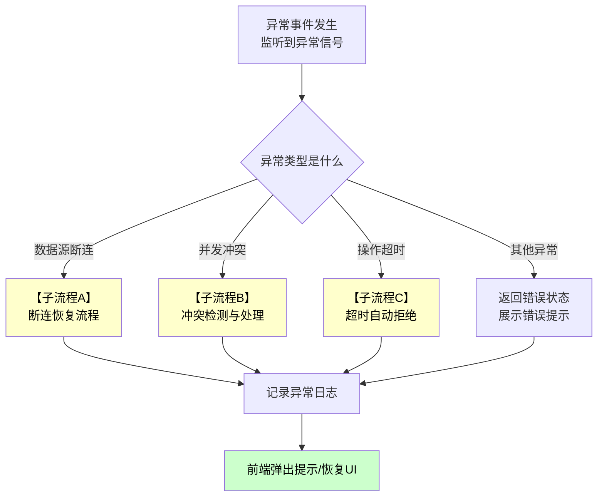
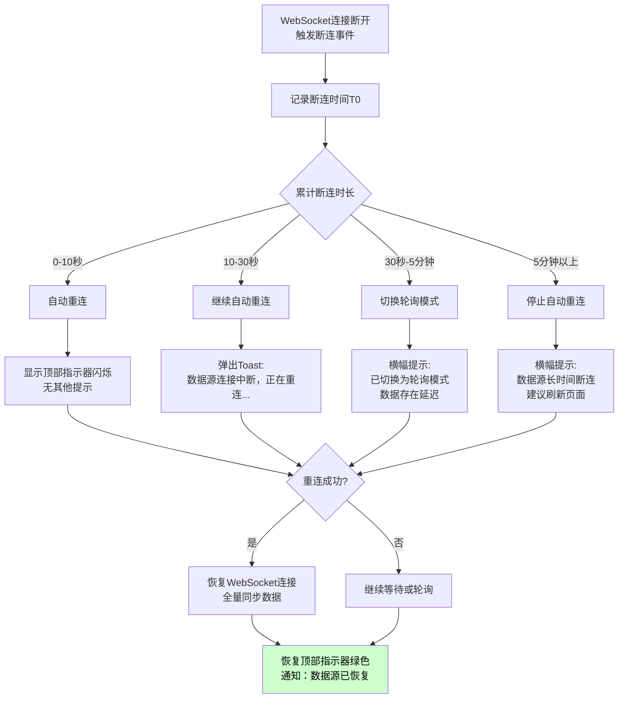
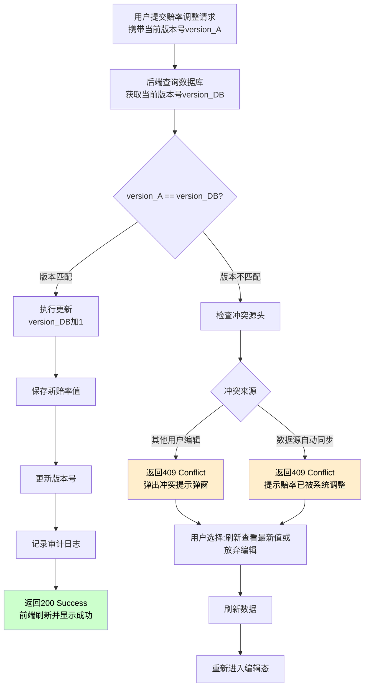
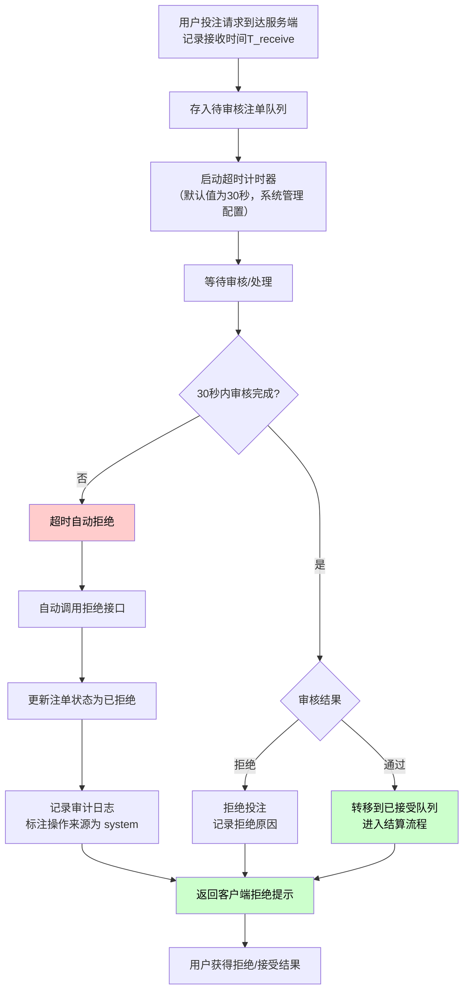

# 第十五章 异常与边界处理

> **关盘口径（2026-04-21 生效）**：关盘来源统一为数据源推送（唯一来源）；关盘 = 绝对终态，操盘页与结算详情页均不提供人工开盘入口。如数据源误推送关盘，依赖数据源再次推送开盘信号自动响应。

本章定义操盘详情页中各类异常情况和边界场景的处理规则，包括空状态、加载状态、错误状态、并发冲突、操作时序边界等。

## 15.0 与其他章节的关系说明

| 维度             | 相关章节                   | 本章职责                     |
| ---------------- | -------------------------- | ---------------------------- |
| 操盘列表异常处理 | **操盘列表第14章**（参考） | 本章定义操盘页特有的异常场景 |
| 状态流转规则     | 操盘页第9章                | 本章定义异常状态的处理规则   |
| 实时数据更新     | 操盘页第11章               | 本章定义数据断连、延迟等异常 |

---

## 15.1 空状态处理

### 15.1.1 盘口卡片空状态

当玩法下无可用盘口时，显示空状态界面：

| 场景           | 显示内容                     | 操作建议                 |
| -------------- | ---------------------------- | ------------------------ |
| 玩法无盘口数据 | 插图 +「该玩法暂无盘口数据」 | 提示等待数据源推送       |
| 筛选结果为空   | 插图 +「没有符合条件的盘口」 | 显示「清除筛选条件」按钮 |
| 盘口线全部隐藏 | 插图 +「所有盘口线已隐藏」   | 显示「显示全部」按钮     |

### 15.1.2 右侧监控面板空状态

| 场景         | 显示内容         | 操作建议 |
| ------------ | ---------------- | -------- |
| 投注流无数据 | 「暂无投注记录」 | 无       |
| 告警列表为空 | 「当前无告警」   | 无       |
| 操盘日志为空 | 「暂无操作记录」 | 无       |

### 15.1.3 左侧赛事列表空状态

| 场景             | 显示内容                   | 操作建议                 |
| ---------------- | -------------------------- | ------------------------ |
| 当前无已上架赛事 | 插图 +「暂无已上架赛事」   | 提示返回操盘列表上架赛事 |
| 搜索无结果       | 插图 +「未找到匹配的赛事」 | 提示修改搜索关键词       |

---

## 15.2 加载状态处理

### 15.2.1 页面加载状态

| 场景         | 显示内容                           |
| ------------ | ---------------------------------- |
| 首次进入页面 | 全屏骨架屏（三栏布局占位）         |
| 切换赛事     | 中间盘口区骨架屏，左右两栏保持显示 |
| 刷新数据     | 刷新按钮显示旋转图标               |

### 15.2.2 组件级加载状态

| 组件       | 加载状态显示                |
| ---------- | --------------------------- |
| 盘口卡片   | 卡片内显示加载动画          |
| 投注流列表 | 列表区显示骨架屏（5行占位） |
| 操盘日志   | 表格显示骨架屏（10行占位）  |
| 赔率单元格 | 单元格内显示加载指示器      |

### 15.2.3 加载超时处理（与操盘列表第14章14.2节一致）

| 超时时间 | 处理方式                         |
| -------- | -------------------------------- |
| 5秒      | 显示「加载时间较长，请耐心等待」 |
| 15秒     | 显示「加载超时」+「重试」按钮    |
| 30秒     | 自动取消请求，显示错误状态       |

---

## 15.3 错误状态处理

### 15.3.1 页面级错误

| 错误类型   | 处理方式                                        |
| ---------- | ----------------------------------------------- |
| 赛事不存在 | 显示「赛事不存在或已删除」+ 返回操盘列表按钮    |
| 赛事已确认结算 | 显示「赛事已完成结算，操盘详情已不可编辑」+ 跳转结算详情页按钮（赛事已从操盘列表移除，只读查看） |
| 无访问权限 | 显示「该赛事由{操盘手姓名}负责，您无权查看」    |
| 服务器错误 | 显示「服务暂时不可用，请稍后重试」+「重试」按钮 |

### 15.3.2 组件级错误

| 错误类型         | 处理方式                         |
| ---------------- | -------------------------------- |
| 盘口数据加载失败 | 卡片内显示错误提示 +「重试」按钮 |
| 投注流加载失败   | 列表显示错误提示 +「重试」按钮   |
| 赔率保存失败     | Toast通知提示错误原因            |
| 状态操作失败     | Toast通知提示错误原因            |

### 15.3.3 错误码与提示映射（与操盘列表第14章14.3节一致）

| 错误码  | 用户提示       | 处理建议       |
| ------- | -------------- | -------------- |
| 400     | 请求参数错误   | 检查输入内容   |
| 401     | 登录已过期     | 跳转登录页     |
| 403     | 权限不足       | 联系管理员     |
| 404     | 数据不存在     | 刷新页面       |
| 409     | 数据已被修改   | 刷新后重试     |
| 429     | 操作过于频繁   | 稍后重试       |
| 500     | 服务器错误     | 稍后重试       |
| 502/503 | 服务暂时不可用 | 稍后重试       |
| 504     | 请求超时       | 检查网络后重试 |

---

## 15.3.4 比赛意外中断处理

当比赛因非IM控制的原因意外中断或异常时（如断电、天气、场地事故等），系统应按以下规则处理。

**核心原则**：比赛意外中断由IM数据源判定并推送状态变更，本地系统不主动判定比赛是否中断。本地仅作为被动接收端，不发起关盘或暂停操作。

### 系统对IM推送的响应规则

| 场景 | IM推送行为 | 本地系统行为 | C端展示 | 操盘端状态 |
|------|----------|------------|--------|----------|
| 比赛正常进行 | IM推送 EventStatus=开盘 | 本地状态保持开盘 | 可投注 | 开盘 |
| 比赛暂停（非关盘） | IM推送 EventStatus=暂停 | 本地状态保持不变，仅更新C端展示 | 暂停投注（可见灰显） | 开盘（不变） |
| 比赛延期 | IM推送 EventStatus=延期 | 赛事标记为延期，盘口保持当前状态 | 暂停投注 + 「赛事延期」标签 | 当前状态（不变） |
| 比赛关盘 | 数据源推送 EventStatus=关盘 | 本地状态强制更新为关盘（绝对终态，无人工开盘入口） | 已关闭 | 关盘 |
| IM无推送（>5分钟） | 无数据推送 | 触发数据源断连处理（见第15.4.2节） | 保持最后状态 | 保持最后状态 |

**关键约束**（写死）：

1. ~~**赛事级不提供关盘按钮**：关盘按钮在盘口级提供（粒度跟随结算粒度：MultiLineTable=盘口线级，其余=玩法级）。~~关盘来源：IM 推送关盘（唯一来源）（全局规则第6.1节）
2. **IM暂停处理**：IM推送暂停状态不改变本地状态，仅影响C端展示；IM恢复后C端自动回到可投注
3. **隐藏/锁定仍可执行**：比赛异常期间，操盘手仍可执行隐藏/锁定操作（主动风控收紧）
4. **赛事级隐藏/锁定优先级高于IM暂停**：若操盘手隐藏或锁定赛事，则C端显示「不可见」或「暂停投注」，不受IM暂停影响

### 操盘手主动应对策略（推荐）

当操盘手判断比赛情况严重但IM未立即推送关盘时，推荐做法（由操盘手主观决定）：

| 操盘手操作 | 系统行为 | C端展示 | 何时使用 |
|----------|--------|--------|---------|
| 锁定赛事所有盘口 | 赛事状态变为锁定，所有盘口不可投注 | 暂停投注（可见灰显） | 比赛异常期间，等待IM确认 |
| 隐藏赛事所有盘口 | 赛事状态变为隐藏，所有盘口对C端不可见 | 不可见 | 比赛已确认终止，等待官方结果 |
| 逐玩法隐藏或锁定 | 仅隐藏/锁定指定玩法，其他玩法继续投注 | 部分暂停投注/隐藏 | 仅部分玩法受影响（如角球中断但比赛继续） |

### 数据源持续无响应的极限降级规则（写死）

当IM数据源持续无响应，本地系统启动自动降级措施：

| 无响应时长 | 系统行为 | 操盘端提示 | 归属配置 |
|----------|---------|----------|----------|
| 30秒~2分钟 | 自动重连，保持当前所有状态 | 顶部横幅「数据源连接异常，正在重连」 | 系统级 |
| 2分钟~5分钟 | 切换为轮询模式（降速同步） | 顶部横幅「已切换为轮询模式，数据存在延迟」 | 系统级 |
| 5~15分钟 | **自动锁定赛事所有盘口** | 弹窗「数据源持续无响应超过5分钟，已自动锁定所有盘口，请人工确认赛事状态」 | 默认值为5分钟，风控管理配置 |
| 15~30分钟 | **维持锁定状态，不自动升级** | 操盘端显示持续告警横幅「数据源无响应 XX分钟，已锁定盘口，请人工处理」 | 操盘手可手动改为隐藏 |
| 超过30分钟（终态） | **自动隐藏赛事所有盘口**（不可逆升级，标记为系统操作） | 弹窗「数据源长时间断连超过30分钟，已自动隐藏所有盘口，建议联系数据源支持或切换备用数据源」 | 默认值为30分钟，风控管理配置 |

**自动锁定/隐藏的含义与解锁规则**：
- **自动锁定**（≤15分钟）：隐藏来源标记为「system，reason: datasource_timeout_lock」，操盘手可手动改为隐藏或等待恢复
- **自动隐藏**（>30分钟，终态）：隐藏来源标记为「system，reason: datasource_timeout」，不可自动解锁，操盘手解锁需满足两个条件：
  1. 数据源恢复连接（顶部指示器变绿）
  2. 操盘手在解锁弹窗中明确确认「数据源已恢复，允许解锁」（防止误操作）
- 所有自动操作记入操盘日志，标签为「系统自动」，带时间戳

### 比赛恢复后的处理

当IM恢复连接并推送正常盘口状态时：

| 恢复场景 | 系统行为 | 操盘端提示 |
|---------|--------|----------|
| IM推送正常状态 | 顶部指示器恢复绿色，C端自动刷新盘口显示 | 横幅「数据源已连接，盘口数据已更新」 |
| 本地自动锁定/隐藏未手动解除 | 本地锁定/隐藏状态保持，不自动恢复 | 提示「本地有手动/自动操作，请人工审核是否需要解除」 |
| IM推送赛事仍关盘 | 本地维持关盘终态 | 无额外提示 |

### 与其他章节的衔接

- **与第8章控制层级的关系**：自动锁定/隐藏是系统级防守操作，同时遵守第8章的状态继承规则（赛事锁定使所有下级盘口不可投注）
- **与第9章状态流转的关系**：自动操作不触发用户的「锁定确认」弹窗，直接执行状态变更，但如操盘手解除时需确认（见第13章）
- **与第14章操作流程的关系**：自动锁定/隐藏后，编辑赔率入口仍被禁用（状态前置检查），操盘手必须先手动解除状态才能编辑（见第14.2.1A节）

---

## 15.4 异常处理决策树

### 15.4.0 异常处理主流程

当系统检测到异常事件时，按以下决策树处理：



### 15.4.1 数据源状态定义

| 状态 | 说明              | 页面表现                                 |
| ---- | ----------------- | ---------------------------------------- |
| 正常 | 数据源连接正常    | 顶部指示器显示绿色                       |
| 延迟 | 数据延迟超过阈值  | 顶部指示器显示黄色，显示延迟时间         |
| 断连 | WebSocket连接断开 | 顶部指示器显示红色，显示「数据源断连」   |
| 维护 | 数据源维护中      | 顶部指示器显示灰色，显示「数据源维护中」 |

### 15.4.2 数据源断连处理（子流程A）



**断连处理规则表**：

| 断连时长  | 系统行为           | 用户感知                                   |
| --------- | ------------------ | ------------------------------------------ |
| 0-10秒    | 自动重连           | 顶部指示器闪烁                             |
| 10-30秒   | 继续重连，显示提示 | Toast「数据源连接中断，正在重连...」       |
| 30秒以上  | 切换轮询模式       | 横幅「已切换为轮询模式，数据存在延迟」 |
| 5分钟以上 | 建议刷新页面       | 横幅「数据源长时间断连，建议刷新页面」     |

### 15.4.3 数据源维护处理

| 场景         | 系统行为               | 用户感知                              |
| ------------ | ---------------------- | ------------------------------------- |
| 收到维护通知 | 盘口自动隐藏           | 所有盘口卡片显示「数据源维护中」遮罩  |
| 维护期间操作 | 阻止赔率编辑和状态操作 | 操作按钮禁用，Tooltip「数据源维护中」 |
| 维护结束     | 盘口根据跟随配置恢复   | Toast「数据源已恢复」                 |

### 15.4.4 数据延迟处理

| 延迟时长  | 系统行为     | 用户感知                         |
| --------- | ------------ | -------------------------------- |
| 100-500ms | 正常范围     | 无                               |
| 500ms-2s  | 显示延迟提示 | 顶部指示器显示黄色，显示延迟时间 |
| 2s以上    | 触发延迟告警 | 告警列表新增「数据延迟」告警     |

---

## 15.5 并发冲突处理（子流程B）

### 15.5.0 冲突检测与处理流程



### 15.5.1 赔率编辑冲突

| 场景                             | 处理方式                                      | 仲裁规则 |
| -------------------------------- | --------------------------------------------- | --------|
| 用户A编辑，用户B也编辑同一选项（并发赔率编辑） | 后保存的用户收到冲突提示弹窗 | **同一赛事同一时刻仅允许一名操盘手编辑赔率**（乐观锁机制）；后提交者收到提示「赔率已被[操盘手名]修改为[新值]，请刷新后重新编辑」，操盘手需刷新数据后重新编辑 |
| 用户A编辑，数据源自动同步同一选项    | 数据源同步优先，用户A收到「赔率已被系统调整」提示 | 数据源同步（飞单）优先级高于操盘手编辑，如数据源推送赔率更新，编辑中的操盘手必须重新刷新 |
| 用户A编辑赔率，用户B同时隐藏/锁定盘口        | 赔率编辑被阻止，盘口操作成功 | 赔率编辑与状态操作互相阻止：若提交赔率时盘口已变更为隐藏/锁定，则提示「盘口状态已变更，无法保存赔率」，需先恢复状态再编辑 |
| 用户A编辑，数据源推送更新        | 用户保存时校验版本，冲突则提示                | 按版本号（version_A vs version_DB）判定冲突，以后发布的版本为准 |

**关键约束**：状态操作（隐藏/锁定/解锁/取消隐藏）不受编辑锁限制，以最后提交为准（多人同时隐藏和解锁时，取决于提交顺序）

### 15.5.2 冲突检测机制（与操盘列表第14章14.4节一致）

| 机制         | 说明                                         |
| ------------ | -------------------------------------------- |
| 版本号校验   | 每次操作提交时携带数据版本号                 |
| 实时状态推送 | 状态变更实时推送给所有在线用户               |
| 行级锁       | 同一选项的赔率变更采用数据库行级锁，先到先得 |

### 15.5.3 冲突处理弹窗

详见**本文档第14章14.7.2节**。

### 15.5.3 冲突处理弹窗

详见**本文档第14章14.7.2节**。

---

## 15.5.4 超时处理（子流程C）

> **规范说明**：风险注单完整操作流程的规范定义为[第11章11.8节「待审核注单处理流程图」](./11-右侧监控面板.md#_11-8-待审核注单处理流程图)。本节仅从异常处理角度补充超时自动拒绝的系统行为。

### 15.5.4.1 风险注单超时自动拒绝流程



**超时处理规则**：

| 配置项 | 默认值 | 归属 | 说明 |
|--------|--------|------|------|
| 风险注单超时 | 30秒 | 系统管理配置 | 超时未处理自动拒绝并记录日志 |

---

## 15.6 操作频率限制与冷却规则

### 15.6.1 同选项频繁调整冷却规则

**规则说明**：同一选项在30秒内连续调整≥ 3次，后续日志聚合为一条并在UI和日志中提示「短时频繁调价」，避免日志刷屏与审计困难。

| 维度         | 详情                                                   |
| ------------ | ------------------------------------------------------ |
| **触发条件** | 同一选项在30秒时间窗口内发生≥ 3次赔率调整               |
| **聚合时机** | 第3次及之后的调整在日志端聚合                          |
| **日志表现** | 单条日志记录：操作人、聚合时间段、调整前后值、次数统计 |
| **UI反馈**   | Toast提示「检测到短时频繁调价，已聚合记录」            |
| **一期定位** | 冷却规则；二期根据联赛/玩法分级定义                |

---

## 15.7 操作时序边界场景

当操盘手发起操作到提交之间，赛事/盘口状态会发生变化。本节定义各类时序边界场景的处理规则。

### 15.7.1 赔率编辑时序边界

> **隐藏来源区分说明**：
>
> 编辑时盘口被隐藏的处理根据隐藏来源不同而有所区别：
>
> | 隐藏来源 | 系统行为 | 操盘手提示 | 说明 |
> |----------|----------|------------|------|
> | `data_source` | 阻止保存 | Toast「数据源已暂停，无法保存」 | 数据源暂停通常为进球等事件，需等待恢复 |
> | `manual` | 阻止保存 | Toast「盘口已被人工隐藏，无法保存」 | 需联系隐藏操作人取消隐藏 |
> | `risk_control` | 阻止保存 | Toast「盘口已被风控隐藏，无法保存」 | 需风控人员解除后才可操作 |
> | `league_pause` | 阻止保存 | Toast「联赛已暂停，无法保存」 | 需等待联赛恢复 |
> | `maintenance` | 阻止保存 | Toast「数据源维护中，无法保存」 | 需等待维护结束 |
> | `inherit` | 阻止保存 | Toast「上级已隐藏，无法保存」 | 需上级取消隐藏后才可操作 |

<pre class="font-ui border-border-100/50 overflow-x-scroll w-full rounded border-[0.5px] shadow-[0_2px_12px_hsl(var(--always-black)/5%)]"><table class="bg-bg-100 min-w-full border-separate border-spacing-0 text-sm leading-[1.88888] whitespace-normal"><thead class="text-left"><tr><th class="text-text-000 [&:not(:first-child)]:-x-[hsla(var(--border-100)/0.5)] px-2 [&:not(:first-child)]:border-l-[0.5px]">场景</th><th class="text-text-000 [&:not(:first-child)]:-x-[hsla(var(--border-100)/0.5)] px-2 [&:not(:first-child)]:border-l-[0.5px]">触发条件</th><th class="text-text-000 [&:not(:first-child)]:-x-[hsla(var(--border-100)/0.5)] px-2 [&:not(:first-child)]:border-l-[0.5px]">系统行为</th><th class="text-text-000 [&:not(:first-child)]:-x-[hsla(var(--border-100)/0.5)] px-2 [&:not(:first-child)]:border-l-[0.5px]">操盘手感知</th></tr></thead><tbody><tr><td class="border-t-border-100/50 [&:not(:first-child)]:-x-[hsla(var(--border-100)/0.5)] border-t-[0.5px] px-2 [&:not(:first-child)]:border-l-[0.5px]">编辑时盘口被隐藏</td><td class="border-t-border-100/50 [&:not(:first-child)]:-x-[hsla(var(--border-100)/0.5)] border-t-[0.5px] px-2 [&:not(:first-child)]:border-l-[0.5px]">双击进入编辑，提交时盘口已隐藏</td><td class="border-t-border-100/50 [&:not(:first-child)]:-x-[hsla(var(--border-100)/0.5)] border-t-[0.5px] px-2 [&:not(:first-child)]:border-l-[0.5px]">阻止保存</td><td class="border-t-border-100/50 [&:not(:first-child)]:-x-[hsla(var(--border-100)/0.5)] border-t-[0.5px] px-2 [&:not(:first-child)]:border-l-[0.5px]">根据隐藏来源显示对应提示（见上表）</td></tr><tr><td class="border-t-border-100/50 [&:not(:first-child)]:-x-[hsla(var(--border-100)/0.5)] border-t-[0.5px] px-2 [&:not(:first-child)]:border-l-[0.5px]">编辑时盘口被锁定</td><td class="border-t-border-100/50 [&:not(:first-child)]:-x-[hsla(var(--border-100)/0.5)] border-t-[0.5px] px-2 [&:not(:first-child)]:border-l-[0.5px]">双击进入编辑，提交时盘口已锁定</td><td class="border-t-border-100/50 [&:not(:first-child)]:-x-[hsla(var(--border-100)/0.5)] border-t-[0.5px] px-2 [&:not(:first-child)]:border-l-[0.5px]">阻止保存</td><td class="border-t-border-100/50 [&:not(:first-child)]:-x-[hsla(var(--border-100)/0.5)] border-t-[0.5px] px-2 [&:not(:first-child)]:border-l-[0.5px]">Toast「盘口已锁定，无法保存」</td></tr><tr><td class="border-t-border-100/50 [&:not(:first-child)]:-x-[hsla(var(--border-100)/0.5)] border-t-[0.5px] px-2 [&:not(:first-child)]:border-l-[0.5px]">编辑时数据源关盘</td><td class="border-t-border-100/50 [&:not(:first-child)]:-x-[hsla(var(--border-100)/0.5)] border-t-[0.5px] px-2 [&:not(:first-child)]:border-l-[0.5px]">双击进入编辑，提交时数据源关盘</td><td class="border-t-border-100/50 [&:not(:first-child)]:-x-[hsla(var(--border-100)/0.5)] border-t-[0.5px] px-2 [&:not(:first-child)]:border-l-[0.5px]">阻止保存</td><td class="border-t-border-100/50 [&:not(:first-child)]:-x-[hsla(var(--border-100)/0.5)] border-t-[0.5px] px-2 [&:not(:first-child)]:border-l-[0.5px]">Toast「数据源已关盘，无法保存」</td></tr><tr><td class="border-t-border-100/50 [&:not(:first-child)]:-x-[hsla(var(--border-100)/0.5)] border-t-[0.5px] px-2 [&:not(:first-child)]:border-l-[0.5px]">编辑时赛事流转</td><td class="border-t-border-100/50 [&:not(:first-child)]:-x-[hsla(var(--border-100)/0.5)] border-t-[0.5px] px-2 [&:not(:first-child)]:border-l-[0.5px]">双击进入编辑，提交时赛事已完场</td><td class="border-t-border-100/50 [&:not(:first-child)]:-x-[hsla(var(--border-100)/0.5)] border-t-[0.5px] px-2 [&:not(:first-child)]:border-l-[0.5px]">阻止保存，跳转结算管理</td><td class="border-t-border-100/50 [&:not(:first-child)]:-x-[hsla(var(--border-100)/0.5)] border-t-[0.5px] px-2 [&:not(:first-child)]:border-l-[0.5px]">Toast「赛事已结束」</td></tr><tr><td class="border-t-border-100/50 [&:not(:first-child)]:-x-[hsla(var(--border-100)/0.5)] border-t-[0.5px] px-2 [&:not(:first-child)]:border-l-[0.5px]">编辑时数据源同步</td><td class="border-t-border-100/50 [&:not(:first-child)]:-x-[hsla(var(--border-100)/0.5)] border-t-[0.5px] px-2 [&:not(:first-child)]:border-l-[0.5px]">用户正在编辑，数据源同时同步</td><td class="border-t-border-100/50 [&:not(:first-child)]:-x-[hsla(var(--border-100)/0.5)] border-t-[0.5px] px-2 [&:not(:first-child)]:border-l-[0.5px]">提交时版本冲突</td><td class="border-t-border-100/50 [&:not(:first-child)]:-x-[hsla(var(--border-100)/0.5)] border-t-[0.5px] px-2 [&:not(:first-child)]:border-l-[0.5px]">弹出冲突处理弹窗</td></tr></tbody></table></pre>

### 15.7.2 状态操作时序边界

| 场景                 | 触发条件                       | 系统行为                   | 操盘手感知                                |
| -------------------- | ------------------------------ | -------------------------- | ----------------------------------------- |
| 隐藏时数据源推送开盘 | 点击隐藏，提交前数据源推送开盘 | 隐藏成功（人工覆盖数据源） | 隐藏成功                                  |
| 取消隐藏时数据源推送暂停 | 点击取消隐藏，提交前数据源推送暂停 | 根据跟随配置决定           | Toast提示最终状态                         |
| 锁定时数据源推送关盘 | 点击锁定，提交前数据源关盘     | 关盘优先级高于锁定         | Toast「数据源已关盘，盘口最终状态为关盘」 |
| 解锁时数据源推送关盘 | 点击解锁，提交前数据源关盘     | 阻止解锁                   | Toast「数据源已关盘，无法解锁」           |

### 15.7.3 赛事状态变更时序边界

| 场景               | 触发条件                     | 系统行为               | 操盘手感知                      |
| ------------------ | ---------------------------- | ---------------------- | ------------------------------- |
| 操作时赛事进入滚球 | 操作赛前盘口，提交时已滚球   | 操作继续执行           | 无（正常流转）                  |
| 操作时赛事延期     | 操作盘口，提交时收到延期状态 | 盘口自动隐藏，操作失败 | Toast「赛事延期中，操作已取消」 |
| 操作时赛事取消     | 操作盘口，提交时收到取消状态 | 赛事流转，操作失败     | Toast「赛事已取消」，页面跳转   |
| 操作时赛事结束     | 操作盘口，提交时收到完场状态 | 赛事流转，操作失败     | Toast「赛事已结束」，页面跳转   |

### 15.7.4 并发操作时序边界（与操盘列表第14章14.8.6节一致）

| 场景                 | 触发条件             | 系统行为               | 操盘手感知              |
| -------------------- | -------------------- | ---------------------- | ----------------------- |
| A隐藏，B锁定         | 两人同时操作同一盘口 | 锁定优先级高于隐藏     | A操作被覆盖             |
| A解锁，B隐藏         | 两人同时操作同一盘口 | 解锁优先级高于隐藏     | B操作被覆盖             |
| A编辑赔率，B隐藏盘口 | A编辑中，B隐藏盘口   | A提交时盘口已隐藏      | A收到「盘口已隐藏」提示 |

#### 并发操作优先级规则

|  优先级   | 操作类型       | 说明                 |
| :-------: | -------------- | -------------------- |
| 1（最高） | 关盘（数据源） | 数据源关盘最高优先级 |
|     2     | 锁定           | 主动风控行为         |
|     3     | 解锁           | 需确认数据源状态     |
| 4（最低） | 隐藏/取消隐藏      | 临时状态变更         |

---

## 15.8 投注时序边界

当盘口状态变更时，服务端状态变更与客户端收到通知之间存在延迟窗口。本节定义该窗口期内投注请求的处理规则。

### 15.8.1 时序窗口定义（与操盘列表第14章14.11.1节一致）

| 时间点 | 定义                                               |
| ------ | -------------------------------------------------- |
| T0     | 服务端盘口状态变更时间                             |
| T1     | 客户端收到状态推送时间（T1 > T0，延迟约100-500ms） |
| Tx     | 用户投注请求到达服务端时间                         |

### 15.8.2 窗口期投注处理规则（与操盘列表第14章14.11.2节一致）

| 场景     | Tx位置       | 处理方式 | 用户提示           |
| -------- | ------------ | -------- | ------------------ |
| 盘口关盘 | T0 < Tx < T1 | 拒绝投注 | 该盘口已关盘       |
| 盘口隐藏 | T0 < Tx < T1 | 拒绝投注 | 盘口隐藏中，请稍后 |
| 盘口锁定 | T0 < Tx < T1 | 拒绝投注 | 盘口已锁定         |
| 赛事流转 | T0 < Tx < T1 | 拒绝投注 | 该赛事已结束       |

**关键原则**：以服务端状态为准，客户端延迟不影响判断。

### 15.8.3 服务端投注校验流程（与操盘列表第14章14.11.3节一致）

| 步骤 | 校验内容             | 失败错误码          |
| :--: | -------------------- | ------------------- |
|  1   | 赛事是否存在且已上架 | EVENT_NOT_AVAILABLE |
|  2   | 盘口状态是否为开盘   | MARKET_NOT_OPEN     |
|  3   | 赔率版本是否匹配     | ODDS_CHANGED        |
|  4   | 投注额度是否在限额内 | AMOUNT_EXCEED_LIMIT |
|  5   | 用户是否有投注权限   | USER_RESTRICTED     |

---

## 15.9 切场边界处理

### 15.9.1 切场时未保存编辑处理

| 场景               | 系统行为     | 用户感知                         |
| ------------------ | ------------ | -------------------------------- |
| 有未保存的赔率编辑 | 弹出确认弹窗 | 「您有未保存的修改，是否放弃？」 |
| 无未保存编辑       | 直接切换     | 无                               |

### 15.9.2 切场确认弹窗

弹窗标题：⚠️ 未保存的修改

```
┌────────────────────────────────────────┐
│  ⚠️ 未保存的修改                    ✕  │
├────────────────────────────────────────┤
│                                        │
│  您有未保存的赔率修改，切换赛事后将    │
│  丢失这些修改。                        │
│                                        │
│  是否确认切换？                        │
│                                        │
├────────────────────────────────────────┤
│   [ 取消 ]    [ 保存并切换 ]  [ 放弃 ] │
└────────────────────────────────────────┘
```

| 按钮       | 行为                   |
| ---------- | ---------------------- |
| 取消       | 关闭弹窗，保持当前赛事 |
| 保存并切换 | 保存当前修改，然后切换 |
| 放弃       | 放弃修改，直接切换     |

### 15.9.3 切场时目标赛事异常

| 场景           | 系统行为 | 用户感知                        |
| -------------- | -------- | ------------------------------- |
| 目标赛事已下架 | 阻止切换 | Toast「该赛事已下架」           |
| 目标赛事已确认结算 | 阻止切换 | Toast「该赛事已完成结算，不可进入操盘页，请到结算详情页查看」|
| 目标赛事无权限 | 阻止切换 | Toast「您无权查看该赛事」       |

---

## 15.10 页面刷新与恢复

### 15.10.1 页面刷新处理

| 场景               | 系统行为                       |
| ------------------ | ------------------------------ |
| 刷新页面           | 重新加载当前赛事数据           |
| 刷新时有未保存编辑 | 浏览器默认提示「离开此页面？」 |

### 15.10.2 会话恢复处理

| 场景         | 系统行为                               |
| ------------ | -------------------------------------- |
| Token过期    | 跳转登录页，登录后返回原页面           |
| 长时间未操作 | 弹出会话超时提示，可选择续期或重新登录 |

---

## 15.11 浏览器兼容性异常

### 15.11.1 不支持的浏览器

| 浏览器          | 处理方式                                |
| --------------- | --------------------------------------- |
| IE              | 显示「请使用Chrome/Firefox/Edge浏览器」 |
| 旧版Chrome(<80) | 显示升级提示                            |

### 15.11.2 功能降级

| 功能      | 降级条件         | 降级后表现     |
| --------- | ---------------- | -------------- |
| WebSocket | 浏览器不支持     | 切换为轮询模式 |
| 快捷键    | 与系统快捷键冲突 | 禁用冲突快捷键 |

## 修订记录

| 版本 | 日期       | 修订内容                         |
| ---- | ---------- | -------------------------------- |
| v1.0 | 2026-01-22 | 初稿，与操盘列表第14章颗粒度对齐 |
| v1.1 | 2026-01-28 | P1/P2修复：1) 章节编号修正（15.6.4→15.7.4，15.7投注时序→15.8，后续顺延至15.11）；2) 15.5.3跨章节引用添加"本文档"定位；3) 15.7.4并发操作优先级表述统一（删除"先到先得"，与优先级表一致） |
| v1.2 | 2026-01-28 | P2修复：15.7.1节增加暂停来源区分说明，明确不同暂停来源（data_source/manual/risk_control/league_pause/maintenance/inherit）的差异化提示 |
| v1.3 | 2026-01-29 | 全局规则v1.6术语对齐："暂停来源"→"隐藏来源"；操作"暂停/恢复"→"隐藏/取消隐藏"；状态"盘口暂停"→"盘口隐藏"；IM数据源术语保持不变 |
