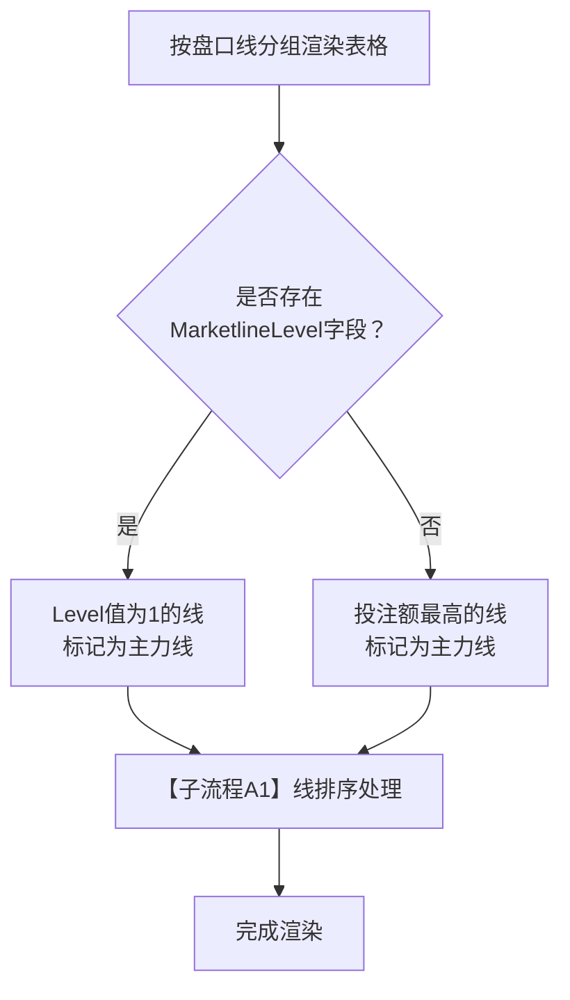
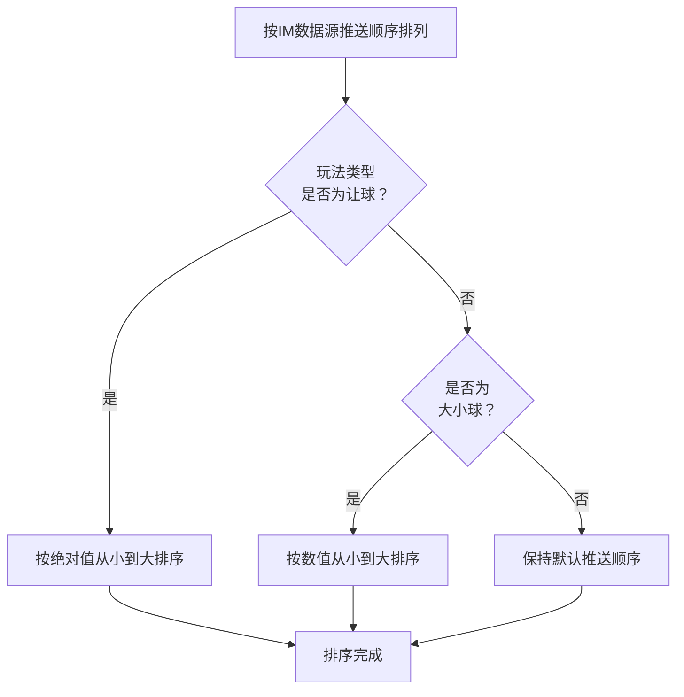
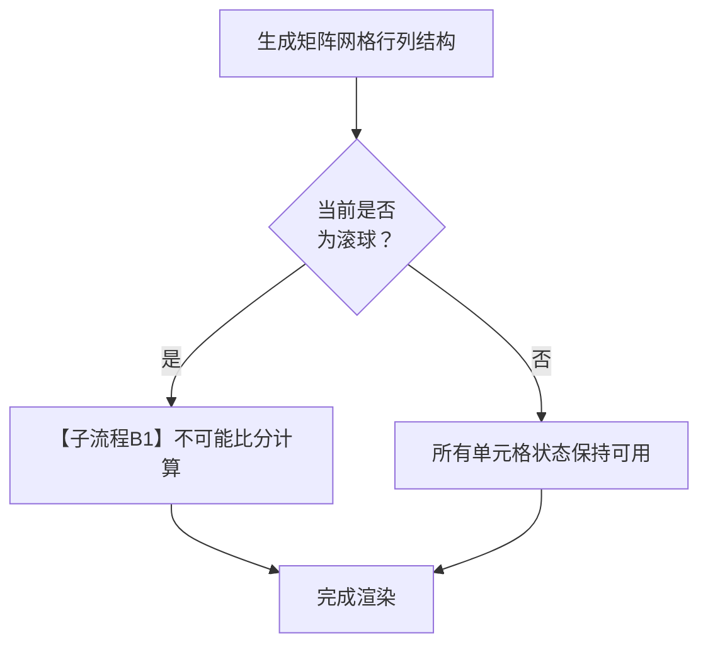
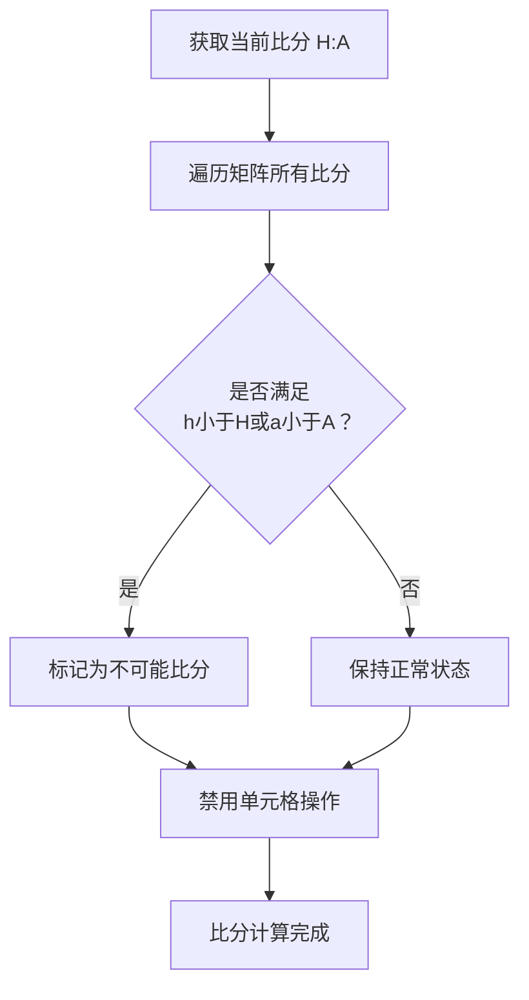
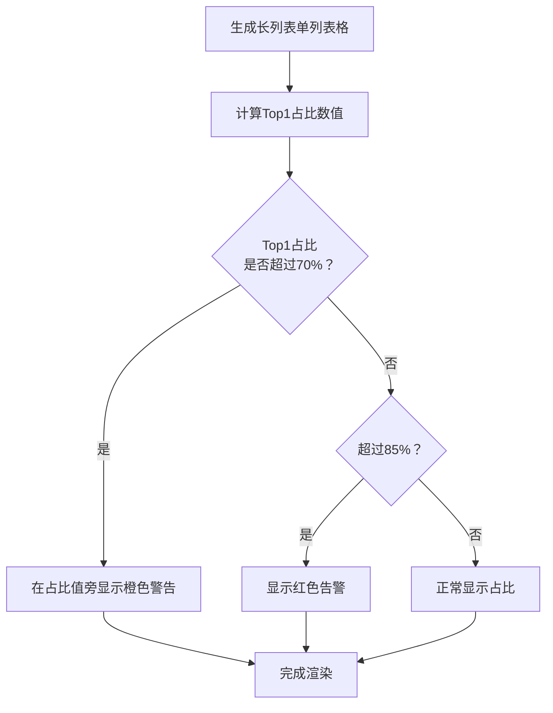
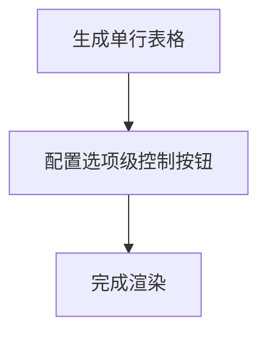

# 第六章 盘口卡片模块

> **关盘口径（2026-04-21 生效）**：关盘来源统一为数据源推送（唯一来源）；关盘 = 绝对终态，操盘页与结算详情页均不提供人工开盘入口。如数据源误推送关盘，依赖数据源再次推送开盘信号自动响应。


## 6.1 模块定位

盘口卡片是操盘详情页中间区域的核心组件。操盘手在这里完成单场赛事所有盘口的查看、赔率调整、状态控制等日常操盘工作。
边界：本期不支持本地“改盘口线/生成新盘口线/自定义盘口线”。盘口线集合由IM决定；操盘侧仅支持“显示/隐藏副线”，不改变盘口结构、不影响结算。

**核心设计原则**：

1. **单场专注**：每张卡片对应一个玩法（BetType），操盘手逐一处理，不跨赛事批量操作
2. **数据源对齐**：卡片结构严格对应IM数据源的BetType层级，字段命名与IM接口一致
3. **渲染器分类**：根据玩法的盘口线结构选择对应的渲染器，确保UI与数据结构匹配

---

## 6.2 盘口卡片结构

每张盘口卡片由三部分组成：卡片头部、卡片主体、卡片底部。

### 6.2.1 卡片头部（market-card-header）

卡片头部展示玩法级别的核心信息和控制入口。

| 元素           | 数据来源                      | 说明                                      |
| -------------- | ----------------------------- | ----------------------------------------- |
| 玩法名称       | IM字段：BetTypeName           | 如"全场让球"、"全场大小"                  |
| 盘口类型标签   | IM字段：Market                | 滚球（红色）/ 今日（橙色）/ 早盘（蓝色）  |
| BetType标识    | IM字段：BetTypeId             | 格式：BT1、BT2、BT5                       |
| 初始返奖率     | 本地计算                      | 上架时根据赔率计算的RTP，仅用于内部记录，不在卡片头部展示 |
| 当前返奖率     | 本地计算                      | MultiLineTable：在盘口线行展示（可编辑）；其余渲染器：在卡片头部展示（可编辑）。文案统一为「RTP XX.X%」 |
| 数据源开关     | 本地字段：data_source_enabled | 控制是否跟随数据源（赔率/状态/结算）      |
| 玩法级状态控制 | 本地字段：bettype_status      | 互斥操作按钮（详见下方说明）              |
| 操盘日志按钮   | —                             | 点击打开该玩法的操盘日志弹窗              |
| 展开/收起按钮  | —                             | 控制卡片主体的显示/隐藏                   |

**玩法级状态控制按钮规范**（详见[第8章8.4节](./08-控制层级体系.md#_8-4-状态展示与操作设计)）：
- 按钮采用**图标+文字**形式：👁隐藏、👁取消隐藏、🔒锁定、🔓解锁~~、~~
- 按钮**互斥显示**：👁隐藏与👁取消隐藏同一时间只显示一个，🔒锁定与🔓解锁同一时间只显示一个
- 锁定状态下，⏸隐藏按钮显示但禁用（灰色不可点击）
- 关盘来源：数据源推送关盘（唯一来源）。关盘 = 绝对终态，无人工开盘入口；依赖数据源再次推送开盘信号自动响应

**状态标签颜色规范**（全局统一，适用于玩法级/线级/选项级）：

| 状态 | 完整形式 | 紧凑形式 | 背景色 | 文字色 |
|------|----------|----------|--------|--------|
| 开盘 | `●开盘` | `●开` | rgba(23,191,99,0.15) | #17bf63 (绿) |
| 隐藏 | `👁隐藏` | `👁隐` | rgba(255,173,31,0.15) | #ffad1f (橙) |
| 锁定 | `🔒锁定` | `🔒锁` | rgba(224,36,94,0.15) | #e0245e (红) |
| 关盘 | `⊘关盘` | `⊘关` | rgba(110,118,125,0.15) | #6e767d (灰) |

> **使用规则**：玩法级使用完整形式，线级和选项级使用紧凑形式。

**头部布局**：

```
┌──────────────────────────────────────────────────────────────────────────────────┐
│ 全场让球 [滚球] [●开盘] BT1  [数据源开]  [👁隐藏][🔒锁定]~~[]~~ 📋 ▼             │
│            ↑类型  ↑状态标签                          ↑操作按钮                   │
└──────────────────────────────────────────────────────────────────────────────────┘

> **RTP 展示位置说明**：上图适用于 SingleLineTable/Matrix/LongList 玩法（在卡片头部展示 RTP）。MultiLineTable 玩法的卡片头部不展示 RTP，RTP 展示在每条盘口线行内。
```

### 6.2.2 卡片主体（market-card-body）

卡片主体根据玩法类型使用不同的渲染器，详见6.3节。

### 6.2.3 卡片底部（market-card-footer）

卡片底部展示该玩法的投注汇总统计。

| 统计项      | 数据来源 | 格式示例                                 |
| ----------- | -------- | ---------------------------------------- |
| 注单数      | 本地统计 | 318单                                    |
| 投注额      | 本地统计 | ¥304.1K                                  |
| 已接受/拒绝 | 本地统计 | 315 / 3                                  |
| 风险注单    | 本地统计 | 5单待处理（超过阈值触发风控的注单数）    |
| 理论盈亏    | 本地计算 | +¥12.5K / -¥8.2K（根据当前投注分布计算） |

> **底部合计行说明**：MultiLineTable 玩法底部合计行不展示 RTP（各线 RTP 独立管理，合并无业务含义）。SingleLineTable/Matrix/LongList 玩法底部合计行展示只读 RTP。

### 6.2.4 投注分布条

投注分布条位于卡片底部上方，用双色进度条展示投注的两边分布情况。

**适用范围**：仅适用于二选一对称玩法（让球、大小、单双）。分布条显示整个玩法的汇总投注分布，而非按线分别显示。三选项及以上玩法不显示分布条，改为显示"Top1占比"数值。

**显示规则**：

| 元素            | 说明                                                                       |
| --------------- | -------------------------------------------------------------------------- |
| 主队/大/单 占比 | 左侧蓝色进度条，显示百分比                                                 |
| 客队/小/双 占比 | 右侧绿色进度条，显示百分比                                                 |
| 单边警告阈值    | 任一方占比超过70%时，进度条变为橙色并显示⚠️图标（默认值70%，归属风控管理） |
| 严重单边阈值    | 任一方占比超过85%时，进度条变为红色并闪烁（默认值85%，归属风控管理）       |

**示例**：

```
主队 63%  ████████████████░░░░░░░░░░  37% 客队
```

---

## 6.3 渲染器类型

系统根据玩法的数据结构选择对应的渲染器。渲染器映射为规则，不支持配置。

### 6.3.1 渲染器映射表（全局规则）

| 渲染器              | 适用玩法（BetTypeId）                                             | 控制粒度                           | 是否有盘口线 | IM字段特征                 |
| ------------------- | ----------------------------------------------------------------- | ---------------------------------- | ------------ | -------------------------- |
| **MultiLineTable**  | BT1让球、BT2大小、BT160主队大小、BT161客队大小、BT179 15分钟让球、BT180 15分钟大小（含半场/角球同类） | 玩法级 + 线级 + 选项级（只读继承） | **有**       | Handicap字段非空           |
| **SingleLineTable** | BT3独赢、BT5单双、BT8双重机会、BT18双方球队皆进球、BT22主队零失球、BT23客队零失球、BT48 15分钟赛果-1X2、BT159第X粒入球球队 | 玩法级 + 选项级                    | **无**       | Handicap字段为空或不存在   |
| **Matrix**          | BT6波胆、BT9半场全场、BT158反波胆                                 | 玩法级 + 选项级（单元格=选项）     | **无**       | 选项数量多，适合矩阵展示   |
| **LongList**        | BT7总进球                                                         | 玩法级 + 选项级                    | **无**       | 选项数量多（7+），单列展示 |

**渲染器选择依据**：

1. 判断IM返回的WagerSelections中是否存在有效的Handicap字段
2. 存在Handicap字段（非空且玩法支持）→ MultiLineTable
3. 不存在Handicap字段：
   - 选项数量 ≤ 6 且适合矩阵展示 → Matrix
   - 选项数量 ≥ 7 → LongList
   - 其他 → SingleLineTable

---

### 6.3.2 MultiLineTable渲染器

**适用玩法**：让球(BT1)、大小(BT2)、主队大小(BT160)、客队大小(BT161)、15分钟让球(BT179)、15分钟大小(BT180)及其半场/角球衍生玩法

**数据结构特征**：

- IM字段Handicap非空，表示盘口线值
- 每条盘口线对应2个WagerSelection（如：主队让-0.5 / 客队让+0.5）
- 同一玩法存在多条盘口线（如：-0.5、-1、-1.5）

**表格结构**：

| 列名     | 宽度  | 内容说明                                                                    |
| -------- | ----- | --------------------------------------------------------------------------- |
| 盘口线   | 120px | 线值 + 主力线标记 + **线级状态标签** + 线级单边比例 + 线级控制按钮（**👁/👁/🔒/🔓**） |
| 选项     | 140px | **选项状态标签（只读）** + 选项名 + 盘口值                                  |
| 初始赔率 | 70px  | 上架时的HK赔率                                                              |
| 本地赔率 | 80px  | 当前本地HK赔率（可编辑）                                                    |
| IM赔率   | 70px  | 数据源当前HK赔率                                                            |
| 偏离     | 60px  | 本地赔率 - IM赔率，绝对值超过0.10显示橙色（默认值0.10，归属风控管理）       |
| RTP      | 50px  | **线级**当前赔率计算的返奖率（可编辑）。文案「RTP XX.X%」                    |
| 投注额   | 80px  | 该选项投注总额                                                              |
| 占比     | 50px  | 该选项投注占该玩法总投注的百分比                                            |
| 注单     | 50px  | 该选项注单数量                                                              |
| 风险敞口 | 80px  | 该选项的理论最大亏损（计算公式见6.7节）                                     |

**行分组规则**：

- 每条盘口线占2行（主队选项/客队选项）
- 线单元格使用rowspan="2"合并
- 主力线使用"主"徽章标记，背景色为蓝色10%透明度
- 副线使用交替背景色（深灰/浅灰）

**线级单边比例显示**：

线单元格内显示该条盘口线的单边比例，格式为"单边X%"。超过中风险阈值（风控管理配置）显示橙色，超过高风险阈值（风控管理配置）显示红色并闪烁

**盘口线排序规则**：

按IM数据源默认推送顺序排列。让球盘按绝对值从小到大排列（如-0.5、-1、-1.5）；大小球盘按数值从小到大排列（如2.5、3、3.5）。若存在对称线（如+0.5/-0.5），则对称排列。

**主力线判定规则**：

1. 优先使用IM返回的MarketlineLevel字段（Level=1为主力线）
2. 若IM未提供该字段，则以该玩法下投注额最高的盘口线作为主力线

**控制层级**（详见[第8章8.4.6节](./08-控制层级体系.md#_8-4-6-盘口线级操作区仅multiLineTable)）：

- 线级控制采用**图标按钮+悬浮提示**的紧凑设计
- 按钮**互斥显示**：⏸隐藏与▶取消隐藏同一时间只显示一个，🔒锁定与🔓解锁同一时间只显示一个
- 锁定状态下，⏸隐藏图标显示但禁用（灰色），悬浮提示：「锁定中，请先解锁」
- **线级关盘**来源：数据源推送关盘（唯一来源）。关盘后该线所有选项变为关盘状态（关盘 = 绝对终态，无人工开盘入口）
- **线级状态标签**：在线值后显示紧凑形式状态标签 `[●开]` / `[⏸隐]` / `[🔒锁]` / `[⊘关]`
- **选项状态标签**：在选项名前显示紧凑形式状态标签，只读继承自所属盘口线
- 选项级不提供独立控制按钮

**示例布局**：

```
┌────────────────────┬─────────────────┬────────┬────────┬────────┬──────┬─────┬────────┬──────┬──────┬────────┐
│      盘口线        │      选项       │ 初始   │  本地  │   IM   │ 偏离 │ RTP │ 投注额 │ 占比 │ 注单 │ 风险   │
├────────────────────┼─────────────────┼────────┼────────┼────────┼──────┼─────┼────────┼──────┼──────┼────────┤
│ [主] -0.5 [●开]    │ [●开] 主队 -0.5 │  0.88  │ [0.90] │  0.88  │+0.02 │95.0%│ ¥52.3K │ 48%  │  89  │ ¥-12K  │
│ 单边52%            ├─────────────────┼────────┼────────┼────────┼──────┼─────┼────────┼──────┼──────┼────────┤
│ ⏸ 🔒 ⊘            │ [●开] 客队 +0.5 │  0.92  │ [0.90] │  0.92  │-0.02 │95.0%│ ¥56.8K │ 52%  │  95  │ ¥-8K   │
├────────────────────┼─────────────────┼────────┼────────┼────────┼──────┼─────┼────────┼──────┼──────┼────────┤
│ -1.0 [⏸隐]        │ [⏸隐] 主队 -1.0 │  1.05  │ [1.08] │  1.05  │+0.03 │94.8%│ ¥28.1K │ 55%  │  42  │ ¥-6K   │
│ 单边55%            ├─────────────────┼────────┼────────┼────────┼──────┼─────┼────────┼──────┼──────┼────────┤
│ ▶ 🔒 ⊘            │ [⏸隐] 客队 +1.0 │  0.75  │ [0.72] │  0.75  │-0.03 │94.8%│ ¥22.9K │ 45%  │  38  │ ¥-4K   │
├────────────────────┼─────────────────┼────────┼────────┼────────┼──────┼─────┼────────┼──────┼──────┼────────┤
│ -1.5 [🔒锁]        │ [🔒锁] 主队 -1.5│  1.65  │ [1.68] │  1.65  │+0.03 │95.2%│ ¥8.2K  │ 82%  │  15  │ ¥-5K   │
│ 单边82%⚠️          ├─────────────────┼────────┼────────┼────────┼──────┼─────┼────────┼──────┼──────┼────────┤
│ ⏸(禁) 🔓 ⊘        │ [🔒锁] 客队 +1.5│  0.25  │ [0.22] │  0.25  │-0.03 │95.2%│ ¥1.8K  │ 18%  │   5  │ ¥-0.4K │
└────────────────────┴─────────────────┴────────┴────────┴────────┴──────┴─────┴────────┴──────┴──────┴────────┘
```

> **示例说明**：第一行为开盘状态，第二行为隐藏状态（显示▶取消隐藏），第三行为锁定状态（⏸禁用，显示🔓解锁）。
>
> ⚠️ **拟删除**：上方示例行 `⏸ 🔒 ⊘` / `▶ 🔒 ⊘` / `⏸(禁) 🔓 ⊘` 中的 `⊘` 关盘按钮（操盘页不提供人工关盘按钮）

---

### 6.3.3 SingleLineTable渲染器

**适用玩法**：独赢1X2(BT3)、单双(BT5)、双重机会(BT8)、双方球队皆进球(BT18)、主队零失球(BT22)、客队零失球(BT23)、15分钟赛果-1X2(BT48)、第X粒入球球队(BT159)

**数据结构特征**：

- IM字段Handicap为空或不存在
- 所有WagerSelection属于同一个"线"（逻辑上无多线概念）
- 选项数量固定且较少（2-3个）

**表格结构**：

| 列名     | 宽度  | 内容说明                                                     |
| -------- | ----- | ------------------------------------------------------------ |
| 选项     | 180px | **选项状态标签** + 选项名 + 选项级控制图标按钮（**⏸/▶/🔒/🔓**） |
| 初始赔率 | 70px  | 上架时的HK赔率                                               |
| 本地赔率 | 80px  | 当前本地HK赔率（可编辑）                                     |
| IM赔率   | 70px  | 数据源当前HK赔率                                             |
| 偏离     | 60px  | 本地赔率 - IM赔率                                            |
| 投注额   | 80px  | 该选项投注总额                                               |
| 占比     | 50px  | 投注占比                                                     |
| 注单     | 50px  | 注单数量                                                     |
| 风险敞口 | 80px  | 理论最大亏损                                                 |

**与MultiLineTable的关键区别**：

1. **无盘口线列**：表格不显示"盘口线"列
2. **选项级控制**：每个选项行内嵌控制图标按钮，支持独立控制
3. **选项状态标签**：每个选项前显示紧凑形式状态标签 `[●开]` / `[⏸隐]` / `[🔒锁]` / `[⊘关]`
4. **按钮互斥显示**：⏸隐藏与▶取消隐藏同一时间只显示一个，🔒锁定与🔓解锁同一时间只显示一个
5. ~~**无关盘按钮**：选项级不提供关盘按钮，关盘由玩法级继承~~ ⚠️ 拟改写：选项级和玩法级**均不**提供关盘按钮，关盘由数据源推送触发

**BT5单双示例**：

```
┌──────────────────────────┬────────┬────────┬────────┬──────┬────────┬──────┬──────┬────────┐
│          选项            │  初始  │  本地  │   IM   │ 偏离 │ 投注额 │ 占比 │ 注单 │ 风险   │
├──────────────────────────┼────────┼────────┼────────┼──────┼────────┼──────┼──────┼────────┤
│ [●开] 单  ⏸ 🔒          │  0.92  │ [0.92] │  0.92  │ 0.00 │ ¥45.2K │ 52%  │  78  │ ¥-5K   │
├──────────────────────────┼────────┼────────┼────────┼──────┼────────┼──────┼──────┼────────┤
│ [⏸隐] 双  ▶ 🔒          │  0.88  │ [0.88] │  0.88  │ 0.00 │ ¥41.8K │ 48%  │  72  │ ¥-4K   │
└──────────────────────────┴────────┴────────┴────────┴──────┴────────┴──────┴──────┴────────┘
```

**BT3独赢1X2示例**：

```
┌──────────────────────────┬────────┬────────┬────────┬──────┬────────┬──────┬──────┬────────┐
│          选项            │  初始  │  本地  │   IM   │ 偏离 │ 投注额 │ 占比 │ 注单 │ 风险   │
├──────────────────────────┼────────┼────────┼────────┼──────┼────────┼──────┼──────┼────────┤
│ [●开] 主胜  ⏸ 🔒        │  1.85  │ [1.88] │  1.85  │+0.03 │ ¥62.3K │ 45%  │ 105  │ ¥-18K  │
├──────────────────────────┼────────┼────────┼────────┼──────┼────────┼──────┼──────┼────────┤
│ [●开] 和局  ⏸ 🔒        │  3.20  │ [3.15] │  3.20  │-0.05 │ ¥28.1K │ 20%  │  48  │ ¥-12K  │
├──────────────────────────┼────────┼────────┼────────┼──────┼────────┼──────┼──────┼────────┤
│ [🔒锁] 客胜  ⏸(禁) 🔓   │  2.50  │ [2.55] │  2.50  │+0.05 │ ¥48.6K │ 35%  │  82  │ ¥-10K  │
└──────────────────────────┴────────┴────────┴────────┴──────┴────────┴──────┴──────┴────────┘
```

> **示例说明**：第三行为锁定状态，显示🔓解锁按钮，⏸隐藏按钮禁用。

---

### 6.3.4 Matrix渲染器

**适用玩法**：波胆(BT6)、反波胆(BT158)、半场全场(BT9)

**数据结构特征**：

- 选项数量多（波胆25+、半全场9个）
- 选项之间存在二维关系（如：主队进球数 × 客队进球数）
- 适合用矩阵网格展示

**网格结构**：

**波胆(BT6)网格**：

```
           客队0球  客队1球  客队2球  客队3球  客队4+球
主队0球     0-0     0-1     0-2     0-3      0-4+
主队1球     1-0     1-1     1-2     1-3      ...
主队2球     2-0     2-1     2-2     ...      ...
主队3球     3-0     3-1     ...     ...      ...
主队4+球    4-0     4-1     ...     ...      4-4+
```

**半场全场(BT9)网格**：

```
           全场主胜   全场和局   全场客胜
半场主胜    主/主      主/和      主/客
半场和局    和/主      和/和      和/客
半场客胜    客/主      客/和      客/客
```

**单元格内容**：

| 元素           | 位置           | 说明                                              |
| -------------- | -------------- | ------------------------------------------------- |
| 状态徽章       | 左上角         | 紧凑状态图标：`●`(开) / `⏸`(隐) / `🔒`(锁) / `⊘`(关) |
| 比分/结果      | 中央上方       | 如"1-0"或"主/和"                                  |
| 赔率           | 中央           | HK赔率（可编辑）                                  |
| 投注额         | 中央下方       | 该选项的投注总额                                  |
| 注单数量       | 投注额右侧     | 该选项的注单数量，格式如"12单"                    |
| 控制按钮       | 底部（hover时显示） | 图标按钮（⏸/▶/🔒/🔓），互斥显示              |

**单元格布局示例**：

```
┌─────────────────┐   ┌─────────────────┐   ┌─────────────────┐
│ ●               │   │ ⏸              │   │ 🔒              │
│      1-0        │   │      1-1        │   │      0-0        │
│     0.85        │   │     3.20        │   │     8.50        │
│  ¥12.3K  12单   │   │  ¥5.2K  8单     │   │  ¥0.8K  2单     │
│   [⏸][🔒]      │   │   [▶][🔒]      │   │  [⏸禁][🔓]     │
└─────────────────┘   └─────────────────┘   └─────────────────┘
     开盘状态              隐藏状态              锁定状态
```

**单元格状态样式**：

| 状态           | 徽章 | 边框       | 背景色     | 控制按钮状态           |
| -------------- | ---- | ---------- | ---------- | ---------------------- |
| 开盘（可操作） | `●`绿 | 默认       | 默认       | ⏸/🔒 可点击           |
| 隐藏           | `⏸`橙 | 橙色边框   | 橙色10%透明 | ▶/🔒 可点击           |
| 锁定           | `🔒`红 | 红色边框   | 红色10%透明 | ⏸禁用/🔓 可点击       |
| 关盘           | `⊘`灰 | 灰色边框   | 灰色20%透明 | 所有按钮禁用           |
| 当前比分       | —    | 绿色粗边框 | 绿色10%透明 | 按实际状态显示         |
| 不可能比分     | —    | 无         | 灰色30%透明 | 禁用，不可操作         |

**波胆不可能比分规则**：

| 规则项       | 说明                                                             |
| ------------ | ---------------------------------------------------------------- |
| 判定规则     | 当前比分为(H, A)时，任何(h, a)满足 h < H 或 a < A 的比分为不可能 |
| 已有投注处理 | 保留展示，单元格标记为"待结算"，不可继续投注                     |
| 实时更新     | 比分变化时实时重新计算并更新UI                                   |

**示例**：当前比分2-1时，不可能比分包括0-0、0-1、1-0、1-1、2-0（灰色禁用）；可能比分包括2-1、2-2、3-1、3-2等（正常显示）；当前比分2-1（绿色高亮）。

---

### 6.3.5 LongList渲染器

**适用玩法**：总进球(BT7)

**数据结构特征**：

- 选项数量多（7+个：0球、1球、2球...6+球）
- 选项之间为并列关系，无二维结构
- 适合单列长列表展示

**表格结构**：

| 列名     | 宽度  | 内容说明                                                     |
| -------- | ----- | ------------------------------------------------------------ |
| 选项     | 150px | **选项状态标签** + 选项名 + 选项级控制图标按钮（**⏸/▶/🔒/🔓**），互斥显示 |
| 初始赔率 | 70px  | 上架时的HK赔率                                               |
| 本地赔率 | 80px  | 当前本地HK赔率（可编辑）                                     |
| IM赔率   | 70px  | 数据源当前HK赔率                                             |
| 偏离     | 60px  | 本地赔率 - IM赔率                                            |
| 投注额   | 80px  | 该选项投注总额                                               |
| 占比     | 50px  | 投注占比                                                     |
| 注单     | 50px  | 注单数量                                                     |

**与SingleLineTable的关键相同点**：

1. **选项级控制**：每个选项行内嵌控制图标按钮，支持独立控制
2. **选项状态标签**：每个选项前显示紧凑形式状态标签 `[●开]` / `[⏸隐]` / `[🔒锁]` / `[⊘关]`
3. **按钮互斥显示**：⏸隐藏与▶取消隐藏同一时间只显示一个，🔒锁定与🔓解锁同一时间只显示一个
4. ~~**无关盘按钮**：选项级不提供关盘按钮，关盘由玩法级继承~~ ⚠️ 拟改写：选项级和玩法级**均不**提供关盘按钮，关盘由数据源推送触发

**BT7总进球示例**：

```
┌──────────────────────────┬────────┬────────┬────────┬──────┬────────┬──────┬──────┐
│          选项            │  初始  │  本地  │   IM   │ 偏离 │ 投注额 │ 占比 │ 注单 │
├──────────────────────────┼────────┼────────┼────────┼──────┼────────┼──────┼──────┤
│ [●开] 0球  ⏸ 🔒         │  8.50  │ [8.50] │  8.50  │ 0.00 │ ¥2.1K  │  3%  │   8  │
├──────────────────────────┼────────┼────────┼────────┼──────┼────────┼──────┼──────┤
│ [●开] 1球  ⏸ 🔒         │  4.20  │ [4.25] │  4.20  │+0.05 │ ¥8.5K  │ 12%  │  28  │
├──────────────────────────┼────────┼────────┼────────┼──────┼────────┼──────┼──────┤
│ [⏸隐] 2球  ▶ 🔒         │  2.80  │ [2.80] │  2.80  │ 0.00 │ ¥18.2K │ 26%  │  52  │
├──────────────────────────┼────────┼────────┼────────┼──────┼────────┼──────┼──────┤
│ [●开] 3球  ⏸ 🔒         │  2.50  │ [2.55] │  2.50  │+0.05 │ ¥22.1K │ 32%  │  65  │
├──────────────────────────┼────────┼────────┼────────┼──────┼────────┼──────┼──────┤
│ [🔒锁] 4球  ⏸(禁) 🔓    │  3.80  │ [3.80] │  3.80  │ 0.00 │ ¥12.3K │ 18%  │  38  │
├──────────────────────────┼────────┼────────┼────────┼──────┼────────┼──────┼──────┤
│ [●开] 5球  ⏸ 🔒         │  6.50  │ [6.50] │  6.50  │ 0.00 │ ¥4.2K  │  6%  │  15  │
├──────────────────────────┼────────┼────────┼────────┼──────┼────────┼──────┼──────┤
│ [●开] 6+球  ⏸ 🔒        │ 12.00  │[12.00] │ 12.00  │ 0.00 │ ¥2.1K  │  3%  │   7  │
└──────────────────────────┴────────┴────────┴────────┴──────┴────────┴──────┴──────┘
```

> **示例说明**：第三行(2球)为隐藏状态，显示▶取消隐藏；第五行(4球)为锁定状态，⏸隐藏按钮禁用，显示🔓解锁。

**Top1占比显示**：由于选项数量多，不显示投注分布条，改为在卡片底部显示"Top1占比"，格式为"Top1占比：3球 32%"。

---

## 6.4 盘口卡片渲染决策流程

**主流程**

```mermaid
flowchart TD
    A[接收IM玩法数据BetTypeId] --> B{BetTypeId<br/>是否在映射表中？}
    B -->|否| Z[使用SingleLineTable兜底]
    B -->|是| C{检查Handicap<br/>字段}
    C -->|非空且适用| D[使用MultiLineTable渲染器]
    C -->|为空或不适用| E{玩法类型<br/>判断}
    E -->|波胆/反波胆/半全场| F[使用Matrix渲染器]
    E -->|总进球| G[使用LongList渲染器]
    E -->|其他| H[使用SingleLineTable渲染器]
    D --> ["【子流程A】MultiLineTable渲染处理"]
    F --> ["【子流程B】Matrix渲染处理"]
    G --> ["【子流程C】LongList渲染处理"]
    H --> ["【子流程D】SingleLineTable渲染处理"]
    Z --> ["【子流程D】SingleLineTable渲染处理"]
```

**子流程A - MultiLineTable渲染处理**



**子流程A1 - 线排序处理**



**子流程B - Matrix渲染处理**



**子流程B1 - 不可能比分计算**



**子流程C - LongList渲染处理**



**子流程D - SingleLineTable渲染处理**



---

## 6.5 盘口线显示/隐藏

**本期能力**：仅支持"显示/隐藏副线"，不支持新增或删除盘口线。

**操作入口**：卡片头部的"⚙️"设置按钮，点击弹出线显示设置弹窗。

**规则**：

| 规则项   | 说明                                                     |
| -------- | -------------------------------------------------------- |
| 主力线   | 不可隐藏，始终显示                                       |
| 副线     | 可单独勾选显示/隐藏                                      |
| 作用范围 | 仅影响当前操盘手的视图，不影响其他操盘手，不改变市场结构 |
| 持久化   | 显示/隐藏状态保存到本地存储，刷新页面后恢复              |

---

## 6.6 滚球期间盘口线动态变化

滚球期间，IM数据源会根据比分变化推送新的盘口线或调整主力线标记。

**新增盘口线处理规则**：

| 规则项     | 说明                                                         |
| ---------- | ------------------------------------------------------------ |
| 插入方式   | 自动插入，按数据源推送顺序排列                               |
| 界面更新   | 新增线自动出现在表格中，无需手动刷新                         |
| 日志记录   | 在操盘日志中记录"数据源推送新增盘口线"事件，包含时间戳和线值 |
| 操盘手权限 | 一期不支持操盘手人工增加盘口线，也无权拒绝数据源推送的新增线 |
| 初始状态   | 新增线的初始状态继承玩法级状态；若玩法为开盘，则新增线为开盘 |

**主力线变更处理**：

| 规则项   | 说明                                                          |
| -------- | ------------------------------------------------------------- |
| 触发条件 | IM推送MarketlineLevel字段变更，或投注额排名变化导致主力线切换 |
| 界面更新 | 原主力线移除"主"徽章，新主力线添加"主"徽章                    |
| 日志记录 | 在操盘日志中记录"主力线变更"事件                              |

## 6.7 风险敞口计算

风险敞口的完整计算公式和规则详见[第12章「数据字段定义」「风险敞口计算」](./12-数据字段定义.md#_12-7-风险敞口计算)。

## 6.8 赔率变化指示

### 6.8.1 趋势箭头

赔率变化趋势与前一次本地赔率比较：

| 变化方向 | 显示       | 颜色 |
| -------- | ---------- | ---- |
| 上涨     | ↑          | 绿色 |
| 下跌     | ↓          | 红色 |
| 不变     | 不显示箭头 | —    |

### 6.8.2 赔率闪烁动画

当赔率发生变化时，赔率单元格触发闪烁动画以提醒操盘手：

| 场景                               | 动画效果               | 持续时间         |
| ---------------------------------- | ---------------------- | ---------------- |
| IM赔率变化（数据源开启时本地跟随） | 单元格背景闪烁蓝色     | 2秒              |
| 人工修改赔率                       | 单元格背景闪烁绿色     | 1秒              |
| 赔率偏离超阈值                     | 单元格背景持续橙色高亮 | 直到偏离恢复正常 |

## 6.9 数据源人工覆盖规则

当数据源开关打开时，操盘手手动调整赔率后的处理规则：

**手动调整后自动关闭该玩法的数据源开关**

| 规则项   | 说明                                                                 |
| -------- | -------------------------------------------------------------------- |
| 触发条件 | 操盘手在数据源开启状态下手动修改某选项的本地赔率                     |
| 系统行为 | 自动关闭该玩法的数据源开关，后续数据源推送不再更新该玩法赔率         |
| 视觉标识 | 该玩法的数据源开关显示为"关"状态                                     |
| 恢复方式 | 操盘手可重新开启玩法级数据源开关（详见[第10章数据源开关确认流程](./10-数据源开关.md#_10-4-数据源开关状态变更)）     |
| 日志记录 | 记录"人工编辑关盘数据源"事件，包含玩法、选项、原赔率、新赔率、操作人 |

**设计原因**：保护操盘手的人工意图，避免操盘手刚调整完赔率就被数据源覆盖回去。

---

## 6.10 配置项与阈值汇总

| 配置项               | 默认值                         | 归属模块 |
| -------------------- | ------------------------------ | -------- |
| 单边警告阈值         | 70%                            | 风控管理 |
| 严重单边阈值         | 85%                            | 风控管理 |
| 赔率偏离告警阈值     | 0.10（绝对值）                 | 风控管理 |
| HK赔率显示精度       | 2位小数                        | 系统管理 |
| HK赔率落库精度       | 3位小数                        | 系统管理 |
| 最大HK赔率上限       | 50.00                          | 系统写死 |
| 最小HK赔率下限       | 0.01                           | 系统写死 |
| RTP允许区间          | 85%至99%                       | 系统写死 |
| 赔率闪烁动画持续时间 | 2秒（IM变化）/ 1秒（人工修改） | 系统管理 |

## 6.11 与其他章节的关系

| 相关章节              | 关系说明                                                  |
| --------------------- | --------------------------------------------------------- |
| [第7章 赔率编辑与计算](./07-赔率编辑与计算.md) | 卡片主体中的赔率编辑交互、配对计算逻辑详见第7章          |
| [第8章 控制层级体系](./08-控制层级体系.md)   | 卡片中的状态按钮组、继承规则详见第8章                    |
| [第9章 状态流转规则](./09-状态流转规则.md)   | 开盘/隐藏/锁定/关盘四种状态的定义和流转详见第9章         |
| [第10章 数据源开关](./10-数据源开关.md)     | 数据源跟随、人工覆盖的完整规则详见第10章                  |
| [第12章 数据字段定义](./12-数据字段定义.md) | IM字段映射、本地字段定义、MarketlineLevel字段详见第12章 |

| 版本 | 日期       | 修订内容                                                                                                                                                                             |
| ---- | ---------- | ------------------------------------------------------------------------------------------------------------------------------------------------------------------------------------ |
| v1.0 | 2026-01-22 | 初稿，完整撰写第六章盘口卡片模块                                                                                                                                                     |
| v1.1 | 2026-01-22 | 修正线级按钮（删除关盘）；新增线级单边比例显示；补充风险敞口计算公式；新增滚球期间盘口线动态变化规则；新增数据源人工覆盖规则；明确赔率趋势基准；新增赔率闪烁动画；新增盘口线排序规则 |
| v1.2 | 2026-01-28 | 将AO开关、飞单开关改为数据源开关；更新6.9节标题为"数据源人工覆盖规则"；更新第十章引用                                                                                                |
| v1.3 | 2026-01-29 | 操作按钮规范同步：6.2.1卡片头部更新玩法级状态控制按钮（图标+文字、互斥显示、关盘二次确认）；6.3.2-6.3.5各渲染器更新控制按钮为图标按钮+互斥显示规则；示例布局同步更新 |
| v1.4 | 2026-01-29 | 状态标签与控制增强：6.2.1新增状态标签颜色规范（四色四状态）；6.3.2 MultiLineTable新增线级关闭按钮与线级/选项级状态标签；6.3.3 SingleLineTable新增选项状态标签规范与示例；6.3.4 Matrix单元格新增注单数量字段与状态徽章规范；6.3.5 LongList新增选项状态标签规范与示例 |
| v1.5 | 2026-01-29 | 全局规则v1.6术语对齐：状态"暂停"→"隐藏"；按钮"⏸暂停/▶取消暂停"→"⏸隐藏/▶取消隐藏"；紧凑标签"⏸停"→"⏸隐"；移除本地关闭按钮（关盘仅由IM数据源控制） |
