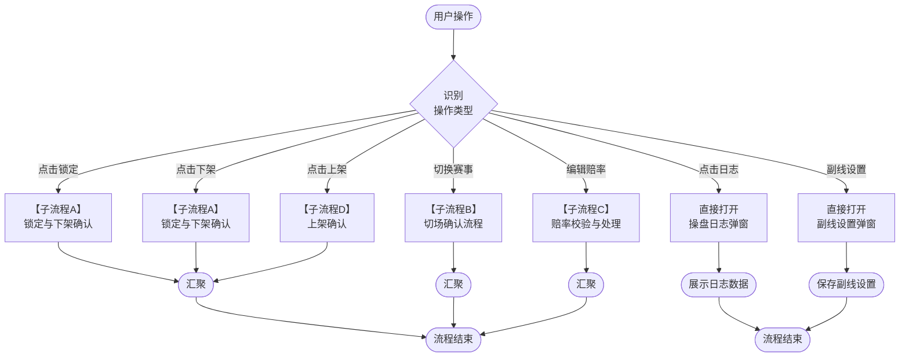
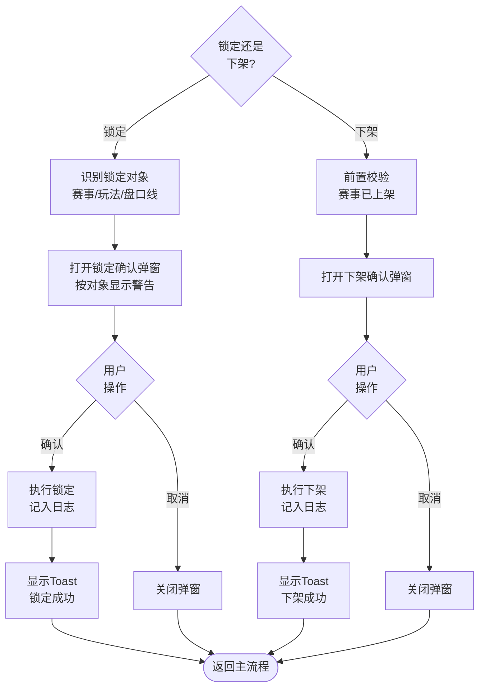
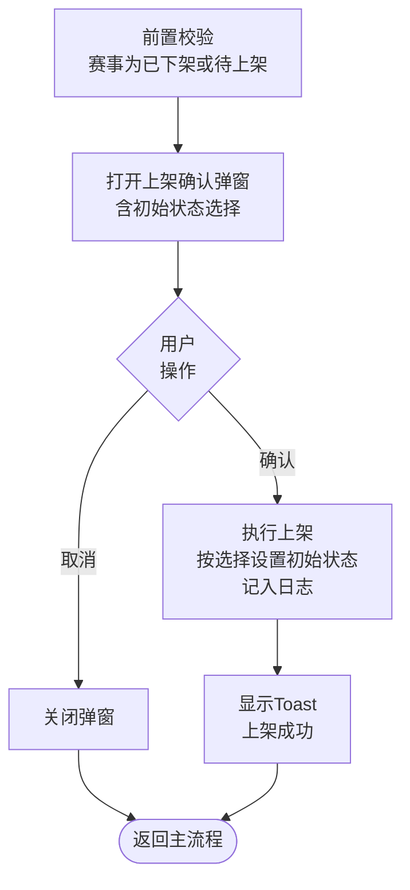
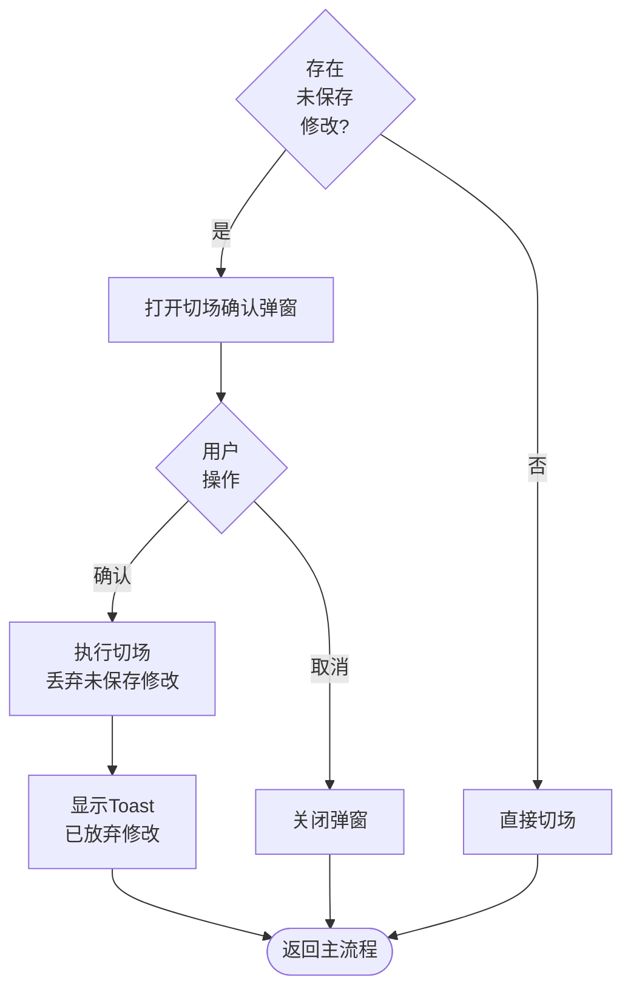
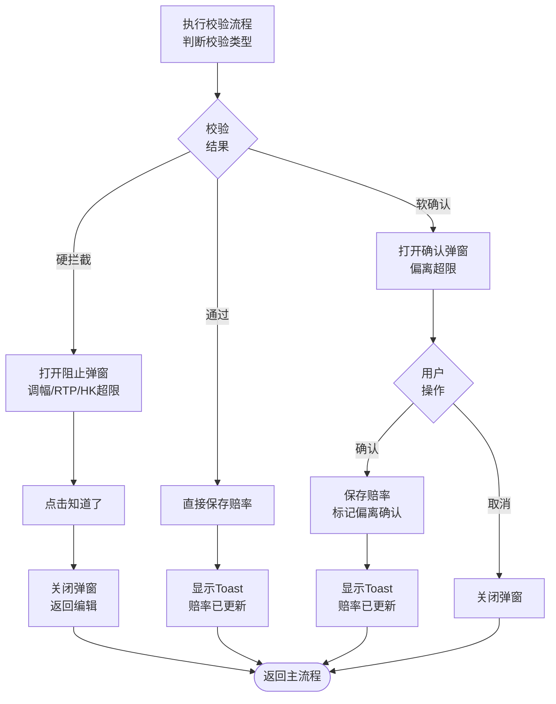

# 第13章 弹窗与模态框

> **关盘口径（2026-04-21 生效）**：关盘来源统一为数据源推送（唯一来源）；关盘 = 绝对终态，操盘页与结算详情页均不提供人工开盘入口。如数据源误推送关盘，依赖数据源再次推送开盘信号自动响应。


## 13.0 与其他章节的关系说明

本章定义操盘页所有弹窗和模态框的结构、交互规则、触发条件。

| 维度     | 相关章节                     | 本章职责                                 |
| -------- | ---------------------------- | ---------------------------------------- |
| 触发来源 | [第4章顶部栏](./04-顶部栏与赛事信息头.md)、[第6章盘口卡片](./06-盘口卡片模块.md)   | 本章定义弹窗触发后的完整交互             |
| 状态变更 | [第8章控制层级](./08-控制层级体系.md)、[第9章状态流转](./09-状态流转规则.md) | 本章定义确认弹窗的字段和校验             |
| 赔率编辑 | [第7章赔率编辑与计算](./07-赔率编辑与计算.md)          | 本章定义赔率校验弹窗                     |
| 切场行为 | [第3章左侧面板](./03-左侧赛事快捷切场面板.md)                | 本章定义切场时未保存编辑的确认弹窗       |
| 日志记录 | [操盘列表第18章操盘日志页面规范](../trading-list/18-操盘日志页面规范.md)       | 本章定义操盘页内嵌的日志弹窗（共用组件） |

---

## 13.1 弹窗分类与通用规范

### 13.1.1 弹窗类型分类

| 类型     | 尺寸            | 用途               | 示例               |
| -------- | --------------- | ------------------ | ------------------ |
| 确认弹窗 | 标准（500px宽） | 需要用户确认的操作 | 锁定确认、下架确认 |
| 表单弹窗 | 标准（500px宽） | 需要用户输入的操作 | 更换操盘手         |
| 大型弹窗 | 大型（900px宽） | 展示大量数据       | 操盘日志           |
| 轻量弹窗 | 小型（400px宽） | 简单确认或提示     | 切场确认           |

### 13.1.2 弹窗通用结构

```
┌─────────────────────────────────────────────┐
│  [图标] 弹窗标题                         ✕  │  ← 头部（modal-header）
├─────────────────────────────────────────────┤
│                                              │
│  弹窗内容区域                                │  ← 主体（modal-body）
│                                              │
├─────────────────────────────────────────────┤
│              [ 取消 ]    [ 主操作 ]          │  ← 底部（modal-footer）
└─────────────────────────────────────────────┘
```

### 13.1.3 弹窗通用交互规则

| 交互行为 | 规则                                                  |
| -------- | ----------------------------------------------------- |
| 打开方式 | 点击触发按钮，弹窗居中显示                            |
| 遮罩层   | 半透明黑色遮罩（rgba(0,0,0,0.6)），点击遮罩不关闭弹窗 |
| 关盘方式 | 点击右上角×、点击取消按钮、按ESC键                    |
| 动画效果 | 淡入缩放（300ms），淡出（200ms）                      |
| 层级     | z-index: 1000，确保在所有元素之上                     |
| 滚动     | 弹窗打开时，背景页面禁止滚动                          |
| 快捷键   | ESC关闭弹窗，其他快捷键不支持                         |

### 13.1.4 弹窗按钮规范

| 按钮类型 | 样式                      | 位置 | 说明                     |
| -------- | ------------------------- | ---- | ------------------------ |
| 取消     | 灰色边框（btn-secondary） | 左侧 | 关闭弹窗，不执行操作     |
| 主操作   | 蓝色填充（btn-primary）   | 右侧 | 执行主要操作             |
| 危险操作 | 红色填充（btn-danger）    | 右侧 | 高风险操作，如锁定、下架 |
| 阻止确认 | 蓝色填充（btn-primary）   | 居中 | 仅「知道了」，不执行操作 |

---

## 13.2 锁定确认弹窗

> **弹窗类型**：确认弹窗（标准500px宽）

### 13.2.1 触发条件

| 触发入口                       | 触发操作           | 锁定对象 | 前置校验           |
| ------------------------------ | ------------------ | -------- | ------------------ |
| 顶部栏                         | 点击「锁盘」按钮   | 赛事     | 赛事处于已上架状态 |
| 盘口卡片玩法级                 | 点击「🔒」状态按钮 | 玩法     | 当前玩法状态非锁定 |
| 盘口卡片线级（MultiLineTable） | 点击线级「🔒」按钮 | 盘口线   | 当前线状态非锁定   |

### 13.2.2 弹窗结构

```
┌─────────────────────────────────────────────┐
│  🔒 锁定确认                             ✕  │
├─────────────────────────────────────────────┤
│  ┌─────────────────────────────────────┐    │
│  │  ⚠️ 高危操作警告                     │    │
│  │  {根据锁定对象显示对应警告文案}      │    │
│  └─────────────────────────────────────┘    │
│                                              │
│  锁定对象                                    │
│  ┌─────────────────────────────────────┐    │
│  │  {赛事 / 玩法 / 盘口线}              │    │
│  └─────────────────────────────────────┘    │
│                                              │
│  对象标识                                    │
│  ┌─────────────────────────────────────┐    │
│  │  {EventId / BetTypeMarketId / LineId}│    │
│  └─────────────────────────────────────┘    │
├─────────────────────────────────────────────┤
│              [ 取消 ]    [ 确认锁定 ]        │
└─────────────────────────────────────────────┘
```

### 13.2.3 字段定义

| 字段     | 类型     | 必填 | 说明                                       |
| -------- | -------- | :--: | ------------------------------------------ |
| 锁定对象 | 只读展示 |  -   | 赛事 / 玩法 / 盘口线（按触发入口自动带入） |
| 对象标识 | 只读展示 |  -   | EventId / BetTypeMarketId / MarketlineId   |

### 13.2.4 警告文案

| 锁定对象 | 警告文案                                                     |
| -------- | ------------------------------------------------------------ |
| 赛事     | 锁定后该赛事所有盘口停止接受投注，需人工解锁才能恢复。       |
| 玩法     | 锁定后该玩法下所有可见盘口停止接受投注，需人工解锁才能恢复。 |
| 盘口线   | 锁定后该盘口线停止接受投注，需人工解锁才能恢复。             |

### 13.2.5 操作响应

| 操作     | 系统响应                                                                      |
| -------- | ----------------------------------------------------------------------------- |
| 确认锁定 | 1）执行锁定 → 2）关闭弹窗 → 3）Toast提示「锁定成功」→ 4）记入操盘日志         |
| 取消     | 关闭弹窗，不执行操作                                                          |

---

## ~~13.3 关闭确认弹窗~~

> ⚠️ **本节整节拟删除**（13.3.1 至 13.3.6 共 6 个子节约 112 行）：关盘由数据源推送触发，操盘页不提供人工关盘按钮，因此关盘确认弹窗不再存在。下方所有内容待删除。

## ~~13.3 关闭确认弹窗~~

> **弹窗类型**：确认弹窗（标准500px宽）
>
> **设计背景**：关盘为绝对终态操作（无人工开盘入口），必须经过二次确认。详见[第8章8.4.8节](./08-控制层级体系.md#_8-4-8-关盘操作说明)。

### ~~13.3.1 触发条件~~

| 触发入口                       | 触发操作           | 关盘对象 | 前置校验           |
| ------------------------------ | ------------------ | -------- | ------------------ |
| 盘口卡片头部（玩法级）         | 点击「⏹关盘」按钮 | 玩法     | 当前玩法状态非关盘。适用于 SingleLineTable/Matrix/LongList 渲染器 |
| 盘口卡片线级（MultiLineTable） | 点击线级「⏹」按钮 | 盘口线   | 当前线状态非关盘   |

> **注意**：赛事级不提供关盘按钮（见[第 8 章 控制层级体系](./08-控制层级体系.md)关盘粒度规定）。关盘粒度跟随结算粒度。

### ~~13.3.2 弹窗结构~~

```
┌─────────────────────────────────────────────────────────────────┐
│  ⚠️ 确认关盘                                                 ✕  │
├─────────────────────────────────────────────────────────────────┤
│  ┌─────────────────────────────────────────────────────────┐   │
│  │  ⚠️ 高危操作警告                                         │   │
│  │  关盘后操盘页内无法恢复，请确认操作！                     │   │
│  └─────────────────────────────────────────────────────────┘   │
│                                                                  │
│  您确定要关盘此 {玩法} 吗？                                       │
│                                                                  │
│  此操作将：                                                       │
│  • 关盘该 {玩法} 下所有盘口                                       │
│  • 影响 {X} 个盘口                                                │
│  • 关盘 = 绝对终态，无人工开盘入口                             │
│                                                                  │
├─────────────────────────────────────────────────────────────────┤
│                         [ 取消 ]    [ 确认关盘 ]                  │
└─────────────────────────────────────────────────────────────────┘
```

### ~~13.3.3 字段定义~~

| 字段     | 类型     | 说明                                       |
| -------- | -------- | ------------------------------------------ |
| 关盘对象 | 只读展示 | 玩法（按触发入口自动带入）                  |
| 对象标识 | 只读展示 | EventId / BetTypeMarketId                  |
| 影响数量 | 只读展示 | 显示将被关盘的盘口数量                     |

### ~~13.3.4 操作响应~~

| 操作     | 系统响应                                                                      |
| -------- | ----------------------------------------------------------------------------- |
| 确认关盘 | 1）执行关盘 → 2）关闭弹窗 → 3）Toast提示「已关盘」→ 4）记入操盘日志           |
| 取消     | 关闭弹窗，不执行操作                                                          |

### ~~13.3.5 关盘后状态联动（玩法级）~~

| 联动项                   | 变更内容           |
| ------------------------ | ------------------ |
| 该玩法下所有盘口         | 变为「关盘」（操盘页终态） |
| 下级层级（线/选项）      | 强制继承关盘状态   |
| 操作按钮                 | 全部隐藏，无可用操作 |
| 客户端可见性             | 不可见             |

### ~~13.3.6 线级关闭弹窗（仅MultiLineTable）~~

**弹窗结构**：

```
┌─────────────────────────────────────────────────────────────────┐
│  ⚠️ 确认关盘盘口线                                           ✕  │
├─────────────────────────────────────────────────────────────────┤
│  ┌─────────────────────────────────────────────────────────┐   │
│  │  ⚠️ 高危操作警告                                         │   │
│  │  关盘后操盘页内无法恢复，请确认操作！                     │   │
│  └─────────────────────────────────────────────────────────┘   │
│                                                                  │
│  您确定要关盘盘口线「{线值}」吗？                                │
│                                                                  │
│  此操作将：                                                       │
│  • 关盘该盘口线下所有选项（共 {X} 个选项）                       │
│  • 关盘 = 绝对终态，无人工开盘入口                             │
│  • 不影响同玩法下的其他盘口线                                     │
│                                                                  │
├─────────────────────────────────────────────────────────────────┤
│                         [ 取消 ]    [ 确认关盘 ]                  │
└─────────────────────────────────────────────────────────────────┘
```

**字段定义**：

| 字段         | 类型     | 说明                                       |
| ------------ | -------- | ------------------------------------------ |
| 盘口线标识   | 只读展示 | 显示当前要关盘的盘口线值（如「-0.5」）     |
| 影响选项数   | 只读展示 | 该盘口线下的选项数量（通常为2个）          |
| 作用范围说明 | 只读展示 | 明确告知只影响该线，不影响同玩法其他盘口线 |

**操作响应**：

| 操作     | 系统响应                                                                        |
| -------- | ------------------------------------------------------------------------------- |
| 确认关盘 | 1）执行关盘 → 2）关闭弹窗 → 3）Toast提示「盘口线已关盘」→ 4）记入操盘日志       |
| 取消     | 关闭弹窗，不执行操作                                                            |

**关盘后状态联动（线级）**：

| 联动项             | 变更内容                   |
| ------------------ | -------------------------- |
| 该盘口线下所有选项 | 变为「关盘」（操盘页终态） |
| 同玩法其他盘口线   | 不受影响                   |
| 玩法状态汇总显示   | 若存在开盘线则显示「开盘（部分）」 |
| 操作按钮           | 该线所有按钮隐藏，无可用操作 |
| 客户端可见性       | 该线不可见                 |

---

## 13.4 下架赛事确认弹窗

> **弹窗类型**：确认弹窗（标准500px宽）

### 13.4.1 触发条件

| 触发入口 | 触发操作         | 前置校验           |
| -------- | ---------------- | ------------------ |
| 顶部栏   | 点击「下架」按钮 | 赛事处于已上架状态 |

### 13.4.2 弹窗结构

```
┌─────────────────────────────────────────────┐
│  ⬇️ 下架赛事确认                         ✕  │
├─────────────────────────────────────────────┤
│  ┌─────────────────────────────────────┐    │
│  │  ⚠️ 下架操作警告                     │    │
│  │  下架后：                            │    │
│  │  • 所有盘口将变为「隐藏」状态        │    │
│  │    （客户端不可见）                  │    │
│  │  • 已接受的注单正常结算              │    │
│  │  • 必须人工重新上架才能恢复          │    │
│  └─────────────────────────────────────┘    │
│                                              │
│  当前赛事                                    │
│  ┌─────────────────────────────────────┐    │
│  │  曼城 vs 利物浦  #48291037           │    │
│  │  英超 · 下半场 67' · 比分 2-1        │    │
│  └─────────────────────────────────────┘    │
├─────────────────────────────────────────────┤
│              [ 取消 ]    [ 确认下架 ]        │
└─────────────────────────────────────────────┘
```

### 13.4.3 字段定义

| 字段     | 类型     | 必填 | 选项 | 说明                                 |
| -------- | -------- | :--: | ---- | ------------------------------------ |
| 当前赛事 | 只读展示 |  -   | -    | 显示赛事名称、编号、联赛、进程、比分 |

### 13.4.4 下架后状态联动

| 联动项       | 变更内容       |
| ------------ | -------------- |
| 所有盘口状态 | 变为「隐藏」（隐藏来源=system，详情=delist_link） |
| 上架状态     | 变为「已下架」 |
| 客户端可见性 | 不可见（与隐藏定义一致） |

---

## 13.4A 上架赛事确认弹窗

> **弹窗类型**：确认弹窗（标准500px宽）

### 13.4A.1 触发条件

| 触发入口 | 触发操作         | 前置校验           |
| -------- | ---------------- | ------------------ |
| 顶部栏   | 点击「上架」按钮 | 赛事处于已下架或待上架状态 |

### 13.4A.2 弹窗结构

```
┌─────────────────────────────────────────────┐
│  ⬆️ 上架赛事确认                         ✕  │
├─────────────────────────────────────────────┤
│  当前赛事                                    │
│  ┌─────────────────────────────────────┐    │
│  │  曼城 vs 利物浦  #48291037           │    │
│  │  英超 · 赛前 · 开赛时间 20:00        │    │
│  └─────────────────────────────────────┘    │
│                                              │
│  初始盘口状态                                │
│  ┌─────────────────────────────────────┐    │
│  │  ◉ 跟随数据源（推荐）               │    │
│  │    上架后盘口跟随IM状态，可立即投注  │    │
│  │  ○ 锁定                              │    │
│  │    盘口可见但暂停投注，需手动解锁    │    │
│  │  ○ 隐藏                              │    │
│  │    盘口对玩家不可见，需手动取消隐藏  │    │
│  └─────────────────────────────────────┘    │
├─────────────────────────────────────────────┤
│              [ 取消 ]    [ 确认上架 ]        │
└─────────────────────────────────────────────┘
```

### 13.4A.3 字段定义

| 字段         | 类型     | 必填 | 选项                           | 默认值       | 说明                                 |
| ------------ | -------- | :--: | ------------------------------ | ------------ | ------------------------------------ |
| 当前赛事     | 只读展示 |  -   | -                              | -            | 显示赛事名称、编号、联赛、进程       |
| 初始盘口状态 | 单选Radio|  是  | 跟随数据源 / 锁定 / 隐藏       | 跟随数据源   | 上架后所有盘口的初始状态             |

### 13.4A.4 上架后状态联动

| 选择                   | 上架状态 | 盘口本地状态 | 隐藏来源 | C端展示                                          |
| ---------------------- | -------- | ------------ | -------- | ------------------------------------------------ |
| 跟随数据源（默认）     | 已上架   | 开盘         | -        | 由IM状态决定（IM开盘→可投注，IM暂停→暂停投注）   |
| 锁定                   | 已上架   | 锁定         | -        | 暂停投注（可见灰显）                             |
| 隐藏                   | 已上架   | 隐藏         | manual   | 不可见                                           |

**重新上架**：已下架赛事重新上架时，同样弹出本弹窗。已下架期间的隐藏标记（隐藏来源=system，详情=delist_link）在上架时按选择覆盖。

---

## 13.5 操盘日志弹窗

> **弹窗类型**：大型弹窗（900px宽）
>
> **组件共用说明**：本弹窗组件同时用于操盘列表页和操盘详情页，仅入口不同，筛选项、字段定义、交互规则完全一致。详细日志类型定义见[操盘列表第18章操盘日志页面规范](../trading-list/18-操盘日志页面规范.md)。

### 13.5.1 触发条件

| 触发入口               | 触发操作 | 自动筛选                  |
| ---------------------- | -------- | ------------------------- |
| 盘口卡片📋图标         | 点击图标 | 自动筛选当前赛事+当前盘口 |
| 顶部栏「操盘日志」按钮 | 点击按钮 | 自动筛选当前赛事          |
| 操盘列表「查看日志」   | 右键菜单 | 自动筛选当前赛事          |

### 13.5.2 弹窗结构

```
┌─────────────────────────────────────────────────────────────────────────────┐
│  📋 操盘日志                                                             ✕  │
├─────────────────────────────────────────────────────────────────────────────┤
│  时间范围: [今天▼]  操作类型: [全部▼]  操作来源: [全部▼]  盘口ID: [____]   │
│  [🔍 查询]  [📥 导出]                                                       │
├─────────────────────────────────────────────────────────────────────────────┤
│  时间      │ 操作类型     │ 盘口       │ 操作详情              │ 操作人 │ 来源   │
│────────────┼──────────────┼────────────┼───────────────────────┼────────┼────────│
│  18:45:32  │ 赔率调整     │ 全场让球   │ 主队(-0.5) 0.90→0.92  │ 张三   │ 人工   │
│  18:44:15  │ 赔率调整     │ 全场让球   │ 客队(+0.5) 0.90→0.88  │ 数据源 │ 数据源 │
│  18:42:08  │ 状态变更     │ 角球大小   │ 开盘→暂停(数据源延迟) │ 系统   │ 数据源 │
│  18:40:00  │ 数据源开关变更│ 全场让球   │ 数据源 开启 → 关盘    │ 张三   │ 人工   │
│  18:35:22  │ 返奖率调整   │ 全场大小   │ 98.0% → 97.2%         │ 张三   │ 人工   │
├─────────────────────────────────────────────────────────────────────────────┤
│  共 156 条记录，第 1/16 页                      [上一页] [下一页]           │
└─────────────────────────────────────────────────────────────────────────────┘
```

### 13.5.3 筛选条件

| 筛选项   | 类型     | 选项                                                                                                           | 默认值 |
| -------- | -------- | -------------------------------------------------------------------------------------------------------------- | ------ |
| 时间范围 | 下拉选择 | 最近1小时、今天、最近3天、自定义 | 今天（系统级写死，修改需发版） |
| 操作类型 | 下拉选择 | 全部、状态变更、赔率调整、返奖率调整、数据源开关变更、副线显示设置、操盘手变更                                 | 全部   |
| 操作来源 | 下拉选择 | 全部、人工、批量、数据源自动、数据源、风控、系统、上级联动、数据源维护、赛事事件                               | 全部   |
| 盘口ID   | 文本输入 | 模糊搜索                                                                                                       | 空     |

> **自定义时间范围说明**：选择「自定义」时，显示起始时间和结束时间输入框，支持精确到秒的时间范围设置（格式：YYYY-MM-DD HH:mm:ss），便于精确定位特定时间段的操盘日志。

> **规范说明**：操作来源枚举的规范定义为[操盘列表第18章18.3.2节](../trading-list/18-操盘日志页面规范.md#_18-3-2-操作来源枚举)。

### 13.5.4 日志列表字段

| 字段     | 说明         | 精度/格式                              | 示例                        |
| -------- | ------------ | -------------------------------------- | --------------------------- |
| 时间     | 操作时间     | 精确到毫秒（展示截到秒，导出保留毫秒） | 18:45:32                    |
| 操作类型 | 操作分类     | 彩色标签                               | 赔率调整                    |
| 盘口     | 玩法名称     | -                                      | 全场让球                    |
| 操作详情 | 具体变更内容 | -                                      | 主队(-0.5) 赔率 0.90 → 0.92 |
| 操作人   | 执行人或系统 | -                                      | 张三/数据源/系统            |
| 来源     | 触发来源     | 彩色标签                               | 人工                        |

### 13.5.5 操作类型标签样式

| 操作类型       | 标签颜色 | 说明                    |
| -------------- | -------- | ----------------------- |
| 状态变更       | 蓝色     | 开盘/隐藏/锁定/关盘     |
| 赔率调整       | 绿色     | 手动或数据源同步赔率    |
| 返奖率调整     | 橙色     | RTP调整                 |
| 数据源开关变更 | 紫色     | 数据源开启/关盘         |
| 副线显示设置   | 灰色     | 显示/隐藏副线           |
| 操盘手变更     | 灰色     | 更换操盘手              |

### 13.5.6 操作来源标签样式

> **规范说明**：操作来源枚举的规范定义为[操盘列表第18章18.3.2节](../trading-list/18-操盘日志页面规范.md#_18-3-2-操作来源枚举)。

| 来源标识       | 显示名称   | 标签颜色 | 说明                       |
| -------------- | ---------- | -------- | -------------------------- |
| manual         | 人工       | 蓝色     | 操盘手手动操作             |
| batch          | 批量       | 蓝色     | 前端批量选择后执行         |
| ao             | 数据源自动 | 绿色     | 自动跟盘机制触发           |
| data_source    | 数据源     | 橙色     | IM数据源推送触发           |
| risk_control   | 风控       | 红色     | 风控规则触发               |
| system         | 系统       | 灰色     | 系统自动处理               |
| inherit        | 上级联动   | 紫色     | 上级状态继承触发           |
| maintenance    | 数据源维护 | 紫色     | IM推送维护标记触发         |
| event_incident | 赛事事件   | 黄色     | 进球/红牌/VAR等事件触发    |

### 13.5.7 权限说明

| 操作项   | 超管 | 运营 | 风控 | 操盘手 |
|---------|------|------|------|--------|
| 查看日志 | ✔    | ✔    | ✔    | ✔      |
| 筛选日志 | ✔    | ✔    | ✔    | ✔      |
| 导出日志 | ✔    | ✔    | ✔    | ✔      |

说明：所有角色均可查看、筛选、导出操盘日志。

---

### 13.5.8 分页与导出规则

| 参数     | 值             | 说明                 |
| -------- | -------------- | -------------------- |
| 每页条数 | 10条           | 固定                 |
| 最大导出 | 1000条         | 超出提示缩小时间范围 |
| 导出格式 | Excel（.xlsx） | 导出保留毫秒精度     |

---

## 13.6 分配/更换操盘手弹窗

> **弹窗类型**：表单弹窗（标准500px宽）
>
> **规范引用**：本弹窗与操盘列表页使用完全相同的组件，详见[操盘列表第11章11.6节操盘手分配弹窗（规范）](../trading-list/11-操作流程说明.md#_11-6-操盘手分配弹窗-ssot)。

### 13.6.1 触发条件

| 触发入口 | 触发操作               | 前置校验           | 权限要求     |
| -------- | ---------------------- | ------------------ | ------------ |
| 顶部栏   | 点击「更换操盘手」按钮 | 赛事处于已上架状态 | 仅主管/风控  |

### 13.6.2 弹窗结构

统一采用按玩法分配的穿梭框模式，通过阶段切换分别配置赛前和滚球操盘手：

```
┌─────────────────────────────────────────────────────────────────────┐
│  分配操盘手                                                       ✕  │
├─────────────────────────────────────────────────────────────────────┤
│  当前赛事：曼城 vs 利物浦 #48291037                                   │
├─────────────────────────────────────────────────────────────────────┤
│  阶段选择                                                           │
│  ┌───────────────┐ ┌───────────────┐                               │
│  │ ● 赛前        │ │ ○ 滚球        │                               │
│  └───────────────┘ └───────────────┘                               │
├─────────────────────────────────────────────────────────────────────┤
│  玩法汇总：共 8 个玩法  |  已分配 5 个  |  待分配 3 个               │
├─────────────────────────────────────────────────────────────────────┤
│                                                                     │
│  ┌───────────────────┐                ┌───────────────────┐        │
│  │ 待分配玩法 (3)    │                │ 已分配玩法 (5)    │        │
│  ├───────────────────┤                ├───────────────────┤        │
│  │ ☐ 让球盘          │                │ 独赢盘 → 张三     │        │
│  │ ☐ 大小球          │   ─[张三▼]─>   │ 波胆 → 张三       │        │
│  │ ☐ 角球大小        │   <──────────  │ 半场全场 → 李四   │        │
│  └───────────────────┘                └───────────────────┘        │
│                                                                     │
│  [ 从联赛默认导入 ]  [ 复制赛前配置到滚球 ]                          │
├─────────────────────────────────────────────────────────────────────┤
│  操盘手统计                                                         │
│  ┌─────────────────────────────────────────────────────────────┐   │
│  │ 张三: 2个玩法  |  李四: 2个玩法  |  王五: 1个玩法            │   │
│  └─────────────────────────────────────────────────────────────┘   │
├─────────────────────────────────────────────────────────────────────┤
│                  [ 取消 ]              [ 确认分配 ]                 │
└─────────────────────────────────────────────────────────────────────┘
```

> 完整交互规则详见[操盘列表第11章11.6节操盘手分配弹窗（规范）](../trading-list/11-操作流程说明.md#_11-6-操盘手分配弹窗-ssot)。

### 13.6.3 特殊场景处理

| 场景                   | 处理规则                                               |
| ---------------------- | ------------------------------------------------------ |
| 赛事已进入滚球阶段     | 赛前阶段页签禁用（灰色），仅允许修改滚球阶段的分配     |
| 玩法无投注             | 正常显示，可修改                                       |
| 当前用户是普通操盘手   | 按钮不显示（仅主管/风控可见）                          |

### 13.6.4 操作响应

| 操作     | 系统响应                                                                                     |
| -------- | -------------------------------------------------------------------------------------------- |
| 确认分配 | 1）校验全覆盖 → 2）执行更换 → 3）关闭弹窗 → 4）Toast「操盘手已更换」→ 5）记入操盘日志        |
| 取消     | 关闭弹窗，不执行操作                                                                         |
| 校验失败 | 待分配玩法列表高亮，提示「请为所有玩法分配操盘手」                                           |

## 13.7 切场确认弹窗

> **弹窗类型**：轻量弹窗（小型400px宽）

### 13.7.1 触发条件

当操盘手在左侧赛事面板点击切换到其他赛事时，若当前赛事存在未保存的编辑，触发此弹窗。

| 未保存编辑类型         |  触发切场确认  |
| ---------------------- | :------------: |
| 赔率编辑框处于激活状态 |       是       |
| 有赔率修改未提交       |       是       |
| 有状态变更未确认       |       是       |
| 无任何未保存编辑       | 否（直接切场） |

### 13.7.2 弹窗结构

```
┌─────────────────────────────────────────────┐
│  ⚠️ 切换赛事确认                         ✕  │
├─────────────────────────────────────────────┤
│                                              │
│  当前赛事存在未保存的修改：                  │
│                                              │
│  • 全场让球 主队(-0.5) 赔率编辑中            │
│  • 全场大小 大2.5 赔率 0.95 → 0.98          │
│                                              │
│  切换赛事后，这些修改将丢失。                │
│                                              │
├─────────────────────────────────────────────┤
│  [ 返回编辑 ]  [ 放弃修改并切换 ]            │
└─────────────────────────────────────────────┘
```

### 13.7.3 字段定义

| 字段           | 类型     | 说明                   |
| -------------- | -------- | ---------------------- |
| 未保存修改列表 | 动态列表 | 列出所有未保存的修改项 |

### 13.7.4 操作响应

| 操作           | 系统响应                                                |
| -------------- | ------------------------------------------------------- |
| 返回编辑       | 关闭弹窗，保持当前赛事，用户继续编辑                    |
| 放弃修改并切换 | 1）丢弃所有未保存修改 → 2）关闭弹窗 → 3）切换到目标赛事 |
| 点击×          | 等同于「返回编辑」                                      |
| 按ESC          | 等同于「返回编辑」                                      |

---

## 13.8 赔率调整校验弹窗

> **弹窗类型**：确认弹窗（标准500px宽）

### 13.8.1 校验类型分类

赔率编辑时的校验分为两类：

| 类型                 | 处理方式                                     | 触发条件                          |
| -------------------- | -------------------------------------------- | --------------------------------- |
| 硬拦截（阻止保存）   | 弹窗提示「被阻止」，仅「知道了」按钮，不保存 | 单次调幅超限、RTP超限、HK范围超限 |
| 软确认（确认后保存） | 弹窗提示「需确认」，可选择确认保存或取消     | 偏离IM超限                        |

### 13.8.2 硬拦截阈值

| 校验项     |    阈值     | 配置归属 | 说明                          |
| ---------- | :---------: | -------- | ----------------------------- |
| 单次调幅   | > 0.20(HK)  | 系统写死 | 新HK - 旧HK超过此值阻止保存   |
| RTP下限    | < 85%       | 系统写死 | 低于此值阻止保存              |
| RTP上限    | > 99%       | 系统写死 | 高于此值阻止保存              |
| HK赔率下限 | < 0.01(HK)  | 系统写死 | 低于此值阻止保存              |
| HK赔率上限 | > 50.00(HK) | 系统写死 | 高于此值阻止保存              |

### 13.8.3 软确认阈值

> **阈值逻辑说明**：告警阈值(0.10) < 确认阈值(0.15)。偏离达到0.10时打告警标签；偏离达到0.15时弹出确认弹窗。

| 校验项         |    阈值     | 配置归属 | 说明                             |
| -------------- | :---------: | -------- | -------------------------------- |
| 偏离IM告警阈值 | ≥ 0.10(HK)  | 风控管理 | 达到此值打告警标签，不弹窗       |
| 偏离IM确认阈值 | ≥ 0.15(HK)  | 风控管理 | 达到此值弹出确认弹窗（软确认）   |

### 13.8.4 弹窗结构（硬拦截—调幅超限）

```
┌─────────────────────────────────────────────┐
│  🚫 赔率调整被阻止                       ✕  │
├─────────────────────────────────────────────┤
│  ┌─────────────────────────────────────┐    │
│  │  🚫 单次调幅超过允许范围             │    │
│  │  调整幅度 0.25 超过限制 0.20         │    │
│  └─────────────────────────────────────┘    │
│                                              │
│  调整详情                                    │
│  ┌─────────────────────────────────────┐    │
│  │  盘口：全场让球 主队(-0.5)           │    │
│  │  原赔率：0.92                         │    │
│  │  目标赔率：1.17                       │    │
│  │  调整幅度：+0.25（超过限制 0.20）    │    │
│  └─────────────────────────────────────┘    │
│                                              │
│  请缩小调整幅度后重新编辑                   │
├─────────────────────────────────────────────┤
│                      [ 知道了 ]              │
└─────────────────────────────────────────────┘
```

### 13.8.5 弹窗结构（硬拦截—RTP超限）

```
┌─────────────────────────────────────────────┐
│  🚫 赔率调整被阻止                       ✕  │
├─────────────────────────────────────────────┤
│  ┌─────────────────────────────────────┐    │
│  │  🚫 返奖率超出允许范围               │    │
│  │  调整后RTP 84.2% 低于下限 85%        │    │
│  └─────────────────────────────────────┘    │
│                                              │
│  调整详情                                    │
│  ┌─────────────────────────────────────┐    │
│  │  盘口：全场让球                       │    │
│  │  当前RTP：97.2%                       │    │
│  │  调整后RTP：84.2%                     │    │
│  │  允许范围：85% - 99%                  │    │
│  └─────────────────────────────────────┘    │
│                                              │
│  请调整赔率使RTP处于允许范围内              │
├─────────────────────────────────────────────┤
│                      [ 知道了 ]              │
└─────────────────────────────────────────────┘
```

### 13.8.6 弹窗结构（硬拦截—HK范围超限）

```
┌─────────────────────────────────────────────┐
│  🚫 赔率调整被阻止                       ✕  │
├─────────────────────────────────────────────┤
│  ┌─────────────────────────────────────┐    │
│  │  🚫 赔率超出允许范围                 │    │
│  │  目标赔率 52.50 超过上限 50.00       │    │
│  └─────────────────────────────────────┘    │
│                                              │
│  调整详情                                    │
│  ┌─────────────────────────────────────┐    │
│  │  盘口：全场大小 小0.5                 │    │
│  │  原赔率：48.00                        │    │
│  │  目标赔率：52.50                      │    │
│  │  允许范围：0.01 - 50.00               │    │
│  └─────────────────────────────────────┘    │
│                                              │
│  请调整赔率至允许范围内                     │
├─────────────────────────────────────────────┤
│                      [ 知道了 ]              │
└─────────────────────────────────────────────┘
```

### 13.8.7 弹窗结构（软确认—偏离IM超限）

```
┌─────────────────────────────────────────────┐
│  ⚠️ 赔率调整确认                         ✕  │
├─────────────────────────────────────────────┤
│  ┌─────────────────────────────────────┐    │
│  │  ⚠️ 与IM偏离超过安全阈值             │    │
│  │  本地赔率与IM偏离 0.18 超过限制 0.15 │    │
│  └─────────────────────────────────────┘    │
│                                              │
│  调整详情                                    │
│  ┌─────────────────────────────────────┐    │
│  │  盘口：全场让球 主队(-0.5)           │    │
│  │  IM赔率：0.92                         │    │
│  │  本地赔率：1.10                       │    │
│  │  偏离值：+0.18                        │    │
│  └─────────────────────────────────────┘    │
│                                              │
│  确认继续调整？                              │
├─────────────────────────────────────────────┤
│              [ 取消 ]    [ 确认调整 ]        │
└─────────────────────────────────────────────┘
```

### 13.8.8 操作响应

| 场景                      | 操作     | 系统响应                                   |
| ------------------------- | -------- | ------------------------------------------ |
| 硬拦截（调幅/RTP/HK超限） | 知道了   | 关闭弹窗，**不保存赔率**，用户需重新编辑   |
| 软确认（偏离超限）        | 确认调整 | 保存赔率，记入操盘日志（标记「偏离确认」） |
| 软确认（偏离超限）        | 取消     | 关闭弹窗，不保存赔率                       |

---

## 13.8.9 赔率变更确认弹窗

> **弹窗类型**：确认弹窗（标准480px宽）
>
> **说明**：赔率编辑完成后（按Enter键或失焦）触发，用于二次确认赔率变更。行业通用做法，避免误操作导致赔率异常。

### 触发条件

| 触发入口     | 触发操作                       | 前置条件                   |
| ------------ | ------------------------------ | -------------------------- |
| 盘口卡片赔率 | 编辑赔率后按Enter键            | 新赔率与原赔率不同         |
| 盘口卡片赔率 | 编辑赔率后失焦（点击其他区域） | 新赔率与原赔率不同且有效   |

### 弹窗结构

```
┌─────────────────────────────────────────────────┐
│  ⚠️ 赔率变更确认                             ✕  │
├─────────────────────────────────────────────────┤
│  ┌─────────────────────────────────────────┐    │
│  │  ⚠️ 赔率变更将立即生效                   │    │
│  │  修改后的赔率将实时推送至前端，已提交的  │    │
│  │  注单不受影响，新注单将使用新赔率。      │    │
│  └─────────────────────────────────────────┘    │
│                                                  │
│  变更详情                                        │
│  ┌─────────────────────────────────────────┐    │
│  │         原赔率    →    新赔率            │    │
│  │          0.92     →    0.88              │    │
│  │                                          │    │
│  │  变动幅度：-0.04 (-4.3%)                 │    │
│  │  玩法：让球 -0.5                         │    │
│  │  选项：主队 曼城                         │    │
│  └─────────────────────────────────────────┘    │
│                                                  │
│  RTP影响                                         │
│  ┌─────────────────────────────────────────┐    │
│  │  配对选项赔率将自动调整                  │    │
│  │  客队 +0.5: 0.92 → 0.98                  │    │
│  │  调整后RTP: 95.0% (目标值)               │    │
│  └─────────────────────────────────────────┘    │
├─────────────────────────────────────────────────┤
│              [ 取消 ]    [ 确认变更 ]            │
└─────────────────────────────────────────────────┘
```

### 字段定义

| 字段         | 说明                                     | 来源       |
| ------------ | ---------------------------------------- | ---------- |
| 原赔率       | 变更前的本地赔率（HK格式）               | 编辑前值   |
| 新赔率       | 用户输入的新赔率（HK格式）               | 用户输入   |
| 变动幅度     | 新赔率 - 原赔率，同时显示百分比          | 计算值     |
| 玩法         | 当前编辑的玩法名称                       | 盘口数据   |
| 选项         | 当前编辑的选项名称                       | 盘口数据   |
| 配对选项调整 | 2选项玩法时显示配对选项的自动调整预览    | 配对计算   |
| 调整后RTP    | 变更后的实际RTP                          | RTP计算    |

### 操作响应

| 操作     | 系统响应                                                       |
| -------- | -------------------------------------------------------------- |
| 确认变更 | 保存新赔率，自动调整配对选项，记入操盘日志，显示成功Toast      |
| 取消     | 关闭弹窗，恢复原赔率，不保存                                   |
| ESC键    | 同取消                                                         |

---

## 13.9 副线显示设置弹窗

> **弹窗类型**：表单弹窗（标准500px宽）

### 13.9.1 触发条件

| 触发入口 | 触发操作                                            |
| -------- | --------------------------------------------------- |
| 盘口卡片 | 点击「显示/隐藏副线」按钮（仅MultiLineTable渲染器） |

### 13.9.2 弹窗结构

```
┌─────────────────────────────────────────────┐
│  👁️ 副线显示设置                        ✕  │
├─────────────────────────────────────────────┤
│                                              │
│  全场让球 (共5条盘口线)                      │
│                                              │
│  ┌─────────────────────────────────────┐    │
│  │  ☑ -0.5 / +0.5  【主】 ¥186,200     │    │
│  │  ☑ -0.75 / +0.75       ¥42,300      │    │
│  │  ☐ -1 / +1             ¥12,100      │    │
│  │  ☐ -1.25 / +1.25       ¥5,600       │    │
│  │  ☐ -1.5 / +1.5         ¥2,300       │    │
│  └─────────────────────────────────────┘    │
│                                              │
│  💡 主力线不可隐藏                           │
│                                              │
├─────────────────────────────────────────────┤
│  [ 全选 ]  [ 仅主力线 ]        [ 确定 ]     │
└─────────────────────────────────────────────┘
```

### 13.9.3 字段定义

| 字段       | 类型       | 说明                                 |
| ---------- | ---------- | ------------------------------------ |
| 玩法名称   | 只读展示   | 当前玩法名称和线数                   |
| 盘口线列表 | 复选框列表 | 每条线显示盘口值、主力线标记、投注额 |

### 13.9.4 显示规则

| 规则               | 说明                                 |
| ------------------ | ------------------------------------ |
| 主力线不可隐藏     | 主力线复选框禁用，始终勾选           |
| 副线可隐藏         | 副线复选框可取消勾选                 |
| 隐藏仅影响操盘视图 | 不影响客户端展示、投注接受、结算     |
| 不改变线结构       | 本期不支持增线/删线/改线，线由IM决定 |

**协作边界说明**：副线显示/隐藏为【个人视图偏好】仅保存在本机浏览器LocalStorage；不在账号/服务器侧同步，不影响其他操盘手视图。

### 13.9.5 存储口径

| 参数      | 值                                                      | 说明                                       |
| --------- | ------------------------------------------------------- | ------------------------------------------ |
| 存储方式  | 浏览器 LocalStorage                                     | 仅本机生效，不跨设备同步                   |
| Key格式   | `line_visibility:{operator_id}:{event_id}:{bettype_id}` | operator_id为当前登录用户ID，由前端全局状态获取 |
| Value格式 | `{ visible_line_ids: [...] }`                           | 主力线ID必须恒在，不可被移除               |

### 13.9.6 快捷操作

| 按钮     | 功能                           |
| -------- | ------------------------------ |
| 全选     | 勾选所有盘口线（显示全部）     |
| 仅主力线 | 仅保留主力线勾选，隐藏所有副线 |

---

## 13.10 弹窗触发与交互流程图

> **规范说明**：赔率编辑校验规则（硬拦截/软确认/通过）的规范定义为[第7章7.9节](./07-赔率编辑与计算.md)。本流程图仅展示校验结果触发哪种弹窗，不定义校验逻辑本身。

### 主流程



### 子流程A：锁定与下架确认



### 子流程D：上架确认



### 子流程B：切场确认流程



### 子流程C：赔率校验与处理



---

## 13.11 Toast提示规范

弹窗操作完成后，通过Toast提示用户操作结果。

### 13.11.1 Toast类型

| 类型 | 图标 | 背景色 | 使用场景 |
| ---- | ---- | ------ | -------- |
| 成功 | ✓    | 绿色   | 操作成功 |
| 警告 | ⚠️   | 橙色   | 需要注意 |
| 错误 | ✕    | 红色   | 操作失败 |
| 信息 | ℹ️   | 蓝色   | 一般提示 |

### 13.11.2 Toast显示规则

| 参数     | 值                                 |
| -------- | ---------------------------------- |
| 显示位置 | 屏幕右上角                         |
| 显示时长 | 3秒后自动消失                      |
| 最大堆叠 | 最多同时显示3条，新Toast从上方插入 |
| ~~手动关盘~~ | ~~可点击Toast关盘~~                    |

### 13.11.3 各弹窗对应Toast

| 弹窗操作         | Toast类型 | Toast文案                          |
| ---------------- | --------- | ---------------------------------- |
| 赛事级锁定成功   | 警告      | 赛事已锁定，所有盘口停止接受投注   |
| 玩法级锁定成功   | 警告      | 玩法已锁定，该玩法盘口停止接受投注 |
| 盘口线级锁定成功 | 警告      | 盘口线已锁定，该线停止接受投注     |
| ~~玩法级关盘成功~~ ⚠️拟改为"玩法级数据源推送关盘"   | 警告      | 玩法已关盘（绝对终态，无人工开盘入口） |
| ~~盘口线级关盘成功~~ ⚠️拟改为"盘口线级数据源推送关盘" | 警告      | 盘口线已关盘（绝对终态，无人工开盘入口） |
| 下架成功         | 警告      | 赛事已下架，所有盘口已隐藏         |
| 上架成功         | 成功      | 赛事已上架                         |
| 更换操盘手成功   | 成功      | 操盘手已更换                       |
| 副线设置保存成功 | 成功      | 副线显示设置已保存                 |
| 赔率调整成功     | 成功      | 赔率已更新                         |
| 赔率偏离确认保存 | 警告      | 赔率已更新（偏离IM已确认）         |
| 切场放弃修改     | 信息      | 已放弃未保存的修改                 |

> **硬拦截场景说明**：硬拦截（调幅/RTP/HK超限）场景仅弹窗提示，点击「知道了」后**不显示Toast**，避免信息重复。
| 操作失败         | 错误      | 操作失败，请重试                   |

---

## 13.12 风控设置弹窗

> **规范定义**：限额体系的完整定义详见[风控管理第2-5章](../risk-management/02-赛事限额.md)（联赛分组、用户限额、玩法限额、串关限额）。本弹窗仅提供**赛事级覆盖入口**，允许操盘手针对当前赛事调整限额，未覆盖项自动继承该赛事所属联赛等级的风控管理默认值。

### 13.12.1 触发入口

**入口位置**：操盘详情页顶部栏「设置」按钮

**弹窗尺寸**：大型弹窗（900px宽）

```
┌─────────────────────────────────────────────────────────────────────────────┐
│ 赛事信息头区域                                              [设置] ← 入口按钮 │
├─────────────────────────────────────────────────────────────────────────────┤
```

### 13.12.2 弹窗结构

```
┌─────────────────────────────────────────────────────────────────────────────┐
│  ⚙️ 风控设置                                                            ✕   │
├─────────────────────────────────────────────────────────────────────────────┤
│                                                                             │
│  【货量限制配置】                                                           │
│  ┌─────────────────────────────────────────────────────────────────────┐   │
│  │ 继承来源：风控管理 等级1 默认值               [重置为联赛等级默认]   │   │
│  │ 当前联赛等级：等级1（英超）                                        │   │
│  └─────────────────────────────────────────────────────────────────────┘   │
│                                                                             │
│  ┌─────────────────────────────────────────────────────────────────────┐   │
│  │ 整场比赛货量上限        [___________] 元    等级1默认：1,000,000    │   │
│  │ 单比赛单用户货量上限    [___________] 元    等级1默认：100,000      │   │
│  │ 串关货量上限            [___________] 元    等级1默认：200,000      │   │
│  └─────────────────────────────────────────────────────────────────────┘   │
│                                                                             │
│  【分组货量限制】（6组，详见风控管理第2/4章）                               │
│  ┌─────────────────────────────────────────────────────────────────────┐   │
│  │ ▼ 让球组（BT1/BT3等，共3种）                                        │   │
│  │   分组货量上限          [___________] 元    等级1默认：300,000      │   │
│  │   单用户分组上限        [___________] 元    等级1默认：50,000       │   │
│  │   单注限额 max          [___________] 元    等级1默认：20,000      │   │
│  ├─────────────────────────────────────────────────────────────────────┤   │
│  │ ▼ 大小组（BT2/BT160/BT161等，共7种）                                │   │
│  │   分组货量上限          [___________] 元    等级1默认：300,000      │   │
│  │   单用户分组上限        [___________] 元    等级1默认：50,000       │   │
│  │   单注限额 max          [___________] 元    等级1默认：20,000      │   │
│  ├─────────────────────────────────────────────────────────────────────┤   │
│  │ ▼ 角球组（EventGroupType=2全量）                                     │   │
│  │   分组货量上限          [___________] 元    等级1默认：100,000      │   │
│  │   单用户分组上限        [___________] 元    等级1默认：20,000       │   │
│  │   单注限额 max          [___________] 元    等级1默认：10,000      │   │
│  ├─────────────────────────────────────────────────────────────────────┤   │
│  │ ▼ 进球组（BT5/BT7/BT8/BT18等，共24种）                              │   │
│  │   分组货量上限          [___________] 元    等级1默认：150,000      │   │
│  │   单用户分组上限        [___________] 元    等级1默认：30,000       │   │
│  │   单注限额 max          [___________] 元    等级1默认：15,000      │   │
│  ├─────────────────────────────────────────────────────────────────────┤   │
│  │ ▼ 半场组（BT48/BT179/BT180等，共14种）                               │   │
│  │   分组货量上限          [___________] 元    等级1默认：100,000      │   │
│  │   单用户分组上限        [___________] 元    等级1默认：20,000       │   │
│  │   单注限额 max          [___________] 元    等级1默认：10,000      │   │
│  ├─────────────────────────────────────────────────────────────────────┤   │
│  │ ▼ 特殊组（BT6/BT9/BT158/BT273等，共38种）                           │   │
│  │   分组货量上限          [___________] 元    等级1默认：80,000       │   │
│  │   单用户分组上限        [___________] 元    等级1默认：15,000       │   │
│  │   单注限额 max          [___________] 元    等级1默认：5,000       │   │
│  └─────────────────────────────────────────────────────────────────────┘   │
│                                                                             │
│  > 单注限额 min 统一为 10 元，仅 max 可覆盖                              │
│                                                                             │
├─────────────────────────────────────────────────────────────────────────────┤
│                                        [ 取消 ]    [ 保存 ]                 │
└─────────────────────────────────────────────────────────────────────────────┘
```

### 13.12.3 字段定义

> **默认值说明**：下表"默认等级值"列为风控管理「默认」等级（未分配等级的联赛使用此值）的配置值。实际弹窗中显示的默认值由该赛事所属联赛等级决定，11档等级的完整配置表详见[风控管理第2章](../risk-management/02-赛事限额.md)。示例：英超（等级1）整场限额为1,000,000，让球组限额为300,000。

| 字段名称 | 字段标识 | 数据类型 | 默认等级值 | 说明 |
|----------|----------|----------|--------:|------|
| 整场比赛货量上限 | match_limit | 金额 | 200,000 | 单场比赛所有玩法累计货量上限（风控管理配置） |
| 单比赛单用户货量上限 | user_match_limit | 金额 | 20,000 | 单用户在单场比赛累计投注上限（风控管理配置） |
| 串关货量上限 | parlay_limit | 金额 | 200,000 | 串关投注累计货量上限（风控管理配置） |
| 让球组-分组货量上限 | group_handicap_limit | 金额 | 60,000 | 让球组（BT1/BT3等3种）累计货量上限 |
| 让球组-单用户上限 | group_handicap_user_limit | 金额 | 10,000 | 单用户在让球组累计投注上限 |
| 让球组-单注限额max | group_handicap_bet_max | 金额 | 4,000 | 让球组单用户单注最大金额（min统一10元） |
| 大小组-分组货量上限 | group_ou_limit | 金额 | 60,000 | 大小组（BT2/BT160/BT161等7种）累计货量上限 |
| 大小组-单用户上限 | group_ou_user_limit | 金额 | 10,000 | 单用户在大小组累计投注上限 |
| 大小组-单注限额max | group_ou_bet_max | 金额 | 4,000 | 大小组单用户单注最大金额（min统一10元） |
| 角球组-分组货量上限 | group_corner_limit | 金额 | 20,000 | 角球组（EventGroupType=2全量）累计货量上限 |
| 角球组-单用户上限 | group_corner_user_limit | 金额 | 4,000 | 单用户在角球组累计投注上限 |
| 角球组-单注限额max | group_corner_bet_max | 金额 | 2,000 | 角球组单用户单注最大金额（min统一10元） |
| 进球组-分组货量上限 | group_goal_limit | 金额 | 30,000 | 进球组（BT5/BT7/BT8/BT18等24种）累计货量上限 |
| 进球组-单用户上限 | group_goal_user_limit | 金额 | 6,000 | 单用户在进球组累计投注上限 |
| 进球组-单注限额max | group_goal_bet_max | 金额 | 3,000 | 进球组单用户单注最大金额（min统一10元） |
| 半场组-分组货量上限 | group_half_limit | 金额 | 20,000 | 半场组（BT48/BT179/BT180等14种）累计货量上限 |
| 半场组-单用户上限 | group_half_user_limit | 金额 | 4,000 | 单用户在半场组累计投注上限 |
| 半场组-单注限额max | group_half_bet_max | 金额 | 2,000 | 半场组单用户单注最大金额（min统一10元） |
| 特殊组-分组货量上限 | group_special_limit | 金额 | 16,000 | 特殊组（BT6/BT9/BT158/BT273等38种）累计货量上限 |
| 特殊组-单用户上限 | group_special_user_limit | 金额 | 3,000 | 单用户在特殊组累计投注上限 |
| 特殊组-单注限额max | group_special_bet_max | 金额 | 1,000 | 特殊组单用户单注最大金额（min统一10元） |

### 13.12.4 玩法分组映射

> **规范定义**：6组分组的完整BetTypeId映射详见[风控管理第4章](../risk-management/04-玩法限额与分组.md)及ref-6组映射表-confirmed.md。以下为摘要。

| 分组 | 代表玩法（BetTypeId） | 玩法总数 | 主要渲染器 |
|------|----------------------|:--------:|------------|
| 让球组 | BT1 让球、BT3 独赢1X2 | 3 | MultiLineTable/SingleLineTable |
| 大小组 | BT2 大小、BT160 主队大小、BT161 客队大小 | 7 | MultiLineTable |
| 角球组 | EventGroupType=2 全量 | 按EventGroupType | MultiLineTable/SingleLineTable |
| 进球组 | BT5 单双、BT7 总进球、BT8 双重机会、BT18 双方进球、BT22 主队零失球、BT23 客队零失球、BT159 第X粒入球球队等 | 24 | SingleLineTable/LongList |
| 半场组 | BT48 15分钟赛果-1X2、BT179 15分钟让球、BT180 15分钟大小等 | 14 | SingleLineTable/MultiLineTable |
| 特殊组 | BT6 波胆、BT9 半全场、BT158 反波胆、BT273 自定义盘口等 | 38 | Matrix/PassThrough |

> ⚠️ **命名澄清：此处「半场组」非"上半场时段"**
> 本表「半场组」为**风控管理限额架构定义的 6 组玩法分组**之一（让球 / 大小 / 角球 / 进球 / 半场 / 特殊），**涵盖全部时段相关玩法**（包含 15 分钟段 BT48/BT179/BT180 + 5 分钟段 BT54 + 上半场 BT1-1H/BT2-1H/BT6-1H + 半全场 BT9 等，共 14 种），用于风控限额货量管理。
>
> 与结算详情页的「**上半场类**」（仅 1H 判定时机盘口 BT1-1H / BT2-1H / BT6-1H / BT9，见 [结算详情页 7.8.1](/settlement-detail/07-盘口结算卡片#_7-8-1-盘口按判定时机分类)）是**不同维度**的分类：
> - **本「半场组」** = 按玩法性质分（风控限额用）
> - **结算「上半场类」** = 按判定时机分（赛果录入用）
>
> 不要把两者混为一谈。

### 13.12.5 限额控制粒度说明

本弹窗**只支持分组级（6组）限额覆盖**，不支持单个玩法（BetTypeId）级别的限额覆盖。

| 限额维度 | 控制粒度 | 配置位置 | 说明 |
|----------|----------|----------|------|
| 联赛分组-整场 | 单场 | 本弹窗 | 该场比赛所有玩法投注总额上限 |
| 联赛分组-分组 | 6组 | 本弹窗 | 该场比赛某一分组内所有玩法投注总额上限 |
| 联赛分组-单注限额 | 6组 | 本弹窗 | 该场比赛某一分组的单用户单注最大金额（min不可覆盖） |
| 玩法限额 | 单个BetTypeId | **仅风控管理**（不在本弹窗） | 某个玩法在所有赛事合计的全局上限 |

> **设计依据**：
> - 赛事级别的限额控制以6组为最小粒度，每场比赛6组 乘以 3项（分组上限 加 单用户上限 加 单注限额max）等于 18项分组输入，操盘手可快速调整
> - 玩法限额（per-BetTypeId）是跨赛事的全局维度控制，由风控管理统一配置（详见[风控管理第4章](../risk-management/04-玩法限额与分组.md)），不在赛事级别覆盖
> - 一笔投注同时受联赛分组（分组维度）和玩法限额（全局维度）双重约束，有效限额取两者较小值

### 13.12.6 配置继承规则

| 优先级 | 配置层级 | 来源 | 说明 |
|:------:|----------|------|------|
| 1（最高） | 赛事级覆盖 | 本弹窗保存的配置 | 针对当前赛事的手动覆盖值 |
| 2 | 联赛等级默认值 | 风控管理联赛分组（按联赛等级） | 未覆盖项继承该赛事所属联赛等级的默认值 |

> **继承规则说明**：
> - 新赛事上架时，自动继承其所属联赛等级在风控管理中配置的限额默认值
> - 操盘手可通过本弹窗针对**当前赛事**覆盖任意限额字段
> - 已覆盖的字段在弹窗中以**蓝色字体**标识，区分于联赛默认值（灰色字体）
> - 点击「重置为联赛等级默认」恢复所有字段为该联赛等级的风控管理默认值
> - 联赛等级变更时，仅影响**未被赛事级覆盖**的字段；已手动覆盖的字段保持不变

### 13.12.7 输入校验

| 校验项 | 规则 | 校验类型 | 失败提示 |
|--------|------|----------|----------|
| 数值格式 | 必须为正整数 | 硬拦截 | 请输入有效的金额 |
| 最小值 | ≥1,000 | 硬拦截 | 货量限制不能低于1,000元 |
| 最大值 | ≤100,000,000 | 硬拦截 | 货量限制不能超过1亿元 |
| 层级关系 | 整场上限 ≥ 各玩法组上限之和 | 软提示 | 整场上限建议大于各玩法组上限之和 |
| 用户限制 | 单用户上限 ≤ 对应总限制 | 硬拦截 | 单用户上限不能超过总限制 |

### 13.12.8 操作响应

| 操作 | 响应 | Toast类型 | Toast文案 |
|------|------|-----------|-----------|
| 保存成功 | 关闭弹窗，配置立即生效 | 成功 | 风控设置已保存 |
| 保存失败 | 保持弹窗，显示错误提示 | 错误 | 保存失败，请重试 |
| 重置为默认 | 所有字段恢复为风控管理默认值 | 信息 | 已重置为默认值 |
| 取消 | 关闭弹窗，不保存修改 | - | - |

### 13.12.9 配置生效时机

| 配置项 | 生效时机 | 影响范围 |
|--------|----------|----------|
| 货量限制（所有） | 立即生效 | 保存后新投注按新限制校验 |

> **生效规则说明**：货量限制配置保存后立即生效，已接受的投注不追溯调整，仅对新投注进行限额校验。

---

## 13.13 配置项归属汇总

| 配置项           |    默认值    | 配置归属 | 说明                                               |
| ---------------- | :----------: | -------- | -------------------------------------------------- |
| 弹窗动画时长     |    300ms     | 系统管理 | 淡入缩放动画                                       |
| 弹窗遮罩透明度   |     60%      | 系统管理 | rgba(0,0,0,0.6)                                    |
| Toast显示时长    |     3秒      | 系统管理 | 自动消失时间                                       |
| 日志每页条数     |     10条     | 系统管理 | 操盘日志分页                                       |
| 日志最大导出     |    1000条    | 系统管理 | 导出上限                                           |
| 单次调幅阻止阈值 |  0.20（HK）  | 系统写死 | 超过此值阻止保存（硬拦截）                         |
| 偏离IM告警阈值   |  0.10（HK）  | 风控管理 | 达到此值打告警标签，不弹窗（告警 < 确认）          |
| 偏离IM确认阈值   |  0.15（HK）  | 风控管理 | 达到此值弹出确认弹窗（软确认）                     |
| RTP允许范围      |   85%-99%    | 系统写死 | 超出此范围阻止保存                                 |
| HK赔率下限       |     0.01     | 系统写死 | 低于此值阻止保存                                   |
| HK赔率上限       |    50.00     | 系统写死 | 超出此值阻止保存                                   |
| 大额单笔告警阈值 |     5万      | 风控管理 | 单笔投注金额超过此值触发告警                       |
| 副线设置存储方式 | LocalStorage | 系统管理 | 浏览器本地存储                                     |
| 整场比赛货量上限 | 按联赛等级（默认200,000） | 风控管理 | 继承联赛等级配置，赛事级可覆盖 |
| 单比赛单用户上限 |   按联赛等级（默认20,000）    | 风控管理 | 单用户在单场比赛累计投注上限                       |
| 串关货量上限     |   200,000    | 风控管理 | 串关投注累计货量上限                               |
| 让球组-分组货量上限 | 按联赛等级（默认60,000）  | 风控管理 | 让球组累计货量上限                            |
| 让球组-单用户上限   |    按联赛等级（默认10,000）    | 风控管理 | 单用户在让球组累计投注上限                            |
| 让球组-单注限额max  |    按联赛等级（默认4,000）    | 风控管理 | 让球组单用户单注最大金额（min统一10元）                |
| 大小组-分组货量上限 | 按联赛等级（默认60,000）  | 风控管理 | 大小组累计货量上限                            |
| 大小组-单用户上限   |    按联赛等级（默认10,000）    | 风控管理 | 单用户在大小组累计投注上限                            |
| 大小组-单注限额max  |    按联赛等级（默认4,000）    | 风控管理 | 大小组单用户单注最大金额（min统一10元）                |
| 角球组-分组货量上限 | 按联赛等级（默认20,000）  | 风控管理 | 角球组累计货量上限                            |
| 角球组-单用户上限   |    按联赛等级（默认4,000）    | 风控管理 | 单用户在角球组累计投注上限                            |
| 角球组-单注限额max  |    按联赛等级（默认2,000）    | 风控管理 | 角球组单用户单注最大金额（min统一10元）                |
| 进球组-分组货量上限 | 按联赛等级（默认30,000）  | 风控管理 | 进球组累计货量上限                            |
| 进球组-单用户上限   |    按联赛等级（默认6,000）    | 风控管理 | 单用户在进球组累计投注上限                            |
| 进球组-单注限额max  |    按联赛等级（默认3,000）    | 风控管理 | 进球组单用户单注最大金额（min统一10元）                |
| 半场组-分组货量上限 | 按联赛等级（默认20,000）  | 风控管理 | 半场组累计货量上限                            |
| 半场组-单用户上限   |    按联赛等级（默认4,000）    | 风控管理 | 单用户在半场组累计投注上限                            |
| 半场组-单注限额max  |    按联赛等级（默认2,000）    | 风控管理 | 半场组单用户单注最大金额（min统一10元）                |
| 特殊组-分组货量上限 | 按联赛等级（默认16,000）  | 风控管理 | 特殊组累计货量上限                            |
| 特殊组-单用户上限   |    按联赛等级（默认3,000）    | 风控管理 | 单用户在特殊组累计投注上限                            |
| 特殊组-单注限额max  |    按联赛等级（默认1,000）    | 风控管理 | 特殊组单用户单注最大金额（min统一10元）                |

---

## 修订记录

| 版本 | 日期       | 修订内容                                                                                                                                                                                                                                                                                                                                                                                                                                                                                                                               |
| ---- | ---------- | -------------------------------------------------------------------------------------------------------------------------------------------------------------------------------------------------------------------------------------------------------------------------------------------------------------------------------------------------------------------------------------------------------------------------------------------------------------------------------------------------------------------------------------- |
| v1.0 | 2026-01-22 | 初稿                                                                                                                                                                                                                                                                                                                                                                                                                                                                                                                                   |
| v1.1 | 2026-01-22 | 审计修正：P0-1）删除13.6盘口线调整弹窗（与全局规则「不改线结构」冲突）；P0-2）删除Ctrl+L和L键快捷键（与Chrome冲突）；P0-3）13.2改为「锁定确认弹窗」，新增锁定对象字段，按赛事/玩法/盘口线显示不同警告；P0-4）13.7赔率校验拆分为硬拦截（调幅/RTP/HK超限=阻止）和软确认（偏离=确认后保存），新增HK范围校验；P1-1）13.4操作来源扩展为6类（人工/数据源同步/风控/数据源/系统/上级联动）；P1-2）13.4操作类型移除「盘口线调整」，新增数据源开关/副线显示设置；P1-3）13.8副线设置LocalStorage存储口径（Key+Value格式）；章节重编号 |
| v1.2 | 2026-01-28 | 将AO开关变更、飞单开关变更改为数据源开关变更；将AO自动改为数据源同步                                                                                                                                                                                                                                                                                                                                                                                                                                                                   |
| v1.3 | 2026-01-28 | 跨文档一致性修复：13.4.3节和13.4.6节操作来源补齐为9种（按规范操盘列表18章18.3.2节）；新增规范说明                                                                                                                                                                                                                                                                                                                                                                                                                                     |
| v1.4 | 2026-01-28 | P1/P2修复：1）13.7.2/13.7.3节表格列对应关系修正；2）13.11节配置归属列补充"系统管理"；3）各弹窗小节添加尺寸类型标注；4）13.7.3/13.11调整偏离阈值顺序（告警0.10<确认0.15）                                                                                                                                                                                                                                                                                                                                                              |
| v1.5 | 2026-01-28 | 操盘手分配重构：13.5节重写为引用操盘列表11章规范；按玩法+赛前/滚球分配模式                                                                                                                                                                                                                                                                                                                                                                                                                                                           |
| v1.6 | 2026-01-28 | P2修复：1）13.1.3快捷键改为"ESC关闭弹窗，其他快捷键不支持"；2）13.8.5补充operator_id来源说明；3）13.11补充大额单笔告警阈值（5万）；4）13.10.3硬拦截场景不显示Toast避免重复 |
| v1.7 | 2026-01-29 | 新增关闭确认弹窗：1）新增13.3节关闭确认弹窗（不可逆终态操作）；2）章节编号顺延（原13.3-13.11改为13.4-13.12）；3）13.11.3节Toast提示新增关盘成功提示 |
| v1.8 | 2026-01-29 | 章节编号修复：修复13.4-13.8各节子标题编号错误（13.3.x→13.4.x、13.9.x→13.5.x/13.6.x/13.7.x/13.8.x） |
| v1.9 | 2026-01-29 | 简化关闭弹窗：移除关盘原因必填字段，简化为纯确认弹窗；删除13.3.4按钮状态节；原13.3.5-13.3.7顺延为13.3.4-13.3.5 |
| v1.10 | 2026-01-29 | 新增线级关闭弹窗：13.3.1触发条件新增线级（MultiLineTable）关盘入口；新增13.3.6线级关闭弹窗规范（含字段、操作响应、状态联动）；13.11.3新增盘口线级关盘成功Toast |
| v1.11 | 2026-01-29 | 新增风控设置弹窗：1）新增13.12节风控设置弹窗规范（货量限制配置）；2）货量限制按玩法分4组：让球大小类、独赢双重机会类、波胆反波胆类、其他玩法；3）6项货量限制：整场比赛/单用户单比赛/单用户单注/串关/单玩法组/单用户单玩法组；4）原13.12配置项归属汇总改为13.13；5）13.13新增14项货量限制配置项 |
| v1.12 | 2026-02-02 | 功能增强：13.5.3节操盘日志筛选条件「自定义」时间范围支持精确到秒（格式：YYYY-MM-DD HH:mm:ss） |
| v1.13 | 2026-02-11 | 限额配置对齐风控管理：1）13.12节风控设置弹窗重构：4组玩法分组改为A-E 5组（与风控管理第 4 章规范对齐）；2）新增规范引用声明；3）默认值改为继承联赛等级配置；4）字段标识统一为group_a/b/c/d/e命名；5）新增E组时段特殊；6）13.13节限额配置项更新为A-E 5组 |
| v1.14 | 2026-02-11 | 全量交叉验证：1）13.12.2 UI mockup默认值对齐第 2 章等级1行；2）13.12.3注释修正：明确"默认等级值"含义，移除禁止用语"取决于"；3）新增13.12.5限额控制粒度说明（赛事级=分组，玩法级=仅风控管理） |
| v1.15 | 2026-02-12 | 1）13.4下架弹窗：文案从"锁定"改为"隐藏"，联动表更新；2）新增13.4A上架赛事确认弹窗（含初始状态选择：跟随数据源/锁定/隐藏）；3）13.10主流程图新增上架入口和子流程D；4）Toast表下架文案更新、新增上架成功条目 |
| v1.16 | 2026-02-12 | 1）13.12节风控设置弹窗：A-E 5组改为6组（让球/大小/角球/进球/半场/特殊）；2）字段标识从group_a/b/c/d/e改为group_handicap/ou/corner/goal/half/special命名；3）每组新增单注限额max字段（min统一10元不可覆盖）；4）移除顶层"单用户单注区间"（已下沉为分组级单注限额）；5）默认值对齐风控管理第2章（单场1,000,000/让球300,000等）；6）13.12.4映射表、13.12.5粒度说明、13.12.6继承规则同步更新；7）13.13配置项归属汇总：A-E 10项改为6组 18项（6组 乘以 3项） |

---

_文档结束_
