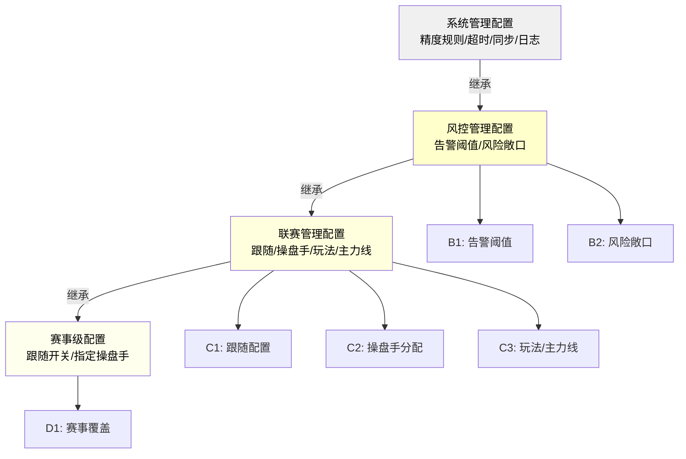

# 第十六章 配置项归属与附录

> **关盘口径（2026-04-21 生效）**：关盘来源统一为数据源推送（唯一来源）；关盘 = 绝对终态，操盘页与结算详情页均不提供人工开盘入口。如数据源误推送关盘，依赖数据源再次推送开盘信号自动响应。

本章汇总操盘详情页涉及的所有配置项（分为风控管理、联赛管理、系统管理三类归属）、默认值定义、术语表和字段索引，作为PRD的统一参考附录。

## 16.0 与其他章节的关系说明（规范说明）

本章遵循「规范定义（Single Source of Truth）」原则，枚举定义、权限定义、联动规则均引用操盘列表文档，不重复定义。

| 内容               | 规范定义位置                        | 本章职责 |
| ------------------ | ----------------------------------- | -------- |
| 角色枚举           | **[操盘列表第12章12.1节](../trading-list/12-权限控制.md#_12-1-角色定义)**            | 仅引用   |
| 隐藏来源枚举       | **[操盘列表第16章16.1.4节](../trading-list/16-数据联动规则.md#_16-1-4-隐藏来源枚举定义)**          | 仅引用   |
| 操作来源枚举       | **[操盘列表第18章18.3.2节](../trading-list/18-操盘日志页面规范.md#_18-3-2-操作来源枚举)**        | 仅引用   |
| 盘口状态枚举       | **[操盘列表第10章10.3.1节](../trading-list/10-状态流转规则.md#_10-3-1-盘口状态定义)**          | 仅引用   |
| 数据联动规则       | **[操盘列表第16章](../trading-list/16-数据联动规则.md)**                  | 仅引用   |
| 审计日志字段       | **[操盘列表第12章12.6.2节](../trading-list/12-权限控制.md#_12-6-2-审计日志字段)**          | 仅引用   |
| 日志保留天数       | **[操盘列表第12章12.6.1节](../trading-list/12-权限控制.md#_12-6-1-审计日志保留与查询)**（180天） | 仅引用   |
| 限额体系（联赛分组/用户/玩法/串关） | **[风控管理第2-5章](../risk-management/02-赛事限额.md)** | 仅引用（赛事级覆盖入口见[第13章13.12节](./13-弹窗与模态框.md#_13-12-风控设置弹窗)） |
| 配置项归属与默认值 | 本章（操盘页第16章）                | **定义** |
| 术语表             | 本章（操盘页第16章）                | **定义** |
| 字段索引           | 本章（操盘页第16章）                | **定义** |

---

## 16.1 配置项归属总表

### 16.1前置：配置分类定义（写死）

| 配置分类 | 定义 | 特征 | 修改流程 | 示例 |
|---------|------|------|---------|------|
| **系统级写死（System Hardcode）** | 代码级写死常量，在源代码中定义，无任何配置界面入口 | 1. 不在任何后台界面提供编辑入口；2. 修改需修改代码+编译+发版；3. 变更影响全系统；4. 一期不支持变更 | 走技术发版流程（修改代码→编译→灰度测试→全量发布） | HK赔率精度3位、HK显示精度2位、金额精度2位、风险注单超时30秒、数据源同步间隔500ms |
| **配置界面不可编辑（配置界面存在但禁用）** | 后台配置界面存在该配置项（便于查看默认值），但「编辑」按钮被禁用或灰显，无法手动修改 | 1. 在后台配置界面中可见；2. 无编辑/删除操作按钮；3. 仅可查看当前默认值；4. 特定场景下（如版本过渡期）临时禁用 | 等待功能升级后再开放编辑界面（或直接升级为可编辑配置） | 二期计划：目标RTP、偏离阈值等（一期先禁用，二期开放可编辑） |
| **风控管理配置** | 风控后台运营配置，支持界面配置与修改，立即生效 | 1. 风控管理界面有编辑入口；2. 修改立即生效，无需发版；3. 配置优先级：赛事级 > 联赛级 > 默认值 | 风控管理后台界面配置（无需发版，立即生效） | 告警阈值、货量接近上限阈值、风险敞口告警阈值 |
| **联赛管理配置** | 联赛级运营配置，支持界面配置与修改，新赛事生效或立即生效 | 1. 联赛管理界面有编辑入口；2. 变更生效时机按配置类型区分：跟随类配置立即生效，其他配置仅对新上架赛事生效；3. 不影响已上架赛事 | 联赛管理后台界面配置（按生效规则） | 是否跟随数据源、默认操盘手、玩法启用列表 |
| **系统管理配置** | 通用技术参数，支持界面配置但通常不需频繁变更 | 1. 系统管理界面有编辑入口；2. 修改需谨慎（影响系统性能/行为）；3. 通常为一次性配置 | 系统管理后台界面配置（需管理员确认，避免误操作） | 日志保留天数、WebSocket超时时间 |

> **配置归属说明**（简化版）：
> - **系统级写死**：HK精度、显示精度、超时时间、同步间隔、赔率边界（最大/最小HK赔率）、RTP范围、调幅限制、目标RTP（不可在界面修改，改需发版）
> - **风控管理**：告警阈值、风险敞口阈值、货量接近上限阈值（风控后台配置，立即生效）
> - **联赛管理**：跟随配置、操盘手分配、玩法启用、主力线规则（联赛后台配置，新赛事或立即生效）
> - **系统管理**：日志保留、超时等通用参数（系统后台配置，需谨慎修改）

### 16.1.0 系统写死常量（修改需发版）

以下参数为系统硬编码常量，不在任何后台界面中提供配置入口，修改需走代码发版流程。

| 常量项                 | 写死值       | 数据类型 | 说明                             | 引用章节                 |
| ---------------------- | ------------ | -------- | -------------------------------- | ------------------------ |
| HK赔率落库精度         | 默认值为 3位小数（系统级写死，修改需发版） | 整数     | 赔率存储精度                     | [第7章7.16](./07-赔率编辑与计算.md#_7-16-精度规则汇总)               |
| HK赔率显示精度         | 默认值为 2位小数（系统级写死，修改需发版） | 整数     | 赔率显示精度                     | [第7章7.16](./07-赔率编辑与计算.md#_7-16-精度规则汇总)               |
| 金额显示精度           | 默认值为 2位小数（系统级写死，修改需发版） | 整数     | 金额显示精度                     | [第12章12.11.2](./12-数据字段定义.md#_12-11-2-金额精度规范)         |
| 操盘日志保留天数       | 默认值为 180（系统级写死，修改需发版）     | 天       | 与[操盘列表第12章12.6.1节](../trading-list/12-权限控制.md#_12-6-1-审计日志保留与查询)一致     | [第14章14.6.5](./14-操作流程与权限.md#_14-6-5-日志保留)             |
| 风险注单超时           | 默认值为 30秒（系统级写死，修改需发版）     | 秒       | 待审核注单超时自动拒绝           | [第15章15.5.4](./15-异常与边界处理.md#_15-5-4-超时处理) |
| 数据源同步最小间隔     | 默认值为 500ms（系统级写死，修改需发版） | 毫秒     | IM推送合并最小间隔               | [第7章7.6.1](./07-赔率编辑与计算.md#_7-6-1-推送时序一致性规则)               |

### 16.1.1 赔率边界常量（系统写死）

| 配置项                 | 默认值       | 数据类型 | 说明                             | 引用章节                 |
| ---------------------- | ------------ | -------- | -------------------------------- | ------------------------ |
| 最大HK赔率             | 默认值为 50.00（系统写死） | 数值     | 单选项赔率上限                   | [第7章7.2.3](./07-赔率编辑与计算.md#_7-2-3-赔率校验规则)               |
| 最小HK赔率             | 默认值为 0.01（系统写死） | 数值     | 单选项赔率下限                   | [第7章7.2.3](./07-赔率编辑与计算.md#_7-2-3-赔率校验规则)               |
| RTP下限                | 默认值为 85%（系统写死） | 百分比   | 返奖率下限                       | [第7章7.2.3](./07-赔率编辑与计算.md#_7-2-3-赔率校验规则)               |
| RTP上限                | 默认值为 99%（系统写死） | 百分比   | 返奖率上限                       | [第7章7.2.3](./07-赔率编辑与计算.md#_7-2-3-赔率校验规则)               |
| 单次调幅限制           | 默认值为 0.20（系统写死） | 数值     | 单次赔率调整的最大绝对值         | [第7章7.2.3](./07-赔率编辑与计算.md#_7-2-3-赔率校验规则)、[第14章14.2.4](./14-操作流程与权限.md#_14-2-4-调幅限制) |
| 默认目标RTP            | 默认值为 95.0%（系统写死） | 百分比   | 默认返奖率目标                   | [第7章7.13.3](./07-赔率编辑与计算.md#_7-13-3-目标rtp取值规则)               |

### 16.1.2 风控管理配置

| 配置项                 | 默认值       | 数据类型 | 说明                             | 引用章节                 |
| ---------------------- | ------------ | -------- | -------------------------------- | ------------------------ |
| 偏离IM告警阈值         | 默认值为 0.10（风控管理配置） | 数值     | 本地赔率与IM偏离超过此值触发告警 | [第7章7.2.3](./07-赔率编辑与计算.md#_7-2-3-赔率校验规则)、[第14章14.2.4](./14-操作流程与权限.md#_14-2-4-调幅限制) |
| 单边比例告警阈值       | 默认值为 70%（风控管理配置） | 百分比   | 单边投注比例超过此值触发告警     | [第11章11.3](./11-右侧监控面板.md#_11-3-风险注单模块)               |
| 大额单笔告警阈值       | 默认值为 50,000（风控管理配置） | 金额     | 单笔投注超过此值触发审核告警     | [第11章11.3](./11-右侧监控面板.md#_11-3-风险注单模块)               |
| 风险敞口告警阈值       | 默认值为 1,000,000（风控管理配置） | 金额     | 超过此值触发告警                 | [第12章](./12-数据字段定义.md)、[第10章](./10-数据源开关.md)           |
| 货量接近上限告警阈值   | 默认值为 80%（风控管理配置） | 百分比   | 货量占限额比例达到此值触发告警，分两个维度检测：1）整场货量 除以 整场最大货量；2）分组货量 除以 分组限额（6组独立检测）。告警信息显示：触发维度（整场/分组名）、当前货量、对应限额、占比百分比 | [风控管理第7章7.1](../risk-management/07-告警阈值.md#_7-1-五类告警定义)、[风控管理第2章](../risk-management/02-赛事限额.md) |

> **货量告警触发示例**：
> - **分组维度**：等级1联赛 让球组限额 等于 300,000，当前让球组已接受 等于 250,000，占比 等于 250,000 除以 300,000 等于 83.3%，83.3% 大于等于 80% → 触发告警，提示「让球组货量接近上限：250,000 / 300,000（83.3%）」
> - **整场维度**：等级1联赛 整场限额 等于 1,000,000，当前整场已接受 等于 820,000，占比 等于 820,000 除以 1,000,000 等于 82%，82% 大于等于 80% → 触发告警，提示「整场货量接近上限：820,000 / 1,000,000（82%）」
>
> **限额配置说明**：限额体系（联赛分组、用户限额、玩法限额、串关限额）的完整定义详见[风控管理第2-5章](../risk-management/02-赛事限额.md)，包含11档联赛等级 乘以 6组的完整配置矩阵。操盘页通过[第13章13.12节「风控设置弹窗」](./13-弹窗与模态框.md#_13-12-风控设置弹窗)提供赛事级覆盖入口，限额字段的默认值继承自该赛事所属联赛等级的风控管理配置。

### 16.1.3 联赛管理配置

| 配置项                 | 默认值     | 数据类型 | 说明                             | 引用章节                 |
| ---------------------- | ---------- | -------- | -------------------------------- | ------------------------ |
| 是否跟随数据源盘口状态 | 默认值为是（联赛管理配置） | 布尔     | 联赛级跟随配置                   | [第9章9.3](./09-状态流转规则.md#_9-3-数据源触发流转)                 |
| 默认操盘手             | 默认值为空（联赛管理配置）   | 用户ID   | 该联赛新赛事的默认操盘手         | [第14章14.1](./14-操作流程与权限.md#_14-1-操盘手分配)               |
| 操盘手分配模式         | 默认值为统一分配（联赛管理配置）  | 枚举     | 统一分配/按玩法分配              | [第14章14.1](./14-操作流程与权限.md#_14-1-操盘手分配)               |
| 玩法启用列表           | 默认值为全部启用（联赛管理配置）   | 数组     | 该联赛启用的玩法类型             | [第6章6.2](./06-盘口卡片模块.md#_6-2-玩法分组规则)                 |
| 主力线显示规则         | 默认值为仅显示主力（联赛管理配置） | 枚举     | 主力线/全部线/自定义             | [第6章6.4](./06-盘口卡片模块.md#_6-4-主力线规则)                 |

---

## 16.2 阈值生效规则

### 16.2.1 配置变更生效时机

| 配置类型 | 配置项 | 生效时机 | 影响范围 | 说明 |
| -------- | ------ | -------- | -------- | ---- |
| 联赛配置-跟随类 | 是否跟随数据源盘口状态 | 立即生效 | 已上架赛事 | 变更后该联赛下已上架赛事立即按新跟随配置与数据源同步 |
| 联赛配置-非跟随类 | 默认操盘手、玩法启用列表、主力线显示规则、操盘手分配模式 | 新上架生效 | 未上架赛事 | 仅新上架赛事使用新配置；已上架赛事保持原配置不回刷 |
| 联赛配置-等级变更 | 联赛等级变更（默认↔等级1-10） | 新上架生效 | 未上架赛事 | 已上架赛事保持原等级限额；新上架时使用新等级限额 |
| 风控配置-告警阈值 | 偏离IM告警、单边比例告警、大额单笔告警、风险敞口告警、货量接近上限告警 | 立即生效 | 已上架赛事 | 变更后触发全量重算告警状态 |
| 赛事级覆盖配置 | 跟随数据源开关、指定操盘手 | 立即生效 | 当前赛事 | 针对单个已上架赛事，立即生效 |

> **不在本表范围的写死项**：
> - **赔率边界6项**（最大/最小HK赔率、RTP范围、目标RTP、单次调幅）：一期默认值写死，无配置变更场景，不存在"生效时机"问题
> - **系统管理配置5项**（精度规则、同步间隔、超时、日志保留）：一期默认值写死，同上
>
> 以上写死项如需修改，必须走代码发版流程，不在运营配置范畴内。详见16.1.0节。

### 16.2.2 配置优先级（从高到低）

| 优先级 | 配置层级     | 说明                       |
| :----: | ------------ | -------------------------- |
|   1    | 赛事级配置   | 针对单个赛事的独立配置     |
|   2    | 联赛级配置   | 联赛管理中的配置           |
|   3    | 风控默认配置 | 风控管理模块的默认值       |
|   4    | 全局默认配置 | 系统管理模块的系统默认值   |

继承规则：下级未配置时继承上级配置，下级已配置时覆盖上级配置。

---

## 16.3 枚举定义引用

> **规范原则**：本节仅列出枚举引用位置，不重复定义枚举值。查看枚举详情请跳转至对应章节。

### 16.3.1 盘口状态枚举

**规范定义**：[操盘列表第10章10.3.1节](../trading-list/10-状态流转规则.md#_10-3-1-盘口状态定义)

| 状态值 | 中文名称 | 说明                        |
| :----: | -------- | --------------------------- |
|   1    | 开盘     | 可接受投注（初始状态）      |
|   2    | 隐藏     | 停止接受投注，可恢复（叠加状态） |
|   3    | 锁定     | 锁定状态，仅主管/风控可解锁（叠加状态） |
|   4    | 关盘     | 绝对终态，无人工开盘入口 |

> **术语说明**：系统统一使用「开盘/隐藏/锁定/关盘」术语。开盘为初始状态（仅展示），隐藏和锁定为叠加状态（可操作），关盘在操盘页为终态。关盘来源：IM 推送关盘（唯一来源）。

### 16.3.2 隐藏来源枚举

**规范定义**：[操盘列表第16章16.1.4节](../trading-list/16-数据联动规则.md#_16-1-4-隐藏来源枚举定义)

此枚举用于记录**盘口为什么进入隐藏状态**，仅当盘口状态=隐藏时使用。

| 来源标识       | 名称         | 触发场景                 | 恢复方式                                           |
| -------------- | ------------ | ------------------------ | -------------------------------------------------- |
| manual         | 人工隐藏     | 操盘手手动隐藏           | 人工取消隐藏                                       |
| data_source    | 数据源状态标记 | IM推送状态（不再作为隐藏来源） | 数据源恢复或人工处理                           |
| league_pause   | 联赛暂停     | 联赛状态变更为暂停       | 联赛恢复后自动取消隐藏                             |
| league_close   | 联赛关盘     | 联赛状态变更为关盘       | 联赛恢复后人工评估                                 |
| risk_control   | 风控隐藏     | 风控规则触发自动隐藏     | 人工确认后取消隐藏                                 |
| system         | 系统隐藏     | 系统异常触发             | 人工取消隐藏                                       |
| inherit        | 继承隐藏     | 上级隐藏导致下级隐藏     | 上级取消隐藏后自动恢复                             |
| maintenance    | 数据源维护   | IM推送维护标记/维护态    | 维护结束后自动恢复（仍需满足上级状态上限）         |
| event_incident | 赛事事件     | 进球/红牌/VAR 等事件触发 | 默认10秒发起一次恢复尝试；若数据源仍暂停则继续跟随 |

### 16.3.3 操作来源枚举

**规范定义**：[操盘列表第18章18.3.2节](../trading-list/18-操盘日志页面规范.md#_18-3-2-操作来源枚举)

此枚举用于记录**操作是由谁/什么触发的**，所有操作日志都需记录。

| 来源标识       | 显示名称   | 标签颜色 | 触发场景                     | 说明                           |
| -------------- | ---------- | -------- | ---------------------------- | ------------------------------ |
| manual         | 人工       | 蓝色     | 操盘手单次手动操作           | 最常见的操作来源               |
| batch          | 批量       | 蓝色     | 前端批量选择后执行           | 日志通过batch_id关联汇总与明细 |
| ao             | 数据源自动 | 绿色     | 自动跟盘机制触发             | 仅用于赔率调整操作             |
| data_source    | 数据源     | 橙色     | IM数据源推送触发的状态变更   | 被动响应数据源                 |
| risk_control   | 风控       | 红色     | 风控规则触发的操作           | 如单边超限自动隐藏             |
| system         | 系统       | 灰色     | 系统自动处理                 | 如风险注单超时自动接受         |
| inherit        | 上级联动   | 紫色     | 上级状态继承触发             | 如联赛暂停导致盘口隐藏         |
| maintenance    | 数据源维护 | 紫色     | IM推送维护标记触发的状态变更 | 维护期间的状态变更             |
| event_incident | 赛事事件   | 黄色     | 进球/红牌/VAR等事件触发      | 比赛事件导致的状态变更         |

> **隐藏来源 vs 操作来源**：这是两个完全不同的枚举。隐藏来源记录「盘口为何隐藏」，操作来源记录「操作由谁发起」。

### 16.3.4 角色枚举

**规范定义**：[操盘列表第12章12.1节](../trading-list/12-权限控制.md#_12-1-角色定义)

| 角色代码     | 中文名称   | 说明               |
| ------------ | ---------- | ------------------ |
| TRADER       | 普通操盘手 | 负责具体赛事操盘   |
| SUPERVISOR   | 主管       | 团队管理，高权限   |
| RISK_CONTROL | 风控       | 风险控制，最高权限 |

### 16.3.5 操作类型枚举

**规范定义**：[操盘列表第18章](../trading-list/18-操盘日志页面规范.md)

详见[操盘列表第18章18.3节「操作类型枚举」](../trading-list/18-操盘日志页面规范.md#_18-3-操作类型与来源枚举)定义。

---

## 16.4 术语表

### 16.4.1 赔率相关术语

| 术语        | 英文                | 定义                                      |
| ----------- | ------------------- | ----------------------------------------- |
| HK赔率      | Hong Kong Odds      | 香港赔率，净赔率，不含本金                |
| Decimal赔率 | Decimal Odds        | 欧洲赔率，含本金，等于HK赔率加1           |
| RTP         | Return To Player    | 返奖率，所有选项隐含概率之和的倒数        |
| 隐含概率    | Implied Probability | 赔率隐含的概率，等于1÷Decimal赔率      |
| 配对计算    | Paired Calculation  | 调整一方赔率时自动计算配对方赔率以维持RTP |
| 主力线      | Main Line           | 投注量最大或数据源标记的主要盘口线        |

### 16.4.2 盘口相关术语

| 术语     | 英文               | 定义                                     |
| -------- | ------------------ | ---------------------------------------- |
| 玩法     | Market / Bet Type  | 投注类型，如让球盘、大小球               |
| 盘口线   | Handicap Line      | 同一玩法下的不同盘口值，如-0.5、-1、-1.5 |
| 选项     | Selection / Option | 盘口线下的投注项，如主胜、客胜           |
| 盘口卡片 | Market Card        | 操盘页中展示单个玩法的UI组件             |

### 16.4.3 操作相关术语

| 术语 | 英文      | 定义                             |
| ---- | --------- | -------------------------------- |
| 上架 | List      | 将赛事发布到客户端，开始接受投注 |
| 下架 | Delist    | 将赛事从客户端撤回，停止接受投注 |
| 隐藏 | Hidden    | 临时停止接受投注，可恢复         |
| 锁定 | Lock      | 强制停止接受投注，仅高权限可解锁 |
| 数据源开关   | Data Source Switch | 数据源跟随开关，开启时赔率、盘口状态、结算跟随IM数据源 |

### 16.4.4 数据源相关术语

| 术语      | 英文          | 定义                         |
| --------- | ------------- | ---------------------------- |
| IM        | Inplay Matrix | 数据源提供商名称             |
| Delta推送 | Delta Push    | 增量数据推送，仅推送变更部分 |
| Full Pull | Full Pull     | 全量数据拉取                 |
| 跟随配置  | Follow Source | 是否跟随数据源状态变更       |

---

## 16.5 字段索引

### 16.5.1 赛事级字段

| 字段名         | 数据类型 | 来源 | 说明         | 定义章节   |
| -------------- | -------- | ---- | ------------ | ---------- |
| EventId        | 字符串   | IM   | 赛事唯一标识 | [第12章12.1](./12-数据字段定义.md#_12-1-字段分类原则) |
| HomeTeamName   | 字符串   | IM   | 主队名称     | [第12章12.1](./12-数据字段定义.md#_12-1-字段分类原则) |
| AwayTeamName   | 字符串   | IM   | 客队名称     | [第12章12.1](./12-数据字段定义.md#_12-1-字段分类原则) |
| LeagueId       | 字符串   | IM   | 联赛ID       | [第12章12.1](./12-数据字段定义.md#_12-1-字段分类原则) |
| LeagueName     | 字符串   | IM   | 联赛名称     | [第12章12.1](./12-数据字段定义.md#_12-1-字段分类原则) |
| MatchTime      | 时间戳   | IM   | 开赛时间     | [第12章12.1](./12-数据字段定义.md#_12-1-字段分类原则) |
| EventStatusId  | 枚举     | IM   | 赛事状态     | [第12章12.1](./12-数据字段定义.md#_12-1-字段分类原则) |
| SettlementId   | 枚举     | IM   | 结算状态     | [第12章12.1](./12-数据字段定义.md#_12-1-字段分类原则) |
| ListStatus     | 枚举     | 本地 | 上架状态     | [第12章12.2](./12-数据字段定义.md#_12-2-盘口表格字段定义) |
| AssignedTrader | 用户ID   | 本地 | 负责操盘手   | [第12章12.2](./12-数据字段定义.md#_12-2-盘口表格字段定义) |

### 16.5.2 盘口级字段

| 字段名                        | 数据类型 | 来源    | 说明                     | 定义章节   |
| ----------------------------- | -------- | ------- | ------------------------ | ---------- |
| BetTypeId                     | 整数     | IM      | 玩法类型ID               | [第12章12.3](./12-数据字段定义.md#_12-3-赔率字段定义) |
| BetTypeName                   | 字符串   | IM      | 玩法名称                 | [第12章12.3](./12-数据字段定义.md#_12-3-赔率字段定义) |
| MarketId                      | 字符串   | IM      | 盘口唯一标识             | [第12章12.3](./12-数据字段定义.md#_12-3-赔率字段定义) |
| Handicap                      | 数值     | IM      | 盘口值（让球/大小）      | [第12章12.3](./12-数据字段定义.md#_12-3-赔率字段定义) |
| IsMainLine                    | 布尔     | IM/本地 | 是否主力线               | [第12章12.3](./12-数据字段定义.md#_12-3-赔率字段定义) |
| MarketStatus                  | 枚举     | 本地    | 盘口状态                 | [第12章12.3](./12-数据字段定义.md#_12-3-赔率字段定义) |
| HiddenSource（隐藏来源标识） | 枚举     | 本地    | 隐藏来源（仅隐藏时有值） | [第12章12.3](./12-数据字段定义.md#_12-3-赔率字段定义) |

### 16.5.3 选项级字段

| 字段名        | 数据类型 | 来源 | 说明                  | 定义章节   |
| ------------- | -------- | ---- | --------------------- | ---------- |
| SelectionId   | 字符串   | IM   | 选项唯一标识          | [第12章12.4](./12-数据字段定义.md#_12-4-投注字段定义) |
| SelectionName | 字符串   | IM   | 选项名称              | [第12章12.4](./12-数据字段定义.md#_12-4-投注字段定义) |
| OddsHK        | 数值     | 本地 | 本地HK赔率（3位小数） | [第12章12.4](./12-数据字段定义.md#_12-4-投注字段定义) |
| OddsHK_IM     | 数值     | IM   | IM源HK赔率            | [第12章12.4](./12-数据字段定义.md#_12-4-投注字段定义) |
| OddsDeviation | 数值     | 计算 | 本地与IM偏离值        | [第12章12.4](./12-数据字段定义.md#_12-4-投注字段定义) |
| BetAmount     | 数值     | 本地 | 投注金额              | [第12章12.4](./12-数据字段定义.md#_12-4-投注字段定义) |
| BetRatio      | 百分比   | 计算 | 投注比例              | [第12章12.4](./12-数据字段定义.md#_12-4-投注字段定义) |
| OptionStatus  | 枚举     | 本地 | 选项状态              | [第12章12.4](./12-数据字段定义.md#_12-4-投注字段定义) |
| DataSourceEnabled     | 布尔     | 本地 | 数据源开关是否开启            | [第12章12.4](./12-数据字段定义.md#_12-4-投注字段定义) |

---

## 16.6 配置项归属关系图

配置项按三级层级关系，优先级从高到低：赛事级覆盖 > 联赛级 > 风控/系统级默认值。

**配置层级说明**：

| 层级 | 名称 | 配置位置 | 作用范围 | 优先级 |
|------|------|--------|--------|--------|
| 第1层 | 系统管理配置 | 系统后台 | 全系统通用 | 最低 |
| 第2层 | 风控管理配置 | 风控后台 | 全联赛 | 中 |
| 第3层 | 联赛管理配置 | 联赛后台 | 单个联赛 | 较高 |
| 第4层 | 赛事级配置 | 操盘页 | 单个赛事 | 最高 |

**已移除的写死项**（一期无配置入口，详见16.1.0）：
* 赔率边界6项（最大/最小HK、RTP范围、目标RTP、单次调幅）— 系统写死常量
* 系统管理5项（精度规则、同步间隔、超时、日志保留）— 系统管理默认值写死

---

## 16.7 数据联动规则引用

> **规范定义**：数据联动规则详见[操盘列表第16章](../trading-list/16-数据联动规则.md)。本节仅列出核心规则引用。

### 16.7.1 联动设计原则（引用[操盘列表第16章16.1.2节](../trading-list/16-数据联动规则.md#_16-1-2-联动设计原则)）

| 原则         | 说明                                   |
| ------------ | -------------------------------------- |
| 安全优先     | 上游状态变更导致风险时，优先隐藏   |
| 人工意图优先 | 人工操作的状态不被系统自动覆盖         |
| 配置不穿透   | 配置变更不直接触发已上架实体的终态变更 |
| 可追溯       | 所有联动操作记录日志                   |

### 16.7.2 状态覆盖优先级

> **两种优先级说明**：
> - **状态优先级**（本节，4级）：定义盘口状态之间的覆盖关系（关盘 > 锁定 > 隐藏 > 开盘）
> - **触发源优先级**（[操盘列表第16章16.3.11节](../trading-list/16-数据联动规则.md#_16-3-11-状态覆盖优先级)，6级）：定义不同触发源同时作用时的优先顺序（数据源关盘 > 人工锁定 > 风控隐藏 > 联赛暂停 > 数据源恢复 > 人工隐藏）

|  优先级   | 状态 | 说明                         |
| :-------: | ---- | ---------------------------- |
| 1（最高） | 关盘 | 数据源关盘最高优先级，不可逆 |
|     2     | 锁定 | 人工锁定，仅主管/风控可解锁  |
|     3     | 隐藏 | 可被锁定覆盖，可取消隐藏为开盘   |
| 4（最低） | 开盘 | 初始状态，可被任何状态覆盖   |

### 16.7.3 跟随配置生效规则（引用[操盘列表第16章16.8.7节](../trading-list/16-数据联动规则.md#_16-8-7-跟随配置生效规则)）

| 变更类型           | 生效时机           | 说明                       |
| ------------------ | ------------------ | -------------------------- |
| 联赛级跟随配置变更 | 立即生效           | 已上架赛事立即与数据源同步 |
| 联赛级其他配置变更 | 仅对新上架赛事生效 | 已上架赛事保持原配置       |
| 赛事级配置变更     | 立即生效           | 针对单个已上架赛事         |

---

## 16.8 一期支持的BetTypeId清单

一期系统仅支持以下BetTypeId的展示与操盘操作，其他BetTypeId暂不在范围内：

### 16.8.1 支持清单

> **规范说明**：渲染器映射的规范定义为[操盘页第6章6.3.1节「渲染器映射表」](./06-盘口卡片模块.md#_6-3-1-渲染器映射表全局规则)。

| BetTypeId | 玩法名称         | 选项数 | 渲染器          | 玩法分组 |
| --------- | ---------------- | :----: | --------------- | -------- |
| BT1       | 让球             |   2    | MultiLineTable  | 让球组   |
| BT2       | 大小             |   2    | MultiLineTable  | 大小组   |
| BT3       | 独赢1X2          |   3    | SingleLineTable | 进球组   |
| BT5       | 单双             |   2    | SingleLineTable | 进球组   |
| BT6       | 波胆             |  27+   | Matrix          | 特殊组   |
| BT7       | 总进球           |   7+   | LongList        | 进球组   |
| BT8       | 双重机会         |   3    | SingleLineTable | 进球组   |
| BT9       | 半全场           |   9    | Matrix          | 特殊组   |
| BT158     | 反波胆           |  27+   | Matrix          | 特殊组   |
| BT159     | 第X粒入球球队    |   3    | SingleLineTable | 进球组   |
| BT160     | 主队大小         |   2    | MultiLineTable  | 大小组   |
| BT161     | 客队大小         |   2    | MultiLineTable  | 大小组   |

### 16.8.2 范围说明

| 分类 | BetTypeId | 展示 | 可操盘 | 说明 |
|------|-----------|:----:|:------:|------|
| 标准可操盘玩法 | BT1/BT2/BT3/BT5/BT6/BT7/BT8/BT9/BT32/BT37/BT48/BT158/BT159/BT160/BT161/BT179/BT180（共17个） | ✅ | ✅ | 支持赔率编辑、状态控制、数据源开关等全部操盘功能 |
| 纯透传玩法 | 其他所有BetTypeId | ✅ | ❌ | 展示数据源推送内容（只读），不支持操盘操作 |

- **标准可操盘玩法（17种）**：BT1让球、BT2大小、BT3独赢1X2、BT5单双、BT6波胆、BT7总进球、BT8双重机会、BT9半全场、BT32客队大小、BT37下一球队、BT48 15分钟1X2、BT158反波胆、BT159第X粒入球球队、BT160主队大小、BT161客队大小、BT179 15分钟让球、BT180 15分钟大小
- **纯透传玩法**：数据源推送的所有其他BetTypeId均展示，但仅支持查看，不支持赔率编辑、状态控制等操盘操作；数据源开关强制开启且不可关盘
- 以上标准可操盘玩法合计17种，为一期操盘页支持的完整可操盘玩法范围（数据来源：sport_play_type表 is_manual_trade=2，共82行）

---

## 修订记录

| 版本 | 日期       | 修订内容                                                                                                                                                                                    |
| ---- | ---------- | ------------------------------------------------------------------------------------------------------------------------------------------------------------------------------------------- |
| 第1次修订  | 2026-01-22 | 初稿                                                                                                                                                                                        |
| 第2次修订  | 2026-01-22 | 1) 枚举定义改为引用规范定义，删除重复定义；2) 明确区分「暂停来源」和「操作来源」两个不同枚举；3) 日志保留天数统一为180天（与第12章12.6.1节一致）；4) 新增16.0节规范说明表 |
| 第3次修订  | 2026-01-28 | 1) 16.3.2节暂停来源补齐为9种；2) 16.3.3节操作来源补齐为9种；3) 16.8.1节BetTypeId映射表修正玩法名称和渲染器（按第6章6.3.1节全局规则）；4) 新增规范说明 |
| 第4次修订  | 2026-01-28 | 16.7.2节格式修复：删除不规范的自引用注释（>>>>） |
| 第5次修订  | 2026-01-28 | 1) 删除技术配置（WebSocket/轮询/会话超时）；2) 16.7.2节补充状态优先级（4级）与触发源优先级（6级）的区分说明；3) 16.8.2节修正：透传玩法展示但不可操盘 |
| 第6次修订  | 2026-01-28 | 1) 16.3.3节操作来源表格补齐"标签颜色"和"触发场景"字段（与真源18.3.2对齐）；2) 16.1.1节风险敞口阈值从50万修正为100万（符合核心摘要定义）；3) 16.3.2节暂停来源表格字段对齐真源（优先级→触发场景） |
| 第7次修订  | 2026-01-28 | 16.1.1节补充第7章跳水相关配置项：联赛默认目标RTP（95.0%）、数据源同步最小间隔（500ms）、单边比例严重超限阈值（85%）、大额单笔跳水阈值（50,000）、累计投注额跳水阈值（500,000）、净风险敞口跳水阈值（1,000,000）、基础跳幅（0.02）、单次跳幅上限（0.05）、累计跳幅上限（0.30）、偏离值编辑范围（-1.00至+1.00） |
| 第8次修订  | 2026-01-29 | 16.3.2节"暂停来源"→"隐藏来源"，术语"人工暂停/风控暂停"→"人工隐藏/风控隐藏"；16.3.3节示例"盘口暂停"→"盘口隐藏"；16.7.2节状态优先级"暂停"→"隐藏" |
| 第9次修订  | 2026-04-02 | 16.8.2节可操盘玩法从12种扩展为17种：新增BT32/BT37/BT48/BT179/BT180；数据来源：sport_play_type表确认 |
| 第10次修订 | 2026-01-29 | 16.0节规范说明表"暂停来源枚举"→"隐藏来源枚举"；16.3节术语说明"暂停"→"隐藏"；16.5.2节字段名SuspendSource→HiddenSource |
| 第11次修订 | 2026-02-11 | IM暂停不再作为隐藏来源：1）16.3.2节隐藏来源枚举中data_source改为"数据源状态标记"，明确"不再作为隐藏来源"；2）maintenance改为"数据源维护"，event_incident改为"赛事事件" |
| 第12次修订 | 2026-02-12 | 16.1.1风控配置精简删除11项不存在的配置项（偏离值编辑范围、单边严重超限、跳水阈值3项、大额累计告警、跳幅3项、数据延迟告警、风险注单超时），仅保留4项告警阈值（风控管理配置）；同步更新16.2.1生效时机表、16.6归属关系图 |
| 第13次修订 | 2026-02-12 | 16.1.1节新增「货量接近上限告警阈值」（默认80%），详细说明两个检测维度（整场货量÷整场限额、分组货量÷分组限额）及告警提示内容；16.2.1节同步补充；风控管理HTML原型同步新增 |
| 第14次修订 | 2026-02-12 | 1）16.0 规范表：赛事限额→联赛分组；2）16.1.1货量告警说明：A-E→6组、÷→除以、A组示例→让球组示例（300,000）、整场默认值对齐02章（1,000,000）；3）16.8.1 BetTypeId映射表风控分组列：A-E→让球/大小/角球/进球/半场/特殊 |

---

_文档结束_
