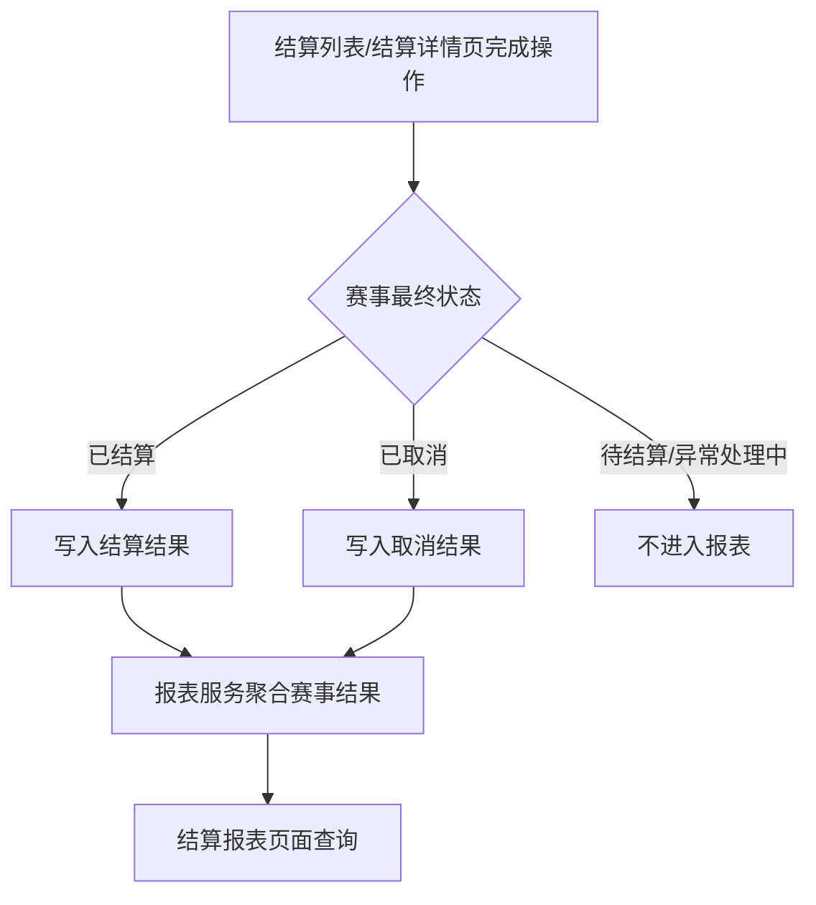
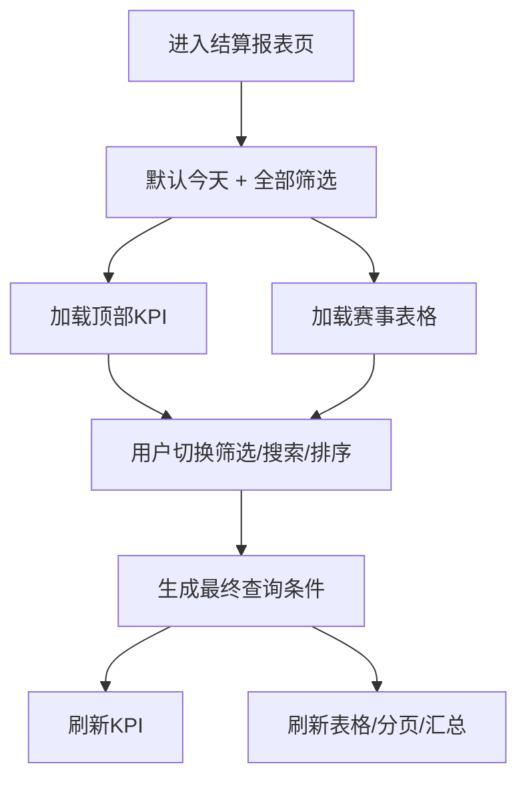
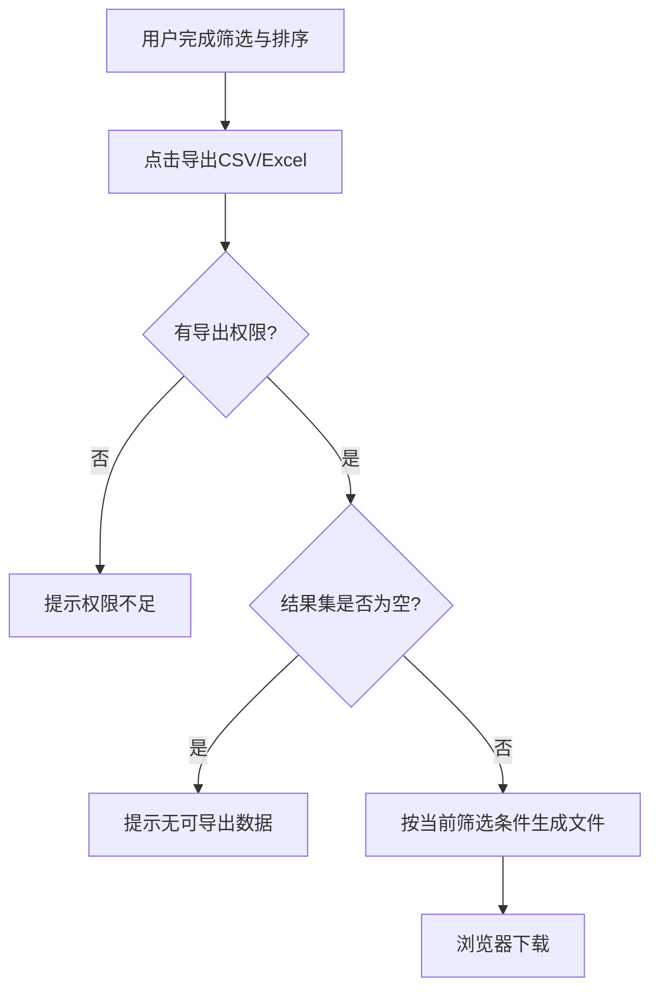
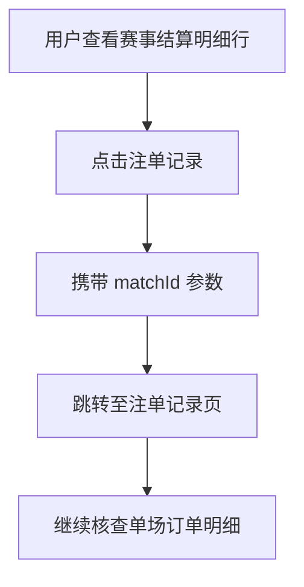

# 第十五章 流程图汇总

> **图表阅读提示**：点击任一流程图即可打开全屏放大视图，支持滚轮缩放、鼠标拖拽移动；键盘 `0` 重置、`Esc` 关闭。

## 15.1 结算结果入表流程

```mermaid
flowchart TD
    A[结算列表/结算详情页完成操作] --> B{赛事最终状态}
    B -->|已结算| C[写入结算结果]
    B -->|已取消| D[写入取消结果]
    B -->|待结算/异常处理中| E[不进入报表]
    C --> F[报表服务聚合赛事结果]
    D --> F
    F --> G[结算报表页面查询]
```

---

## 15.2 页面筛选查询流程

```mermaid
flowchart TD
    A[进入结算报表页] --> B[默认今天 + 全部筛选]
    B --> C[加载顶部KPI]
    B --> D[加载赛事表格]
    C --> E[用户切换筛选/搜索/排序]
    D --> E
    E --> F[生成最终查询条件]
    F --> G[刷新KPI]
    F --> H[刷新表格/分页/汇总]
```

---

## 15.3 导出流程

```mermaid
flowchart TD
    A[用户完成筛选与排序] --> B[点击导出CSV/Excel]
    B --> C{有导出权限?}
    C -->|否| D[提示权限不足]
    C -->|是| E{结果集是否为空?}
    E -->|是| F[提示无可导出数据]
    E -->|否| G[按当前筛选条件生成文件]
    G --> H[浏览器下载]
```

---

## 15.4 注单记录钻取流程

```mermaid
flowchart TD
    A[用户查看赛事结算明细行] --> B[点击注单记录]
    B --> C[携带 matchId 参数]
    C --> D[跳转至注单记录页]
    D --> E[继续核查单场订单明细]
```
