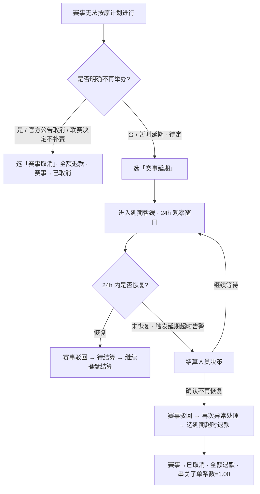

# 第十六章 赛事异常处理

> **关盘口径（2026-04-21 生效）**：关盘来源统一为数据源推送（唯一来源）；关盘 = 绝对终态，操盘页与结算详情页均不提供人工开盘入口。

## 16.0 异常识别三源

赛事异常的识别来源于以下 3 个渠道（对标主流数据源服务商的行业通用做法）：

| 序号 | 识别源 | 说明 | 权威性 |
|------|-------|------|-------|
| ① | **官方公告** | 联赛官方发布取消 / 延期 / 腰斩公告（如欧足联官网、俱乐部声明）| **最权威**（决定性依据）|
| ② | **数据源预警** | IM 数据源推送比赛中断、长时间无数据、赔率冻结等信号（**非赛事状态枚举**，IM 不下发"赛事异常"状态）| 辅助参考 |
| ③ | **人工观察** | 结算人员 / 操盘手实时监控发现异常（如比赛画面中断、比分长时间不变）| 实时触发 |

### 识别到异常后的流程

```
任一识别源 → 触发人判断 → 结算人员在结算详情页点击「赛事异常处理」按钮
  → 选择 4 类异常原因之一 → 执行处理方案 → 操盘列表 + 结算列表同步更新
```

### 操盘手 vs 结算人员的职责分工

> **异常处理入口唯一性**：赛事异常的标记和处理**唯一**入口在**结算详情页**的「赛事异常处理」按钮（仅赛事待结算时启用）。操盘列表 / 操盘详情页不提供异常标记入口；操盘手如需标记异常，须通知结算人员操作。

### 与操盘列表的同步规则

| 场景 | 操盘列表行为 | 结算列表行为 | 结算详情页行为 |
|------|------------|------------|--------------|
| 赛事被标记为异常（取消 / 延期 / 腰斩 暂缓）| 赛事行**红色边框高亮** + 红色「异常」标签 + **自动整场下架**（UI 层客户端隔离）| 赛事行红色边框高亮 + 默认置顶 | 赛事信息头状态标签变红色「异常」 |
| 赛事被标记为**数据错误** | 赛事行**红色边框高亮** + 红色「数据错误」标签（仅 UI 标识，**不下架**，赛事客户端正常可见）| 赛事行红色边框高亮 + 默认置顶 | 赛事信息头展示红色「数据错误」标签 |
| 异常期间的盘口操作 | 取消 / 延期 / 腰斩 暂缓触发对应关盘逻辑（由数据源 IM 推送同步触发）；**数据错误不触发关盘**（弹窗仅做标记）| 盘口进度同步更新 | 盘口卡片状态按数据源 / 人工操作派生 |
| 赛事驳回回待结算 | 红色高亮消失，赛事回到"滚球中"Tab（**是否自动重新上架由操盘手决定**，系统不自动恢复展示）| 赛事回到"待结算"筛选结果 | 状态标签恢复"待结算"|

---

## 16.0b 数据异常分层处理全景（2026-04-23 新增）

> 本节作为**全局分层索引**，明确各类数据异常 / 赛事异常的处理路径，避免将"数据异常"和"赛事异常"混淆。三层状态（客户端可见性 / 盘口业务态 / 赛事业务态）相互独立，不同颗粒度的异常走不同路径。

### 16.0b.1 六类场景分层表

**数据错误是纯审计标记**（2026-04-23 定稿）：「赛事异常处理 → 数据错误」弹窗**只做标记**，不触发任何业务动作（不下架、不关盘、不改赛事态、不动订单）。实际修正按颗粒度走各自独立入口（操盘页调赔率 / 赛果录入页修正 / 盘口卡片 void / 盘口二次结算）。

| # | 场景分类 | 触发源 | 典型情况 | 本地系统处理 | 赛事业务态 | 客户端可见性（下架）| 处理入口 |
|---|---------|--------|---------|------------|-----------|-------------------|---------|
| ① | IM 推送延迟 | 自动检测 | 滚球赛事 IM 推送 > 5s 无更新 | DATA_DELAY 告警（仅提示，不自动处理）| 不动 | 否 | 操盘列表告警列（[trading-list 9.11](/trading-list/09-数据字段定义#_9-11-告警类型枚举)）|
| ② | 赛事事件暂停 | IM 主动推 | 进球 / 红牌 / VAR 事件触发 | 盘口自动暂停投注（10s 恢复尝试，60s 超时告警）| 不动 | 否 | 系统自动（IM 驱动）|
| ③ | VAR 改判修正比分 | IM 推 + 人工 | VAR 回看导致比分变化 | **赛果修正流程**（[本章 16.4b](#_16-4b-var-改判)）| **不动**（不标异常）| 否 | 赛果录入页 |
| ④ | **数据错误**（弹窗仅做审计标记）| 人工发现 | 赔率错 / 赛果字段错 / 数据失真 | 弹窗选"数据错误" → **仅留审计日志 + 赛事标红色「数据错误」标签**（不下架、不关盘、不改态、不动订单）；**实际修正走各自独立入口**：<br/>• 开盘中赔率错 → 操盘详情页调赔率<br/>• 关盘未结算赔率错 → 盘口卡片 void<br/>• 赛果字段错 → 赛果录入页修正<br/>• 已结算 / 已取消盘口错 → 盘口二次结算（第 15 章）| **不动**（保持待结算）| **否**（赛事客户端正常可见）| 结算详情页「赛事异常处理」→ 数据错误（标记）+ 各自修正入口（[本章 16.5](#_16-5-数据错误)）|
| ⑤ | 数据源大面积故障 | 人工判断 | IM 整体失联 / 大量赛事数据异常 | 一键锁盘（锁定所有滚球赛事）| 不动 | 否 | 操盘列表顶部「一键锁盘」（[trading-list 4.4](/trading-list/04-顶部栏模块#_4-4-一键锁盘)）|
| ⑥ | 赛事级不可恢复 | 人工确认 | 取消 / 延期 / 腰斩 | 进异常态 + 批量关盘 | **变**（异常态 / 已取消 / 已结算）| **是**（客户端隔离整场）| 结算详情页「赛事异常处理」→ 取消 / 延期 / 腰斩 |

### 16.0b.2 关键区分（防止误判）

| 误解 | 正解 |
|------|------|
| "数据错误弹窗会自动处理订单/盘口" | 错。弹窗**仅做审计标记**，系统不触发任何业务动作（不动订单、不改态、不下架、不关盘）|
| "数据错误要改赛事态" | 错。数据错误**保持赛事态=待结算**（这是它与取消/延期/腰斩的核心区别）|
| "数据错误要下架整场" | 错。数据错误**不下架**（赛事客户端正常可见）；只有取消 / 延期 / 腰斩才下架 |
| "数据错误要批量关盘" | 错。数据错误**无关盘逻辑**（关盘来源唯一 = 数据源推送，人工无关盘权限）|
| "数据错误要处理未结算订单退款" | 错。数据错误**不处理任何订单**，已结算和未结算均保持原状；修正在弹窗外做（盘口 void / 盘口二次结算各自处理）|
| "数据错误弹窗有盘口选择器或错误类型" | 错。弹窗仅有原因选择 + 错误描述备注 + 确认按钮，无其他字段 |
| "单盘口问题必须通过数据错误弹窗处理" | 不必。单盘口问题直接在各自入口处理即可（操盘页 / 赛果录入页 / 盘口卡片）；数据错误弹窗只在需要留赛事级审计标记时使用 |
| "下架等于关盘" | 错。下架是 UI 层客户端整场不可见；关盘是盘口业务态（IM 推送触发）；锁定/隐藏是操盘手单盘口独立动作。三者独立（[trading-detail 08](/trading-detail/08-控制层级体系) 定义）|
| "VAR 改判要走异常处理弹窗" | 错。VAR 改判走赛果录入页（16.4b），不进异常态、不标数据错误 |

### 16.0b.3 颗粒度决策树

```
发现数据 / 赛事异常
  │
  ├── 是 IM 推送自动行为？（延迟 / 暂停 / VAR 比分变化）
  │     ├── 是 → 走 ①②③（系统自动或赛果修正流程，不进异常处理弹窗）
  │     └── 否 → 继续判断
  │
  ├── 是赛事本身事实层问题？（取消 / 延期 / 腰斩，比赛踢不完）
  │     └── 是 → 走 ⑥ 赛事异常（改赛事态 + 整场下架）
  │
  ├── 是数据层问题？
  │     ├── 全场性数据源故障（IM 整体失联 / 多场异常）→ 走 ⑤ 一键锁盘（系统级兜底，不进异常处理弹窗）
  │     │
  │     └── 具体数据错误 → 走 ④
  │           ├── 实际修正按颗粒度走各自入口：
  │           │     ├── 开盘中赔率错 → 操盘详情页调赔率
  │           │     ├── 关盘未结算赔率错 → 盘口卡片 void
  │           │     ├── 开盘中 / 关盘未结算赛果字段错 → 赛果录入页修正
  │           │     └── 已结算 / 已取消盘口错 → 盘口二次结算（第 15 章）
  │           │
  │           └── 可选：在赛事异常处理弹窗选"数据错误"留赛事级审计标记
  │                 （仅标记，不改态、不下架、不关盘、不动订单）
  │
  └── 无法分类 → 在数据错误弹窗备注说明
```

### 16.0b.4 数据错误判定标准（2026-04-23 新增）

数据错误没有系统自动判定，纯人工决策：

| 判定类型 | 识别方式 | 典型触发人 |
|---------|---------|-----------|
| **赔率错** | IM 推送赔率明显偏离市场共识（对比同业公开赔率 / RTP 超出合理区间 / 单次调幅过大）| 操盘手 |
| **赛果错** | IM 推送比分 / 赛果与官方公告不一致；录入后发现对不上官方来源（含"整场数据失真"场景：归入赛果错，按受影响的多盘口处理）| 结算人员 + 操盘手 |

**行业共识**：数据错误判定本质是业务判断，不设硬阈值自动触发；平台通常用"明显偏离市场共识 + 官方公告对比"作为判定基线。

---

## 16.1 赛事异常处理原因（4 种，写死）

所有赛事异常（取消 / 延期 / 腰斩 / 数据错误）均须结算人员主动通过**「赛事异常处理」按钮**（赛事信息头右侧，[第 4 章 4.3](./04-赛事信息头#_4-3-操作按钮)）发起，唤起统一弹窗（[第 9 章 9.3](./09-弹窗交互#_9-3-赛事异常处理弹窗)）。按钮仅在**赛事状态 = 待结算**时启用。

数据源虽在赛果数据中返回比分 / 时间等结构化字段，但**不单独推送"赛事异常状态枚举"**（没有"取消/延期/腰斩"类赛事级状态标志），因此系统不会根据数据源信号自动标记赛事异常。

> **删除"其他"原因**：参考行业通用枚举，赛事异常仅 4 类（取消 / 延期 / 腰斩 / 数据错误），不含兜底项。真遇到无法分类的情况，归入"数据错误"并在备注说明。

| 原因 | 触发方 | 处理选项 | 是否改赛事状态 | 是否联动下架 |
|------|--------|---------|--------------|-------------|
| 赛事取消 | 结算人员主动发起 | 全额退款 | **是** → 已取消 | **是**（客户端隔离）|
| 赛事延期 | 结算人员主动发起 | 延期暂缓；延期超时退款 | **是** → 异常态 / 已取消 | **是**（客户端隔离）|
| 赛事腰斩 | 结算人员主动发起 | 按比分结算；全额退款；暂缓处理 | **是** → 已结算 / 已取消 / 异常态 | **是**（客户端隔离）|
| 数据错误 | 结算人员主动发起 | **仅做审计标记**。弹窗点"确认"后系统仅留审计日志 + 赛事标红色「数据错误」标签；**不动订单、不改赛事态、不下架、不关盘**。实际修正按颗粒度走各自独立入口（操盘页调赔率 / 赛果录入页 / 盘口卡片 void / 盘口二次结算）| **否**（保持待结算）| **否**（不下架）|

> **三层解耦原则**（2026-04-23 定稿）：客户端可见性（上架 / 下架 / 单盘口隐藏）、盘口业务态（开盘 / 关盘 / 锁定 / 已结算）、赛事业务态（待结算 / 异常 / 已结算 / 已取消）三层**相互独立**，不得混淆。
> - **取消 / 延期 / 腰斩** → 改赛事态 + 整场下架（赛事事实层出问题）；关盘由数据源 IM 推送触发（非人工）
> - **数据错误** → **仅做审计标记**：不改赛事态、不下架、不关盘、不动订单。实际修正走弹窗外各自入口（操盘页调赔率 / 赛果录入页 / 盘口卡片 void / 盘口二次结算）
> - **关盘权限**：关盘来源唯一 = 数据源推送，人工无关盘权限。数据错误本身不触发关盘；取消 / 延期 / 腰斩的盘口关盘也由数据源同步推送完成，不是本地主动关盘
> - **下架不影响** IM 推送接收、盘口内部状态更新、已接受注单的跟踪结算——仅控制客户端整场是否展示。详见[操盘列表 1.5.3 节](/trading-list/01-产品概述#_1-5-3-异常赛事联动规则)。

> **数据错误为何"是否改赛事状态"列单独"否"**：前 3 类异常本质是"赛事本身出问题"，处理动作直接改赛事状态；数据错误是"赛事正常、数据错了"，动作只动盘口级数据（盘口 / 注单 / 母单 / 派彩差额），赛事状态维持不动。赛事状态的恢复（如从已结算回到待结算）由"赛事驳回"这个**独立前置动作**完成，不属于"数据错误"流程本身。

---

## 16.2 赛事取消

| 步骤 | 说明 |
|------|------|
| 1 | 所有未结算盘口标记为取消（void），退还投注额 |
| 2 | **已结算盘口保持已结算**（行业通用做法）：已完成结算的盘口不自动回退，派彩结果保留 |
| 3 | 赛事状态 → 已取消 |
| 4 | 支持赛事驳回回滚（见[第 16.6 节](#_16-6-异常处理与回滚)）；驳回后如需对已结算盘口做修正，走正常"盘口二次结算"流程 |

> **已结算盘口保持的业务依据**：赛事取消本质是对"尚未结算的盘口"停止投注 / 退款；已完成结算的盘口在结算瞬间已产生合法派彩，不因后续赛事取消而撤销（避免已派彩用户账务反复扰动）。如确需撤销某已结算盘口的派彩，走"赛事驳回 → 盘口二次结算 → 重选结果 / 取消盘口"完整路径，通过差额矩阵处理。

---

## 16.3 赛事腰斩

结算人员判定，通过赛事异常处理弹窗（[第 9 章 9.3](./09-弹窗交互#_9-3-赛事异常处理弹窗)）选择处理方式：

| 方式 | 赛事状态 | 注单影响 | 串关影响 |
|------|---------|---------|---------|
| 按当前比分结算 | 已结算（按已完成时段）| 已完成时段盘口正常结算，未完成时段退款 | 已结算子单正常计入，对应未完成时段（退款）子单系数 = 1.00 |
| 全额退款 | 已取消 | 所有注单退还本金 | 该场子单系数 = 1.00（串关降级） |
| 暂缓处理 | 异常态 | 注单保持待结算 | 母单保持待结算 |

**已完成时段判定**：赛果录入已完成的阶段。如半场比分已录入 = 上半场已完成，1H 类盘口正常结算；全场比分未录入 = FT 类盘口退款。

### 16.3.3 多基准分盘口的腰斩处理

盘口内若存在多组基准分（对齐 [第 7.3.6 节](./07-盘口结算卡片#_7-3-6-自适应基准分组结算规则-核心规则)），腰斩三方式处理规则：

| 腰斩方式 | 盘口级处理 | 多基准分组处理 |
|---------|-----------|--------------|
| **按当前比分结算** | 按已完成时段判定该盘口是否结算 | 盘口判定为"正常结算"时，**盘口内各基准分组按各自下注时比分独立计算结果**（与平时结算一致）；判定为"退款"时，盘口内**所有基准分组统一退款**（不按组区分）|
| **全额退款** | 所有盘口退款 | 盘口内**所有基准分组统一退款**；注单视角：所有组注单均为已取消、投注额退还 |
| **暂缓处理（异常态）** | 盘口立即批量关盘 | 盘口内**各基准分组注单统一保持待结算**；分组信息保留，等赛事驳回后按组分别重新处置 |

**关键规则**：
- 腰斩的"全量退款 / 暂缓"是**盘口级**决策，不拆分到基准分组（避免同盘口内部分组退款、部分组暂缓的复杂态）
- 只有"按当前比分结算"时才在结算结果层面按组独立判定（因为结算本身就是按基准分组展开）

**示例**（盘口 BT1 -0.5 含 2 组基准分：组 1 下注时 0:0，组 2 下注时 1:0，腰斩时比分 2:0）：

| 腰斩方式 | 组 1（100 笔，下注时 0:0）| 组 2（30 笔，下注时 1:0）|
|---------|-------------------------|-------------------------|
| 按比分结算（全场已完成）| 基准分 = 2:0 → 主赢 → 组 1 全体结算为"主赢" | 基准分 = 2:0 − 1:0 = 1:0 → 主赢（-0.5）→ 组 2 全体结算为"主赢" |
| 按比分结算（全场未完成，1H 已完成）| 1H 类盘口按半场比分结算；FT 类盘口退款（组 1+组 2 统一退款）| 同 |
| 全额退款 | 全组退款 | 全组退款 |
| 暂缓处理 | 全组保持待结算 | 全组保持待结算 |

### 16.3.1 时段玩法腰斩处理

「按当前比分结算」时，15分钟段和角球类盘口按以下规则处理：

| 时段玩法 | 该段已结束 | 该段进行中/未开始 |
|---------|-----------|----------------|
| BT48 15分钟独赢 | 正常结算 | 退款（系数=1.00） |
| BT179 15分钟让球 | 正常结算 | 退款（系数=1.00） |
| BT180 15分钟大小 | 正常结算 | 退款（系数=1.00） |
| 角球让球/大小（全场） | 按已有角球数结算 | 退款（系数=1.00） |
| 角球让球/大小（半场） | 正常结算（半场已完成） | 退款（系数=1.00） |

> **判定依据**：该段的"段状态"字段，**不依赖比分值是否为 0 推断**。

### 16.3.1.1 段状态显式字段

每个时段盘口（15 分钟段、半场、全场、角球分段）维护一个独立的"段状态"标识，用于腰斩处理时判断该段是否已结束：

| 段状态值 | 含义 | 腰斩处理时行为 |
|---------|------|-------------|
| **未录入**（initial）| 该段尚未开始、或已开始但未录入赛果 | 退款（系数 = 1.00）|
| **已录入**（entered）| 该段已结束、赛果已录入但对应盘口尚未结算 | 按已录入赛果正常结算 |
| **已结算**（settled）| 该段对应的盘口已完成结算 | 按原结算结果保持（不受腰斩影响）|

**关键区分**："段比分 = 0:0" 不等于"段未录入"——0:0 是合法的已录入比分（该段可能真的无进球）。系统靠显式的"段状态"字段判断，而非比分值推断。

| 状态流转 | 触发 |
|---------|------|
| 未录入 → 已录入 | 结算人员在对应时段赛果录入弹窗应用赛果 / IM 推送该段比分数据 |
| 已录入 → 已结算 | 该段对应盘口完成结算 |
| 已结算 → 已录入 | 盘口二次结算时 |
| 已录入 → 未录入 | 本版本不支持（赛果应用后不可回退到未录入）|

---

## 16.4 赛事延期

入口：结算人员在详情页点击「**赛事异常处理**」按钮 → 弹窗 → 选择「赛事延期」→ 再选子方案。

### 16.4.1 延期子方案（2 选 1）

| 子方案 | 赛事状态 | 说明 |
|-------|---------|------|
| **延期暂缓** | 异常态 | 注单保持待结算（不退款、不结算，延期期间不可发起二次结算 / 人工结算），等待结算人员后续决策。**默认 24 小时观察窗口**（见 16.4.3） |
| **延期超时退款** | 已取消 | 直接全额退款，距最新结算时间 ≤ 24h 可通过赛事驳回回滚。适用于已明确赛事无法恢复的情况（如官方宣告取消重赛） |

### 16.4.2 延期暂缓流转路径

| 事件 | 操作 | 结果 |
|------|------|------|
| 赛事恢复（24h 内）| 结算人员执行「赛事驳回」 | 赛事异常态 → 待结算，解除盘口操作屏蔽；等待数据源推送新的开盘信号自动恢复盘口开盘态，再走正常结算流程 |
| 确认无法恢复 | 结算人员执行「赛事驳回」→ 待结算 → 再次打开「赛事异常处理」弹窗选「延期超时退款」 | 赛事异常态 → 待结算 → 已取消，全额退款 |

### 16.4.3 延期暂缓观察窗口（默认值，写死）

| 规则项 | 默认值 | 配置归属 | 说明 |
|-------|-------|---------|------|
| 延期暂缓观察窗口 | **24 小时** | 风控管理 | 窗口起点 = 进入延期暂缓态的时刻 |
| 超时扫描频率 | 每小时 1 次 | 系统级写死 | 异常态赛事自动扫描，触发"延期超时"告警（见 [trading-list 第 9 章 9.11](/trading-list/09-数据字段定义#_9-11-告警类型枚举)） |
| 超时处理 | **手动**（不自动转退款） | — | 一期保留人工审核环节，告警后仍由结算人员决策（驳回 + 重选"延期超时退款"） |

### 16.4.4 延期处理决策流程



### 16.4.5 延期暂缓期间的盘口处理

> 进入延期暂缓（异常态）时，系统**立即批量关盘该赛事所有开盘中盘口**（停止接受新投注），对应数据源延期时所有盘口立即关盘的行业通用做法。已有注单保持待结算。赛事恢复后等待数据源推送新的开盘信号自动恢复盘口开盘态。

> 系统不对延期赛事做任何自动处理或定时**状态流转**（仅做超时告警）。延期的标记、恢复、退款均由结算人员主动触发。
>
> **关于"注单冻结"的澄清**：本系统**不存在独立的"注单冻结"状态**。延期暂缓期间注单状态仍为"待结算"（见[第 18 章 18.4](./18-状态流转规则#_18-4-注单结算状态)），只是在赛事异常态下被业务规则屏蔽了二次结算 / 人工结算入口，不改变注单状态枚举。数据源本身不推送任何注单级状态字段，注单状态管理完全由本地系统承担。

---

## 16.4b VAR 改判

VAR 改判导致比分变化，属于赛果修正流程，不列为赛事异常。

| 场景 | 处理 |
|------|------|
| VAR 改判观察窗口 | 分段结算时，结算人员在阶段确认前须等待 2~5 分钟以观察 VAR 是否介入（默认值为 5 分钟，系统级写死） |

> VAR 改判不改变赛事状态（不标记异常），仅触发赛果修正流程。

---

## 16.5 数据错误

数据错误（2026-04-23 定稿）**是纯审计标记动作**。结算人员在「赛事异常处理 → 数据错误」弹窗填写错误描述并确认后，系统**仅留审计日志 + 在赛事行展示红色「数据错误」标签**；**不动任何状态、订单、客户端可见性、盘口业务态**。具体的修正动作全部在弹窗外完成。

**数据错误的"不做什么"**（与取消 / 延期 / 腰斩的核心区别）：

| 维度 | 数据错误 | 取消 / 延期 / 腰斩 |
|------|---------|------------------|
| 订单处理 | **不处理**（已结算和未结算订单均保持原状）| 按 16.2 / 16.3 / 16.4 规则退款或保持 |
| 赛事状态 | **不处理**（保持待结算）| 改为已取消 / 异常态 / 已结算 |
| 赛事下架 | **不处理**（赛事客户端正常可见）| 整场下架（UI 层客户端隔离）|
| 关盘逻辑 | **无**（本入口无关盘权限；关盘来源唯一 = 数据源推送）| 由数据源推送触发（非人工）|

**单盘口数据错误走弹窗外独立入口**：

| 单盘口错误场景 | 正确入口（不走异常处理弹窗）|
|-------------|-----------------------|
| 开盘中盘口赔率错 | 操盘手在**操盘详情页**直接调赔率（[trading-detail 07](/trading-detail/07-赔率编辑与计算)）|
| 开盘中 / 关盘未结算盘口赛果字段错 | 结算人员在**赛果录入页**修正（[ch11 赛果数据录入规则](./11-赛果数据录入规则)）|
| 已关盘未结算盘口赔率错 | 结算人员在该盘口卡片**取消盘口（void）**|
| 已结算 / 已取消盘口错 | 结算人员在该盘口卡片**盘口二次结算**（[第 15 章](./15-驳回与二次结算)）|

### 16.5.1 入口与弹窗结构

**入口**：赛事信息头「赛事异常处理」按钮（仅赛事状态 = 待结算时启用）→ 选择"数据错误"原因。

**弹窗组件**：

| 组件 | 说明 | 必填 |
|------|-----|------|
| 异常原因 | 4 选 1（取消 / 延期 / 腰斩 / 数据错误），选"数据错误"| 是 |
| 错误描述 | 文本框，结算人员填写错误细节（用于审计日志） | 建议填写 |
| 确认按钮 | 确认后仅留审计日志 + 赛事行标红色「数据错误」标签（不触发任何业务动作）| — |

弹窗交互细节详见[第 9 章 9.3](./09-弹窗交互#_9-3-赛事异常处理弹窗)。

### 16.5.2 触发后的系统动作

| 维度 | 动作 |
|------|-----|
| 赛事业务态 | **不动**（保持待结算）|
| 订单 | **不动**（已结算和未结算订单均保持原状）|
| 操盘列表 | **不下架**（赛事客户端正常可见）|
| 盘口业务态 | **不动**（无关盘逻辑，本入口无此权限）|
| IM 推送 | 照常接收 |
| 操盘列表标签 | 红色边框 + 红色「数据错误」标签（仅 UI 标识，不改变其他状态）|
| 审计日志 | 记录操作人 + 时间 + 错误描述 |

### 16.5.3 修正路径（全部在弹窗外完成）

数据错误弹窗仅做标记；具体修正动作由结算人员 / 操盘手在其他入口执行：

| 场景 | 修正入口 |
|------|---------|
| 开盘中盘口赔率错 | 操盘详情页调赔率（操盘手）|
| 开盘中 / 关盘未结算赛果字段错 | 赛果录入页修正（结算人员，对齐 [16.4b VAR 改判](#_16-4b-var-改判)）|
| 已关盘未结算赔率错 | 盘口卡片「取消盘口」按钮 void（结算人员）|
| 已结算 / 已取消盘口错 | 盘口卡片「盘口二次结算」按钮（结算人员，[第 15 章](./15-驳回与二次结算)）|

### 16.5.4 标准操作流程

| 步骤 | 动作 | 执行角色 |
|------|-----|---------|
| 1 | 结算人员发现数据错误（不管颗粒度大小）| 结算人员 |
| 2 | 若赛事已终态 → 先执行「赛事驳回」回到待结算；若赛事=待结算，跳过 | 结算人员 |
| 3 | 点击赛事信息头「赛事异常处理」按钮 → 弹窗选"数据错误" | 结算人员 |
| 4 | 填写错误描述备注（建议）| 结算人员 |
| 5 | 点击"确认"→ 系统仅留审计日志 + 赛事标红色「数据错误」标签（不改任何状态）| 系统 |
| 6 | 在弹窗外执行具体修正（按错误类型选对应入口，见 16.5.3）| 结算人员 / 操盘手 |
| 7 | 修正完毕 → 不需要重新上架（因为本来就没下架）| — |

### 16.5.5 数据错误判定标准

数据错误无系统自动判定，纯人工决策：

| 判定类型 | 识别方式 | 典型触发人 |
|---------|---------|-----------|
| **赔率错** | IM 推送赔率明显偏离市场共识 / 操盘调错 / RTP 超界 | 操盘手 |
| **赛果错** | IM 推送比分 / 赛果字段与官方公告不一致；录入后发现对不上官方 | 结算人员 + 操盘手 |

> **判定本质**：数据错误判定是业务判断，不设硬阈值自动触发。**弹窗仅做标记**，实际修正按错误颗粒度走对应入口（见 16.5.3）。

### 16.5.6 关键约束

| 约束项 | 说明 |
|-------|------|
| 赛事态维持 | 数据错误处理**不改变赛事状态**（保持待结算）|
| 不下架 | 数据错误**不触发下架**，赛事客户端正常可见（与取消 / 延期 / 腰斩不同）|
| 无关盘逻辑 | 数据错误**无关盘权限**（关盘来源唯一 = 数据源推送，人工无关盘入口），不触发批量关盘 |
| 订单不动 | 数据错误**不处理任何订单**（已结算和未结算均保持原状）|
| 弹窗仅做标记 | 点"确认"后仅记日志 + 红色标签，不触发任何业务动作 |
| 实际修正在弹窗外 | 具体修正（调赔率 / 赛果修正 / 盘口 void / 盘口二次结算）全部在弹窗外各自入口完成 |

---

## 16.5b 异常态赛事在结算列表的展示与操作（跨文档协同）

详见 [结算列表 5.10 已标记异常赛事在结算列表的完整处理规则](/settlement/05-赛事视图#_5-10-已标记异常赛事在结算列表的完整处理规则-核心规则)。核心规则：

| 维度 | 规则 |
|------|------|
| 列表展示 | 赛事行红色边框 + 红色「异常」标签；默认排序置顶；比分/状态按 5.7 展示（腰斩红色 / 延期橙色）|
| 操作入口 | 列表行「详情」按钮跳转本详情页；列表不提供赛事驳回 / 异常处理入口 |
| 注单视图 | 异常态下注单"人工结算"按钮禁用，必须先回到详情页「赛事驳回」后才能结算 |
| 批量分配 | 异常赛事仍纳入批量分配范围（结算主管权限）|
| 脱离异常态 | 唯一路径：详情页「赛事驳回」（距最新结算时间 ≤ 24h）→ 待结算 → 再次处理 |

---

## 16.6 异常处理与回滚

赛事取消、腰斩、异常处理完成后，均支持通过「赛事驳回」回滚至待结算状态，重新处理。

| 处理结果 | 赛事驳回 | 时效 | 回滚后操作 |
|---------|---------|------|-----------|
| 赛事取消（已退款） | 支持 → 待结算 | 距最新结算时间 ≤ 24 小时 | 逐盘口二次结算 → 按 15.4.3 矩阵末行计算差额（视已退款 = 旧派彩 W）|
| 腰斩 - 按比分结算 | 支持 → 待结算 | 距最新结算时间 ≤ 24 小时 | 已结算盘口可二次结算，已退款盘口可二次结算 |
| 腰斩 - 全额退款 | 支持 → 待结算 | 距最新结算时间 ≤ 24 小时 | 同赛事取消逻辑 |
| 腰斩 - 暂缓处理 | 赛事仍为异常，可直接重新选择处理方式 | — | 无需二次结算 |
| 延期超时（已退款） | 支持 → 待结算 | 距最新结算时间 ≤ 24 小时 | 同赛事取消逻辑 |

> **24 小时驳回窗口**（同时约束 IM 推送回滚）：所有赛事驳回须在赛事最新结算时间起 24 小时内发起，超窗按钮禁用。多次驳回 → 重选 → 再结算循环时，窗口以最新一次结算时间滚动。
>
> **24h 窗口双向约束**：
> - 人工赛事驳回：超窗按钮禁用
> - 数据源推送盘口开盘回滚：超窗**拒收数据源推送**（超窗拒收保护，记 F12 日志；详见[第 15.6d 节](./15-驳回与二次结算#_15-6d-数据源推送开盘信号的自动回滚流程)）
>
> 弹窗中展示橙色提示「回滚后需逐盘口处理，差额按 15.4.3 矩阵计算：新派彩 > W 补发净赢利；新派彩 < W 追回本金差额；新派彩 = W（走水 / 取消）不动」。
>
> 暂缓处理状态可反复选择，直到最终选择结算或退款。
