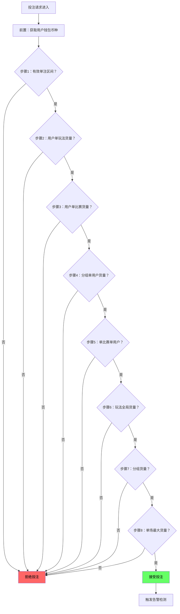

# 第一章 模块概述

## 1.1 定位

风控管理是操盘系统的全局配置中心，负责设定联赛限额、用户限额、玩法限额、串关限额和告警阈值。配置按「联赛等级」和「用户等级」两个维度生效，通过联赛管理模块将联赛绑定到具体等级后，该联赛下所有赛事自动继承对应等级的限额配置。

## 1.1.1 核心术语

本模块涉及两类金额约束，命名规则如下：

| 术语 | 含义 | 典型配置项 |
|------|------|-----------|
| **货量** | 累计投注额上限——多笔投注的合计值不得超过该值 | 单场最大货量、玩法分组最大货量、单用户单比赛最大货量、玩法全局最大货量、串关总货量上限 |
| **限额** | 单笔投注额约束——每一笔投注独立判定 | 单注限额（min~max）、串关单注限额 |

区分方式：看名字中带"货量"还是"限额"。货量是跑流水的累计池子，限额是单笔的门槛。

**单场最大货量开关**：联赛限额面板中每档等级的单场最大货量附带开关（默认开启，风控管理配置）。关闭后投注校验跳过步骤8（单场最大货量校验），赛事级总货量无硬上限，仅受玩法分组货量和用户维度约束。详见[第二章 2.8 节](./02-赛事限额.md#28-单场最大货量开关)及[第八章 8.3 节步骤8](./08-投注校验流程.md#步骤8联赛限额单场最大货量校验受开关控制)。

**单比赛单用户最大货量开关**：联赛限额面板中每档等级的单比赛单用户最大货量附带开关（默认开启，风控管理配置）。关闭后投注校验跳过步骤5（单比赛单用户货量校验），用户在单场比赛的总投注仅受玩法分组单用户货量（步骤4）约束。详见[第二章 2.8.1 节](./02-赛事限额.md#281-单比赛单用户最大货量开关)及[第八章 8.3 节步骤5](./08-投注校验流程.md#步骤5联赛限额单比赛单用户货量校验)。

## 1.2 限额体系架构

系统采用 **5面板** 的限额与告警架构，以 **币种** 作为所有限额配置的顶层维度。每个币种独立配置一套完整限额值，投注请求按用户钱包币种查询对应限额表，不做汇率换算。投注请求必须同时满足所有维度的限额校验才能被接受。

### 1.2.0 多币种架构

| 规则项 | 写死口径 |
|--------|----------|
| 币种配置方式 | 每币种独立配置一套完整限额值（非汇率换算） |
| 币种维度 | 系统全局配置，所有联赛统一币种列表（默认值为 CNY，系统管理配置） |
| 投注校验 | 按用户钱包币种查询对应限额，不做汇率换算 |
| 货量统计 | 不同币种的货量累计独立统计，互不干扰 |
| 不受币种影响 | 告警阈值中的比例类（偏离阈值、单边阈值、货量接近上限）、赔率边界（HK范围、RTP范围、单次调幅）、开关类配置 |

一期支持币种（默认值为 CNY，系统管理配置）：

| 币种代码 | 名称 | 最小精度 |
|---------|------|:--------:|
| CNY | 人民币 | 1元 |
| USD | 美元 | 1美元 |
| VND | 越南盾 | 1,000盾 |
| THB | 泰铢 | 1铢 |
| PHP | 菲律宾比索 | 1比索 |
| KRW | 韩元 | 1,000元 |

| 面板 | 控制对象 | 核心配置项 | 币种维度 |
| ---- | -------- | ---------- | -------- |
| 联赛限额 | 单场比赛的总货量与用户维度 | 11档等级（默认 + 等级1至10），每档含：单场最大货量、单比赛单用户最大货量、6个玩法分组（每组含：最大货量、单用户最大货量、单注限额 min至max） | 按币种独立配置 |
| 用户限额 | 单个用户的投注行为 | 单比赛货量、单玩法货量、单注投注区间（min~max） | 按币种独立配置 |
| 玩法限额 | 单个玩法的全局跨赛事货量 | 208种FT Soccer玩法按6组展示，每个BetTypeId独立配置全局最大货量 | 按币种独立配置 |
| 串关限额 | 串关投注行为 | 2串1至10串1单笔/总量限额、复式串关（跟随最高串关场数限额） | 按币种独立配置 |
| 告警阈值 | 风险预警触发 | 5类告警（偏离、单边、风险敞口、大额投注、货量接近上限）的触发条件 | 金额类2项按币种，比例类3项统一 |

### 1.2.1 玩法分组定义（写死6组）

分组维度为（BetTypeId × EventGroupType），按以下优先级判定归属：

| 优先级 | 条件 | 归入分组 |
|:------:|------|---------|
| 1 | EventGroupType = 2（Corner） | **角球** |
| 2 | EventGroupType = 3（Bookings/Special） | **特殊** |
| 3 | EventGroupType = 1（Main），BetType 为 Handicap 类 | **让球** |
| 4 | EventGroupType = 1（Main），BetType 为 Over/Under 类 | **大小** |
| 5 | EventGroupType = 1（Main），BetType 为 Goals/Match Result 类 | **进球** |
| 6 | EventGroupType = 1（Main），BetType 为 Halves/Period 类 | **半场** |
| 7 | EventGroupType = 1（Main），其余所有 | **特殊** |

> 完整 BetTypeId 映射见 ref-6组映射表-confirmed.md（SSOT）。

### 1.2.2 联赛限额与玩法限额的两层关系

| 层次 | 维度 | 说明 |
|------|------|------|
| 联赛限额→玩法分组限额 | 单场比赛 | 控制"这场比赛的让球组最多接受多少货量" |
| 玩法限额→BetType全局限额 | 跨赛事全局 | 控制"BT6波胆在所有赛事合计最多接受多少货量" |

两层独立校验，投注必须同时满足。

### 1.2.3 单注限额与用户单注区间

单注限额配置在联赛限额→玩法分组级别，与用户限额中的单注区间独立配置，校验时取交集（两者取较严格的范围）。完整交集计算公式与示例见[第八章 8.3 节步骤1](./08-投注校验流程.md#步骤1有效单注区间校验)。

### 1.2.4 可操盘玩法与限额玩法的区分

| 维度 | 可操盘玩法（17种） | 限额玩法（208种） |
|------|-------------------|-----------------|
| 定义 | 操盘手可编辑赔率、控制数据源开关的玩法 | 系统所有 FT Soccer 玩法 |
| 管理范围 | 操盘页（赛事级操作） | 风控管理（全局限额配置） |
| 数据源控制 | 可开启/关闭数据源跟随 | 透传玩法强制开启跟随 |
| 限额配置 | 通过所属分组继承联赛限额 | 全部208种需配置全局最大货量 |
| SSOT | 操盘详情第10章 第10.7.1节 | 风控管理第4章 第4.1节 |

> 可操盘玩法是限额玩法的子集（17 ⊂ 208）。有渲染器映射不等于可操盘——渲染器映射控制展示方式，可操盘控制编辑权限。

## 1.3 限额生效优先级（8步校验链路）

投注请求在进入系统后，先获取用户钱包币种，再按以下顺序逐级校验（8步），任一步失败即拒绝。所有限额值从该币种的配置表中查询。

| 步骤 | 校验内容 | 数据来源 |
|:----:|---------|---------|
| 前置 | 获取用户钱包币种，确定限额查询的币种维度 | 用户钱包 |
| 1 | 有效单注区间校验（用户单注区间 与 单注限额取交集） | 用户限额 + 联赛限额单注限额 |
| 2 | 用户单玩法货量校验 | 用户限额面板 |
| 3 | 用户单比赛货量校验 | 用户限额面板 |
| 4 | 联赛限额→玩法分组单用户货量校验 | 联赛限额面板 |
| 5 | 联赛限额→单比赛单用户货量校验（受开关控制，默认启用） | 联赛限额面板 |
| 6 | 玩法全局货量校验（BetTypeId级，跨赛事合计） | 玩法限额面板 |
| 7 | 联赛限额→玩法分组货量校验 | 联赛限额面板 |
| 8 | 联赛限额→单场最大货量校验（受开关控制，默认启用） | 联赛限额面板 |

**关键原则**：有效限额 = 所有维度限额中的最小值。即：某笔投注能否通过，由它在每个维度上是否超限决定——任一维度超限即拒绝。

## 1.4 配置项归属总览

| 配置项 | 归属模块 |
|--------|---------|
| 联赛限额（11档等级 × 6组玩法分组） | 风控管理（[第二章](./02-赛事限额.md)） |
| 用户限额（单比赛 / 单玩法 / 单注投注区间） | 风控管理（[第三章](./03-用户限额.md)） |
| 玩法限额（208种FT Soccer BetType全局限额） | 风控管理（[第四章](./04-玩法限额与分组.md)） |
| 串关限额（2串1至10串1 + 复式串关） | 风控管理（[第五章](./05-串关限额.md)） |
| 告警阈值（5类告警条件） | 风控管理（[第七章](./07-告警阈值.md)） |
| 赔率边界、RTP 范围、单次调幅 | 系统级写死（修改需发版，见[第九章](./09-配置项归属汇总.md)） |
| 联赛等级绑定、数据源跟随、操盘手、玩法启用 | 联赛管理 |
| 系统支持币种列表（默认值为 CNY）、默认币种 | 系统管理 |
| HK 落库精度、风险注单超时、数据源同步间隔 | 系统级写死（修改需发版） |

> 详细配置项与默认值见[第九章配置项归属汇总](./09-配置项归属汇总.md)。
