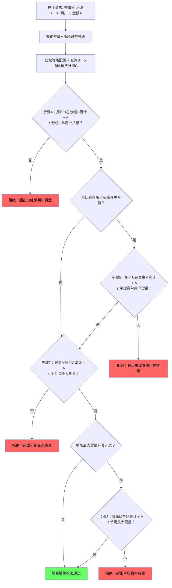

# 第二章 联赛限额

## 2.1 等级体系

联赛限额按联赛等级分为11档（默认 + 等级1至等级10），等级数字越小代表联赛越重要、限额越高。联赛管理中为每个联赛分配等级后，该联赛下所有赛事使用该等级的限额配置。未分配等级的联赛使用「默认」档配置。

**币种维度**：联赛限额以币种作为顶层维度，每个币种独立配置一套完整的11档等级限额值。切换币种后，下方所有等级配置切换到该币种的值。本章默认值均以 CNY 为基准。

### 2.1.1 等级主表

| 等级 | 单场最大货量 | 单比赛单用户最大货量 | 典型联赛 |
| ---- | ----------: | ------------------: | -------- |
| 默认 | 200,000 | 20,000 | 未分配等级的联赛 |
| 等级1 | 1,000,000 | 100,000 | 英超、西甲、欧冠 |
| 等级2 | 800,000 | 80,000 | 德甲、意甲、法甲 |
| 等级3 | 600,000 | 60,000 | 荷甲、葡超 |
| 等级4 | 500,000 | 50,000 | 土超、俄超 |
| 等级5 | 400,000 | 40,000 | 比甲、苏超 |
| 等级6 | 300,000 | 30,000 | 日职、韩K |
| 等级7 | 200,000 | 20,000 | 中超、澳超 |
| 等级8 | 150,000 | 15,000 | 二级联赛（英冠等） |
| 等级9 | 100,000 | 10,000 | 三级联赛 |
| 等级10 | 50,000 | 5,000 | 四级及以下 |

> 以上为 CNY 默认值（风控管理配置），精度为整数（不使用小数）。其他币种需独立配置一套完整值，不做汇率换算。

### 2.1.2 多币种默认值对比（等级1参考）

| 配置项 | CNY | USD | VND |
|--------|----:|----:|----:|
| 单场最大货量 | 1,000,000 | 150,000 | 3,500,000,000 |
| 单比赛单用户最大货量 | 100,000 | 15,000 | 350,000,000 |
| 让球组最大货量 | 300,000 | 45,000 | 1,050,000,000 |
| 让球组单用户最大货量 | 50,000 | 7,500 | 175,000,000 |
| 单注限额 min | 2 | 0.5 | 5,000 |
| 单注限额 max | 20,000 | 3,000 | 70,000,000 |

> 以上 USD/VND 为参考值（运营可调，风控管理配置），按各币种市场惯例取整数。新增币种后需为该币种配置全套11档等级限额。

## 2.2 联赛限额配置结构

每档等级包含以下3层配置：

```
联赛限额 - 等级N
  ├── 单场比赛最大货量（整场上限）
  ├── 单比赛单用户最大货量（受开关控制，默认启用）
  └── 6个玩法分组（让球/大小/角球/进球/半场/特殊）
       ├── 最大货量（该分组在单场比赛的限额）
       ├── 单用户最大货量
       └── 单注限额 min~max（单用户单注区间）
```

### 2.2.1 玩法分组定义

分组维度为（BetTypeId × EventGroupType），6个分组为：让球、大小、角球、进球、半场、特殊。完整判定规则与 BetTypeId 映射见[第一章 1.2.1 节](./01-模块概述.md#121-玩法分组定义)及 ref-6组映射表-confirmed.md（SSOT）。

## 2.3 等级1完整配置（参考基准）

以等级1为参考基准，展示6个玩法分组的全部配置项：

| 玩法分组 | 最大货量 | 单用户最大货量 | 单注限额 min | 单注限额 max |
| -------- | -------: | ------------: | ----------: | ----------: |
| 让球 | 300,000 | 50,000 | 2 | 20,000 |
| 大小 | 300,000 | 50,000 | 2 | 20,000 |
| 角球 | 100,000 | 20,000 | 2 | 10,000 |
| 进球 | 150,000 | 30,000 | 2 | 15,000 |
| 半场 | 100,000 | 20,000 | 2 | 10,000 |
| 特殊 | 80,000 | 15,000 | 2 | 5,000 |

> 以上为默认值（风控管理配置）。其余等级按比例递减，详见下文 [2.4](#24-全等级玩法分组最大货量)~[2.6](#26-全等级玩法分组单注限额) 完整矩阵。

## 2.4 全等级玩法分组最大货量

| 等级 | 让球 | 大小 | 角球 | 进球 | 半场 | 特殊 |
| ---- | ---: | ---: | ---: | ---: | ---: | ---: |
| 默认 | 60,000 | 60,000 | 20,000 | 30,000 | 20,000 | 16,000 |
| 等级1 | 300,000 | 300,000 | 100,000 | 150,000 | 100,000 | 80,000 |
| 等级2 | 240,000 | 240,000 | 80,000 | 120,000 | 80,000 | 65,000 |
| 等级3 | 180,000 | 180,000 | 60,000 | 90,000 | 60,000 | 50,000 |
| 等级4 | 150,000 | 150,000 | 50,000 | 75,000 | 50,000 | 40,000 |
| 等级5 | 120,000 | 120,000 | 40,000 | 60,000 | 40,000 | 30,000 |
| 等级6 | 90,000 | 90,000 | 30,000 | 45,000 | 30,000 | 25,000 |
| 等级7 | 60,000 | 60,000 | 20,000 | 30,000 | 20,000 | 16,000 |
| 等级8 | 45,000 | 45,000 | 15,000 | 23,000 | 15,000 | 12,000 |
| 等级9 | 30,000 | 30,000 | 10,000 | 15,000 | 10,000 | 8,000 |
| 等级10 | 15,000 | 15,000 | 5,000 | 8,000 | 5,000 | 4,000 |

> 以上为默认值（风控管理配置）。

## 2.5 全等级玩法分组单用户最大货量

| 等级 | 让球 | 大小 | 角球 | 进球 | 半场 | 特殊 |
| ---- | ---: | ---: | ---: | ---: | ---: | ---: |
| 默认 | 10,000 | 10,000 | 4,000 | 6,000 | 4,000 | 3,000 |
| 等级1 | 50,000 | 50,000 | 20,000 | 30,000 | 20,000 | 15,000 |
| 等级2 | 40,000 | 40,000 | 16,000 | 24,000 | 16,000 | 12,000 |
| 等级3 | 30,000 | 30,000 | 12,000 | 18,000 | 12,000 | 9,000 |
| 等级4 | 25,000 | 25,000 | 10,000 | 15,000 | 10,000 | 8,000 |
| 等级5 | 20,000 | 20,000 | 8,000 | 12,000 | 8,000 | 6,000 |
| 等级6 | 15,000 | 15,000 | 6,000 | 9,000 | 6,000 | 5,000 |
| 等级7 | 10,000 | 10,000 | 4,000 | 6,000 | 4,000 | 3,000 |
| 等级8 | 8,000 | 8,000 | 3,000 | 5,000 | 3,000 | 2,000 |
| 等级9 | 5,000 | 5,000 | 2,000 | 3,000 | 2,000 | 2,000 |
| 等级10 | 3,000 | 3,000 | 1,000 | 2,000 | 1,000 | 1,000 |

> 以上为默认值（风控管理配置）。

## 2.6 全等级玩法分组单注限额

单注限额 min 所有等级统一为 2 元（默认值，风控管理配置），以下仅展示 max 值：

| 等级 | 让球 max | 大小 max | 角球 max | 进球 max | 半场 max | 特殊 max |
| ---- | -------: | -------: | -------: | -------: | -------: | -------: |
| 默认 | 4,000 | 4,000 | 2,000 | 3,000 | 2,000 | 1,000 |
| 等级1 | 20,000 | 20,000 | 10,000 | 15,000 | 10,000 | 5,000 |
| 等级2 | 16,000 | 16,000 | 8,000 | 12,000 | 8,000 | 4,000 |
| 等级3 | 12,000 | 12,000 | 6,000 | 9,000 | 6,000 | 3,000 |
| 等级4 | 10,000 | 10,000 | 5,000 | 8,000 | 5,000 | 3,000 |
| 等级5 | 8,000 | 8,000 | 4,000 | 6,000 | 4,000 | 2,000 |
| 等级6 | 6,000 | 6,000 | 3,000 | 5,000 | 3,000 | 2,000 |
| 等级7 | 4,000 | 4,000 | 2,000 | 3,000 | 2,000 | 1,000 |
| 等级8 | 3,000 | 3,000 | 2,000 | 2,000 | 2,000 | 1,000 |
| 等级9 | 2,000 | 2,000 | 1,000 | 2,000 | 1,000 | 500 |
| 等级10 | 1,000 | 1,000 | 500 | 800 | 500 | 300 |

> 以上为默认值（风控管理配置）。单注限额 min 统一为 2 元，单注限额 max 按比例递减。

## 2.7 多层限额关系

联赛限额内部存在三层约束：

- **单场最大货量**：该场比赛所有玩法投注额之和的上限（硬上限）
- **单比赛单用户最大货量**：单个用户在该场比赛所有玩法投注额之和的上限
- **玩法分组限额**：该场比赛某一分组内所有玩法投注额之和的上限（含组内单用户限额和单注限额）

三层关系为：6个玩法分组最大货量之和**不要求**等于单场最大货量。单场限额是硬上限，分组限额提供更精细的控制。

以等级1为例：6个玩法分组最大货量之和 = 300,000 + 300,000 + 100,000 + 150,000 + 100,000 + 80,000 = 1,030,000，大于单场最大货量 1,000,000。这意味着不是所有分组能同时打满——整场限额为最终约束。

### 2.7.1 联赛限额与玩法限额的关系

| 层次 | 维度 | 说明 |
|------|------|------|
| 联赛限额→玩法分组限额 | 单场比赛 | 控制"这场比赛的让球组最多接受多少货量" |
| 玩法限额→BetType全局限额 | 跨赛事全局 | 控制"BT6波胆在所有赛事合计最多接受多少货量" |

两层独立校验，投注必须同时满足。详见[第四章玩法限额](./04-玩法限额与分组.md)。

## 2.8 单场最大货量开关

每档等级的单场最大货量配置项附带一个开关控制（默认启用，风控管理配置）。

**开启时（默认）**：投注校验8步链路完整执行，步骤8校验单场最大货量。

**关闭时**：步骤8跳过，不校验单场最大货量。此时赛事级总货量无硬上限，仅受玩法分组限额（步骤7）和单比赛用户限额（步骤5）约束。

适用场景：部分低级别联赛或友谊赛，运营希望取消赛事级货量上限，仅依赖玩法分组和用户维度控制风险。

**风险提示**：关闭开关后，步骤7（玩法分组货量）成为事实上最粗粒度的兜底。6个玩法分组的货量上限之和通常大于单场最大货量（见 [2.7 节](#27-多层限额关系)），关闭开关意味着赛事级硬上限消失，单场可承接的实际总量由各分组上限之和决定。

以等级1为例：单场最大货量 = 1,000,000，6个分组货量上限之和 = 300,000 + 300,000 + 100,000 + 150,000 + 100,000 + 80,000 = 1,030,000。默认配置下差距仅 3%，风险可控。但若运营单独上调某些分组（例如将让球和大小各调至 500,000），分组合计可达 1,430,000，单场理论承接量将上升 43%。操盘手在关闭开关前，应评估该档位下各分组货量上限的合计值是否在可接受的风险范围内。

> 开关状态影响投注校验步骤8的执行，详见[第八章投注校验流程](./08-投注校验流程.md)。

## 2.8.1 单比赛单用户最大货量开关

每档等级的单比赛单用户最大货量配置项附带一个开关控制（默认启用，风控管理配置）。

**开启时（默认）**：投注校验8步链路中步骤5正常执行，校验单比赛单用户货量。

**关闭时**：步骤5跳过，不校验单比赛单用户货量。此时用户在单场比赛的总投注仅受玩法分组单用户货量（步骤4）约束。

适用场景：部分高级别联赛或特殊赛事（如杯赛决赛），运营希望取消赛事级单用户货量上限，仅依赖玩法分组单用户货量控制风险。

**风险提示**：关闭开关后，步骤4（玩法分组单用户货量）成为用户维度最粗粒度的兜底。6个玩法分组的单用户货量上限之和通常大于单比赛单用户最大货量。关闭开关意味着赛事级用户货量上限消失，用户在单场可投注的实际总量由各分组单用户上限之和决定。

以等级1为例：单比赛单用户最大货量 = 100,000，6个分组单用户货量上限之和 = 50,000 + 50,000 + 20,000 + 30,000 + 20,000 + 15,000 = 185,000。默认配置下差距较大（85%），关闭开关后用户理论上可投注最高 185,000。操盘手在关闭开关前，应评估该档位下各分组单用户货量上限的合计值是否在可接受的风险范围内。

> 开关状态影响投注校验步骤5的执行，详见[第八章投注校验流程](./08-投注校验流程.md)。

## 2.9 单注限额校验口径

单注限额与用户限额中的单注区间独立配置，校验时取交集（两者取较严格的范围，详见[第八章 8.3 节步骤1](./08-投注校验流程.md#步骤1有效单注区间校验)）。

**示例**：

```
场景A：正常用户投注英超让球
  用户等级"默认"单注区间：2 ~ 20,000
  等级1让球组单注限额：2 ~ 20,000
  有效区间 = max(2, 2) ~ min(20,000, 20,000) = 2 ~ 20,000

场景B：受限用户投注英超让球
  某用户被限制为单注区间 2 ~ 5,000
  等级1让球组单注限额：2 ~ 20,000
  有效区间 = max(2, 2) ~ min(5,000, 20,000) = 2 ~ 5,000（用户更严格，生效）

场景C：低级联赛特殊组
  用户等级"默认"单注区间：2 ~ 20,000
  等级10特殊组单注限额：2 ~ 300
  有效区间 = max(2, 2) ~ min(20,000, 300) = 2 ~ 300（单注更严格，生效）
```

## 2.10 联赛限额校验流程

联赛限额校验涉及8步链路中的5个步骤：

| 步骤 | 校验内容 | 说明 |
|:----:|---------|------|
| 1 | 有效单注区间（用户单注区间 与 联赛限额单注限额取交集） | 联赛限额提供单注限额 min 至 max，与用户限额联合校验 |
| 4 | 联赛限额→玩法分组单用户货量 | 纯联赛限额维度 |
| 5 | 联赛限额→单比赛单用户货量 | 纯联赛限额维度 |
| 7 | 联赛限额→玩法分组货量 | 纯联赛限额维度 |
| 8 | 联赛限额→单场最大货量（若开关开启） | 纯联赛限额维度，受开关控制 |

其中步骤1为跨面板联合校验（用户限额 + 联赛限额），以下流程图展示步骤4、5、7、8的纯联赛限额维度逻辑：



> 完整8步校验链路见[第一章 1.3 节](./01-模块概述.md#13-投注校验链路总览)及[第八章投注校验流程](./08-投注校验流程.md)。步骤1（单注区间交集）详见 [2.9 节](#29-单注限额校验口径)及[第八章 8.3 节步骤1](./08-投注校验流程.md#步骤1有效单注区间校验)。步骤5受单比赛单用户最大货量开关控制（默认启用），关闭时跳过步骤5直接进入步骤7，详见 [2.8.1 节](#281-单比赛单用户最大货量开关)。

## 2.11 数值示例

**场景**：英超比赛（等级1），用户U投注让球（BT1，属让球组）50,000元。

```
已知条件：
  联赛等级 = 1
  等级1单场最大货量 = 1,000,000
  等级1单比赛单用户最大货量 = 100,000
  等级1让球组最大货量 = 300,000
  等级1让球组单用户最大货量 = 50,000
  等级1让球组单注限额 = 2 ~ 20,000
  用户U单注区间 = 2 ~ 20,000

  当前该场已接受总货量 = 650,000
  当前该场让球组已接受货量 = 200,000
  用户U在该场已接受总货量 = 70,000
  用户U在该场让球组已接受货量 = 30,000
  本次投注金额 = 50,000

校验步骤（联赛限额维度，对应8步链路中的步骤4~8）：

步骤4：分组单用户货量校验
  用户U让球组已接受 + 本次投注 = 30,000 + 50,000 = 80,000
  80,000 > 50,000（让球组单用户限额）
  结论：拒绝，超出让球组单用户限额

该笔投注让球组最多还能接受（用户维度） = 50,000 - 30,000 = 20,000
```

**场景1-B**：用户U改为投注15,000元（修正后重新校验）。

```
步骤4：分组单用户货量校验
  用户U让球组已接受 + 本次投注 = 30,000 + 15,000 = 45,000
  45,000 ≤ 50,000（让球组单用户货量）
  结论：通过

步骤5：单比赛单用户货量校验
  用户U该场已接受 + 本次投注 = 70,000 + 15,000 = 85,000
  85,000 ≤ 100,000（单比赛单用户货量）
  结论：通过

步骤7：分组货量校验
  让球组已接受 + 本次投注 = 200,000 + 15,000 = 215,000
  215,000 ≤ 300,000（让球组最大货量）
  结论：通过

步骤8：单场最大货量校验（开关开启）
  该场已接受 + 本次投注 = 650,000 + 15,000 = 665,000
  665,000 ≤ 1,000,000（单场最大货量）
  结论：通过

最终结论：联赛限额维度校验全部通过
```

### 场景2：步骤8拦截——单场最大货量耗尽

**条件**：英超比赛（等级1），该场已接受总货量接近上限，用户V投注让球20,000元。

```
已知条件：
  联赛等级 = 1
  等级1单场最大货量 = 1,000,000（开关开启）
  等级1让球组最大货量 = 300,000
  等级1让球组单用户货量 = 50,000
  等级1单比赛单用户货量 = 100,000

  当前该场已接受总货量 = 990,000
  当前该场让球组已接受货量 = 250,000
  用户V在该场已接受总货量 = 30,000
  用户V在该场让球组已接受货量 = 10,000
  本次投注金额 = 20,000

步骤4：分组单用户货量校验
  用户V让球组累计 + 本次投注 = 10,000 + 20,000 = 30,000
  30,000 ≤ 50,000
  结论：通过

步骤5：单比赛单用户货量校验
  用户V该场累计 + 本次投注 = 30,000 + 20,000 = 50,000
  50,000 ≤ 100,000
  结论：通过

步骤7：分组货量校验
  让球组累计 + 本次投注 = 250,000 + 20,000 = 270,000
  270,000 ≤ 300,000
  结论：通过

步骤8：单场最大货量校验（开关开启）
  该场累计 + 本次投注 = 990,000 + 20,000 = 1,010,000
  1,010,000 > 1,000,000
  结论：拒绝——超出单场最大货量

该笔投注单场最多还能接受 = 1,000,000 - 990,000 = 10,000
```

**关键点**：用户V的个人额度和分组额度都未超，但全场容量已满，步骤8拦截。这就是单场最大货量作为「硬天花板」的作用——防止单场赛事总敞口过大。

### 场景3：开关关闭——同一笔投注通过

**条件**：与场景2完全相同，但单场最大货量开关已关闭。

```
步骤4：同场景2 → 通过（30,000 ≤ 50,000）
步骤5：同场景2 → 通过（50,000 ≤ 100,000）
步骤7：同场景2 → 通过（270,000 ≤ 300,000）
步骤8：开关关闭，跳过

最终结论：联赛限额维度校验全部通过
```

**对比**：同一笔投注在开关开启时被步骤8拒绝，关闭后通过。此时赛事总货量达 1,010,000，超过原配置值 1,000,000，但因开关关闭，系统不做拦截。风险由各分组货量上限兜底。

### 场景4：边界值——刚好等于限额

**条件**：英超比赛（等级1），用户W让球组累计刚好触达上限边界。

```
已知条件：
  等级1让球组单用户货量 = 50,000
  等级1单比赛单用户货量 = 100,000
  等级1让球组最大货量 = 300,000
  等级1单场最大货量 = 1,000,000（开关开启）

  用户W让球组已接受 = 45,000
  用户W该场已接受 = 95,000
  让球组已接受 = 295,000
  该场已接受 = 995,000
  本次投注金额 = 5,000

步骤4：45,000 + 5,000 = 50,000，50,000 ≤ 50,000 → 通过（恰好等于上限）
步骤5：95,000 + 5,000 = 100,000，100,000 ≤ 100,000 → 通过（恰好等于上限）
步骤7：295,000 + 5,000 = 300,000，300,000 ≤ 300,000 → 通过（恰好等于上限）
步骤8：995,000 + 5,000 = 1,000,000，1,000,000 ≤ 1,000,000 → 通过（恰好等于上限）

最终结论：全部通过——校验条件为"≤"，恰好等于上限属于通过
```

**后续影响**：该用户让球组额度已满（50,000 = 50,000），下一笔让球投注必定在步骤4被拒。但该用户仍可投注其他分组（如大小组），只要其他维度未超限。

### 场景5：跨分组投注——让球满额后投大小

**条件**：紧接场景4，用户W让球组已满，改投大小组10,000元。

```
已知条件（承接场景4结果）：
  用户W让球组已接受 = 50,000（已满）
  用户W大小组已接受 = 20,000
  用户W该场已接受 = 100,000（已满）
  大小组已接受 = 180,000
  该场已接受 = 1,000,000（已满）
  本次投注金额 = 10,000，玩法分组 = 大小

步骤4：用户W大小组累计 + 本次投注 = 20,000 + 10,000 = 30,000
  30,000 ≤ 50,000（大小组单用户货量）
  结论：通过

步骤5：用户W该场累计 + 本次投注 = 100,000 + 10,000 = 110,000
  110,000 > 100,000（单比赛单用户货量）
  结论：拒绝——超出单比赛单用户货量
```

**关键点**：虽然大小组个人额度未超，但用户W的单比赛总货量已达上限，步骤5拦截。单比赛单用户货量是跨分组的总量约束——不是"让球满了还能全额投大小"，而是受到赛事级用户总量限制。

### 场景6：步骤7拦截——分组总货量耗尽

**条件**：英超比赛（等级1），角球组全场已接近上限，用户X投注角球5,000元。

```
已知条件：
  联赛等级 = 1
  等级1角球组最大货量 = 100,000
  等级1角球组单用户货量 = 20,000
  等级1单比赛单用户货量 = 100,000
  等级1单场最大货量 = 1,000,000（开关开启）

  用户X在该场角球组已接受 = 8,000
  用户X在该场已接受总货量 = 40,000
  该场角球组已接受货量 = 97,000
  该场已接受总货量 = 500,000
  本次投注金额 = 5,000

步骤4：分组单用户货量校验
  用户X角球组累计 + 本次投注 = 8,000 + 5,000 = 13,000
  13,000 ≤ 20,000（角球组单用户货量）
  结论：通过

步骤5：单比赛单用户货量校验
  用户X该场累计 + 本次投注 = 40,000 + 5,000 = 45,000
  45,000 ≤ 100,000（单比赛单用户货量）
  结论：通过

步骤7：分组货量校验
  角球组累计 + 本次投注 = 97,000 + 5,000 = 102,000
  102,000 > 100,000（角球组最大货量）
  结论：拒绝——超出角球组最大货量

该场角球组最多还能接受 = 100,000 - 97,000 = 3,000
```

**关键点**：用户个人额度和赛事总额度均未超，但角球组整体容量已满。步骤7是分组级的「天花板」——即使单个用户还有空间，全场多用户合计已达上限。此时用户仍可投注其他分组（如让球、大小），不受角球组的影响。

### 场景7：步骤1拦截——低等级联赛单注超限

**条件**：四级联赛比赛（等级10），用户Y首次投注特殊组500元。

```
已知条件：
  联赛等级 = 10
  等级10特殊组单注限额 = 2 ~ 300
  用户Y单注区间 = 2 ~ 20,000

  有效单注区间计算：
    有效 min = 用户 min 与 分组 min 取较大值 = max(2, 2) = 2
    有效 max = 用户 max 与 分组 max 取较小值 = min(20,000, 300) = 300
    有效单注区间 = 2 ~ 300

  本次投注金额 = 500

步骤1：有效单注区间校验
  500 > 300（有效单注区间 max）
  结论：拒绝——投注金额超出有效单注区间上限

该玩法分组最多单注 = 300 元
```

**关键点**：用户本身的单注上限为 20,000，但等级10特殊组的单注限额 max 仅为 300。取交集后有效上限被压到 300。步骤1在链路最前端拦截，成本最低——不需要查询任何累计货量数据。这也展示了低等级联赛通过更严格的单注限额来控制风险。

## 2.12 配置保存校验规则

运营人员在联赛限额面板编辑任意等级的配置后，点击保存时系统必须执行以下校验。任一校验失败，阻止保存并高亮对应输入框，显示提示文案。

### 2.12.1 单值校验

| 校验项 | 规则 | 提示文案 |
|--------|------|---------|
| 单场最大货量 | 必须为正整数（> 0） | "单场最大货量必须大于0" |
| 单比赛单用户最大货量 | 必须为正整数（> 0） | "单比赛单用户最大货量必须大于0" |
| 玩法分组最大货量 | 必须为正整数（> 0） | "{分组名}最大货量必须大于0" |
| 玩法分组单用户最大货量 | 必须为正整数（> 0） | "{分组名}单用户最大货量必须大于0" |
| 单注限额 min | 必须为正整数（> 0） | "{分组名}单注限额最小值必须大于0" |
| 单注限额 max | 必须为正整数（> 0） | "{分组名}单注限额最大值必须大于0" |

### 2.12.2 层级逻辑校验

| 校验项 | 规则 | 提示文案 |
|--------|------|---------|
| 单场 ≥ 单比赛单用户 | 单场最大货量 ≥ 单比赛单用户最大货量 | "单场最大货量不得小于单比赛单用户最大货量" |
| 单场 ≥ 任一分组最大货量 | 单场最大货量 ≥ 每个玩法分组的最大货量 | "单场最大货量不得小于{分组名}最大货量" |
| 分组最大货量 ≥ 分组单用户最大货量 | 每个分组：最大货量 ≥ 单用户最大货量 | "{分组名}最大货量不得小于该分组单用户最大货量" |
| 分组单用户最大货量 ≥ 单注max | 每个分组：单用户最大货量 ≥ 单注限额 max | "{分组名}单用户最大货量不得小于单注限额最大值" |
| 单注min ≤ 单注max | 每个分组：单注限额 min ≤ 单注限额 max | "{分组名}单注限额最小值不得大于最大值" |

### 2.12.3 校验时机与行为

校验在前端执行，点击保存按钮时触发，校验失败不发送请求。多条校验同时失败时，所有失败项同时高亮并展示对应提示文案。运营人员修正后重新点击保存，再次触发全量校验。

> 以上校验规则适用于所有11档等级（默认 + 等级1至10），每个等级独立校验。

---

## 修订记录

| 版本 | 日期 | 修订内容 |
|------|------|---------|
| v1.0 | 2026-03-03 | 初始版本 |
| v1.1 | 2026-04-03 | 单注限额 min 全等级统一从 10 元下调至 2 元；多币种参考值同步调整（USD 2→0.5，VND 35,000→5,000）；所有引用单注 min 的数值示例同步更新 |
