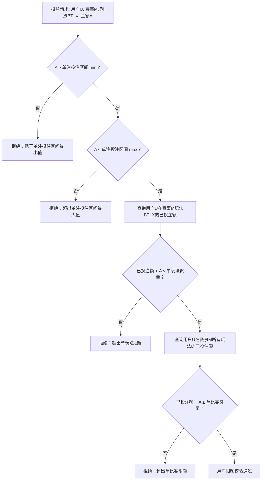

# 第三章 用户限额

## 3.1 三项限额定义

**币种维度**：用户限额以币种作为顶层维度，每个币种独立配置一套完整的三项限额值。投注校验按用户钱包币种查询对应限额，不做汇率换算。本章默认值均以 CNY 为基准。

| 限额项 | CNY 默认值 | USD 参考值 | VND 参考值 | 含义 |
| ------ | ---------: | ---------: | ---------: | ---- |
| 单用户单比赛最大货量 | 100,000 | 15,000 | 350,000,000 | 同一用户在同一场比赛所有玩法累计投注额上限 |
| 单用户单玩法最大货量 | 50,000 | 7,500 | 175,000,000 | 同一用户在同一场比赛同一玩法累计投注额上限 |
| 单注投注区间 | 2 ~ 20,000 | 0.5 ~ 3,000 | 5,000 ~ 70,000,000 | 单笔投注金额范围，2个输入框（最小值、最大值） |

> USD/VND 为参考值（运营可调，风控管理配置），按各币种市场惯例取整数。

## 3.2 三项限额的层级关系

```
单注投注区间 min（2）≤ 投注金额 ≤ 单注投注区间 max（20,000）
    ⊂ 单用户单玩法货量（50,000）
        ⊂ 单用户单比赛货量（100,000）
```

约束关系：单注投注区间 max ≤ 单玩法货量 ≤ 单比赛货量。即：20,000 ≤ 50,000 ≤ 100,000（满足约束）。

## 3.3 用户限额校验流程



## 3.4 有效投注区间为空时的处理

当用户单注区间与玩法分组单注限额取交集后有效区间为空（有效 min > 有效 max），系统拒绝投注并返回以下提示：

| 场景 | 前端提示文案 |
|------|-------------|
| 有效区间为空 | "超出限红" |

## 3.5 数值示例

**场景**：用户张三投注英超比赛的让球（BT1）15,000元。

```
已知条件：
  用户：张三
  单注投注区间 = 2 ~ 20,000
  单玩法货量 = 50,000
  单比赛货量 = 100,000
  张三已在该场BT1投注 = 30,000
  张三已在该场所有玩法投注 = 65,000
  本次投注金额 = 15,000

校验步骤：

步骤1：单注投注额校验
  15,000 ≥ 2（单注投注区间 min）且 15,000 ≤ 20,000（单注投注区间 max）
  结论：通过

步骤2：单玩法货量校验
  BT1已投注 + 本次 = 30,000 + 15,000 = 45,000
  45,000 ≤ 50,000（单玩法限额）
  结论：通过

步骤3：单比赛货量校验
  所有玩法已投注 + 本次 = 65,000 + 15,000 = 80,000
  80,000 ≤ 100,000（单比赛限额）
  结论：通过

最终结论：用户限额校验全部通过
张三在该场BT1还能投注 = min(50,000 - 45,000, 100,000 - 80,000) = min(5,000, 20,000) = 5,000
```

## 3.6 与单注限额的交集关系

用户限额面板的单注投注区间与联赛限额面板的单注限额独立配置，投注校验时取交集（两者取较严格的范围）。用户限额面板控制的是"这个用户能投多大"，单注限额控制的是"这个联赛等级的这个分组允许多大的单注"。完整交集计算公式与示例见[第八章 8.3 节步骤1](./08-投注校验流程.md#步骤1有效单注区间校验)。

## 3.7 用户等级扩展

原型默认展示一个「默认」等级。系统支持新增自定义用户等级（如VIP、受限、黑名单），每个等级独立配置三项限额值。

## 3.8 配置保存校验规则

运营人员在用户限额面板编辑配置后，点击保存时系统必须执行以下校验。任一校验失败，阻止保存并高亮对应输入框，显示提示文案。

### 3.8.1 单值校验

| 校验项 | 规则 | 提示文案 |
|--------|------|---------|
| 单比赛最大货量 | 必须为正整数（> 0） | "单比赛最大货量必须大于0" |
| 单玩法最大货量 | 必须为正整数（> 0） | "单玩法最大货量必须大于0" |
| 单注投注区间 min | 必须为正整数（> 0） | "单注投注区间最小值必须大于0" |
| 单注投注区间 max | 必须为正整数（> 0） | "单注投注区间最大值必须大于0" |

### 3.8.2 层级逻辑校验

| 校验项 | 规则 | 提示文案 |
|--------|------|---------|
| 单比赛 ≥ 单玩法 | 单比赛最大货量 ≥ 单玩法最大货量 | "单比赛最大货量不得小于单玩法最大货量" |
| 单比赛 ≥ 单注max | 单比赛最大货量 ≥ 单注投注区间 max | "单比赛最大货量不得小于单注投注区间最大值" |
| 单玩法 ≥ 单注max | 单玩法最大货量 ≥ 单注投注区间 max | "单玩法最大货量不得小于单注投注区间最大值" |
| 单注min ≤ 单注max | 单注投注区间 min ≤ max | "单注投注区间最小值不得大于最大值" |

### 3.8.3 校验时机与行为

校验在前端执行，点击保存按钮时触发，校验失败不发送请求。多条校验同时失败时，所有失败项同时高亮并展示对应提示文案。

> 用户限额面板若支持多个用户等级（第3.7节），每个等级独立校验。

---

## 修订记录

| 版本 | 日期 | 修订内容 |
|------|------|---------|
| v1.0 | 2026-03-03 | 初始版本 |
| v1.1 | 2026-04-03 | 单注投注区间 min 从 10 元下调至 2 元；多币种参考值同步调整（USD 2→0.5，VND 35,000→5,000）；层级关系示例与数值示例同步更新 |
