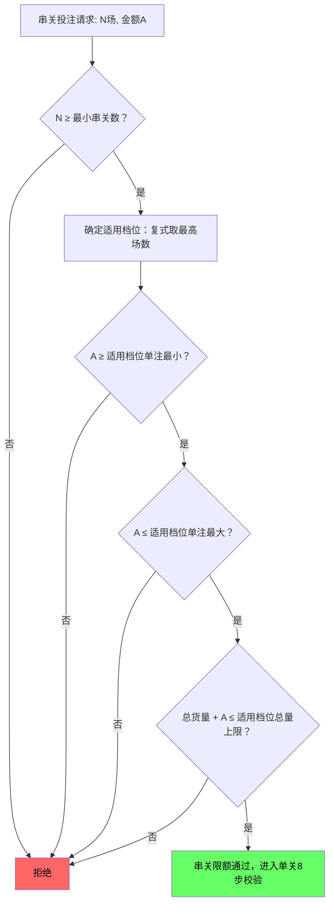

# 第五章 串关限额

## 5.1 基础配置

**币种维度**：串关限额以币种作为顶层维度，每个币种独立配置一套完整的串关限额值。投注校验按用户钱包币种查询对应限额。本章默认值均以 CNY 为基准。

| 配置项 | CNY 默认值 | USD 参考值 | VND 参考值 | 说明 |
| ------ | ---------: | ---------: | ---------: | ---- |
| 最小串关数 | 2 | 2 | 2 | 最少选择2场赛事（不受币种影响） |

> 串关的单注最小和单注最大由每个N串关档位独立配置（见第5.2节），不设全局串关投注区间。以上为默认值（风控管理配置）。

## 5.2 N串关分别限额

| 串关类型 | 单注最小 | 单注最大 | 总货量上限 |
| -------- | -------: | -------: | ---------: |
| 2串1 | 5 | 50,000 | 2,500,000 |
| 3串1 | 5 | 30,000 | 4,000,000 |
| 4串1 | 5 | 20,000 | 5,000,000 |
| 5串1 | 5 | 10,000 | 3,000,000 |
| 6串1 | 5 | 10,000 | 2,500,000 |
| 7串1 | 5 | 5,000 | 700,000 |
| 8串1 | 5 | 5,000 | 300,000 |
| 9串1 | 5 | 5,000 | 60,000 |
| 10串1 | 5 | 3,000 | 30,000 |

> 以上为 CNY 默认值（风控管理配置）。每个N串关独立配置单注最小和单注最大，默认单注最小统一为 5 元，单注最大按串关复杂度递减。10串1为最高串关档位。其他币种需独立配置一套完整的N串关限额值。总货量默认值已按最大组合数场景预留约10%~20%余量（详见第5.3.4节组合数参考表与第5.7.2节下限校验）。

## 5.3 复式串关

### 5.3.1 定义

复式串关指用户选择N场赛事后，系统自动生成多种串关组合的投注方式。例如用户选择3场赛事并勾选"2串1 + 3串1"，系统生成3注2串1和1注3串1，共4注。

### 5.3.2 限额规则

复式串关跟随最高串关场数限额。即：复式串关中包含多种串关类型时，所有注单统一使用其中最高场数对应的限额档位。

**示例**：用户选3场勾选"2串1 + 3串1"，最高场数为3。则：

- 3注2串1和1注3串1，均使用3串1的限额（单注最小 5，单注最大 30,000，总货量上限 4,000,000）
- 不使用2串1的限额（5~50,000 / 2,500,000），以防通过复式方式规避高场数串关的限额约束

**注意**：复式串关跟随的是单注最小/最大限额，不是总投入限额。复式串关的实际总投入 = 单注金额 × 组合数。例如3场全选生成4注（3注2串1 + 1注3串1），单注10,000时总投入为40,000。总投入会超过该档位的单注最大值，这是预期行为——风险控制通过限制单注金额而非总投入实现。

### 5.3.3 数值示例

```
场景：用户选择3场赛事，勾选 2串1 + 3串1
  投注金额：每注 10,000 元
  串关组合：3注2串1 + 1注3串1，共4注
  总投注额 = 4 × 10,000 = 40,000

限额判定：
  最高串关场数 = 3
  适用限额 = 3串1限额（默认值，风控管理配置）
  单注最小 = 5，单注最大 = 30,000
  总货量上限 = 4,000,000

校验：
  单注 10,000 ≥ 5（单注最小）且 10,000 ≤ 30,000（单注最大）→ 通过
  总货量 40,000 ≤ 4,000,000 → 通过
  结论：通过
```

**反例**：

```
场景：用户选择5场赛事，勾选 2串1 + 3串1 + 5串1
  投注金额：每注 15,000 元

限额判定：
  最高串关场数 = 5
  适用限额 = 5串1限额（默认值，风控管理配置）
  单注最小 = 5，单注最大 = 10,000

校验：
  单注 15,000 > 10,000（5串1单注最大）
  结论：拒绝——所有注单均按5串1限额校验，单注超出最大值
```

### 5.3.4 复式串关组合数参考表

用户最多可选择 10 场比赛（受最高串关档位 10串1 限制）。选择 N 场比赛进行 M串1 复式时，组合数 = C(N, M)。

| 选择场数 \ 串关类型 | 2串1 | 3串1 | 4串1 | 5串1 | 6串1 | 7串1 | 8串1 | 9串1 | 10串1 | 全选合计 |
|-------------------|------|------|------|------|------|------|------|------|-------|---------|
| 2场 | 1 | - | - | - | - | - | - | - | - | 1 |
| 3场 | 3 | 1 | - | - | - | - | - | - | - | 4 |
| 4场 | 6 | 4 | 1 | - | - | - | - | - | - | 11 |
| 5场 | 10 | 10 | 5 | 1 | - | - | - | - | - | 26 |
| 6场 | 15 | 20 | 15 | 6 | 1 | - | - | - | - | 57 |
| 7场 | 21 | 35 | 35 | 21 | 7 | 1 | - | - | - | 120 |
| 8场 | 28 | 56 | 70 | 56 | 28 | 8 | 1 | - | - | 247 |
| 9场 | 36 | 84 | 126 | 126 | 84 | 36 | 9 | 1 | - | 502 |
| 10场 | 45 | 120 | 210 | 252 | 210 | 120 | 45 | 10 | 1 | 1,013 |

> 复式串关全选时，总注数 = 该行所有可用组合之和。总投入 = 单注金额 × 总注数。配置总货量时必须考虑最大组合数场景。

## 5.4 串关赔率与派彩计算

串关的综合赔率 = 各场Decimal赔率相乘。派彩 = 投注额 × 综合赔率。

## 5.5 数值示例

**场景**：用户下注3串1，投注20,000元。

```
选项：
  场1：英超让球主队 HK = 0.88，Decimal = 1.88
  场2：西甲大小大 HK = 0.92，Decimal = 1.92
  场3：德甲独赢主胜 HK = 1.50，Decimal = 2.50

步骤1：计算综合赔率
  综合Decimal = 1.88 × 1.92 × 2.50 = 9.024
  综合HK = 9.024 - 1 = 8.024

步骤2：计算预期派彩
  派彩 = 20,000 × 9.024 = 180,480

步骤3：校验3串1单注区间
  20,000 ≥ 5（3串1单注最小，默认值，风控管理配置）且 20,000 ≤ 30,000（3串1单注最大，默认值，风控管理配置）
  结论：通过

步骤4：校验3串1总货量
  假设3串1已有总货量 250,000
  250,000 + 20,000 = 270,000
  270,000 ≤ 4,000,000（3串1总货量上限，默认值，风控管理配置）
  结论：通过

最终结论：串关限额校验通过，每一场进入8步单关校验流程（详见[第八章](./08-投注校验流程.md)）
```

## 5.6 串关限额校验流程



> 复式串关中"适用档位"等于最高串关场数对应的限额档位。串关限额校验通过后，每一场赛事仍需分别通过[第八章](./08-投注校验流程.md)的8步单关校验流程。

## 5.7 配置保存校验规则

运营人员在串关限额面板编辑配置后，点击保存时系统必须执行以下校验。任一校验失败，阻止保存并高亮对应输入框，显示提示文案。

### 5.7.1 N串关分别限额校验（2串1至10串1，逐档校验）

| 校验项 | 规则 | 提示文案 |
|--------|------|---------|
| 单注最小 | 必须为正整数（> 0） | "{N}串1单注最小值必须大于0" |
| 单注最大 | 必须为正整数（> 0） | "{N}串1单注最大值必须大于0" |
| 单注最小 ≤ 单注最大 | 单注最小 ≤ 单注最大 | "{N}串1单注最小值不得大于最大值" |
| 总货量上限 | 必须为正整数（> 0） | "{N}串1总货量上限必须大于0" |
| 单注最大 ≤ 总货量 | 单注最大 ≤ 总货量上限 | "{N}串1单注最大值不得大于总货量上限" |
| 总货量 ≥ 单注最大 × 最大组合数 | 总货量上限 ≥ 单注最大 × C(10, N) | "{N}串1总货量上限不足：单注最大{单注最大} × 最大组合数{C(10,N)} = {最低值}，当前设置为{当前值}" |

各档位最低总货量要求：

| 串关类型 | 最大组合数 C(10,N) | 公式（单注最大 × C） | 最低总货量要求（CNY） |
|---------|-------------------|---------------------|-------------------|
| 2串1 | 45 | 50,000 × 45 | 2,250,000 |
| 3串1 | 120 | 30,000 × 120 | 3,600,000 |
| 4串1 | 210 | 20,000 × 210 | 4,200,000 |
| 5串1 | 252 | 10,000 × 252 | 2,520,000 |
| 6串1 | 210 | 10,000 × 210 | 2,100,000 |
| 7串1 | 120 | 5,000 × 120 | 600,000 |
| 8串1 | 45 | 5,000 × 45 | 225,000 |
| 9串1 | 10 | 5,000 × 10 | 50,000 |
| 10串1 | 1 | 3,000 × 1 | 3,000 |

> 校验公式：总货量上限 ≥ 该档位单注最大 × C(10, N)。C(10, N) 为用户选满 10 场时该档位的最大组合数。运营设置的总货量低于此值时，保存按钮阻止提交并提示具体最低值。

### 5.7.2 校验时机与行为

校验在页面执行，点击保存按钮时触发，校验失败不发送请求。多条校验同时失败时，所有失败项同时高亮并展示对应提示文案。9个档位（2串1至10串1）逐档独立校验。

## 5.8 投注动态限额计算

用户选定比赛场次和串关类型后，服务端实时计算当前可投最大单注金额，页面通过业务规则获取结果并展示，页面不参与任何限额计算逻辑。

服务端计算公式：

```
可投最大单注 = MIN(适用档位单注最大, (适用档位总货量上限 - 已消耗总货量) ÷ 本次总注数)
```

其中：
- 适用档位 = 复式串关中最高串关场数对应的限额档位
- 本次总注数 = 用户勾选的所有串关类型的组合数之和
- 已消耗总货量 = 该档位全局已累计的串关投注额（跨用户合计，仅统计已接受未结算 + 已结算订单，不含已拒绝/已取消）

页面展示规则：
- 页面从服务端获取可投最大单注金额，投注金额输入框的最大值 = 返回值（向下取整到整数）
- 返回值 < 适用档位单注最小时，提示「当前货量不足，无法投注」，投注按钮置灰
- 页面不做任何本地限额计算，所有限额相关逻辑由服务端处理

---

## 修订记录

| 版本 | 日期 | 修订内容 |
|------|------|---------|
| v1.0 | 2026-03-03 | 初始版本：基础配置、N串关限额、复式串关规则、赔率派彩计算、校验流程、配置保存校验 |
| v1.1 | 2026-04-03 | 总货量默认值上调（按最大组合数场景预留余量）；新增第5.3.4节复式串关组合数参考表；第5.7.2节新增总货量下限校验规则；新增第5.8节投注动态限额计算（服务端计算，页面展示）；明确总货量为全局维度（跨用户合计） |
| v1.2 | 2026-04-03 | N串关分别限额从单列"单注限额"改为"单注最小 + 单注最大"双列结构（对齐开发实现），默认单注最小统一为 5 元；校验规则、流程图、数值示例同步更新 |
| v1.3 | 2026-04-03 | 删除全局"串关投注区间 min/max"配置（开发实现中每个N串关已独立配置单注最小/单注最大，无需全局区间）；删除第5.7.1节基础配置校验；流程图移除全局区间校验节点；第5.7节子节编号重排；第5.8节动态限额引用更新为适用档位单注最小 |
