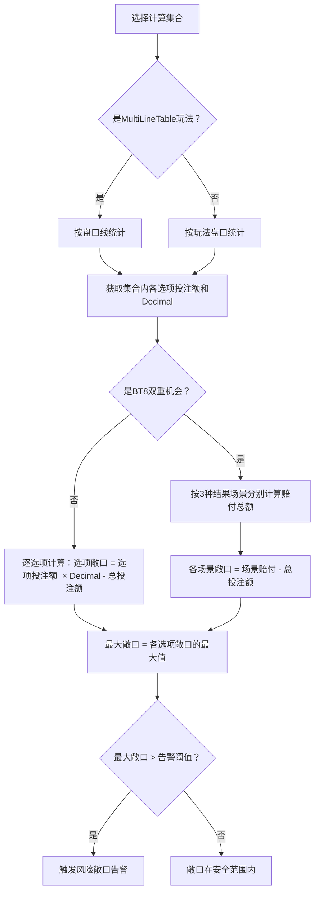

# ~~第六章 风险敞口计算~~

> ~~**本章一期不做，下期补**~~

## 6.1 定义

风险敞口（Risk Exposure）衡量的是：如果某个选项中奖，平台的净亏损金额。敞口为正表示平台亏损，为负表示平台盈利。

## 6.2 标准盘口敞口公式

适用于单赢家、无退回的标准盘口（让球、大小、独赢等）。

```
计算集合：
  MultiLineTable 按"盘口线"统计
  其余渲染器按"玩法盘口"统计
  仅统计已接受未结算

某选项的敞口 = 该选项投注额  × 该选项Decimal - 该集合总投注额

说明：
  "该选项投注额  × 该选项Decimal" = 该选项中奖时平台需支付的总额
  "该集合总投注额" = 平台已收到的总投注金额
  差值即为平台净亏损（正值）或净盈利（负值）
```

## 6.3 数值示例：独赢1X2

**场景**：3个选项的敞口计算。

```
已知条件：
  主胜：Decimal = 1.85，投注额 = 500,000
  和局：Decimal = 3.60，投注额 = 200,000
  客胜：Decimal = 4.10，投注额 = 100,000
  集合总投注额 = 500,000 + 200,000 + 100,000 = 800,000

各结果敞口：

主胜中奖：
  = 500,000  × 1.85 - 800,000
  = 925,000 - 800,000
  = 125,000

和局中奖：
  = 200,000  × 3.60 - 800,000
  = 720,000 - 800,000
  = 负80,000

客胜中奖：
  = 100,000  × 4.10 - 800,000
  = 410,000 - 800,000
  = 负390,000

最大敞口 = max(125,000, 负80,000, 负390,000) = 125,000
风险点：主胜中奖时平台净亏 125,000
```

## 6.4 双重机会（BT8）特殊处理

双重机会有三个选项（1X、12、X2），但比赛结果为三种（主胜、平局、客胜），每种结果有两个选项同时中奖。

```
已知条件：
  1X（主胜或平局）：Decimal = 1.25，投注额 = 300,000
  12（主胜或客胜）：Decimal = 1.15，投注额 = 200,000
  X2（平局或客胜）：Decimal = 2.20，投注额 = 100,000
  集合总投注额 = 300,000 + 200,000 + 100,000 = 600,000

按结果场景计算：

场景1：主胜 → 1X 和 12 同时中奖
  赔付 = 300,000  × 1.25 + 200,000  × 1.15
  = 375,000 + 230,000
  = 605,000
  敞口 = 605,000 - 600,000 = 5,000

场景2：平局 → 1X 和 X2 同时中奖
  赔付 = 300,000  × 1.25 + 100,000  × 2.20
  = 375,000 + 220,000
  = 595,000
  敞口 = 595,000 - 600,000 = 负5,000

场景3：客胜 → 12 和 X2 同时中奖
  赔付 = 200,000  × 1.15 + 100,000  × 2.20
  = 230,000 + 220,000
  = 450,000
  敞口 = 450,000 - 600,000 = 负150,000

最大敞口 = max(5,000, 负5,000, 负150,000) = 5,000
```

## 6.5 风险敞口计算流程


