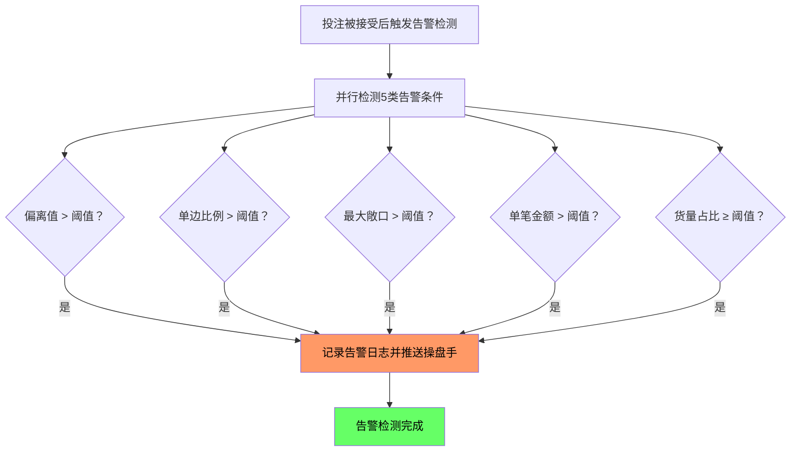

# ~~第七章 告警阈值~~

> ~~**本章一期不做，下期补**~~

## 7.1 五类告警定义

**币种维度说明**：告警阈值中 **金额类**（风险敞口告警、大额投注告警）按币种独立配置，**比例类**（偏离告警、单边告警、货量接近上限告警）为全局统一配置，不受币种影响。

| 告警类型 | 触发条件 | CNY 默认阈值 | 币种维度 | 配置归属 |
| -------- | -------- | ----------: | :------: | -------- |
| 偏离数据源告警 | 本地赔率与IM数据源偏离绝对值超过阈值 | 0.10 | 统一（比例类） | 风控管理 |
| 单边投注告警 | 某选项投注占比超过阈值 | 70% | 统一（比例类） | 风控管理 |
| 风险敞口告警 | 盘口或玩法风险敞口超过阈值 | 1,000,000 | 按币种独立配置 | 风控管理 |
| 大额投注告警 | 单笔投注金额超过阈值 | 50,000 | 按币种独立配置 | 风控管理 |
| 货量接近上限告警 | 比赛或玩法货量达到限额百分比 | 80% | 统一（比例类） | 风控管理 |

多币种金额类告警参考值：

| 告警类型 | CNY | USD | VND |
|---------|----:|----:|----:|
| 风险敞口告警 | 1,000,000 | 150,000 | 3,500,000,000 |
| 大额投注告警 | 50,000 | 7,500 | 175,000,000 |

> 以上为默认值（风控管理配置）。USD/VND 为参考值（运营可调），按各币种市场惯例取整数。

## 7.2 告警计算说明

**偏离数据源告警**

```
偏离值 = 本地HK赔率 - IM HK赔率 的绝对值
触发条件：偏离值 > 0.10（默认值，风控管理配置）

示例：
  本地HK = 0.95，IM HK = 0.82
  偏离值 = 0.95 - 0.82 的绝对值 = 0.13
  0.13 > 0.10 → 触发告警
```

**单边投注告警**

```
单边比例 = Top1选项投注额 ÷ 该盘口总投注额 × 100%
触发条件：单边比例 > 70%（默认值，风控管理配置）

示例：
  让球盘：主队投注 800,000，客队投注 200,000
  总额 = 1,000,000
  主队占比 = 800,000 ÷ 1,000,000 = 80%
  80% > 70% → 触发告警
```

**货量接近上限告警（分组维度）**

```
货量占比 = 当前已接受货量 ÷ 限额 × 100%
触发条件：货量占比 ≥ 80%（默认值，风控管理配置）

示例：
  等级1让球组限额 = 300,000（联赛限额面板，风控管理配置）
  当前让球组已接受 = 250,000
  占比 = 250,000 ÷ 300,000 = 83.3%
  83.3% ≥ 80% → 触发告警
```

**大额投注告警**

```
触发条件：单笔投注金额 > 50,000（默认值，风控管理配置）

示例：
  用户单笔投注 80,000
  80,000 > 50,000 → 触发告警
```

**货量接近上限告警（玩法全局维度）**

```
货量占比 = 某玩法全局已接受货量 ÷ 该玩法限额 × 100%
触发条件：货量占比 ≥ 80%（默认值，风控管理配置）

示例：
  BT6波胆全局限额 = 100,000（玩法限额面板，风控管理配置）
  当前BT6全局已接受 = 82,000
  占比 = 82,000 ÷ 100,000 = 82%
  82% ≥ 80% → 触发告警
```

## 7.3 告警触发决策流程



说明：五类告警为并行检测，每笔投注被接受后同时检测所有告警条件，满足任一条件即触发对应告警。所有阈值均为风控管理配置项，默认值见 7.1 节定义表。
